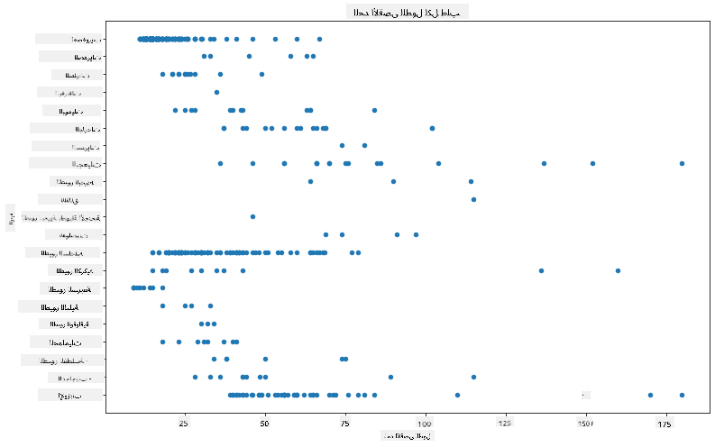
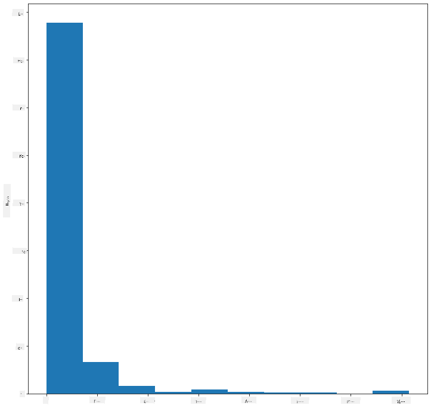
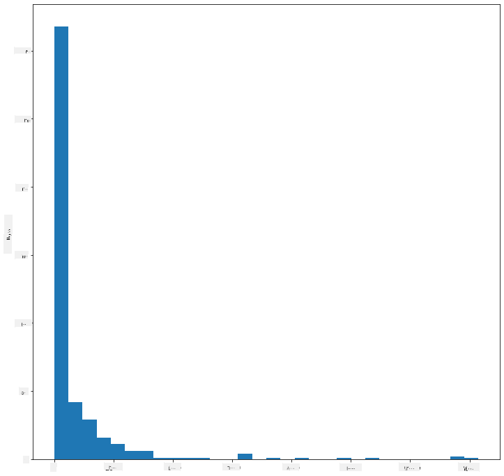
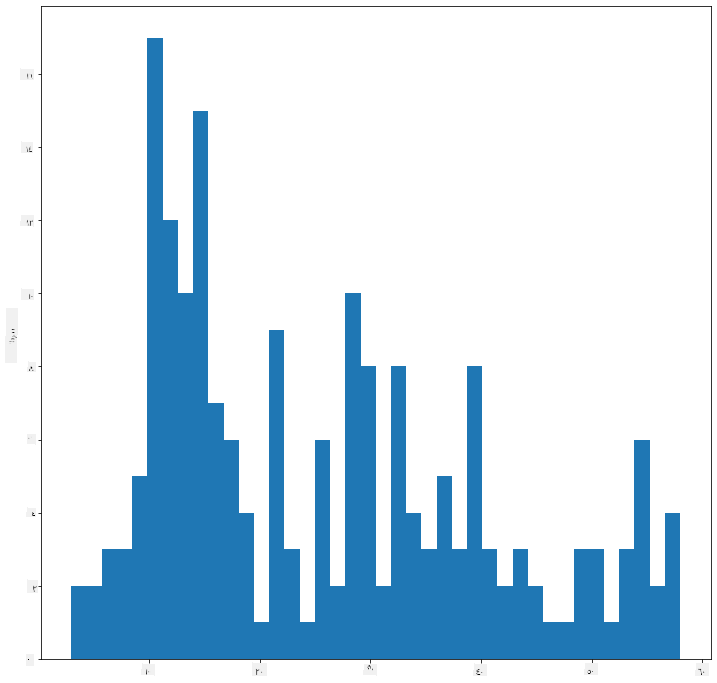
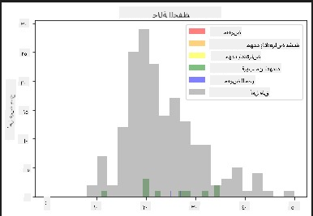
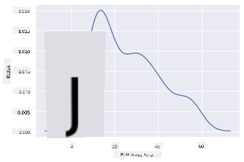
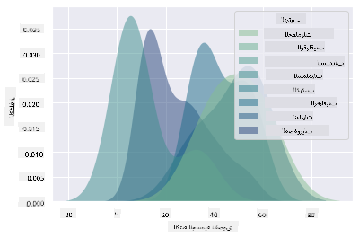

<!--
CO_OP_TRANSLATOR_METADATA:
{
  "original_hash": "02ce904bc1e2bfabb7dc05c25aae375c",
  "translation_date": "2025-09-04T15:49:48+00:00",
  "source_file": "3-Data-Visualization/10-visualization-distributions/README.md",
  "language_code": "ar"
}
-->
# تصور التوزيعات

|](../../sketchnotes/10-Visualizing-Distributions.png)|
|:---:|
| تصور التوزيعات - _رسم توضيحي بواسطة [@nitya](https://twitter.com/nitya)_ |

في الدرس السابق، تعلمت بعض الحقائق المثيرة للاهتمام حول مجموعة بيانات عن طيور مينيسوتا. اكتشفت بعض البيانات الخاطئة من خلال تصور القيم الشاذة ونظرت في الاختلافات بين فئات الطيور بناءً على أطوالها القصوى.

## [اختبار ما قبل المحاضرة](https://purple-hill-04aebfb03.1.azurestaticapps.net/quiz/18)
## استكشاف مجموعة بيانات الطيور

طريقة أخرى للتعمق في البيانات هي النظر إلى توزيعها، أو كيفية تنظيم البيانات على محور معين. ربما، على سبيل المثال، ترغب في معرفة التوزيع العام، لهذه المجموعة من البيانات، لأقصى امتداد جناح أو أقصى كتلة جسم لطيور مينيسوتا.

دعونا نكتشف بعض الحقائق حول توزيعات البيانات في هذه المجموعة. في ملف _notebook.ipynb_ الموجود في جذر مجلد هذا الدرس، قم باستيراد Pandas وMatplotlib وبياناتك:

```python
import pandas as pd
import matplotlib.pyplot as plt
birds = pd.read_csv('../../data/birds.csv')
birds.head()
```

|      | الاسم                         | الاسم العلمي           | الفئة                 | الرتبة       | العائلة  | الجنس       | حالة الحفظ         | الطول الأدنى | الطول الأقصى | كتلة الجسم الأدنى | كتلة الجسم الأقصى | امتداد الجناح الأدنى | امتداد الجناح الأقصى |
| ---: | :--------------------------- | :--------------------- | :-------------------- | :----------- | :------- | :---------- | :----------------- | --------: | --------: | ----------: | ----------: | ----------: | ----------: |
|    0 | بطة الصفير ذات البطن الأسود  | Dendrocygna autumnalis | البط/الإوز/طيور الماء | Anseriformes | Anatidae | Dendrocygna | LC                 |        47 |        56 |         652 |        1020 |          76 |          94 |
|    1 | بطة الصفير البنية            | Dendrocygna bicolor    | البط/الإوز/طيور الماء | Anseriformes | Anatidae | Dendrocygna | LC                 |        45 |        53 |         712 |        1050 |          85 |          93 |
|    2 | إوزة الثلج                   | Anser caerulescens     | البط/الإوز/طيور الماء | Anseriformes | Anatidae | Anser       | LC                 |        64 |        79 |        2050 |        4050 |         135 |         165 |
|    3 | إوزة روس                     | Anser rossii           | البط/الإوز/طيور الماء | Anseriformes | Anatidae | Anser       | LC                 |      57.3 |        64 |        1066 |        1567 |         113 |         116 |
|    4 | الإوزة البيضاء الكبيرة       | Anser albifrons        | البط/الإوز/طيور الماء | Anseriformes | Anatidae | Anser       | LC                 |        64 |        81 |        1930 |        3310 |         130 |         165 |

بشكل عام، يمكنك النظر بسرعة إلى طريقة توزيع البيانات باستخدام مخطط التبعثر كما فعلنا في الدرس السابق:

```python
birds.plot(kind='scatter',x='MaxLength',y='Order',figsize=(12,8))

plt.title('Max Length per Order')
plt.ylabel('Order')
plt.xlabel('Max Length')

plt.show()
```


هذا يعطي نظرة عامة على التوزيع العام لطول الجسم لكل رتبة طيور، لكنه ليس الطريقة المثلى لعرض التوزيعات الحقيقية. عادةً ما يتم التعامل مع هذه المهمة من خلال إنشاء مخطط هيستوجرام.

## العمل مع الهيستوجرام

يوفر Matplotlib طرقًا جيدة جدًا لتصور توزيع البيانات باستخدام الهيستوجرام. هذا النوع من المخططات يشبه المخطط العمودي حيث يمكن رؤية التوزيع من خلال ارتفاع وانخفاض الأعمدة. لإنشاء هيستوجرام، تحتاج إلى بيانات رقمية. لإنشاء هيستوجرام، يمكنك رسم مخطط وتحديد النوع كـ 'hist' للهيستوجرام. يعرض هذا المخطط توزيع كتلة الجسم القصوى لنطاق البيانات الرقمية للمجموعة بأكملها. من خلال تقسيم مصفوفة البيانات المعطاة إلى أجزاء أصغر، يمكنه عرض توزيع قيم البيانات:

```python
birds['MaxBodyMass'].plot(kind = 'hist', bins = 10, figsize = (12,12))
plt.show()
```


كما ترى، معظم الطيور الـ 400+ في هذه المجموعة تقع في نطاق أقل من 2000 لكتلة الجسم القصوى. احصل على مزيد من الفهم للبيانات عن طريق تغيير معامل `bins` إلى رقم أعلى، مثل 30:

```python
birds['MaxBodyMass'].plot(kind = 'hist', bins = 30, figsize = (12,12))
plt.show()
```


يعرض هذا المخطط التوزيع بطريقة أكثر تفصيلًا. يمكن إنشاء مخطط أقل انحرافًا إلى اليسار من خلال التأكد من أنك تختار فقط البيانات ضمن نطاق معين:

قم بتصفية بياناتك للحصول فقط على الطيور التي كتلة جسمها أقل من 60، وأظهر 40 `bins`:

```python
filteredBirds = birds[(birds['MaxBodyMass'] > 1) & (birds['MaxBodyMass'] < 60)]      
filteredBirds['MaxBodyMass'].plot(kind = 'hist',bins = 40,figsize = (12,12))
plt.show()     
```


✅ جرب بعض الفلاتر ونقاط البيانات الأخرى. لرؤية التوزيع الكامل للبيانات، قم بإزالة الفلتر `['MaxBodyMass']` لعرض التوزيعات المسمّاة.

يوفر الهيستوجرام أيضًا تحسينات لطيفة في الألوان والتسمية لتجربتها:

قم بإنشاء هيستوجرام ثنائي الأبعاد لمقارنة العلاقة بين توزيعين. دعونا نقارن `MaxBodyMass` مقابل `MaxLength`. يوفر Matplotlib طريقة مدمجة لإظهار التقارب باستخدام ألوان أكثر إشراقًا:

```python
x = filteredBirds['MaxBodyMass']
y = filteredBirds['MaxLength']

fig, ax = plt.subplots(tight_layout=True)
hist = ax.hist2d(x, y)
```
يبدو أن هناك علاقة متوقعة بين هذين العنصرين على محور متوقع، مع نقطة تقارب قوية واحدة بشكل خاص:


تعمل الهيستوجرامات بشكل جيد افتراضيًا مع البيانات الرقمية. ماذا لو كنت بحاجة إلى رؤية التوزيعات وفقًا للبيانات النصية؟

## استكشاف مجموعة البيانات للتوزيعات باستخدام البيانات النصية

تتضمن هذه المجموعة أيضًا معلومات جيدة حول فئة الطيور وجنسها ونوعها وعائلتها بالإضافة إلى حالة الحفظ الخاصة بها. دعونا نتعمق في هذه المعلومات المتعلقة بالحفظ. ما هو توزيع الطيور وفقًا لحالة الحفظ الخاصة بها؟

> ✅ في مجموعة البيانات، يتم استخدام العديد من الاختصارات لوصف حالة الحفظ. تأتي هذه الاختصارات من [فئات القائمة الحمراء لـ IUCN](https://www.iucnredlist.org)، وهي منظمة تقوم بفهرسة حالة الأنواع.
> 
> - CR: مهددة بالانقراض بشدة
> - EN: مهددة بالانقراض
> - EX: منقرضة
> - LC: أقل قلق
> - NT: قريبة من التهديد
> - VU: معرضة للخطر

هذه قيم نصية لذا ستحتاج إلى إجراء تحويل لإنشاء هيستوجرام. باستخدام إطار البيانات filteredBirds، اعرض حالة الحفظ الخاصة بها جنبًا إلى جنب مع امتداد الجناح الأدنى. ماذا ترى؟

```python
x1 = filteredBirds.loc[filteredBirds.ConservationStatus=='EX', 'MinWingspan']
x2 = filteredBirds.loc[filteredBirds.ConservationStatus=='CR', 'MinWingspan']
x3 = filteredBirds.loc[filteredBirds.ConservationStatus=='EN', 'MinWingspan']
x4 = filteredBirds.loc[filteredBirds.ConservationStatus=='NT', 'MinWingspan']
x5 = filteredBirds.loc[filteredBirds.ConservationStatus=='VU', 'MinWingspan']
x6 = filteredBirds.loc[filteredBirds.ConservationStatus=='LC', 'MinWingspan']

kwargs = dict(alpha=0.5, bins=20)

plt.hist(x1, **kwargs, color='red', label='Extinct')
plt.hist(x2, **kwargs, color='orange', label='Critically Endangered')
plt.hist(x3, **kwargs, color='yellow', label='Endangered')
plt.hist(x4, **kwargs, color='green', label='Near Threatened')
plt.hist(x5, **kwargs, color='blue', label='Vulnerable')
plt.hist(x6, **kwargs, color='gray', label='Least Concern')

plt.gca().set(title='Conservation Status', ylabel='Min Wingspan')
plt.legend();
```



لا يبدو أن هناك ارتباطًا جيدًا بين امتداد الجناح الأدنى وحالة الحفظ. اختبر عناصر أخرى من مجموعة البيانات باستخدام هذه الطريقة. يمكنك تجربة فلاتر مختلفة أيضًا. هل تجد أي ارتباط؟

## مخططات الكثافة

قد تكون لاحظت أن الهيستوجرامات التي نظرنا إليها حتى الآن "متدرجة" ولا تتدفق بسلاسة في قوس. لعرض مخطط كثافة أكثر سلاسة، يمكنك تجربة مخطط الكثافة.

للعمل مع مخططات الكثافة، تعرف على مكتبة رسم جديدة، [Seaborn](https://seaborn.pydata.org/generated/seaborn.kdeplot.html).

قم بتحميل Seaborn، وجرب مخطط كثافة أساسي:

```python
import seaborn as sns
import matplotlib.pyplot as plt
sns.kdeplot(filteredBirds['MinWingspan'])
plt.show()
```


يمكنك أن ترى كيف يعكس المخطط السابق لبيانات امتداد الجناح الأدنى؛ إنه فقط أكثر سلاسة قليلاً. وفقًا لوثائق Seaborn، "بالنسبة إلى الهيستوجرام، يمكن أن ينتج KDE مخططًا أقل ازدحامًا وأكثر قابلية للتفسير، خاصة عند رسم توزيعات متعددة. ولكن لديه القدرة على إدخال تشوهات إذا كانت التوزيع الأساسي محدودًا أو غير سلس. مثل الهيستوجرام، تعتمد جودة التمثيل أيضًا على اختيار معلمات التنعيم الجيدة." [المصدر](https://seaborn.pydata.org/generated/seaborn.kdeplot.html) بمعنى آخر، القيم الشاذة كما هو الحال دائمًا ستجعل مخططاتك تتصرف بشكل سيء.

إذا كنت ترغب في إعادة النظر في خط كتلة الجسم القصوى المتعرج في المخطط الثاني الذي أنشأته، يمكنك تنعيمه جيدًا من خلال إعادة إنشائه باستخدام هذه الطريقة:

```python
sns.kdeplot(filteredBirds['MaxBodyMass'])
plt.show()
```


إذا كنت تريد خطًا سلسًا، ولكن ليس سلسًا جدًا، قم بتعديل معامل `bw_adjust`:

```python
sns.kdeplot(filteredBirds['MaxBodyMass'], bw_adjust=.2)
plt.show()
```


✅ اقرأ عن المعاملات المتاحة لهذا النوع من المخططات وجربها!

يوفر هذا النوع من المخططات تصورات تفسيرية جميلة. مع بضع سطور من التعليمات البرمجية، على سبيل المثال، يمكنك عرض كثافة كتلة الجسم القصوى لكل رتبة طيور:

```python
sns.kdeplot(
   data=filteredBirds, x="MaxBodyMass", hue="Order",
   fill=True, common_norm=False, palette="crest",
   alpha=.5, linewidth=0,
)
```



يمكنك أيضًا رسم كثافة عدة متغيرات في مخطط واحد. اختبر الطول الأقصى والطول الأدنى للطائر مقارنة بحالة الحفظ الخاصة به:

```python
sns.kdeplot(data=filteredBirds, x="MinLength", y="MaxLength", hue="ConservationStatus")
```


ربما يستحق البحث ما إذا كان تجمع الطيور "المعرضة للخطر" وفقًا لأطوالها ذو معنى أم لا.

## 🚀 التحدي

الهيستوجرامات هي نوع أكثر تطورًا من المخططات مقارنة بمخططات التبعثر الأساسية أو المخططات العمودية أو المخططات الخطية. قم بالبحث على الإنترنت للعثور على أمثلة جيدة لاستخدام الهيستوجرامات. كيف يتم استخدامها، ماذا تظهر، وفي أي مجالات أو مجالات بحث يتم استخدامها عادةً؟

## [اختبار ما بعد المحاضرة](https://ff-quizzes.netlify.app/en/ds/)

## المراجعة والدراسة الذاتية

في هذا الدرس، استخدمت Matplotlib وبدأت العمل مع Seaborn لعرض مخططات أكثر تطورًا. قم ببعض البحث حول `kdeplot` في Seaborn، وهو "منحنى كثافة احتمالية مستمر في بعد واحد أو أكثر". اقرأ [الوثائق](https://seaborn.pydata.org/generated/seaborn.kdeplot.html) لفهم كيفية عمله.

## الواجب

[طبق مهاراتك](assignment.md)

---

**إخلاء المسؤولية**:  
تمت ترجمة هذا المستند باستخدام خدمة الترجمة الآلية [Co-op Translator](https://github.com/Azure/co-op-translator). بينما نسعى لتحقيق الدقة، يرجى العلم أن الترجمات الآلية قد تحتوي على أخطاء أو معلومات غير دقيقة. يجب اعتبار المستند الأصلي بلغته الأصلية هو المصدر الموثوق. للحصول على معلومات حساسة أو هامة، يُوصى بالاستعانة بترجمة بشرية احترافية. نحن غير مسؤولين عن أي سوء فهم أو تفسيرات خاطئة تنشأ عن استخدام هذه الترجمة.