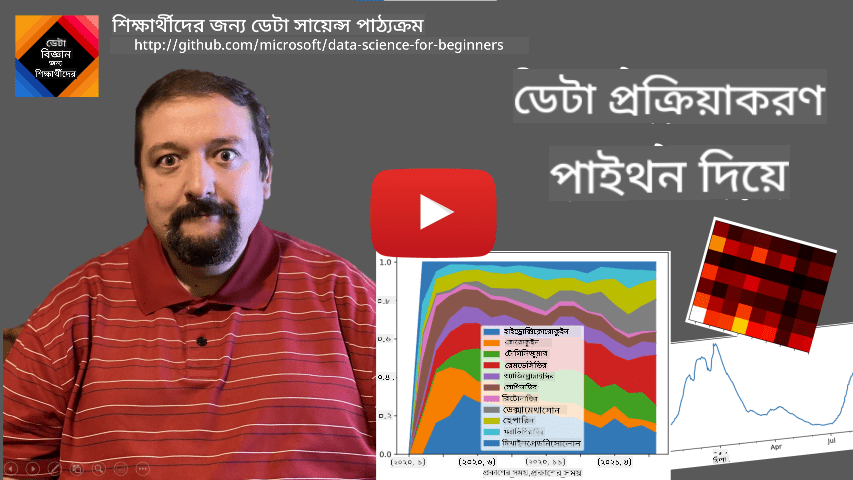
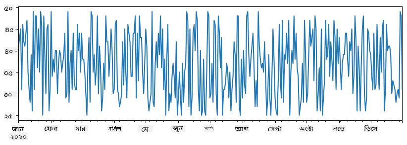
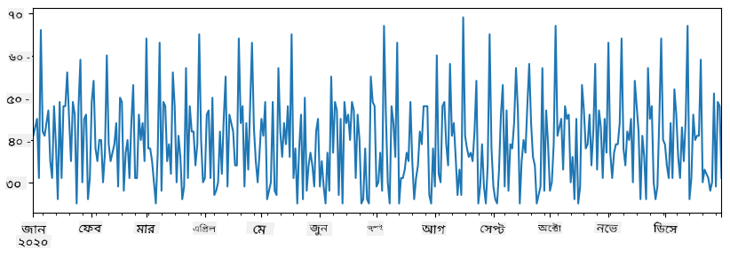
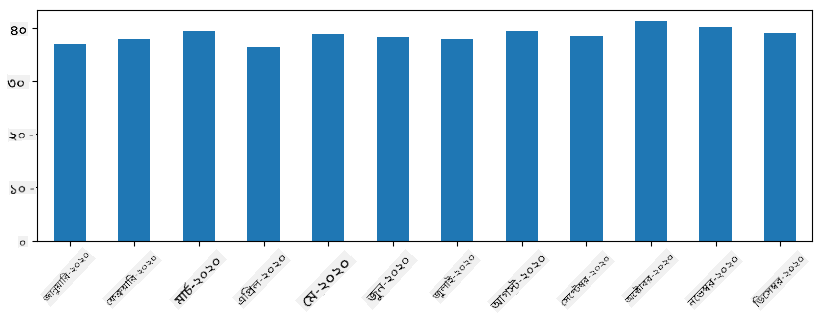
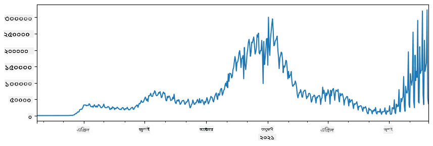
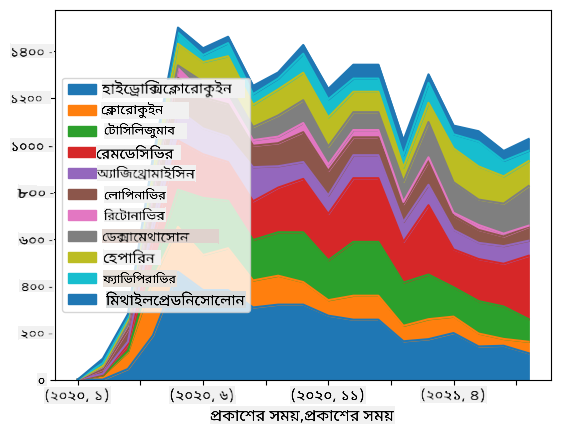

<!--
CO_OP_TRANSLATOR_METADATA:
{
  "original_hash": "57f7db1f4c3ae3361c1d1fbafcdd690c",
  "translation_date": "2025-09-04T16:26:12+00:00",
  "source_file": "2-Working-With-Data/07-python/README.md",
  "language_code": "bn"
}
-->
# ডেটার সাথে কাজ করা: পাইথন এবং প্যান্ডাস লাইব্রেরি

|  ](../../sketchnotes/07-WorkWithPython.png) |
| :-------------------------------------------------------------------------------------------------------: |
|                 পাইথনের সাথে কাজ করা - _Sketchnote by [@nitya](https://twitter.com/nitya)_                 |

[](https://youtu.be/dZjWOGbsN4Y)

যদিও ডেটাবেস ডেটা সংরক্ষণ এবং কুয়েরি করার জন্য খুবই কার্যকর পদ্ধতি প্রদান করে, ডেটা প্রসেসিংয়ের সবচেয়ে নমনীয় উপায় হলো নিজের প্রোগ্রাম লিখে ডেটা ম্যানিপুলেট করা। অনেক ক্ষেত্রে ডেটাবেস কুয়েরি করা বেশি কার্যকর হতে পারে। তবে, কিছু ক্ষেত্রে যখন আরও জটিল ডেটা প্রসেসিং প্রয়োজন হয়, তখন তা সহজে SQL দিয়ে করা সম্ভব নয়।  
ডেটা প্রসেসিং যেকোনো প্রোগ্রামিং ভাষায় করা যেতে পারে, তবে কিছু ভাষা ডেটার সাথে কাজ করার জন্য উচ্চতর স্তরের সুবিধা প্রদান করে। ডেটা বিজ্ঞানীরা সাধারণত নিম্নলিখিত ভাষাগুলোর একটি পছন্দ করেন:

* **[Python](https://www.python.org/)**: এটি একটি সাধারণ উদ্দেশ্য প্রোগ্রামিং ভাষা, যা এর সরলতার কারণে শিক্ষার্থীদের জন্য অন্যতম সেরা বিকল্প হিসেবে বিবেচিত হয়। পাইথনের অনেক অতিরিক্ত লাইব্রেরি রয়েছে যা আপনাকে বাস্তব সমস্যাগুলো সমাধানে সাহায্য করতে পারে, যেমন ZIP আর্কাইভ থেকে ডেটা বের করা বা ছবি গ্রেস্কেলে রূপান্তর করা। ডেটা সায়েন্স ছাড়াও, পাইথন ওয়েব ডেভেলপমেন্টেও ব্যাপকভাবে ব্যবহৃত হয়।  
* **[R](https://www.r-project.org/)**: এটি একটি ঐতিহ্যবাহী টুলবক্স যা পরিসংখ্যানগত ডেটা প্রসেসিংয়ের জন্য তৈরি। এতে বিশাল লাইব্রেরি সংগ্রহ (CRAN) রয়েছে, যা ডেটা প্রসেসিংয়ের জন্য এটি একটি ভালো পছন্দ করে তোলে। তবে, R একটি সাধারণ উদ্দেশ্য প্রোগ্রামিং ভাষা নয় এবং এটি ডেটা সায়েন্সের বাইরে খুব কমই ব্যবহৃত হয়।  
* **[Julia](https://julialang.org/)**: এটি আরেকটি ভাষা যা বিশেষভাবে ডেটা সায়েন্সের জন্য তৈরি। এটি পাইথনের চেয়ে ভালো পারফরম্যান্স দেওয়ার উদ্দেশ্যে তৈরি, যা একে বৈজ্ঞানিক পরীক্ষার জন্য একটি চমৎকার টুল করে তোলে।  

এই পাঠে, আমরা সহজ ডেটা প্রসেসিংয়ের জন্য পাইথন ব্যবহারে মনোযোগ দেব। আমরা ধরে নেব যে আপনি ভাষাটির সাথে প্রাথমিকভাবে পরিচিত। যদি আপনি পাইথনের আরও গভীর জ্ঞান অর্জন করতে চান, তাহলে নিম্নলিখিত রিসোর্সগুলো দেখতে পারেন:

* [Learn Python in a Fun Way with Turtle Graphics and Fractals](https://github.com/shwars/pycourse) - পাইথন প্রোগ্রামিংয়ের জন্য একটি গিটহাব-ভিত্তিক দ্রুত পরিচিতি কোর্স  
* [Take your First Steps with Python](https://docs.microsoft.com/en-us/learn/paths/python-first-steps/?WT.mc_id=academic-77958-bethanycheum) - [Microsoft Learn](http://learn.microsoft.com/?WT.mc_id=academic-77958-bethanycheum)-এ একটি লার্নিং পাথ  

ডেটা বিভিন্ন রূপে আসতে পারে। এই পাঠে, আমরা তিনটি রূপের ডেটা বিবেচনা করব - **টেবুলার ডেটা**, **টেক্সট** এবং **ইমেজ**।  

আমরা সমস্ত সম্পর্কিত লাইব্রেরির পূর্ণ পর্যালোচনা দেওয়ার পরিবর্তে ডেটা প্রসেসিংয়ের কিছু উদাহরণে মনোযোগ দেব। এটি আপনাকে কী কী সম্ভব তা বোঝার সুযোগ দেবে এবং যখন প্রয়োজন হবে তখন আপনার সমস্যার সমাধান কোথায় খুঁজে পাবেন তা বুঝতে সাহায্য করবে।  

> **সবচেয়ে কার্যকর পরামর্শ**: যখন আপনাকে এমন কোনো ডেটা অপারেশন করতে হবে যা আপনি কীভাবে করবেন জানেন না, তখন ইন্টারনেটে এটি খুঁজে দেখুন। [Stackoverflow](https://stackoverflow.com/) সাধারণত অনেক সাধারণ কাজের জন্য পাইথনে দরকারী কোড নমুনা প্রদান করে।  

## [পাঠ-পূর্ব কুইজ](https://purple-hill-04aebfb03.1.azurestaticapps.net/quiz/12)

## টেবুলার ডেটা এবং ডেটাফ্রেম

আপনি ইতিমধ্যে টেবুলার ডেটার সাথে পরিচিত হয়েছেন যখন আমরা রিলেশনাল ডেটাবেস নিয়ে আলোচনা করেছি। যখন আপনার কাছে অনেক ডেটা থাকে এবং এটি বিভিন্ন সংযুক্ত টেবিলে থাকে, তখন এটি নিয়ে কাজ করার জন্য SQL ব্যবহার করা অবশ্যই যৌক্তিক। তবে, অনেক ক্ষেত্রে আমাদের একটি ডেটার টেবিল থাকে এবং আমরা এই ডেটা সম্পর্কে কিছু **বোঝাপড়া** বা **অন্তর্দৃষ্টি** পেতে চাই, যেমন ডিস্ট্রিবিউশন, মানগুলোর মধ্যে সম্পর্ক ইত্যাদি। ডেটা সায়েন্সে, অনেক সময় আমাদের মূল ডেটার কিছু রূপান্তর করতে হয়, তারপর ভিজ্যুয়ালাইজেশন করতে হয়। এই দুটি ধাপই পাইথন ব্যবহার করে সহজেই করা যায়।  

পাইথনে টেবুলার ডেটার সাথে কাজ করার জন্য দুটি সবচেয়ে দরকারী লাইব্রেরি হলো:
* **[Pandas](https://pandas.pydata.org/)**: এটি আপনাকে **ডেটাফ্রেম** নামে পরিচিত ডেটা ম্যানিপুলেট করতে সাহায্য করে, যা রিলেশনাল টেবিলের অনুরূপ। আপনি নামকৃত কলাম রাখতে পারেন এবং সারি, কলাম এবং ডেটাফ্রেমের উপর বিভিন্ন অপারেশন করতে পারেন।  
* **[Numpy](https://numpy.org/)**: এটি **টেনসর**, অর্থাৎ বহু-মাত্রিক **অ্যারে** নিয়ে কাজ করার জন্য একটি লাইব্রেরি। অ্যারেতে একই প্রকারের মান থাকে এবং এটি ডেটাফ্রেমের চেয়ে সহজ, তবে এটি আরও বেশি গাণিতিক অপারেশন প্রদান করে এবং কম ওভারহেড তৈরি করে।  

এছাড়াও, আরও কিছু লাইব্রেরি রয়েছে যা আপনার জানা উচিত:
* **[Matplotlib](https://matplotlib.org/)**: এটি ডেটা ভিজ্যুয়ালাইজেশন এবং গ্রাফ আঁকার জন্য ব্যবহৃত একটি লাইব্রেরি  
* **[SciPy](https://www.scipy.org/)**: এটি কিছু অতিরিক্ত বৈজ্ঞানিক ফাংশন সহ একটি লাইব্রেরি। আমরা ইতিমধ্যে এই লাইব্রেরির সাথে পরিচিত হয়েছি যখন আমরা সম্ভাবনা এবং পরিসংখ্যান নিয়ে আলোচনা করেছি  

এখানে একটি কোডের অংশ দেওয়া হলো যা আপনি সাধারণত আপনার পাইথন প্রোগ্রামের শুরুতে এই লাইব্রেরিগুলো ইমপোর্ট করতে ব্যবহার করবেন:
```python
import numpy as np
import pandas as pd
import matplotlib.pyplot as plt
from scipy import ... # you need to specify exact sub-packages that you need
```  

প্যান্ডাস কয়েকটি মৌলিক ধারণার উপর ভিত্তি করে কাজ করে।  

### সিরিজ

**সিরিজ** হলো মানগুলোর একটি ক্রম, যা তালিকা বা numpy অ্যারের মতো। প্রধান পার্থক্য হলো সিরিজের একটি **ইনডেক্স** থাকে, এবং যখন আমরা সিরিজের উপর অপারেশন করি (যেমন, যোগ করি), তখন ইনডেক্সটি বিবেচনায় নেওয়া হয়। ইনডেক্সটি সাধারণ পূর্ণসংখ্যা সারি নম্বর হতে পারে (যখন তালিকা বা অ্যারে থেকে সিরিজ তৈরি করা হয়, এটি ডিফল্ট ইনডেক্স), অথবা এটি একটি জটিল কাঠামো, যেমন তারিখের ইন্টারভাল হতে পারে।  

> **নোট**: প্যান্ডাসের কিছু প্রাথমিক কোড সহ একটি নোটবুক [`notebook.ipynb`](notebook.ipynb)-এ দেওয়া আছে। আমরা এখানে কিছু উদাহরণ উল্লেখ করব, এবং আপনাকে পুরো নোটবুকটি দেখার জন্য উৎসাহিত করছি।  

উদাহরণস্বরূপ, আমরা আমাদের আইসক্রিম দোকানের বিক্রয় বিশ্লেষণ করতে চাই। চলুন একটি নির্দিষ্ট সময়ের জন্য বিক্রয়ের সংখ্যা (প্রতিদিন বিক্রি হওয়া আইটেমের সংখ্যা) নিয়ে একটি সিরিজ তৈরি করি:  

```python
start_date = "Jan 1, 2020"
end_date = "Mar 31, 2020"
idx = pd.date_range(start_date,end_date)
print(f"Length of index is {len(idx)}")
items_sold = pd.Series(np.random.randint(25,50,size=len(idx)),index=idx)
items_sold.plot()
```  
  

এখন ধরুন, প্রতি সপ্তাহে আমরা বন্ধুদের জন্য একটি পার্টি আয়োজন করি এবং পার্টির জন্য অতিরিক্ত ১০ প্যাক আইসক্রিম নিই। আমরা এটি দেখানোর জন্য সপ্তাহ অনুযায়ী ইনডেক্স করা আরেকটি সিরিজ তৈরি করতে পারি:  
```python
additional_items = pd.Series(10,index=pd.date_range(start_date,end_date,freq="W"))
```  
যখন আমরা দুটি সিরিজ যোগ করি, তখন আমরা মোট সংখ্যা পাই:  
```python
total_items = items_sold.add(additional_items,fill_value=0)
total_items.plot()
```  
  

> **নোট**: আমরা সাধারণ সিনট্যাক্স `total_items+additional_items` ব্যবহার করছি না। যদি করতাম, তাহলে আমরা অনেক `NaN` (*Not a Number*) মান পেতাম ফলাফলের সিরিজে। কারণ `additional_items` সিরিজের কিছু ইনডেক্স পয়েন্টে মান অনুপস্থিত, এবং `NaN`-এর সাথে কিছু যোগ করলে ফলাফলও `NaN` হয়। তাই যোগ করার সময় আমাদের `fill_value` প্যারামিটার নির্দিষ্ট করতে হয়।  

টাইম সিরিজের ক্ষেত্রে, আমরা বিভিন্ন সময়ের ইন্টারভাল দিয়ে সিরিজ **resample** করতে পারি। উদাহরণস্বরূপ, ধরুন আমরা মাসিক গড় বিক্রয় পরিমাণ গণনা করতে চাই। আমরা নিম্নলিখিত কোড ব্যবহার করতে পারি:  
```python
monthly = total_items.resample("1M").mean()
ax = monthly.plot(kind='bar')
```  
  

### ডেটাফ্রেম

ডেটাফ্রেম মূলত একই ইনডেক্স সহ সিরিজের একটি সংগ্রহ। আমরা একাধিক সিরিজ একত্রিত করে একটি ডেটাফ্রেম তৈরি করতে পারি:  
```python
a = pd.Series(range(1,10))
b = pd.Series(["I","like","to","play","games","and","will","not","change"],index=range(0,9))
df = pd.DataFrame([a,b])
```  
এটি একটি অনুভূমিক টেবিল তৈরি করবে:  
|     | 0   | 1    | 2   | 3   | 4      | 5   | 6      | 7    | 8    |
| --- | --- | ---- | --- | --- | ------ | --- | ------ | ---- | ---- |
| 0   | 1   | 2    | 3   | 4   | 5      | 6   | 7      | 8    | 9    |
| 1   | I   | like | to  | use | Python | and | Pandas | very | much |  

আমরা সিরিজগুলোকে কলাম হিসেবে ব্যবহার করতে পারি এবং ডিকশনারি ব্যবহার করে কলামের নাম নির্দিষ্ট করতে পারি:  
```python
df = pd.DataFrame({ 'A' : a, 'B' : b })
```  
এটি আমাদের নিম্নলিখিত টেবিল দেবে:  

|     | A   | B      |
| --- | --- | ------ |
| 0   | 1   | I      |
| 1   | 2   | like   |
| 2   | 3   | to     |
| 3   | 4   | use    |
| 4   | 5   | Python |
| 5   | 6   | and    |
| 6   | 7   | Pandas |
| 7   | 8   | very   |
| 8   | 9   | much   |  

**নোট**: আমরা আগের টেবিলটি ট্রান্সপোজ করেও এই টেবিল লেআউট পেতে পারি, যেমন:  
```python
df = pd.DataFrame([a,b]).T..rename(columns={ 0 : 'A', 1 : 'B' })
```  
এখানে `.T` ডেটাফ্রেম ট্রান্সপোজ করার অপারেশন বোঝায়, অর্থাৎ সারি এবং কলাম পরিবর্তন করা, এবং `rename` অপারেশন আমাদের কলামগুলোর নাম আগের উদাহরণের সাথে মেলানোর সুযোগ দেয়।  

ডেটাফ্রেমে আমরা যে কয়েকটি গুরুত্বপূর্ণ অপারেশন করতে পারি তা হলো:  

**কলাম নির্বাচন**: আমরা `df['A']` লিখে পৃথক কলাম নির্বাচন করতে পারি - এই অপারেশন একটি সিরিজ রিটার্ন করে। আমরা `df[['B','A']]` লিখে কলামের একটি সাবসেটও অন্য ডেটাফ্রেমে নির্বাচন করতে পারি - এটি আরেকটি ডেটাফ্রেম রিটার্ন করে।  

**নির্দিষ্ট সারি ফিল্টার করা**: উদাহরণস্বরূপ, শুধুমাত্র সেই সারিগুলো রাখতে চাই যেখানে কলাম `A`-এর মান ৫-এর বেশি, আমরা লিখতে পারি `df[df['A']>5]`।  

> **নোট**: ফিল্টারিং যেভাবে কাজ করে তা হলো নিম্নরূপ। `df['A']<5` এক্সপ্রেশনটি একটি বুলিয়ান সিরিজ রিটার্ন করে, যা প্রতিটি উপাদানের জন্য এক্সপ্রেশনটি `True` বা `False` কিনা তা নির্দেশ করে। যখন বুলিয়ান সিরিজ ইনডেক্স হিসেবে ব্যবহার করা হয়, এটি ডেটাফ্রেমের নির্দিষ্ট সারিগুলো রিটার্ন করে। তাই যেকোনো পাইথন বুলিয়ান এক্সপ্রেশন ব্যবহার করা সম্ভব নয়, যেমন `df[df['A']>5 and df['A']<7]` লেখা ভুল হবে। পরিবর্তে, আপনাকে বুলিয়ান সিরিজে বিশেষ `&` অপারেশন ব্যবহার করতে হবে, যেমন `df[(df['A']>5) & (df['A']<7)]` (*এখানে বন্ধনীগুলো গুরুত্বপূর্ণ*)।  

**নতুন গণনাযোগ্য কলাম তৈরি করা**: আমরা সহজেই আমাদের ডেটাফ্রেমের জন্য নতুন গণনাযোগ্য কলাম তৈরি করতে পারি, যেমন:  
```python
df['DivA'] = df['A']-df['A'].mean() 
```  
এই উদাহরণটি A-এর গড় মান থেকে তার বিচ্যুতি গণনা করে। এখানে যা ঘটে তা হলো আমরা একটি সিরিজ গণনা করি এবং তারপর এটি বাম দিকে অ্যাসাইন করি, একটি নতুন কলাম তৈরি করি। তাই, আমরা এমন কোনো অপারেশন ব্যবহার করতে পারি না যা সিরিজের সাথে সামঞ্জস্যপূর্ণ নয়, উদাহরণস্বরূপ, নিচের কোডটি ভুল:  
```python
# Wrong code -> df['ADescr'] = "Low" if df['A'] < 5 else "Hi"
df['LenB'] = len(df['B']) # <- Wrong result
```  
শেষের উদাহরণটি সিনট্যাক্সগতভাবে সঠিক হলেও আমাদের ভুল ফলাফল দেয়, কারণ এটি সিরিজ `B`-এর দৈর্ঘ্যকে কলামের সমস্ত মানে অ্যাসাইন করে, এবং আমরা যা চেয়েছিলাম তা নয়।  

যদি আমাদের এমন জটিল এক্সপ্রেশন গণনা করতে হয়, তাহলে আমরা `apply` ফাংশন ব্যবহার করতে পারি। শেষের উদাহরণটি নিম্নরূপ লেখা যেতে পারে:  
```python
df['LenB'] = df['B'].apply(lambda x : len(x))
# or 
df['LenB'] = df['B'].apply(len)
```  

উপরের অপারেশনগুলোর পরে, আমরা নিম্নলিখিত ডেটাফ্রেম পাব:  

|     | A   | B      | DivA | LenB |
| --- | --- | ------ | ---- | ---- |
| 0   | 1   | I      | -4.0 | 1    |
| 1   | 2   | like   | -3.0 | 4    |
| 2   | 3   | to     | -2.0 | 2    |
| 3   | 4   | use    | -1.0 | 3    |
| 4   | 5   | Python | 0.0  | 6    |
| 5   | 6   | and    | 1.0  | 3    |
| 6   | 7   | Pandas | 2.0  | 6    |
| 7   | 8   | very   | 3.0  | 4    |
| 8   | 9   | much   | 4.0  | 4    |  

**সংখ্যার উপর ভিত্তি করে সারি নির্বাচন**: এটি `iloc` কন্সট্রাক্ট ব্যবহার করে করা যায়। উদাহরণস্বরূপ, ডেটাফ্রেম থেকে প্রথম ৫টি সারি নির্বাচন করতে:  
```python
df.iloc[:5]
```  

**গ্রুপিং**: এটি প্রায়শই এক্সেলে *পিভট টেবিল* এর মতো ফলাফল পেতে ব্যবহৃত হয়। ধরুন আমরা `LenB`-এর প্রতিটি নির্দিষ্ট সংখ্যার জন্য কলাম `A`-এর গড় মান গণনা করতে চাই। তখন আমরা আমাদের ডেটাফ্রেমকে `LenB` দ্বারা গ্রুপ করতে পারি এবং `mean` কল করতে পারি:  
```python
df.groupby(by='LenB').mean()
```  
যদি আমাদের গড় এবং গ্রুপে উপাদানের সংখ্যা উভয়ই গণনা করতে হয়, তাহলে আমরা আরও জটিল `aggregate` ফাংশন ব্যবহার করতে পারি:  
```python
df.groupby(by='LenB') \
 .aggregate({ 'DivA' : len, 'A' : lambda x: x.mean() }) \
 .rename(columns={ 'DivA' : 'Count', 'A' : 'Mean'})
```  
এটি আমাদের নিম্নলিখিত টেবিল দেবে:  

| LenB | Count | Mean     |
| ---- | ----- | -------- |
| 1    | 1     | 1.000000 |
| 2    | 1     | 3.000000 |
| 3    | 2     | 5.000000 |
| 4    | 3     | 6.333333 |
| 6    | 2     | 6.000000 |  

### ডেটা সংগ্রহ করা  
আমরা দেখেছি কীভাবে Python অবজেক্ট থেকে সহজেই Series এবং DataFrames তৈরি করা যায়। তবে, ডেটা সাধারণত টেক্সট ফাইল বা Excel টেবিলের আকারে আসে। সৌভাগ্যক্রমে, Pandas আমাদের ডিস্ক থেকে ডেটা লোড করার একটি সহজ উপায় প্রদান করে। উদাহরণস্বরূপ, CSV ফাইল পড়া এতটাই সহজ:
```python
df = pd.read_csv('file.csv')
```
আমরা "Challenge" সেকশনে আরও উদাহরণ দেখব, যেখানে বাইরের ওয়েবসাইট থেকে ডেটা আনার বিষয়ও অন্তর্ভুক্ত থাকবে।

### প্রিন্টিং এবং প্লটিং

একজন Data Scientist প্রায়ই ডেটা অন্বেষণ করতে হয়, তাই এটি ভিজ্যুয়ালাইজ করার ক্ষমতা থাকা গুরুত্বপূর্ণ। যখন DataFrame বড় হয়, তখন অনেক সময় আমরা নিশ্চিত হতে চাই যে আমরা সবকিছু সঠিকভাবে করছি, এবং এর জন্য প্রথম কয়েকটি সারি প্রিন্ট করা দরকার। এটি `df.head()` কল করে করা যায়। যদি আপনি Jupyter Notebook থেকে এটি চালান, এটি DataFrame-কে সুন্দর টেবিল আকারে প্রিন্ট করবে।

আমরা `plot` ফাংশনের ব্যবহারও দেখেছি কিছু কলাম ভিজ্যুয়ালাইজ করতে। যদিও `plot` অনেক কাজের জন্য খুবই উপযোগী এবং `kind=` প্যারামিটারের মাধ্যমে বিভিন্ন গ্রাফ টাইপ সমর্থন করে, আপনি সবসময় raw `matplotlib` লাইব্রেরি ব্যবহার করে আরও জটিল কিছু প্লট করতে পারেন। আমরা আলাদা কোর্স লেসনে ডেটা ভিজ্যুয়ালাইজেশন বিস্তারিতভাবে আলোচনা করব।

এই ওভারভিউ Pandas-এর সবচেয়ে গুরুত্বপূর্ণ ধারণাগুলো কভার করে, তবে লাইব্রেরিটি খুবই সমৃদ্ধ এবং এর মাধ্যমে আপনি অসংখ্য কাজ করতে পারেন! এখন আমরা এই জ্ঞান ব্যবহার করে নির্দিষ্ট সমস্যার সমাধান করব।

## 🚀 চ্যালেঞ্জ ১: COVID ছড়ানোর বিশ্লেষণ

প্রথম সমস্যাটি আমরা ফোকাস করব COVID-19-এর মহামারী ছড়ানোর মডেলিংয়ে। এটি করার জন্য, আমরা বিভিন্ন দেশে আক্রান্ত ব্যক্তিদের সংখ্যা সম্পর্কিত ডেটা ব্যবহার করব, যা [Center for Systems Science and Engineering](https://systems.jhu.edu/) (CSSE) দ্বারা [Johns Hopkins University](https://jhu.edu/) থেকে সরবরাহ করা হয়েছে। ডেটাসেটটি [এই GitHub Repository](https://github.com/CSSEGISandData/COVID-19)-তে উপলব্ধ।

যেহেতু আমরা ডেটা নিয়ে কাজ করার পদ্ধতি প্রদর্শন করতে চাই, আমরা আপনাকে [`notebook-covidspread.ipynb`](notebook-covidspread.ipynb) খুলে শুরু থেকে শেষ পর্যন্ত পড়ার আমন্ত্রণ জানাই। আপনি সেলগুলো চালাতে পারেন এবং শেষে আমাদের দেওয়া কিছু চ্যালেঞ্জ সম্পন্ন করতে পারেন।



> যদি আপনি Jupyter Notebook-এ কোড চালানোর পদ্ধতি না জানেন, [এই আর্টিকেলটি](https://soshnikov.com/education/how-to-execute-notebooks-from-github/) দেখুন।

## অসংগঠিত ডেটার সাথে কাজ করা

যদিও ডেটা প্রায়ই টেবুলার আকারে আসে, কিছু ক্ষেত্রে আমাদের কম সংগঠিত ডেটার সাথে কাজ করতে হয়, যেমন টেক্সট বা ছবি। এই ক্ষেত্রে, উপরে দেখা ডেটা প্রসেসিং কৌশল প্রয়োগ করতে, আমাদের **সংগঠিত** ডেটা বের করতে হয়। এখানে কিছু উদাহরণ দেওয়া হলো:

* টেক্সট থেকে কীওয়ার্ড বের করা এবং কীভাবে সেগুলো কতবার উপস্থিত হয় তা দেখা
* ছবিতে অবজেক্ট সম্পর্কে তথ্য বের করতে নিউরাল নেটওয়ার্ক ব্যবহার করা
* ভিডিও ক্যামেরা ফিডে মানুষের আবেগ সম্পর্কে তথ্য পাওয়া

## 🚀 চ্যালেঞ্জ ২: COVID সম্পর্কিত গবেষণাপত্র বিশ্লেষণ

এই চ্যালেঞ্জে, আমরা COVID মহামারীর বিষয়টি চালিয়ে যাব এবং এই বিষয়ে বৈজ্ঞানিক গবেষণাপত্র প্রসেসিংয়ে ফোকাস করব। [CORD-19 Dataset](https://www.kaggle.com/allen-institute-for-ai/CORD-19-research-challenge)-এ ৭০০০-এর বেশি (লেখার সময়) COVID সম্পর্কিত গবেষণাপত্র রয়েছে, যা মেটাডেটা এবং অ্যাবস্ট্রাক্টসহ উপলব্ধ (এবং প্রায় অর্ধেকের জন্য পূর্ণ টেক্সটও সরবরাহ করা হয়েছে)।

এই ডেটাসেট বিশ্লেষণের একটি পূর্ণ উদাহরণ [Text Analytics for Health](https://docs.microsoft.com/azure/cognitive-services/text-analytics/how-tos/text-analytics-for-health/?WT.mc_id=academic-77958-bethanycheum) কগনিটিভ সার্ভিস ব্যবহার করে [এই ব্লগ পোস্টে](https://soshnikov.com/science/analyzing-medical-papers-with-azure-and-text-analytics-for-health/) বর্ণনা করা হয়েছে। আমরা এই বিশ্লেষণের সরলীকৃত সংস্করণ আলোচনা করব।

> **NOTE**: আমরা এই রিপোজিটরির অংশ হিসেবে ডেটাসেটের একটি কপি সরবরাহ করি না। আপনাকে প্রথমে [এই ডেটাসেটের Kaggle](https://www.kaggle.com/allen-institute-for-ai/CORD-19-research-challenge?select=metadata.csv) থেকে [`metadata.csv`](https://www.kaggle.com/allen-institute-for-ai/CORD-19-research-challenge?select=metadata.csv) ফাইল ডাউনলোড করতে হতে পারে। Kaggle-এ রেজিস্ট্রেশন প্রয়োজন হতে পারে। আপনি রেজিস্ট্রেশন ছাড়াও [এখান থেকে](https://ai2-semanticscholar-cord-19.s3-us-west-2.amazonaws.com/historical_releases.html) ডেটাসেট ডাউনলোড করতে পারেন, তবে এটি মেটাডেটা ফাইলের পাশাপাশি সমস্ত পূর্ণ টেক্সট অন্তর্ভুক্ত করবে।

[`notebook-papers.ipynb`](notebook-papers.ipynb) খুলুন এবং শুরু থেকে শেষ পর্যন্ত পড়ুন। আপনি সেলগুলো চালাতে পারেন এবং শেষে আমাদের দেওয়া কিছু চ্যালেঞ্জ সম্পন্ন করতে পারেন।



## ইমেজ ডেটা প্রসেসিং

সম্প্রতি, খুব শক্তিশালী AI মডেল তৈরি করা হয়েছে যা আমাদের ছবি বুঝতে সাহায্য করে। অনেক কাজ প্রি-ট্রেইনড নিউরাল নেটওয়ার্ক বা ক্লাউড সার্ভিস ব্যবহার করে সমাধান করা যায়। কিছু উদাহরণ হলো:

* **ইমেজ ক্লাসিফিকেশন**, যা আপনাকে ছবিকে পূর্বনির্ধারিত ক্লাসগুলোর মধ্যে একটিতে শ্রেণীবদ্ধ করতে সাহায্য করে। আপনি সহজেই [Custom Vision](https://azure.microsoft.com/services/cognitive-services/custom-vision-service/?WT.mc_id=academic-77958-bethanycheum) সার্ভিস ব্যবহার করে নিজের ইমেজ ক্লাসিফায়ার ট্রেইন করতে পারেন।
* **অবজেক্ট ডিটেকশন** ছবিতে বিভিন্ন অবজেক্ট সনাক্ত করতে। [computer vision](https://azure.microsoft.com/services/cognitive-services/computer-vision/?WT.mc_id=academic-77958-bethanycheum) সার্ভিস অনেক সাধারণ অবজেক্ট সনাক্ত করতে পারে, এবং আপনি [Custom Vision](https://azure.microsoft.com/services/cognitive-services/custom-vision-service/?WT.mc_id=academic-77958-bethanycheum) মডেল ট্রেইন করে নির্দিষ্ট আগ্রহের অবজেক্ট সনাক্ত করতে পারেন।
* **ফেস ডিটেকশন**, যার মধ্যে বয়স, লিঙ্গ এবং আবেগ সনাক্তকরণ অন্তর্ভুক্ত। এটি [Face API](https://azure.microsoft.com/services/cognitive-services/face/?WT.mc_id=academic-77958-bethanycheum)-এর মাধ্যমে করা যায়।

এই সমস্ত ক্লাউড সার্ভিস [Python SDKs](https://docs.microsoft.com/samples/azure-samples/cognitive-services-python-sdk-samples/cognitive-services-python-sdk-samples/?WT.mc_id=academic-77958-bethanycheum) ব্যবহার করে কল করা যায় এবং সহজেই আপনার ডেটা এক্সপ্লোরেশন ওয়ার্কফ্লোতে অন্তর্ভুক্ত করা যায়।

এখানে ইমেজ ডেটা সোর্স থেকে ডেটা এক্সপ্লোর করার কিছু উদাহরণ দেওয়া হলো:
* ব্লগ পোস্ট [কোডিং ছাড়াই ডেটা সায়েন্স শেখার উপায়](https://soshnikov.com/azure/how-to-learn-data-science-without-coding/) এ আমরা Instagram ছবিগুলো এক্সপ্লোর করি, চেষ্টা করি বুঝতে কীভাবে একটি ছবিতে বেশি লাইক পাওয়া যায়। আমরা প্রথমে [computer vision](https://azure.microsoft.com/services/cognitive-services/computer-vision/?WT.mc_id=academic-77958-bethanycheum) ব্যবহার করে ছবিগুলো থেকে যতটা সম্ভব তথ্য বের করি এবং তারপর [Azure Machine Learning AutoML](https://docs.microsoft.com/azure/machine-learning/concept-automated-ml/?WT.mc_id=academic-77958-bethanycheum) ব্যবহার করে একটি ব্যাখ্যাযোগ্য মডেল তৈরি করি।
* [Facial Studies Workshop](https://github.com/CloudAdvocacy/FaceStudies)-এ আমরা [Face API](https://azure.microsoft.com/services/cognitive-services/face/?WT.mc_id=academic-77958-bethanycheum) ব্যবহার করে ইভেন্টের ছবিতে মানুষের আবেগ বের করি, চেষ্টা করি বুঝতে কীভাবে মানুষকে খুশি করা যায়।

## উপসংহার

আপনার কাছে সংগঠিত বা অসংগঠিত ডেটা যাই থাকুক না কেন, Python ব্যবহার করে আপনি ডেটা প্রসেসিং এবং বোঝার সাথে সম্পর্কিত সমস্ত ধাপ সম্পন্ন করতে পারেন। এটি সম্ভবত ডেটা প্রসেসিংয়ের সবচেয়ে নমনীয় উপায়, এবং এ কারণেই বেশিরভাগ ডেটা সায়েন্টিস্ট Python-কে তাদের প্রধান টুল হিসেবে ব্যবহার করেন। যদি আপনি ডেটা সায়েন্সে সিরিয়াস হন, Python গভীরভাবে শেখা সম্ভবত একটি ভালো ধারণা!

## [পোস্ট-লেকচার কুইজ](https://ff-quizzes.netlify.app/en/ds/)

## রিভিউ এবং সেলফ স্টাডি

**বই**
* [Wes McKinney. Python for Data Analysis: Data Wrangling with Pandas, NumPy, and IPython](https://www.amazon.com/gp/product/1491957662)

**অনলাইন রিসোর্স**
* অফিসিয়াল [10 minutes to Pandas](https://pandas.pydata.org/pandas-docs/stable/user_guide/10min.html) টিউটোরিয়াল
* [Pandas Visualization](https://pandas.pydata.org/pandas-docs/stable/user_guide/visualization.html)-এর ডকুমেন্টেশন

**Python শেখা**
* [Turtle Graphics এবং Fractals দিয়ে Python মজার উপায়ে শেখা](https://github.com/shwars/pycourse)
* [Python-এ আপনার প্রথম পদক্ষেপ নিন](https://docs.microsoft.com/learn/paths/python-first-steps/?WT.mc_id=academic-77958-bethanycheum) [Microsoft Learn](http://learn.microsoft.com/?WT.mc_id=academic-77958-bethanycheum)-এ লার্নিং পাথ

## অ্যাসাইনমেন্ট

[উপরের চ্যালেঞ্জগুলোর জন্য আরও বিস্তারিত ডেটা স্টাডি করুন](assignment.md)

## ক্রেডিটস

এই লেসনটি ♥️ দিয়ে [Dmitry Soshnikov](http://soshnikov.com) দ্বারা রচিত।

---

**অস্বীকৃতি**:  
এই নথিটি AI অনুবাদ পরিষেবা [Co-op Translator](https://github.com/Azure/co-op-translator) ব্যবহার করে অনুবাদ করা হয়েছে। আমরা যথাসাধ্য সঠিকতা নিশ্চিত করার চেষ্টা করি, তবে অনুগ্রহ করে মনে রাখবেন যে স্বয়ংক্রিয় অনুবাদে ত্রুটি বা অসঙ্গতি থাকতে পারে। মূল ভাষায় থাকা নথিটিকে প্রামাণিক উৎস হিসেবে বিবেচনা করা উচিত। গুরুত্বপূর্ণ তথ্যের জন্য, পেশাদার মানব অনুবাদ সুপারিশ করা হয়। এই অনুবাদ ব্যবহারের ফলে কোনো ভুল বোঝাবুঝি বা ভুল ব্যাখ্যা হলে আমরা দায়বদ্ধ থাকব না।