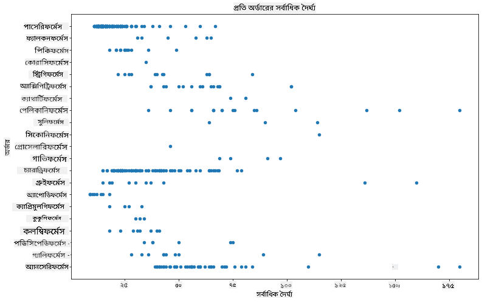
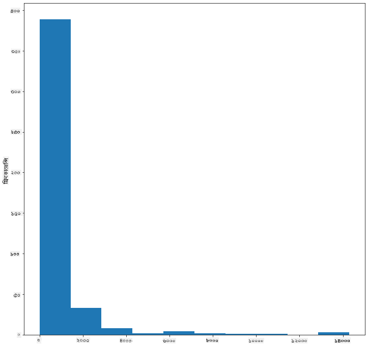
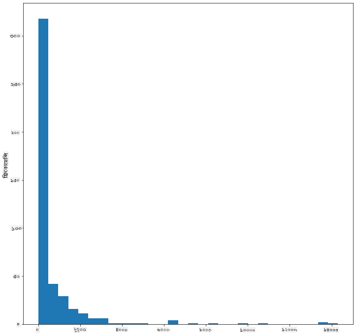
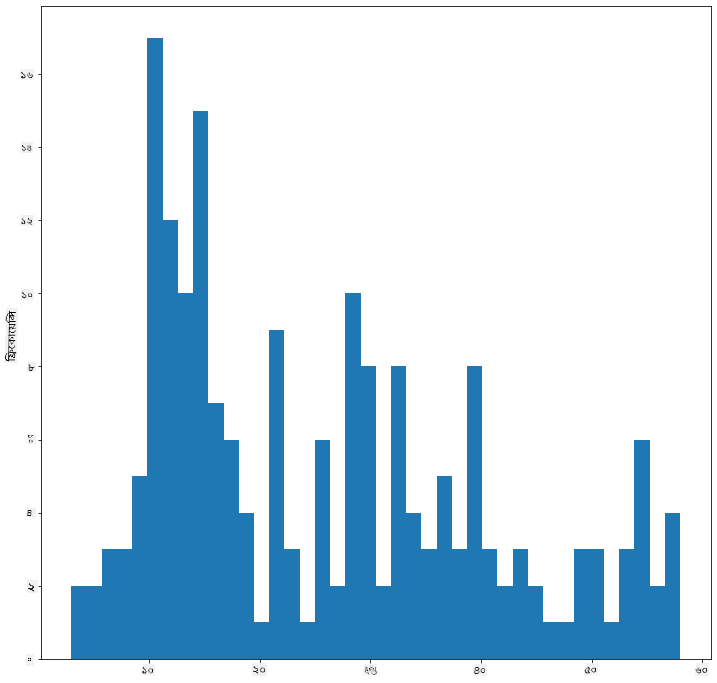
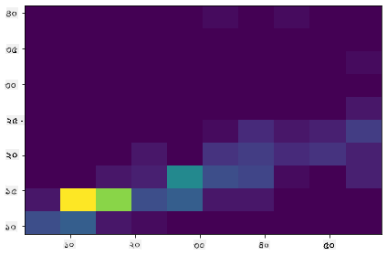
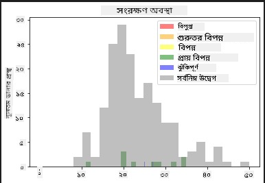
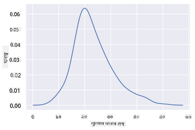
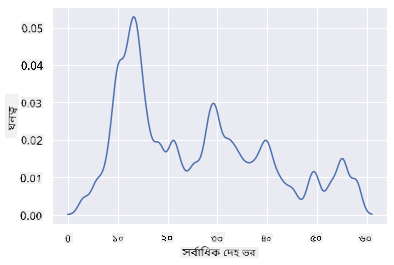
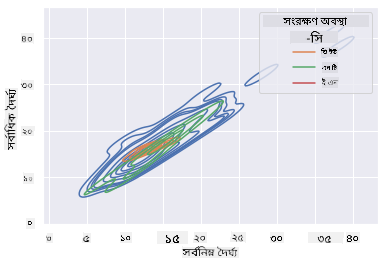

<!--
CO_OP_TRANSLATOR_METADATA:
{
  "original_hash": "02ce904bc1e2bfabb7dc05c25aae375c",
  "translation_date": "2025-09-04T16:34:33+00:00",
  "source_file": "3-Data-Visualization/10-visualization-distributions/README.md",
  "language_code": "bn"
}
-->
# ডিস্ট্রিবিউশন ভিজুয়ালাইজেশন

| দ্বারা ](../../sketchnotes/10-Visualizing-Distributions.png)|
|:---:|
| ডিস্ট্রিবিউশন ভিজুয়ালাইজেশন - _[@nitya](https://twitter.com/nitya) দ্বারা স্কেচনোট_ |

পূর্ববর্তী পাঠে, আপনি মিনেসোটা রাজ্যের পাখিদের একটি ডেটাসেট সম্পর্কে কিছু আকর্ষণীয় তথ্য শিখেছেন। আপনি আউটলায়ার ভিজুয়ালাইজ করে কিছু ভুল ডেটা খুঁজে পেয়েছেন এবং পাখির ক্যাটাগরিগুলোর মধ্যে তাদের সর্বোচ্চ দৈর্ঘ্যের পার্থক্য দেখেছেন।

## [পূর্ব-পাঠ কুইজ](https://purple-hill-04aebfb03.1.azurestaticapps.net/quiz/18)
## পাখিদের ডেটাসেট অন্বেষণ করুন

ডেটা বিশ্লেষণের আরেকটি উপায় হলো এর ডিস্ট্রিবিউশন দেখা, অর্থাৎ ডেটা কীভাবে একটি অক্ষ বরাবর সংগঠিত হয়েছে। উদাহরণস্বরূপ, আপনি হয়তো জানতে চাইবেন মিনেসোটা রাজ্যের পাখিদের সর্বোচ্চ উইংসপ্যান বা সর্বোচ্চ শরীরের ভরের সাধারণ ডিস্ট্রিবিউশন সম্পর্কে।

এই ডেটাসেটের ডিস্ট্রিবিউশন সম্পর্কে কিছু তথ্য আবিষ্কার করা যাক। এই পাঠের ফোল্ডারের মূল অংশে থাকা _notebook.ipynb_ ফাইল থেকে Pandas, Matplotlib এবং আপনার ডেটা ইমপোর্ট করুন:

```python
import pandas as pd
import matplotlib.pyplot as plt
birds = pd.read_csv('../../data/birds.csv')
birds.head()
```

|      | নাম                          | বৈজ্ঞানিক নাম           | ক্যাটাগরি              | অর্ডার        | পরিবার   | জেনাস       | সংরক্ষণ অবস্থা | সর্বনিম্ন দৈর্ঘ্য | সর্বোচ্চ দৈর্ঘ্য | সর্বনিম্ন শরীরের ভর | সর্বোচ্চ শরীরের ভর | সর্বনিম্ন উইংসপ্যান | সর্বোচ্চ উইংসপ্যান |
| ---: | :--------------------------- | :--------------------- | :-------------------- | :----------- | :------- | :---------- | :----------------- | --------: | --------: | ----------: | ----------: | ----------: | ----------: |
|    0 | ব্ল্যাক-বেলিড হুইসলিং-ডাক   | Dendrocygna autumnalis | হাঁস/গিজ/জলপাখি       | Anseriformes | Anatidae | Dendrocygna | LC                 |        47 |        56 |         652 |        1020 |          76 |          94 |
|    1 | ফুলভাস হুইসলিং-ডাক          | Dendrocygna bicolor    | হাঁস/গিজ/জলপাখি       | Anseriformes | Anatidae | Dendrocygna | LC                 |        45 |        53 |         712 |        1050 |          85 |          93 |
|    2 | স্নো গিজ                     | Anser caerulescens     | হাঁস/গিজ/জলপাখি       | Anseriformes | Anatidae | Anser       | LC                 |        64 |        79 |        2050 |        4050 |         135 |         165 |
|    3 | রস'স গিজ                    | Anser rossii           | হাঁস/গিজ/জলপাখি       | Anseriformes | Anatidae | Anser       | LC                 |      57.3 |        64 |        1066 |        1567 |         113 |         116 |
|    4 | গ্রেটার হোয়াইট-ফ্রন্টেড গিজ | Anser albifrons        | হাঁস/গিজ/জলপাখি       | Anseriformes | Anatidae | Anser       | LC                 |        64 |        81 |        1930 |        3310 |         130 |         165 |

সাধারণভাবে, আপনি দ্রুত ডেটা কীভাবে বিতরণ করা হয়েছে তা দেখতে পারেন একটি স্ক্যাটার প্লট ব্যবহার করে, যেমন আমরা পূর্ববর্তী পাঠে করেছি:

```python
birds.plot(kind='scatter',x='MaxLength',y='Order',figsize=(12,8))

plt.title('Max Length per Order')
plt.ylabel('Order')
plt.xlabel('Max Length')

plt.show()
```


এটি পাখির অর্ডার অনুযায়ী শরীরের দৈর্ঘ্যের সাধারণ ডিস্ট্রিবিউশন সম্পর্কে একটি ওভারভিউ দেয়, তবে এটি প্রকৃত ডিস্ট্রিবিউশন দেখানোর জন্য আদর্শ উপায় নয়। এই কাজটি সাধারণত একটি হিস্টোগ্রাম তৈরি করে করা হয়।

## হিস্টোগ্রামের সাথে কাজ করা

Matplotlib ডিস্ট্রিবিউশন ভিজুয়ালাইজ করার জন্য খুব ভালো উপায় প্রদান করে হিস্টোগ্রাম ব্যবহার করে। এই ধরনের চার্ট একটি বার চার্টের মতো যেখানে ডিস্ট্রিবিউশন বারগুলোর উত্থান-পতনের মাধ্যমে দেখা যায়। একটি হিস্টোগ্রাম তৈরি করতে, আপনার প্রয়োজন সংখ্যাসূচক ডেটা। একটি হিস্টোগ্রাম তৈরি করতে, আপনি চার্টের ধরণ 'hist' হিসাবে সংজ্ঞায়িত করতে পারেন। এই চার্টটি পুরো ডেটাসেটের সংখ্যাসূচক ডেটার পরিসরের জন্য MaxBodyMass এর ডিস্ট্রিবিউশন দেখায়। ডেটার অ্যারের ছোট ছোট অংশে বিভক্ত করে, এটি ডেটার মানগুলোর ডিস্ট্রিবিউশন প্রদর্শন করতে পারে:

```python
birds['MaxBodyMass'].plot(kind = 'hist', bins = 10, figsize = (12,12))
plt.show()
```


যেমনটি আপনি দেখতে পাচ্ছেন, এই ডেটাসেটে থাকা ৪০০+ পাখির বেশিরভাগই তাদের Max Body Mass এর ক্ষেত্রে ২০০০ এর নিচে পড়ে। ডেটা সম্পর্কে আরও অন্তর্দৃষ্টি লাভ করতে `bins` প্যারামিটারটি একটি বড় সংখ্যায় পরিবর্তন করুন, যেমন ৩০:

```python
birds['MaxBodyMass'].plot(kind = 'hist', bins = 30, figsize = (12,12))
plt.show()
```


এই চার্টটি আরও বিস্তারিতভাবে ডিস্ট্রিবিউশন দেখায়। একটি কম বাঁ দিকে ঝুঁকানো চার্ট তৈরি করা যেতে পারে যদি আপনি শুধুমাত্র একটি নির্দিষ্ট পরিসরের মধ্যে থাকা ডেটা নির্বাচন করেন:

আপনার ডেটা ফিল্টার করুন শুধুমাত্র সেই পাখিদের পেতে যাদের শরীরের ভর ৬০ এর নিচে এবং ৪০ `bins` দেখান:

```python
filteredBirds = birds[(birds['MaxBodyMass'] > 1) & (birds['MaxBodyMass'] < 60)]      
filteredBirds['MaxBodyMass'].plot(kind = 'hist',bins = 40,figsize = (12,12))
plt.show()     
```


✅ কিছু অন্যান্য ফিল্টার এবং ডেটা পয়েন্ট চেষ্টা করুন। ডেটার সম্পূর্ণ ডিস্ট্রিবিউশন দেখতে, `['MaxBodyMass']` ফিল্টারটি সরিয়ে লেবেলযুক্ত ডিস্ট্রিবিউশন দেখান।

হিস্টোগ্রাম কিছু সুন্দর রঙ এবং লেবেলিং উন্নতি প্রদান করে যা চেষ্টা করা যেতে পারে:

দুইটি ডিস্ট্রিবিউশনের মধ্যে সম্পর্ক তুলনা করতে একটি 2D হিস্টোগ্রাম তৈরি করুন। আসুন `MaxBodyMass` বনাম `MaxLength` তুলনা করি। Matplotlib একটি বিল্ট-ইন উপায় প্রদান করে উজ্জ্বল রঙ ব্যবহার করে কনভারজেন্স দেখানোর জন্য:

```python
x = filteredBirds['MaxBodyMass']
y = filteredBirds['MaxLength']

fig, ax = plt.subplots(tight_layout=True)
hist = ax.hist2d(x, y)
```
এখানে একটি প্রত্যাশিত অক্ষ বরাবর এই দুটি উপাদানের মধ্যে একটি প্রত্যাশিত সম্পর্ক দেখা যাচ্ছে, একটি বিশেষভাবে শক্তিশালী কনভারজেন্স পয়েন্ট সহ:



হিস্টোগ্রাম ডিফল্টভাবে সংখ্যাসূচক ডেটার জন্য ভালো কাজ করে। যদি আপনি টেক্সট ডেটা অনুযায়ী ডিস্ট্রিবিউশন দেখতে চান তাহলে কী করবেন? 
## টেক্সট ডেটা ব্যবহার করে ডেটাসেটের ডিস্ট্রিবিউশন অন্বেষণ করুন 

এই ডেটাসেটে পাখির ক্যাটাগরি, জেনাস, প্রজাতি এবং পরিবার সম্পর্কে পাশাপাশি সংরক্ষণ অবস্থা সম্পর্কেও ভালো তথ্য রয়েছে। আসুন এই সংরক্ষণ তথ্যটি অন্বেষণ করি। পাখির সংরক্ষণ অবস্থার অনুযায়ী ডিস্ট্রিবিউশন কী?

> ✅ ডেটাসেটে সংরক্ষণ অবস্থার বর্ণনা করার জন্য কয়েকটি সংক্ষিপ্ত রূপ ব্যবহার করা হয়েছে। এই সংক্ষিপ্ত রূপগুলো [IUCN Red List Categories](https://www.iucnredlist.org/) থেকে এসেছে, একটি সংস্থা যা প্রজাতির অবস্থা ক্যাটালগ করে।
> 
> - CR: অত্যন্ত বিপন্ন
> - EN: বিপন্ন
> - EX: বিলুপ্ত
> - LC: কম উদ্বেগ
> - NT: প্রায় বিপন্ন
> - VU: দুর্বল

এগুলো টেক্সট-ভিত্তিক মান, তাই একটি হিস্টোগ্রাম তৈরি করতে আপনাকে একটি রূপান্তর করতে হবে। FilteredBirds ডেটাফ্রেম ব্যবহার করে এর সংরক্ষণ অবস্থার সাথে এর সর্বনিম্ন উইংসপ্যান প্রদর্শন করুন। আপনি কী দেখতে পাচ্ছেন? 

```python
x1 = filteredBirds.loc[filteredBirds.ConservationStatus=='EX', 'MinWingspan']
x2 = filteredBirds.loc[filteredBirds.ConservationStatus=='CR', 'MinWingspan']
x3 = filteredBirds.loc[filteredBirds.ConservationStatus=='EN', 'MinWingspan']
x4 = filteredBirds.loc[filteredBirds.ConservationStatus=='NT', 'MinWingspan']
x5 = filteredBirds.loc[filteredBirds.ConservationStatus=='VU', 'MinWingspan']
x6 = filteredBirds.loc[filteredBirds.ConservationStatus=='LC', 'MinWingspan']

kwargs = dict(alpha=0.5, bins=20)

plt.hist(x1, **kwargs, color='red', label='Extinct')
plt.hist(x2, **kwargs, color='orange', label='Critically Endangered')
plt.hist(x3, **kwargs, color='yellow', label='Endangered')
plt.hist(x4, **kwargs, color='green', label='Near Threatened')
plt.hist(x5, **kwargs, color='blue', label='Vulnerable')
plt.hist(x6, **kwargs, color='gray', label='Least Concern')

plt.gca().set(title='Conservation Status', ylabel='Min Wingspan')
plt.legend();
```



সর্বনিম্ন উইংসপ্যান এবং সংরক্ষণ অবস্থার মধ্যে ভালো সম্পর্ক দেখা যাচ্ছে না। এই পদ্ধতি ব্যবহার করে ডেটাসেটের অন্যান্য উপাদান পরীক্ষা করুন। আপনি বিভিন্ন ফিল্টারও চেষ্টা করতে পারেন। কোনো সম্পর্ক খুঁজে পাচ্ছেন কি?

## ডেনসিটি প্লট

আপনি হয়তো লক্ষ্য করেছেন যে আমরা এখন পর্যন্ত যে হিস্টোগ্রামগুলো দেখেছি সেগুলো 'স্টেপড' এবং মসৃণভাবে একটি আর্কে প্রবাহিত হয় না। একটি মসৃণ ডেনসিটি চার্ট দেখানোর জন্য, আপনি একটি ডেনসিটি প্লট চেষ্টা করতে পারেন।

ডেনসিটি প্লটের সাথে কাজ করতে, একটি নতুন প্লটিং লাইব্রেরি [Seaborn](https://seaborn.pydata.org/generated/seaborn.kdeplot.html) সম্পর্কে পরিচিত হন।

Seaborn লোড করে একটি বেসিক ডেনসিটি প্লট চেষ্টা করুন:

```python
import seaborn as sns
import matplotlib.pyplot as plt
sns.kdeplot(filteredBirds['MinWingspan'])
plt.show()
```


আপনি দেখতে পাচ্ছেন যে প্লটটি পূর্ববর্তী সর্বনিম্ন উইংসপ্যান ডেটার মতোই প্রতিধ্বনিত হয়েছে; এটি শুধু একটু মসৃণ। Seaborn এর ডকুমেন্টেশনের মতে, "একটি হিস্টোগ্রামের তুলনায়, KDE একটি প্লট তৈরি করতে পারে যা কম বিশৃঙ্খল এবং আরও ব্যাখ্যাযোগ্য, বিশেষত যখন একাধিক ডিস্ট্রিবিউশন আঁকা হয়। তবে এটি বিকৃতি প্রবর্তনের সম্ভাবনা রাখে যদি অন্তর্নিহিত ডিস্ট্রিবিউশন সীমাবদ্ধ বা মসৃণ না হয়। একটি হিস্টোগ্রামের মতো, প্রতিনিধিত্বের গুণমানও ভালো মসৃণ প্যারামিটার নির্বাচন করার উপর নির্ভর করে।" [source](https://seaborn.pydata.org/generated/seaborn.kdeplot.html) অর্থাৎ, আউটলায়ার সবসময় আপনার চার্টগুলোকে খারাপভাবে প্রভাবিত করবে।

আপনি যদি দ্বিতীয় চার্টে তৈরি করা সেই খাঁজযুক্ত MaxBodyMass লাইনটি পুনর্বিবেচনা করতে চান, আপনি এটি এই পদ্ধতি ব্যবহার করে খুব ভালোভাবে মসৃণ করতে পারেন:

```python
sns.kdeplot(filteredBirds['MaxBodyMass'])
plt.show()
```


আপনি যদি একটি মসৃণ, তবে খুব বেশি মসৃণ না হওয়া লাইন চান, তাহলে `bw_adjust` প্যারামিটার সম্পাদনা করুন:

```python
sns.kdeplot(filteredBirds['MaxBodyMass'], bw_adjust=.2)
plt.show()
```


✅ এই ধরনের প্লটের জন্য উপলব্ধ প্যারামিটার সম্পর্কে পড়ুন এবং পরীক্ষা করুন!

এই ধরনের চার্ট সুন্দরভাবে ব্যাখ্যাযোগ্য ভিজুয়ালাইজেশন প্রদান করে। উদাহরণস্বরূপ, কয়েকটি কোডের মাধ্যমে আপনি পাখির অর্ডার অনুযায়ী সর্বোচ্চ শরীরের ভরের ডেনসিটি দেখাতে পারেন:

```python
sns.kdeplot(
   data=filteredBirds, x="MaxBodyMass", hue="Order",
   fill=True, common_norm=False, palette="crest",
   alpha=.5, linewidth=0,
)
```


আপনি এক চার্টে একাধিক ভেরিয়েবলের ডেনসিটি ম্যাপ করতে পারেন। পাখির সর্বোচ্চ দৈর্ঘ্য এবং সর্বনিম্ন দৈর্ঘ্য তাদের সংরক্ষণ অবস্থার সাথে তুলনা করুন:

```python
sns.kdeplot(data=filteredBirds, x="MinLength", y="MaxLength", hue="ConservationStatus")
```



সম্ভবত এটি গবেষণা করার মতো যে 'দুর্বল' পাখিদের দৈর্ঘ্যের ভিত্তিতে ক্লাস্টারটি অর্থপূর্ণ কিনা।

## 🚀 চ্যালেঞ্জ

হিস্টোগ্রাম একটি বেসিক স্ক্যাটারপ্লট, বার চার্ট বা লাইন চার্টের তুলনায় আরও উন্নত ধরনের চার্ট। ইন্টারনেটে অনুসন্ধান করুন এবং হিস্টোগ্রামের ভালো উদাহরণ খুঁজুন। সেগুলো কীভাবে ব্যবহার করা হয়, কী প্রদর্শন করে এবং কোন ক্ষেত্র বা অনুসন্ধানের ক্ষেত্রে সেগুলো ব্যবহৃত হয় তা জানুন।

## [পোস্ট-পাঠ কুইজ](https://ff-quizzes.netlify.app/en/ds/)

## পর্যালোচনা ও স্ব-অধ্যয়ন

এই পাঠে, আপনি Matplotlib ব্যবহার করেছেন এবং আরও উন্নত চার্ট দেখানোর জন্য Seaborn এর সাথে কাজ শুরু করেছেন। Seaborn এর `kdeplot` সম্পর্কে গবেষণা করুন, একটি "এক বা একাধিক মাত্রায় ক্রমাগত সম্ভাব্যতা ডেনসিটি কার্ভ"। [ডকুমেন্টেশন](https://seaborn.pydata.org/generated/seaborn.kdeplot.html) পড়ুন এবং এটি কীভাবে কাজ করে তা বুঝুন।

## অ্যাসাইনমেন্ট

[আপনার দক্ষতা প্রয়োগ করুন](assignment.md)

---

**অস্বীকৃতি**:  
এই নথিটি AI অনুবাদ পরিষেবা [Co-op Translator](https://github.com/Azure/co-op-translator) ব্যবহার করে অনুবাদ করা হয়েছে। আমরা যথাসাধ্য সঠিকতা নিশ্চিত করার চেষ্টা করি, তবে অনুগ্রহ করে মনে রাখবেন যে স্বয়ংক্রিয় অনুবাদে ত্রুটি বা অসঙ্গতি থাকতে পারে। মূল ভাষায় থাকা নথিটিকে প্রামাণিক উৎস হিসেবে বিবেচনা করা উচিত। গুরুত্বপূর্ণ তথ্যের জন্য, পেশাদার মানব অনুবাদ সুপারিশ করা হয়। এই অনুবাদ ব্যবহারের ফলে কোনো ভুল বোঝাবুঝি বা ভুল ব্যাখ্যা হলে আমরা তার জন্য দায়ী থাকব না।