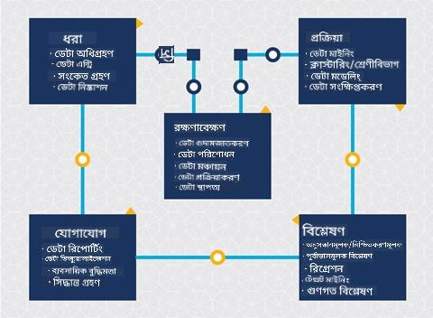
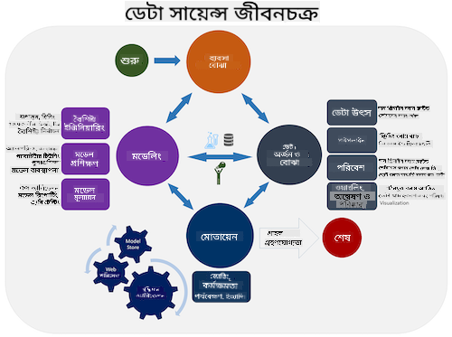
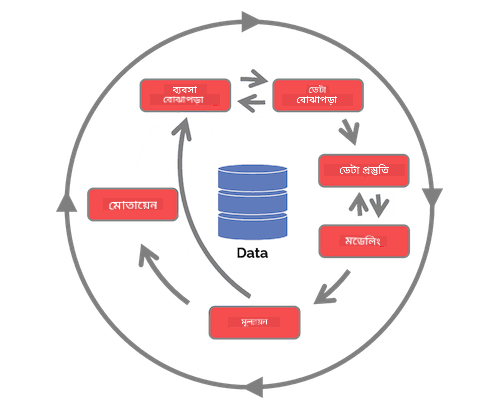

<!--
CO_OP_TRANSLATOR_METADATA:
{
  "original_hash": "07e12a25d20b8f191e3cb651c27fdb2b",
  "translation_date": "2025-09-06T20:39:29+00:00",
  "source_file": "4-Data-Science-Lifecycle/14-Introduction/README.md",
  "language_code": "bn"
}
-->
# ডেটা সায়েন্স লাইফসাইকেলের পরিচিতি

| দ্বারা ](../../sketchnotes/14-DataScience-Lifecycle.png)|
|:---:|
| ডেটা সায়েন্স লাইফসাইকেলের পরিচিতি - _[@nitya](https://twitter.com/nitya) দ্বারা স্কেচনোট_ |

## [পূর্ব-লেকচার কুইজ](https://ff-quizzes.netlify.app/en/ds/quiz/26)

এ পর্যায়ে আপনি সম্ভবত বুঝতে পেরেছেন যে ডেটা সায়েন্স একটি প্রক্রিয়া। এই প্রক্রিয়াটি ৫টি ধাপে ভাগ করা যায়:

- ডেটা সংগ্রহ
- প্রক্রিয়াকরণ
- বিশ্লেষণ
- যোগাযোগ
- রক্ষণাবেক্ষণ

এই পাঠটি লাইফসাইকেলের ৩টি অংশের উপর কেন্দ্রীভূত: ডেটা সংগ্রহ, প্রক্রিয়াকরণ এবং রক্ষণাবেক্ষণ।

> ছবি [Berkeley School of Information](https://ischoolonline.berkeley.edu/data-science/what-is-data-science/) দ্বারা

## ডেটা সংগ্রহ

লাইফসাইকেলের প্রথম ধাপটি অত্যন্ত গুরুত্বপূর্ণ কারণ পরবর্তী ধাপগুলো এর উপর নির্ভরশীল। এটি কার্যত দুটি ধাপকে একত্রিত করে: ডেটা সংগ্রহ এবং প্রকল্পের উদ্দেশ্য ও সমস্যাগুলো সংজ্ঞায়িত করা।  
প্রকল্পের লক্ষ্য সংজ্ঞায়িত করতে সমস্যার বা প্রশ্নের গভীর প্রেক্ষাপট প্রয়োজন। প্রথমে, আমাদের তাদের চিহ্নিত করতে হবে এবং তাদের সাথে যোগাযোগ করতে হবে যাদের সমস্যার সমাধান প্রয়োজন। এটি হতে পারে ব্যবসার স্টেকহোল্ডার বা প্রকল্পের স্পনসর, যারা প্রকল্পটি থেকে কে বা কী উপকৃত হবে এবং কেন তা চিহ্নিত করতে সাহায্য করতে পারে। একটি ভালোভাবে সংজ্ঞায়িত লক্ষ্য পরিমাপযোগ্য এবং পরিমাণগত হওয়া উচিত যাতে একটি গ্রহণযোগ্য ফলাফল নির্ধারণ করা যায়।

একজন ডেটা সায়েন্টিস্ট যে প্রশ্নগুলো করতে পারেন:
-	এই সমস্যাটি আগে সমাধানের চেষ্টা করা হয়েছে কি? কী জানা গেছে?
-	উদ্দেশ্য এবং লক্ষ্য কি সংশ্লিষ্ট সকলের দ্বারা বোঝা গেছে?
-	কোন অস্পষ্টতা আছে এবং কীভাবে তা কমানো যায়?
-	সীমাবদ্ধতাগুলো কী?
-	সম্ভাব্য চূড়ান্ত ফলাফল কেমন হতে পারে?
-	কতটুকু সম্পদ (সময়, জনবল, কম্পিউটেশনাল) উপলব্ধ?

পরবর্তী ধাপটি হলো ডেটা চিহ্নিত করা, সংগ্রহ করা এবং তারপর সেই ডেটা অন্বেষণ করা যা এই সংজ্ঞায়িত লক্ষ্য অর্জনে প্রয়োজন। এই সংগ্রহের ধাপে, ডেটা সায়েন্টিস্টদের ডেটার পরিমাণ এবং গুণমান মূল্যায়ন করতে হবে। এটি নিশ্চিত করতে কিছু ডেটা অন্বেষণ প্রয়োজন যে যা সংগ্রহ করা হয়েছে তা কাঙ্ক্ষিত ফলাফল অর্জনে সহায়ক হবে।

ডেটা সম্পর্কে একজন ডেটা সায়েন্টিস্ট যে প্রশ্নগুলো করতে পারেন:
-	আমার কাছে ইতিমধ্যে কী ডেটা উপলব্ধ?
-	এই ডেটার মালিক কে?
-	গোপনীয়তার উদ্বেগগুলো কী?
-	এই সমস্যার সমাধানের জন্য আমার কাছে পর্যাপ্ত ডেটা আছে কি?
-	এই সমস্যার জন্য ডেটার গুণমান গ্রহণযোগ্য কি?
-	যদি আমি এই ডেটার মাধ্যমে অতিরিক্ত তথ্য আবিষ্কার করি, তাহলে কি আমাদের লক্ষ্য পরিবর্তন বা পুনঃসংজ্ঞায়িত করা উচিত?

## প্রক্রিয়াকরণ

লাইফসাইকেলের প্রক্রিয়াকরণ ধাপটি ডেটায় প্যাটার্ন আবিষ্কার এবং মডেলিংয়ের উপর কেন্দ্রীভূত। প্রক্রিয়াকরণ ধাপে ব্যবহৃত কিছু কৌশল পরিসংখ্যান পদ্ধতির প্রয়োজন হয় প্যাটার্নগুলো উন্মোচন করতে। সাধারণত, এটি একটি বড় ডেটাসেটের ক্ষেত্রে মানুষের জন্য একটি ক্লান্তিকর কাজ হবে এবং প্রক্রিয়াটি দ্রুত করার জন্য কম্পিউটারের উপর নির্ভর করতে হবে। এই ধাপটি ডেটা সায়েন্স এবং মেশিন লার্নিংয়ের সংযোগস্থলও। প্রথম পাঠে আপনি শিখেছেন, মেশিন লার্নিং হলো ডেটা বোঝার জন্য মডেল তৈরি করার প্রক্রিয়া। মডেল হলো ডেটার ভেরিয়েবলগুলোর মধ্যে সম্পর্কের একটি উপস্থাপনা যা ফলাফল পূর্বাভাসে সাহায্য করে।

এই ধাপে ব্যবহৃত সাধারণ কৌশলগুলো ML for Beginners কারিকুলামে অন্তর্ভুক্ত। আরও জানতে লিঙ্কগুলো অনুসরণ করুন:

- [Classification](https://github.com/microsoft/ML-For-Beginners/tree/main/4-Classification): ডেটাকে ক্যাটাগরিতে সংগঠিত করা যাতে এটি আরও কার্যকরভাবে ব্যবহার করা যায়।
- [Clustering](https://github.com/microsoft/ML-For-Beginners/tree/main/5-Clustering): ডেটাকে একই ধরনের গ্রুপে ভাগ করা।
- [Regression](https://github.com/microsoft/ML-For-Beginners/tree/main/2-Regression): ভেরিয়েবলগুলোর মধ্যে সম্পর্ক নির্ধারণ করে মান পূর্বাভাস বা পূর্বাভাস দেওয়া।

## রক্ষণাবেক্ষণ

লাইফসাইকেলের চিত্রে আপনি লক্ষ্য করতে পারেন যে রক্ষণাবেক্ষণ ডেটা সংগ্রহ এবং প্রক্রিয়াকরণের মধ্যে অবস্থান করছে। রক্ষণাবেক্ষণ হলো একটি চলমান প্রক্রিয়া যা প্রকল্পের পুরো সময়কালে ডেটা পরিচালনা, সংরক্ষণ এবং সুরক্ষিত করার উপর কেন্দ্রীভূত। 

### ডেটা সংরক্ষণ
ডেটা কীভাবে এবং কোথায় সংরক্ষণ করা হবে তা বিবেচনা করা এর সংরক্ষণের খরচ এবং ডেটা কত দ্রুত অ্যাক্সেস করা যাবে তার উপর প্রভাব ফেলতে পারে। এই ধরনের সিদ্ধান্ত সাধারণত শুধুমাত্র একজন ডেটা সায়েন্টিস্ট দ্বারা নেওয়া হয় না, তবে তারা ডেটা কীভাবে সংরক্ষিত তার উপর ভিত্তি করে কাজ করার পদ্ধতি বেছে নিতে পারেন।

আধুনিক ডেটা সংরক্ষণ ব্যবস্থার কিছু দিক যা এই সিদ্ধান্তগুলোকে প্রভাবিত করতে পারে:

**অন-প্রিমাইজ বনাম অফ-প্রিমাইজ বনাম পাবলিক বা প্রাইভেট ক্লাউড**

অন-প্রিমাইজ বলতে বোঝায় নিজের সরঞ্জামে ডেটা হোস্টিং এবং পরিচালনা করা, যেমন একটি সার্ভার যার হার্ড ড্রাইভে ডেটা সংরক্ষিত থাকে। অন্যদিকে, অফ-প্রিমাইজ এমন সরঞ্জামের উপর নির্ভর করে যা আপনি মালিকানাধীন নন, যেমন একটি ডেটা সেন্টার। পাবলিক ক্লাউড হলো ডেটা সংরক্ষণের একটি জনপ্রিয় পদ্ধতি যেখানে ডেটা কীভাবে বা কোথায় সংরক্ষিত তা জানার প্রয়োজন হয় না। পাবলিক বলতে বোঝায় একটি অভিন্ন অবকাঠামো যা ক্লাউড ব্যবহারকারী সকলের জন্য ভাগ করা। কিছু সংস্থার কঠোর নিরাপত্তা নীতিমালা থাকে যা তাদের ডেটা হোস্ট করা সরঞ্জামে সম্পূর্ণ অ্যাক্সেসের প্রয়োজন এবং তারা একটি প্রাইভেট ক্লাউড ব্যবহার করে যা নিজস্ব ক্লাউড পরিষেবা প্রদান করে। আপনি [পরবর্তী পাঠে](https://github.com/microsoft/Data-Science-For-Beginners/tree/main/5-Data-Science-In-Cloud) ক্লাউডে ডেটা সম্পর্কে আরও শিখবেন।

**কোল্ড বনাম হট ডেটা**

আপনার মডেল প্রশিক্ষণ করার সময়, আপনার আরও প্রশিক্ষণ ডেটার প্রয়োজন হতে পারে। যদি আপনি আপনার মডেল নিয়ে সন্তুষ্ট হন, তবে মডেল তার উদ্দেশ্য পূরণের জন্য আরও ডেটা গ্রহণ করবে। যেকোনো ক্ষেত্রে, ডেটা সংরক্ষণ এবং অ্যাক্সেস করার খরচ বাড়বে যত বেশি ডেটা জমা হবে। কম ব্যবহৃত ডেটা, যা কোল্ড ডেটা নামে পরিচিত, এবং ঘন ঘন অ্যাক্সেস করা হট ডেটা আলাদা করা সস্তা ডেটা সংরক্ষণের একটি বিকল্প হতে পারে হার্ডওয়্যার বা সফটওয়্যার পরিষেবার মাধ্যমে। যদি কোল্ড ডেটা অ্যাক্সেস করতে হয়, তবে এটি হট ডেটার তুলনায় একটু বেশি সময় নিতে পারে।

### ডেটা পরিচালনা
ডেটা নিয়ে কাজ করার সময় আপনি আবিষ্কার করতে পারেন যে কিছু ডেটা পরিষ্কার করার প্রয়োজন রয়েছে, যা [ডেটা প্রস্তুতি](https://github.com/microsoft/Data-Science-For-Beginners/tree/main/2-Working-With-Data/08-data-preparation) পাঠে আলোচনা করা কৌশলগুলো ব্যবহার করে সঠিক মডেল তৈরি করতে সাহায্য করে। নতুন ডেটা এলে, গুণমানের সামঞ্জস্য বজায় রাখতে একই ধরনের প্রয়োগ প্রয়োজন হবে। কিছু প্রকল্পে ডেটা চূড়ান্ত অবস্থানে সরানোর আগে এটি পরিষ্কার, একত্রিত এবং সংকুচিত করার জন্য একটি স্বয়ংক্রিয় টুল ব্যবহার করা হবে। Azure Data Factory হলো এই ধরনের একটি টুলের উদাহরণ।

### ডেটা সুরক্ষা
ডেটা সুরক্ষার প্রধান লক্ষ্যগুলোর একটি হলো নিশ্চিত করা যে যারা এটি নিয়ে কাজ করছেন তারা কী সংগ্রহ করা হচ্ছে এবং কোন প্রেক্ষাপটে এটি ব্যবহার করা হচ্ছে তার উপর নিয়ন্ত্রণে আছেন। ডেটা সুরক্ষিত রাখা মানে শুধুমাত্র তাদের অ্যাক্সেস সীমিত করা যারা এটি প্রয়োজন, স্থানীয় আইন এবং নিয়মাবলী মেনে চলা, এবং [নৈতিকতা পাঠে](https://github.com/microsoft/Data-Science-For-Beginners/tree/main/1-Introduction/02-ethics) আলোচনা করা নৈতিক মান বজায় রাখা।

নিরাপত্তার কথা মাথায় রেখে একটি দল যা করতে পারে:
- নিশ্চিত করা যে সমস্ত ডেটা এনক্রিপ্ট করা হয়েছে
- গ্রাহকদের তাদের ডেটা কীভাবে ব্যবহার করা হচ্ছে সে সম্পর্কে তথ্য প্রদান করা
- যারা প্রকল্প ছেড়ে গেছে তাদের ডেটা অ্যাক্সেস সরিয়ে ফেলা
- শুধুমাত্র নির্দিষ্ট প্রকল্প সদস্যদের ডেটা পরিবর্তন করার অনুমতি দেওয়া

## 🚀 চ্যালেঞ্জ

ডেটা সায়েন্স লাইফসাইকেলের অনেক সংস্করণ রয়েছে, যেখানে প্রতিটি ধাপের নাম এবং ধাপের সংখ্যা ভিন্ন হতে পারে তবে এই পাঠে উল্লেখিত প্রক্রিয়াগুলো একই থাকবে।

[টিম ডেটা সায়েন্স প্রক্রিয়া লাইফসাইকেল](https://docs.microsoft.com/en-us/azure/architecture/data-science-process/lifecycle) এবং [ক্রস-ইন্ডাস্ট্রি স্ট্যান্ডার্ড প্রক্রিয়া ফর ডেটা মাইনিং](https://www.datascience-pm.com/crisp-dm-2/) অন্বেষণ করুন। এই দুটি প্রক্রিয়ার মধ্যে ৩টি মিল এবং পার্থক্য উল্লেখ করুন।

|টিম ডেটা সায়েন্স প্রক্রিয়া (TDSP)|ক্রস-ইন্ডাস্ট্রি স্ট্যান্ডার্ড প্রক্রিয়া ফর ডেটা মাইনিং (CRISP-DM)|
|--|--|
| |  |
| ছবি [Microsoft](https://docs.microsoft.comazure/architecture/data-science-process/lifecycle) দ্বারা | ছবি [Data Science Process Alliance](https://www.datascience-pm.com/crisp-dm-2/) দ্বারা |

## [পোস্ট-লেকচার কুইজ](https://ff-quizzes.netlify.app/en/ds/quiz/27)

## পর্যালোচনা ও স্ব-অধ্যয়ন

ডেটা সায়েন্স লাইফসাইকেল প্রয়োগে একাধিক ভূমিকা এবং কাজ জড়িত থাকে, যেখানে কিছু নির্দিষ্ট ধাপের উপর কেন্দ্রীভূত হতে পারে। টিম ডেটা সায়েন্স প্রক্রিয়া কিছু সংস্থান প্রদান করে যা ব্যাখ্যা করে যে কেউ প্রকল্পে কী ধরনের ভূমিকা এবং কাজ করতে পারে।

* [টিম ডেটা সায়েন্স প্রক্রিয়ার ভূমিকা এবং কাজ](https://docs.microsoft.com/en-us/azure/architecture/data-science-process/roles-tasks)
* [ডেটা সায়েন্স কাজ সম্পাদন: অন্বেষণ, মডেলিং এবং ডিপ্লয়মেন্ট](https://docs.microsoft.com/en-us/azure/architecture/data-science-process/execute-data-science-tasks)

## অ্যাসাইনমেন্ট

[একটি ডেটাসেট মূল্যায়ন](assignment.md)

---

**অস্বীকৃতি**:  
এই নথিটি AI অনুবাদ পরিষেবা [Co-op Translator](https://github.com/Azure/co-op-translator) ব্যবহার করে অনুবাদ করা হয়েছে। আমরা যথাসম্ভব সঠিক অনুবাদের চেষ্টা করি, তবে অনুগ্রহ করে মনে রাখবেন যে স্বয়ংক্রিয় অনুবাদে ত্রুটি বা অসঙ্গতি থাকতে পারে। নথিটির মূল ভাষায় লেখা সংস্করণটিকেই প্রামাণিক উৎস হিসেবে বিবেচনা করা উচিত। গুরুত্বপূর্ণ তথ্যের জন্য, পেশাদার মানব অনুবাদ ব্যবহার করার পরামর্শ দেওয়া হচ্ছে। এই অনুবাদ ব্যবহারের ফলে সৃষ্ট কোনো ভুল বোঝাবুঝি বা ভুল ব্যাখ্যার জন্য আমরা দায়ী নই।