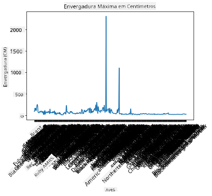
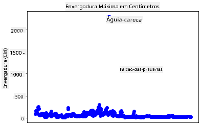
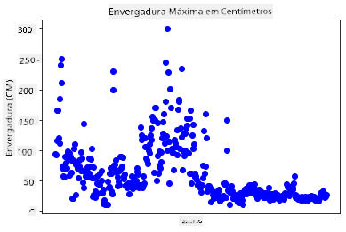
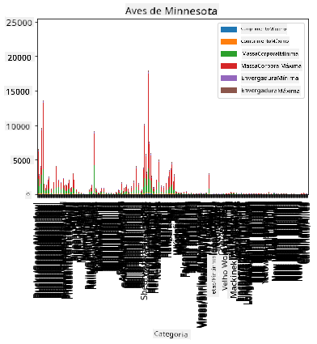
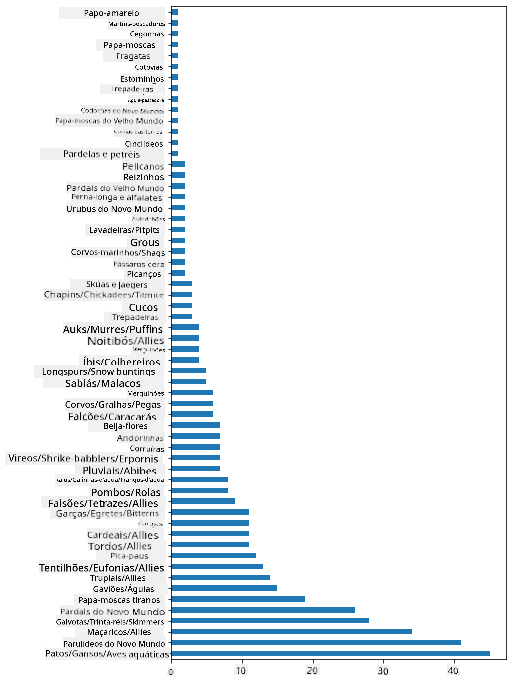
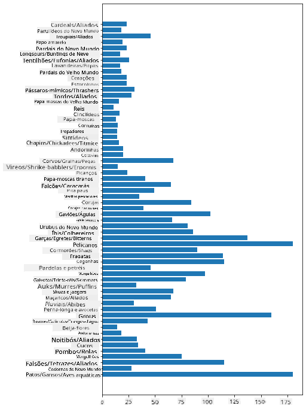
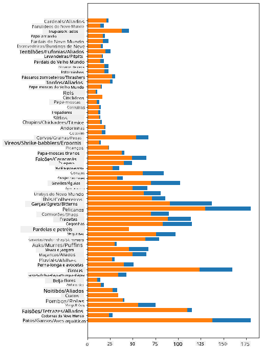

<!--
CO_OP_TRANSLATOR_METADATA:
{
  "original_hash": "69b32b6789a91f796ebc7a02f5575e03",
  "translation_date": "2025-09-04T17:47:33+00:00",
  "source_file": "3-Data-Visualization/09-visualization-quantities/README.md",
  "language_code": "br"
}
-->
# Visualizando Quantidades

| ](../../sketchnotes/09-Visualizing-Quantities.png)|
|:---:|
| Visualizando Quantidades - _Sketchnote por [@nitya](https://twitter.com/nitya)_ |

Nesta lição, você explorará como usar uma das muitas bibliotecas disponíveis em Python para aprender a criar visualizações interessantes em torno do conceito de quantidade. Usando um conjunto de dados limpo sobre os pássaros de Minnesota, você pode aprender muitos fatos interessantes sobre a vida selvagem local.  
## [Quiz pré-aula](https://purple-hill-04aebfb03.1.azurestaticapps.net/quiz/16)

## Observe a envergadura com Matplotlib

Uma excelente biblioteca para criar gráficos e diagramas simples e sofisticados de vários tipos é [Matplotlib](https://matplotlib.org/stable/index.html). Em termos gerais, o processo de plotar dados usando essas bibliotecas inclui identificar as partes do seu dataframe que você deseja analisar, realizar as transformações necessárias nesses dados, atribuir valores aos eixos x e y, decidir qual tipo de gráfico mostrar e, então, exibir o gráfico. O Matplotlib oferece uma grande variedade de visualizações, mas para esta lição, vamos focar nas mais apropriadas para visualizar quantidades: gráficos de linha, dispersão e barras.

> ✅ Use o melhor gráfico para se adequar à estrutura dos seus dados e à história que você quer contar.  
> - Para analisar tendências ao longo do tempo: linha  
> - Para comparar valores: barra, coluna, pizza, dispersão  
> - Para mostrar como as partes se relacionam com o todo: pizza  
> - Para mostrar a distribuição dos dados: dispersão, barra  
> - Para mostrar tendências: linha, coluna  
> - Para mostrar relações entre valores: linha, dispersão, bolha  

Se você tem um conjunto de dados e precisa descobrir quanto de um determinado item está incluído, uma das primeiras tarefas será inspecionar seus valores.  

✅ Existem ótimos 'cheat sheets' disponíveis para Matplotlib [aqui](https://matplotlib.org/cheatsheets/cheatsheets.pdf).

## Construa um gráfico de linha sobre os valores de envergadura das asas dos pássaros

Abra o arquivo `notebook.ipynb` na raiz da pasta desta lição e adicione uma célula.

> Nota: os dados estão armazenados na raiz deste repositório na pasta `/data`.

```python
import pandas as pd
import matplotlib.pyplot as plt
birds = pd.read_csv('../../data/birds.csv')
birds.head()
```  
Esses dados são uma mistura de texto e números:

|      | Nome                         | NomeCientífico         | Categoria              | Ordem        | Família   | Gênero       | StatusConservação | MinComprimento | MaxComprimento | MinPesoCorporal | MaxPesoCorporal | MinEnvergadura | MaxEnvergadura |
| ---: | :--------------------------- | :--------------------- | :-------------------- | :----------- | :------- | :---------- | :----------------- | --------: | --------: | ----------: | ----------: | ----------: | ----------: |
|    0 | Pato-de-bico-preto           | Dendrocygna autumnalis | Patos/Gansos/AvesAquáticas | Anseriformes | Anatidae | Dendrocygna | LC                 |        47 |        56 |         652 |        1020 |          76 |          94 |
|    1 | Pato-de-bico-fulvo           | Dendrocygna bicolor    | Patos/Gansos/AvesAquáticas | Anseriformes | Anatidae | Dendrocygna | LC                 |        45 |        53 |         712 |        1050 |          85 |          93 |
|    2 | Ganso-da-neve                | Anser caerulescens     | Patos/Gansos/AvesAquáticas | Anseriformes | Anatidae | Anser       | LC                 |        64 |        79 |        2050 |        4050 |         135 |         165 |
|    3 | Ganso-de-Ross                | Anser rossii           | Patos/Gansos/AvesAquáticas | Anseriformes | Anatidae | Anser       | LC                 |      57.3 |        64 |        1066 |        1567 |         113 |         116 |
|    4 | Ganso-de-fronte-branca       | Anser albifrons        | Patos/Gansos/AvesAquáticas | Anseriformes | Anatidae | Anser       | LC                 |        64 |        81 |        1930 |        3310 |         130 |         165 |

Vamos começar plotando alguns dos dados numéricos usando um gráfico de linha básico. Suponha que você queira visualizar a envergadura máxima desses pássaros interessantes.

```python
wingspan = birds['MaxWingspan'] 
wingspan.plot()
```  


O que você percebe imediatamente? Parece haver pelo menos um valor discrepante - que envergadura impressionante! Uma envergadura de 2300 centímetros equivale a 23 metros - há Pterodátilos vagando por Minnesota? Vamos investigar.

Embora você possa fazer uma classificação rápida no Excel para encontrar esses valores discrepantes, que provavelmente são erros de digitação, continue o processo de visualização trabalhando diretamente no gráfico.

Adicione rótulos ao eixo x para mostrar quais tipos de pássaros estão em questão:

```
plt.title('Max Wingspan in Centimeters')
plt.ylabel('Wingspan (CM)')
plt.xlabel('Birds')
plt.xticks(rotation=45)
x = birds['Name'] 
y = birds['MaxWingspan']

plt.plot(x, y)

plt.show()
```  


Mesmo com a rotação dos rótulos ajustada para 45 graus, há muitos para serem lidos. Vamos tentar uma estratégia diferente: rotular apenas os valores discrepantes e definir os rótulos dentro do gráfico. Você pode usar um gráfico de dispersão para criar mais espaço para os rótulos:

```python
plt.title('Max Wingspan in Centimeters')
plt.ylabel('Wingspan (CM)')
plt.tick_params(axis='both',which='both',labelbottom=False,bottom=False)

for i in range(len(birds)):
    x = birds['Name'][i]
    y = birds['MaxWingspan'][i]
    plt.plot(x, y, 'bo')
    if birds['MaxWingspan'][i] > 500:
        plt.text(x, y * (1 - 0.05), birds['Name'][i], fontsize=12)
    
plt.show()
```  
O que está acontecendo aqui? Você usou `tick_params` para ocultar os rótulos inferiores e, em seguida, criou um loop sobre o conjunto de dados dos pássaros. Plotando o gráfico com pequenos pontos azuis redondos usando `bo`, você verificou se algum pássaro tinha uma envergadura máxima acima de 500 e exibiu seu rótulo ao lado do ponto, caso positivo. Você deslocou os rótulos um pouco no eixo y (`y * (1 - 0.05)`) e usou o nome do pássaro como rótulo.

O que você descobriu?

  
## Filtre seus dados

Tanto a Águia-careca quanto o Falcão-das-pradarias, embora provavelmente sejam pássaros muito grandes, parecem estar rotulados incorretamente, com um `0` extra adicionado à sua envergadura máxima. É improvável que você encontre uma Águia-careca com uma envergadura de 25 metros, mas, se encontrar, por favor, nos avise! Vamos criar um novo dataframe sem esses dois valores discrepantes:

```python
plt.title('Max Wingspan in Centimeters')
plt.ylabel('Wingspan (CM)')
plt.xlabel('Birds')
plt.tick_params(axis='both',which='both',labelbottom=False,bottom=False)
for i in range(len(birds)):
    x = birds['Name'][i]
    y = birds['MaxWingspan'][i]
    if birds['Name'][i] not in ['Bald eagle', 'Prairie falcon']:
        plt.plot(x, y, 'bo')
plt.show()
```  

Ao filtrar os valores discrepantes, seus dados agora estão mais coesos e compreensíveis.



Agora que temos um conjunto de dados mais limpo, pelo menos em termos de envergadura, vamos descobrir mais sobre esses pássaros.

Embora gráficos de linha e dispersão possam exibir informações sobre valores de dados e suas distribuições, queremos pensar nos valores inerentes a este conjunto de dados. Você poderia criar visualizações para responder às seguintes perguntas sobre quantidade:

> Quantas categorias de pássaros existem e quais são seus números?  
> Quantos pássaros estão extintos, ameaçados, raros ou comuns?  
> Quantos existem dos vários gêneros e ordens na terminologia de Linnaeus?  
## Explore gráficos de barras

Gráficos de barras são práticos quando você precisa mostrar agrupamentos de dados. Vamos explorar as categorias de pássaros que existem neste conjunto de dados para ver qual é a mais comum em número.

No arquivo do notebook, crie um gráfico de barras básico.

✅ Nota: você pode filtrar os dois pássaros discrepantes que identificamos na seção anterior, editar o erro de digitação na envergadura deles ou deixá-los para esses exercícios que não dependem dos valores de envergadura.

Se você quiser criar um gráfico de barras, pode selecionar os dados nos quais deseja focar. Gráficos de barras podem ser criados a partir de dados brutos:

```python
birds.plot(x='Category',
        kind='bar',
        stacked=True,
        title='Birds of Minnesota')

```  


Este gráfico de barras, no entanto, é ilegível porque há muitos dados não agrupados. Você precisa selecionar apenas os dados que deseja plotar, então vamos observar o comprimento dos pássaros com base em sua categoria.

Filtre seus dados para incluir apenas a categoria dos pássaros.

✅ Observe que você usa Pandas para gerenciar os dados e, em seguida, deixa o Matplotlib fazer o gráfico.

Como há muitas categorias, você pode exibir este gráfico verticalmente e ajustar sua altura para acomodar todos os dados:

```python
category_count = birds.value_counts(birds['Category'].values, sort=True)
plt.rcParams['figure.figsize'] = [6, 12]
category_count.plot.barh()
```  


Este gráfico de barras mostra uma boa visão do número de pássaros em cada categoria. Num piscar de olhos, você vê que o maior número de pássaros nesta região está na categoria de Patos/Gansos/AvesAquáticas. Minnesota é a 'terra dos 10.000 lagos', então isso não é surpreendente!

✅ Experimente outros contagens neste conjunto de dados. Algo te surpreende?

## Comparando dados

Você pode tentar diferentes comparações de dados agrupados criando novos eixos. Experimente uma comparação do MaxComprimento de um pássaro, com base em sua categoria:

```python
maxlength = birds['MaxLength']
plt.barh(y=birds['Category'], width=maxlength)
plt.rcParams['figure.figsize'] = [6, 12]
plt.show()
```  


Nada é surpreendente aqui: beija-flores têm o menor MaxComprimento em comparação com Pelicanos ou Gansos. É bom quando os dados fazem sentido lógico!

Você pode criar visualizações mais interessantes de gráficos de barras sobrepondo dados. Vamos sobrepor Comprimento Mínimo e Máximo em uma determinada categoria de pássaros:

```python
minLength = birds['MinLength']
maxLength = birds['MaxLength']
category = birds['Category']

plt.barh(category, maxLength)
plt.barh(category, minLength)

plt.show()
```  
Neste gráfico, você pode ver o intervalo por categoria de pássaros do Comprimento Mínimo e Máximo. Você pode dizer com segurança que, dado este conjunto de dados, quanto maior o pássaro, maior o intervalo de comprimento. Fascinante!



## 🚀 Desafio

Este conjunto de dados de pássaros oferece uma riqueza de informações sobre diferentes tipos de pássaros dentro de um ecossistema específico. Pesquise na internet e veja se consegue encontrar outros conjuntos de dados relacionados a pássaros. Pratique a construção de gráficos e diagramas sobre esses pássaros para descobrir fatos que você não conhecia.

## [Quiz pós-aula](https://ff-quizzes.netlify.app/en/ds/)

## Revisão e Autoestudo

Esta primeira lição deu a você algumas informações sobre como usar o Matplotlib para visualizar quantidades. Pesquise outras maneiras de trabalhar com conjuntos de dados para visualização. [Plotly](https://github.com/plotly/plotly.py) é uma que não abordaremos nestas lições, então dê uma olhada no que ela pode oferecer.  
## Tarefa

[Linhas, Dispersões e Barras](assignment.md)  

---

**Aviso Legal**:  
Este documento foi traduzido utilizando o serviço de tradução por IA [Co-op Translator](https://github.com/Azure/co-op-translator). Embora nos esforcemos para garantir a precisão, esteja ciente de que traduções automatizadas podem conter erros ou imprecisões. O documento original em seu idioma nativo deve ser considerado a fonte autoritativa. Para informações críticas, recomenda-se a tradução profissional realizada por humanos. Não nos responsabilizamos por quaisquer mal-entendidos ou interpretações equivocadas decorrentes do uso desta tradução.