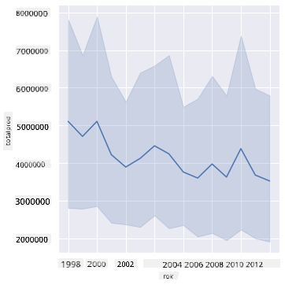
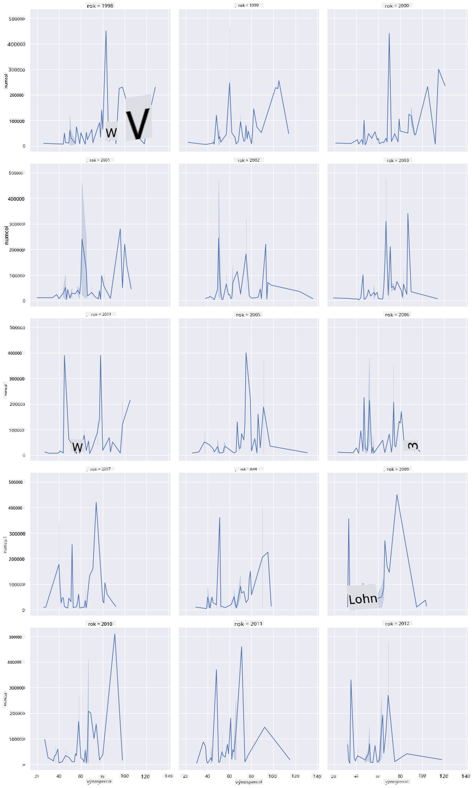
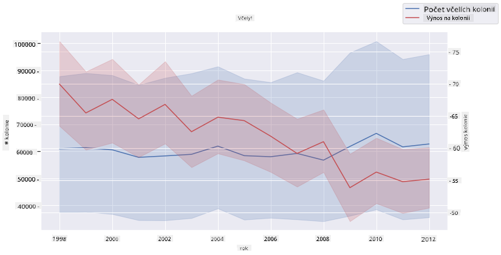

<!--
CO_OP_TRANSLATOR_METADATA:
{
  "original_hash": "0764fd4077f3f04a1d968ec371227744",
  "translation_date": "2025-09-06T11:45:35+00:00",
  "source_file": "3-Data-Visualization/12-visualization-relationships/README.md",
  "language_code": "cs"
}
-->
# Vizualizace vztahů: Vše o medu 🍯

| ](../../sketchnotes/12-Visualizing-Relationships.png)|
|:---:|
|Vizualizace vztahů - _Sketchnote od [@nitya](https://twitter.com/nitya)_ |

Pokračujeme v přírodním zaměření našeho výzkumu a objevujeme zajímavé vizualizace, které ukazují vztahy mezi různými typy medu podle datasetu odvozeného z [Ministerstva zemědělství Spojených států](https://www.nass.usda.gov/About_NASS/index.php).

Tento dataset obsahuje přibližně 600 položek a zobrazuje produkci medu v mnoha státech USA. Například můžete sledovat počet včelstev, výnos na včelstvo, celkovou produkci, zásoby, cenu za libru a hodnotu vyprodukovaného medu v daném státě od roku 1998 do roku 2012, přičemž každý řádek představuje jeden rok pro každý stát.

Bylo by zajímavé vizualizovat vztah mezi produkcí v daném státě za rok a například cenou medu v tomto státě. Alternativně byste mohli vizualizovat vztah mezi výnosem medu na včelstvo v jednotlivých státech. Toto časové období zahrnuje devastující „CCD“ neboli „Colony Collapse Disorder“ (kolaps včelstev), který byl poprvé zaznamenán v roce 2006 (http://npic.orst.edu/envir/ccd.html), což činí tento dataset obzvláště zajímavým ke studiu. 🐝

## [Kvíz před lekcí](https://ff-quizzes.netlify.app/en/ds/quiz/22)

V této lekci můžete použít knihovnu Seaborn, kterou jste již dříve používali, jako skvělý nástroj pro vizualizaci vztahů mezi proměnnými. Zvláště zajímavá je funkce `relplot` v Seabornu, která umožňuje rychle vytvářet bodové a čárové grafy pro vizualizaci '[statistických vztahů](https://seaborn.pydata.org/tutorial/relational.html?highlight=relationships)', což datovým vědcům umožňuje lépe pochopit, jak spolu proměnné souvisejí.

## Bodové grafy

Použijte bodový graf k zobrazení, jak se cena medu vyvíjela rok od roku v jednotlivých státech. Seaborn, pomocí funkce `relplot`, pohodlně seskupí data podle států a zobrazí datové body jak pro kategorická, tak pro číselná data.

Začněme importem dat a knihovny Seaborn:

```python
import pandas as pd
import matplotlib.pyplot as plt
import seaborn as sns
honey = pd.read_csv('../../data/honey.csv')
honey.head()
```
Všimnete si, že data o medu obsahují několik zajímavých sloupců, včetně roku a ceny za libru. Prozkoumejme tato data seskupená podle států USA:

| stát | numcol | yieldpercol | totalprod | stocks   | priceperlb | prodvalue | year |
| ----- | ------ | ----------- | --------- | -------- | ---------- | --------- | ---- |
| AL    | 16000  | 71          | 1136000   | 159000   | 0.72       | 818000    | 1998 |
| AZ    | 55000  | 60          | 3300000   | 1485000  | 0.64       | 2112000   | 1998 |
| AR    | 53000  | 65          | 3445000   | 1688000  | 0.59       | 2033000   | 1998 |
| CA    | 450000 | 83          | 37350000  | 12326000 | 0.62       | 23157000  | 1998 |
| CO    | 27000  | 72          | 1944000   | 1594000  | 0.7        | 1361000   | 1998 |

Vytvořte základní bodový graf, který ukáže vztah mezi cenou za libru medu a státem jeho původu. Osa `y` by měla být dostatečně vysoká, aby zobrazila všechny státy:

```python
sns.relplot(x="priceperlb", y="state", data=honey, height=15, aspect=.5);
```


Nyní zobrazte stejná data s barevným schématem připomínajícím med, abyste ukázali, jak se cena vyvíjela v průběhu let. Toho můžete dosáhnout přidáním parametru 'hue', který ukáže změnu rok od roku:

> ✅ Více o [barevných paletách v Seabornu](https://seaborn.pydata.org/tutorial/color_palettes.html) - vyzkoušejte krásné duhové schéma!

```python
sns.relplot(x="priceperlb", y="state", hue="year", palette="YlOrBr", data=honey, height=15, aspect=.5);
```


S touto změnou barevného schématu je zřejmé, že cena za libru medu v průběhu let výrazně stoupá. Pokud se podíváte na vzorek dat (například stát Arizona), můžete vidět vzorec zvyšování cen rok od roku s několika výjimkami:

| stát | numcol | yieldpercol | totalprod | stocks  | priceperlb | prodvalue | year |
| ----- | ------ | ----------- | --------- | ------- | ---------- | --------- | ---- |
| AZ    | 55000  | 60          | 3300000   | 1485000 | 0.64       | 2112000   | 1998 |
| AZ    | 52000  | 62          | 3224000   | 1548000 | 0.62       | 1999000   | 1999 |
| AZ    | 40000  | 59          | 2360000   | 1322000 | 0.73       | 1723000   | 2000 |
| AZ    | 43000  | 59          | 2537000   | 1142000 | 0.72       | 1827000   | 2001 |
| AZ    | 38000  | 63          | 2394000   | 1197000 | 1.08       | 2586000   | 2002 |
| AZ    | 35000  | 72          | 2520000   | 983000  | 1.34       | 3377000   | 2003 |
| AZ    | 32000  | 55          | 1760000   | 774000  | 1.11       | 1954000   | 2004 |
| AZ    | 36000  | 50          | 1800000   | 720000  | 1.04       | 1872000   | 2005 |
| AZ    | 30000  | 65          | 1950000   | 839000  | 0.91       | 1775000   | 2006 |
| AZ    | 30000  | 64          | 1920000   | 902000  | 1.26       | 2419000   | 2007 |
| AZ    | 25000  | 64          | 1600000   | 336000  | 1.26       | 2016000   | 2008 |
| AZ    | 20000  | 52          | 1040000   | 562000  | 1.45       | 1508000   | 2009 |
| AZ    | 24000  | 77          | 1848000   | 665000  | 1.52       | 2809000   | 2010 |
| AZ    | 23000  | 53          | 1219000   | 427000  | 1.55       | 1889000   | 2011 |
| AZ    | 22000  | 46          | 1012000   | 253000  | 1.79       | 1811000   | 2012 |

Dalším způsobem, jak vizualizovat tento vývoj, je použití velikosti místo barvy. Pro uživatele s poruchami barevného vidění by to mohlo být lepší řešení. Upravte svou vizualizaci tak, aby zvýšení ceny bylo znázorněno zvětšením obvodu bodů:

```python
sns.relplot(x="priceperlb", y="state", size="year", data=honey, height=15, aspect=.5);
```
Vidíte, že velikost bodů se postupně zvětšuje.


Je to jednoduchý případ nabídky a poptávky? Kvůli faktorům, jako je změna klimatu a kolaps včelstev, je k dispozici méně medu k prodeji rok od roku, a proto cena stoupá?

Pro zjištění korelace mezi některými proměnnými v tomto datasetu prozkoumejme čárové grafy.

## Čárové grafy

Otázka: Je zřejmý nárůst ceny medu za libru rok od roku? To můžete nejlépe zjistit vytvořením jednoduchého čárového grafu:

```python
sns.relplot(x="year", y="priceperlb", kind="line", data=honey);
```
Odpověď: Ano, s několika výjimkami kolem roku 2003:


✅ Protože Seaborn agreguje data do jedné čáry, zobrazuje „vícenásobná měření pro každou hodnotu x vykreslením průměru a 95% intervalem spolehlivosti kolem průměru“. [Zdroj](https://seaborn.pydata.org/tutorial/relational.html). Toto časově náročné chování lze vypnout přidáním `ci=None`.

Otázka: No, můžeme v roce 2003 také vidět nárůst zásob medu? Co když se podíváte na celkovou produkci rok od roku?

```python
sns.relplot(x="year", y="totalprod", kind="line", data=honey);
```



Odpověď: Ani ne. Pokud se podíváte na celkovou produkci, zdá se, že v tomto konkrétním roce skutečně vzrostla, i když obecně množství vyprodukovaného medu v těchto letech klesá.

Otázka: V tom případě, co mohlo způsobit nárůst ceny medu kolem roku 2003?

Pro zjištění toho můžete prozkoumat mřížku faset.

## Mřížky faset

Mřížky faset vezmou jednu fasetu vašeho datasetu (v našem případě můžete zvolit 'rok', abyste se vyhnuli příliš mnoha fasetám). Seaborn pak vytvoří graf pro každou z těchto faset podle zvolených souřadnic x a y pro snadnější vizuální porovnání. Vyniká rok 2003 v tomto typu porovnání?

Vytvořte mřížku faset pokračováním v používání `relplot`, jak doporučuje [dokumentace Seabornu](https://seaborn.pydata.org/generated/seaborn.FacetGrid.html?highlight=facetgrid#seaborn.FacetGrid).

```python
sns.relplot(
    data=honey, 
    x="yieldpercol", y="numcol",
    col="year", 
    col_wrap=3,
    kind="line"
    )
```
V této vizualizaci můžete porovnat výnos na včelstvo a počet včelstev rok od roku vedle sebe s nastavením wrap na 3 pro sloupce:



Pro tento dataset nic zvláštního nevyniká, pokud jde o počet včelstev a jejich výnos rok od roku a stát od státu. Existuje jiný způsob, jak hledat korelaci mezi těmito dvěma proměnnými?

## Dvojité čárové grafy

Vyzkoušejte vícenásobný čárový graf překrytím dvou čárových grafů na sebe, pomocí funkce `despine` v Seabornu k odstranění horních a pravých os a použitím `ax.twinx` [odvozeného z Matplotlibu](https://matplotlib.org/stable/api/_as_gen/matplotlib.axes.Axes.twinx.html). Twinx umožňuje grafu sdílet osu x a zobrazit dvě osy y. Zobrazte výnos na včelstvo a počet včelstev překryté:

```python
fig, ax = plt.subplots(figsize=(12,6))
lineplot = sns.lineplot(x=honey['year'], y=honey['numcol'], data=honey, 
                        label = 'Number of bee colonies', legend=False)
sns.despine()
plt.ylabel('# colonies')
plt.title('Honey Production Year over Year');

ax2 = ax.twinx()
lineplot2 = sns.lineplot(x=honey['year'], y=honey['yieldpercol'], ax=ax2, color="r", 
                         label ='Yield per colony', legend=False) 
sns.despine(right=False)
plt.ylabel('colony yield')
ax.figure.legend();
```


I když kolem roku 2003 nic zvláštního nevyniká, umožňuje nám to zakončit tuto lekci na trochu pozitivnější notě: i když celkový počet včelstev klesá, jejich počet se stabilizuje, i když jejich výnos na včelstvo klesá.

Do toho, včely, do toho!

🐝❤️
## 🚀 Výzva

V této lekci jste se dozvěděli více o dalších využitích bodových grafů a mřížek faset, včetně mřížek faset. Vyzkoušejte si vytvořit mřížku faset pomocí jiného datasetu, možná takového, který jste použili v předchozích lekcích. Všimněte si, jak dlouho jejich vytvoření trvá a jak musíte být opatrní ohledně počtu mřížek, které potřebujete vykreslit pomocí těchto technik.

## [Kvíz po lekci](https://ff-quizzes.netlify.app/en/ds/quiz/23)

## Přehled a samostudium

Čárové grafy mohou být jednoduché nebo poměrně složité. Přečtěte si více v [dokumentaci Seabornu](https://seaborn.pydata.org/generated/seaborn.lineplot.html) o různých způsobech, jak je můžete vytvořit. Zkuste vylepšit čárové grafy, které jste vytvořili v této lekci, pomocí dalších metod uvedených v dokumentaci.
## Zadání

[Ponořte se do úlu](assignment.md)

---

**Prohlášení**:  
Tento dokument byl přeložen pomocí služby pro automatický překlad [Co-op Translator](https://github.com/Azure/co-op-translator). I když se snažíme o co největší přesnost, mějte prosím na paměti, že automatické překlady mohou obsahovat chyby nebo nepřesnosti. Za autoritativní zdroj by měl být považován původní dokument v jeho původním jazyce. Pro důležité informace doporučujeme profesionální lidský překlad. Neodpovídáme za žádná nedorozumění nebo nesprávné výklady vyplývající z použití tohoto překladu.