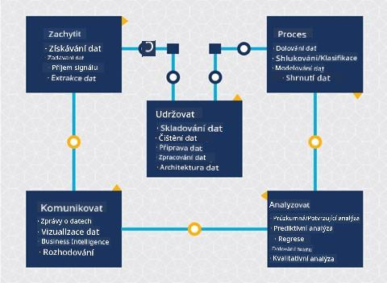
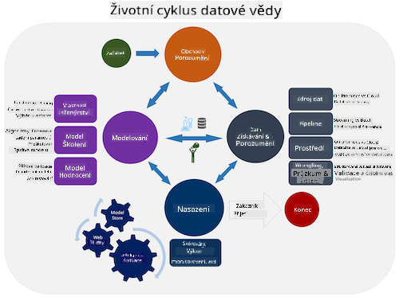

<!--
CO_OP_TRANSLATOR_METADATA:
{
  "original_hash": "07e12a25d20b8f191e3cb651c27fdb2b",
  "translation_date": "2025-09-06T21:31:19+00:00",
  "source_file": "4-Data-Science-Lifecycle/14-Introduction/README.md",
  "language_code": "cs"
}
-->
# Úvod do životního cyklu datové vědy

| ](../../sketchnotes/14-DataScience-Lifecycle.png)|
|:---:|
| Úvod do životního cyklu datové vědy - _Sketchnote od [@nitya](https://twitter.com/nitya)_ |

## [Kvíz před lekcí](https://ff-quizzes.netlify.app/en/ds/quiz/26)

V tuto chvíli jste si pravděpodobně uvědomili, že datová věda je proces. Tento proces lze rozdělit do 5 fází:

- Zachycení
- Zpracování
- Analýza
- Komunikace
- Údržba

Tato lekce se zaměřuje na 3 části životního cyklu: zachycení, zpracování a údržbu.

  
> Foto od [Berkeley School of Information](https://ischoolonline.berkeley.edu/data-science/what-is-data-science/)

## Zachycení

První fáze životního cyklu je velmi důležitá, protože na ní závisí všechny další fáze. Prakticky se jedná o dvě fáze spojené do jedné: získání dat a definování účelu a problémů, které je třeba řešit.  
Definování cílů projektu bude vyžadovat hlubší pochopení problému nebo otázky. Nejprve musíme identifikovat a získat ty, kteří potřebují vyřešit svůj problém. Mohou to být zainteresované strany v podniku nebo sponzoři projektu, kteří mohou pomoci určit, kdo nebo co bude mít z projektu prospěch, a také co a proč to potřebují. Dobře definovaný cíl by měl být měřitelný a kvantifikovatelný, aby bylo možné stanovit přijatelný výsledek.

Otázky, které si datový vědec může položit:
- Byl tento problém již dříve řešen? Co bylo zjištěno?
- Rozumí všichni zúčastnění účelu a cíli?
- Existuje nějaká nejasnost a jak ji snížit?
- Jaká jsou omezení?
- Jak by mohl vypadat konečný výsledek?
- Kolik zdrojů (čas, lidé, výpočetní kapacita) je k dispozici?

Dalším krokem je identifikace, sběr a nakonec prozkoumání dat potřebných k dosažení těchto definovaných cílů. V této fázi získávání musí datoví vědci také zhodnotit množství a kvalitu dat. To vyžaduje určité prozkoumání dat, aby bylo potvrzeno, že získaná data podpoří dosažení požadovaného výsledku.

Otázky, které si datový vědec může položit o datech:
- Jaká data mám již k dispozici?
- Kdo tato data vlastní?
- Jaké jsou obavy ohledně ochrany soukromí?
- Mám dostatek dat k vyřešení tohoto problému?
- Jsou data dostatečně kvalitní pro tento problém?
- Pokud prostřednictvím těchto dat objevím další informace, měli bychom zvážit změnu nebo redefinování cílů?

## Zpracování

Fáze zpracování v životním cyklu se zaměřuje na objevování vzorců v datech a modelování. Některé techniky používané ve fázi zpracování vyžadují statistické metody k odhalení vzorců. Typicky by to byla zdlouhavá úloha pro člověka při práci s velkými datovými sadami, a proto se spoléháme na počítače, které tento proces urychlí. Tato fáze je také místem, kde se datová věda a strojové učení protínají. Jak jste se naučili v první lekci, strojové učení je proces vytváření modelů pro pochopení dat. Modely představují vztahy mezi proměnnými v datech, které pomáhají předpovídat výsledky.

Běžné techniky používané v této fázi jsou pokryty v kurikulu ML pro začátečníky. Sledujte odkazy, abyste se o nich dozvěděli více:

- [Klasifikace](https://github.com/microsoft/ML-For-Beginners/tree/main/4-Classification): Organizace dat do kategorií pro efektivnější využití.
- [Shlukování](https://github.com/microsoft/ML-For-Beginners/tree/main/5-Clustering): Seskupování dat do podobných skupin.
- [Regrese](https://github.com/microsoft/ML-For-Beginners/tree/main/2-Regression): Určení vztahů mezi proměnnými pro předpověď nebo odhad hodnot.

## Údržba

Na diagramu životního cyklu jste si mohli všimnout, že údržba se nachází mezi zachycením a zpracováním. Údržba je průběžný proces správy, ukládání a zabezpečení dat během celého projektu a měla by být zohledněna po celou dobu jeho trvání.

### Ukládání dat

Způsob a místo ukládání dat může ovlivnit náklady na jejich uložení i výkon při jejich přístupu. Taková rozhodnutí pravděpodobně nebudou dělat pouze datoví vědci, ale mohou se ocitnout v situaci, kdy budou muset rozhodovat, jak s daty pracovat na základě toho, jak jsou uložena.

Zde jsou některé aspekty moderních systémů ukládání dat, které mohou tato rozhodnutí ovlivnit:

**On-premise vs off-premise vs veřejný nebo soukromý cloud**

On-premise označuje hostování a správu dat na vlastním vybavení, například vlastnění serveru s pevnými disky, které data ukládají, zatímco off-premise spoléhá na vybavení, které nevlastníte, například datové centrum. Veřejný cloud je oblíbenou volbou pro ukládání dat, která nevyžaduje znalost toho, jak nebo kde přesně jsou data uložena, přičemž veřejný označuje jednotnou základní infrastrukturu sdílenou všemi uživateli cloudu. Některé organizace mají přísné bezpečnostní politiky, které vyžadují úplný přístup k vybavení, kde jsou data hostována, a spoléhají na soukromý cloud, který poskytuje vlastní cloudové služby. Více o datech v cloudu se dozvíte v [pozdějších lekcích](https://github.com/microsoft/Data-Science-For-Beginners/tree/main/5-Data-Science-In-Cloud).

**Studená vs horká data**

Při trénování modelů můžete potřebovat více trénovacích dat. Pokud jste spokojeni se svým modelem, přijdou další data, aby model mohl plnit svůj účel. V každém případě se náklady na ukládání a přístup k datům zvýší, jakmile jich budete mít více. Oddělení zřídka používaných dat, známých jako studená data, od často přistupovaných horkých dat může být levnější možností ukládání dat prostřednictvím hardwarových nebo softwarových služeb. Pokud je potřeba přistupovat ke studeným datům, může jejich načtení trvat o něco déle ve srovnání s horkými daty.

### Správa dat

Při práci s daty můžete zjistit, že některá data je třeba vyčistit pomocí technik pokrytých v lekci zaměřené na [přípravu dat](https://github.com/microsoft/Data-Science-For-Beginners/tree/main/2-Working-With-Data/08-data-preparation), aby bylo možné vytvořit přesné modely. Když dorazí nová data, bude třeba aplikovat stejné postupy, aby byla zachována konzistence kvality. Některé projekty budou zahrnovat použití automatizovaného nástroje pro čištění, agregaci a kompresi dat před jejich přesunem na konečné místo. Azure Data Factory je příkladem jednoho z těchto nástrojů.

### Zabezpečení dat

Jedním z hlavních cílů zabezpečení dat je zajistit, aby ti, kteří s nimi pracují, měli kontrolu nad tím, co je shromažďováno a v jakém kontextu je to používáno. Udržování dat v bezpečí zahrnuje omezení přístupu pouze na ty, kteří jej potřebují, dodržování místních zákonů a předpisů a dodržování etických standardů, jak je uvedeno v [lekci o etice](https://github.com/microsoft/Data-Science-For-Beginners/tree/main/1-Introduction/02-ethics).

Zde jsou některé kroky, které může tým podniknout s ohledem na bezpečnost:
- Potvrdit, že všechna data jsou šifrována
- Poskytnout zákazníkům informace o tom, jak jsou jejich data používána
- Odebrat přístup k datům těm, kteří projekt opustili
- Povolit pouze určitým členům projektu měnit data

## 🚀 Výzva

Existuje mnoho verzí životního cyklu datové vědy, kde každý krok může mít jiný název a počet fází, ale obsahuje stejné procesy zmíněné v této lekci.

Prozkoumejte [životní cyklus procesu týmové datové vědy](https://docs.microsoft.com/en-us/azure/architecture/data-science-process/lifecycle) a [průmyslový standardní proces pro dolování dat](https://www.datascience-pm.com/crisp-dm-2/). Uveďte 3 podobnosti a rozdíly mezi nimi.

|Proces týmové datové vědy (TDSP)|Průmyslový standardní proces pro dolování dat (CRISP-DM)|
|--|--|
| |  |
| Obrázek od [Microsoft](https://docs.microsoft.comazure/architecture/data-science-process/lifecycle) | Obrázek od [Data Science Process Alliance](https://www.datascience-pm.com/crisp-dm-2/) |

## [Kvíz po lekci](https://ff-quizzes.netlify.app/en/ds/quiz/27)

## Přehled a samostudium

Aplikace životního cyklu datové vědy zahrnuje více rolí a úkolů, kde se někteří mohou zaměřit na konkrétní části každé fáze. Proces týmové datové vědy poskytuje několik zdrojů, které vysvětlují typy rolí a úkolů, které může někdo v projektu mít.

* [Role a úkoly v procesu týmové datové vědy](https://docs.microsoft.com/en-us/azure/architecture/data-science-process/roles-tasks)  
* [Provádění úkolů datové vědy: průzkum, modelování a nasazení](https://docs.microsoft.com/en-us/azure/architecture/data-science-process/execute-data-science-tasks)

## Zadání

[Hodnocení datové sady](assignment.md)

---

**Prohlášení**:  
Tento dokument byl přeložen pomocí služby pro automatický překlad [Co-op Translator](https://github.com/Azure/co-op-translator). I když se snažíme o přesnost, mějte prosím na paměti, že automatické překlady mohou obsahovat chyby nebo nepřesnosti. Původní dokument v jeho původním jazyce by měl být považován za autoritativní zdroj. Pro důležité informace se doporučuje profesionální lidský překlad. Neodpovídáme za žádné nedorozumění nebo nesprávné interpretace vyplývající z použití tohoto překladu.