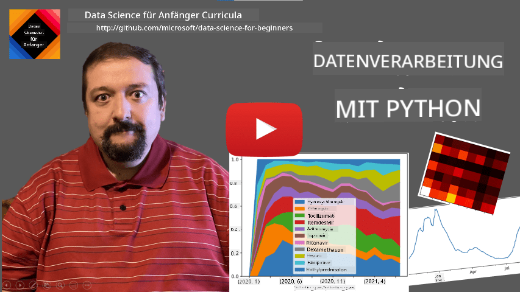
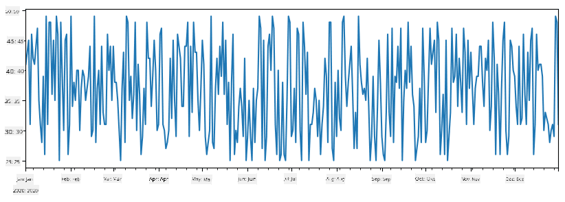
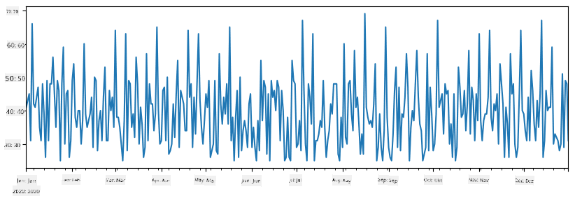
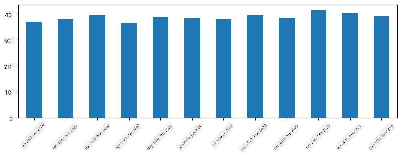
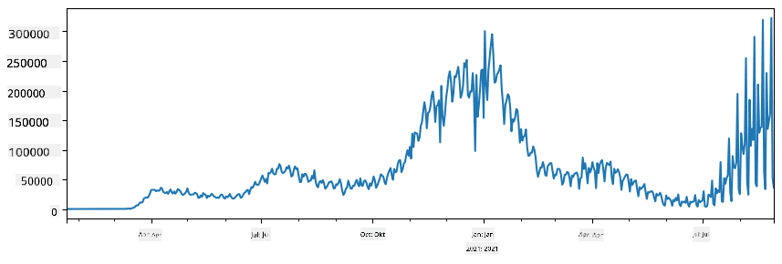
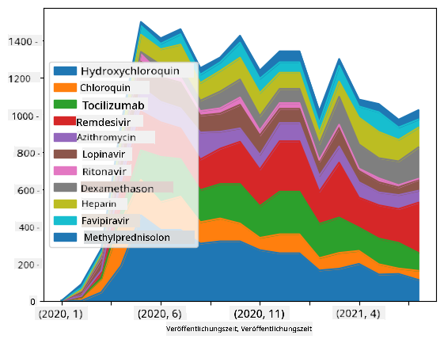

<!--
CO_OP_TRANSLATOR_METADATA:
{
  "original_hash": "7bfec050f4717dcc2dfd028aca9d21f3",
  "translation_date": "2025-09-06T15:21:43+00:00",
  "source_file": "2-Working-With-Data/07-python/README.md",
  "language_code": "de"
}
-->
# Arbeiten mit Daten: Python und die Pandas-Bibliothek

|  ](../../sketchnotes/07-WorkWithPython.png) |
| :-------------------------------------------------------------------------------------------------------: |
|                 Arbeiten mit Python - _Sketchnote von [@nitya](https://twitter.com/nitya)_                 |

[](https://youtu.be/dZjWOGbsN4Y)

Während Datenbanken sehr effiziente Möglichkeiten bieten, Daten zu speichern und sie mit Abfragesprachen zu durchsuchen, ist die flexibelste Art der Datenverarbeitung das Schreiben eines eigenen Programms, um die Daten zu manipulieren. In vielen Fällen wäre eine Datenbankabfrage effektiver. Es gibt jedoch Situationen, in denen komplexere Datenverarbeitungen erforderlich sind, die sich nicht einfach mit SQL umsetzen lassen.  
Datenverarbeitung kann in jeder Programmiersprache programmiert werden, aber es gibt bestimmte Sprachen, die sich besonders gut für die Arbeit mit Daten eignen. Datenwissenschaftler bevorzugen typischerweise eine der folgenden Sprachen:

* **[Python](https://www.python.org/)**, eine universelle Programmiersprache, die oft als eine der besten Optionen für Anfänger gilt, da sie einfach zu erlernen ist. Python verfügt über viele zusätzliche Bibliotheken, die bei der Lösung praktischer Probleme helfen können, wie z. B. das Extrahieren von Daten aus ZIP-Archiven oder das Konvertieren von Bildern in Graustufen. Neben der Datenwissenschaft wird Python auch häufig für die Webentwicklung verwendet.  
* **[R](https://www.r-project.org/)** ist ein traditionelles Werkzeug, das speziell für die statistische Datenverarbeitung entwickelt wurde. Es verfügt über ein großes Repository von Bibliotheken (CRAN), was es zu einer guten Wahl für die Datenverarbeitung macht. Allerdings ist R keine universelle Programmiersprache und wird selten außerhalb des Bereichs der Datenwissenschaft eingesetzt.  
* **[Julia](https://julialang.org/)** ist eine weitere Sprache, die speziell für die Datenwissenschaft entwickelt wurde. Sie soll eine bessere Leistung als Python bieten und ist daher ein großartiges Werkzeug für wissenschaftliche Experimente.

In dieser Lektion konzentrieren wir uns auf die Verwendung von Python für einfache Datenverarbeitung. Wir setzen grundlegende Kenntnisse der Sprache voraus. Wenn Sie eine tiefere Einführung in Python wünschen, können Sie auf eine der folgenden Ressourcen zurückgreifen:

* [Lernen Sie Python auf unterhaltsame Weise mit Turtle Graphics und Fraktalen](https://github.com/shwars/pycourse) – Ein schneller Einführungskurs in Python-Programmierung auf GitHub  
* [Machen Sie Ihre ersten Schritte mit Python](https://docs.microsoft.com/en-us/learn/paths/python-first-steps/?WT.mc_id=academic-77958-bethanycheum) – Ein Lernpfad auf [Microsoft Learn](http://learn.microsoft.com/?WT.mc_id=academic-77958-bethanycheum)

Daten können in vielen Formen vorliegen. In dieser Lektion betrachten wir drei Formen von Daten – **tabellarische Daten**, **Text** und **Bilder**.

Wir werden uns auf einige Beispiele der Datenverarbeitung konzentrieren, anstatt Ihnen einen vollständigen Überblick über alle zugehörigen Bibliotheken zu geben. Dies ermöglicht es Ihnen, die Hauptidee dessen zu verstehen, was möglich ist, und gibt Ihnen das Wissen, wo Sie Lösungen für Ihre Probleme finden können, wenn Sie sie benötigen.

> **Der nützlichste Ratschlag**: Wenn Sie eine bestimmte Operation mit Daten durchführen müssen, aber nicht wissen, wie, suchen Sie im Internet danach. [Stackoverflow](https://stackoverflow.com/) enthält oft viele nützliche Codebeispiele in Python für viele typische Aufgaben.

## [Quiz vor der Vorlesung](https://ff-quizzes.netlify.app/en/ds/quiz/12)

## Tabellarische Daten und Dataframes

Sie haben tabellarische Daten bereits kennengelernt, als wir über relationale Datenbanken gesprochen haben. Wenn Sie viele Daten haben, die in verschiedenen verknüpften Tabellen gespeichert sind, macht es definitiv Sinn, SQL zu verwenden, um damit zu arbeiten. Es gibt jedoch viele Fälle, in denen wir eine Tabelle mit Daten haben und einige **Erkenntnisse** oder **Einsichten** über diese Daten gewinnen möchten, wie z. B. die Verteilung, Korrelation zwischen Werten usw. In der Datenwissenschaft gibt es viele Fälle, in denen wir einige Transformationen der ursprünglichen Daten durchführen müssen, gefolgt von einer Visualisierung. Beide Schritte können leicht mit Python durchgeführt werden.

Es gibt zwei äußerst nützliche Bibliotheken in Python, die Ihnen bei der Arbeit mit tabellarischen Daten helfen können:
* **[Pandas](https://pandas.pydata.org/)** ermöglicht es Ihnen, sogenannte **Dataframes** zu manipulieren, die relationalen Tabellen ähneln. Sie können benannte Spalten haben und verschiedene Operationen auf Zeilen, Spalten und Dataframes im Allgemeinen durchführen.  
* **[Numpy](https://numpy.org/)** ist eine Bibliothek für die Arbeit mit **Tensors**, d. h. mehrdimensionalen **Arrays**. Ein Array hat Werte desselben zugrunde liegenden Typs, ist einfacher als ein Dataframe, bietet jedoch mehr mathematische Operationen und erzeugt weniger Overhead.

Es gibt auch ein paar andere Bibliotheken, die Sie kennen sollten:
* **[Matplotlib](https://matplotlib.org/)** ist eine Bibliothek für Datenvisualisierung und das Erstellen von Diagrammen  
* **[SciPy](https://www.scipy.org/)** ist eine Bibliothek mit zusätzlichen wissenschaftlichen Funktionen. Wir sind bereits auf diese Bibliothek gestoßen, als wir über Wahrscheinlichkeit und Statistik gesprochen haben.

Hier ist ein Codebeispiel, das Sie typischerweise verwenden würden, um diese Bibliotheken am Anfang Ihres Python-Programms zu importieren:
```python
import numpy as np
import pandas as pd
import matplotlib.pyplot as plt
from scipy import ... # you need to specify exact sub-packages that you need
``` 

Pandas basiert auf einigen grundlegenden Konzepten.

### Series 

**Series** ist eine Sequenz von Werten, ähnlich einer Liste oder einem Numpy-Array. Der Hauptunterschied besteht darin, dass eine Series auch einen **Index** hat, und wenn wir mit Series arbeiten (z. B. sie addieren), wird der Index berücksichtigt. Der Index kann so einfach wie eine ganze Zeilennummer sein (dies ist der Standardindex, wenn eine Series aus einer Liste oder einem Array erstellt wird), oder er kann eine komplexe Struktur wie ein Datumsintervall haben.

> **Hinweis**: Es gibt einige einführende Pandas-Codes im begleitenden Notebook [`notebook.ipynb`](notebook.ipynb). Wir skizzieren hier nur einige Beispiele, und Sie sind herzlich eingeladen, das vollständige Notebook anzusehen.

Betrachten wir ein Beispiel: Wir möchten die Verkäufe unseres Eisdielen-Standorts analysieren. Lassen Sie uns eine Serie von Verkaufszahlen (Anzahl der täglich verkauften Artikel) für einen bestimmten Zeitraum generieren:

```python
start_date = "Jan 1, 2020"
end_date = "Mar 31, 2020"
idx = pd.date_range(start_date,end_date)
print(f"Length of index is {len(idx)}")
items_sold = pd.Series(np.random.randint(25,50,size=len(idx)),index=idx)
items_sold.plot()
```


Angenommen, wir organisieren jede Woche eine Party für Freunde und nehmen zusätzlich 10 Packungen Eis für die Party. Wir können eine weitere Serie erstellen, die nach Wochen indiziert ist, um dies zu demonstrieren:
```python
additional_items = pd.Series(10,index=pd.date_range(start_date,end_date,freq="W"))
```
Wenn wir zwei Series zusammenaddieren, erhalten wir die Gesamtanzahl:
```python
total_items = items_sold.add(additional_items,fill_value=0)
total_items.plot()
```


> **Hinweis**: Wir verwenden nicht die einfache Syntax `total_items+additional_items`. Wenn wir dies täten, würden wir viele `NaN` (*Not a Number*)-Werte in der resultierenden Serie erhalten. Dies liegt daran, dass für einige Indexpunkte in der Serie `additional_items` Werte fehlen, und das Addieren von `NaN` zu irgendetwas ergibt `NaN`. Daher müssen wir den Parameter `fill_value` während der Addition angeben.

Mit Zeitreihen können wir die Serie auch mit unterschiedlichen Zeitintervallen **neu abtasten**. Zum Beispiel, wenn wir das durchschnittliche Verkaufsvolumen monatlich berechnen möchten, können wir den folgenden Code verwenden:
```python
monthly = total_items.resample("1M").mean()
ax = monthly.plot(kind='bar')
```


### DataFrame

Ein DataFrame ist im Wesentlichen eine Sammlung von Series mit demselben Index. Wir können mehrere Series zu einem DataFrame kombinieren:
```python
a = pd.Series(range(1,10))
b = pd.Series(["I","like","to","play","games","and","will","not","change"],index=range(0,9))
df = pd.DataFrame([a,b])
```
Dies erzeugt eine horizontale Tabelle wie diese:
|     | 0   | 1    | 2   | 3   | 4      | 5   | 6      | 7    | 8    |
| --- | --- | ---- | --- | --- | ------ | --- | ------ | ---- | ---- |
| 0   | 1   | 2    | 3   | 4   | 5      | 6   | 7      | 8    | 9    |
| 1   | I   | like | to  | use | Python | and | Pandas | very | much |

Wir können auch Series als Spalten verwenden und Spaltennamen mit einem Wörterbuch angeben:
```python
df = pd.DataFrame({ 'A' : a, 'B' : b })
```
Dies ergibt eine Tabelle wie diese:

|     | A   | B      |
| --- | --- | ------ |
| 0   | 1   | I      |
| 1   | 2   | like   |
| 2   | 3   | to     |
| 3   | 4   | use    |
| 4   | 5   | Python |
| 5   | 6   | and    |
| 6   | 7   | Pandas |
| 7   | 8   | very   |
| 8   | 9   | much   |

**Hinweis**: Wir können dieses Tabellenlayout auch durch Transponieren der vorherigen Tabelle erhalten, z. B. durch Schreiben von 
```python
df = pd.DataFrame([a,b]).T..rename(columns={ 0 : 'A', 1 : 'B' })
```
Hier bedeutet `.T` die Operation des Transponierens des DataFrames, d. h. das Tauschen von Zeilen und Spalten, und die `rename`-Operation ermöglicht es uns, die Spalten umzubenennen, um das vorherige Beispiel zu entsprechen.

Hier sind einige der wichtigsten Operationen, die wir auf DataFrames ausführen können:

**Spaltenauswahl**. Wir können einzelne Spalten auswählen, indem wir `df['A']` schreiben – diese Operation gibt eine Series zurück. Wir können auch eine Teilmenge von Spalten in einen anderen DataFrame auswählen, indem wir `df[['B','A']]` schreiben – dies gibt einen anderen DataFrame zurück.

**Filtern** bestimmter Zeilen nach Kriterien. Zum Beispiel, um nur Zeilen mit Spalte `A` größer als 5 zu behalten, können wir `df[df['A']>5]` schreiben.

> **Hinweis**: Die Funktionsweise des Filterns ist wie folgt. Der Ausdruck `df['A']<5` gibt eine boolesche Serie zurück, die angibt, ob der Ausdruck für jedes Element der ursprünglichen Serie `df['A']` `True` oder `False` ist. Wenn eine boolesche Serie als Index verwendet wird, gibt sie eine Teilmenge der Zeilen im DataFrame zurück. Daher ist es nicht möglich, beliebige Python-Boolesche Ausdrücke zu verwenden, z. B. wäre das Schreiben von `df[df['A']>5 and df['A']<7]` falsch. Stattdessen sollten Sie die spezielle `&`-Operation auf booleschen Serien verwenden, indem Sie `df[(df['A']>5) & (df['A']<7)]` schreiben (*Klammern sind hier wichtig*).

**Erstellen neuer berechneter Spalten**. Wir können neue berechnete Spalten für unseren DataFrame einfach erstellen, indem wir intuitive Ausdrücke wie diesen verwenden:
```python
df['DivA'] = df['A']-df['A'].mean() 
``` 
Dieses Beispiel berechnet die Abweichung von A von seinem Mittelwert. Was hier tatsächlich passiert, ist, dass wir eine Serie berechnen und diese Serie dann der linken Seite zuweisen, wodurch eine weitere Spalte erstellt wird. Daher können wir keine Operationen verwenden, die nicht mit Serien kompatibel sind, z. B. ist der folgende Code falsch:
```python
# Wrong code -> df['ADescr'] = "Low" if df['A'] < 5 else "Hi"
df['LenB'] = len(df['B']) # <- Wrong result
``` 
Das letzte Beispiel, obwohl syntaktisch korrekt, gibt uns ein falsches Ergebnis, da es die Länge der Serie `B` allen Werten in der Spalte zuweist und nicht die Länge der einzelnen Elemente, wie wir beabsichtigt hatten.

Wenn wir komplexe Ausdrücke wie diesen berechnen müssen, können wir die Funktion `apply` verwenden. Das letzte Beispiel kann wie folgt geschrieben werden:
```python
df['LenB'] = df['B'].apply(lambda x : len(x))
# or 
df['LenB'] = df['B'].apply(len)
```

Nach den obigen Operationen erhalten wir den folgenden DataFrame:

|     | A   | B      | DivA | LenB |
| --- | --- | ------ | ---- | ---- |
| 0   | 1   | I      | -4.0 | 1    |
| 1   | 2   | like   | -3.0 | 4    |
| 2   | 3   | to     | -2.0 | 2    |
| 3   | 4   | use    | -1.0 | 3    |
| 4   | 5   | Python | 0.0  | 6    |
| 5   | 6   | and    | 1.0  | 3    |
| 6   | 7   | Pandas | 2.0  | 6    |
| 7   | 8   | very   | 3.0  | 4    |
| 8   | 9   | much   | 4.0  | 4    |

**Auswahl von Zeilen basierend auf Nummern** kann mit der `iloc`-Konstruktion durchgeführt werden. Zum Beispiel, um die ersten 5 Zeilen aus dem DataFrame auszuwählen:
```python
df.iloc[:5]
```

**Gruppierung** wird oft verwendet, um ein Ergebnis ähnlich wie *Pivot-Tabellen* in Excel zu erhalten. Angenommen, wir möchten den Mittelwert der Spalte `A` für jede gegebene Anzahl von `LenB` berechnen. Dann können wir unseren DataFrame nach `LenB` gruppieren und `mean` aufrufen:
```python
df.groupby(by='LenB')[['A','DivA']].mean()
```
Wenn wir den Mittelwert und die Anzahl der Elemente in der Gruppe berechnen müssen, können wir die komplexere Funktion `aggregate` verwenden:
```python
df.groupby(by='LenB') \
 .aggregate({ 'DivA' : len, 'A' : lambda x: x.mean() }) \
 .rename(columns={ 'DivA' : 'Count', 'A' : 'Mean'})
```
Dies ergibt die folgende Tabelle:

| LenB | Count | Mean     |
| ---- | ----- | -------- |
| 1    | 1     | 1.000000 |
| 2    | 1     | 3.000000 |
| 3    | 2     | 5.000000 |
| 4    | 3     | 6.333333 |
| 6    | 2     | 6.000000 |

### Daten abrufen
Wir haben gesehen, wie einfach es ist, Series und DataFrames aus Python-Objekten zu erstellen. Allerdings liegen Daten normalerweise in Form einer Textdatei oder einer Excel-Tabelle vor. Glücklicherweise bietet Pandas uns eine einfache Möglichkeit, Daten von der Festplatte zu laden. Zum Beispiel ist das Lesen einer CSV-Datei so einfach wie folgt:
```python
df = pd.read_csv('file.csv')
```
Wir werden weitere Beispiele zum Laden von Daten sehen, einschließlich des Abrufens von externen Websites, im Abschnitt "Challenge".

### Drucken und Plotten

Ein Data Scientist muss oft die Daten erkunden, daher ist es wichtig, sie visualisieren zu können. Wenn ein DataFrame groß ist, möchten wir oft nur sicherstellen, dass wir alles richtig machen, indem wir die ersten paar Zeilen ausgeben. Dies kann durch Aufrufen von `df.head()` erfolgen. Wenn Sie es in Jupyter Notebook ausführen, wird der DataFrame in einer schönen tabellarischen Form angezeigt.

Wir haben auch die Verwendung der Funktion `plot` gesehen, um einige Spalten zu visualisieren. Während `plot` für viele Aufgaben sehr nützlich ist und viele verschiedene Diagrammtypen über den Parameter `kind=` unterstützt, können Sie immer die rohe `matplotlib`-Bibliothek verwenden, um etwas Komplexeres zu zeichnen. Wir werden die Datenvisualisierung ausführlich in separaten Kurslektionen behandeln.

Dieser Überblick deckt die wichtigsten Konzepte von Pandas ab, jedoch ist die Bibliothek sehr umfangreich, und es gibt keine Grenzen für das, was Sie damit tun können! Lassen Sie uns nun dieses Wissen anwenden, um ein spezifisches Problem zu lösen.

## 🚀 Challenge 1: Analyse der COVID-Ausbreitung

Das erste Problem, auf das wir uns konzentrieren werden, ist die Modellierung der epidemischen Ausbreitung von COVID-19. Um dies zu tun, verwenden wir die Daten über die Anzahl der infizierten Personen in verschiedenen Ländern, bereitgestellt vom [Center for Systems Science and Engineering](https://systems.jhu.edu/) (CSSE) der [Johns Hopkins University](https://jhu.edu/). Der Datensatz ist in [diesem GitHub-Repository](https://github.com/CSSEGISandData/COVID-19) verfügbar.

Da wir demonstrieren möchten, wie man mit Daten umgeht, laden wir Sie ein, [`notebook-covidspread.ipynb`](notebook-covidspread.ipynb) zu öffnen und es von oben bis unten zu lesen. Sie können auch Zellen ausführen und einige Herausforderungen lösen, die wir am Ende für Sie hinterlassen haben.



> Wenn Sie nicht wissen, wie man Code in Jupyter Notebook ausführt, werfen Sie einen Blick auf [diesen Artikel](https://soshnikov.com/education/how-to-execute-notebooks-from-github/).

## Arbeiten mit unstrukturierten Daten

Während Daten sehr oft in tabellarischer Form vorliegen, müssen wir in einigen Fällen mit weniger strukturierten Daten umgehen, zum Beispiel Text oder Bilder. In diesem Fall müssen wir, um die oben gesehenen Datenverarbeitungstechniken anzuwenden, irgendwie **strukturierte** Daten extrahieren. Hier sind einige Beispiele:

* Extrahieren von Schlüsselwörtern aus Text und Analysieren, wie oft diese Schlüsselwörter vorkommen
* Verwenden von neuronalen Netzwerken, um Informationen über Objekte auf Bildern zu extrahieren
* Ermitteln von Emotionen von Personen in einem Videokamera-Feed

## 🚀 Challenge 2: Analyse von COVID-Papieren

In dieser Challenge setzen wir das Thema der COVID-Pandemie fort und konzentrieren uns auf die Verarbeitung wissenschaftlicher Arbeiten zu diesem Thema. Es gibt den [CORD-19-Datensatz](https://www.kaggle.com/allen-institute-for-ai/CORD-19-research-challenge) mit mehr als 7000 (zum Zeitpunkt des Schreibens) Arbeiten zu COVID, verfügbar mit Metadaten und Abstracts (und für etwa die Hälfte von ihnen ist auch der vollständige Text verfügbar).

Ein vollständiges Beispiel für die Analyse dieses Datensatzes mit dem kognitiven Dienst [Text Analytics for Health](https://docs.microsoft.com/azure/cognitive-services/text-analytics/how-tos/text-analytics-for-health/?WT.mc_id=academic-77958-bethanycheum) wird [in diesem Blogbeitrag](https://soshnikov.com/science/analyzing-medical-papers-with-azure-and-text-analytics-for-health/) beschrieben. Wir werden eine vereinfachte Version dieser Analyse besprechen.

> **NOTE**: Wir stellen keine Kopie des Datensatzes als Teil dieses Repositorys bereit. Sie müssen möglicherweise zuerst die Datei [`metadata.csv`](https://www.kaggle.com/allen-institute-for-ai/CORD-19-research-challenge?select=metadata.csv) aus [diesem Datensatz auf Kaggle](https://www.kaggle.com/allen-institute-for-ai/CORD-19-research-challenge) herunterladen. Eine Registrierung bei Kaggle kann erforderlich sein. Sie können den Datensatz auch ohne Registrierung [hier herunterladen](https://ai2-semanticscholar-cord-19.s3-us-west-2.amazonaws.com/historical_releases.html), aber er wird alle Volltexte zusätzlich zur Metadaten-Datei enthalten.

Öffnen Sie [`notebook-papers.ipynb`](notebook-papers.ipynb) und lesen Sie es von oben bis unten. Sie können auch Zellen ausführen und einige Herausforderungen lösen, die wir am Ende für Sie hinterlassen haben.



## Verarbeitung von Bilddaten

In letzter Zeit wurden sehr leistungsstarke KI-Modelle entwickelt, die es ermöglichen, Bilder zu verstehen. Es gibt viele Aufgaben, die mit vortrainierten neuronalen Netzwerken oder Cloud-Diensten gelöst werden können. Einige Beispiele sind:

* **Bildklassifikation**, die Ihnen helfen kann, das Bild in eine der vordefinierten Klassen einzuordnen. Sie können Ihre eigenen Bildklassifikatoren leicht mit Diensten wie [Custom Vision](https://azure.microsoft.com/services/cognitive-services/custom-vision-service/?WT.mc_id=academic-77958-bethanycheum) trainieren.
* **Objekterkennung**, um verschiedene Objekte im Bild zu erkennen. Dienste wie [Computer Vision](https://azure.microsoft.com/services/cognitive-services/computer-vision/?WT.mc_id=academic-77958-bethanycheum) können eine Reihe von häufigen Objekten erkennen, und Sie können ein [Custom Vision](https://azure.microsoft.com/services/cognitive-services/custom-vision-service/?WT.mc_id=academic-77958-bethanycheum)-Modell trainieren, um spezifische Objekte von Interesse zu erkennen.
* **Gesichtserkennung**, einschließlich Alter, Geschlecht und Emotionserkennung. Dies kann über die [Face API](https://azure.microsoft.com/services/cognitive-services/face/?WT.mc_id=academic-77958-bethanycheum) erfolgen.

Alle diese Cloud-Dienste können mit [Python SDKs](https://docs.microsoft.com/samples/azure-samples/cognitive-services-python-sdk-samples/cognitive-services-python-sdk-samples/?WT.mc_id=academic-77958-bethanycheum) aufgerufen werden und können somit leicht in Ihren Workflow zur Datenexploration integriert werden.

Hier sind einige Beispiele für die Erkundung von Daten aus Bilddatenquellen:
* Im Blogbeitrag [How to Learn Data Science without Coding](https://soshnikov.com/azure/how-to-learn-data-science-without-coding/) untersuchen wir Instagram-Fotos, um zu verstehen, was Menschen dazu bringt, einem Foto mehr Likes zu geben. Wir extrahieren zunächst so viele Informationen wie möglich aus Bildern mit [Computer Vision](https://azure.microsoft.com/services/cognitive-services/computer-vision/?WT.mc_id=academic-77958-bethanycheum) und verwenden dann [Azure Machine Learning AutoML](https://docs.microsoft.com/azure/machine-learning/concept-automated-ml/?WT.mc_id=academic-77958-bethanycheum), um ein interpretierbares Modell zu erstellen.
* In [Facial Studies Workshop](https://github.com/CloudAdvocacy/FaceStudies) verwenden wir die [Face API](https://azure.microsoft.com/services/cognitive-services/face/?WT.mc_id=academic-77958-bethanycheum), um Emotionen von Personen auf Fotos von Veranstaltungen zu extrahieren, um zu verstehen, was Menschen glücklich macht.

## Fazit

Egal, ob Sie bereits strukturierte oder unstrukturierte Daten haben, mit Python können Sie alle Schritte der Datenverarbeitung und des Datenverständnisses durchführen. Es ist wahrscheinlich die flexibelste Methode der Datenverarbeitung, und das ist der Grund, warum die Mehrheit der Data Scientists Python als ihr Hauptwerkzeug verwendet. Python gründlich zu lernen, ist wahrscheinlich eine gute Idee, wenn Sie Ihre Reise in der Datenwissenschaft ernst nehmen!

## [Quiz nach der Vorlesung](https://ff-quizzes.netlify.app/en/ds/quiz/13)

## Rückblick & Selbststudium

**Bücher**
* [Wes McKinney. Python for Data Analysis: Data Wrangling with Pandas, NumPy, and IPython](https://www.amazon.com/gp/product/1491957662)

**Online-Ressourcen**
* Offizielles [10 Minuten zu Pandas](https://pandas.pydata.org/pandas-docs/stable/user_guide/10min.html)-Tutorial
* [Dokumentation zur Pandas-Visualisierung](https://pandas.pydata.org/pandas-docs/stable/user_guide/visualization.html)

**Python lernen**
* [Learn Python in a Fun Way with Turtle Graphics and Fractals](https://github.com/shwars/pycourse)
* [Machen Sie Ihre ersten Schritte mit Python](https://docs.microsoft.com/learn/paths/python-first-steps/?WT.mc_id=academic-77958-bethanycheum) Lernpfad auf [Microsoft Learn](http://learn.microsoft.com/?WT.mc_id=academic-77958-bethanycheum)

## Aufgabe

[Führen Sie eine detailliertere Datenstudie für die oben genannten Herausforderungen durch](assignment.md)

## Credits

Diese Lektion wurde mit ♥️ von [Dmitry Soshnikov](http://soshnikov.com) erstellt.

---

**Haftungsausschluss**:  
Dieses Dokument wurde mithilfe des KI-Übersetzungsdienstes [Co-op Translator](https://github.com/Azure/co-op-translator) übersetzt. Obwohl wir uns um Genauigkeit bemühen, weisen wir darauf hin, dass automatisierte Übersetzungen Fehler oder Ungenauigkeiten enthalten können. Das Originaldokument in seiner ursprünglichen Sprache sollte als maßgebliche Quelle betrachtet werden. Für kritische Informationen wird eine professionelle menschliche Übersetzung empfohlen. Wir übernehmen keine Haftung für Missverständnisse oder Fehlinterpretationen, die sich aus der Nutzung dieser Übersetzung ergeben.