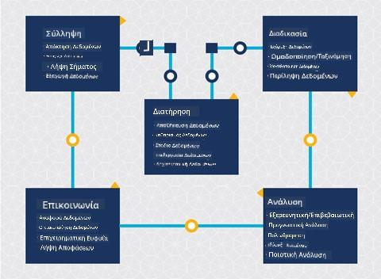
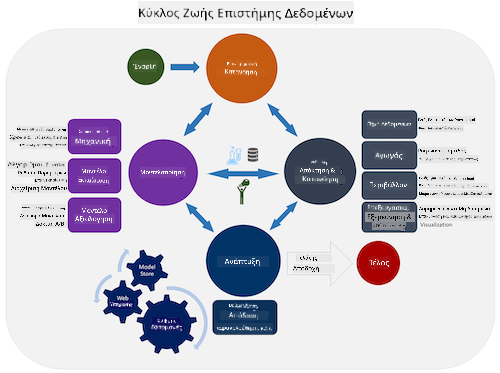

<!--
CO_OP_TRANSLATOR_METADATA:
{
  "original_hash": "07e12a25d20b8f191e3cb651c27fdb2b",
  "translation_date": "2025-09-06T21:00:11+00:00",
  "source_file": "4-Data-Science-Lifecycle/14-Introduction/README.md",
  "language_code": "el"
}
-->
# Εισαγωγή στον Κύκλο Ζωής της Επιστήμης Δεδομένων

| ](../../sketchnotes/14-DataScience-Lifecycle.png)|
|:---:|
| Εισαγωγή στον Κύκλο Ζωής της Επιστήμης Δεδομένων - _Σκίτσο από [@nitya](https://twitter.com/nitya)_ |

## [Προ-Διάλεξης Κουίζ](https://ff-quizzes.netlify.app/en/ds/quiz/26)

Σε αυτό το σημείο πιθανότατα έχετε συνειδητοποιήσει ότι η επιστήμη δεδομένων είναι μια διαδικασία. Αυτή η διαδικασία μπορεί να χωριστεί σε 5 στάδια:

- Συλλογή
- Επεξεργασία
- Ανάλυση
- Επικοινωνία
- Συντήρηση

Αυτό το μάθημα επικεντρώνεται σε 3 μέρη του κύκλου ζωής: συλλογή, επεξεργασία και συντήρηση.

  
> Φωτογραφία από [Berkeley School of Information](https://ischoolonline.berkeley.edu/data-science/what-is-data-science/)

## Συλλογή

Το πρώτο στάδιο του κύκλου ζωής είναι πολύ σημαντικό, καθώς τα επόμενα στάδια εξαρτώνται από αυτό. Στην ουσία, είναι δύο στάδια συνδυασμένα σε ένα: η απόκτηση των δεδομένων και ο καθορισμός του σκοπού και των προβλημάτων που πρέπει να αντιμετωπιστούν.  
Ο καθορισμός των στόχων του έργου απαιτεί βαθύτερη κατανόηση του προβλήματος ή της ερώτησης. Πρώτα, πρέπει να εντοπίσουμε και να αποκτήσουμε εκείνους που χρειάζονται να λυθεί το πρόβλημά τους. Αυτοί μπορεί να είναι ενδιαφερόμενοι σε μια επιχείρηση ή χορηγοί του έργου, οι οποίοι μπορούν να βοηθήσουν στον εντοπισμό του ποιος ή τι θα ωφεληθεί από αυτό το έργο, καθώς και τι και γιατί το χρειάζονται. Ένας καλά καθορισμένος στόχος πρέπει να είναι μετρήσιμος και ποσοτικοποιήσιμος για να ορίσει ένα αποδεκτό αποτέλεσμα.

Ερωτήσεις που μπορεί να θέσει ένας επιστήμονας δεδομένων:
- Έχει προσεγγιστεί αυτό το πρόβλημα στο παρελθόν; Τι ανακαλύφθηκε;
- Είναι ο σκοπός και ο στόχος κατανοητοί από όλους τους εμπλεκόμενους;
- Υπάρχει ασάφεια και πώς μπορεί να μειωθεί;
- Ποιοι είναι οι περιορισμοί;
- Πώς θα μπορούσε να μοιάζει το τελικό αποτέλεσμα;
- Πόσοι πόροι (χρόνος, άνθρωποι, υπολογιστική ισχύς) είναι διαθέσιμοι;

Στη συνέχεια, πρέπει να εντοπιστούν, να συλλεχθούν και τελικά να εξερευνηθούν τα δεδομένα που απαιτούνται για την επίτευξη αυτών των καθορισμένων στόχων. Σε αυτό το βήμα της απόκτησης, οι επιστήμονες δεδομένων πρέπει επίσης να αξιολογήσουν την ποσότητα και την ποιότητα των δεδομένων. Αυτό απαιτεί κάποια εξερεύνηση δεδομένων για να επιβεβαιωθεί ότι όσα έχουν αποκτηθεί θα υποστηρίξουν την επίτευξη του επιθυμητού αποτελέσματος.

Ερωτήσεις που μπορεί να θέσει ένας επιστήμονας δεδομένων σχετικά με τα δεδομένα:
- Ποια δεδομένα είναι ήδη διαθέσιμα σε μένα;
- Ποιος είναι ο ιδιοκτήτης αυτών των δεδομένων;
- Ποια είναι τα θέματα ιδιωτικότητας;
- Έχω αρκετά για να λύσω αυτό το πρόβλημα;
- Είναι τα δεδομένα αποδεκτής ποιότητας για αυτό το πρόβλημα;
- Αν ανακαλύψω πρόσθετες πληροφορίες μέσω αυτών των δεδομένων, πρέπει να εξετάσουμε το ενδεχόμενο αλλαγής ή επαναπροσδιορισμού των στόχων;

## Επεξεργασία

Το στάδιο της επεξεργασίας του κύκλου ζωής επικεντρώνεται στην ανακάλυψη μοτίβων στα δεδομένα καθώς και στη μοντελοποίηση. Ορισμένες τεχνικές που χρησιμοποιούνται σε αυτό το στάδιο απαιτούν στατιστικές μεθόδους για την αποκάλυψη των μοτίβων. Συνήθως, αυτή θα ήταν μια κουραστική εργασία για έναν άνθρωπο με ένα μεγάλο σύνολο δεδομένων και θα βασιστεί στους υπολογιστές για να επιταχύνουν τη διαδικασία. Αυτό το στάδιο είναι επίσης το σημείο όπου η επιστήμη δεδομένων και η μηχανική μάθηση διασταυρώνονται. Όπως μάθατε στο πρώτο μάθημα, η μηχανική μάθηση είναι η διαδικασία δημιουργίας μοντέλων για την κατανόηση των δεδομένων. Τα μοντέλα είναι μια αναπαράσταση της σχέσης μεταξύ μεταβλητών στα δεδομένα που βοηθούν στην πρόβλεψη αποτελεσμάτων.

Κοινές τεχνικές που χρησιμοποιούνται σε αυτό το στάδιο καλύπτονται στο πρόγραμμα σπουδών ML για αρχάριους. Ακολουθήστε τους συνδέσμους για να μάθετε περισσότερα για αυτές:

- [Κατηγοριοποίηση](https://github.com/microsoft/ML-For-Beginners/tree/main/4-Classification): Οργάνωση δεδομένων σε κατηγορίες για πιο αποτελεσματική χρήση.
- [Ομαδοποίηση](https://github.com/microsoft/ML-For-Beginners/tree/main/5-Clustering): Ομαδοποίηση δεδομένων σε παρόμοιες ομάδες.
- [Παλινδρόμηση](https://github.com/microsoft/ML-For-Beginners/tree/main/2-Regression): Καθορισμός των σχέσεων μεταξύ μεταβλητών για πρόβλεψη ή εκτίμηση τιμών.

## Συντήρηση

Στο διάγραμμα του κύκλου ζωής, ίσως παρατηρήσατε ότι η συντήρηση βρίσκεται μεταξύ της συλλογής και της επεξεργασίας. Η συντήρηση είναι μια συνεχής διαδικασία διαχείρισης, αποθήκευσης και ασφάλειας των δεδομένων καθ' όλη τη διάρκεια της διαδικασίας ενός έργου και πρέπει να λαμβάνεται υπόψη καθ' όλη τη διάρκεια του έργου.

### Αποθήκευση Δεδομένων

Οι αποφάσεις σχετικά με το πώς και πού αποθηκεύονται τα δεδομένα μπορούν να επηρεάσουν το κόστος της αποθήκευσής τους καθώς και την απόδοση της ταχύτητας πρόσβασης στα δεδομένα. Τέτοιες αποφάσεις δεν είναι πιθανό να ληφθούν μόνο από έναν επιστήμονα δεδομένων, αλλά μπορεί να χρειαστεί να κάνουν επιλογές για το πώς να εργαστούν με τα δεδομένα με βάση τον τρόπο αποθήκευσής τους.

Ακολουθούν ορισμένες πτυχές των σύγχρονων συστημάτων αποθήκευσης δεδομένων που μπορούν να επηρεάσουν αυτές τις επιλογές:

**Εντός εγκαταστάσεων vs εκτός εγκαταστάσεων vs δημόσιο ή ιδιωτικό cloud**

Η αποθήκευση εντός εγκαταστάσεων αναφέρεται στη διαχείριση των δεδομένων στον δικό σας εξοπλισμό, όπως η κατοχή ενός διακομιστή με σκληρούς δίσκους που αποθηκεύουν τα δεδομένα, ενώ η αποθήκευση εκτός εγκαταστάσεων βασίζεται σε εξοπλισμό που δεν σας ανήκει, όπως ένα κέντρο δεδομένων. Το δημόσιο cloud είναι μια δημοφιλής επιλογή για την αποθήκευση δεδομένων που δεν απαιτεί γνώση του πώς ή πού ακριβώς αποθηκεύονται τα δεδομένα, όπου το δημόσιο αναφέρεται σε μια ενιαία υποδομή που μοιράζεται από όλους όσοι χρησιμοποιούν το cloud. Ορισμένοι οργανισμοί έχουν αυστηρές πολιτικές ασφαλείας που απαιτούν πλήρη πρόσβαση στον εξοπλισμό όπου φιλοξενούνται τα δεδομένα και θα βασιστούν σε ένα ιδιωτικό cloud που παρέχει τις δικές του υπηρεσίες cloud. Θα μάθετε περισσότερα για τα δεδομένα στο cloud σε [μεταγενέστερα μαθήματα](https://github.com/microsoft/Data-Science-For-Beginners/tree/main/5-Data-Science-In-Cloud).

**Ψυχρά vs θερμά δεδομένα**

Όταν εκπαιδεύετε τα μοντέλα σας, μπορεί να χρειαστείτε περισσότερα δεδομένα εκπαίδευσης. Αν είστε ικανοποιημένοι με το μοντέλο σας, περισσότερα δεδομένα θα φτάσουν για να εξυπηρετήσουν τον σκοπό του μοντέλου. Σε κάθε περίπτωση, το κόστος αποθήκευσης και πρόσβασης στα δεδομένα θα αυξηθεί καθώς συσσωρεύετε περισσότερα. Ο διαχωρισμός σπάνια χρησιμοποιούμενων δεδομένων, γνωστών ως ψυχρά δεδομένα, από συχνά προσπελάσιμα θερμά δεδομένα μπορεί να είναι μια φθηνότερη επιλογή αποθήκευσης δεδομένων μέσω υλικού ή λογισμικού υπηρεσιών. Αν τα ψυχρά δεδομένα χρειαστεί να προσπελαστούν, μπορεί να χρειαστεί λίγος περισσότερος χρόνος για την ανάκτησή τους σε σύγκριση με τα θερμά δεδομένα.

### Διαχείριση Δεδομένων

Καθώς εργάζεστε με δεδομένα, μπορεί να ανακαλύψετε ότι ορισμένα από αυτά χρειάζονται καθαρισμό χρησιμοποιώντας κάποιες από τις τεχνικές που καλύπτονται στο μάθημα που επικεντρώνεται στην [προετοιμασία δεδομένων](https://github.com/microsoft/Data-Science-For-Beginners/tree/main/2-Working-With-Data/08-data-preparation) για τη δημιουργία ακριβών μοντέλων. Όταν φτάνουν νέα δεδομένα, θα χρειαστούν τις ίδιες εφαρμογές για να διατηρηθεί η συνέπεια στην ποιότητα. Ορισμένα έργα θα περιλαμβάνουν τη χρήση ενός αυτοματοποιημένου εργαλείου για καθαρισμό, συγκέντρωση και συμπίεση πριν τα δεδομένα μεταφερθούν στην τελική τους τοποθεσία. Το Azure Data Factory είναι ένα παράδειγμα ενός από αυτά τα εργαλεία.

### Ασφάλεια Δεδομένων

Ένας από τους κύριους στόχους της ασφάλειας δεδομένων είναι να διασφαλιστεί ότι όσοι εργάζονται με αυτά έχουν τον έλεγχο του τι συλλέγεται και σε ποιο πλαίσιο χρησιμοποιείται. Η διατήρηση της ασφάλειας των δεδομένων περιλαμβάνει τον περιορισμό της πρόσβασης μόνο σε όσους τη χρειάζονται, την τήρηση τοπικών νόμων και κανονισμών, καθώς και τη διατήρηση ηθικών προτύπων, όπως καλύπτεται στο [μάθημα ηθικής](https://github.com/microsoft/Data-Science-For-Beginners/tree/main/1-Introduction/02-ethics).

Ακολουθούν ορισμένα πράγματα που μπορεί να κάνει μια ομάδα με γνώμονα την ασφάλεια:
- Επιβεβαίωση ότι όλα τα δεδομένα είναι κρυπτογραφημένα
- Παροχή πληροφοριών στους πελάτες για το πώς χρησιμοποιούνται τα δεδομένα τους
- Αφαίρεση πρόσβασης στα δεδομένα από όσους έχουν αποχωρήσει από το έργο
- Επιτρέπεται μόνο σε συγκεκριμένα μέλη του έργου να τροποποιούν τα δεδομένα

## 🚀 Πρόκληση

Υπάρχουν πολλές εκδοχές του Κύκλου Ζωής της Επιστήμης Δεδομένων, όπου κάθε βήμα μπορεί να έχει διαφορετικά ονόματα και αριθμό σταδίων, αλλά θα περιέχει τις ίδιες διαδικασίες που αναφέρονται σε αυτό το μάθημα.

Εξερευνήστε τον [Κύκλο Ζωής της Διαδικασίας Ομάδας Επιστήμης Δεδομένων](https://docs.microsoft.com/en-us/azure/architecture/data-science-process/lifecycle) και το [Δια-βιομηχανικό πρότυπο διαδικασίας για εξόρυξη δεδομένων](https://www.datascience-pm.com/crisp-dm-2/). Ονομάστε 3 ομοιότητες και διαφορές μεταξύ των δύο.

|Διαδικασία Ομάδας Επιστήμης Δεδομένων (TDSP)|Δια-βιομηχανικό πρότυπο διαδικασίας για εξόρυξη δεδομένων (CRISP-DM)|
|--|--|
| |  |
| Εικόνα από [Microsoft](https://docs.microsoft.comazure/architecture/data-science-process/lifecycle) | Εικόνα από [Data Science Process Alliance](https://www.datascience-pm.com/crisp-dm-2/) |

## [Κουίζ Μετά τη Διάλεξη](https://ff-quizzes.netlify.app/en/ds/quiz/27)

## Ανασκόπηση & Αυτομελέτη

Η εφαρμογή του Κύκλου Ζωής της Επιστήμης Δεδομένων περιλαμβάνει πολλούς ρόλους και εργασίες, όπου ορισμένοι μπορεί να επικεντρωθούν σε συγκεκριμένα μέρη κάθε σταδίου. Η Διαδικασία Ομάδας Επιστήμης Δεδομένων παρέχει μερικούς πόρους που εξηγούν τους τύπους ρόλων και εργασιών που μπορεί να έχει κάποιος σε ένα έργο.

* [Ρόλοι και εργασίες της Διαδικασίας Ομάδας Επιστήμης Δεδομένων](https://docs.microsoft.com/en-us/azure/architecture/data-science-process/roles-tasks)
* [Εκτέλεση εργασιών επιστήμης δεδομένων: εξερεύνηση, μοντελοποίηση και ανάπτυξη](https://docs.microsoft.com/en-us/azure/architecture/data-science-process/execute-data-science-tasks)

## Εργασία

[Αξιολόγηση ενός Συνόλου Δεδομένων](assignment.md)

---

**Αποποίηση ευθύνης**:  
Αυτό το έγγραφο έχει μεταφραστεί χρησιμοποιώντας την υπηρεσία αυτόματης μετάφρασης [Co-op Translator](https://github.com/Azure/co-op-translator). Παρόλο που καταβάλλουμε προσπάθειες για ακρίβεια, παρακαλούμε να έχετε υπόψη ότι οι αυτόματες μεταφράσεις ενδέχεται να περιέχουν σφάλματα ή ανακρίβειες. Το πρωτότυπο έγγραφο στη μητρική του γλώσσα θα πρέπει να θεωρείται η αυθεντική πηγή. Για κρίσιμες πληροφορίες, συνιστάται επαγγελματική ανθρώπινη μετάφραση. Δεν φέρουμε ευθύνη για τυχόν παρεξηγήσεις ή εσφαλμένες ερμηνείες που προκύπτουν από τη χρήση αυτής της μετάφρασης.