<!--
CO_OP_TRANSLATOR_METADATA:
{
  "original_hash": "39f3b3a9d873eaa522c2e792ce0ca503",
  "translation_date": "2025-09-04T18:21:41+00:00",
  "source_file": "5-Data-Science-In-Cloud/18-Low-Code/README.md",
  "language_code": "el"
}
-->
# Επιστήμη Δεδομένων στο Cloud: Η προσέγγιση "Low code/No code"

| ](../../sketchnotes/18-DataScience-Cloud.png)|
|:---:|
| Επιστήμη Δεδομένων στο Cloud: Low Code - _Σκίτσο από [@nitya](https://twitter.com/nitya)_ |

Πίνακας περιεχομένων:

- [Επιστήμη Δεδομένων στο Cloud: Η προσέγγιση "Low code/No code"](../../../../5-Data-Science-In-Cloud/18-Low-Code)
  - [Κουίζ πριν το μάθημα](../../../../5-Data-Science-In-Cloud/18-Low-Code)
  - [1. Εισαγωγή](../../../../5-Data-Science-In-Cloud/18-Low-Code)
    - [1.1 Τι είναι το Azure Machine Learning;](../../../../5-Data-Science-In-Cloud/18-Low-Code)
    - [1.2 Το Πρόγραμμα Πρόβλεψης Καρδιακής Ανεπάρκειας:](../../../../5-Data-Science-In-Cloud/18-Low-Code)
    - [1.3 Το Σύνολο Δεδομένων Καρδιακής Ανεπάρκειας:](../../../../5-Data-Science-In-Cloud/18-Low-Code)
  - [2. Εκπαίδευση μοντέλου με Low code/No code στο Azure ML Studio](../../../../5-Data-Science-In-Cloud/18-Low-Code)
    - [2.1 Δημιουργία ενός Azure ML workspace](../../../../5-Data-Science-In-Cloud/18-Low-Code)
    - [2.2 Πόροι Υπολογισμού](../../../../5-Data-Science-In-Cloud/18-Low-Code)
      - [2.2.1 Επιλογή κατάλληλων επιλογών για τους πόρους υπολογισμού](../../../../5-Data-Science-In-Cloud/18-Low-Code)
      - [2.2.2 Δημιουργία ενός υπολογιστικού cluster](../../../../5-Data-Science-In-Cloud/18-Low-Code)
    - [2.3 Φόρτωση του Συνόλου Δεδομένων](../../../../5-Data-Science-In-Cloud/18-Low-Code)
    - [2.4 Εκπαίδευση με Low code/No Code μέσω AutoML](../../../../5-Data-Science-In-Cloud/18-Low-Code)
  - [3. Ανάπτυξη μοντέλου με Low code/No Code και κατανάλωση endpoint](../../../../5-Data-Science-In-Cloud/18-Low-Code)
    - [3.1 Ανάπτυξη μοντέλου](../../../../5-Data-Science-In-Cloud/18-Low-Code)
    - [3.2 Κατανάλωση endpoint](../../../../5-Data-Science-In-Cloud/18-Low-Code)
  - [🚀 Πρόκληση](../../../../5-Data-Science-In-Cloud/18-Low-Code)
  - [Κουίζ μετά το μάθημα](../../../../5-Data-Science-In-Cloud/18-Low-Code)
  - [Ανασκόπηση & Αυτομελέτη](../../../../5-Data-Science-In-Cloud/18-Low-Code)
  - [Εργασία](../../../../5-Data-Science-In-Cloud/18-Low-Code)
  
## [Κουίζ πριν το μάθημα](https://ff-quizzes.netlify.app/en/ds/)

## 1. Εισαγωγή
### 1.1 Τι είναι το Azure Machine Learning;

Η πλατφόρμα cloud Azure περιλαμβάνει περισσότερα από 200 προϊόντα και υπηρεσίες cloud σχεδιασμένα για να σας βοηθήσουν να υλοποιήσετε νέες λύσεις. Οι επιστήμονες δεδομένων καταναλώνουν πολύ χρόνο εξερευνώντας και προεπεξεργάζοντας δεδομένα, δοκιμάζοντας διάφορους τύπους αλγορίθμων εκπαίδευσης μοντέλων για να παράγουν ακριβή μοντέλα. Αυτές οι εργασίες είναι χρονοβόρες και συχνά κάνουν αναποτελεσματική χρήση ακριβού υλικού υπολογισμού.

Το [Azure ML](https://docs.microsoft.com/azure/machine-learning/overview-what-is-azure-machine-learning?WT.mc_id=academic-77958-bethanycheum&ocid=AID3041109) είναι μια πλατφόρμα βασισμένη στο cloud για τη δημιουργία και λειτουργία λύσεων μηχανικής μάθησης στο Azure. Περιλαμβάνει μια ευρεία γκάμα χαρακτηριστικών και δυνατοτήτων που βοηθούν τους επιστήμονες δεδομένων να προετοιμάσουν δεδομένα, να εκπαιδεύσουν μοντέλα, να δημοσιεύσουν υπηρεσίες πρόβλεψης και να παρακολουθήσουν τη χρήση τους. Το πιο σημαντικό είναι ότι τους βοηθά να αυξήσουν την αποτελεσματικότητά τους αυτοματοποιώντας πολλές από τις χρονοβόρες εργασίες που σχετίζονται με την εκπαίδευση μοντέλων και τους επιτρέπει να χρησιμοποιούν πόρους υπολογισμού βασισμένους στο cloud που κλιμακώνονται αποτελεσματικά, για να χειρίζονται μεγάλους όγκους δεδομένων με κόστος μόνο όταν χρησιμοποιούνται.

Το Azure ML παρέχει όλα τα εργαλεία που χρειάζονται οι προγραμματιστές και οι επιστήμονες δεδομένων για τις ροές εργασίας μηχανικής μάθησης. Αυτά περιλαμβάνουν:

- **Azure Machine Learning Studio**: μια διαδικτυακή πύλη στο Azure Machine Learning για επιλογές low-code και no-code για εκπαίδευση μοντέλων, ανάπτυξη, αυτοματοποίηση, παρακολούθηση και διαχείριση πόρων. Το studio ενσωματώνεται με το Azure Machine Learning SDK για μια απρόσκοπτη εμπειρία.
- **Jupyter Notebooks**: γρήγορη δημιουργία πρωτοτύπων και δοκιμή μοντέλων ML.
- **Azure Machine Learning Designer**: επιτρέπει τη δημιουργία πειραμάτων με drag-n-drop και την ανάπτυξη pipelines σε ένα περιβάλλον low-code.
- **Αυτοματοποιημένο UI μηχανικής μάθησης (AutoML)**: αυτοματοποιεί επαναληπτικές εργασίες ανάπτυξης μοντέλων μηχανικής μάθησης, επιτρέποντας τη δημιουργία μοντέλων ML με υψηλή κλίμακα, αποτελεσματικότητα και παραγωγικότητα, διατηρώντας παράλληλα την ποιότητα του μοντέλου.
- **Επισήμανση δεδομένων**: ένα εργαλείο υποβοηθούμενης ML για αυτόματη επισήμανση δεδομένων.
- **Επέκταση μηχανικής μάθησης για το Visual Studio Code**: παρέχει ένα πλήρες περιβάλλον ανάπτυξης για τη δημιουργία και διαχείριση έργων ML.
- **CLI μηχανικής μάθησης**: παρέχει εντολές για τη διαχείριση πόρων Azure ML από τη γραμμή εντολών.
- **Ενσωμάτωση με open-source frameworks** όπως PyTorch, TensorFlow, Scikit-learn και πολλά άλλα για εκπαίδευση, ανάπτυξη και διαχείριση της διαδικασίας μηχανικής μάθησης από άκρο σε άκρο.
- **MLflow**: μια βιβλιοθήκη ανοιχτού κώδικα για τη διαχείριση του κύκλου ζωής των πειραμάτων μηχανικής μάθησης. Το **MLFlow Tracking** είναι ένα στοιχείο του MLflow που καταγράφει και παρακολουθεί τις μετρήσεις εκπαίδευσης και τα αρχεία μοντέλων, ανεξάρτητα από το περιβάλλον του πειράματος.

### 1.2 Το Πρόγραμμα Πρόβλεψης Καρδιακής Ανεπάρκειας:

Δεν υπάρχει αμφιβολία ότι η δημιουργία και η ανάπτυξη προγραμμάτων είναι ο καλύτερος τρόπος για να δοκιμάσετε τις δεξιότητες και τις γνώσεις σας. Σε αυτό το μάθημα, θα εξερευνήσουμε δύο διαφορετικούς τρόπους δημιουργίας ενός προγράμματος επιστήμης δεδομένων για την πρόβλεψη καρδιακής ανεπάρκειας στο Azure ML Studio, μέσω Low code/No code και μέσω του Azure ML SDK, όπως φαίνεται στο παρακάτω σχήμα:

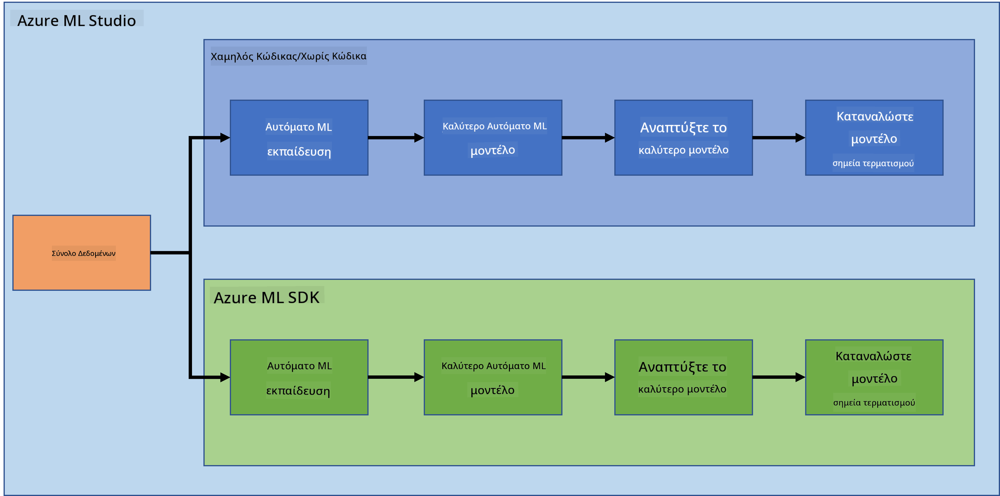

Κάθε τρόπος έχει τα δικά του πλεονεκτήματα και μειονεκτήματα. Η προσέγγιση Low code/No code είναι ευκολότερη για να ξεκινήσετε, καθώς περιλαμβάνει αλληλεπίδραση με ένα GUI (Γραφικό Περιβάλλον Χρήστη), χωρίς να απαιτείται προηγούμενη γνώση κώδικα. Αυτή η μέθοδος επιτρέπει γρήγορη δοκιμή της βιωσιμότητας του προγράμματος και τη δημιουργία POC (Proof Of Concept). Ωστόσο, καθώς το πρόγραμμα μεγαλώνει και πρέπει να είναι έτοιμο για παραγωγή, δεν είναι εφικτό να δημιουργούνται πόροι μέσω GUI. Χρειάζεται να αυτοματοποιήσουμε προγραμματιστικά τα πάντα, από τη δημιουργία πόρων έως την ανάπτυξη ενός μοντέλου. Εδώ είναι που η γνώση του Azure ML SDK γίνεται κρίσιμη.

|                   | Low code/No code | Azure ML SDK              |
|-------------------|------------------|---------------------------|
| Εξειδίκευση στον κώδικα | Δεν απαιτείται     | Απαιτείται                  |
| Χρόνος ανάπτυξης   | Γρήγορος και εύκολος | Εξαρτάται από την εξειδίκευση στον κώδικα |
| Έτοιμο για παραγωγή | Όχι               | Ναι                       |

### 1.3 Το Σύνολο Δεδομένων Καρδιακής Ανεπάρκειας:

Οι καρδιαγγειακές παθήσεις (CVDs) είναι η νούμερο 1 αιτία θανάτου παγκοσμίως, αντιπροσωπεύοντας το 31% όλων των θανάτων. Περιβαλλοντικοί και συμπεριφορικοί παράγοντες κινδύνου, όπως η χρήση καπνού, η ανθυγιεινή διατροφή και η παχυσαρκία, η σωματική αδράνεια και η επιβλαβής χρήση αλκοόλ, μπορούν να χρησιμοποιηθούν ως χαρακτηριστικά για μοντέλα εκτίμησης. Η δυνατότητα εκτίμησης της πιθανότητας ανάπτυξης μιας καρδιαγγειακής πάθησης θα μπορούσε να είναι πολύ χρήσιμη για την πρόληψη επιθέσεων σε άτομα υψηλού κινδύνου.

Το Kaggle έχει διαθέσει δημόσια ένα [σύνολο δεδομένων καρδιακής ανεπάρκειας](https://www.kaggle.com/andrewmvd/heart-failure-clinical-data), το οποίο θα χρησιμοποιήσουμε για αυτό το πρόγραμμα. Μπορείτε να κατεβάσετε το σύνολο δεδομένων τώρα. Πρόκειται για ένα σύνολο δεδομένων σε μορφή πίνακα με 13 στήλες (12 χαρακτηριστικά και 1 μεταβλητή στόχου) και 299 γραμμές.

|    | Όνομα μεταβλητής          | Τύπος            | Περιγραφή                                               | Παράδειγμα        |
|----|---------------------------|-----------------|-----------------------------------------------------------|-------------------|
| 1  | age                       | αριθμητικός       | ηλικία του ασθενούς                                      | 25                |
| 2  | anaemia                   | boolean         | Μείωση ερυθρών αιμοσφαιρίων ή αιμοσφαιρίνης              | 0 ή 1            |
| 3  | creatinine_phosphokinase  | αριθμητικός       | Επίπεδο του ενζύμου CPK στο αίμα                         | 542               |
| 4  | diabetes                  | boolean         | Αν ο ασθενής έχει διαβήτη                                | 0 ή 1            |
| 5  | ejection_fraction         | αριθμητικός       | Ποσοστό αίματος που φεύγει από την καρδιά σε κάθε συστολή | 45                |
| 6  | high_blood_pressure       | boolean         | Αν ο ασθενής έχει υπέρταση                               | 0 ή 1            |
| 7  | platelets                 | αριθμητικός       | Αιμοπετάλια στο αίμα                                     | 149000            |
| 8  | serum_creatinine          | αριθμητικός       | Επίπεδο κρεατινίνης στον ορό του αίματος                 | 0.5               |
| 9  | serum_sodium              | αριθμητικός       | Επίπεδο νατρίου στον ορό του αίματος                     | jun               |
| 10 | sex                       | boolean         | γυναίκα ή άνδρας                                         | 0 ή 1            |
| 11 | smoking                   | boolean         | Αν ο ασθενής καπνίζει                                    | 0 ή 1            |
| 12 | time                      | αριθμητικός       | περίοδος παρακολούθησης (ημέρες)                         | 4                 |
|----|---------------------------|-----------------|-----------------------------------------------------------|-------------------|
| 21 | DEATH_EVENT [Target]      | boolean         | αν ο ασθενής πεθάνει κατά την περίοδο παρακολούθησης      | 0 ή 1            |

Αφού αποκτήσετε το σύνολο δεδομένων, μπορούμε να ξεκινήσουμε το πρόγραμμα στο Azure.

## 2. Εκπαίδευση μοντέλου με Low code/No code στο Azure ML Studio
### 2.1 Δημιουργία ενός Azure ML workspace
Για να εκπαιδεύσετε ένα μοντέλο στο Azure ML, πρέπει πρώτα να δημιουργήσετε ένα Azure ML workspace. Το workspace είναι ο κορυφαίος πόρος για το Azure Machine Learning, παρέχοντας ένα κεντρικό σημείο για να εργαστείτε με όλα τα αντικείμενα που δημιουργείτε όταν χρησιμοποιείτε το Azure Machine Learning. Το workspace διατηρεί ένα ιστορικό όλων των εκτελέσεων εκπαίδευσης, συμπεριλαμβανομένων των αρχείων καταγραφής, των μετρήσεων, των εξόδων και ενός στιγμιότυπου των σεναρίων σας. Χρησιμοποιείτε αυτές τις πληροφορίες για να καθορίσετε ποια εκτέλεση εκπαίδευσης παράγει το καλύτερο μοντέλο. [Μάθετε περισσότερα](https://docs.microsoft.com/azure/machine-learning/concept-workspace?WT.mc_id=academic-77958-bethanycheum&ocid=AID3041109)

Συνιστάται να χρησιμοποιείτε τον πιο ενημερωμένο περιηγητή που είναι συμβατός με το λειτουργικό σας σύστημα. Οι ακόλουθοι περιηγητές υποστηρίζονται:

- Microsoft Edge (Η νέα έκδοση του Microsoft Edge, τελευταία έκδοση. Όχι η παλαιότερη έκδοση του Microsoft Edge)
- Safari (τελευταία έκδοση, μόνο για Mac)
- Chrome (τελευταία έκδοση)
- Firefox (τελευταία έκδοση)

Για να χρησιμοποιήσετε το Azure Machine Learning, δημιουργήστε ένα workspace στη συνδρομή σας στο Azure. Στη συνέχεια, μπορείτε να χρησιμοποιήσετε αυτό το workspace για να διαχειριστείτε δεδομένα, πόρους υπολογισμού, κώδικα, μοντέλα και άλλα αντικείμενα που σχετίζονται με τις εργασίες μηχανικής μάθησης.

> **_ΣΗΜΕΙΩΣΗ:_** Η συνδρομή σας στο Azure θα χρεωθεί ένα μικρό ποσό για την αποθήκευση δεδομένων όσο το Azure Machine Learning workspace υπάρχει στη συνδρομή σας, γι' αυτό συνιστούμε να διαγράψετε το Azure Machine Learning workspace όταν δεν το χρησιμοποιείτε πλέον.

1. Συνδεθείτε στο [Azure portal](https://ms.portal.azure.com/) χρησιμοποιώντας τα διαπιστευτήρια Microsoft που σχετίζονται με τη συνδρομή σας στο Azure.
2. Επιλέξτε **＋Create a resource**
   
   

   Αναζητήστε το Machine Learning και επιλέξτε το πλακίδιο Machine Learning

   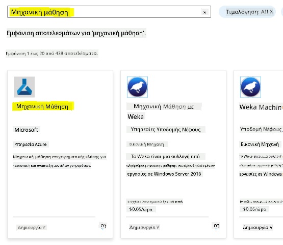

   Κάντε κλικ στο κουμπί δημιουργίας

   

   Συμπληρώστε τις ρυθμίσεις ως εξής:
   - Συνδρομή: Η συνδρομή σας στο Azure
   - Ομάδα πόρων: Δημιουργήστε ή επιλέξτε μια ομάδα πόρων
   - Όνομα workspace: Εισάγετε ένα μοναδικό όνομα για το workspace σας
   - Περιοχή: Επιλέξτε τη γεωγραφική περιοχή που είναι πιο κοντά σας
   - Λογαριασμός αποθήκευσης: Σημειώστε τον προεπιλεγμένο νέο λογαριασμό αποθήκευσης που θα δημιουργηθεί για το workspace σας
   - Key vault: Σημειώστε το προεπιλεγμένο νέο key vault που θα δημιουργηθεί για το workspace σας
   - Application insights: Σημειώστε τον προεπιλεγμένο νέο πόρο application insights που θα δημιουργηθεί για το workspace σας
   - Container registry: Κανένα (θα δημιουργηθεί αυτόματα την πρώτη φορά που θα αναπτύξετε ένα μοντέλο σε container)

    

   - Κάντε κλικ στο create + review και στη συνέχεια στο κουμπί δημιουργίας
3. Περιμένετε να δημιουργηθεί το workspace σας (αυτό μπορεί να πάρει λίγα λεπτά). Στη συνέχεια, μεταβείτε σε αυτό μέσω της υπηρεσίας Machine Learning του Azure.
4. Στη σελίδα επισκόπησης του workspace σας, εκκινήστε το Azure Machine Learning studio (ή ανοίξτε μια νέα καρτέλα περιηγητή και μεταβείτε στο https://ml.azure.com), και συνδεθείτε στο Azure Machine Learning studio χρησιμοποιώντας τον λογαριασμό σας Microsoft. Εάν σας ζητηθεί, επιλέξτε τον κατάλογο και τη συνδρομή σας στο Azure, καθώς και το Azure Machine Learning workspace σας.
   
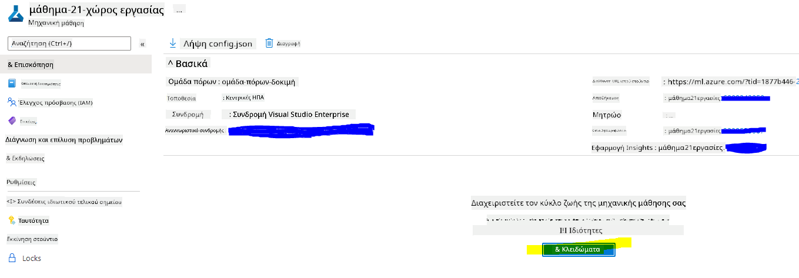

5. Στο Azure Machine Learning studio, ενεργοποιήστε το εικονίδιο ☰ στην επάνω αριστερή γωνία για να δείτε τις διάφορες σελίδες στη διεπαφή. Μπορείτε να χρησιμοποιήσετε αυτές τις σελίδες για να διαχειριστείτε τους πόρους στο workspace σας.

 είναι το ηλεκτρονικό κύκλωμα που εκτελεί εντολές που αποτελούν ένα πρόγραμμα υπολογιστή. Η GPU (Μονάδα Επεξεργασίας Γραφικών) είναι ένα εξειδικευμένο ηλεκτρονικό κύκλωμα που μπορεί να εκτελεί κώδικα που σχετίζεται με γραφικά με πολύ υψηλή ταχύτητα.

Η κύρια διαφορά μεταξύ της αρχιτεκτονικής CPU και GPU είναι ότι η CPU έχει σχεδιαστεί για να χειρίζεται ένα ευρύ φάσμα εργασιών γρήγορα (όπως μετράται από την ταχύτητα ρολογιού της CPU), αλλά περιορίζεται στην ταυτόχρονη εκτέλεση πολλών εργασιών. Οι GPUs είναι σχεδιασμένες για παράλληλη επεξεργασία και επομένως είναι πολύ καλύτερες για εργασίες βαθιάς μάθησης.

| CPU                                     | GPU                         |
|-----------------------------------------|-----------------------------|
| Λιγότερο ακριβή                         | Πιο ακριβή                 |
| Χαμηλότερο επίπεδο ταυτόχρονης εκτέλεσης| Υψηλότερο επίπεδο ταυτόχρονης εκτέλεσης |
| Πιο αργή στην εκπαίδευση μοντέλων βαθιάς μάθησης | Βέλτιστη για βαθιά μάθηση |

**Μέγεθος Συστοιχίας**

Οι μεγαλύτερες συστοιχίες είναι πιο ακριβές αλλά προσφέρουν καλύτερη ανταπόκριση. Επομένως, αν έχετε χρόνο αλλά όχι αρκετά χρήματα, θα πρέπει να ξεκινήσετε με μια μικρή συστοιχία. Αντίθετα, αν έχετε χρήματα αλλά όχι πολύ χρόνο, θα πρέπει να ξεκινήσετε με μια μεγαλύτερη συστοιχία.

**Μέγεθος VM**

Ανάλογα με τους χρονικούς και οικονομικούς περιορισμούς σας, μπορείτε να προσαρμόσετε το μέγεθος της RAM, του δίσκου, τον αριθμό των πυρήνων και την ταχύτητα ρολογιού. Η αύξηση όλων αυτών των παραμέτρων θα είναι πιο δαπανηρή, αλλά θα προσφέρει καλύτερη απόδοση.

**Αφιερωμένες ή Χαμηλής Προτεραιότητας Περιπτώσεις;**

Μια περίπτωση χαμηλής προτεραιότητας σημαίνει ότι είναι διακοπτόμενη: ουσιαστικά, το Microsoft Azure μπορεί να πάρει αυτούς τους πόρους και να τους αναθέσει σε άλλη εργασία, διακόπτοντας έτσι μια εργασία. Μια αφιερωμένη περίπτωση, ή μη διακοπτόμενη, σημαίνει ότι η εργασία δεν θα τερματιστεί ποτέ χωρίς την άδειά σας. 
Αυτό είναι μια άλλη σκέψη για το χρόνο έναντι των χρημάτων, καθώς οι διακοπτόμενες περιπτώσεις είναι λιγότερο ακριβές από τις αφιερωμένες.

#### 2.2.2 Δημιουργία συστοιχίας υπολογισμού

Στον [χώρο εργασίας Azure ML](https://ml.azure.com/) που δημιουργήσαμε νωρίτερα, μεταβείτε στον υπολογισμό και θα μπορείτε να δείτε τους διάφορους πόρους υπολογισμού που μόλις συζητήσαμε (δηλαδή υπολογιστικές περιπτώσεις, συστοιχίες υπολογισμού, συστοιχίες πρόβλεψης και συνδεδεμένο υπολογισμό). Για αυτό το έργο, θα χρειαστούμε μια συστοιχία υπολογισμού για την εκπαίδευση του μοντέλου. Στο Studio, κάντε κλικ στο μενού "Compute", στη συνέχεια στην καρτέλα "Compute cluster" και κάντε κλικ στο κουμπί "+ New" για να δημιουργήσετε μια συστοιχία υπολογισμού.

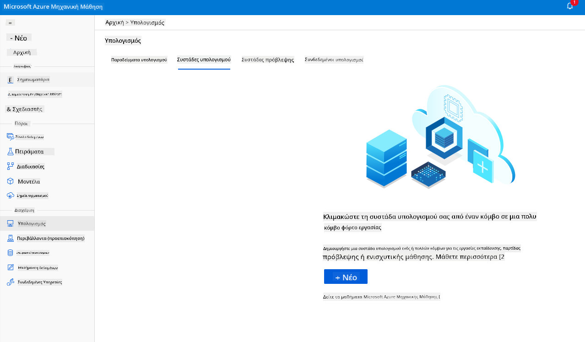

1. Επιλέξτε τις επιλογές σας: Αφιερωμένο ή Χαμηλής προτεραιότητας, CPU ή GPU, μέγεθος VM και αριθμός πυρήνων (μπορείτε να διατηρήσετε τις προεπιλεγμένες ρυθμίσεις για αυτό το έργο).
2. Κάντε κλικ στο κουμπί Επόμενο.


3. Δώστε στη συστοιχία ένα όνομα υπολογισμού.
4. Επιλέξτε τις επιλογές σας: Ελάχιστος/Μέγιστος αριθμός κόμβων, δευτερόλεπτα αδράνειας πριν από τη μείωση κλίμακας, πρόσβαση SSH. Σημειώστε ότι αν ο ελάχιστος αριθμός κόμβων είναι 0, θα εξοικονομήσετε χρήματα όταν η συστοιχία είναι αδρανής. Σημειώστε ότι όσο μεγαλύτερος είναι ο αριθμός των μέγιστων κόμβων, τόσο πιο σύντομη θα είναι η εκπαίδευση. Ο μέγιστος αριθμός κόμβων που συνιστάται είναι 3.
5. Κάντε κλικ στο κουμπί "Create". Αυτό το βήμα μπορεί να διαρκέσει μερικά λεπτά.

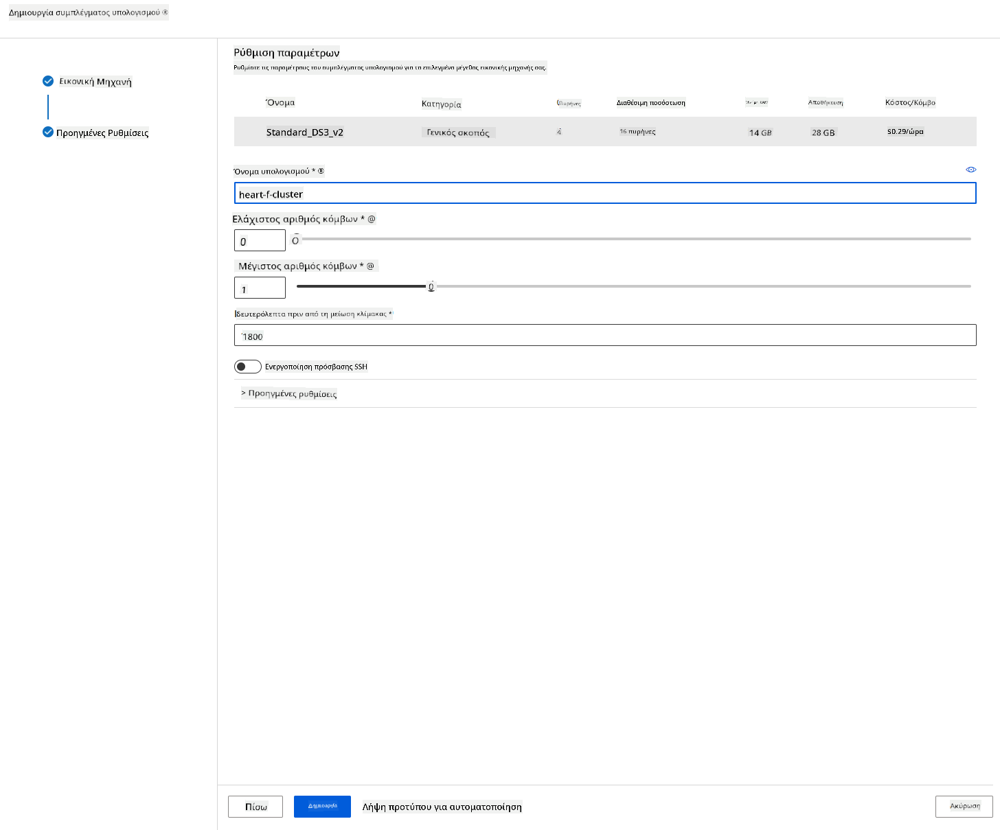

Τέλεια! Τώρα που έχουμε μια συστοιχία υπολογισμού, πρέπει να φορτώσουμε τα δεδομένα στο Azure ML Studio.

### 2.3 Φόρτωση του Συνόλου Δεδομένων

1. Στον [χώρο εργασίας Azure ML](https://ml.azure.com/) που δημιουργήσαμε νωρίτερα, κάντε κλικ στο "Datasets" στο αριστερό μενού και κάντε κλικ στο κουμπί "+ Create dataset" για να δημιουργήσετε ένα σύνολο δεδομένων. Επιλέξτε την επιλογή "From local files" και επιλέξτε το σύνολο δεδομένων Kaggle που κατεβάσαμε νωρίτερα.

   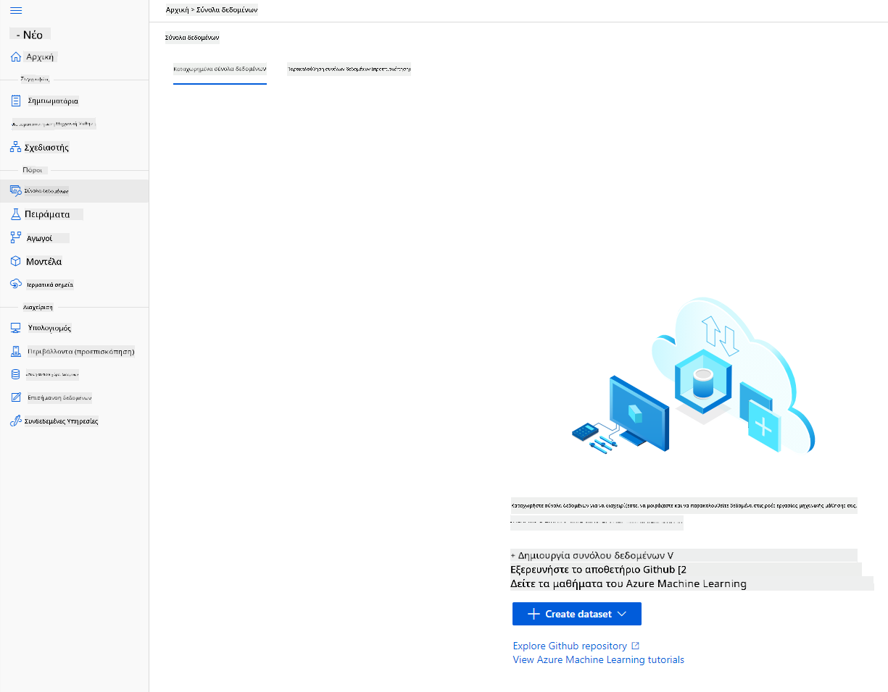

2. Δώστε στο σύνολο δεδομένων σας ένα όνομα, έναν τύπο και μια περιγραφή. Κάντε κλικ στο Επόμενο. Ανεβάστε τα δεδομένα από αρχεία. Κάντε κλικ στο Επόμενο.

   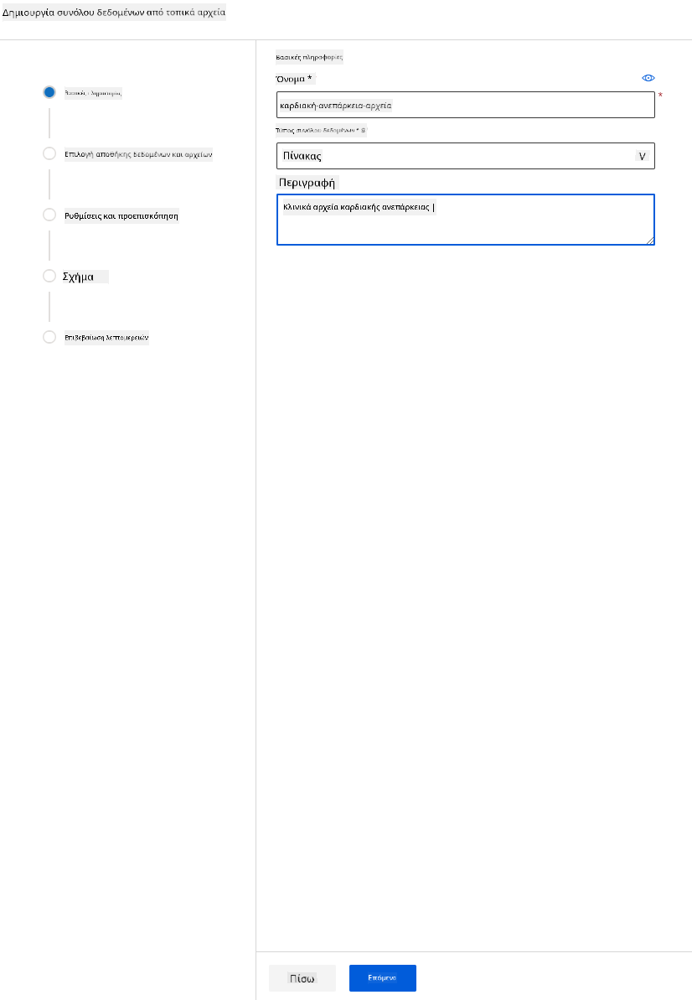

3. Στο Schema, αλλάξτε τον τύπο δεδομένων σε Boolean για τα εξής χαρακτηριστικά: anaemia, diabetes, high blood pressure, sex, smoking, και DEATH_EVENT. Κάντε κλικ στο Επόμενο και στη συνέχεια στο Create.

   

Υπέροχα! Τώρα που το σύνολο δεδομένων είναι στη θέση του και η συστοιχία υπολογισμού έχει δημιουργηθεί, μπορούμε να ξεκινήσουμε την εκπαίδευση του μοντέλου!

### 2.4 Εκπαίδευση με AutoML χωρίς κώδικα ή με ελάχιστο κώδικα

Η παραδοσιακή ανάπτυξη μοντέλων μηχανικής μάθησης απαιτεί πολλούς πόρους, σημαντική γνώση του τομέα και χρόνο για την παραγωγή και σύγκριση δεκάδων μοντέλων. 
Η αυτοματοποιημένη μηχανική μάθηση (AutoML) είναι η διαδικασία αυτοματοποίησης των χρονοβόρων, επαναληπτικών εργασιών ανάπτυξης μοντέλων μηχανικής μάθησης. Επιτρέπει στους επιστήμονες δεδομένων, αναλυτές και προγραμματιστές να δημιουργούν μοντέλα ML με μεγάλη κλίμακα, αποτελεσματικότητα και παραγωγικότητα, διατηρώντας παράλληλα την ποιότητα των μοντέλων. Μειώνει τον χρόνο που απαιτείται για την παραγωγή μοντέλων ML έτοιμων για παραγωγή, με μεγάλη ευκολία και αποτελεσματικότητα. [Μάθετε περισσότερα](https://docs.microsoft.com/azure/machine-learning/concept-automated-ml?WT.mc_id=academic-77958-bethanycheum&ocid=AID3041109)

1. Στον [χώρο εργασίας Azure ML](https://ml.azure.com/) που δημιουργήσαμε νωρίτερα, κάντε κλικ στο "Automated ML" στο αριστερό μενού και επιλέξτε το σύνολο δεδομένων που μόλις ανεβάσατε. Κάντε κλικ στο Επόμενο.

   

2. Εισάγετε ένα νέο όνομα πειράματος, τη στήλη στόχου (DEATH_EVENT) και τη συστοιχία υπολογισμού που δημιουργήσαμε. Κάντε κλικ στο Επόμενο.

   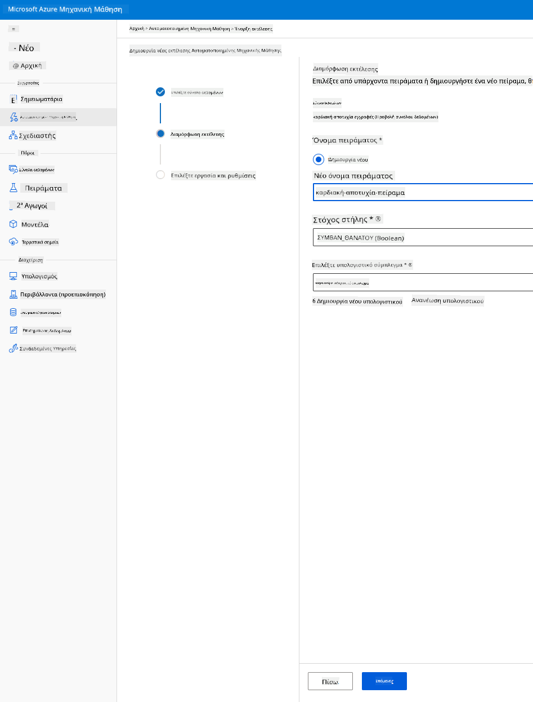

3. Επιλέξτε "Classification" και κάντε κλικ στο Finish. Αυτό το βήμα μπορεί να διαρκέσει από 30 λεπτά έως 1 ώρα, ανάλογα με το μέγεθος της συστοιχίας υπολογισμού.

   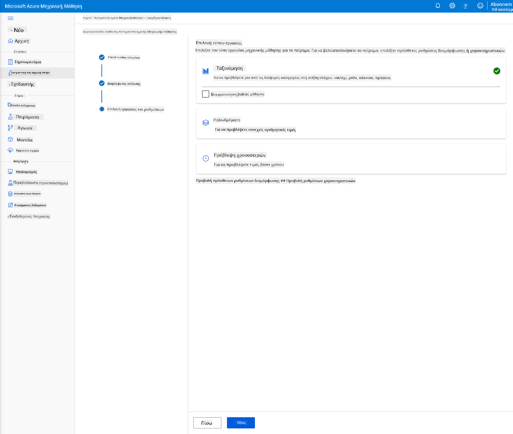

4. Μόλις ολοκληρωθεί η εκτέλεση, κάντε κλικ στην καρτέλα "Automated ML", κάντε κλικ στην εκτέλεσή σας και κάντε κλικ στον αλγόριθμο στην κάρτα "Best model summary".

   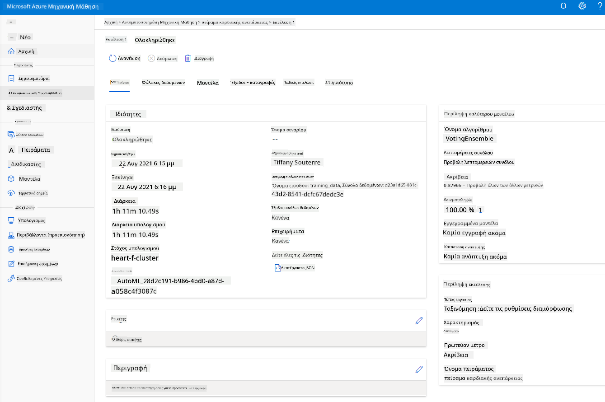

Εδώ μπορείτε να δείτε μια λεπτομερή περιγραφή του καλύτερου μοντέλου που δημιούργησε το AutoML. Μπορείτε επίσης να εξερευνήσετε άλλα μοντέλα που δημιουργήθηκαν στην καρτέλα Models. Αφιερώστε λίγα λεπτά για να εξερευνήσετε τα μοντέλα στην καρτέλα Explanations (preview). Αφού επιλέξετε το μοντέλο που θέλετε να χρησιμοποιήσετε (εδώ θα επιλέξουμε το καλύτερο μοντέλο που επέλεξε το AutoML), θα δούμε πώς μπορούμε να το αναπτύξουμε.

## 3. Ανάπτυξη μοντέλου χωρίς κώδικα ή με ελάχιστο κώδικα και κατανάλωση του τελικού σημείου
### 3.1 Ανάπτυξη μοντέλου

Η διεπαφή αυτοματοποιημένης μηχανικής μάθησης σας επιτρέπει να αναπτύξετε το καλύτερο μοντέλο ως υπηρεσία ιστού σε λίγα βήματα. Η ανάπτυξη είναι η ενσωμάτωση του μοντέλου ώστε να μπορεί να κάνει προβλέψεις βάσει νέων δεδομένων και να εντοπίζει πιθανούς τομείς ευκαιρίας. Για αυτό το έργο, η ανάπτυξη σε μια υπηρεσία ιστού σημαίνει ότι οι ιατρικές εφαρμογές θα μπορούν να καταναλώνουν το μοντέλο για να κάνουν ζωντανές προβλέψεις για τον κίνδυνο καρδιακής προσβολής των ασθενών τους.

Στην περιγραφή του καλύτερου μοντέλου, κάντε κλικ στο κουμπί "Deploy".

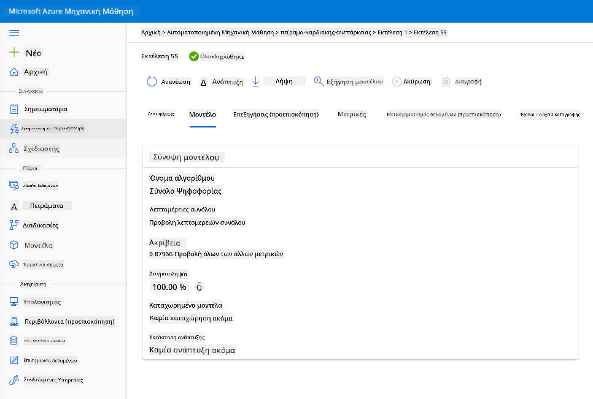

15. Δώστε του ένα όνομα, μια περιγραφή, τύπο υπολογισμού (Azure Container Instance), ενεργοποιήστε τον έλεγχο ταυτότητας και κάντε κλικ στο Deploy. Αυτό το βήμα μπορεί να διαρκέσει περίπου 20 λεπτά για να ολοκληρωθεί. Η διαδικασία ανάπτυξης περιλαμβάνει διάφορα βήματα, όπως την καταχώριση του μοντέλου, τη δημιουργία πόρων και τη διαμόρφωσή τους για την υπηρεσία ιστού. Εμφανίζεται ένα μήνυμα κατάστασης κάτω από την κατάσταση ανάπτυξης. Επιλέξτε Refresh περιοδικά για να ελέγξετε την κατάσταση ανάπτυξης. Είναι αναπτυγμένο και λειτουργεί όταν η κατάσταση είναι "Healthy".

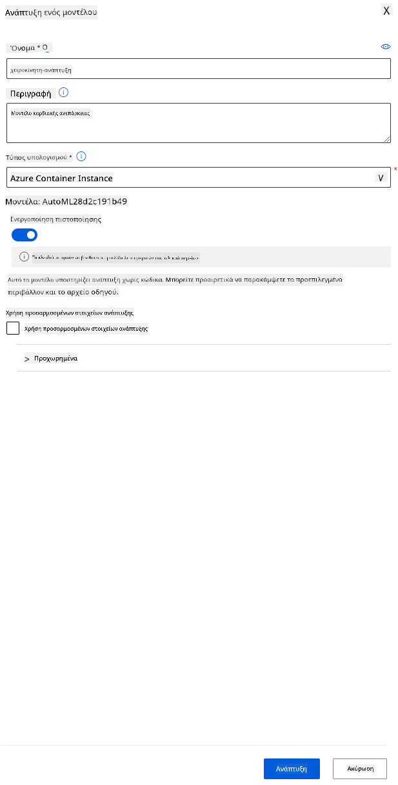

16. Μόλις αναπτυχθεί, κάντε κλικ στην καρτέλα Endpoint και κάντε κλικ στο τελικό σημείο που μόλις αναπτύξατε. Εδώ μπορείτε να βρείτε όλες τις λεπτομέρειες που πρέπει να γνωρίζετε για το τελικό σημείο.


Καταπληκτικά! Τώρα που έχουμε ένα μοντέλο αναπτυγμένο, μπορούμε να ξεκινήσουμε την κατανάλωση του τελικού σημείου.

### 3.2 Κατανάλωση τελικού σημείου

Κάντε κλικ στην καρτέλα "Consume". Εδώ μπορείτε να βρείτε το REST endpoint και ένα σενάριο Python στην επιλογή κατανάλωσης. Αφιερώστε λίγο χρόνο για να διαβάσετε τον κώδικα Python.

Αυτό το σενάριο μπορεί να εκτελεστεί απευθείας από τον τοπικό σας υπολογιστή και θα καταναλώσει το τελικό σημείο.

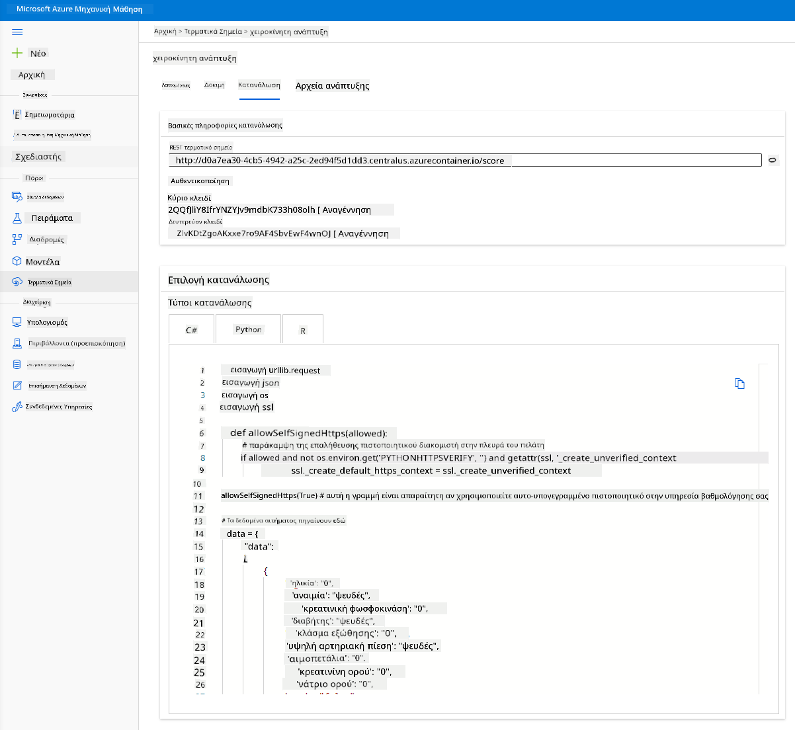

Αφιερώστε λίγο χρόνο για να ελέγξετε αυτές τις 2 γραμμές κώδικα:

```python
url = 'http://98e3715f-xxxx-xxxx-xxxx-9ec22d57b796.centralus.azurecontainer.io/score'
api_key = '' # Replace this with the API key for the web service
```
Η μεταβλητή `url` είναι το REST endpoint που βρίσκεται στην καρτέλα κατανάλωσης και η μεταβλητή `api_key` είναι το πρωτεύον κλειδί που βρίσκεται επίσης στην καρτέλα κατανάλωσης (μόνο στην περίπτωση που έχετε ενεργοποιήσει τον έλεγχο ταυτότητας). Έτσι το σενάριο μπορεί να καταναλώσει το τελικό σημείο.

18. Εκτελώντας το σενάριο, θα πρέπει να δείτε την ακόλουθη έξοδο:
    ```python
    b'"{\\"result\\": [true]}"'
    ```
Αυτό σημαίνει ότι η πρόβλεψη για καρδιακή ανεπάρκεια για τα δεδομένα που δόθηκαν είναι αληθής. Αυτό έχει νόημα γιατί αν κοιτάξετε πιο προσεκτικά τα δεδομένα που δημιουργούνται αυτόματα στο σενάριο, όλα είναι στο 0 και ψευδή από προεπιλογή. Μπορείτε να αλλάξετε τα δεδομένα με το ακόλουθο δείγμα εισόδου:

```python
data = {
    "data":
    [
        {
            'age': "0",
            'anaemia': "false",
            'creatinine_phosphokinase': "0",
            'diabetes': "false",
            'ejection_fraction': "0",
            'high_blood_pressure': "false",
            'platelets': "0",
            'serum_creatinine': "0",
            'serum_sodium': "0",
            'sex': "false",
            'smoking': "false",
            'time': "0",
        },
        {
            'age': "60",
            'anaemia': "false",
            'creatinine_phosphokinase': "500",
            'diabetes': "false",
            'ejection_fraction': "38",
            'high_blood_pressure': "false",
            'platelets': "260000",
            'serum_creatinine': "1.40",
            'serum_sodium': "137",
            'sex': "false",
            'smoking': "false",
            'time': "130",
        },
    ],
}
```
Το σενάριο θα πρέπει να επιστρέψει:
    ```python
    b'"{\\"result\\": [true, false]}"'
    ```

Συγχαρητήρια! Μόλις καταναλώσατε το μοντέλο που αναπτύχθηκε και το εκπαιδεύσατε στο Azure ML!

> **_ΣΗΜΕΙΩΣΗ:_** Μόλις ολοκληρώσετε το έργο, μην ξεχάσετε να διαγράψετε όλους τους πόρους.
## 🚀 Πρόκληση

Κοιτάξτε προσεκτικά τις εξηγήσεις και τις λεπτομέρειες του μοντέλου που δημιούργησε το AutoML για τα κορυφαία μοντέλα. Προσπαθήστε να κατανοήσετε γιατί το καλύτερο μοντέλο είναι καλύτερο από τα άλλα. Ποιοι αλγόριθμοι συγκρίθηκαν; Ποιες είναι οι διαφορές μεταξύ τους; Γιατί το καλύτερο μοντέλο αποδίδει καλύτερα σε αυτήν την περίπτωση;

## [Κουίζ μετά το μάθημα](https://ff-quizzes.netlify.app/en/ds/)

## Ανασκόπηση & Αυτομελέτη

Σε αυτό το μάθημα, μάθατε πώς να εκπαιδεύετε, να αναπτύσσετε και να καταναλώνετε ένα μοντέλο για την πρόβλεψη του κινδύνου καρδιακής ανεπάρκειας με τρόπο χωρίς κώδικα ή με ελάχιστο κώδικα στο cloud. Αν δεν το έχετε κάνει ακόμα, εμβαθύνετε στις εξηγήσεις του μοντέλου που δημιούργησε το AutoML για τα κορυφαία μοντέλα και προσπαθήστε να κατανοήσετε γιατί το καλύτερο μοντέλο είναι καλύτερο από τα άλλα.

Μπορείτε να εμβαθύνετε περαιτέρω στην αυτοματοποιημένη μηχανική μάθηση χωρίς κώδικα ή με ελάχιστο κώδικα διαβάζοντας αυτήν την [τεκμηρίωση](https://docs.microsoft.com/azure/machine-learning/tutorial-first-experiment-automated-ml?WT.mc_id=academic-77958-bethanycheum&ocid=AID3041109).

## Εργασία

[Έργο Επιστήμης Δεδομένων χωρίς κώδικα ή με ελάχιστο κώδικα στο Azure ML](assignment.md)

---

**Αποποίηση ευθύνης**:  
Αυτό το έγγραφο έχει μεταφραστεί χρησιμοποιώντας την υπηρεσία αυτόματης μετάφρασης [Co-op Translator](https://github.com/Azure/co-op-translator). Παρόλο που καταβάλλουμε προσπάθειες για ακρίβεια, παρακαλούμε να έχετε υπόψη ότι οι αυτόματες μεταφράσεις ενδέχεται να περιέχουν σφάλματα ή ανακρίβειες. Το πρωτότυπο έγγραφο στη μητρική του γλώσσα θα πρέπει να θεωρείται η αυθεντική πηγή. Για κρίσιμες πληροφορίες, συνιστάται επαγγελματική ανθρώπινη μετάφραση. Δεν φέρουμε ευθύνη για τυχόν παρεξηγήσεις ή εσφαλμένες ερμηνείες που προκύπτουν από τη χρήση αυτής της μετάφρασης.