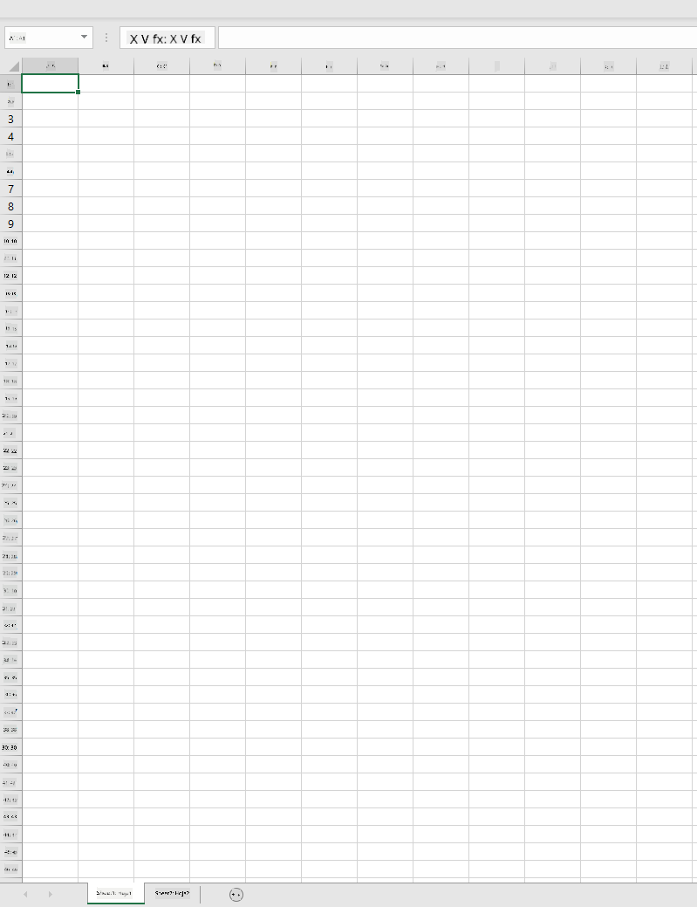
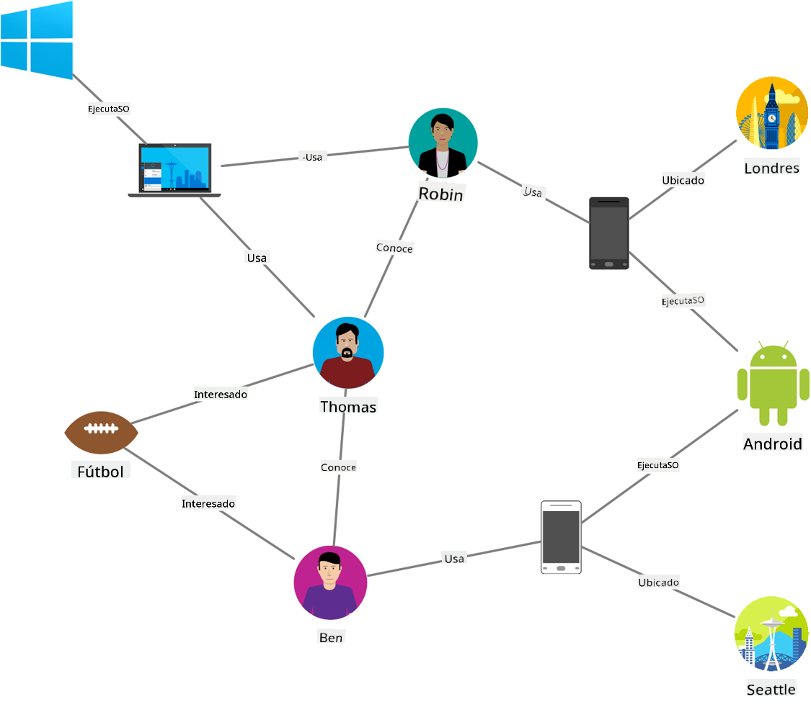
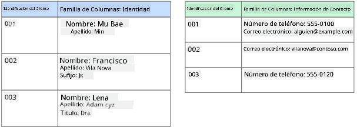
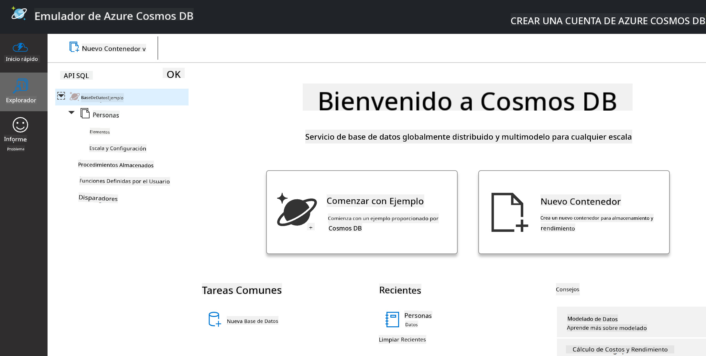
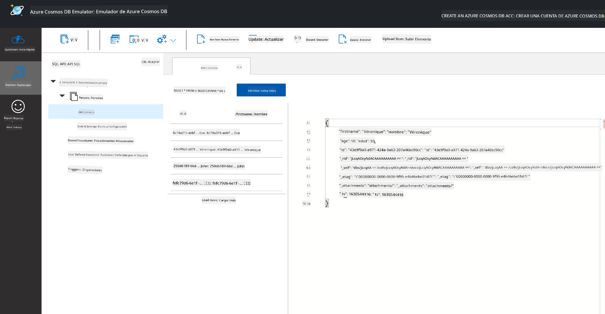
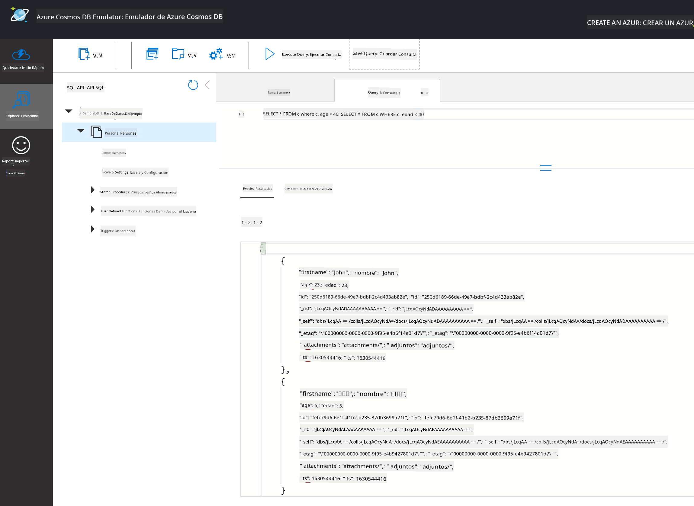

<!--
CO_OP_TRANSLATOR_METADATA:
{
  "original_hash": "54c5a1c74aecb69d2f9099300a4b7eea",
  "translation_date": "2025-09-04T13:52:54+00:00",
  "source_file": "2-Working-With-Data/06-non-relational/README.md",
  "language_code": "es"
}
-->
# Trabajando con Datos: Datos No Relacionales

| ](../../sketchnotes/06-NoSQL.png)|
|:---:|
|Trabajando con Datos NoSQL - _Sketchnote por [@nitya](https://twitter.com/nitya)_ |

## [Cuestionario Previo a la Clase](https://purple-hill-04aebfb03.1.azurestaticapps.net/quiz/10)

Los datos no están limitados a bases de datos relacionales. Esta lección se centra en datos no relacionales y cubrirá los conceptos básicos de hojas de cálculo y NoSQL.

## Hojas de Cálculo

Las hojas de cálculo son una forma popular de almacenar y explorar datos porque requieren menos trabajo para configurarse y comenzar. En esta lección aprenderás los componentes básicos de una hoja de cálculo, así como fórmulas y funciones. Los ejemplos se ilustrarán con Microsoft Excel, pero la mayoría de las partes y temas tendrán nombres y pasos similares en comparación con otros programas de hojas de cálculo.



Una hoja de cálculo es un archivo y será accesible en el sistema de archivos de una computadora, dispositivo o sistema de archivos basado en la nube. El software en sí puede ser basado en navegador o una aplicación que debe instalarse en una computadora o descargarse como una app. En Excel, estos archivos también se definen como **libros de trabajo** y esta terminología se usará durante el resto de esta lección.

Un libro de trabajo contiene una o más **hojas de trabajo**, donde cada hoja está etiquetada por pestañas. Dentro de una hoja de trabajo hay rectángulos llamados **celdas**, que contienen los datos reales. Una celda es la intersección de una fila y una columna, donde las columnas están etiquetadas con caracteres alfabéticos y las filas con números. Algunas hojas de cálculo contienen encabezados en las primeras filas para describir los datos en una celda.

Con estos elementos básicos de un libro de trabajo de Excel, usaremos un ejemplo de [Microsoft Templates](https://templates.office.com/) enfocado en un inventario para recorrer algunas partes adicionales de una hoja de cálculo.

### Gestionando un Inventario

El archivo de hoja de cálculo llamado "InventoryExample" es una hoja de cálculo formateada de artículos dentro de un inventario que contiene tres hojas de trabajo, donde las pestañas están etiquetadas como "Inventory List", "Inventory Pick List" y "Bin Lookup". La fila 4 de la hoja de trabajo Inventory List es el encabezado, que describe el valor de cada celda en la columna del encabezado.


Hay casos en los que una celda depende de los valores de otras celdas para generar su valor. La hoja de cálculo Inventory List realiza un seguimiento del costo de cada artículo en su inventario, pero ¿qué pasa si necesitamos saber el valor de todo el inventario? [**Fórmulas**](https://support.microsoft.com/en-us/office/overview-of-formulas-34519a4e-1e8d-4f4b-84d4-d642c4f63263) realizan acciones sobre los datos de las celdas y se utilizan para calcular el costo del inventario en este ejemplo. Esta hoja de cálculo utilizó una fórmula en la columna Inventory Value para calcular el valor de cada artículo multiplicando la cantidad bajo el encabezado QTY y su costo por las celdas bajo el encabezado COST. Al hacer doble clic o resaltar una celda, se mostrará la fórmula. Notarás que las fórmulas comienzan con un signo igual, seguido del cálculo u operación.


Podemos usar otra fórmula para sumar todos los valores de Inventory Value y obtener su valor total. Esto podría calcularse sumando cada celda para generar la suma, pero eso puede ser una tarea tediosa. Excel tiene [**funciones**](https://support.microsoft.com/en-us/office/sum-function-043e1c7d-7726-4e80-8f32-07b23e057f89), o fórmulas predefinidas para realizar cálculos en los valores de las celdas. Las funciones requieren argumentos, que son los valores necesarios para realizar estos cálculos. Cuando las funciones requieren más de un argumento, deben enumerarse en un orden particular o la función puede no calcular el valor correcto. Este ejemplo utiliza la función SUM y utiliza los valores de Inventory Value como argumento para generar el total que se encuentra en la fila 3, columna B (también conocida como B3).

## NoSQL

NoSQL es un término general para las diferentes formas de almacenar datos no relacionales y puede interpretarse como "no SQL", "no relacional" o "no solo SQL". Estos tipos de sistemas de bases de datos pueden clasificarse en 4 tipos.


> Fuente de [Blog de Michał Białecki](https://www.michalbialecki.com/2018/03/18/azure-cosmos-db-key-value-database-cloud/)

Las bases de datos [clave-valor](https://docs.microsoft.com/en-us/azure/architecture/data-guide/big-data/non-relational-data#keyvalue-data-stores) emparejan claves únicas, que son un identificador único asociado con un valor. Estos pares se almacenan utilizando una [tabla hash](https://www.hackerearth.com/practice/data-structures/hash-tables/basics-of-hash-tables/tutorial/) con una función de hash adecuada.


> Fuente de [Microsoft](https://docs.microsoft.com/en-us/azure/cosmos-db/graph/graph-introduction#graph-database-by-example)

Las bases de datos [de grafos](https://docs.microsoft.com/en-us/azure/architecture/data-guide/big-data/non-relational-data#graph-data-stores) describen relaciones en los datos y se representan como una colección de nodos y aristas. Un nodo representa una entidad, algo que existe en el mundo real como un estudiante o un estado de cuenta bancario. Las aristas representan la relación entre dos entidades. Cada nodo y arista tienen propiedades que proporcionan información adicional sobre cada uno.



Los [almacenes de datos columnar](https://docs.microsoft.com/en-us/azure/architecture/data-guide/big-data/non-relational-data#columnar-data-stores) organizan los datos en columnas y filas como una estructura de datos relacional, pero cada columna se divide en grupos llamados familias de columnas, donde todos los datos bajo una columna están relacionados y pueden ser recuperados y modificados en una sola unidad.

### Almacenes de Datos Documentales con Azure Cosmos DB

Los [almacenes de datos documentales](https://docs.microsoft.com/en-us/azure/architecture/data-guide/big-data/non-relational-data#document-data-stores) se basan en el concepto de un almacén de datos clave-valor y están compuestos por una serie de campos y objetos. Esta sección explorará las bases de datos documentales con el emulador de Cosmos DB.

Una base de datos de Cosmos DB se ajusta a la definición de "No Solo SQL", donde la base de datos documental de Cosmos DB utiliza SQL para consultar los datos. La [lección anterior](../05-relational-databases/README.md) sobre SQL cubre los conceptos básicos del lenguaje, y podremos aplicar algunas de las mismas consultas a una base de datos documental aquí. Usaremos el emulador de Cosmos DB, que nos permite crear y explorar una base de datos documental localmente en una computadora. Lee más sobre el emulador [aquí](https://docs.microsoft.com/en-us/azure/cosmos-db/local-emulator?tabs=ssl-netstd21).

Un documento es una colección de campos y valores de objetos, donde los campos describen lo que representa el valor del objeto. A continuación se muestra un ejemplo de un documento.

```json
{
    "firstname": "Eva",
    "age": 44,
    "id": "8c74a315-aebf-4a16-bb38-2430a9896ce5",
    "_rid": "bHwDAPQz8s0BAAAAAAAAAA==",
    "_self": "dbs/bHwDAA==/colls/bHwDAPQz8s0=/docs/bHwDAPQz8s0BAAAAAAAAAA==/",
    "_etag": "\"00000000-0000-0000-9f95-010a691e01d7\"",
    "_attachments": "attachments/",
    "_ts": 1630544034
}
```

Los campos de interés en este documento son: `firstname`, `id` y `age`. El resto de los campos con guiones bajos fueron generados por Cosmos DB.

#### Explorando Datos con el Emulador de Cosmos DB

Puedes descargar e instalar el emulador [para Windows aquí](https://aka.ms/cosmosdb-emulator). Consulta esta [documentación](https://docs.microsoft.com/en-us/azure/cosmos-db/local-emulator?tabs=ssl-netstd21#run-on-linux-macos) para opciones sobre cómo ejecutar el emulador en macOS y Linux.

El emulador lanza una ventana del navegador, donde la vista Explorer te permite explorar documentos.



Si estás siguiendo los pasos, haz clic en "Start with Sample" para generar una base de datos de ejemplo llamada SampleDB. Si expandes SampleDB haciendo clic en la flecha, encontrarás un contenedor llamado `Persons`. Un contenedor contiene una colección de elementos, que son los documentos dentro del contenedor. Puedes explorar los cuatro documentos individuales bajo `Items`.



#### Consultando Datos Documentales con el Emulador de Cosmos DB

También podemos consultar los datos de ejemplo haciendo clic en el botón de nueva consulta SQL (segundo botón desde la izquierda).

`SELECT * FROM c` devuelve todos los documentos en el contenedor. Agreguemos una cláusula WHERE y encontremos a todos los menores de 40 años.

`SELECT * FROM c where c.age < 40`



La consulta devuelve dos documentos, observa que el valor de edad para cada documento es menor a 40.

#### JSON y Documentos

Si estás familiarizado con JavaScript Object Notation (JSON), notarás que los documentos se parecen a JSON. Hay un archivo `PersonsData.json` en este directorio con más datos que puedes cargar en el contenedor Persons en el emulador mediante el botón `Upload Item`.

En la mayoría de los casos, las APIs que devuelven datos JSON pueden transferirse directamente y almacenarse en bases de datos documentales. A continuación se muestra otro documento, que representa tweets de la cuenta de Twitter de Microsoft que se recuperaron utilizando la API de Twitter y luego se insertaron en Cosmos DB.

```json
{
    "created_at": "2021-08-31T19:03:01.000Z",
    "id": "1432780985872142341",
    "text": "Blank slate. Like this tweet if you’ve ever painted in Microsoft Paint before. https://t.co/cFeEs8eOPK",
    "_rid": "dhAmAIUsA4oHAAAAAAAAAA==",
    "_self": "dbs/dhAmAA==/colls/dhAmAIUsA4o=/docs/dhAmAIUsA4oHAAAAAAAAAA==/",
    "_etag": "\"00000000-0000-0000-9f84-a0958ad901d7\"",
    "_attachments": "attachments/",
    "_ts": 1630537000
```

Los campos de interés en este documento son: `created_at`, `id` y `text`.

## 🚀 Desafío

Hay un archivo `TwitterData.json` que puedes cargar en la base de datos SampleDB. Se recomienda que lo agregues a un contenedor separado. Esto se puede hacer de la siguiente manera:

1. Haz clic en el botón de nuevo contenedor en la parte superior derecha.
1. Selecciona la base de datos existente (SampleDB) y crea un id de contenedor para el contenedor.
1. Establece la clave de partición en `/id`.
1. Haz clic en OK (puedes ignorar el resto de la información en esta vista ya que este es un conjunto de datos pequeño que se ejecuta localmente en tu máquina).
1. Abre tu nuevo contenedor y carga el archivo de datos de Twitter con el botón `Upload Item`.

Intenta ejecutar algunas consultas SELECT para encontrar los documentos que tienen la palabra Microsoft en el campo de texto. Pista: intenta usar la [palabra clave LIKE](https://docs.microsoft.com/en-us/azure/cosmos-db/sql/sql-query-keywords#using-like-with-the--wildcard-character).

## [Cuestionario Posterior a la Clase](https://ff-quizzes.netlify.app/en/ds/)

## Revisión y Estudio Personal

- Hay algunas características y formatos adicionales añadidos a esta hoja de cálculo que esta lección no cubre. Microsoft tiene una [gran biblioteca de documentación y videos](https://support.microsoft.com/excel) sobre Excel si estás interesado en aprender más.

- Esta documentación arquitectónica detalla las características de los diferentes tipos de datos no relacionales: [Datos No Relacionales y NoSQL](https://docs.microsoft.com/en-us/azure/architecture/data-guide/big-data/non-relational-data).

- Cosmos DB es una base de datos no relacional basada en la nube que también puede almacenar los diferentes tipos de NoSQL mencionados en esta lección. Aprende más sobre estos tipos en este [Módulo de Microsoft Learn sobre Cosmos DB](https://docs.microsoft.com/en-us/learn/paths/work-with-nosql-data-in-azure-cosmos-db/).

## Tarea

[Soda Profits](assignment.md)

---

**Descargo de responsabilidad**:  
Este documento ha sido traducido utilizando el servicio de traducción automática [Co-op Translator](https://github.com/Azure/co-op-translator). Si bien nos esforzamos por lograr precisión, tenga en cuenta que las traducciones automáticas pueden contener errores o imprecisiones. El documento original en su idioma nativo debe considerarse como la fuente autorizada. Para información crítica, se recomienda una traducción profesional realizada por humanos. No nos hacemos responsables de malentendidos o interpretaciones erróneas que puedan surgir del uso de esta traducción.