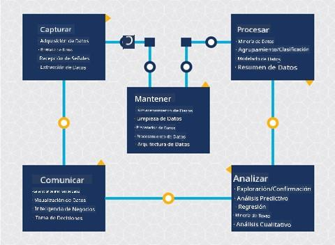
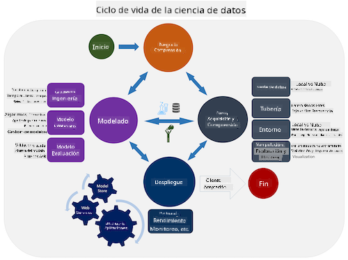
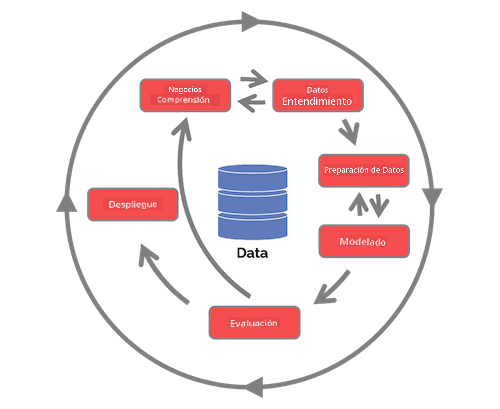

<!--
CO_OP_TRANSLATOR_METADATA:
{
  "original_hash": "79ca8a5a3135e94d2d43f56ba62d5205",
  "translation_date": "2025-09-04T13:57:00+00:00",
  "source_file": "4-Data-Science-Lifecycle/14-Introduction/README.md",
  "language_code": "es"
}
-->
# Introducción al Ciclo de Vida de la Ciencia de Datos

| ](../../sketchnotes/14-DataScience-Lifecycle.png)|
|:---:|
| Introducción al Ciclo de Vida de la Ciencia de Datos - _Sketchnote por [@nitya](https://twitter.com/nitya)_ |

## [Cuestionario previo a la lección](https://red-water-0103e7a0f.azurestaticapps.net/quiz/26)

Hasta este punto, probablemente te hayas dado cuenta de que la ciencia de datos es un proceso. Este proceso puede dividirse en 5 etapas:

- Captura
- Procesamiento
- Análisis
- Comunicación
- Mantenimiento

Esta lección se centra en 3 partes del ciclo de vida: captura, procesamiento y mantenimiento.

> Foto por [Berkeley School of Information](https://ischoolonline.berkeley.edu/data-science/what-is-data-science/)

## Captura

La primera etapa del ciclo de vida es muy importante, ya que las siguientes etapas dependen de ella. Es prácticamente dos etapas combinadas en una: adquirir los datos y definir el propósito y los problemas que necesitan ser abordados.  
Definir los objetivos del proyecto requerirá un contexto más profundo sobre el problema o la pregunta. Primero, necesitamos identificar y adquirir a quienes necesitan que su problema sea resuelto. Estos pueden ser partes interesadas en un negocio o patrocinadores del proyecto, quienes pueden ayudar a identificar quién o qué se beneficiará de este proyecto, así como qué necesitan y por qué lo necesitan. Un objetivo bien definido debe ser medible y cuantificable para definir un resultado aceptable.

Preguntas que un científico de datos podría hacer:
- ¿Se ha abordado este problema antes? ¿Qué se descubrió?
- ¿El propósito y el objetivo son entendidos por todos los involucrados?
- ¿Hay ambigüedad y cómo reducirla?
- ¿Cuáles son las limitaciones?
- ¿Cómo podría ser el resultado final?
- ¿Cuántos recursos (tiempo, personas, computación) están disponibles?

El siguiente paso es identificar, recopilar y finalmente explorar los datos necesarios para alcanzar estos objetivos definidos. En esta etapa de adquisición, los científicos de datos también deben evaluar la cantidad y calidad de los datos. Esto requiere cierta exploración de datos para confirmar que lo que se ha adquirido apoyará la consecución del resultado deseado.

Preguntas que un científico de datos podría hacer sobre los datos:
- ¿Qué datos ya están disponibles para mí?
- ¿Quién es el propietario de estos datos?
- ¿Cuáles son las preocupaciones de privacidad?
- ¿Tengo suficiente para resolver este problema?
- ¿Los datos tienen una calidad aceptable para este problema?
- Si descubro información adicional a través de estos datos, ¿deberíamos considerar cambiar o redefinir los objetivos?

## Procesamiento

La etapa de procesamiento del ciclo de vida se centra en descubrir patrones en los datos, así como en la modelización. Algunas técnicas utilizadas en esta etapa requieren métodos estadísticos para descubrir los patrones. Por lo general, esta sería una tarea tediosa para un humano con un conjunto de datos grande, por lo que se depende de los computadores para realizar el trabajo pesado y acelerar el proceso. Esta etapa también es donde la ciencia de datos y el aprendizaje automático se intersectan. Como aprendiste en la primera lección, el aprendizaje automático es el proceso de construir modelos para comprender los datos. Los modelos son una representación de la relación entre las variables en los datos que ayudan a predecir resultados.

Las técnicas comunes utilizadas en esta etapa se cubren en el currículo de ML para Principiantes. Sigue los enlaces para aprender más sobre ellas:

- [Clasificación](https://github.com/microsoft/ML-For-Beginners/tree/main/4-Classification): Organizar datos en categorías para un uso más eficiente.
- [Agrupamiento](https://github.com/microsoft/ML-For-Beginners/tree/main/5-Clustering): Agrupar datos en grupos similares.
- [Regresión](https://github.com/microsoft/ML-For-Beginners/tree/main/2-Regression): Determinar las relaciones entre variables para predecir o pronosticar valores.

## Mantenimiento

En el diagrama del ciclo de vida, habrás notado que el mantenimiento se encuentra entre la captura y el procesamiento. El mantenimiento es un proceso continuo de gestión, almacenamiento y seguridad de los datos a lo largo del proceso de un proyecto y debe ser considerado durante toda la duración del proyecto.

### Almacenamiento de datos

Las consideraciones sobre cómo y dónde se almacenan los datos pueden influir en el costo de su almacenamiento, así como en el rendimiento de la velocidad con la que se pueden acceder. Decisiones como estas probablemente no sean tomadas únicamente por un científico de datos, pero pueden encontrarse tomando decisiones sobre cómo trabajar con los datos según cómo estén almacenados.

Aquí hay algunos aspectos de los sistemas modernos de almacenamiento de datos que pueden afectar estas decisiones:

**En las instalaciones vs fuera de las instalaciones vs nube pública o privada**

En las instalaciones se refiere a gestionar los datos en tu propio equipo, como poseer un servidor con discos duros que almacenan los datos, mientras que fuera de las instalaciones depende de equipos que no posees, como un centro de datos. La nube pública es una opción popular para almacenar datos que no requiere conocimiento de cómo o dónde exactamente se almacenan los datos, donde público se refiere a una infraestructura subyacente unificada que es compartida por todos los que usan la nube. Algunas organizaciones tienen políticas estrictas de seguridad que requieren acceso completo al equipo donde se alojan los datos y dependerán de una nube privada que proporciona sus propios servicios en la nube. Aprenderás más sobre datos en la nube en [lecciones posteriores](https://github.com/microsoft/Data-Science-For-Beginners/tree/main/5-Data-Science-In-Cloud).

**Datos fríos vs datos calientes**

Cuando entrenes tus modelos, puede que necesites más datos de entrenamiento. Si estás satisfecho con tu modelo, llegarán más datos para que el modelo cumpla su propósito. En cualquier caso, el costo de almacenar y acceder a los datos aumentará a medida que acumules más. Separar los datos que se usan raramente, conocidos como datos fríos, de los datos que se acceden frecuentemente, conocidos como datos calientes, puede ser una opción más económica de almacenamiento de datos a través de servicios de hardware o software. Si los datos fríos necesitan ser accedidos, puede tomar un poco más de tiempo recuperarlos en comparación con los datos calientes.

### Gestión de datos

A medida que trabajes con datos, puedes descubrir que algunos de ellos necesitan ser limpiados utilizando algunas de las técnicas cubiertas en la lección enfocada en [preparación de datos](https://github.com/microsoft/Data-Science-For-Beginners/tree/main/2-Working-With-Data/08-data-preparation) para construir modelos precisos. Cuando lleguen nuevos datos, necesitarán algunas de las mismas aplicaciones para mantener la consistencia en la calidad. Algunos proyectos implicarán el uso de una herramienta automatizada para limpieza, agregación y compresión antes de que los datos se muevan a su ubicación final. Azure Data Factory es un ejemplo de una de estas herramientas.

### Seguridad de los datos

Uno de los principales objetivos de la seguridad de los datos es garantizar que quienes trabajan con ellos tengan control sobre lo que se recopila y en qué contexto se utiliza. Mantener los datos seguros implica limitar el acceso solo a quienes lo necesitan, cumplir con las leyes y regulaciones locales, así como mantener estándares éticos, como se cubre en la [lección de ética](https://github.com/microsoft/Data-Science-For-Beginners/tree/main/1-Introduction/02-ethics).

Aquí hay algunas cosas que un equipo puede hacer teniendo en cuenta la seguridad:
- Confirmar que todos los datos están encriptados
- Proporcionar a los clientes información sobre cómo se utilizan sus datos
- Eliminar el acceso a los datos de quienes han dejado el proyecto
- Permitir que solo ciertos miembros del proyecto alteren los datos

## 🚀 Desafío

Existen muchas versiones del Ciclo de Vida de la Ciencia de Datos, donde cada paso puede tener diferentes nombres y número de etapas, pero contendrán los mismos procesos mencionados en esta lección.

Explora el [Ciclo de Vida del Proceso de Ciencia de Datos en Equipo](https://docs.microsoft.com/en-us/azure/architecture/data-science-process/lifecycle) y el [Proceso estándar de la industria para minería de datos](https://www.datascience-pm.com/crisp-dm-2/). Nombra 3 similitudes y diferencias entre ambos.

|Proceso de Ciencia de Datos en Equipo (TDSP)|Proceso estándar de la industria para minería de datos (CRISP-DM)|
|--|--|
| |  |
| Imagen por [Microsoft](https://docs.microsoft.comazure/architecture/data-science-process/lifecycle) | Imagen por [Data Science Process Alliance](https://www.datascience-pm.com/crisp-dm-2/) |

## [Cuestionario posterior a la lección](https://ff-quizzes.netlify.app/en/ds/)

## Revisión y autoestudio

Aplicar el Ciclo de Vida de la Ciencia de Datos implica múltiples roles y tareas, donde algunos pueden centrarse en partes particulares de cada etapa. El Proceso de Ciencia de Datos en Equipo proporciona algunos recursos que explican los tipos de roles y tareas que alguien puede tener en un proyecto.

* [Roles y tareas del Proceso de Ciencia de Datos en Equipo](https://docs.microsoft.com/en-us/azure/architecture/data-science-process/roles-tasks)
* [Ejecutar tareas de ciencia de datos: exploración, modelización y despliegue](https://docs.microsoft.com/en-us/azure/architecture/data-science-process/execute-data-science-tasks)

## Tarea

[Evaluar un conjunto de datos](assignment.md)

---

**Descargo de responsabilidad**:  
Este documento ha sido traducido utilizando el servicio de traducción automática [Co-op Translator](https://github.com/Azure/co-op-translator). Si bien nos esforzamos por lograr precisión, tenga en cuenta que las traducciones automáticas pueden contener errores o imprecisiones. El documento original en su idioma nativo debe considerarse como la fuente autorizada. Para información crítica, se recomienda una traducción profesional realizada por humanos. No nos hacemos responsables de malentendidos o interpretaciones erróneas que puedan surgir del uso de esta traducción.