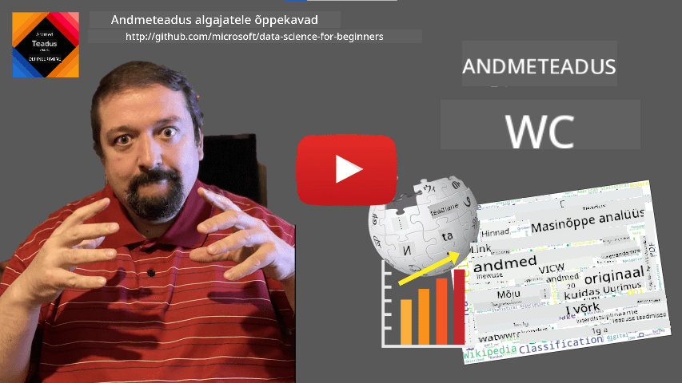
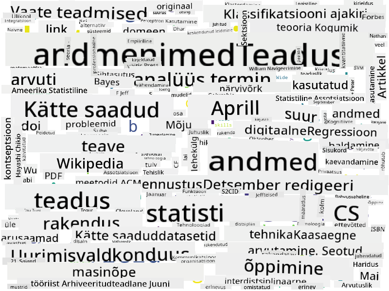

<!--
CO_OP_TRANSLATOR_METADATA:
{
  "original_hash": "a76ab694b1534fa57981311975660bfe",
  "translation_date": "2025-10-11T15:33:20+00:00",
  "source_file": "1-Introduction/01-defining-data-science/README.md",
  "language_code": "et"
}
-->
# Andmeteaduse määratlemine

|  ](../../sketchnotes/01-Definitions.png) |
| :----------------------------------------------------------------------------------------------------------: |
|              Andmeteaduse määratlemine - _Sketchnote autorilt [@nitya](https://twitter.com/nitya)_            |

---

## [Eelloengu viktoriin](https://ff-quizzes.netlify.app/en/ds/quiz/0)

## Mis on andmed?
Meie igapäevaelus ümbritsevad meid pidevalt andmed. Tekst, mida sa praegu loed, on andmed. Sõprade telefoninumbrite loetelu sinu nutitelefonis on andmed, samuti kellaaeg, mis on näidatud sinu kellal. Inimestena töötleme andmeid loomulikult, näiteks raha lugedes või kirju kirjutades.

Kuid andmed muutusid palju olulisemaks arvutite loomisega. Arvutite peamine ülesanne on teha arvutusi, kuid nad vajavad selleks andmeid. Seega peame mõistma, kuidas arvutid andmeid salvestavad ja töötlevad.

Interneti tekkimisega suurenes arvutite roll andmete käsitlemise seadmetena. Kui järele mõelda, siis kasutame arvuteid üha enam andmete töötlemiseks ja suhtlemiseks, mitte niivõrd arvutuste tegemiseks. Kui kirjutame sõbrale e-kirja või otsime internetist teavet, siis loome, salvestame, edastame ja manipuleerime andmetega.
> Kas sa mäletad, millal viimati kasutasid arvutit tegelikult millegi arvutamiseks?

## Mis on andmeteadus?

[Wikipedia](https://en.wikipedia.org/wiki/Data_science) määratleb **andmeteaduse** kui *teadusvaldkonna, mis kasutab teaduslikke meetodeid, et saada teadmisi ja arusaamu struktureeritud ja struktureerimata andmetest ning rakendada neid teadmisi ja praktilisi järeldusi erinevates rakendusvaldkondades*.

See määratlus toob esile järgmised olulised aspektid andmeteaduses:

* Andmeteaduse peamine eesmärk on **teadmiste hankimine** andmetest, teisisõnu - **andmete mõistmine**, varjatud seoste leidmine ja **mudeli** loomine.
* Andmeteadus kasutab **teaduslikke meetodeid**, nagu tõenäosus ja statistika. Tegelikult, kui termin *andmeteadus* esmakordselt kasutusele võeti, väitsid mõned, et see on lihtsalt uus moodne nimi statistikale. Tänapäeval on selge, et valdkond on palju laiem.
* Saadud teadmisi tuleks rakendada, et luua **praktilisi järeldusi**, st rakendatavaid teadmisi, mida saab kasutada reaalsetes ärisituatsioonides.
* Me peaksime suutma töötada nii **struktureeritud** kui ka **struktureerimata** andmetega. Räägime hiljem kursuse käigus erinevatest andmetüüpidest.
* **Rakendusvaldkond** on oluline mõiste, ja andmeteadlased vajavad sageli vähemalt mingil määral teadmisi probleemivaldkonnas, näiteks: rahandus, meditsiin, turundus jne.

> Teine oluline aspekt andmeteaduses on see, et see uurib, kuidas andmeid saab koguda, salvestada ja töödelda arvutite abil. Kuigi statistika annab meile matemaatilised alused, rakendab andmeteadus matemaatilisi kontseptsioone, et tegelikult andmetest järeldusi teha.

Üks viis (omistatud [Jim Grayle](https://en.wikipedia.org/wiki/Jim_Gray_(computer_scientist))) andmeteaduse vaatamiseks on pidada seda eraldi teadusparadigmaks:
* **Empiiriline**, kus tuginetakse peamiselt vaatluste ja katsete tulemustele
* **Teoreetiline**, kus uued kontseptsioonid tekivad olemasolevatest teadmistest
* **Arvutuslik**, kus avastatakse uusi põhimõtteid arvutuseksperimentide põhjal
* **Andmepõhine**, mis põhineb andmetes olevate seoste ja mustrite avastamisel  

## Seotud valdkonnad

Kuna andmed on kõikjal, on ka andmeteadus lai valdkond, mis puudutab paljusid teisi distsipliine.

<dl>
<dt>Andmebaasid</dt>
<dd>
Oluline on **kuidas andmeid salvestada**, st kuidas neid struktureerida nii, et töötlemine oleks kiirem. On erinevat tüüpi andmebaase, mis salvestavad struktureeritud ja struktureerimata andmeid, mida <a href="../../2-Working-With-Data/README.md">käsitleme oma kursusel</a>.
</dd>
<dt>Suured andmed</dt>
<dd>
Sageli peame salvestama ja töötlema väga suuri andmehulkasid suhteliselt lihtsa struktuuriga. Selleks on olemas spetsiaalsed lähenemisviisid ja tööriistad, mis võimaldavad andmeid hajutatult salvestada arvutite klastris ja neid tõhusalt töödelda.
</dd>
<dt>Masinõpe</dt>
<dd>
Üks viis andmete mõistmiseks on **luua mudel**, mis suudab ennustada soovitud tulemust. Mudelite loomist andmetest nimetatakse **masinõppeks**. Võid tutvuda meie <a href="https://aka.ms/ml-beginners">Masinõppe algajatele</a> õppekavaga, et sellest rohkem teada saada.
</dd>
<dt>Tehisintellekt</dt>
<dd>
Masinõppe valdkond, mida tuntakse tehisintellektina (AI), tugineb samuti andmetele ja hõlmab keerukate mudelite loomist, mis jäljendavad inimeste mõtteprotsesse. AI meetodid võimaldavad sageli struktureerimata andmeid (nt loomulik keel) muuta struktureeritud järeldusteks.
</dd>
<dt>Visualiseerimine</dt>
<dd>
Suured andmehulgad on inimesele arusaamatud, kuid kui loome kasulikke visualiseeringuid, saame andmetest paremini aru ja teha järeldusi. Seega on oluline teada mitmeid viise teabe visualiseerimiseks - midagi, mida käsitleme <a href="../../3-Data-Visualization/README.md">kursuse 3. osas</a>. Seotud valdkonnad hõlmavad ka **infograafikat** ja **inimese-arvuti interaktsiooni** üldiselt.
</dd>
</dl>

## Andmetüübid

Nagu juba mainitud, on andmed kõikjal. Me lihtsalt peame need õigesti kinni püüdma! Kasulik on eristada **struktureeritud** ja **struktureerimata** andmeid. Esimesed on tavaliselt esitatud hästi struktureeritud kujul, sageli tabelina või tabelite kogumina, samas kui viimased on lihtsalt failide kogum. Mõnikord räägitakse ka **poolstruktureeritud** andmetest, millel on mingi struktuur, mis võib oluliselt varieeruda.

| Struktureeritud                                                             | Poolstruktureeritud                                                                           | Struktureerimata                        |
| ---------------------------------------------------------------------------- | -------------------------------------------------------------------------------------------- | --------------------------------------- |
| Inimeste nimekiri koos nende telefoninumbritega                             | Wikipedia leheküljed koos linkidega                                                          | Encyclopedia Britannica tekst           |
| Temperatuur kõigis hoone ruumides iga minut viimase 20 aasta jooksul         | Teadusartiklite kogum JSON-formaadis koos autorite, avaldamiskuupäeva ja abstraktiga         | Ettevõtte dokumentide failikogu         |
| Andmed hoonesse sisenevate inimeste vanuse ja soo kohta                      | Interneti leheküljed                                                                         | Toores videovoog turvakaamerast         |

## Kust saada andmeid

Andmeid on võimalik saada paljudest allikatest, ja kõiki neid oleks võimatu loetleda! Siiski mainime mõningaid tüüpilisi kohti, kust andmeid saab:

* **Struktureeritud**
  - **Asjade internet** (IoT), sealhulgas andmed erinevatest sensoritest, nagu temperatuuri- või rõhuandurid, pakub palju kasulikke andmeid. Näiteks, kui kontorihoone on varustatud IoT sensoritega, saame automaatselt kontrollida kütet ja valgustust, et minimeerida kulusid.
  - **Küsitlused**, mida palume kasutajatel täita pärast ostu või veebisaidi külastamist.
  - **Käitumise analüüs** võib näiteks aidata meil mõista, kui sügavale kasutaja veebisaidil läheb ja mis on tüüpiline põhjus saidilt lahkumiseks.
* **Struktureerimata**
  - **Tekstid** võivad olla rikkalikud allikad järelduste jaoks, näiteks üldine **meeleolu skoor** või märksõnade ja semantilise tähenduse eraldamine.
  - **Pildid** või **videod**. Videoturvakaamera salvestust saab kasutada liikluse hindamiseks teel ja inimeste teavitamiseks võimalikest ummikutest.
  - Veebiserveri **logid** võivad aidata mõista, milliseid lehti meie saidil kõige sagedamini külastatakse ja kui kaua.
* Poolstruktureeritud
  - **Sotsiaalvõrgustike** graafikud võivad olla suurepärased andmeallikad kasutajate isiksuste ja potentsiaalse tõhususe kohta teabe levitamisel.
  - Kui meil on peo fotode kogum, saame proovida eraldada **grupidünaamika** andmeid, luues graafiku inimestest, kes teevad üksteisega pilte.

Teades erinevaid võimalikke andmeallikaid, võid proovida mõelda erinevatele stsenaariumidele, kus andmeteaduse tehnikaid saab rakendada olukorra paremaks mõistmiseks ja äriprotsesside parandamiseks.

## Mida saab andmetega teha

Andmeteaduses keskendume järgmistele andmete teekonna etappidele:

<dl>
<dt>1) Andmete hankimine</dt>
<dd>
Esimene samm on andmete kogumine. Kuigi paljudel juhtudel võib see olla lihtne protsess, näiteks andmed, mis jõuavad andmebaasi veebirakendusest, vajame mõnikord spetsiaalseid tehnikaid. Näiteks IoT sensorite andmed võivad olla ülekaalukad, ja hea tava on kasutada puhverduspunkte, nagu IoT Hub, et koguda kõik andmed enne edasist töötlemist.
</dd>
<dt>2) Andmete salvestamine</dt>
<dd>
Andmete salvestamine võib olla keeruline, eriti kui räägime suurtest andmehulkadest. Otsustades, kuidas andmeid salvestada, on mõistlik ette näha, kuidas soovid tulevikus andmeid pärida. Andmeid saab salvestada mitmel viisil:
<ul>
<li>Relatsiooniline andmebaas salvestab tabelite kogumi ja kasutab spetsiaalset keelt nimega SQL nende pärimiseks. Tavaliselt on tabelid organiseeritud erinevatesse gruppidesse, mida nimetatakse skeemideks. Paljudel juhtudel peame andmed algsest vormist skeemile sobivaks muutma.</li>
<li><a href="https://en.wikipedia.org/wiki/NoSQL">NoSQL</a> andmebaas, nagu <a href="https://azure.microsoft.com/services/cosmos-db/?WT.mc_id=academic-77958-bethanycheum">CosmosDB</a>, ei kehtesta andmetele skeeme ja võimaldab salvestada keerukamaid andmeid, näiteks hierarhilisi JSON-dokumente või graafikuid. Kuid NoSQL andmebaasidel puuduvad rikkalikud päringuvõimalused, mida SQL pakub, ja nad ei saa tagada viiteintegriteeti, st reegleid, kuidas andmed tabelites struktureeritud on ja tabelite vahelisi seoseid.</li>
<li><a href="https://en.wikipedia.org/wiki/Data_lake">Andmejärv</a> salvestab suuri andmekogumeid toorstruktureerimata kujul. Andmejärvi kasutatakse sageli suurte andmete puhul, kus kõik andmed ei mahu ühele masinale ja neid tuleb salvestada ja töödelda serverite klastris. <a href="https://en.wikipedia.org/wiki/Apache_Parquet">Parquet</a> on andmeformaat, mida sageli kasutatakse suurte andmetega.</li> 
</ul>
</dd>
<dt>3) Andmete töötlemine</dt>
<dd>
See on andmete teekonna kõige põnevam osa, mis hõlmab andmete teisendamist algsest vormist vormi, mida saab kasutada visualiseerimiseks või mudeli treenimiseks. Kui töötleme struktureerimata andmeid, nagu tekst või pildid, võime vajada AI tehnikaid, et eraldada **omadusi** andmetest, muutes need struktureeritud vormiks.
</dd>
<dt>4) Visualiseerimine / Inimeste järeldused</dt>
<dd>
Sageli, et andmetest aru saada, peame neid visualiseerima. Omades mitmeid erinevaid visualiseerimistehnikaid oma tööriistakastis, saame leida õige vaate, et teha järeldusi. Sageli peab andmeteadlane "mängima andmetega", visualiseerides neid mitu korda ja otsides seoseid. Samuti võime kasutada statistilisi tehnikaid, et testida hüpoteese või tõestada korrelatsiooni erinevate andmeosade vahel.
</dd>
<dt>5) Ennustava mudeli treenimine</dt>
<dd>
Kuna andmeteaduse lõppeesmärk on teha otsuseid andmete põhjal, võime kasutada <a href="http://github.com/microsoft/ml-for-beginners">masinõppe</a> tehnikaid, et luua ennustav mudel. Seda mudelit saame kasutada ennustuste tegemiseks uute sarnase struktuuriga andmekogumite põhjal.
</dd>
</dl>

Muidugi, sõltuvalt tegelikest andmetest, võivad mõned sammud puududa (nt kui andmed on juba andmebaasis või kui mudeli treenimist pole vaja), või mõned sammud võivad olla mitu korda korduvad (näiteks andmete töötlemine).

## Digitaliseerimine ja digitaalne transformatsioon

Viimase kümnendi jooksul on paljud ettevõtted hakanud mõistma andmete tähtsust äriliste otsuste tegemisel. Andmeteaduse põhimõtete rakendamiseks ettevõtte juhtimisel tuleb esmalt koguda andmeid, st tõlkida äriprotsessid digitaalsesse vormi. Seda nimetatakse **digitaliseerimiseks**. Andmeteaduse tehnikate rakendamine nendele andmetele otsuste suunamiseks võib viia märkimisväärse tootlikkuse kasvuni (või isegi ärilise pöördeni), mida nimetatakse **digitaalseks transformatsiooniks**.

Vaatame ühte näidet. Oletame, et meil on andmeteaduse kursus (nagu see), mida pakume veebis tudengitele, ja tahame kasutada andmeteadust selle parandamiseks. Kuidas seda teha?

Võime alustada küsimusega "Mida saab digitaliseerida?" Lihtsaim viis oleks mõõta aega, mis kulub igal tudengil iga mooduli läbimiseks, ja mõõta omandatud teadmisi, andes iga mooduli lõpus valikvastustega testi. Arvutades keskmise läbimisaja kõigi tudengite seas, saame teada, millised moodulid põhjustavad tudengitele kõige rohkem raskusi, ja töötada nende lihtsustamise kallal.
> Võib väita, et see lähenemine pole ideaalne, kuna moodulid võivad olla erineva pikkusega. Tõenäoliselt oleks õiglasem jagada aeg mooduli pikkusega (tähemärkide arvus) ja võrrelda neid väärtusi.

Kui hakkame analüüsima valikvastustega testide tulemusi, saame proovida kindlaks teha, milliseid kontseptsioone õpilastel on raske mõista, ja kasutada seda teavet sisu parandamiseks. Selleks peame kujundama testid nii, et iga küsimus seostuks kindla kontseptsiooni või teadmiste osaga.

Kui tahame minna veelgi keerukamaks, saame joonistada graafiku, kus on näidatud iga mooduli läbimiseks kulunud aeg vastavalt õpilaste vanusekategooriale. Võime avastada, et mõne vanusekategooria puhul võtab mooduli läbimine ebamõistlikult kaua aega või et õpilased loobuvad enne selle lõpetamist. See võib aidata meil anda mooduli jaoks vanusesoovitusi ja vähendada inimeste rahulolematust valede ootuste tõttu.

## 🚀 Väljakutse

Selles väljakutses proovime leida andmeteadusega seotud kontseptsioone, uurides tekste. Võtame Wikipedia artikli andmeteaduse kohta, laadime alla ja töötleme teksti ning loome sõnapilve, mis näeb välja selline:

Külastage [`notebook.ipynb`](../../../../1-Introduction/01-defining-data-science/notebook.ipynb ':ignore'), et koodi läbi vaadata. Samuti saate koodi käivitada ja näha, kuidas see teostab kõiki andmetransformatsioone reaalajas.

> Kui te ei tea, kuidas Jupyter Notebookis koodi käivitada, vaadake [seda artiklit](https://soshnikov.com/education/how-to-execute-notebooks-from-github/).

## [Loengu järgne viktoriin](https://ff-quizzes.netlify.app/en/ds/quiz/1)

## Ülesanded

* **Ülesanne 1**: Muutke ülaltoodud koodi, et leida seotud kontseptsioone **Big Data** ja **Machine Learning** valdkondade jaoks.
* **Ülesanne 2**: [Mõelge andmeteaduse stsenaariumidele](assignment.md)

## Autorid

Selle õppetunni on koostanud ♥️ [Dmitry Soshnikov](http://soshnikov.com)

---

**Lahtiütlus**:  
See dokument on tõlgitud AI tõlketeenuse [Co-op Translator](https://github.com/Azure/co-op-translator) abil. Kuigi püüame tagada täpsust, palume arvestada, et automaatsed tõlked võivad sisaldada vigu või ebatäpsusi. Algne dokument selle algses keeles tuleks pidada autoriteetseks allikaks. Olulise teabe puhul soovitame kasutada professionaalset inimtõlget. Me ei vastuta selle tõlke kasutamisest tulenevate arusaamatuste või valesti tõlgenduste eest.