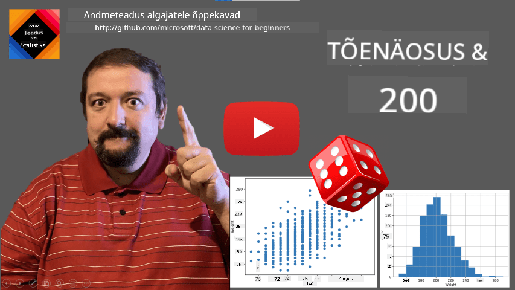
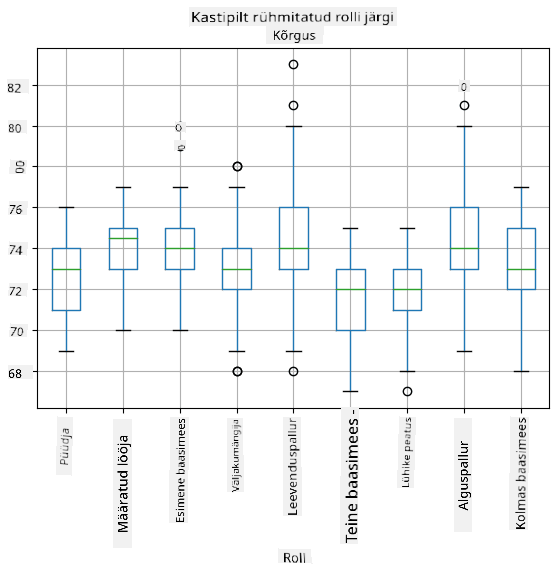
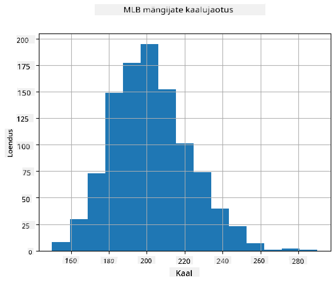
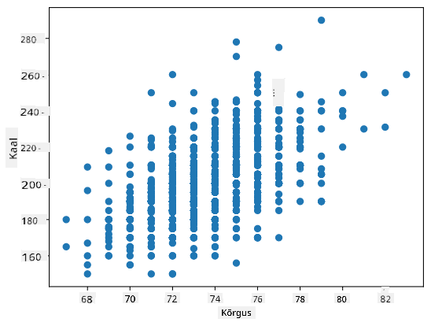

<!--
CO_OP_TRANSLATOR_METADATA:
{
  "original_hash": "ce95884566a74db72572cd51f0cb25ad",
  "translation_date": "2025-10-11T15:43:30+00:00",
  "source_file": "1-Introduction/04-stats-and-probability/README.md",
  "language_code": "et"
}
-->
# Lühike sissejuhatus statistikasse ja tõenäosusteooriasse

| ](../../sketchnotes/04-Statistics-Probability.png)|
|:---:|
| Statistika ja tõenäosusteooria - _Sketchnote autorilt [@nitya](https://twitter.com/nitya)_ |

Statistika ja tõenäosusteooria on kaks tihedalt seotud matemaatika valdkonda, mis on väga olulised andmeteaduse jaoks. Andmetega on võimalik töötada ka ilma sügavate matemaatiliste teadmisteta, kuid siiski on parem omada vähemalt mõningaid põhiteadmisi. Siin anname lühikese sissejuhatuse, mis aitab teil alustada.

[](https://youtu.be/Z5Zy85g4Yjw)


## [Loengu-eelne viktoriin](https://ff-quizzes.netlify.app/en/ds/quiz/6)

## Tõenäosus ja juhuslikud muutujad

**Tõenäosus** on arv vahemikus 0 kuni 1, mis väljendab, kui tõenäoline on mingi **sündmus**. See määratletakse positiivsete tulemuste arvuna (mis viivad sündmuseni), jagatuna kõigi tulemuste arvuga, eeldades, et kõik tulemused on võrdselt tõenäolised. Näiteks, kui viskame täringut, siis tõenäosus saada paarisarv on 3/6 = 0.5.

Sündmustest rääkides kasutame **juhuslikke muutujaid**. Näiteks juhuslik muutuja, mis esindab täringuviske tulemust, võib võtta väärtusi 1 kuni 6. Arvude kogumit 1-st 6-ni nimetatakse **valimruumiks**. Me saame rääkida juhusliku muutuja tõenäosusest võtta teatud väärtus, näiteks P(X=3)=1/6.

Eelmises näites olevat juhuslikku muutujat nimetatakse **diskreetseks**, kuna selle valimruum on loendatav, st seal on eraldi väärtused, mida saab loendada. On ka juhtumeid, kus valimruum on reaalarvude vahemik või kogu reaalarvude hulk. Selliseid muutujaid nimetatakse **pidevateks**. Heaks näiteks on bussi saabumise aeg.

## Tõenäosusjaotus

Diskreetsete juhuslike muutujate puhul on lihtne kirjeldada iga sündmuse tõenäosust funktsiooni P(X) abil. Iga väärtuse *s* jaoks valimruumist *S* annab see funktsioon arvu vahemikus 0 kuni 1, nii et kõigi sündmuste P(X=s) väärtuste summa oleks 1.

Kõige tuntum diskreetne jaotus on **ühtlane jaotus**, kus valimruumis on N elementi, millest igaühe tõenäosus on 1/N.

Pideva muutuja tõenäosusjaotuse kirjeldamine on keerulisem, kui väärtused on võetud mõnest intervallist [a,b] või kogu reaalarvude hulgast &Ropf;. Vaatleme bussi saabumise aega. Tegelikult on iga täpse saabumisaja *t* puhul tõenäosus, et buss saabub täpselt sel ajal, 0!

> Nüüd teate, et sündmused, mille tõenäosus on 0, juhtuvad ja väga sageli! Vähemalt iga kord, kui buss saabub!

Me saame rääkida ainult muutuja tõenäosusest langeda teatud väärtuste vahemikku, nt P(t<sub>1</sub>&le;X&lt;t<sub>2</sub>). Sel juhul kirjeldatakse tõenäosusjaotust **tõenäosustihedusfunktsiooni** p(x) abil, nii et


  
Pideva ühtlase jaotuse analoog on **pidev ühtlane jaotus**, mis on määratletud lõplikul intervallil. Tõenäosus, et väärtus X langeb pikkusega l intervalli, on proportsionaalne l-ga ja ulatub kuni 1-ni.

Teine oluline jaotus on **normaaljaotus**, millest räägime allpool üksikasjalikumalt.

## Keskmine, dispersioon ja standardhälve

Oletame, et võtame juhusliku muutuja X n näidist: x<sub>1</sub>, x<sub>2</sub>, ..., x<sub>n</sub>. Me saame määratleda järjestuse **keskmise** (või **aritmeetilise keskmise**) traditsioonilisel viisil kui (x<sub>1</sub>+x<sub>2</sub>+x<sub>n</sub>)/n. Kui suurendame valimi suurust (st võtame piiri n&rarr;&infin;), saame jaotuse keskmise (mida nimetatakse ka **ootuseks**). Ootust tähistame **E**(x).

> On võimalik näidata, et iga diskreetse jaotuse korral, mille väärtused on {x<sub>1</sub>, x<sub>2</sub>, ..., x<sub>N</sub>} ja vastavad tõenäosused p<sub>1</sub>, p<sub>2</sub>, ..., p<sub>N</sub>, on ootus võrdne E(X)=x<sub>1</sub>p<sub>1</sub>+x<sub>2</sub>p<sub>2</sub>+...+x<sub>N</sub>p<sub>N</sub>.

Et määrata, kui palju väärtused on hajutatud, saame arvutada dispersiooni &sigma;<sup>2</sup> = &sum;(x<sub>i</sub> - &mu;)<sup>2</sup>/n, kus &mu; on järjestuse keskmine. Väärtust &sigma; nimetatakse **standardhälbeks** ja &sigma;<sup>2</sup> nimetatakse **dispersiooniks**.

## Mood, mediaan ja kvartiilid

Mõnikord ei esinda keskmine piisavalt hästi andmete "tüüpilist" väärtust. Näiteks, kui on mõned äärmuslikud väärtused, mis on täiesti vahemikust väljas, võivad need keskmist mõjutada. Teine hea näitaja on **mediaan**, väärtus, mille puhul pooled andmepunktid on sellest madalamad ja teine pool kõrgemad.

Et aidata meil andmete jaotust paremini mõista, on kasulik rääkida **kvartiilidest**:

* Esimene kvartiil ehk Q1 on väärtus, mille puhul 25% andmetest jääb sellest allapoole
* Kolmas kvartiil ehk Q3 on väärtus, mille puhul 75% andmetest jääb sellest allapoole

Graafiliselt saame mediaani ja kvartiilide suhet kujutada diagrammil, mida nimetatakse **kastdiagrammiks**:


Siin arvutame ka **kvartiilidevahelise ulatuse** IQR=Q3-Q1 ja nn **äärmusväärtused** - väärtused, mis jäävad väljapoole piire [Q1-1.5*IQR,Q3+1.5*IQR].

Lõpliku jaotuse korral, mis sisaldab väikest arvu võimalikke väärtusi, on heaks "tüüpiliseks" väärtuseks see, mis esineb kõige sagedamini, mida nimetatakse **moodiks**. Seda rakendatakse sageli kategoorilistele andmetele, näiteks värvidele. Kujutage ette olukorda, kus meil on kaks inimgruppi - mõned, kes eelistavad tugevalt punast, ja teised, kes eelistavad sinist. Kui kodeerime värvid numbritega, oleks lemmikvärvi keskmine väärtus kuskil oranži-rohelise spektris, mis ei näita tegelikku eelistust kummagi grupi puhul. Kuid mood oleks kas üks värvidest või mõlemad värvid, kui nende poolt hääletavate inimeste arv on võrdne (sel juhul nimetame valimit **mitmemoodiliseks**).
## Päriselu andmed

Kui analüüsime päriselust pärit andmeid, ei ole need sageli otseselt juhuslikud muutujad, selles mõttes, et me ei tee katseid tundmatu tulemusega. Näiteks, kui vaatleme pesapallimeeskonna liikmeid ja nende kehalisi andmeid, nagu pikkus, kaal ja vanus. Need numbrid ei ole täpselt juhuslikud, kuid me saame siiski rakendada samu matemaatilisi kontseptsioone. Näiteks võib inimeste kehakaalu järjestust pidada väärtuste järjestuseks, mis on võetud mingist juhuslikust muutujast. Allpool on reaalsed pesapallimängijate kaalud [Major League Baseball](http://mlb.mlb.com/index.jsp) liigast, võetud [sellest andmestikust](http://wiki.stat.ucla.edu/socr/index.php/SOCR_Data_MLB_HeightsWeights) (mugavuse huvides on näidatud ainult esimesed 20 väärtust):

```
[180.0, 215.0, 210.0, 210.0, 188.0, 176.0, 209.0, 200.0, 231.0, 180.0, 188.0, 180.0, 185.0, 160.0, 180.0, 185.0, 197.0, 189.0, 185.0, 219.0]
```

> **Märkus**: Selle andmestikuga töötamise näidet näete [kaasnevas märkmikus](notebook.ipynb). Selles õppetükis on ka mitmeid väljakutseid, mida saate täita, lisades märkmikusse koodi. Kui te ei ole kindel, kuidas andmetega töötada, ärge muretsege - pöördume hiljem Pythoniga töötamise juurde tagasi. Kui te ei tea, kuidas Jupyter Notebookis koodi käivitada, vaadake [seda artiklit](https://soshnikov.com/education/how-to-execute-notebooks-from-github/).

Siin on kastdiagramm, mis näitab meie andmete keskmist, mediaani ja kvartiile:


Kuna meie andmed sisaldavad teavet erinevate mängijate **rollide** kohta, saame teha kastdiagrammi ka rolli järgi - see võimaldab meil saada aimu, kuidas parameetrite väärtused rollide lõikes erinevad. Seekord vaatleme pikkust:



See diagramm viitab sellele, et esimese baasi mängijate keskmine pikkus on suurem kui teise baasi mängijate keskmine pikkus. Hiljem selles õppetükis õpime, kuidas saame seda hüpoteesi formaalsemalt testida ja kuidas näidata, et meie andmed on statistiliselt olulised selle tõestamiseks.

> Päriselu andmetega töötades eeldame, et kõik andmepunktid on valimid, mis on võetud mingist tõenäosusjaotusest. See eeldus võimaldab meil rakendada masinõppe tehnikaid ja luua toimivaid ennustusmudeleid.

Et näha, milline on meie andmete jaotus, saame joonistada graafiku, mida nimetatakse **histogrammiks**. X-telg sisaldab erinevate kaalude vahemikke (nn **binne**) ja vertikaaltelg näitab, mitu korda meie juhusliku muutuja valim oli antud vahemikus.



Sellest histogrammist näete, et kõik väärtused koonduvad teatud keskmise kaalu ümber ja mida kaugemale me sellest kaalust läheme, seda vähem esineb selle väärtusega kaale. St, on väga ebatõenäoline, et pesapallimängija kaal erineb oluliselt keskmisest kaalust. Kaalude dispersioon näitab, mil määral kaalud tõenäoliselt keskmisest erinevad.

> Kui võtame teiste inimeste, mitte pesapalliliiga mängijate, kaalud, on jaotus tõenäoliselt erinev. Kuid jaotuse kuju jääb samaks, kuid keskmine ja dispersioon muutuvad. Seega, kui treenime oma mudelit pesapallimängijate peal, on tõenäoline, et see annab valesid tulemusi, kui rakendame seda ülikooli tudengite peal, kuna aluseks olev jaotus on erinev.
## Normaaljaotus

Kaalude jaotus, mida me eespool nägime, on väga tüüpiline ja paljud reaalsed mõõtmised järgivad sama tüüpi jaotust, kuid erineva keskmise ja dispersiooniga. Seda jaotust nimetatakse **normaaljaotuseks** ja see mängib statistikas väga olulist rolli.

Normaaljaotuse kasutamine on õige viis potentsiaalsete pesapallimängijate juhuslike kaalude genereerimiseks. Kui me teame keskmist kaalu `mean` ja standardhälvet `std`, saame genereerida 1000 kaaluvalimit järgmiselt:
```python
samples = np.random.normal(mean,std,1000)
``` 

Kui joonistame genereeritud valimite histogrammi, näeme pilti, mis on väga sarnane ülaltoodud pildiga. Ja kui suurendame valimite arvu ja binide arvu, saame genereerida normaaljaotuse graafiku, mis on ideaalile lähemal:


*Normaaljaotus keskmisega=0 ja standardhälbega=1*

## Usaldusvahemikud

Kui räägime pesapallimängijate kaaludest, eeldame, et on olemas teatud **juhuslik muutuja W**, mis vastab kõigi pesapallimängijate ideaalile tõenäosusjaotuses (nn **populatsioon**). Meie kaalude järjestus vastab kõigi pesapallimängijate alamhulgale, mida me nimetame **valimiks**. Huvitav küsimus on, kas me saame teada W jaotuse parameetreid, st populatsiooni keskmist ja dispersiooni?

Lihtsaim vastus oleks arvutada meie valimi keskmine ja dispersioon. Kuid võib juhtuda, et meie juhuslik valim ei esinda täpselt kogu populatsiooni. Seega on mõistlik rääkida **usaldusvahemikust**.

> **Usaldusvahemik** on hinnang populatsiooni tegelikule keskmisele, mis põhineb meie valimil ja on teatud tõenäosusega (või **usaldustasemega**) täpne.

Oletame, et meil on valim X<sub>1</sub>, ..., X<sub>n</sub> meie jaotusest. Iga kord, kui võtame oma jaotusest valimi, jõuame erineva keskmise väärtuseni &mu;. Seega võib &mu;d pidada juhuslikuks muutujaks. **Usaldusvahemik** usaldustasemega p on väärtuste paar (L<sub>p</sub>,R<sub>p</sub>), nii et **P**(L<sub>p</sub>&leq;&mu;&leq;R<sub>p</sub>) = p, st tõenäosus, et mõõdetud keskmine väärtus jääb vahemikku, on p.

See läheb kaugemale meie lühikesest sissejuhatusest, et arutada üksikasjalikult, kuidas neid usaldusvahemikke arvutatakse. Rohkem üksikasju leiate [Wikipediast](https://en.wikipedia.org/wiki/Confidence_interval). Lühidalt öeldes määratleme arvutatud valimi keskmise ja populatsiooni tegeliku keskmise jaotuse, mida nimetatakse **studenti jaotuseks**.
> **Huvitav fakt**: Student'i jaotus on nime saanud matemaatiku William Sealy Gosset'i järgi, kes avaldas oma artikli pseudonüümi "Student" all. Ta töötas Guinnessi õlletehases ja ühe versiooni kohaselt ei soovinud tema tööandja, et üldsus teaks, et nad kasutasid statistilisi teste tooraine kvaliteedi määramiseks.

Kui soovime hinnata oma populatsiooni keskmist &mu; kindlustundega p, peame võtma *(1-p)/2-nda protsentiili* Student'i jaotusest A, mida saab kas tabelitest või arvutada statistikatarkvara (nt Python, R jne) sisseehitatud funktsioonide abil. Seejärel oleks &mu; intervall antud kujul X&pm;A*D/&radic;n, kus X on saadud valimi keskmine ja D on standardhälve.

> **Märkus**: Jätame siinkohal välja olulise mõiste [vabadusastmed](https://en.wikipedia.org/wiki/Degrees_of_freedom_(statistics)), mis on Student'i jaotuse kontekstis tähtis. Selle mõiste sügavamaks mõistmiseks võite viidata põhjalikumatele statistikaraamatutele.

Näide kehakaalu ja pikkuse usaldusintervalli arvutamisest on toodud [kaasnevates märkmikes](notebook.ipynb).

| p | Kehakaalu keskmine |
|-----|------------------|
| 0.85 | 201.73±0.94     |
| 0.90 | 201.73±1.08     |
| 0.95 | 201.73±1.28     |

Pange tähele, et mida suurem on usaldusväärsuse tõenäosus, seda laiem on usaldusintervall.

## Hüpoteeside testimine

Meie pesapallurite andmestikus on erinevad mängijarollid, mida saab kokku võtta alljärgnevalt (vaadake [kaasnevat märkmikku](notebook.ipynb), et näha, kuidas see tabel arvutatakse):

| Roll | Pikkus | Kehakaal | Arv |
|------|--------|----------|-----|
| Püüdja | 72.723684 | 204.328947 | 76  |
| Määratud lööja | 74.222222 | 220.888889 | 18  |
| Esimene baasimees | 74.000000 | 213.109091 | 55  |
| Väljakumängija | 73.010309 | 199.113402 | 194 |
| Vahetusviskaja | 74.374603 | 203.517460 | 315 |
| Teine baasimees | 71.362069 | 184.344828 | 58  |
| Lühimängija | 71.903846 | 182.923077 | 52  |
| Algviskaja | 74.719457 | 205.163636 | 221 |
| Kolmas baasimees | 73.044444 | 200.955556 | 45  |

Võime märgata, et esimeste baasimeeste keskmine pikkus on suurem kui teiste baasimeeste oma. Seega võime kiusatuses järeldada, et **esimesed baasimehed on pikemad kui teised baasimehed**.

> Seda väidet nimetatakse **hüpoteesiks**, kuna me ei tea, kas see fakt tegelikult tõene on.

Siiski ei ole alati ilmne, kas saame sellise järelduse teha. Ülaltoodud arutelust teame, et igal keskmisel on seotud usaldusintervall, mistõttu võib see erinevus olla lihtsalt statistiline viga. Vajame formaalsemat viisi hüpoteesi testimiseks.

Arvutame usaldusintervallid eraldi esimeste ja teiste baasimeeste pikkuste jaoks:

| Usaldusväärsus | Esimesed baasimehed | Teised baasimehed |
|----------------|---------------------|-------------------|
| 0.85           | 73.62..74.38       | 71.04..71.69      |
| 0.90           | 73.56..74.44       | 70.99..71.73      |
| 0.95           | 73.47..74.53       | 70.92..71.81      |

Näeme, et ühegi usaldusväärsuse korral intervallid ei kattu. See tõestab meie hüpoteesi, et esimesed baasimehed on pikemad kui teised baasimehed.

Formaalsemalt lahendame probleemi, et näha, kas **kaks tõenäosusjaotust on samad** või vähemalt samade parameetritega. Sõltuvalt jaotusest peame selleks kasutama erinevaid teste. Kui teame, et meie jaotused on normaalsed, saame rakendada **[Student'i t-testi](https://en.wikipedia.org/wiki/Student%27s_t-test)**.

Student'i t-testis arvutame nn **t-väärtuse**, mis näitab keskmiste erinevust, võttes arvesse dispersiooni. On näidatud, et t-väärtus järgib **Student'i jaotust**, mis võimaldab meil saada läveväärtuse antud usaldustaseme **p** jaoks (seda saab arvutada või leida numbrilistest tabelitest). Seejärel võrdleme t-väärtust selle lävega, et hüpoteesi kinnitada või ümber lükata.

Pythonis saame kasutada **SciPy** paketti, mis sisaldab `ttest_ind` funktsiooni (lisaks paljudele teistele kasulikele statistilistele funktsioonidele!). See arvutab meie jaoks t-väärtuse ja teeb ka vastupidise usaldustaseme p-väärtuse otsingu, nii et saame lihtsalt usaldustaseme põhjal järelduse teha.

Näiteks meie võrdlus esimeste ja teiste baasimeeste pikkuste vahel annab järgmised tulemused: 
```python
from scipy.stats import ttest_ind

tval, pval = ttest_ind(df.loc[df['Role']=='First_Baseman',['Height']], df.loc[df['Role']=='Designated_Hitter',['Height']],equal_var=False)
print(f"T-value = {tval[0]:.2f}\nP-value: {pval[0]}")
```
```
T-value = 7.65
P-value: 9.137321189738925e-12
```
Meie puhul on p-väärtus väga madal, mis tähendab, et on tugevad tõendid, mis toetavad väidet, et esimesed baasimehed on pikemad.

On ka mitmeid teisi hüpoteese, mida võime soovida testida, näiteks:
* Tõestada, et antud valim järgib mingit jaotust. Meie puhul oleme eeldanud, et pikkused on normaalselt jaotatud, kuid see vajab formaalset statistilist kinnitust.
* Tõestada, et valimi keskmine väärtus vastab etteantud väärtusele.
* Võrrelda mitme valimi keskmisi (nt milline on õnnetaseme erinevus erinevate vanuserühmade vahel).

## Suurte arvude seadus ja keskväärtusteoreem

Üks põhjus, miks normaaljaotus on nii oluline, on nn **keskväärtusteoreem**. Oletame, et meil on suur valim sõltumatuid N väärtusi X<sub>1</sub>, ..., X<sub>N</sub>, mis on võetud mis tahes jaotusest keskmise &mu; ja dispersiooniga &sigma;<sup>2</sup>. Siis, piisavalt suure N korral (teisisõnu, kui N&rarr;&infin;), on keskmine &Sigma;<sub>i</sub>X<sub>i</sub> normaalselt jaotatud, keskmise &mu; ja dispersiooniga &sigma;<sup>2</sup>/N.

> Teine viis keskväärtusteoreemi tõlgendamiseks on öelda, et sõltumata jaotusest, kui arvutate mis tahes juhuslike väärtuste summa keskmise, jõuate normaalse jaotuseni.

Keskväärtusteoreemist tuleneb ka see, et kui N&rarr;&infin;, siis valimi keskmise tõenäosus olla võrdne &mu; muutub 1-ks. Seda tuntakse kui **suurte arvude seadust**.

## Kovariatsioon ja korrelatsioon

Üks andmeteaduse ülesandeid on leida seoseid andmete vahel. Ütleme, et kaks järjestust **korreleeruvad**, kui nad näitavad sarnast käitumist samal ajal, st nad kas tõusevad/langevad samaaegselt või üks järjestus tõuseb, kui teine langeb ja vastupidi. Teisisõnu, nende vahel näib olevat mingi seos.

> Korrelatsioon ei tähenda tingimata põhjuslikku seost kahe järjestuse vahel; mõnikord võivad mõlemad muutujad sõltuda mingist välisest põhjusest või võib see olla puhtalt juhus, et kaks järjestust korreleeruvad. Kuid tugev matemaatiline korrelatsioon on hea näitaja, et kaks muutujat on kuidagi seotud.

Matemaatiliselt on peamine mõiste, mis näitab kahe juhusliku muutuja vahelist seost, **kovariatsioon**, mida arvutatakse järgmiselt: Cov(X,Y) = **E**\[(X-**E**(X))(Y-**E**(Y))\]. Arvutame mõlema muutuja kõrvalekalde nende keskmisest väärtusest ja seejärel nende kõrvalekallete korrutise. Kui mõlemad muutujad kalduvad koos, on korrutis alati positiivne väärtus, mis lisandub positiivsele kovariatsioonile. Kui mõlemad muutujad kalduvad ebasünkroonselt (st üks langeb keskmisest allapoole, kui teine tõuseb keskmisest kõrgemale), saame alati negatiivseid numbreid, mis lisanduvad negatiivsele kovariatsioonile. Kui kõrvalekalded ei ole sõltuvad, lisanduvad need ligikaudu nulliks.

Kovariatsiooni absoluutväärtus ei ütle meile palju korrelatsiooni suuruse kohta, kuna see sõltub tegelike väärtuste suurusest. Selle normaliseerimiseks saame jagada kovariatsiooni mõlema muutuja standardhälbega, et saada **korrelatsioon**. Hea asi on see, et korrelatsioon jääb alati vahemikku [-1,1], kus 1 näitab tugevat positiivset korrelatsiooni väärtuste vahel, -1 tugevat negatiivset korrelatsiooni ja 0 korrelatsiooni puudumist (muutujad on sõltumatud).

**Näide**: Võime arvutada korrelatsiooni pesapallurite kehakaalu ja pikkuse vahel ülalmainitud andmestikust:
```python
print(np.corrcoef(weights,heights))
```
Tulemuseks saame **korrelatsioonimaatriksi**, mis näeb välja selline:
```
array([[1.        , 0.52959196],
       [0.52959196, 1.        ]])
```

> Korrelatsioonimaatriksit C saab arvutada mis tahes arvu sisendjärjestuste S<sub>1</sub>, ..., S<sub>n</sub> jaoks. C<sub>ij</sub> väärtus on korrelatsioon S<sub>i</sub> ja S<sub>j</sub> vahel ning diagonaalielemendid on alati 1 (mis on ka S<sub>i</sub> enesekorrelatsioon).

Meie puhul näitab väärtus 0.53, et kehakaalu ja pikkuse vahel on mingi korrelatsioon. Võime teha ka hajuvusdiagrammi ühe väärtuse kohta teise vastu, et näha seost visuaalselt:



> Rohkem korrelatsiooni ja kovariatsiooni näiteid leiate [kaasnevast märkmikust](notebook.ipynb).

## Kokkuvõte

Selles osas õppisime:

* andmete põhilisi statistilisi omadusi, nagu keskmine, dispersioon, mood ja kvartiilid
* juhuslike muutujate erinevaid jaotusi, sealhulgas normaaljaotust
* kuidas leida korrelatsiooni erinevate omaduste vahel
* kuidas kasutada matemaatika ja statistika tugevat aparatuuri hüpoteeside tõestamiseks
* kuidas arvutada juhusliku muutuja usaldusintervalli antud valimi põhjal

Kuigi see ei ole kindlasti ammendav loetelu tõenäosuse ja statistika teemadest, peaks see olema piisav, et anda teile hea algus selle kursuse jaoks.

## 🚀 Väljakutse

Kasutage märkmikus olevat näidiskoodi, et testida järgmisi hüpoteese:
1. Esimesed baasimehed on vanemad kui teised baasimehed.
2. Esimesed baasimehed on pikemad kui kolmandad baasimehed.
3. Lühimängijad on pikemad kui teised baasimehed.

## [Loengu järgne viktoriin](https://ff-quizzes.netlify.app/en/ds/quiz/7)

## Ülevaade ja iseseisev õppimine

Tõenäosus ja statistika on nii lai teema, et see väärib omaette kursust. Kui olete huvitatud teooriasse sügavamalt sukeldumisest, võite jätkata lugemist mõnest järgmisest raamatust:

1. [Carlos Fernandez-Granda](https://cims.nyu.edu/~cfgranda/) New Yorgi Ülikoolist on koostanud suurepärased loengumärkmed [Probability and Statistics for Data Science](https://cims.nyu.edu/~cfgranda/pages/stuff/probability_stats_for_DS.pdf) (saadaval veebis).
1. [Peter ja Andrew Bruce. Practical Statistics for Data Scientists.](https://www.oreilly.com/library/view/practical-statistics-for/9781491952955/) [[näidiskood R-is](https://github.com/andrewgbruce/statistics-for-data-scientists)].
1. [James D. Miller. Statistics for Data Science](https://www.packtpub.com/product/statistics-for-data-science/9781788290678) [[näidiskood R-is](https://github.com/PacktPublishing/Statistics-for-Data-Science)].

## Ülesanne

[Väike diabeediuuring](assignment.md)

## Autorid

Selle õppetunni on koostanud ♥️ [Dmitry Soshnikov](http://soshnikov.com).

---

**Vastutusest loobumine**:  
See dokument on tõlgitud AI tõlketeenuse [Co-op Translator](https://github.com/Azure/co-op-translator) abil. Kuigi püüame tagada täpsust, palume arvestada, et automaatsed tõlked võivad sisaldada vigu või ebatäpsusi. Algne dokument selle algses keeles tuleks pidada autoriteetseks allikaks. Olulise teabe puhul soovitame kasutada professionaalset inimtõlget. Me ei vastuta arusaamatuste või valesti tõlgenduste eest, mis võivad tuleneda selle tõlke kasutamisest.