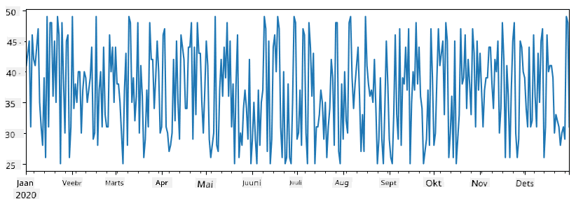
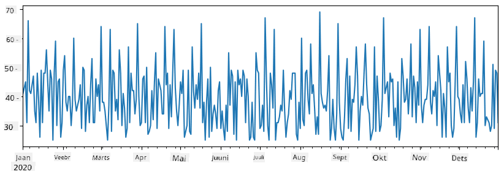
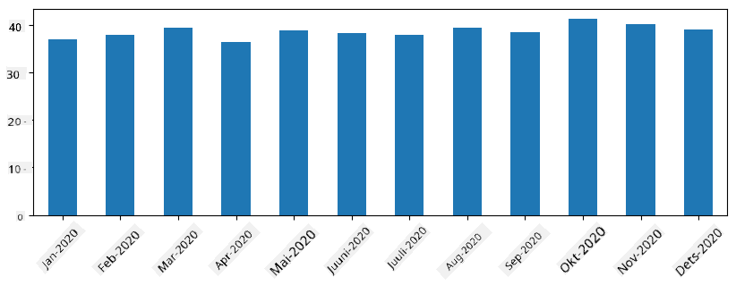
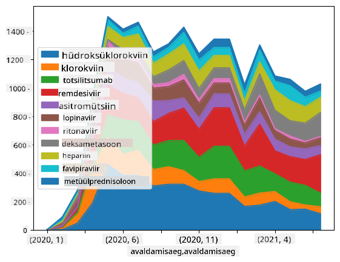

<!--
CO_OP_TRANSLATOR_METADATA:
{
  "original_hash": "7bfec050f4717dcc2dfd028aca9d21f3",
  "translation_date": "2025-10-11T15:19:37+00:00",
  "source_file": "2-Working-With-Data/07-python/README.md",
  "language_code": "et"
}
-->
# Töötamine andmetega: Python ja Pandas teek

|  ](../../sketchnotes/07-WorkWithPython.png) |
| :------------------------------------------------------------------------------------------------------------: |
|                 Töötamine Pythoniga - _Sketchnote autorilt [@nitya](https://twitter.com/nitya)_                 |

[](https://youtu.be/dZjWOGbsN4Y)

Kuigi andmebaasid pakuvad väga tõhusaid viise andmete salvestamiseks ja nende pärimiseks päringukeelte abil, on kõige paindlikum viis andmete töötlemiseks kirjutada oma programm, mis andmeid manipuleerib. Paljudel juhtudel oleks andmebaasi päring tõhusam lahendus. Kuid mõnel juhul, kui on vaja keerukamat andmetöötlust, ei saa seda lihtsalt SQL-i abil teha.  
Andmetöötlust saab programmeerida mis tahes programmeerimiskeeles, kuid on teatud keeled, mis on andmetega töötamisel kõrgemal tasemel. Andmeteadlased eelistavad tavaliselt ühte järgmistest keeltest:

* **[Python](https://www.python.org/)**, üldotstarbeline programmeerimiskeel, mida peetakse sageli üheks parimaks valikuks algajatele selle lihtsuse tõttu. Pythonil on palju lisateeke, mis aitavad lahendada mitmeid praktilisi probleeme, näiteks andmete ekstraheerimine ZIP-arhiivist või pildi teisendamine halltoonidesse. Lisaks andmeteadusele kasutatakse Pythoni sageli ka veebiarenduses.  
* **[R](https://www.r-project.org/)** on traditsiooniline tööriistakomplekt, mis on välja töötatud statistiliste andmete töötlemiseks. Sellel on suur teekide repository (CRAN), mis teeb sellest hea valiku andmetöötluseks. Kuid R ei ole üldotstarbeline programmeerimiskeel ja seda kasutatakse harva väljaspool andmeteaduse valdkonda.  
* **[Julia](https://julialang.org/)** on veel üks keel, mis on spetsiaalselt välja töötatud andmeteaduse jaoks. Selle eesmärk on pakkuda paremat jõudlust kui Python, muutes selle suurepäraseks tööriistaks teaduslikeks katsetusteks.

Selles õppetükis keskendume Pythoni kasutamisele lihtsaks andmetöötluseks. Eeldame, et olete keelega põgusalt tuttav. Kui soovite Pythoni kohta põhjalikumat ülevaadet, võite viidata ühele järgmistest ressurssidest:

* [Õpi Pythonit lõbusalt Turtle Graphicsi ja fraktalitega](https://github.com/shwars/pycourse) - GitHubi-põhine kiire sissejuhatus Pythoni programmeerimisse  
* [Astuge esimesed sammud Pythoniga](https://docs.microsoft.com/en-us/learn/paths/python-first-steps/?WT.mc_id=academic-77958-bethanycheum) Õppeprogramm [Microsoft Learn](http://learn.microsoft.com/?WT.mc_id=academic-77958-bethanycheum) lehel  

Andmed võivad esineda mitmel kujul. Selles õppetükis käsitleme kolme andmevormi - **tabelandmed**, **tekst** ja **pildid**.

Keskendume mõnele andmetöötluse näitele, selle asemel et anda täielik ülevaade kõigist seotud teekidest. See võimaldab teil saada peamise idee sellest, mis on võimalik, ja jätta teile arusaama, kust leida lahendusi oma probleemidele, kui neid vajate.

> **Kõige kasulikum nõuanne**. Kui teil on vaja teha teatud toimingut andmetega, mida te ei oska, proovige otsida seda internetist. [Stackoverflow](https://stackoverflow.com/) sisaldab tavaliselt palju kasulikke Pythoni koodinäiteid paljude tüüpiliste ülesannete jaoks.

## [Eel-loengu viktoriin](https://ff-quizzes.netlify.app/en/ds/quiz/12)

## Tabelandmed ja DataFrame'id

Olete juba kohtunud tabelandmetega, kui rääkisime relatsioonilistest andmebaasidest. Kui teil on palju andmeid ja need on salvestatud paljudesse erinevatesse seotud tabelitesse, on kindlasti mõistlik kasutada SQL-i nende töötlemiseks. Kuid on palju juhtumeid, kus meil on tabel andmetega ja me peame saama nende andmete kohta **arusaama** või **teadmisi**, näiteks jaotuse, väärtuste korrelatsiooni jne. Andmeteaduses on palju juhtumeid, kus peame tegema algandmete transformatsioone, millele järgneb visualiseerimine. Mõlemad sammud saab hõlpsasti teha Pythoniga.

Pythonis on kaks kõige kasulikumat teeki, mis aitavad teil tabelandmetega toime tulla:
* **[Pandas](https://pandas.pydata.org/)** võimaldab manipuleerida nn **DataFrame'idega**, mis on analoogsed relatsiooniliste tabelitega. Teil võivad olla nimetatud veerud ja saate teha erinevaid toiminguid ridade, veergude ja DataFrame'ide üldiselt.  
* **[Numpy](https://numpy.org/)** on teek, mis töötab **tensori**, st mitmemõõtmeliste **massiividega**. Massiiv sisaldab sama aluseks oleva tüübi väärtusi ja on lihtsam kui DataFrame, kuid pakub rohkem matemaatilisi operatsioone ja tekitab vähem koormust.

Samuti on paar muud teeki, mida peaksite teadma:
* **[Matplotlib](https://matplotlib.org/)** on teek, mida kasutatakse andmete visualiseerimiseks ja graafikute joonistamiseks  
* **[SciPy](https://www.scipy.org/)** on teek, mis sisaldab mõningaid täiendavaid teaduslikke funktsioone. Oleme selle teegiga juba kokku puutunud, kui rääkisime tõenäosusest ja statistikast.

Siin on koodijupp, mida tavaliselt kasutaksite nende teekide importimiseks oma Pythoni programmi alguses:
```python
import numpy as np
import pandas as pd
import matplotlib.pyplot as plt
from scipy import ... # you need to specify exact sub-packages that you need
``` 

Pandas keskendub mõnele põhimõistele.

### Series

**Series** on väärtuste järjestus, mis sarnaneb loendi või numpy massiiviga. Peamine erinevus seisneb selles, et Series'il on ka **indeks**, ja kui me Series'iga töötame (nt. liidame neid), võetakse indeks arvesse. Indeks võib olla nii lihtne kui täisarvuline rea number (see on indeks, mida kasutatakse vaikimisi Series'i loendist või massiivist loomisel) või see võib olla keeruka struktuuriga, näiteks kuupäeva intervall.

> **Märkus**: Mõningane sissejuhatav Pandas kood on kaasasolevas märkmikus [`notebook.ipynb`](notebook.ipynb). Siin toome välja ainult mõned näited, kuid kindlasti olete oodatud tutvuma täieliku märkmikuga.

Vaatame näidet: soovime analüüsida meie jäätisekohviku müüki. Loome müüginumbrite Series'i (müüdud esemete arv iga päev) teatud ajavahemiku kohta:

```python
start_date = "Jan 1, 2020"
end_date = "Mar 31, 2020"
idx = pd.date_range(start_date,end_date)
print(f"Length of index is {len(idx)}")
items_sold = pd.Series(np.random.randint(25,50,size=len(idx)),index=idx)
items_sold.plot()
```


Oletame nüüd, et igal nädalal korraldame sõpradele peo ja võtame peole lisaks 10 pakki jäätist. Saame luua teise Series'i, mis on indekseeritud nädala järgi, et seda näidata:
```python
additional_items = pd.Series(10,index=pd.date_range(start_date,end_date,freq="W"))
```
Kui liidame kaks Series'it, saame koguarvu:
```python
total_items = items_sold.add(additional_items,fill_value=0)
total_items.plot()
```


> **Märkus**: Me ei kasuta lihtsat süntaksit `total_items+additional_items`. Kui me seda teeksime, saaksime palju `NaN` (*Not a Number*) väärtusi tulemuseks olevas Series'is. See on tingitud sellest, et `additional_items` Series'is puuduvad väärtused mõne indeksi punkti jaoks ja `NaN` lisamine millelegi annab tulemuseks `NaN`. Seetõttu peame liitmisel määrama `fill_value` parameetri.

Ajaseeriatega saame ka **ümberproovida** seeriat erinevate ajavahemikega. Näiteks kui soovime arvutada keskmist müügimahtu kuus, saame kasutada järgmist koodi:
```python
monthly = total_items.resample("1M").mean()
ax = monthly.plot(kind='bar')
```


### DataFrame

DataFrame on sisuliselt sama indeksiga Series'ite kogum. Saame kombineerida mitu Series'it DataFrame'iks:
```python
a = pd.Series(range(1,10))
b = pd.Series(["I","like","to","play","games","and","will","not","change"],index=range(0,9))
df = pd.DataFrame([a,b])
```
See loob horisontaalse tabeli, mis näeb välja selline:
|     | 0   | 1    | 2   | 3   | 4      | 5   | 6      | 7    | 8    |
| --- | --- | ---- | --- | --- | ------ | --- | ------ | ---- | ---- |
| 0   | 1   | 2    | 3   | 4   | 5      | 6   | 7      | 8    | 9    |
| 1   | I   | like | to  | use | Python | and | Pandas | very | much |

Saame kasutada Series'it veergudena ja määrata veergude nimed sõnastiku abil:
```python
df = pd.DataFrame({ 'A' : a, 'B' : b })
```
See annab meile tabeli, mis näeb välja selline:

|     | A   | B      |
| --- | --- | ------ |
| 0   | 1   | I      |
| 1   | 2   | like   |
| 2   | 3   | to     |
| 3   | 4   | use    |
| 4   | 5   | Python |
| 5   | 6   | and    |
| 6   | 7   | Pandas |
| 7   | 8   | very   |
| 8   | 9   | much   |

**Märkus**: Saame selle tabeli paigutuse ka eelmise tabeli transponeerimise teel, näiteks kirjutades 
```python
df = pd.DataFrame([a,b]).T..rename(columns={ 0 : 'A', 1 : 'B' })
```
Siin `.T` tähendab DataFrame'i transponeerimise operatsiooni, st ridade ja veergude vahetamist, ja `rename` operatsioon võimaldab meil veerge ümber nimetada, et need vastaksid eelmisele näitele.

Siin on mõned kõige olulisemad toimingud, mida saame DataFrame'idega teha:

**Veergude valik**. Saame valida üksikuid veerge, kirjutades `df['A']` - see operatsioon tagastab Series'i. Samuti saame valida veergude alamhulga teise DataFrame'i, kirjutades `df[['B','A']]` - see tagastab teise DataFrame'i.

**Filtreerimine** ainult teatud ridade järgi kriteeriumide alusel. Näiteks, et jätta ainult read, kus veerg `A` on suurem kui 5, saame kirjutada `df[df['A']>5]`.

> **Märkus**: Filtreerimine töötab järgmiselt. Väljend `df['A']<5` tagastab boole'i Series'i, mis näitab, kas väljend on `True` või `False` iga algse Series'i `df['A']` elemendi jaoks. Kui boole'i Series'i kasutatakse indeksina, tagastab see DataFrame'i ridade alamhulga. Seetõttu ei ole võimalik kasutada suvalist Pythoni boole'i väljendit, näiteks kirjutades `df[df['A']>5 and df['A']<7]` oleks vale. Selle asemel peaksite kasutama spetsiaalset `&` operatsiooni boole'i Series'ite peal, kirjutades `df[(df['A']>5) & (df['A']<7)]` (*sulgud on siin olulised*).

**Uute arvutatavate veergude loomine**. Saame hõlpsasti luua uusi arvutatavaid veerge oma DataFrame'ile, kasutades intuitiivset väljendit, näiteks:
```python
df['DivA'] = df['A']-df['A'].mean() 
``` 
See näide arvutab A kõrvalekalde selle keskmisest väärtusest. Tegelikult arvutame siin Series'i ja määrame selle vasakpoolsele küljele, luues uue veeru. Seega ei saa kasutada operatsioone, mis ei ühildu Series'itega, näiteks järgmine kood on vale:
```python
# Wrong code -> df['ADescr'] = "Low" if df['A'] < 5 else "Hi"
df['LenB'] = len(df['B']) # <- Wrong result
``` 
Viimane näide, kuigi süntaktiliselt korrektne, annab meile vale tulemuse, kuna see määrab veeru kõikidele väärtustele Series'i `B` pikkuse, mitte üksikute elementide pikkuse, nagu me kavatsesime.

Kui peame arvutama keerukaid väljendeid nagu see, saame kasutada `apply` funktsiooni. Viimane näide võib olla kirjutatud järgmiselt:
```python
df['LenB'] = df['B'].apply(lambda x : len(x))
# or 
df['LenB'] = df['B'].apply(len)
```

Pärast ülaltoodud toiminguid jõuame järgmise DataFrame'ini:

|     | A   | B      | DivA | LenB |
| --- | --- | ------ | ---- | ---- |
| 0   | 1   | I      | -4.0 | 1    |
| 1   | 2   | like   | -3.0 | 4    |
| 2   | 3   | to     | -2.0 | 2    |
| 3   | 4   | use    | -1.0 | 3    |
| 4   | 5   | Python | 0.0  | 6    |
| 5   | 6   | and    | 1.0  | 3    |
| 6   | 7   | Pandas | 2.0  | 6    |
| 7   | 8   | very   | 3.0  | 4    |
| 8   | 9   | much   | 4.0  | 4    |

**Ridade valimine numbrite alusel** saab teha `iloc` konstruktsiooni abil. Näiteks, et valida DataFrame'ist esimesed 5 rida:
```python
df.iloc[:5]
```

**Grupeerimine** kasutatakse sageli tulemuse saamiseks, mis sarnaneb *pivot-tabelitega* Excelis. Oletame, et soovime arvutada veeru `A` keskmise väärtuse iga antud `LenB` numbri jaoks. Siis saame oma DataFrame'i grupeerida `LenB` järgi ja kutsuda `mean`:
```python
df.groupby(by='LenB')[['A','DivA']].mean()
```
Kui peame arvutama keskmise ja elementide arvu grupis, siis saame kasutada keerukamat `aggregate` funktsiooni:
```python
df.groupby(by='LenB') \
 .aggregate({ 'DivA' : len, 'A' : lambda x: x.mean() }) \
 .rename(columns={ 'DivA' : 'Count', 'A' : 'Mean'})
```
See annab meile järgmise tabeli:

| LenB | Count | Mean     |
| ---- | ----- | -------- |
| 1    | 1     | 1.000000 |
| 2    | 1     | 3.000000 |
| 3    | 2     | 5.000000 |
| 4    | 3     | 6.333333 |
| 6    | 2     | 6.000000 |

### Andmete hankimine
Oleme näinud, kui lihtne on luua Series ja DataFrame'i Python objektidest. Kuid tavaliselt on andmed tekstifaili või Exceli tabeli kujul. Õnneks pakub Pandas meile lihtsat viisi andmete laadimiseks kettalt. Näiteks CSV-faili lugemine on nii lihtne:
```python
df = pd.read_csv('file.csv')
```
Näeme rohkem näiteid andmete laadimisest, sealhulgas nende hankimist välisveebilehtedelt, "Väljakutse" sektsioonis.

### Andmete kuvamine ja visualiseerimine

Andmeteadlane peab sageli andmeid uurima, seega on oluline osata neid visualiseerida. Kui DataFrame on suur, tahame tihti lihtsalt veenduda, et teeme kõik õigesti, kuvades esimesed paar rida. Seda saab teha, kutsudes `df.head()`. Kui käitate seda Jupyter Notebookis, kuvab see DataFrame'i kenasti tabeli kujul.

Oleme näinud ka `plot` funktsiooni kasutamist, et visualiseerida mõningaid veerge. Kuigi `plot` on väga kasulik paljude ülesannete jaoks ja toetab erinevaid graafikutüüpe `kind=` parameetri kaudu, saate alati kasutada `matplotlib` teeki, et luua midagi keerukamat. Käsitleme andmete visualiseerimist üksikasjalikult eraldi kursuse tundides.

See ülevaade hõlmab Pandase kõige olulisemaid kontseptsioone, kuid teek on väga rikkalik ja võimalused on piiritud! Rakendame nüüd seda teadmist konkreetse probleemi lahendamiseks.

## 🚀 Väljakutse 1: COVID leviku analüüs

Esimene probleem, millele keskendume, on COVID-19 epideemia leviku modelleerimine. Selleks kasutame andmeid nakatunud inimeste arvu kohta erinevates riikides, mida pakub [Center for Systems Science and Engineering](https://systems.jhu.edu/) (CSSE) [Johns Hopkinsi Ülikoolist](https://jhu.edu/). Andmestik on saadaval [selles GitHubi repositooriumis](https://github.com/CSSEGISandData/COVID-19).

Kuna tahame näidata, kuidas andmetega töötada, kutsume teid avama [`notebook-covidspread.ipynb`](notebook-covidspread.ipynb) ja lugema seda algusest lõpuni. Võite ka rakke käivitada ja lahendada mõned väljakutsed, mille oleme teile lõppu jätnud.


> Kui te ei tea, kuidas Jupyter Notebookis koodi käivitada, vaadake [seda artiklit](https://soshnikov.com/education/how-to-execute-notebooks-from-github/).

## Töötamine struktureerimata andmetega

Kuigi andmed on sageli tabeli kujul, peame mõnel juhul töötama vähem struktureeritud andmetega, näiteks tekstide või piltidega. Sellisel juhul, et rakendada andmetöötlustehnikaid, mida oleme näinud, peame kuidagi **ekstraheerima** struktureeritud andmeid. Siin on mõned näited:

* Märksõnade ekstraheerimine tekstist ja nende esinemissageduse analüüs
* Neuraalvõrkude kasutamine, et tuvastada objektid pildil
* Emotsioonide tuvastamine videokaamera voogudes

## 🚀 Väljakutse 2: COVID-teemaliste teadusartiklite analüüs

Selles väljakutses jätkame COVID pandeemia teemaga ja keskendume teadusartiklite töötlemisele. Olemas on [CORD-19 andmestik](https://www.kaggle.com/allen-institute-for-ai/CORD-19-research-challenge), mis sisaldab üle 7000 (kirjutamise ajal) COVID-teemalist artiklit koos metaandmete ja kokkuvõtetega (ja umbes pooltel juhtudel on saadaval ka täistekstid).

Täielik näide selle andmestiku analüüsimisest, kasutades [Text Analytics for Health](https://docs.microsoft.com/azure/cognitive-services/text-analytics/how-tos/text-analytics-for-health/?WT.mc_id=academic-77958-bethanycheum) kognitiivset teenust, on kirjeldatud [selles blogipostituses](https://soshnikov.com/science/analyzing-medical-papers-with-azure-and-text-analytics-for-health/). Arutame selle analüüsi lihtsustatud versiooni.

> **NOTE**: Me ei paku selle repositooriumi osana andmestiku koopiat. Võite esmalt alla laadida [`metadata.csv`](https://www.kaggle.com/allen-institute-for-ai/CORD-19-research-challenge?select=metadata.csv) faili [sellest Kaggle andmestikust](https://www.kaggle.com/allen-institute-for-ai/CORD-19-research-challenge). Registreerimine Kaggle'is võib olla vajalik. Võite andmestiku alla laadida ka ilma registreerimiseta [siit](https://ai2-semanticscholar-cord-19.s3-us-west-2.amazonaws.com/historical_releases.html), kuid see sisaldab kõiki täistekste lisaks metaandmete failile.

Avage [`notebook-papers.ipynb`](notebook-papers.ipynb) ja lugege seda algusest lõpuni. Võite ka rakke käivitada ja lahendada mõned väljakutsed, mille oleme teile lõppu jätnud.



## Pildiandmete töötlemine

Viimasel ajal on välja töötatud väga võimsad AI mudelid, mis võimaldavad meil pilte mõista. Paljusid ülesandeid saab lahendada eelnevalt treenitud neuraalvõrkude või pilveteenuste abil. Mõned näited hõlmavad:

* **Pildiklassifikatsioon**, mis aitab teil kategoriseerida pilti ühte eelnevalt määratletud klassi. Oma pildiklassifikaatorite treenimine on lihtne, kasutades teenuseid nagu [Custom Vision](https://azure.microsoft.com/services/cognitive-services/custom-vision-service/?WT.mc_id=academic-77958-bethanycheum).
* **Objektide tuvastamine**, et tuvastada erinevaid objekte pildil. Teenused nagu [computer vision](https://azure.microsoft.com/services/cognitive-services/computer-vision/?WT.mc_id=academic-77958-bethanycheum) suudavad tuvastada mitmeid levinud objekte, ja saate treenida [Custom Vision](https://azure.microsoft.com/services/cognitive-services/custom-vision-service/?WT.mc_id=academic-77958-bethanycheum) mudelit, et tuvastada konkreetseid huvipakkuvaid objekte.
* **Näotuvastus**, sealhulgas vanuse, soo ja emotsioonide tuvastamine. Seda saab teha [Face API](https://azure.microsoft.com/services/cognitive-services/face/?WT.mc_id=academic-77958-bethanycheum) abil.

Kõiki neid pilveteenuseid saab kasutada [Python SDK-dega](https://docs.microsoft.com/samples/azure-samples/cognitive-services-python-sdk-samples/cognitive-services-python-sdk-samples/?WT.mc_id=academic-77958-bethanycheum), ja seega saab neid hõlpsasti integreerida teie andmete uurimise töövoogu.

Siin on mõned näited pildiandmete allikatest andmete uurimisest:
* Blogipostituses [Kuidas õppida andmeteadust ilma kodeerimiseta](https://soshnikov.com/azure/how-to-learn-data-science-without-coding/) uurime Instagrami fotosid, püüdes mõista, mis paneb inimesi fotole rohkem meeldimisi andma. Esmalt ekstraheerime piltidelt võimalikult palju teavet, kasutades [computer vision](https://azure.microsoft.com/services/cognitive-services/computer-vision/?WT.mc_id=academic-77958-bethanycheum), ja seejärel kasutame [Azure Machine Learning AutoML](https://docs.microsoft.com/azure/machine-learning/concept-automated-ml/?WT.mc_id=academic-77958-bethanycheum), et luua tõlgendatav mudel.
* [Näouuringute töötoas](https://github.com/CloudAdvocacy/FaceStudies) kasutame [Face API](https://azure.microsoft.com/services/cognitive-services/face/?WT.mc_id=academic-77958-bethanycheum), et ekstraheerida emotsioone inimestelt fotodelt üritustelt, püüdes mõista, mis teeb inimesi õnnelikuks.

## Kokkuvõte

Kas teil on juba struktureeritud või struktureerimata andmed, Pythoniga saate teha kõik andmetöötluse ja -mõistmisega seotud sammud. See on tõenäoliselt kõige paindlikum viis andmetöötluseks, ja seetõttu kasutab enamik andmeteadlasi Pythonit oma peamise tööriistana. Pythonit süvitsi õppida on tõenäoliselt hea mõte, kui olete tõsiselt huvitatud oma andmeteaduse teekonnast!

## [Loengu järgne viktoriin](https://ff-quizzes.netlify.app/en/ds/quiz/13)

## Ülevaade ja iseseisev õppimine

**Raamatud**
* [Wes McKinney. Python for Data Analysis: Data Wrangling with Pandas, NumPy, and IPython](https://www.amazon.com/gp/product/1491957662)

**Veebiressursid**
* Ametlik [10 minutit Pandasega](https://pandas.pydata.org/pandas-docs/stable/user_guide/10min.html) õpetus
* [Dokumentatsioon Pandase visualiseerimise kohta](https://pandas.pydata.org/pandas-docs/stable/user_guide/visualization.html)

**Python õppimine**
* [Õpi Pythonit lõbusalt Turtle Graphicsi ja fraktalitega](https://github.com/shwars/pycourse)
* [Tee esimesed sammud Pythoniga](https://docs.microsoft.com/learn/paths/python-first-steps/?WT.mc_id=academic-77958-bethanycheum) õpitee [Microsoft Learnis](http://learn.microsoft.com/?WT.mc_id=academic-77958-bethanycheum)

## Ülesanne

[Tee ülaltoodud väljakutsete kohta põhjalikum andmeuuring](assignment.md)

## Autorid

Selle õppetunni on koostanud ♥️ [Dmitry Soshnikov](http://soshnikov.com)

---

**Lahtiütlus**:  
See dokument on tõlgitud AI tõlketeenuse [Co-op Translator](https://github.com/Azure/co-op-translator) abil. Kuigi püüame tagada täpsust, palume arvestada, et automaatsed tõlked võivad sisaldada vigu või ebatäpsusi. Algne dokument selle algses keeles tuleks pidada autoriteetseks allikaks. Olulise teabe puhul soovitame kasutada professionaalset inimtõlget. Me ei vastuta arusaamatuste või valesti tõlgenduste eest, mis võivad tekkida selle tõlke kasutamise tõttu.