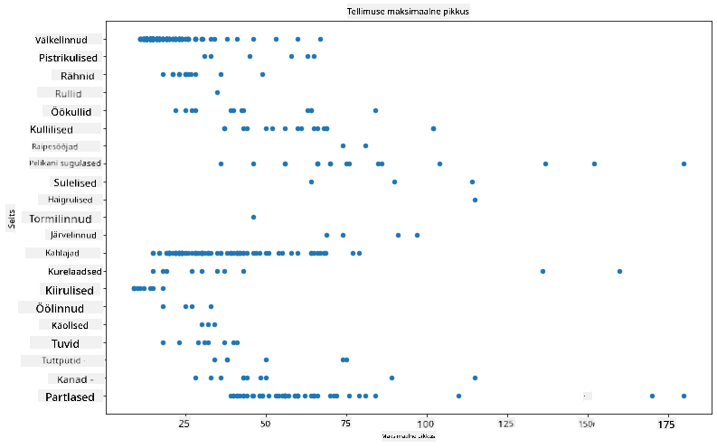
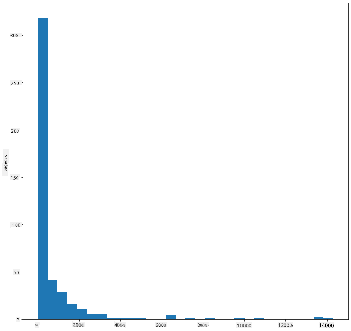
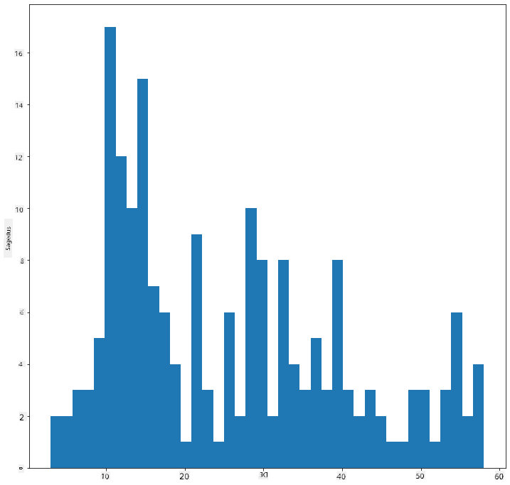
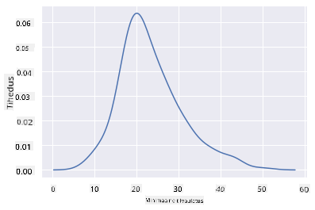
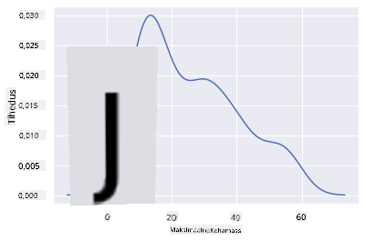
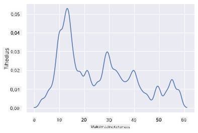
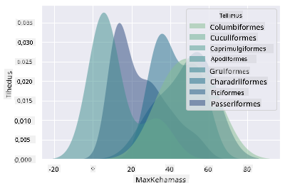
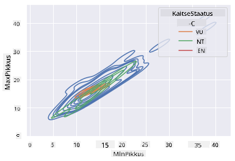

<!--
CO_OP_TRANSLATOR_METADATA:
{
  "original_hash": "80a20467e046d312809d008395051fc7",
  "translation_date": "2025-10-11T15:54:05+00:00",
  "source_file": "3-Data-Visualization/10-visualization-distributions/README.md",
  "language_code": "et"
}
-->
# Jaotuste visualiseerimine

| ](../../sketchnotes/10-Visualizing-Distributions.png)|
|:---:|
| Jaotuste visualiseerimine - _Sketchnote autorilt [@nitya](https://twitter.com/nitya)_ |

Eelmises õppetükis õppisite huvitavaid fakte Minnesota lindude andmestiku kohta. Leidsite vigaseid andmeid, visualiseerides kõrvalekaldeid, ja uurisite lindude kategooriate erinevusi nende maksimaalse pikkuse järgi.

## [Eelloengu viktoriin](https://ff-quizzes.netlify.app/en/ds/quiz/18)
## Uurime lindude andmestikku

Üks viis andmete uurimiseks on vaadata nende jaotust ehk seda, kuidas andmed on teljel jaotunud. Võib-olla soovite näiteks teada saada, milline on selle andmestiku üldine jaotus Minnesota lindude maksimaalse tiivaulatuse või maksimaalse kehamassi osas.

Avastame mõned faktid selle andmestiku jaotuste kohta. Failis _notebook.ipynb_, mis asub selle õppetüki kaustas, importige Pandas, Matplotlib ja oma andmed:

```python
import pandas as pd
import matplotlib.pyplot as plt
birds = pd.read_csv('../../data/birds.csv')
birds.head()
```

|      | Nimi                         | TeaduslikNimi          | Kategooria            | Selts        | Sugukond | Perekond    | Kaitsestaatus       | MinPikkus | MaxPikkus | MinKehamass | MaxKehamass | MinTiivaulatus | MaxTiivaulatus |
| ---: | :--------------------------- | :--------------------- | :-------------------- | :----------- | :------- | :---------- | :----------------- | --------: | --------: | ----------: | ----------: | -------------: | -------------: |
|    0 | Mustkõht-vilepart            | Dendrocygna autumnalis | Pardid/Haned/Vesilinnud | Anseriformes | Anatidae | Dendrocygna | LC                 |        47 |        56 |         652 |        1020 |             76 |             94 |
|    1 | Pruun-vilepart               | Dendrocygna bicolor    | Pardid/Haned/Vesilinnud | Anseriformes | Anatidae | Dendrocygna | LC                 |        45 |        53 |         712 |        1050 |             85 |             93 |
|    2 | Lumelind                     | Anser caerulescens     | Pardid/Haned/Vesilinnud | Anseriformes | Anatidae | Anser       | LC                 |        64 |        79 |        2050 |        4050 |            135 |            165 |
|    3 | Rossi hani                   | Anser rossii           | Pardid/Haned/Vesilinnud | Anseriformes | Anatidae | Anser       | LC                 |      57.3 |        64 |        1066 |        1567 |            113 |            116 |
|    4 | Suur valge-laup-hani         | Anser albifrons        | Pardid/Haned/Vesilinnud | Anseriformes | Anatidae | Anser       | LC                 |        64 |        81 |        1930 |        3310 |            130 |            165 |

Üldiselt saate andmete jaotust kiiresti vaadata hajuvusdiagrammi abil, nagu tegime eelmises õppetükis:

```python
birds.plot(kind='scatter',x='MaxLength',y='Order',figsize=(12,8))

plt.title('Max Length per Order')
plt.ylabel('Order')
plt.xlabel('Max Length')

plt.show()
```


See annab ülevaate kehapikkuse üldisest jaotusest lindude seltsi kohta, kuid see ei ole kõige optimaalsem viis tõeliste jaotuste kuvamiseks. Selle ülesande jaoks kasutatakse tavaliselt histogrammi.
## Töötamine histogrammidega

Matplotlib pakub väga häid viise andmete jaotuse visualiseerimiseks histogrammide abil. Seda tüüpi diagramm sarnaneb tulpdiagrammiga, kus jaotust saab näha tulbade tõusu ja languse kaudu. Histogrammi loomiseks on vaja numbrilisi andmeid. Histogrammi loomiseks saate joonistada diagrammi, määrates tüübi 'hist' (histogramm). See diagramm näitab MaxBodyMass jaotust kogu andmestiku numbriliste andmete ulatuses. Jagades antud andmemassiivi väiksemateks osadeks, saab kuvada andmete väärtuste jaotuse:

```python
birds['MaxBodyMass'].plot(kind = 'hist', bins = 10, figsize = (12,12))
plt.show()
```


Nagu näete, jääb enamik selle andmestiku 400+ linnust oma maksimaalse kehamassi osas alla 2000. Saate andmetest rohkem aimu, muutes `bins` parameetri suuremaks, näiteks 30:

```python
birds['MaxBodyMass'].plot(kind = 'hist', bins = 30, figsize = (12,12))
plt.show()
```


See diagramm näitab jaotust veidi detailsemalt. Vähem vasakule kalduvat diagrammi saab luua, kui valida andmed ainult teatud vahemikus:

Filtreerige oma andmed nii, et valikusse jääksid ainult need linnud, kelle kehamass on alla 60, ja näidake 40 `bins`:

```python
filteredBirds = birds[(birds['MaxBodyMass'] > 1) & (birds['MaxBodyMass'] < 60)]      
filteredBirds['MaxBodyMass'].plot(kind = 'hist',bins = 40,figsize = (12,12))
plt.show()     
```


✅ Proovige teisi filtreid ja andmepunkte. Andmete täieliku jaotuse nägemiseks eemaldage `['MaxBodyMass']` filter, et kuvada märgistatud jaotusi.

Histogramm pakub ka mõningaid toredaid värvi- ja märgistustäiustusi, mida proovida:

Looge 2D-histogramm, et võrrelda kahe jaotuse vahelist seost. Võrrelgem `MaxBodyMass` ja `MaxLength`. Matplotlib pakub sisseehitatud viisi, kuidas näidata koondumist heledamate värvide abil:

```python
x = filteredBirds['MaxBodyMass']
y = filteredBirds['MaxLength']

fig, ax = plt.subplots(tight_layout=True)
hist = ax.hist2d(x, y)
```
Tundub, et nende kahe elemendi vahel on oodatud telje ulatuses korrelatsioon, kusjuures üks eriti tugev koondumispunkt paistab silma:


Histogrammid töötavad vaikimisi hästi numbriliste andmetega. Aga mis siis, kui peate nägema jaotusi tekstiliste andmete järgi? 
## Uurime andmestikku jaotuste osas tekstiliste andmete abil 

See andmestik sisaldab ka head teavet lindude kategooria, perekonna, liigi ja sugukonna kohta, samuti nende kaitsestaatust. Uurime seda kaitsestaatuse teavet. Milline on lindude jaotus nende kaitsestaatuse järgi?

> ✅ Andmestikus kasutatakse mitmeid lühendeid kaitsestaatuse kirjeldamiseks. Need lühendid pärinevad [IUCN punasest nimekirjast](https://www.iucnredlist.org/), mis kataloogib liikide staatust.
> 
> - CR: Kriitiliselt ohustatud
> - EN: Ohustatud
> - EX: Väljasurnud
> - LC: Väikseim mure
> - NT: Ohulähedane
> - VU: Haavatav

Need on tekstipõhised väärtused, seega peate histogrammi loomiseks tegema teisenduse. Kasutades filteredBirds andmeraamistikku, kuvage selle kaitsestaatus koos minimaalse tiivaulatusega. Mida te näete?

```python
x1 = filteredBirds.loc[filteredBirds.ConservationStatus=='EX', 'MinWingspan']
x2 = filteredBirds.loc[filteredBirds.ConservationStatus=='CR', 'MinWingspan']
x3 = filteredBirds.loc[filteredBirds.ConservationStatus=='EN', 'MinWingspan']
x4 = filteredBirds.loc[filteredBirds.ConservationStatus=='NT', 'MinWingspan']
x5 = filteredBirds.loc[filteredBirds.ConservationStatus=='VU', 'MinWingspan']
x6 = filteredBirds.loc[filteredBirds.ConservationStatus=='LC', 'MinWingspan']

kwargs = dict(alpha=0.5, bins=20)

plt.hist(x1, **kwargs, color='red', label='Extinct')
plt.hist(x2, **kwargs, color='orange', label='Critically Endangered')
plt.hist(x3, **kwargs, color='yellow', label='Endangered')
plt.hist(x4, **kwargs, color='green', label='Near Threatened')
plt.hist(x5, **kwargs, color='blue', label='Vulnerable')
plt.hist(x6, **kwargs, color='gray', label='Least Concern')

plt.gca().set(title='Conservation Status', ylabel='Min Wingspan')
plt.legend();
```


Tundub, et minimaalne tiivaulatus ja kaitsestaatus ei ole omavahel hästi korrelatsioonis. Testige selle meetodiga andmestiku teisi elemente. Võite proovida ka erinevaid filtreid. Kas leiate mingeid korrelatsioone?

## Tiheduse graafikud

Võib-olla olete märganud, et seni vaadatud histogrammid on "astmelised" ja ei voola sujuvalt kaares. Sujuvama tiheduse graafiku näitamiseks võite proovida tiheduse graafikut.

Tiheduse graafikutega töötamiseks tutvuge uue joonistamisraamatukoguga, [Seaborn](https://seaborn.pydata.org/generated/seaborn.kdeplot.html). 

Laadige Seaborn ja proovige lihtsat tiheduse graafikut:

```python
import seaborn as sns
import matplotlib.pyplot as plt
sns.kdeplot(filteredBirds['MinWingspan'])
plt.show()
```


Näete, kuidas graafik kordab eelmist minimaalsete tiivaulatuste andmete graafikut; see on lihtsalt veidi sujuvam. Seaborni dokumentatsiooni kohaselt "võrreldes histogrammiga võib KDE (tuuma tiheduse hinnang) toota graafiku, mis on vähem segane ja kergemini tõlgendatav, eriti mitme jaotuse joonistamisel. Kuid see võib põhjustada moonutusi, kui aluseks olev jaotus on piiratud või mitte sujuv. Nagu histogrammi puhul, sõltub ka esitluse kvaliteet heade silumisseadete valikust." [allikas](https://seaborn.pydata.org/generated/seaborn.kdeplot.html) Teisisõnu, kõrvalekalded, nagu alati, võivad teie graafikuid halvasti mõjutada.

Kui soovite uuesti vaadata seda sakilist MaxBodyMass joont teises loodud graafikus, saate selle väga hästi siluda, luues selle meetodi abil uuesti:

```python
sns.kdeplot(filteredBirds['MaxBodyMass'])
plt.show()
```


Kui soovite sujuvat, kuid mitte liiga sujuvat joont, muutke `bw_adjust` parameetrit:

```python
sns.kdeplot(filteredBirds['MaxBodyMass'], bw_adjust=.2)
plt.show()
```


✅ Lugege selle tüüpi graafiku jaoks saadaolevate parameetrite kohta ja katsetage!

Seda tüüpi graafik pakub kaunilt selgitavaid visualiseeringuid. Näiteks mõne koodirea abil saate näidata maksimaalset kehamassi tihedust lindude seltsi kohta:

```python
sns.kdeplot(
   data=filteredBirds, x="MaxBodyMass", hue="Order",
   fill=True, common_norm=False, palette="crest",
   alpha=.5, linewidth=0,
)
```



Samuti saate ühes graafikus kaardistada mitme muutuja tiheduse. Võrrelge linnu MaxLength ja MinLength nende kaitsestaatusega:

```python
sns.kdeplot(data=filteredBirds, x="MinLength", y="MaxLength", hue="ConservationStatus")
```



Võib-olla tasub uurida, kas 'Haavatavate' lindude klaster nende pikkuste järgi on tähendusrikas või mitte.

## 🚀 Väljakutse

Histogrammid on keerukamad diagrammitüübid kui lihtsad hajuvusdiagrammid, tulpdiagrammid või joondiagrammid. Otsige internetist häid näiteid histogrammide kasutamise kohta. Kuidas neid kasutatakse, mida need näitavad ja millistes valdkondades või uurimisvaldkondades neid tavaliselt kasutatakse?

## [Järelloengu viktoriin](https://ff-quizzes.netlify.app/en/ds/quiz/19)

## Ülevaade ja iseseisev õppimine

Selles õppetükis kasutasite Matplotlibi ja hakkasite töötama Seaborniga, et luua keerukamaid diagramme. Tehke veidi uurimistööd Seaborni `kdeplot` kohta, mis on "pidev tõenäosuse tiheduse kõver ühes või mitmes dimensioonis". Lugege läbi [dokumentatsioon](https://seaborn.pydata.org/generated/seaborn.kdeplot.html), et mõista, kuidas see töötab.

## Ülesanne

[Rakenda oma oskusi](assignment.md)

---

**Lahtiütlus**:  
See dokument on tõlgitud, kasutades AI tõlketeenust [Co-op Translator](https://github.com/Azure/co-op-translator). Kuigi püüame tagada täpsust, palun arvestage, et automaatsed tõlked võivad sisaldada vigu või ebatäpsusi. Algne dokument selle algkeeles tuleks lugeda autoriteetseks allikaks. Olulise teabe puhul on soovitatav kasutada professionaalset inimtõlget. Me ei vastuta selle tõlke kasutamisest tulenevate arusaamatuste või valede tõlgenduste eest.