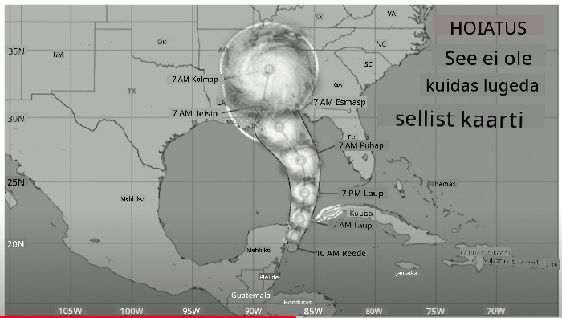
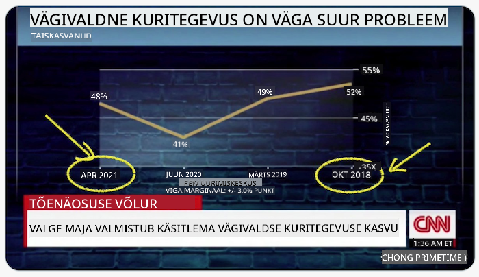
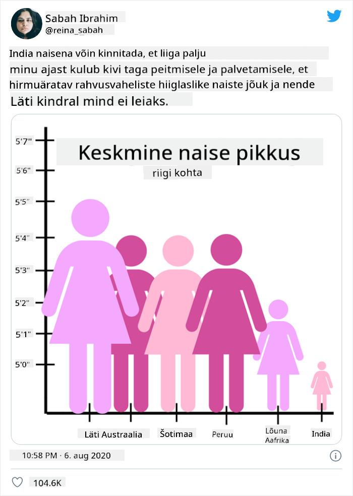
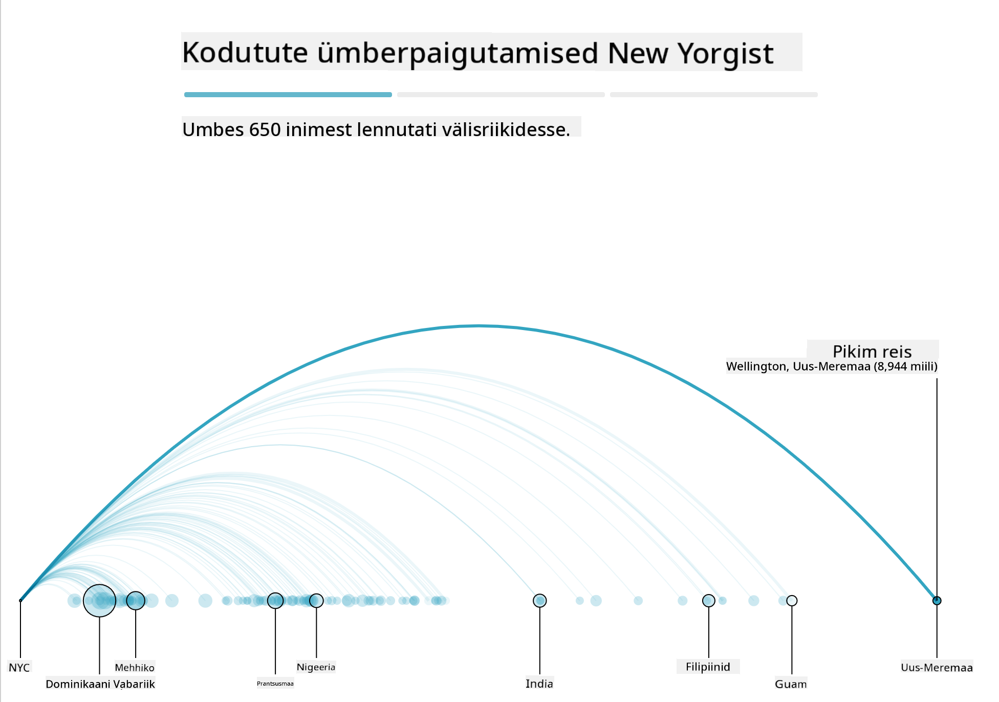
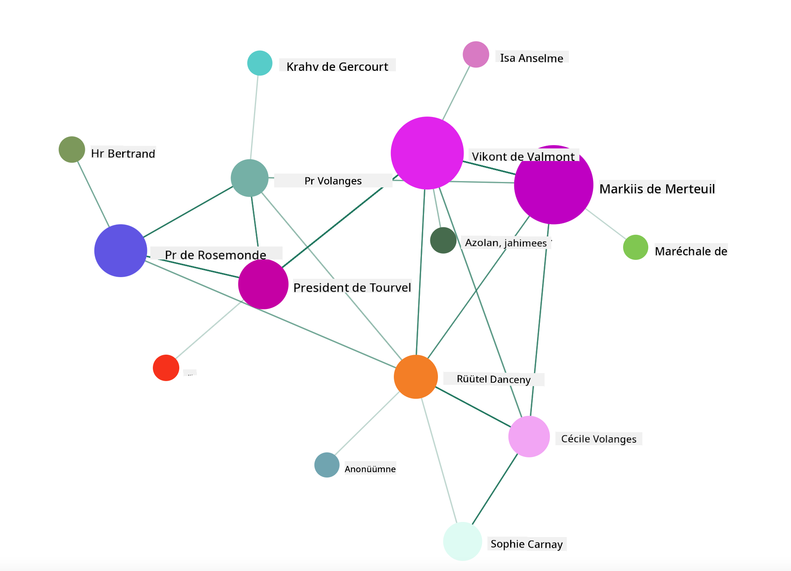

<!--
CO_OP_TRANSLATOR_METADATA:
{
  "original_hash": "cfb068050337a36e348debaa502a24fa",
  "translation_date": "2025-10-11T15:56:22+00:00",
  "source_file": "3-Data-Visualization/13-meaningful-visualizations/README.md",
  "language_code": "et"
}
-->
# Tähendusrikaste visualisatsioonide loomine

| ](../../sketchnotes/13-MeaningfulViz.png)|
|:---:|
| Tähendusrikkad visualisatsioonid - _Sketchnote by [@nitya](https://twitter.com/nitya)_ |

> "Kui piinad andmeid piisavalt kaua, tunnistavad nad kõike" -- [Ronald Coase](https://en.wikiquote.org/wiki/Ronald_Coase)

Üks andmeteadlase põhilisi oskusi on luua tähendusrikkaid andmevisualisatsioone, mis aitavad vastata küsimustele, mis sul võivad tekkida. Enne andmete visualiseerimist tuleb veenduda, et need on puhastatud ja ette valmistatud, nagu tegid varasemates tundides. Pärast seda saad hakata otsustama, kuidas andmeid kõige paremini esitada.

Selles tunnis vaatad üle:

1. Kuidas valida õige diagrammitüüp
2. Kuidas vältida eksitavaid diagramme
3. Kuidas kasutada värve
4. Kuidas kujundada diagramme loetavuse parandamiseks
5. Kuidas luua animeeritud või 3D-diagramme
6. Kuidas luua loomingulisi visualisatsioone

## [Eelloengu viktoriin](https://ff-quizzes.netlify.app/en/ds/quiz/24)

## Valige õige diagrammitüüp

Eelnevates tundides katsetasid erinevate huvitavate andmevisualisatsioonide loomist, kasutades Matplotlibi ja Seabornit diagrammide jaoks. Üldiselt saad valida [õige diagrammitüübi](https://chartio.com/learn/charts/how-to-select-a-data-vizualization/) vastavalt küsimusele, mida esitad, kasutades järgmist tabelit:

| Vajadus:                  | Kasuta:                        |
| -------------------------- | ------------------------------- |
| Näidata andmete trende ajas | Joon                           |
| Kategooriate võrdlemine     | Tulp, Sektordiagramm            |
| Kogusummade võrdlemine      | Sektordiagramm, Virntulpdiagramm |
| Näidata seoseid            | Hajuvusdiagramm, Joon, Facet, Kahe joone diagramm |
| Näidata jaotusi            | Hajuvusdiagramm, Histogramm, Kastdiagramm |
| Näidata proportsioone      | Sektordiagramm, Donut, Waffle   |

> ✅ Sõltuvalt andmete olemusest võib olla vajalik nende teisendamine tekstist numbriliseks, et diagramm toetaks neid.

## Vältige eksitamist

Isegi kui andmeteadlane valib hoolikalt õige diagrammi õige andmestiku jaoks, on palju viise, kuidas andmeid saab esitada viisil, mis tõestab mingit seisukohta, sageli andmete enda arvelt. Eksitavate diagrammide ja infograafikate näiteid on palju!

[](https://www.youtube.com/watch?v=oX74Nge8Wkw "Kuidas diagrammid valetavad")

> 🎥 Klõpsa ülaloleval pildil, et vaadata konverentsiettekannet eksitavate diagrammide kohta

See diagramm pöörab X-telje ümber, et näidata tõe vastandit, tuginedes kuupäevadele:



[See diagramm](https://media.firstcoastnews.com/assets/WTLV/images/170ae16f-4643-438f-b689-50d66ca6a8d8/170ae16f-4643-438f-b689-50d66ca6a8d8_1140x641.jpg) on veelgi eksitavam, kuna pilk tõmmatakse paremale, et järeldada, et aja jooksul on COVID-juhtumid erinevates maakondades vähenenud. Tegelikult, kui vaatad kuupäevi lähemalt, leiad, et need on ümber paigutatud, et anda eksitav langustrend.


See kurikuulus näide kasutab värvi JA ümberpööratud Y-telge eksitamiseks: selle asemel, et järeldada, et relvadega seotud surmad kasvasid pärast relvasõbraliku seadusandluse vastuvõtmist, petab diagramm silma, et arvata vastupidist:


See kummaline diagramm näitab, kuidas proportsioone saab manipuleerida, naljakal moel:



Võrdlemine, mis pole võrreldav, on veel üks kahtlane trikk. On olemas [suurepärane veebisait](https://tylervigen.com/spurious-correlations), mis näitab 'juhuslikke korrelatsioone', kuvades 'fakte', mis korreleerivad näiteks Maine'i lahutuste määra ja margariini tarbimist. Redditi grupp kogub samuti [andmete koledaid kasutusviise](https://www.reddit.com/r/dataisugly/top/?t=all).

Oluline on mõista, kui kergesti silm võib eksitavate diagrammide poolt petta saada. Isegi kui andmeteadlase kavatsus on hea, võib halva diagrammitüübi valik, näiteks sektordiagramm, mis näitab liiga palju kategooriaid, olla eksitav.

## Värv

Nagu nägid ülaltoodud 'Florida relvavägivalla' diagrammis, võib värv lisada diagrammidele täiendava tähenduskihi, eriti kui need pole loodud selliste teekidega nagu Matplotlib ja Seaborn, mis sisaldavad erinevaid kontrollitud värviteeke ja palette. Kui teed diagrammi käsitsi, uuri veidi [värviteooriat](https://colormatters.com/color-and-design/basic-color-theory).

> ✅ Ole teadlik, et diagrammide kujundamisel on ligipääsetavus oluline aspekt visualiseerimisel. Mõned sinu kasutajad võivad olla värvipimedad - kas sinu diagramm on hästi nähtav visuaalsete puuetega kasutajatele?

Ole ettevaatlik värvide valimisel diagrammi jaoks, kuna värv võib edastada tähendust, mida sa ei kavatse. Ülaltoodud 'kõrguse' diagrammi 'roosad daamid' edastavad selgelt 'naiselikku' tähendust, mis lisab diagrammi iseärasusele.

Kuigi [värvide tähendus](https://colormatters.com/color-symbolism/the-meanings-of-colors) võib olla erinev erinevates maailma osades ja kipub muutuma vastavalt nende varjundile, on üldiselt värvide tähendused järgmised:

| Värv   | Tähendus            |
| ------ | ------------------- |
| punane | jõud                |
| sinine | usaldus, lojaalsus  |
| kollane| õnn, ettevaatlikkus |
| roheline| ökoloogia, õnn, kadedus |
| lilla  | õnn                 |
| oranž  | elujõulisus         |

Kui sul on ülesanne luua diagramm kohandatud värvidega, veendu, et sinu diagrammid oleksid nii ligipääsetavad kui ka värv, mida valid, vastaks tähendusele, mida püüad edastada.

## Diagrammide kujundamine loetavuse parandamiseks

Diagrammid pole tähendusrikkad, kui need pole loetavad! Võta hetk, et kaaluda diagrammi laiuse ja kõrguse kujundamist, et see sobiks hästi sinu andmetega. Kui üks muutuja (näiteks kõik 50 osariiki) tuleb kuvada, näita neid vertikaalselt Y-teljel, kui võimalik, et vältida horisontaalselt keritavat diagrammi.

Märgi oma teljed, lisa legend vajadusel ja paku tööriistavihjeid andmete paremaks mõistmiseks.

Kui sinu andmed on tekstilised ja X-teljel pikad, saad teksti nurga alla keerata, et parandada loetavust. [Matplotlib](https://matplotlib.org/stable/tutorials/toolkits/mplot3d.html) pakub 3D-plotimist, kui sinu andmed seda toetavad. Täiustatud andmevisualisatsioone saab luua `mpl_toolkits.mplot3d` abil.


## Animatsioon ja 3D-diagrammide kuvamine

Mõned parimad tänapäeva andmevisualisatsioonid on animeeritud. Shirley Wu on loonud hämmastavaid visualisatsioone D3-ga, näiteks '[filmililled](http://bl.ocks.org/sxywu/raw/d612c6c653fb8b4d7ff3d422be164a5d/)', kus iga lill on filmi visualisatsioon. Teine näide Guardianile on 'bussed out', interaktiivne kogemus, mis ühendab visualisatsioone Greensocki ja D3-ga ning jutustava artikli formaati, et näidata, kuidas NYC lahendab kodutute probleemi, saates inimesi linnast välja.



> "Bussed Out: Kuidas Ameerika liigutab oma kodutuid" Guardianist [the Guardian](https://www.theguardian.com/us-news/ng-interactive/2017/dec/20/bussed-out-america-moves-homeless-people-country-study). Visualisatsioonid: Nadieh Bremer & Shirley Wu

Kuigi see tund ei ole piisav, et süvitsi õpetada neid võimsaid visualiseerimisteeke, proovi D3-d Vue.js rakenduses, kasutades teeki, et kuvada visualisatsiooni raamatust "Ohtlikud suhted" animeeritud sotsiaalse võrgustikuna.

> "Les Liaisons Dangereuses" on epistolaarne romaan ehk romaan, mis on esitatud kirjade seeriana. Kirjutatud 1782. aastal Choderlos de Laclos'i poolt, jutustab see loo kahest Prantsuse aristokraatia peategelasest 18. sajandi lõpus, Vicomte de Valmontist ja Marquise de Merteuilist, kes mõlemad lõpuks hukkuvad, kuid mitte enne, kui nad on põhjustanud palju sotsiaalset kahju. Romaan areneb kirjade seeriana, mis on kirjutatud erinevatele inimestele nende ringkondades, kättemaksu kavandamiseks või lihtsalt probleemide tekitamiseks. Loo peategelaste avastamiseks visuaalselt loo nende kirjade visualisatsioon.

Sa lõpetad veebirakenduse, mis kuvab animeeritud vaate sellest sotsiaalsest võrgustikust. See kasutab teeki, mis on loodud [võrgustiku visualiseerimiseks](https://github.com/emiliorizzo/vue-d3-network) Vue.js ja D3 abil. Kui rakendus töötab, saad ekraanil sõlmi ümber tõmmata, et andmeid ümber paigutada.



## Projekt: Loo diagramm, mis näitab võrgustikku D3.js abil

> Selle tunni kaust sisaldab `solution` kausta, kus leiad lõpetatud projekti, mida saad kasutada viitena.

1. Järgi juhiseid README.md failis starter-kausta juurfailis. Veendu, et sul on NPM ja Node.js oma masinas töötamas, enne kui installid projekti sõltuvused.

2. Ava `starter/src` kaust. Leiad `assets` kausta, kus on .json fail kõigi romaani kirjadega, nummerdatud, koos 'to' ja 'from' annotatsioonidega.

3. Täienda koodi `components/Nodes.vue` failis, et võimaldada visualiseerimist. Otsi meetodit nimega `createLinks()` ja lisa järgmine pesastatud tsükkel.

Tsükli abil läbi .json objekti, et koguda kirjade 'to' ja 'from' andmed ning ehitada üles `links` objekt, mida visualiseerimisteek saab kasutada:

```javascript
//loop through letters
      let f = 0;
      let t = 0;
      for (var i = 0; i < letters.length; i++) {
          for (var j = 0; j < characters.length; j++) {
              
            if (characters[j] == letters[i].from) {
              f = j;
            }
            if (characters[j] == letters[i].to) {
              t = j;
            }
        }
        this.links.push({ sid: f, tid: t });
      }
  ```

Käivita oma rakendus terminalist (npm run serve) ja naudi visualisatsiooni!

## 🚀 Väljakutse

Tee internetis ringkäik, et avastada eksitavaid visualisatsioone. Kuidas autor kasutajat petab ja kas see on tahtlik? Proovi visualisatsioone parandada, et näidata, kuidas need peaksid välja nägema.

## [Järelloengu viktoriin](https://ff-quizzes.netlify.app/en/ds/quiz/25)

## Ülevaade ja iseseisev õppimine

Siin on mõned artiklid eksitavate andmevisualisatsioonide kohta:

https://gizmodo.com/how-to-lie-with-data-visualization-1563576606

http://ixd.prattsi.org/2017/12/visual-lies-usability-in-deceptive-data-visualizations/

Vaata neid huvitavaid visualisatsioone ajalooliste varade ja artefaktide kohta:

https://handbook.pubpub.org/

Vaata seda artiklit, kuidas animatsioon võib parandada visualisatsioone:

https://medium.com/@EvanSinar/use-animation-to-supercharge-data-visualization-cd905a882ad4

## Ülesanne

[Loo oma kohandatud visualisatsioon](assignment.md)

---

**Lahtiütlus**:  
See dokument on tõlgitud AI tõlketeenuse [Co-op Translator](https://github.com/Azure/co-op-translator) abil. Kuigi püüame tagada täpsust, palume arvestada, et automaatsed tõlked võivad sisaldada vigu või ebatäpsusi. Algne dokument selle algses keeles tuleks pidada autoriteetseks allikaks. Olulise teabe puhul soovitame kasutada professionaalset inimtõlget. Me ei vastuta selle tõlke kasutamisest tulenevate arusaamatuste või valesti tõlgenduste eest.