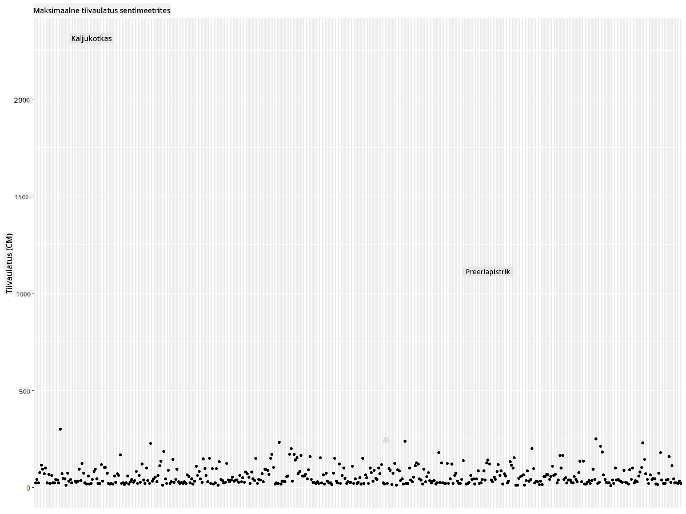
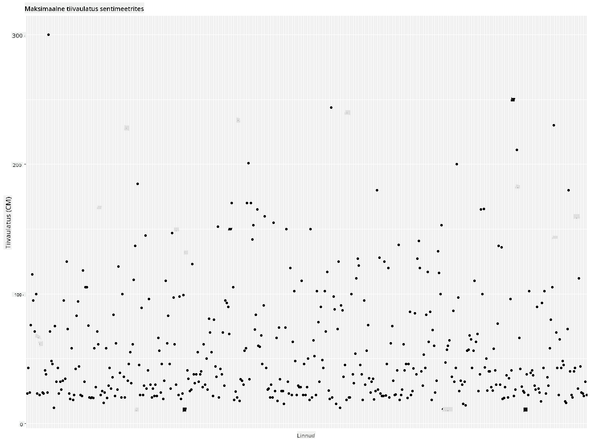
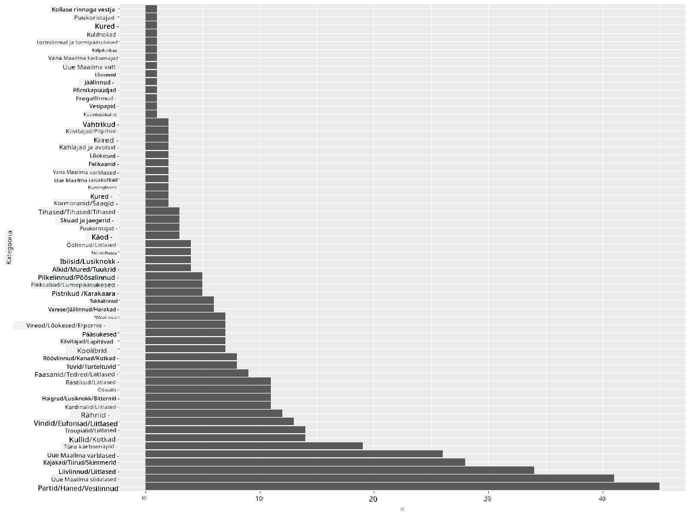
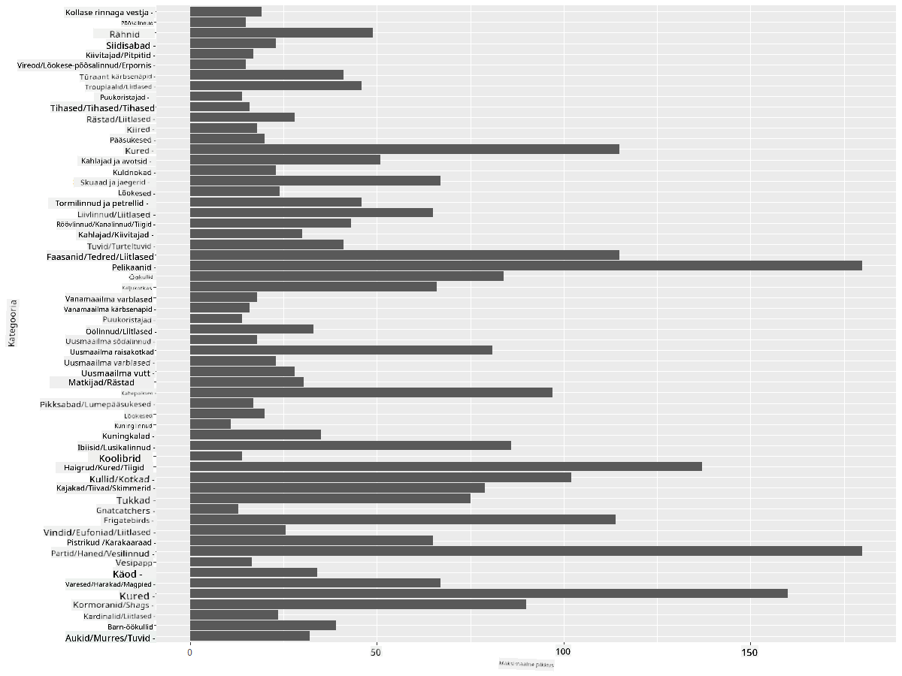

<!--
CO_OP_TRANSLATOR_METADATA:
{
  "original_hash": "22acf28f518a4769ea14fa42f4734b9f",
  "translation_date": "2025-10-11T16:02:01+00:00",
  "source_file": "3-Data-Visualization/R/09-visualization-quantities/README.md",
  "language_code": "et"
}
-->
# Koguste visualiseerimine
| ](https://github.com/microsoft/Data-Science-For-Beginners/blob/main/sketchnotes/09-Visualizing-Quantities.png)|
|:---:|
| Koguste visualiseerimine - _Sketchnote autorilt [@nitya](https://twitter.com/nitya)_ |

Selles õppetükis uurid, kuidas kasutada mitmeid R-i pakettide teeke, et õppida looma huvitavaid visualiseeringuid, mis keskenduvad koguste kontseptsioonile. Kasutades puhastatud andmestikku Minnesota lindude kohta, saad teada palju huvitavaid fakte kohaliku eluslooduse kohta.  
## [Eelloengu viktoriin](https://purple-hill-04aebfb03.1.azurestaticapps.net/quiz/16)

## Tiivaulatuse vaatlemine ggplot2 abil
Suurepärane teek erinevate lihtsate ja keerukate graafikute ning diagrammide loomiseks on [ggplot2](https://cran.r-project.org/web/packages/ggplot2/index.html). Üldiselt hõlmab andmete graafikute loomise protsess nende teekide abil andmestiku osade tuvastamist, mida soovid sihtida, vajalike andmetransformatsioonide tegemist, x- ja y-telje väärtuste määramist, graafiku tüübi valimist ja graafiku kuvamist.

`ggplot2` on süsteem graafikute loomiseks deklaratiivselt, tuginedes graafikute grammatikale (The Grammar of Graphics). [Graafikute grammatika](https://en.wikipedia.org/wiki/Ggplot2) on üldine skeem andmete visualiseerimiseks, mis jagab graafikud semantilisteks komponentideks, nagu skaalad ja kihid. Teisisõnu, `ggplot2` muudab univariantsete või multivariantsete andmete graafikute ja diagrammide loomise vähese koodiga lihtsaks, mistõttu on see R-i visualiseerimisteekide seas kõige populaarsem. Kasutaja määrab, kuidas `ggplot2` peaks muutujad esteetikaga siduma, milliseid graafilisi primitiive kasutada, ja `ggplot2` hoolitseb ülejäänu eest.

> ✅ Graafik = Andmed + Esteetika + Geomeetria  
> - Andmed viitavad andmestikule  
> - Esteetika näitab uuritavaid muutujaid (x- ja y-muutujad)  
> - Geomeetria viitab graafiku tüübile (joongraafik, tulpdiagramm jne)  

Vali oma andmete ja loo järgi, mida soovid graafiku kaudu jutustada, parim geomeetria (graafiku tüüp).  

> - Trendide analüüsimiseks: joon, tulp  
> - Väärtuste võrdlemiseks: tulp, sektordiagramm, hajusdiagramm  
> - Osade ja terviku suhte näitamiseks: sektordiagramm  
> - Andmete jaotuse näitamiseks: hajusdiagramm, tulp  
> - Väärtustevaheliste suhete näitamiseks: joon, hajusdiagramm, mullidiagramm  

✅ Vaata ka seda kirjeldavat [spikrit](https://nyu-cdsc.github.io/learningr/assets/data-visualization-2.1.pdf) ggplot2 kohta.

## Loo joongraafik lindude tiivaulatuse väärtuste kohta

Ava R-i konsool ja impordi andmestik.  
> Märkus: Andmestik asub selle repo juurikas `/data` kaustas.

Impordime andmestiku ja vaatame andmete algust (esimesed 5 rida).

```r
birds <- read.csv("../../data/birds.csv",fileEncoding="UTF-8-BOM")
head(birds)
```
Andmete alguses on segu tekstist ja numbritest:

|      | Nimi                          | Teaduslik nimi         | Kategooria            | Selts        | Sugukond | Perekond    | Kaitsestaatus        | MinPikkus | MaxPikkus | MinKehakaal | MaxKehakaal | MinTiivaulatus | MaxTiivaulatus |
| ---: | :---------------------------- | :--------------------- | :-------------------- | :----------- | :------- | :---------- | :------------------ | --------: | --------: | ----------: | ----------: | -------------: | -------------: |
|    0 | Mustkõht-vilepart             | Dendrocygna autumnalis | Pardid/Haned/Vesilinnud | Anseriformes | Anatidae | Dendrocygna | LC                  |        47 |        56 |         652 |        1020 |             76 |             94 |
|    1 | Kollakas-vilepart             | Dendrocygna bicolor    | Pardid/Haned/Vesilinnud | Anseriformes | Anatidae | Dendrocygna | LC                  |        45 |        53 |         712 |        1050 |             85 |             93 |
|    2 | Lumepart                      | Anser caerulescens     | Pardid/Haned/Vesilinnud | Anseriformes | Anatidae | Anser       | LC                  |        64 |        79 |        2050 |        4050 |            135 |            165 |
|    3 | Rossi part                    | Anser rossii           | Pardid/Haned/Vesilinnud | Anseriformes | Anatidae | Anser       | LC                  |      57.3 |        64 |        1066 |        1567 |            113 |            116 |
|    4 | Suur-valgefrondivalgehan      | Anser albifrons        | Pardid/Haned/Vesilinnud | Anseriformes | Anatidae | Anser       | LC                  |        64 |        81 |        1930 |        3310 |            130 |            165 |

Alustame mõne numbrilise andme graafikule kandmisega, kasutades lihtsat joongraafikut. Oletame, et soovid vaadata nende huvitavate lindude maksimaalset tiivaulatust.

```r
install.packages("ggplot2")
library("ggplot2")
ggplot(data=birds, aes(x=Name, y=MaxWingspan,group=1)) +
  geom_line() 
```
Siin installid `ggplot2` paketi ja impordid selle tööruumi, kasutades käsku `library("ggplot2")`. Graafiku loomiseks ggplotis kasutatakse funktsiooni `ggplot()`, kus määrad andmestiku, x- ja y-muutujad atribuutidena. Antud juhul kasutame funktsiooni `geom_line()`, kuna eesmärk on luua joongraafik.


Mida märkad kohe? Tundub, et on vähemalt üks kõrvalekalle - see on päris suur tiivaulatus! 2000+ sentimeetrine tiivaulatus võrdub rohkem kui 20 meetriga - kas Minnesotas rändavad pterodaktülid? Uurime lähemalt.

Kuigi võid Excelis kiiresti sorteerida, et leida need kõrvalekalded, mis tõenäoliselt on kirjavead, jätkame visualiseerimisprotsessi graafiku seest töötades.

Lisa x-teljele sildid, et näidata, millised linnud on küsimuse all:

```r
ggplot(data=birds, aes(x=Name, y=MaxWingspan,group=1)) +
  geom_line() +
  theme(axis.text.x = element_text(angle = 45, hjust=1))+
  xlab("Birds") +
  ylab("Wingspan (CM)") +
  ggtitle("Max Wingspan in Centimeters")
```
Määrame nurga `theme` sees ja määrame x- ja y-telje sildid `xlab()` ja `ylab()` abil. `ggtitle()` annab graafikule/diagrammile nime.


Isegi kui siltide pööramine on seatud 45 kraadi, on neid liiga palju, et lugeda. Proovime teistsugust strateegiat: märgistame ainult kõrvalekalded ja määrame sildid graafiku sisse. Võid kasutada hajusdiagrammi, et siltidele rohkem ruumi teha:

```r
ggplot(data=birds, aes(x=Name, y=MaxWingspan,group=1)) +
  geom_point() +
  geom_text(aes(label=ifelse(MaxWingspan>500,as.character(Name),'')),hjust=0,vjust=0) + 
  theme(axis.title.x=element_blank(), axis.text.x=element_blank(), axis.ticks.x=element_blank())
  ylab("Wingspan (CM)") +
  ggtitle("Max Wingspan in Centimeters") + 
```
Mis siin toimub? Kasutasid funktsiooni `geom_point()`, et graafikule hajuspunkte lisada. Sellega lisasid sildid lindudele, kelle `MaxWingspan > 500`, ja peitsid x-telje sildid, et graafikut vähem segada.

Mida avastad?



## Filtreeri oma andmeid

Nii kiilaskotkas kui ka preeriapistrik, kuigi tõenäoliselt väga suured linnud, tunduvad olevat valesti märgistatud, maksimaalse tiivaulatuse väärtusele on lisatud üks null. On ebatõenäoline, et kohtad kiilaskotkast 25-meetrise tiivaulatusega, aga kui siiski, siis anna meile teada! Loome uue andmestiku ilma nende kahe kõrvalekalleta:

```r
birds_filtered <- subset(birds, MaxWingspan < 500)

ggplot(data=birds_filtered, aes(x=Name, y=MaxWingspan,group=1)) +
  geom_point() +
  ylab("Wingspan (CM)") +
  xlab("Birds") +
  ggtitle("Max Wingspan in Centimeters") + 
  geom_text(aes(label=ifelse(MaxWingspan>500,as.character(Name),'')),hjust=0,vjust=0) +
  theme(axis.text.x=element_blank(), axis.ticks.x=element_blank())
```
Lõime uue andmestiku `birds_filtered` ja seejärel joonistasime hajusdiagrammi. Kõrvalekallete filtreerimisega on sinu andmed nüüd ühtsemad ja arusaadavamad.



Nüüd, kui meil on vähemalt tiivaulatuse osas puhtam andmestik, avastame rohkem nende lindude kohta.

Kuigi joon- ja hajusdiagrammid võivad kuvada teavet andmeväärtuste ja nende jaotuste kohta, tahame mõelda selle andmestiku sisemistele väärtustele. Võid luua visualiseeringuid, et vastata järgmistele kogustega seotud küsimustele:

> Kui palju linnukategooriaid on ja millised on nende arvud?  
> Kui palju linde on välja surnud, ohustatud, haruldased või tavalised?  
> Kui palju on erinevaid perekondi ja seltside arvu Linnaeuse terminoloogias?  
## Uuri tulpdiagramme

Tulpdiagrammid on praktilised, kui pead näitama andmete rühmitusi. Uurime, millised linnukategooriad selles andmestikus eksisteerivad, et näha, milline on kõige levinum arvuliselt.  
Loome tulpdiagrammi filtreeritud andmete põhjal.

```r
install.packages("dplyr")
install.packages("tidyverse")

library(lubridate)
library(scales)
library(dplyr)
library(ggplot2)
library(tidyverse)

birds_filtered %>% group_by(Category) %>%
  summarise(n=n(),
  MinLength = mean(MinLength),
  MaxLength = mean(MaxLength),
  MinBodyMass = mean(MinBodyMass),
  MaxBodyMass = mean(MaxBodyMass),
  MinWingspan=mean(MinWingspan),
  MaxWingspan=mean(MaxWingspan)) %>% 
  gather("key", "value", - c(Category, n)) %>%
  ggplot(aes(x = Category, y = value, group = key, fill = key)) +
  geom_bar(stat = "identity") +
  scale_fill_manual(values = c("#D62728", "#FF7F0E", "#8C564B","#2CA02C", "#1F77B4", "#9467BD")) +                   
  xlab("Category")+ggtitle("Birds of Minnesota")

```
Järgmises koodilõigus installime [dplyr](https://www.rdocumentation.org/packages/dplyr/versions/0.7.8) ja [lubridate](https://www.rdocumentation.org/packages/lubridate/versions/1.8.0) paketid, et aidata andmeid manipuleerida ja rühmitada, et joonistada virnastatud tulpdiagramm. Kõigepealt rühmitad andmed linnu `Category` järgi ja seejärel summeerid `MinLength`, `MaxLength`, `MinBodyMass`, `MaxBodyMass`, `MinWingspan`, `MaxWingspan` veerud. Seejärel joonistad tulpdiagrammi, kasutades `ggplot2` paketti, määrates erinevate kategooriate värvid ja sildid.


See tulpdiagramm on aga loetamatu, kuna seal on liiga palju rühmitamata andmeid. Pead valima ainult andmed, mida soovid graafikule kanda, seega vaatame lindude pikkust nende kategooria põhjal.

Filtreeri oma andmed, et lisada ainult linnu kategooria.

Kuna kategooriaid on palju, võid kuvada selle diagrammi vertikaalselt ja kohandada selle kõrgust, et mahutada kõik andmed:

```r
birds_count<-dplyr::count(birds_filtered, Category, sort = TRUE)
birds_count$Category <- factor(birds_count$Category, levels = birds_count$Category)
ggplot(birds_count,aes(Category,n))+geom_bar(stat="identity")+coord_flip()
```
Kõigepealt loendad unikaalsed väärtused `Category` veerus ja seejärel sorteerid need uude andmestikku `birds_count`. See sorteeritud andmestik on seejärel samal tasemel faktoreeritud, et see graafikul sorteeritud kujul kuvataks. Kasutades `ggplot2`, joonistad andmed tulpdiagrammi. `coord_flip()` kuvab horisontaalsed tulbad.



See tulpdiagramm annab hea ülevaate lindude arvust igas kategoorias. Ühe pilguga näed, et suurim arv linde selles piirkonnas kuulub Pardid/Haned/Vesilinnud kategooriasse. Minnesota on "10 000 järve maa", seega pole see üllatav!

✅ Proovi selle andmestiku põhjal mõnda muud loendust. Kas miski üllatab sind?

## Andmete võrdlemine

Võid proovida erinevaid rühmitatud andmete võrdlusi, luues uusi telgi. Proovi võrdlust linnu maksimaalse pikkuse kohta, lähtudes selle kategooriast:

```r
birds_grouped <- birds_filtered %>%
  group_by(Category) %>%
  summarise(
  MaxLength = max(MaxLength, na.rm = T),
  MinLength = max(MinLength, na.rm = T)
           ) %>%
  arrange(Category)
  
ggplot(birds_grouped,aes(Category,MaxLength))+geom_bar(stat="identity")+coord_flip()
```
Rühmitame `birds_filtered` andmed `Category` järgi ja seejärel joonistame tulpdiagrammi.



Siin pole midagi üllatavat: koolibrid on maksimaalse pikkuse poolest kõige väiksemad võrreldes pelikani või hanega. On hea, kui andmed on loogilised!

Võid luua huvitavamaid tulpdiagramme, superimposeerides andmeid. Superimposeerime minimaalse ja maksimaalse pikkuse antud linnukategooria kohta:

```r
ggplot(data=birds_grouped, aes(x=Category)) +
  geom_bar(aes(y=MaxLength), stat="identity", position ="identity",  fill='blue') +
  geom_bar(aes(y=MinLength), stat="identity", position="identity", fill='orange')+
  coord_flip()
```


## 🚀 Väljakutse

See linnuandmestik pakub rikkalikku teavet erinevat tüüpi lindude kohta konkreetses ökosüsteemis. Otsi internetist ja vaata, kas leiad muid linnuandmestikke. Harjuta graafikute ja diagrammide loomist nende lindude kohta, et avastada fakte, mida sa ei teadnud.  
## [Järelloengu viktoriin](https://purple-hill-04aebfb03.1.azurestaticapps.net/quiz/17)

## Ülevaade ja iseseisev õppimine

See esimene õppetund andis sulle teavet selle kohta, kuidas kasutada `ggplot2` koguste visualiseerimiseks. Tee uurimistööd teiste viiside kohta, kuidas andmestikke visualiseerimiseks kasutada. Uuri ja otsi andmestikke, mida saaksid visualiseerida, kasutades teisi pakette nagu [Lattice](https://stat.ethz.ch/R-manual/R-devel/library/lattice/html/Lattice.html) ja [Plotly](https://github.com/plotly/plotly.R#readme).

## Ülesanne
[Joongraafikud, hajusdiagrammid ja tulpdiagrammid](assignment.md)

---

**Lahtiütlus**:  
See dokument on tõlgitud AI tõlketeenuse [Co-op Translator](https://github.com/Azure/co-op-translator) abil. Kuigi püüame tagada täpsust, palume arvestada, et automaatsed tõlked võivad sisaldada vigu või ebatäpsusi. Algne dokument selle algses keeles tuleks pidada autoriteetseks allikaks. Olulise teabe puhul soovitame kasutada professionaalset inimtõlget. Me ei vastuta selle tõlke kasutamisest tulenevate arusaamatuste või valesti tõlgenduste eest.