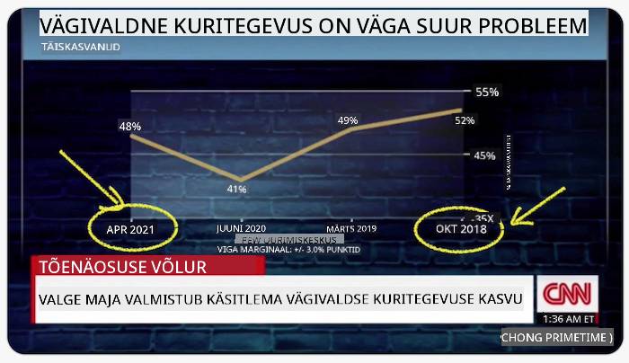
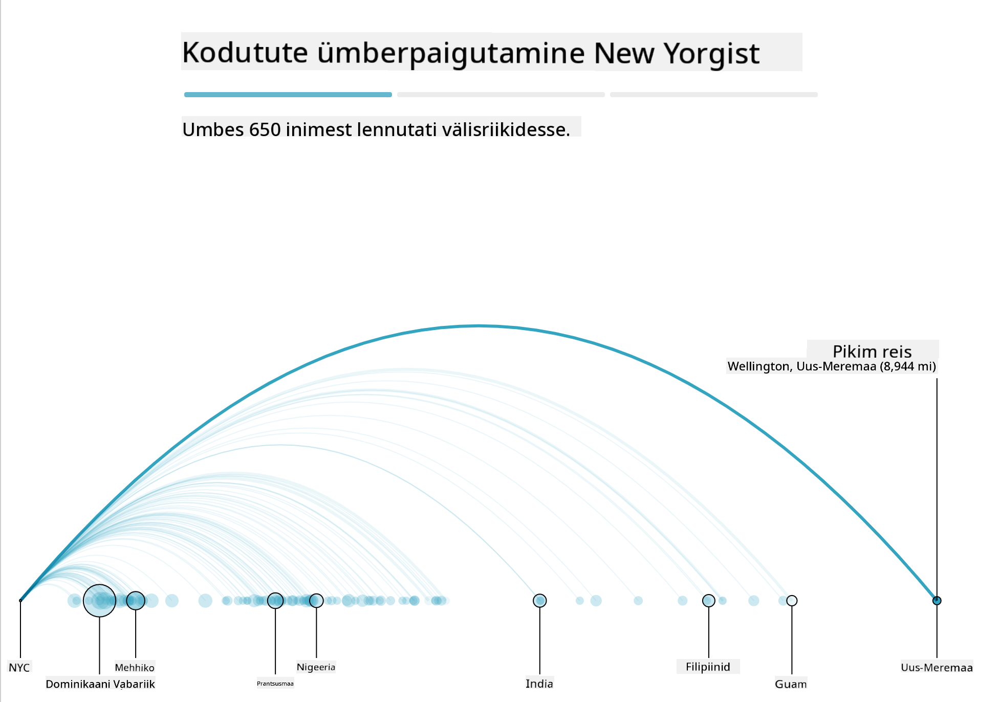

<!--
CO_OP_TRANSLATOR_METADATA:
{
  "original_hash": "b4039f1c76548d144a0aee0bf28304ec",
  "translation_date": "2025-10-11T15:59:52+00:00",
  "source_file": "3-Data-Visualization/R/13-meaningful-vizualizations/README.md",
  "language_code": "et"
}
-->
# Tähendusrikaste visualisatsioonide loomine

| ](../../../sketchnotes/13-MeaningfulViz.png)|
|:---:|
| Tähendusrikkad visualisatsioonid - _Sketchnote by [@nitya](https://twitter.com/nitya)_ |

> "Kui piinad andmeid piisavalt kaua, tunnistavad need kõike" -- [Ronald Coase](https://en.wikiquote.org/wiki/Ronald_Coase)

Üks andmeteadlase põhilisi oskusi on võime luua tähendusrikkaid andmevisualisatsioone, mis aitavad vastata küsimustele, mis sul võivad tekkida. Enne andmete visualiseerimist tuleb veenduda, et need on puhastatud ja ette valmistatud, nagu tegid varasemates tundides. Pärast seda saad hakata otsustama, kuidas andmeid kõige paremini esitada.

Selles tunnis vaatame üle:

1. Kuidas valida õige diagrammitüüp
2. Kuidas vältida eksitavaid diagramme
3. Kuidas kasutada värve
4. Kuidas kujundada diagramme loetavuse parandamiseks
5. Kuidas luua animeeritud või 3D diagrammilahendusi
6. Kuidas luua loovaid visualisatsioone

## [Eeltesti küsimustik](https://purple-hill-04aebfb03.1.azurestaticapps.net/quiz/24)

## Valige õige diagrammitüüp

Eelnevates tundides katsetasite erinevate huvitavate andmevisualisatsioonide loomist, kasutades Matplotlibi ja Seabornit diagrammide jaoks. Üldiselt saate valida [õige diagrammitüübi](https://chartio.com/learn/charts/how-to-select-a-data-vizualization/) vastavalt küsimusele, mida soovite lahendada, kasutades järgmist tabelit:

| Vajadus:                   | Kasutage:                      |
| -------------------------- | ------------------------------ |
| Näidata andmete trende ajas | Joon                          |
| Kategooriate võrdlemine     | Tulp, Sektordiagramm           |
| Kogusummade võrdlemine      | Sektordiagramm, Virntulp       |
| Näidata seoseid             | Hajuvdiagramm, Joon, Facet, Kahe joone diagramm |
| Näidata jaotusi             | Hajuvdiagramm, Histogramm, Kastdiagramm |
| Näidata proportsioone       | Sektordiagramm, Donut, Waffle |

> ✅ Sõltuvalt andmete olemusest võib olla vajalik teisendada tekstiline andmestik numbriliseks, et diagramm seda toetaks.

## Vältige eksitamist

Isegi kui andmeteadlane valib õige diagrammi õigete andmete jaoks, on palju viise, kuidas andmeid saab esitada viisil, mis tõestab teatud seisukohta, sageli andmete enda arvelt. Eksitavate diagrammide ja infograafikate näiteid on palju!

[](https://www.youtube.com/watch?v=oX74Nge8Wkw "Kuidas diagrammid valetavad")

> 🎥 Klõpsake ülaltoodud pildil, et vaadata konverentsi ettekannet eksitavate diagrammide kohta

See diagramm pöörab X-telje ümber, et näidata tõe vastandit, tuginedes kuupäevadele:



[See diagramm](https://media.firstcoastnews.com/assets/WTLV/images/170ae16f-4643-438f-b689-50d66ca6a8d8/170ae16f-4643-438f-b689-50d66ca6a8d8_1140x641.jpg) on veelgi eksitavam, kuna silm tõmmatakse paremale, et järeldada, et aja jooksul on COVID-i juhtumid erinevates maakondades vähenenud. Tegelikult, kui vaatate kuupäevi lähemalt, leiate, et need on ümber korraldatud, et anda eksitav langustrend.


See kurikuulus näide kasutab värvi JA pööratud Y-telge eksitamiseks: selle asemel, et järeldada, et relvadega seotud surmad kasvasid pärast relvasõbraliku seadusandluse vastuvõtmist, petab silm, et arvata vastupidist:


See kummaline diagramm näitab, kuidas proportsioone saab manipuleerida, naljakal moel:


Võrdlemine, mis ei ole võrreldav, on veel üks kahtlane trikk. On olemas [suurepärane veebisait](https://tylervigen.com/spurious-correlations), mis käsitleb 'juhuslikke korrelatsioone', näidates 'fakte', mis seostavad näiteks Maine'i lahutuste määra ja margariini tarbimist. Redditi grupp kogub ka [andmete koledaid kasutusviise](https://www.reddit.com/r/dataisugly/top/?t=all).

Oluline on mõista, kui kergesti silm võib eksitavate diagrammide poolt petta saada. Isegi kui andmeteadlase kavatsus on hea, võib halva diagrammitüübi valik, näiteks sektordiagramm, mis näitab liiga palju kategooriaid, olla eksitav.

## Värv

Nagu nägite ülaltoodud 'Florida relvavägivalla' diagrammis, võib värv lisada diagrammidele täiendava tähenduskihi, eriti kui need ei ole loodud selliste raamatukogude abil nagu ggplot2 ja RColorBrewer, mis sisaldavad erinevaid kontrollitud värviraamatukogusid ja palette. Kui teete diagrammi käsitsi, uurige veidi [värviteooriat](https://colormatters.com/color-and-design/basic-color-theory).

> ✅ Olge teadlik, et diagrammide kujundamisel on juurdepääsetavus oluline aspekt visualiseerimisel. Mõned teie kasutajad võivad olla värvipimedad - kas teie diagramm on visuaalsete häiretega kasutajatele hästi nähtav?

Olge ettevaatlik, kui valite diagrammi jaoks värve, kuna värv võib edastada tähendust, mida te ei pruugi kavatseda. Ülaltoodud 'roosad daamid' 'kõrguse' diagrammis edastavad selgelt 'naiselikku' tähendust, mis lisab diagrammi iseärasusele.

Kuigi [värvide tähendus](https://colormatters.com/color-symbolism/the-meanings-of-colors) võib olla erinev maailma eri osades ja kipub muutuma vastavalt nende varjundile, on üldiselt värvide tähendused järgmised:

| Värv   | Tähendus            |
| ------ | ------------------- |
| punane | jõud                |
| sinine | usaldus, lojaalsus  |
| kollane| õnn, ettevaatlikkus |
| roheline| ökoloogia, õnn, kadedus |
| lilla  | õnn                 |
| oranž  | elujõulisus         |

Kui teil on ülesandeks luua diagramm kohandatud värvidega, veenduge, et teie diagrammid oleksid nii juurdepääsetavad kui ka värv, mida valite, vastaks tähendusele, mida soovite edastada.

## Diagrammide kujundamine loetavuse parandamiseks

Diagrammid ei ole tähendusrikkad, kui need ei ole loetavad! Võtke hetk, et kaaluda diagrammi laiuse ja kõrguse kujundamist, et see sobiks hästi teie andmetega. Kui üks muutuja (näiteks kõik 50 osariiki) tuleb kuvada, näidake neid vertikaalselt Y-teljel, kui võimalik, et vältida horisontaalselt keritavat diagrammi.

Märgistage oma teljed, lisage vajadusel legend ja pakkuge tööriistavihjeid andmete paremaks mõistmiseks.

Kui teie andmed on tekstilised ja X-teljel pikad, saate teksti nurga alla pöörata, et parandada loetavust. [plot3D](https://cran.r-project.org/web/packages/plot3D/index.html) pakub 3D-plotimist, kui teie andmed seda toetavad. Selle abil saab luua keerukaid andmevisualisatsioone.


## Animatsioon ja 3D diagrammi kuvamine

Mõned parimad tänapäeva andmevisualisatsioonid on animeeritud. Shirley Wu on loonud hämmastavaid visualisatsioone D3 abil, näiteks '[filmililled](http://bl.ocks.org/sxywu/raw/d612c6c653fb8b4d7ff3d422be164a5d/)', kus iga lill on filmi visualisatsioon. Teine näide Guardianile on 'bussed out', interaktiivne kogemus, mis ühendab visualisatsioone Greensocki ja D3-ga ning scrollytelling artikli formaati, et näidata, kuidas NYC lahendab kodutute probleemi, saates inimesi linnast välja.



> "Bussed Out: Kuidas Ameerika liigutab oma kodutuid" [Guardianist](https://www.theguardian.com/us-news/ng-interactive/2017/dec/20/bussed-out-america-moves-homeless-people-country-study). Visualisatsioonid: Nadieh Bremer & Shirley Wu

Kuigi see tund ei ole piisav, et süvitsi õpetada neid võimsaid visualiseerimisraamatukogusid, proovige D3-d Vue.js rakenduses, kasutades raamatukogu, et kuvada visualisatsiooni raamatust "Ohtlikud suhted" kui animeeritud sotsiaalvõrgustikku.

> "Les Liaisons Dangereuses" on epistolaarne romaan ehk romaan, mis on esitatud kirjade seeriana. Kirjutatud 1782. aastal Choderlos de Laclos'i poolt, jutustab see loo kahest Prantsuse aristokraatia peategelasest 18. sajandi lõpus, Vicomte de Valmontist ja Marquise de Merteuilist, kes mõlemad lõpuks hukkuvad, kuid mitte enne, kui nad on põhjustanud palju sotsiaalset kahju. Romaan areneb kirjade seeriana, mis on kirjutatud erinevatele inimestele nende ringkondades, kättemaksu kavandamiseks või lihtsalt probleeme tekitamiseks. Looge nende kirjade visualisatsioon, et avastada narratiivi peamised tegelased visuaalselt.

Te lõpetate veebirakenduse, mis kuvab animeeritud vaate sellest sotsiaalvõrgustikust. See kasutab raamatukogu, mis loodi [võrgustiku visualiseerimiseks](https://github.com/emiliorizzo/vue-d3-network) Vue.js ja D3 abil. Kui rakendus töötab, saate ekraanil sõlmi liigutada, et andmeid ümber paigutada.


## Projekt: Looge diagramm, mis näitab võrgustikku D3.js abil

> Selle tunni kaust sisaldab `solution` kausta, kus leiate lõpetatud projekti, mida saate kasutada viitena.

1. Järgige juhiseid README.md failis starter-kausta juurfailis. Veenduge, et teil oleks NPM ja Node.js teie masinas töötamas, enne kui installite projekti sõltuvused.

2. Avage `starter/src` kaust. Leiate `assets` kausta, kus on .json fail kõigi romaani kirjadega, nummerdatud, koos 'to' ja 'from' annotatsioonidega.

3. Täiendage koodi `components/Nodes.vue` failis, et võimaldada visualiseerimist. Otsige meetodit nimega `createLinks()` ja lisage järgmine pesastatud tsükkel.

Tsüklige läbi .json objekti, et koguda kirjade 'to' ja 'from' andmed ning koostada `links` objekt, mida visualiseerimisraamatukogu saab kasutada:

```javascript
//loop through letters
      let f = 0;
      let t = 0;
      for (var i = 0; i < letters.length; i++) {
          for (var j = 0; j < characters.length; j++) {
              
            if (characters[j] == letters[i].from) {
              f = j;
            }
            if (characters[j] == letters[i].to) {
              t = j;
            }
        }
        this.links.push({ sid: f, tid: t });
      }
  ```

Käivitage oma rakendus terminalist (npm run serve) ja nautige visualiseerimist!

## 🚀 Väljakutse

Tehke internetis ringkäik, et avastada eksitavaid visualisatsioone. Kuidas autor kasutajat petab ja kas see on tahtlik? Proovige visualisatsioone parandada, et näidata, kuidas need peaksid välja nägema.

## [Järeltesti küsimustik](https://purple-hill-04aebfb03.1.azurestaticapps.net/quiz/25)

## Ülevaade ja iseseisev õppimine

Siin on mõned artiklid eksitavate andmevisualisatsioonide kohta:

https://gizmodo.com/how-to-lie-with-data-visualization-1563576606

http://ixd.prattsi.org/2017/12/visual-lies-usability-in-deceptive-data-visualizations/

Vaadake neid huvitavaid visualisatsioone ajalooliste varade ja artefaktide kohta:

https://handbook.pubpub.org/

Lugege seda artiklit, kuidas animatsioon võib teie visualisatsioone täiustada:

https://medium.com/@EvanSinar/use-animation-to-supercharge-data-visualization-cd905a882ad4

## Ülesanne

[Loo oma kohandatud visualisatsioon](assignment.md)

---

**Lahtiütlus**:  
See dokument on tõlgitud AI tõlketeenuse [Co-op Translator](https://github.com/Azure/co-op-translator) abil. Kuigi püüame tagada täpsust, palume arvestada, et automaatsed tõlked võivad sisaldada vigu või ebatäpsusi. Algne dokument selle algses keeles tuleks pidada autoriteetseks allikaks. Olulise teabe puhul soovitame kasutada professionaalset inimtõlget. Me ei vastuta selle tõlke kasutamisest tulenevate arusaamatuste või valesti tõlgenduste eest.