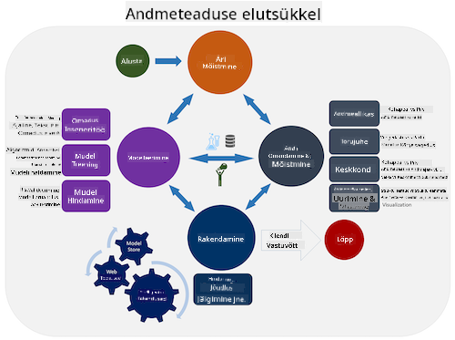
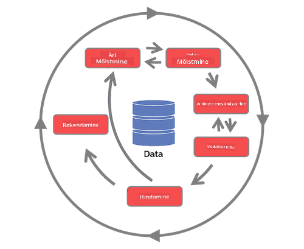

<!--
CO_OP_TRANSLATOR_METADATA:
{
  "original_hash": "07e12a25d20b8f191e3cb651c27fdb2b",
  "translation_date": "2025-10-11T15:48:02+00:00",
  "source_file": "4-Data-Science-Lifecycle/14-Introduction/README.md",
  "language_code": "et"
}
-->
# Sissejuhatus andmeteaduse elutsüklisse

| ](../../sketchnotes/14-DataScience-Lifecycle.png)|
|:---:|
| Sissejuhatus andmeteaduse elutsüklisse - _Sketchnote autorilt [@nitya](https://twitter.com/nitya)_ |

## [Eelloengu viktoriin](https://ff-quizzes.netlify.app/en/ds/quiz/26)

Praeguseks olete ilmselt mõistnud, et andmeteadus on protsess. Seda protsessi saab jagada viieks etapiks:

- Andmete kogumine
- Töötlemine
- Analüüs
- Kommunikatsioon
- Hooldus

See õppetund keskendub elutsükli kolmele osale: andmete kogumine, töötlemine ja hooldus.

> Foto autor [Berkeley School of Information](https://ischoolonline.berkeley.edu/data-science/what-is-data-science/)

## Andmete kogumine

Elutsükli esimene etapp on väga oluline, kuna järgmised etapid sõltuvad sellest. Tegelikult on see nagu kaks etappi ühes: andmete hankimine ja eesmärkide ning lahendamist vajavate probleemide määratlemine. Projekti eesmärkide määratlemine nõuab sügavamat konteksti probleemi või küsimuse kohta. Kõigepealt peame tuvastama ja hankima need, kelle probleem vajab lahendamist. Need võivad olla ettevõtte osapooled või projekti sponsorid, kes aitavad tuvastada, kes või mis sellest projektist kasu saab, samuti mida ja miks nad seda vajavad. Hästi määratletud eesmärk peaks olema mõõdetav ja kvantifitseeritav, et määratleda aktsepteeritav tulemus.

Küsimused, mida andmeteadlane võib küsida:
- Kas seda probleemi on varem käsitletud? Mida avastati?
- Kas kõik osapooled mõistavad eesmärki ja sihti?
- Kas on ebaselgust ja kuidas seda vähendada?
- Millised on piirangud?
- Milline võiks olla lõpptulemus?
- Kui palju ressursse (aeg, inimesed, arvutusvõimsus) on saadaval?

Järgmine samm on vajalike andmete tuvastamine, kogumine ja lõpuks nende uurimine, et saavutada määratletud eesmärgid. Sellel hankimise etapil peavad andmeteadlased hindama ka andmete hulka ja kvaliteeti. See nõuab mõningast andmete uurimist, et kinnitada, et saadud andmed toetavad soovitud tulemuse saavutamist.

Küsimused, mida andmeteadlane võib andmete kohta küsida:
- Millised andmed on mulle juba kättesaadavad?
- Kes omab neid andmeid?
- Millised on privaatsusprobleemid?
- Kas mul on piisavalt andmeid selle probleemi lahendamiseks?
- Kas andmete kvaliteet on selle probleemi jaoks piisav?
- Kui ma avastan nende andmete kaudu täiendavat teavet, kas peaksime kaaluma eesmärkide muutmist või ümbermõtestamist?

## Töötlemine

Elutsükli töötlemise etapp keskendub mustrite avastamisele andmetes ja modelleerimisele. Mõned tehnikad, mida töötlemise etapis kasutatakse, nõuavad statistilisi meetodeid mustrite avastamiseks. Tavaliselt oleks see inimese jaoks suurte andmekogumite puhul tülikas ülesanne, mistõttu kasutatakse arvuteid, et protsessi kiirendada. See etapp on ka koht, kus andmeteadus ja masinõpe lõikuvad. Nagu esimeses õppetunnis õppisite, on masinõpe protsess, mille käigus luuakse mudeleid andmete mõistmiseks. Mudelid on andmete muutujate vaheliste suhete esitus, mis aitavad prognoosida tulemusi.

Levinud tehnikad, mida selles etapis kasutatakse, on kaetud ML algajatele mõeldud õppekavas. Järgige linke, et neist rohkem teada saada:

- [Klassifikatsioon](https://github.com/microsoft/ML-For-Beginners/tree/main/4-Classification): Andmete organiseerimine kategooriatesse tõhusamaks kasutamiseks.
- [Klasterdamine](https://github.com/microsoft/ML-For-Beginners/tree/main/5-Clustering): Andmete rühmitamine sarnastesse gruppidesse.
- [Regressioon](https://github.com/microsoft/ML-For-Beginners/tree/main/2-Regression): Muutujate vaheliste suhete määramine väärtuste prognoosimiseks või ennustamiseks.

## Hooldus

Elutsükli diagrammil võisite märgata, et hooldus asub andmete kogumise ja töötlemise vahel. Hooldus on pidev protsess, mis hõlmab andmete haldamist, salvestamist ja turvalisuse tagamist kogu projekti vältel ning seda tuleks arvestada kogu projekti jooksul.

### Andmete salvestamine

Andmete salvestamise viis ja koht võivad mõjutada salvestamise kulusid ning andmete juurdepääsu kiirust. Sellised otsused ei pruugi olla ainult andmeteadlase tehtud, kuid nad võivad leida end tegemas valikuid, kuidas andmetega töötada, lähtudes sellest, kuidas need on salvestatud.

Siin on mõned kaasaegsete andmesalvestussüsteemide aspektid, mis võivad neid valikuid mõjutada:

**Kohapealne vs kaugsalvestus vs avalik või privaatne pilv**

Kohapealne salvestus tähendab andmete haldamist oma seadmetel, näiteks serveril, mille kõvaketastel andmed asuvad, samas kui kaugsalvestus tugineb seadmetele, mida te ei oma, näiteks andmekeskusele. Avalik pilv on populaarne valik andmete salvestamiseks, mis ei nõua teadmisi selle kohta, kuidas või kus täpselt andmed on salvestatud, kusjuures avalik viitab ühtsele infrastruktuurile, mida jagavad kõik pilve kasutajad. Mõned organisatsioonid järgivad rangeid turvapoliitikaid, mis nõuavad täielikku juurdepääsu seadmetele, kus andmed on salvestatud, ja kasutavad privaatset pilve, mis pakub oma pilveteenuseid. Pilvesalvestuse kohta õpite rohkem [hilisemates õppetundides](https://github.com/microsoft/Data-Science-For-Beginners/tree/main/5-Data-Science-In-Cloud).

**Külmad vs kuumad andmed**

Mudelite treenimisel võib teil vaja minna rohkem treeningandmeid. Kui olete oma mudeliga rahul, saabub rohkem andmeid, et mudel saaks oma eesmärki täita. Igal juhul suureneb andmete salvestamise ja neile juurdepääsu maksumus, kui neid koguneb rohkem. Harva kasutatavate andmete, mida nimetatakse külmadeks andmeteks, eraldamine sageli kasutatavatest kuumadest andmetest võib olla odavam andmete salvestamise võimalus riistvara või tarkvarateenuste kaudu. Kui külmi andmeid on vaja, võib nende kättesaamine võtta veidi kauem aega kui kuumade andmete puhul.

### Andmete haldamine

Andmetega töötades võite avastada, et osa andmetest vajab puhastamist, kasutades mõningaid tehnikaid, mis on kaetud õppetunnis, mis keskendub [andmete ettevalmistamisele](https://github.com/microsoft/Data-Science-For-Beginners/tree/main/2-Working-With-Data/08-data-preparation), et luua täpseid mudeleid. Kui saabuvad uued andmed, vajavad need samu rakendusi, et säilitada kvaliteedi järjepidevust. Mõned projektid hõlmavad automatiseeritud tööriista kasutamist andmete puhastamiseks, koondamiseks ja tihendamiseks enne nende lõplikku asukohta viimist. Azure Data Factory on näide ühest sellisest tööriistast.

### Andmete turvalisus

Andmete turvalisuse tagamise peamine eesmärk on tagada, et need, kes andmetega töötavad, kontrolliksid, mida kogutakse ja millises kontekstis seda kasutatakse. Andmete turvalisuse tagamine hõlmab juurdepääsu piiramist ainult neile, kes seda vajavad, kohalike seaduste ja regulatsioonide järgimist ning eetiliste standardite säilitamist, nagu on käsitletud [eetika õppetunnis](https://github.com/microsoft/Data-Science-For-Beginners/tree/main/1-Introduction/02-ethics).

Siin on mõned asjad, mida meeskond võib teha turvalisuse tagamiseks:
- Kinnitada, et kõik andmed on krüpteeritud
- Anda klientidele teavet selle kohta, kuidas nende andmeid kasutatakse
- Eemaldada andmetele juurdepääs neilt, kes projektist lahkuvad
- Lubada ainult teatud projektiliikmetel andmeid muuta

## 🚀 Väljakutse

Andmeteaduse elutsükli versioone on palju, kus iga etapp võib kanda erinevaid nimesid ja sisaldada erinevat arvu etappe, kuid sisaldab samu protsesse, mis on selles õppetunnis mainitud.

Uurige [Team Data Science Process elutsüklit](https://docs.microsoft.com/en-us/azure/architecture/data-science-process/lifecycle) ja [Cross-industry standard process for data mining](https://www.datascience-pm.com/crisp-dm-2/). Nimetage 3 sarnasust ja erinevust nende kahe vahel.

|Team Data Science Process (TDSP)|Cross-industry standard process for data mining (CRISP-DM)|
|--|--|
| |  |
| Pilt autorilt [Microsoft](https://docs.microsoft.comazure/architecture/data-science-process/lifecycle) | Pilt autorilt [Data Science Process Alliance](https://www.datascience-pm.com/crisp-dm-2/) |

## [Järelloengu viktoriin](https://ff-quizzes.netlify.app/en/ds/quiz/27)

## Ülevaade ja iseseisev õppimine

Andmeteaduse elutsükli rakendamine hõlmab mitmeid rolle ja ülesandeid, kus mõned keskenduvad konkreetsetele osadele igas etapis. Team Data Science Process pakub mõningaid ressursse, mis selgitavad, milliseid rolle ja ülesandeid keegi projektis võib täita.

* [Team Data Science Process rollid ja ülesanded](https://docs.microsoft.com/en-us/azure/architecture/data-science-process/roles-tasks)
* [Andmeteaduse ülesannete täitmine: uurimine, modelleerimine ja juurutamine](https://docs.microsoft.com/en-us/azure/architecture/data-science-process/execute-data-science-tasks)

## Ülesanne

[Andmekogumi hindamine](assignment.md)

---

**Lahtiütlus**:  
See dokument on tõlgitud, kasutades AI tõlketeenust [Co-op Translator](https://github.com/Azure/co-op-translator). Kuigi püüame tagada täpsust, palun arvestage, et automaatsed tõlked võivad sisaldada vigu või ebatäpsusi. Algne dokument selle algses keeles tuleks lugeda autoriteetseks allikaks. Olulise teabe puhul on soovitatav kasutada professionaalset inimtõlget. Me ei vastuta selle tõlke kasutamisest tulenevate arusaamatuste või valede tõlgenduste eest.