<!--
CO_OP_TRANSLATOR_METADATA:
{
  "original_hash": "bd4da10766c64fce4294a98f6479dfb0",
  "translation_date": "2025-10-11T15:27:36+00:00",
  "source_file": "5-Data-Science-In-Cloud/18-Low-Code/README.md",
  "language_code": "et"
}
-->
# Andmeteadus pilves: "Vähe koodi/Ilma koodita" lähenemine

| ](../../sketchnotes/18-DataScience-Cloud.png)|
|:---:|
| Andmeteadus pilves: Vähe koodi - _Sketchnote by [@nitya](https://twitter.com/nitya)_ |

Sisukord:

- [Andmeteadus pilves: "Vähe koodi/Ilma koodita" lähenemine](../../../../5-Data-Science-In-Cloud/18-Low-Code)
  - [Eelloengu viktoriin](../../../../5-Data-Science-In-Cloud/18-Low-Code)
  - [1. Sissejuhatus](../../../../5-Data-Science-In-Cloud/18-Low-Code)
    - [1.1 Mis on Azure Machine Learning?](../../../../5-Data-Science-In-Cloud/18-Low-Code)
    - [1.2 Südamepuudulikkuse ennustamise projekt:](../../../../5-Data-Science-In-Cloud/18-Low-Code)
    - [1.3 Südamepuudulikkuse andmestik:](../../../../5-Data-Science-In-Cloud/18-Low-Code)
  - [2. Mudeli treenimine Azure ML Studios vähe koodi/ilma koodita meetodil](../../../../5-Data-Science-In-Cloud/18-Low-Code)
    - [2.1 Azure ML tööruumi loomine](../../../../5-Data-Science-In-Cloud/18-Low-Code)
    - [2.2 Arvutusressursid](../../../../5-Data-Science-In-Cloud/18-Low-Code)
      - [2.2.1 Õigete arvutusressursside valimine](../../../../5-Data-Science-In-Cloud/18-Low-Code)
      - [2.2.2 Arvutusklastri loomine](../../../../5-Data-Science-In-Cloud/18-Low-Code)
    - [2.3 Andmestiku laadimine](../../../../5-Data-Science-In-Cloud/18-Low-Code)
    - [2.4 Vähe koodi/ilma koodita treenimine AutoML abil](../../../../5-Data-Science-In-Cloud/18-Low-Code)
  - [3. Mudeli juurutamine ja tarbimine vähe koodi/ilma koodita meetodil](../../../../5-Data-Science-In-Cloud/18-Low-Code)
    - [3.1 Mudeli juurutamine](../../../../5-Data-Science-In-Cloud/18-Low-Code)
    - [3.2 Lõpp-punkti tarbimine](../../../../5-Data-Science-In-Cloud/18-Low-Code)
  - [🚀 Väljakutse](../../../../5-Data-Science-In-Cloud/18-Low-Code)
  - [Järelloengu viktoriin](../../../../5-Data-Science-In-Cloud/18-Low-Code)
  - [Ülevaade ja iseseisev õppimine](../../../../5-Data-Science-In-Cloud/18-Low-Code)
  - [Kodutöö](../../../../5-Data-Science-In-Cloud/18-Low-Code)
  
## [Eelloengu viktoriin](https://ff-quizzes.netlify.app/en/ds/quiz/34)

## 1. Sissejuhatus
### 1.1 Mis on Azure Machine Learning?

Azure pilveplatvorm koosneb enam kui 200 tootest ja pilveteenusest, mis on loodud selleks, et aidata teil ellu viia uusi lahendusi. Andmeteadlased kulutavad palju aega andmete uurimisele ja eeltöötlemisele ning erinevate mudeli treenimise algoritmide katsetamisele, et luua täpseid mudeleid. Need ülesanded on ajamahukad ja tihti ebaefektiivsed, kasutades kallist arvutusressurssi.

[Azure ML](https://docs.microsoft.com/azure/machine-learning/overview-what-is-azure-machine-learning?WT.mc_id=academic-77958-bethanycheum&ocid=AID3041109) on pilvepõhine platvorm masinõppe lahenduste loomiseks ja haldamiseks Azure'is. See sisaldab laia valikut funktsioone ja võimalusi, mis aitavad andmeteadlastel valmistada ette andmeid, treenida mudeleid, avaldada ennustusteenuseid ja jälgida nende kasutamist. Kõige olulisem on see, et see suurendab nende efektiivsust, automatiseerides paljusid ajamahukaid ülesandeid, mis on seotud mudelite treenimisega; ning võimaldab kasutada pilvepõhiseid arvutusressursse, mis skaleeruvad tõhusalt, et hallata suuri andmemahtusid, samal ajal kulusid tekitades ainult kasutamise ajal.

Azure ML pakub kõiki tööriistu, mida arendajad ja andmeteadlased vajavad oma masinõppe töövoogude jaoks. Nende hulka kuuluvad:

- **Azure Machine Learning Studio**: veebipõhine portaal Azure Machine Learningis, mis pakub vähe koodi ja ilma koodita võimalusi mudelite treenimiseks, juurutamiseks, automatiseerimiseks, jälgimiseks ja varade haldamiseks. Studio integreerub Azure Machine Learning SDK-ga, pakkudes sujuvat kogemust.
- **Jupyter Notebooks**: kiire prototüüpimine ja ML mudelite testimine.
- **Azure Machine Learning Designer**: võimaldab lohistada ja paigutada mooduleid eksperimentide loomiseks ning seejärel madala koodiga keskkonnas torujuhtmete juurutamiseks.
- **Automatiseeritud masinõppe kasutajaliides (AutoML)**: automatiseerib masinõppe mudeli arendamise iteratiivseid ülesandeid, võimaldades luua ML mudeleid suure ulatuse, efektiivsuse ja produktiivsusega, säilitades samal ajal mudeli kvaliteedi.
- **Andmete märgistamine**: abistatud ML tööriist andmete automaatseks märgistamiseks.
- **Masinõppe laiendus Visual Studio Code'ile**: pakub täisfunktsionaalset arenduskeskkonda ML projektide loomiseks ja haldamiseks.
- **Masinõppe CLI**: pakub käske Azure ML ressursside haldamiseks käsurealt.
- **Integreerimine avatud lähtekoodiga raamistikudega**, nagu PyTorch, TensorFlow, Scikit-learn ja paljud teised, treenimiseks, juurutamiseks ja masinõppe protsessi haldamiseks.
- **MLflow**: avatud lähtekoodiga teek masinõppe eksperimentide elutsükli haldamiseks. **MLFlow Tracking** on MLflow komponent, mis logib ja jälgib teie treeningu jooksu mõõdikuid ja mudeli artefakte, sõltumata teie eksperimendi keskkonnast.

### 1.2 Südamepuudulikkuse ennustamise projekt:

Pole kahtlust, et projektide loomine ja ehitamine on parim viis oma oskuste ja teadmiste proovile panemiseks. Selles õppetunnis uurime kahte erinevat viisi südamepuudulikkuse rünnakute ennustamise andmeteaduse projekti loomiseks Azure ML Studios: vähe koodi/ilma koodita meetodil ja Azure ML SDK abil, nagu on näidatud järgmisel skeemil:

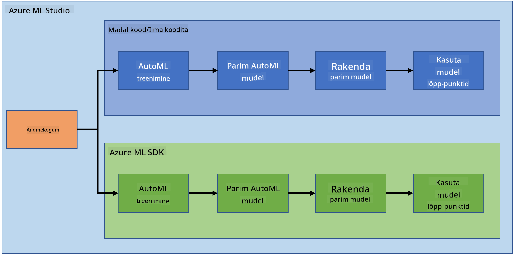

Igal meetodil on oma plussid ja miinused. Vähe koodi/ilma koodita meetod on lihtsam alustada, kuna see hõlmab graafilise kasutajaliidese (GUI) kasutamist, ilma et oleks vaja eelnevaid teadmisi koodist. See meetod võimaldab projekti elujõulisust kiiresti testida ja luua POC (Proof Of Concept). Kuid kui projekt kasvab ja asjad peavad olema tootmisvalmis, ei ole GUI kaudu ressursside loomine teostatav. Siin muutub Azure ML SDK kasutamise oskus hädavajalikuks.

|                   | Vähe koodi/Ilma koodita | Azure ML SDK              |
|-------------------|-------------------------|---------------------------|
| Koodioskused      | Pole vajalik           | Vajalik                  |
| Arendusaeg        | Kiire ja lihtne        | Sõltub koodioskustest    |
| Tootmisvalmidus   | Ei                     | Jah                      |

### 1.3 Südamepuudulikkuse andmestik:

Kardiovaskulaarsed haigused (CVD-d) on ülemaailmselt peamine surmapõhjus, moodustades 31% kõigist surmadest. Keskkonna- ja käitumuslikud riskifaktorid, nagu tubaka kasutamine, ebatervislik toitumine ja rasvumine, füüsiline passiivsus ja kahjulik alkoholitarbimine, võiksid olla mudelite hinnangute jaoks kasutatavad tunnused. Võimalus hinnata CVD arengu tõenäosust oleks suureks abiks kõrge riskiga inimeste rünnakute ennetamisel.

Kaggle on teinud avalikult kättesaadavaks [Südamepuudulikkuse andmestiku](https://www.kaggle.com/andrewmvd/heart-failure-clinical-data), mida me selles projektis kasutame. Saate andmestiku kohe alla laadida. See on tabelandmestik, millel on 13 veergu (12 tunnust ja 1 sihtmuutuja) ja 299 rida.

|    | Muutuja nimi              | Tüüp            | Kirjeldus                                               | Näide             |
|----|---------------------------|-----------------|---------------------------------------------------------|-------------------|
| 1  | age                       | numbriline      | patsiendi vanus                                         | 25                |
| 2  | anaemia                   | boolean         | Punaste vereliblede või hemoglobiini vähenemine         | 0 või 1           |
| 3  | creatinine_phosphokinase  | numbriline      | CPK ensüümi tase veres                                  | 542               |
| 4  | diabetes                  | boolean         | Kas patsiendil on diabeet                               | 0 või 1           |
| 5  | ejection_fraction         | numbriline      | Südamest väljuva vere protsent iga kokkutõmbega         | 45                |
| 6  | high_blood_pressure       | boolean         | Kas patsiendil on hüpertensioon                         | 0 või 1           |
| 7  | platelets                 | numbriline      | Trombotsüütide arv veres                                | 149000            |
| 8  | serum_creatinine          | numbriline      | Seerumi kreatiniini tase veres                          | 0.5               |
| 9  | serum_sodium              | numbriline      | Seerumi naatriumi tase veres                            | jun               |
| 10 | sex                       | boolean         | naine või mees                                          | 0 või 1           |
| 11 | smoking                   | boolean         | Kas patsient suitsetab                                  | 0 või 1           |
| 12 | time                      | numbriline      | jälgimisperiood (päevad)                                | 4                 |
|----|---------------------------|-----------------|---------------------------------------------------------|-------------------|
| 21 | DEATH_EVENT [Sihtmuutuja] | boolean         | Kas patsient sureb jälgimisperioodi jooksul             | 0 või 1           |

Kui andmestik on olemas, saame alustada projekti Azure'is.

## 2. Mudeli treenimine Azure ML Studios vähe koodi/ilma koodita meetodil
### 2.1 Azure ML tööruumi loomine
Mudeli treenimiseks Azure ML-is peate esmalt looma Azure ML tööruumi. Tööruum on Azure Machine Learningi kõrgeim ressurss, mis pakub tsentraliseeritud kohta kõigi artefaktide haldamiseks, mida loote Azure Machine Learningi kasutamisel. Tööruum hoiab ajalugu kõigist treeningjooksudest, sealhulgas logisid, mõõdikuid, väljundeid ja teie skriptide hetktõmmiseid. Kasutate seda teavet, et määrata, milline treeningjooks annab parima mudeli. [Loe rohkem](https://docs.microsoft.com/azure/machine-learning/concept-workspace?WT.mc_id=academic-77958-bethanycheum&ocid=AID3041109)

Soovitatav on kasutada kõige uuemat brauserit, mis sobib teie operatsioonisüsteemiga. Järgmised brauserid on toetatud:

- Microsoft Edge (uusim versioon, mitte Microsoft Edge legacy)
- Safari (uusim versioon, ainult Mac)
- Chrome (uusim versioon)
- Firefox (uusim versioon)

Azure Machine Learningi kasutamiseks looge tööruum oma Azure'i tellimuses. Seejärel saate seda tööruumi kasutada andmete, arvutusressursside, koodi, mudelite ja muude masinõppe töökoormustega seotud artefaktide haldamiseks.

> **_MÄRKUS:_** Teie Azure'i tellimusele rakendatakse väike tasu andmesalvestuse eest seni, kuni Azure Machine Learningi tööruum eksisteerib teie tellimuses, seega soovitame teil kustutada Azure Machine Learningi tööruum, kui te seda enam ei kasuta.

1. Logige sisse [Azure portaali](https://ms.portal.azure.com/) Microsofti mandaatidega, mis on seotud teie Azure'i tellimusega.
2. Valige **＋Loo ressurss**
   
   

   Otsige Machine Learning ja valige Machine Learningi plaat

   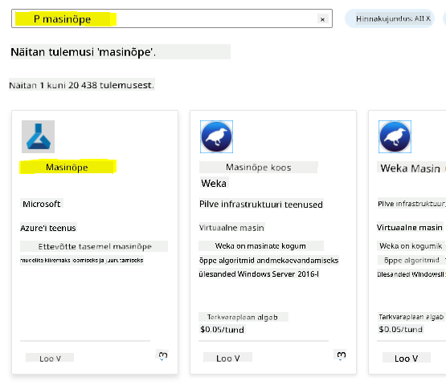

   Klõpsake nuppu "Loo"

   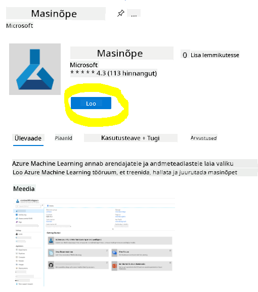

   Täitke seaded järgmiselt:
   - Tellimus: Teie Azure'i tellimus
   - Ressursside grupp: Looge või valige ressursside grupp
   - Tööruumi nimi: Sisestage oma tööruumile unikaalne nimi
   - Piirkond: Valige geograafiline piirkond, mis on teile kõige lähemal
   - Salvestuskonto: Märkige vaikimisi uus salvestuskonto, mis luuakse teie tööruumi jaoks
   - Võtmehoidla: Märkige vaikimisi uus võtmehoidla, mis luuakse teie tööruumi jaoks
   - Rakenduse ülevaated: Märkige vaikimisi uus rakenduse ülevaate ressurss, mis luuakse teie tööruumi jaoks
   - Konteineriregister: Puudub (üks luuakse automaatselt esimesel korral, kui juurutate mudeli konteinerisse)

    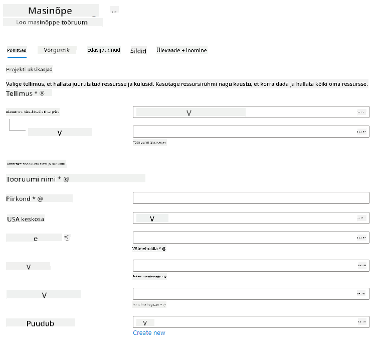

   - Klõpsake nuppu "Loo + ülevaade" ja seejärel nuppu "Loo"
3. Oodake, kuni teie tööruum luuakse (see võib võtta paar minutit). Seejärel minge portaali. Leiate selle Machine Learning Azure'i teenuse kaudu.
4. Tööruumi ülevaate lehel käivitage Azure Machine Learning studio (või avage uus brauseri vahekaart ja navigeerige aadressile https://ml.azure.com) ning logige sisse Azure Machine Learning studio kasutades oma Microsofti kontot. Kui küsitakse, valige oma Azure'i kataloog ja tellimus ning Azure Machine Learningi tööruum.
   
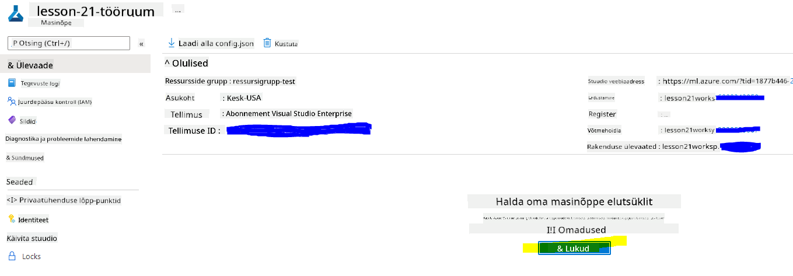

5. Azure Machine Learning studios lülitage ☰ ikooni ülaosas, et vaadata erinevaid lehti liideses. Saate neid lehti kasutada oma tööruumi ressursside haldamiseks.

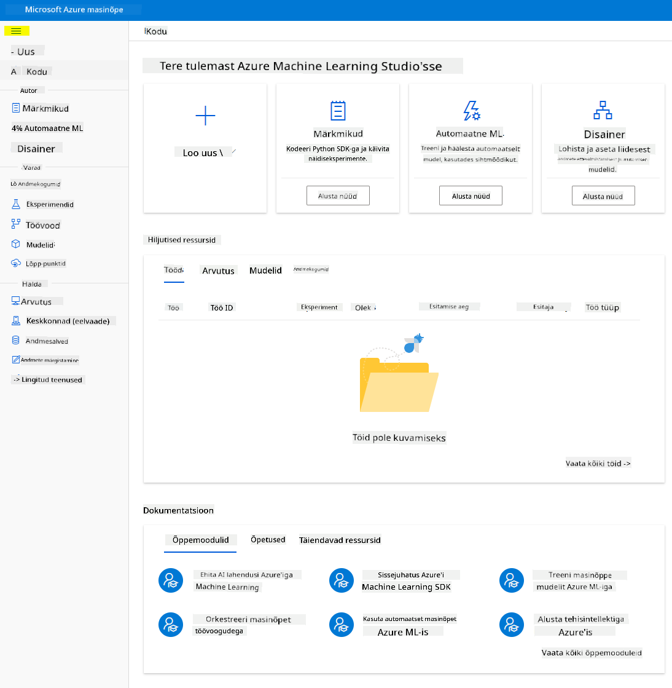

Tööruumi saate hallata Azure'i portaali kaudu, kuid andmeteadlaste ja masinõppe operatsioonide inseneride jaoks pakub Azure Machine Learning Studio rohkem keskendunud kasutajaliidest tööruumi ressursside haldamiseks.

### 2.2 Arvutusressursid

Arvutusressursid on pilvepõhised ressursid, millel saate käivitada mudeli treenimise ja andmete uurimise protsesse. Saate luua nelja tüüpi arvutusressursse:

- **Arvutusinstantsid**: Arendustööjaamad, mida andmeteadlased saavad kasutada andmete ja mudelitega töötamiseks. See hõlmab virtuaalmasina (VM) loomist ja märkmiku instantsi käivitamist. Seejärel saate mudelit treenida, kutsudes märkmikust arvutusklastri.
- **Arvutusklastrid**: Skaleeritavad VM-klastrid eksperimentide koodi nõudmisel töötlemiseks. Vajate seda mudeli treenimiseks. Arvutusklastrid võivad kasutada ka spetsialiseeritud GPU- või CPU-ressursse.
- **Inference Clusters**: Ennustusteenuste juurutamise sihtkohad, mis kasutavad teie treenitud mudeleid.
- **Attached Compute**: Lingid olemasolevatele Azure'i arvutusressurssidele, nagu virtuaalmasinad või Azure Databricks klastrid.

#### 2.2.1 Õigete valikute tegemine arvutusressursside jaoks

Arvutusressursi loomisel tuleb arvestada mitmete oluliste teguritega, mis võivad olla kriitilised otsused.

**Kas vajate CPU-d või GPU-d?**

CPU (Central Processing Unit) on elektrooniline vooluring, mis täidab arvutiprogrammi juhiseid. GPU (Graphics Processing Unit) on spetsialiseeritud elektrooniline vooluring, mis suudab graafikaga seotud koodi täita väga suure kiirusega.

Peamine erinevus CPU ja GPU arhitektuuri vahel seisneb selles, et CPU on loodud mitmesuguste ülesannete kiireks täitmiseks (mõõdetuna CPU taktsagedusega), kuid sellel on piiratud samaaegselt töötavate ülesannete arv. GPU-d on loodud paralleelseks arvutamiseks ja seetõttu sobivad need paremini süvaõppe ülesannete jaoks.

| CPU                                     | GPU                         |
|-----------------------------------------|-----------------------------|
| Vähem kulukas                           | Kallim                     |
| Madalam samaaegsuse tase                | Kõrgem samaaegsuse tase    |
| Aeglasem süvaõppe mudelite treenimisel  | Optimaalne süvaõppe jaoks  |

**Klastri suurus**

Suuremad klastrid on kallimad, kuid tagavad parema reageerimisvõime. Seega, kui teil on aega, kuid mitte piisavalt raha, peaksite alustama väikese klastriga. Vastupidi, kui teil on raha, kuid mitte palju aega, peaksite alustama suurema klastriga.

**VM suurus**

Sõltuvalt teie aja- ja eelarvepiirangutest saate varieerida RAM-i, ketta, tuumade arvu ja taktsageduse suurust. Kõigi nende parameetrite suurendamine on kulukam, kuid tagab parema jõudluse.

**Dedikeeritud või madala prioriteediga instantsid?**

Madala prioriteediga instants tähendab, et see on katkestatav: Microsoft Azure võib need ressursid võtta ja määrata teisele ülesandele, katkestades seega töö. Dedikeeritud instants ehk mittekatkestatav tähendab, et töö lõpetatakse ainult teie loal. See on veel üks aja ja raha kaalutlus, kuna katkestatavad instantsid on odavamad kui dedikeeritud instantsid.

#### 2.2.2 Arvutusklastri loomine

[Azure ML tööruumis](https://ml.azure.com/), mille me varem lõime, minge arvutuse sektsiooni ja näete erinevaid arvutusressursse, mida me just arutasime (st arvutusinstantsid, arvutusklastrid, ennustusklastrid ja seotud arvutus). Selle projekti jaoks vajame mudeli treenimiseks arvutusklastrit. Studios klõpsake menüül "Compute", seejärel vahekaardil "Compute cluster" ja klõpsake nuppu "+ New", et luua arvutusklaster.

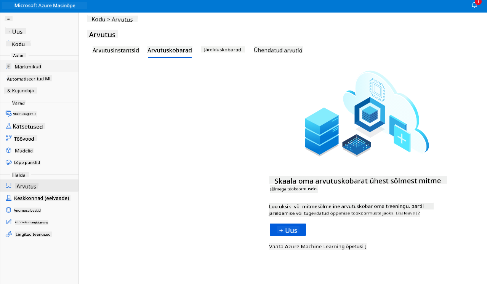

1. Valige oma valikud: Dedikeeritud vs Madala prioriteediga, CPU või GPU, VM suurus ja tuumade arv (võite selle projekti jaoks jätta vaikeseaded).
2. Klõpsake nupul Next.


3. Andke klastrile arvutusnimi.
4. Valige oma valikud: Minimaalne/maksimaalne sõlmede arv, tühikäigu sekundid enne vähendamist, SSH-juurdepääs. Pange tähele, et kui minimaalne sõlmede arv on 0, säästate raha, kui klaster on tühikäigul. Pange tähele, et mida suurem on maksimaalne sõlmede arv, seda lühem on treenimisaeg. Maksimaalne soovitatav sõlmede arv on 3.  
5. Klõpsake nupul "Create". See samm võib võtta paar minutit.

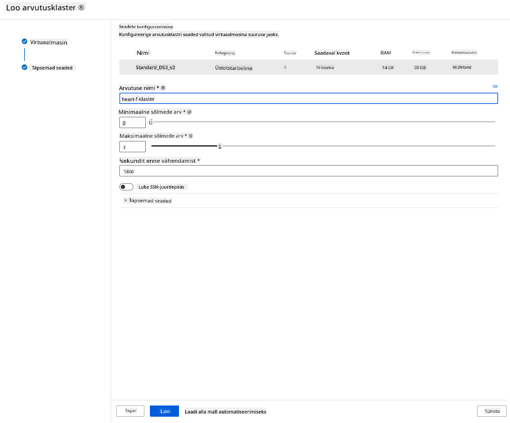

Suurepärane! Nüüd, kui meil on arvutusklaster, peame andmed Azure ML Studiosse laadima.

### 2.3 Andmestiku laadimine

1. [Azure ML tööruumis](https://ml.azure.com/), mille me varem lõime, klõpsake vasakpoolses menüüs "Datasets" ja klõpsake nuppu "+ Create dataset", et luua andmestik. Valige "From local files" ja valige varem alla laaditud Kaggle'i andmestik.

   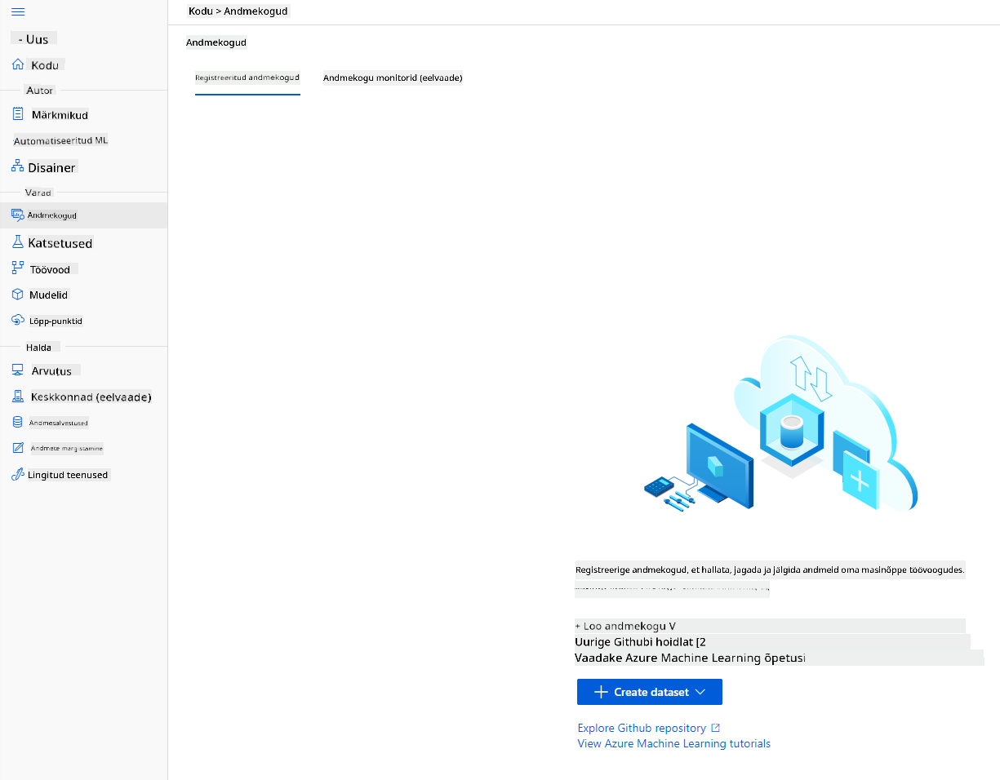

2. Andke oma andmestikule nimi, tüüp ja kirjeldus. Klõpsake Next. Laadige andmed failidest. Klõpsake Next.

   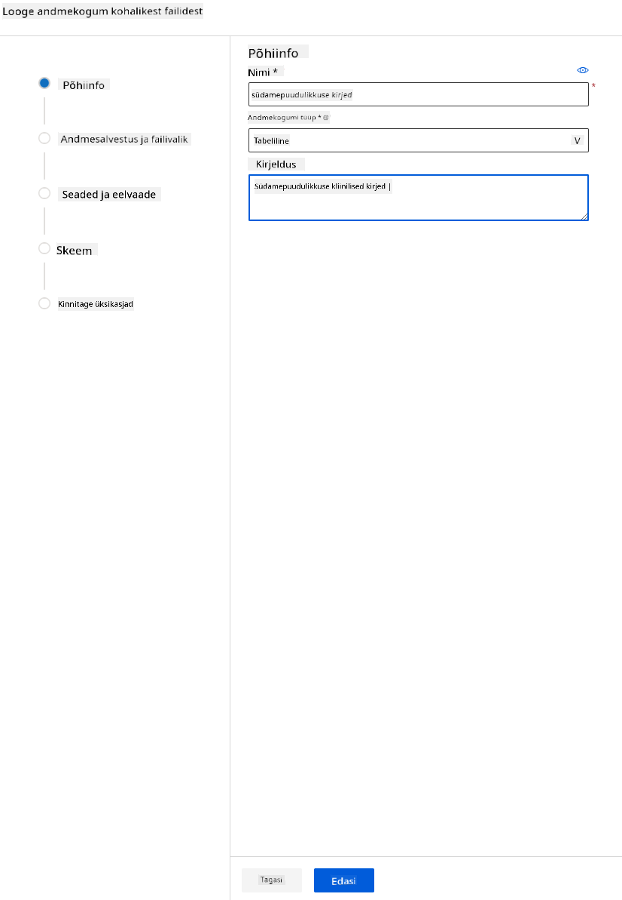

3. Skeemis muutke andmetüüp Boolean järgnevate tunnuste jaoks: anaemia, diabeet, kõrge vererõhk, sugu, suitsetamine ja DEATH_EVENT. Klõpsake Next ja seejärel Create.

   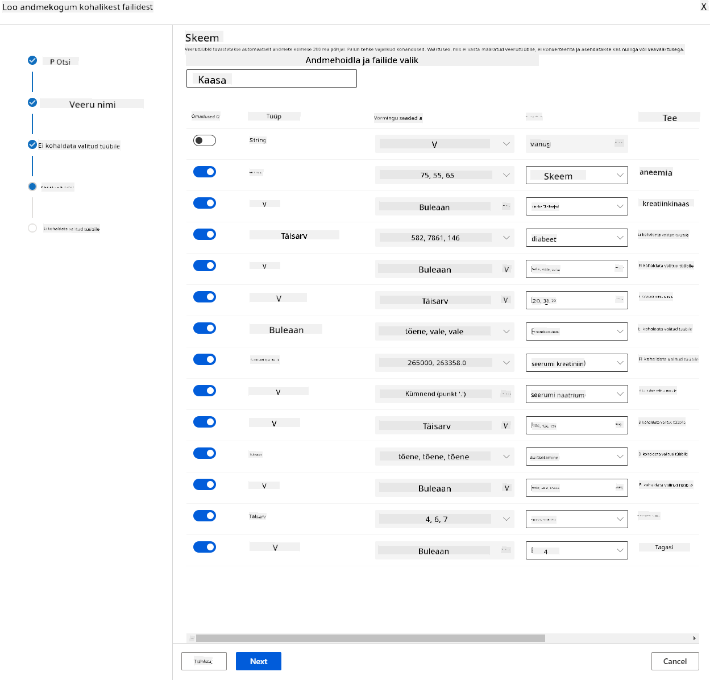

Suurepärane! Nüüd, kui andmestik on paigas ja arvutusklaster loodud, saame alustada mudeli treenimist!

### 2.4 Madala koodiga/koodivaba treenimine AutoML-iga

Traditsiooniline masinõppe mudeli arendamine on ressursimahukas, nõuab märkimisväärset valdkonna teadmisi ja aega, et toota ja võrrelda kümneid mudeleid. Automatiseeritud masinõpe (AutoML) on protsess, mis automatiseerib masinõppe mudeli arendamise aeganõudvaid ja korduvaid ülesandeid. See võimaldab andmeteadlastel, analüütikutel ja arendajatel luua ML-mudeleid suure ulatuse, tõhususe ja produktiivsusega, säilitades samal ajal mudeli kvaliteedi. See vähendab tootmisvalmis ML-mudelite loomise aega, pakkudes suurt lihtsust ja tõhusust. [Loe lähemalt](https://docs.microsoft.com/azure/machine-learning/concept-automated-ml?WT.mc_id=academic-77958-bethanycheum&ocid=AID3041109)

1. [Azure ML tööruumis](https://ml.azure.com/), mille me varem lõime, klõpsake vasakpoolses menüüs "Automated ML" ja valige just üles laaditud andmestik. Klõpsake Next.

   

2. Sisestage uue eksperimendi nimi, sihtveerg (DEATH_EVENT) ja loodud arvutusklaster. Klõpsake Next.

   

3. Valige "Classification" ja klõpsake Finish. See samm võib võtta 30 minutist kuni 1 tunnini, sõltuvalt teie arvutusklastri suurusest.

   

4. Kui jooks on lõpetatud, klõpsake vahekaardil "Automated ML", klõpsake oma jooksul ja seejärel klõpsake "Best model summary" kaardil algoritmil.

   

Siin näete üksikasjalikku kirjeldust parimast mudelist, mille AutoML genereeris. Samuti saate uurida teisi mudeleid vahekaardil Models. Võtke paar minutit, et uurida mudeleid selgituste (preview) nupul. Kui olete valinud mudeli, mida soovite kasutada (siin valime AutoML-i poolt valitud parima mudeli), näeme, kuidas seda juurutada.

## 3. Madala koodiga/koodivaba mudeli juurutamine ja lõpp-punkti tarbimine
### 3.1 Mudeli juurutamine

Automatiseeritud masinõppe liides võimaldab teil parima mudeli veebiteenusena juurutada mõne sammuga. Juurutamine tähendab mudeli integreerimist, et see saaks teha ennustusi uute andmete põhjal ja tuvastada potentsiaalseid võimalusi. Selle projekti puhul tähendab veebiteenuse juurutamine, et meditsiinirakendused saavad mudelit kasutada, et teha reaalajas ennustusi patsientide südameataki riski kohta.

Parima mudeli kirjelduses klõpsake nuppu "Deploy".


15. Andke sellele nimi, kirjeldus, arvutustüüp (Azure Container Instance), lubage autentimine ja klõpsake Deploy. See samm võib võtta umbes 20 minutit. Juurutamisprotsess hõlmab mitmeid samme, sealhulgas mudeli registreerimist, ressursside loomist ja nende konfigureerimist veebiteenuse jaoks. Juurutamise olek ilmub Deploy status all. Valige Refresh perioodiliselt, et kontrollida juurutamise olekut. Kui olek on "Healthy", on see juurutatud ja töötab.

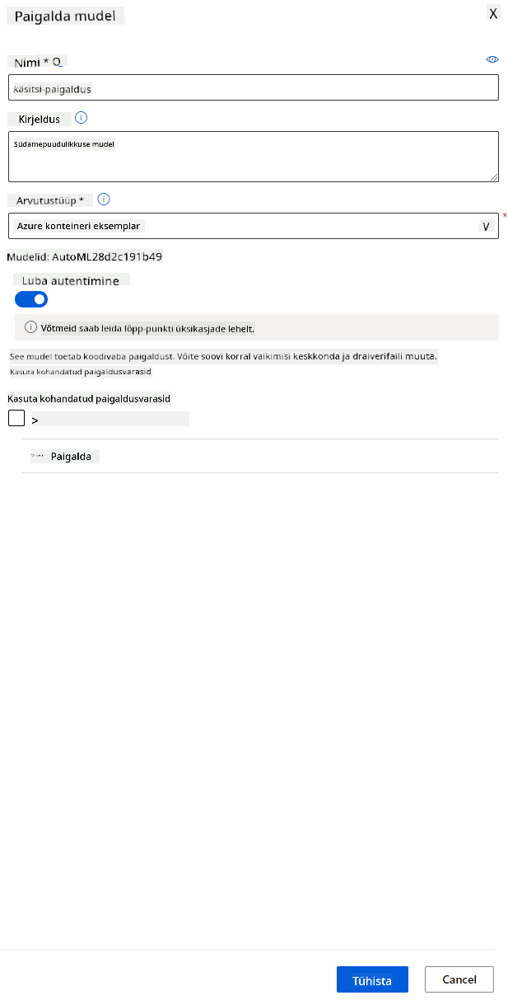

16. Kui see on juurutatud, klõpsake vahekaardil Endpoint ja klõpsake just juurutatud lõpp-punkti. Siit leiate kõik üksikasjad, mida peate lõpp-punkti kohta teadma.

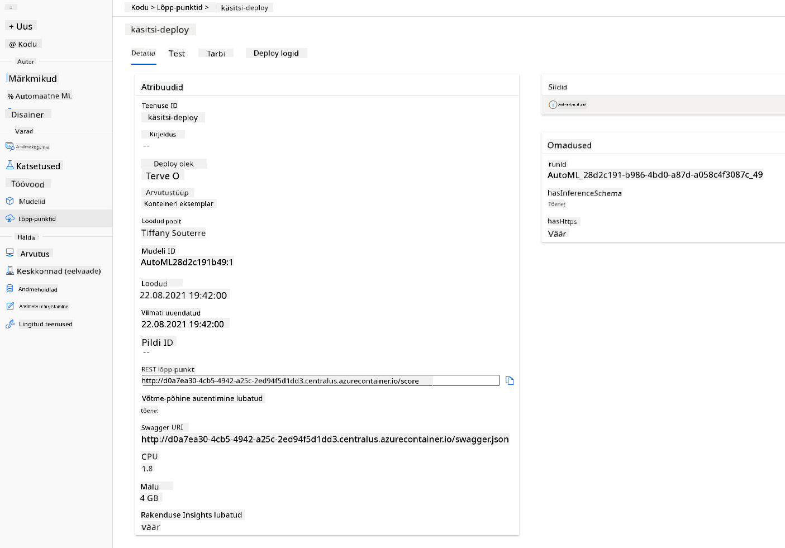

Vinge! Nüüd, kui meil on mudel juurutatud, saame alustada lõpp-punkti tarbimist.

### 3.2 Lõpp-punkti tarbimine

Klõpsake vahekaardil "Consume". Siit leiate REST-lõpp-punkti ja Python-skripti tarbimisvalikus. Võtke aega, et lugeda Python-koodi.

Seda skripti saab otse teie kohalikust masinast käivitada ja see tarbib teie lõpp-punkti.

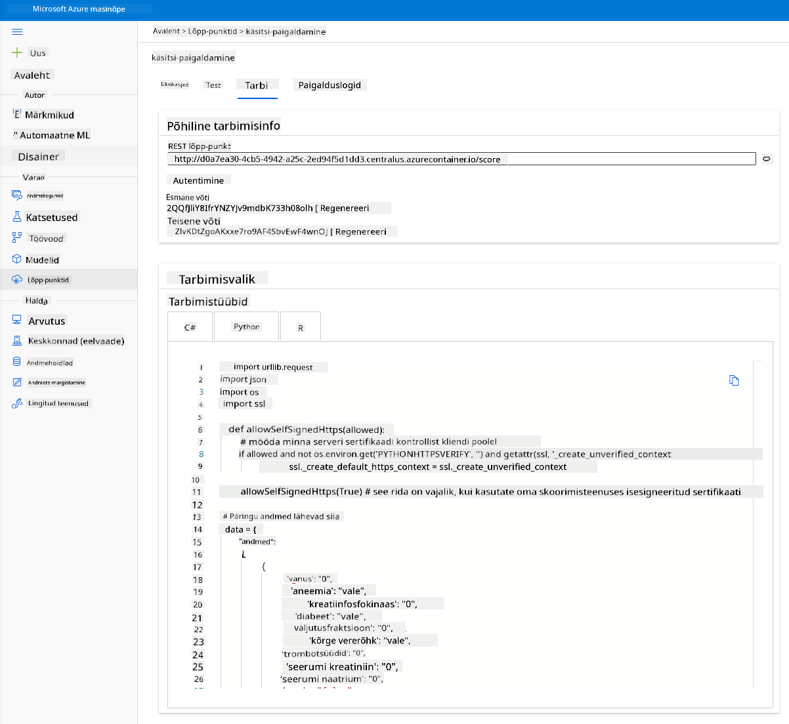

Võtke hetk, et vaadata neid kahte koodirida:

```python
url = 'http://98e3715f-xxxx-xxxx-xxxx-9ec22d57b796.centralus.azurecontainer.io/score'
api_key = '' # Replace this with the API key for the web service
```
Muutuja `url` on REST-lõpp-punkt, mis on leitav tarbimisvahekaardilt, ja muutuja `api_key` on esmane võti, mis on samuti leitav tarbimisvahekaardilt (ainult juhul, kui olete lubanud autentimise). Nii saab skript lõpp-punkti tarbida.

18. Skripti käivitamisel peaksite nägema järgmist väljundit:
    ```python
    b'"{\\"result\\": [true]}"'
    ```
See tähendab, et südamepuudulikkuse ennustus antud andmete põhjal on tõene. See on loogiline, sest kui vaadata skriptis automaatselt genereeritud andmeid, on kõik vaikimisi 0 ja vale. Saate andmeid muuta järgmise sisendi näidisega:

```python
data = {
    "data":
    [
        {
            'age': "0",
            'anaemia': "false",
            'creatinine_phosphokinase': "0",
            'diabetes': "false",
            'ejection_fraction': "0",
            'high_blood_pressure': "false",
            'platelets': "0",
            'serum_creatinine': "0",
            'serum_sodium': "0",
            'sex': "false",
            'smoking': "false",
            'time': "0",
        },
        {
            'age': "60",
            'anaemia': "false",
            'creatinine_phosphokinase': "500",
            'diabetes': "false",
            'ejection_fraction': "38",
            'high_blood_pressure': "false",
            'platelets': "260000",
            'serum_creatinine': "1.40",
            'serum_sodium': "137",
            'sex': "false",
            'smoking': "false",
            'time': "130",
        },
    ],
}
```
Skript peaks tagastama:
    ```python
    b'"{\\"result\\": [true, false]}"'
    ```

Palju õnne! Te just tarbisite juurutatud mudelit ja treenisite seda Azure ML-is!

> **_MÄRKUS:_** Kui olete projektiga lõpetanud, ärge unustage kõiki ressursse kustutada.
## 🚀 Väljakutse

Vaadake lähemalt AutoML-i poolt genereeritud mudeli selgitusi ja üksikasju parimate mudelite kohta. Proovige mõista, miks parim mudel on parem kui teised. Milliseid algoritme võrreldi? Millised on nende erinevused? Miks on parim mudel antud juhul paremini toimiv?

## [Loengu järgne viktoriin](https://ff-quizzes.netlify.app/en/ds/quiz/35)

## Ülevaade ja iseseisev õppimine

Selles õppetunnis õppisite, kuidas treenida, juurutada ja tarbida mudelit, et ennustada südamepuudulikkuse riski madala koodiga/koodivaba viisil pilves. Kui te pole seda veel teinud, süvenege AutoML-i poolt genereeritud mudeli selgitustesse ja proovige mõista, miks parim mudel on parem kui teised.

Saate minna kaugemale madala koodiga/koodivaba AutoML-i teemal, lugedes seda [dokumentatsiooni](https://docs.microsoft.com/azure/machine-learning/tutorial-first-experiment-automated-ml?WT.mc_id=academic-77958-bethanycheum&ocid=AID3041109).

## Ülesanne

[Madala koodiga/koodivaba andmeteaduse projekt Azure ML-is](assignment.md)

---

**Lahtiütlus**:  
See dokument on tõlgitud AI tõlketeenuse [Co-op Translator](https://github.com/Azure/co-op-translator) abil. Kuigi püüame tagada täpsust, palume arvestada, et automaatsed tõlked võivad sisaldada vigu või ebatäpsusi. Algne dokument selle algses keeles tuleks pidada autoriteetseks allikaks. Olulise teabe puhul soovitame kasutada professionaalset inimtõlget. Me ei vastuta selle tõlke kasutamisest tulenevate arusaamatuste või valesti tõlgenduste eest.