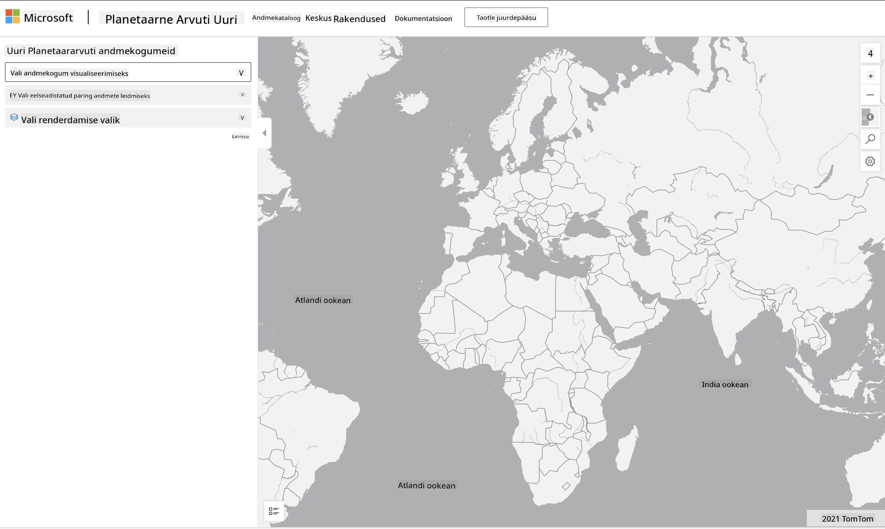

<!--
CO_OP_TRANSLATOR_METADATA:
{
  "original_hash": "d1e05715f9d97de6c4f1fb0c5a4702c0",
  "translation_date": "2025-10-11T15:46:47+00:00",
  "source_file": "6-Data-Science-In-Wild/20-Real-World-Examples/assignment.md",
  "language_code": "et"
}
-->
# Uuri Planetary Computer andmehulka

## Juhised

Selles õppetükis rääkisime erinevatest andmeteaduse rakendusvaldkondadest – süvenesime näidetesse, mis on seotud teadusuuringute, jätkusuutlikkuse ja digitaalse humanitaarteadusega. Selles ülesandes uurid ühte neist näidetest põhjalikumalt ja rakendad oma teadmisi andmete visualiseerimise ja analüüsi kohta, et saada jätkusuutlikkuse andmetest uusi teadmisi.

[Planetary Computer](https://planetarycomputer.microsoft.com/) projektil on andmehulgad ja API-d, millele saab konto loomisega ligi pääseda – taotle kontot, kui soovid proovida ülesande lisasammu. Veebileht pakub ka [Explorer](https://planetarycomputer.microsoft.com/explore) funktsiooni, mida saab kasutada ilma kontot loomata.

`Sammud:`
Explorer-liides (näidatud alloleval ekraanipildil) võimaldab valida andmehulgad (pakutud valikute hulgast), eelseadistatud päringu (andmete filtreerimiseks) ja renderdamisvõimaluse (asjakohase visualiseerimise loomiseks). Selles ülesandes on sinu ülesanne:

 1. Loe [Explorer dokumentatsiooni](https://planetarycomputer.microsoft.com/docs/overview/explorer/) – mõista valikuid.
 2. Uuri andmehulkade [kataloogi](https://planetarycomputer.microsoft.com/catalog) – saa teada iga andmehulgaga seotud eesmärk.
 3. Kasuta Explorerit – vali huvipakkuv andmehulk, sobiv päring ja renderdamisvõimalus.

`Sinu ülesanne:`
Uuri nüüd brauseris loodud visualiseerimist ja vasta järgmistele küsimustele:
 * Millised _omadused_ on andmehulkadel?
 * Milliseid _teadmisi_ või tulemusi visualiseerimine pakub?
 * Millised on nende teadmiste _mõjud_ projekti jätkusuutlikkuse eesmärkidele?
 * Millised on visualiseerimise _piirangud_ (st millist teavet sa ei saanud)?
 * Kui saaksid toorandmed, milliseid _alternatiivseid visualiseeringuid_ sa looksid ja miks?

`Lisapunktid:`
Taotle kontot – ja logi sisse, kui see on heaks kiidetud.
 * Kasuta _Launch Hub_ valikut, et avada toorandmed Notebookis.
 * Uuri andmeid interaktiivselt ja rakenda alternatiivseid visualiseeringuid, mida sa välja mõtlesid.
 * Analüüsi nüüd oma kohandatud visualiseeringuid – kas suutsid tuletada teadmisi, mida varem ei saanud?

## Hindamiskriteeriumid

Näidiskvaliteet | Piisav | Vajab parandamist
--- | --- | -- |
Kõigile viiele põhiküsimusele vastati. Õpilane tuvastas selgelt, kuidas praegused ja alternatiivsed visualiseeringud võiksid anda teadmisi jätkusuutlikkuse eesmärkide või tulemuste kohta.| Õpilane vastas vähemalt kolmele põhiküsimusele põhjalikult, näidates, et tal oli praktiline kogemus Exploreriga.| Õpilane ei vastanud mitmele küsimusele või andis ebapiisavaid vastuseid – viidates sellele, et ülesandele ei tehtud sisulist katset.|

---

**Lahtiütlus**:  
See dokument on tõlgitud AI tõlketeenuse [Co-op Translator](https://github.com/Azure/co-op-translator) abil. Kuigi püüame tagada täpsust, palume arvestada, et automaatsed tõlked võivad sisaldada vigu või ebatäpsusi. Algne dokument selle algses keeles tuleks pidada autoriteetseks allikaks. Olulise teabe puhul soovitame kasutada professionaalset inimtõlget. Me ei vastuta selle tõlke kasutamisest tulenevate arusaamatuste või valesti tõlgenduste eest.