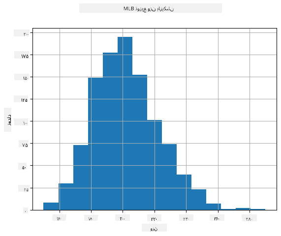
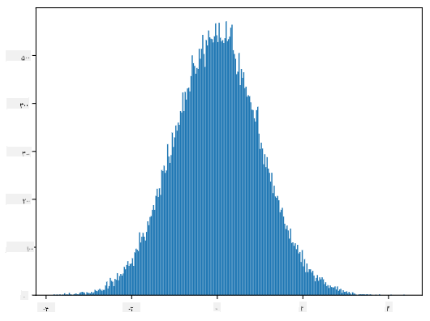
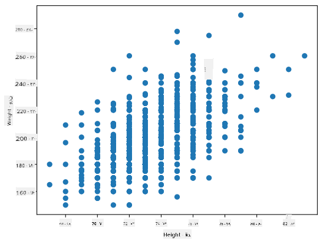

<!--
CO_OP_TRANSLATOR_METADATA:
{
  "original_hash": "8bbb3fa0d4ad61384a3b4b5f7560226f",
  "translation_date": "2025-09-04T14:30:59+00:00",
  "source_file": "1-Introduction/04-stats-and-probability/README.md",
  "language_code": "fa"
}
-->
# مقدمه‌ای کوتاه بر آمار و احتمال

|](../../sketchnotes/04-Statistics-Probability.png)|
|:---:|
| آمار و احتمال - _طرح‌نگاری توسط [@nitya](https://twitter.com/nitya)_ |

نظریه آمار و احتمال دو حوزه مرتبط از ریاضیات هستند که اهمیت زیادی در علم داده دارند. ممکن است بتوان بدون دانش عمیق ریاضی با داده‌ها کار کرد، اما بهتر است حداقل با برخی مفاهیم پایه آشنا باشید. در اینجا یک مقدمه کوتاه ارائه می‌دهیم که به شما کمک می‌کند شروع کنید.

[](https://youtu.be/Z5Zy85g4Yjw)

## [آزمون پیش از درس](https://purple-hill-04aebfb03.1.azurestaticapps.net/quiz/6)

## احتمال و متغیرهای تصادفی

**احتمال** عددی بین ۰ و ۱ است که نشان می‌دهد یک **رویداد** چقدر محتمل است. احتمال به صورت تعداد نتایج مثبت (که منجر به رویداد می‌شوند) تقسیم بر تعداد کل نتایج تعریف می‌شود، به شرطی که همه نتایج به یک اندازه محتمل باشند. برای مثال، وقتی یک تاس می‌اندازیم، احتمال اینکه عدد زوج بیاید برابر است با ۳/۶ = ۰.۵.

وقتی درباره رویدادها صحبت می‌کنیم، از **متغیرهای تصادفی** استفاده می‌کنیم. برای مثال، متغیر تصادفی که عدد حاصل از انداختن تاس را نشان می‌دهد، می‌تواند مقادیر ۱ تا ۶ را بگیرد. مجموعه اعداد ۱ تا ۶ را **فضای نمونه** می‌نامند. می‌توانیم درباره احتمال اینکه یک متغیر تصادفی مقدار خاصی بگیرد صحبت کنیم، برای مثال P(X=3)=1/6.

متغیر تصادفی در مثال قبلی **گسسته** نامیده می‌شود، زیرا فضای نمونه آن قابل شمارش است، یعنی مقادیر جداگانه‌ای وجود دارند که می‌توان آنها را شماره‌گذاری کرد. در مواردی که فضای نمونه یک بازه از اعداد حقیقی یا کل مجموعه اعداد حقیقی باشد، چنین متغیرهایی **پیوسته** نامیده می‌شوند. یک مثال خوب زمان رسیدن اتوبوس است.

## توزیع احتمال

در مورد متغیرهای تصادفی گسسته، توصیف احتمال هر رویداد با یک تابع P(X) آسان است. برای هر مقدار *s* از فضای نمونه *S*، عددی بین ۰ و ۱ ارائه می‌دهد، به طوری که مجموع همه مقادیر P(X=s) برای همه رویدادها برابر با ۱ باشد.

معروف‌ترین توزیع گسسته **توزیع یکنواخت** است، که در آن فضای نمونه شامل N عنصر است و احتمال برابر ۱/N برای هر یک از آنها وجود دارد.

توصیف توزیع احتمال یک متغیر پیوسته، با مقادیر گرفته شده از یک بازه [a,b] یا کل مجموعه اعداد حقیقی ℝ، دشوارتر است. به مورد زمان رسیدن اتوبوس توجه کنید. در واقع، برای هر زمان دقیق رسیدن *t*، احتمال اینکه اتوبوس دقیقا در آن زمان برسد برابر با ۰ است!

> حالا می‌دانید که رویدادهایی با احتمال ۰ اتفاق می‌افتند، و خیلی هم زیاد! حداقل هر بار که اتوبوس می‌رسد!

ما فقط می‌توانیم درباره احتمال اینکه یک متغیر در یک بازه خاص از مقادیر قرار گیرد صحبت کنیم، مثلا P(t<sub>1</sub>≤X<t<sub>2</sub>). در این حالت، توزیع احتمال با یک **تابع چگالی احتمال** p(x) توصیف می‌شود، به طوری که:


معادل پیوسته توزیع یکنواخت **توزیع یکنواخت پیوسته** نامیده می‌شود، که در یک بازه محدود تعریف شده است. احتمال اینکه مقدار X در یک بازه به طول l قرار گیرد متناسب با l است و تا ۱ افزایش می‌یابد.

توزیع مهم دیگر **توزیع نرمال** است، که در ادامه به طور مفصل‌تر درباره آن صحبت خواهیم کرد.

## میانگین، واریانس و انحراف معیار

فرض کنید دنباله‌ای از n نمونه از یک متغیر تصادفی X داریم: x<sub>1</sub>, x<sub>2</sub>, ..., x<sub>n</sub>. می‌توانیم مقدار **میانگین** (یا **میانگین حسابی**) دنباله را به روش سنتی به صورت (x<sub>1</sub>+x<sub>2</sub>+x<sub>n</sub>)/n تعریف کنیم. با افزایش اندازه نمونه (یعنی گرفتن حد با n→∞)، میانگین (که **امید ریاضی** نیز نامیده می‌شود) توزیع را به دست خواهیم آورد. امید ریاضی را با **E**(x) نشان می‌دهیم.

> می‌توان نشان داد که برای هر توزیع گسسته با مقادیر {x<sub>1</sub>, x<sub>2</sub>, ..., x<sub>N</sub>} و احتمالات متناظر p<sub>1</sub>, p<sub>2</sub>, ..., p<sub>N</sub>، امید ریاضی برابر خواهد بود با E(X)=x<sub>1</sub>p<sub>1</sub>+x<sub>2</sub>p<sub>2</sub>+...+x<sub>N</sub>p<sub>N</sub>.

برای تعیین میزان پراکندگی مقادیر، می‌توانیم واریانس σ<sup>2</sup> = ∑(x<sub>i</sub> - μ)<sup>2</sup>/n را محاسبه کنیم، که در آن μ میانگین دنباله است. مقدار σ **انحراف معیار** نامیده می‌شود و σ<sup>2</sup> **واریانس** نامیده می‌شود.

## مد، میانه و چارک‌ها

گاهی اوقات، میانگین به طور مناسب نمایانگر مقدار "معمولی" داده‌ها نیست. برای مثال، وقتی چند مقدار افراطی وجود دارند که کاملا خارج از محدوده هستند، می‌توانند میانگین را تحت تاثیر قرار دهند. یک شاخص خوب دیگر **میانه** است، مقداری که نیمی از نقاط داده کمتر از آن هستند و نیم دیگر بیشتر.

برای کمک به درک توزیع داده‌ها، صحبت درباره **چارک‌ها** مفید است:

* چارک اول، یا Q1، مقداری است که ۲۵٪ داده‌ها کمتر از آن هستند
* چارک سوم، یا Q3، مقداری است که ۷۵٪ داده‌ها کمتر از آن هستند

به صورت گرافیکی می‌توان رابطه بین میانه و چارک‌ها را در نموداری به نام **نمودار جعبه‌ای** نشان داد:


در اینجا همچنین **دامنه بین چارکی** IQR=Q3-Q1 و مقادیر **دورافتاده** - مقادیری که خارج از محدوده [Q1-1.5*IQR,Q3+1.5*IQR] قرار دارند - محاسبه می‌شوند.

برای توزیع محدود که تعداد کمی از مقادیر ممکن را شامل می‌شود، یک مقدار "معمولی" خوب مقداری است که بیشترین تکرار را دارد، که **مد** نامیده می‌شود. این مفهوم اغلب برای داده‌های دسته‌بندی شده، مانند رنگ‌ها، به کار می‌رود. به وضعیتی توجه کنید که دو گروه از افراد داریم - برخی که به شدت رنگ قرمز را ترجیح می‌دهند و برخی دیگر که رنگ آبی را ترجیح می‌دهند. اگر رنگ‌ها را با اعداد کدگذاری کنیم، میانگین مقدار برای رنگ مورد علاقه ممکن است جایی در طیف نارنجی-سبز باشد، که نشان‌دهنده ترجیح واقعی هیچ‌یک از گروه‌ها نیست. اما مد ممکن است یکی از رنگ‌ها یا هر دو رنگ باشد، اگر تعداد افراد رای‌دهنده برای آنها برابر باشد (در این حالت نمونه **چندمدی** نامیده می‌شود).

## داده‌های دنیای واقعی

وقتی داده‌های دنیای واقعی را تحلیل می‌کنیم، آنها اغلب به معنای دقیق متغیرهای تصادفی نیستند، به این معنا که آزمایش‌هایی با نتیجه نامعلوم انجام نمی‌دهیم. برای مثال، به تیمی از بازیکنان بیسبال و داده‌های بدنی آنها، مانند قد، وزن و سن، توجه کنید. این اعداد دقیقا تصادفی نیستند، اما همچنان می‌توانیم همان مفاهیم ریاضی را اعمال کنیم. برای مثال، دنباله‌ای از وزن افراد را می‌توان به عنوان دنباله‌ای از مقادیر گرفته شده از یک متغیر تصادفی در نظر گرفت. در زیر دنباله‌ای از وزن‌های بازیکنان واقعی بیسبال از [لیگ برتر بیسبال](http://mlb.mlb.com/index.jsp) آورده شده است، که از [این مجموعه داده](http://wiki.stat.ucla.edu/socr/index.php/SOCR_Data_MLB_HeightsWeights) گرفته شده است (برای راحتی شما، فقط ۲۰ مقدار اول نشان داده شده‌اند):

```
[180.0, 215.0, 210.0, 210.0, 188.0, 176.0, 209.0, 200.0, 231.0, 180.0, 188.0, 180.0, 185.0, 160.0, 180.0, 185.0, 197.0, 189.0, 185.0, 219.0]
```

> **توجه**: برای دیدن مثال کار با این مجموعه داده، به [دفترچه همراه](notebook.ipynb) نگاهی بیندازید. همچنین در طول این درس تعدادی چالش وجود دارد که می‌توانید با افزودن کدی به آن دفترچه آنها را کامل کنید. اگر مطمئن نیستید چگونه روی داده‌ها کار کنید، نگران نباشید - بعدا به کار با داده‌ها با استفاده از پایتون بازخواهیم گشت. اگر نمی‌دانید چگونه کد را در Jupyter Notebook اجرا کنید، به [این مقاله](https://soshnikov.com/education/how-to-execute-notebooks-from-github/) نگاهی بیندازید.

در اینجا نمودار جعبه‌ای نشان‌دهنده میانگین، میانه و چارک‌ها برای داده‌های ما آورده شده است:


از آنجا که داده‌های ما شامل اطلاعات مربوط به **نقش‌های** مختلف بازیکنان است، می‌توانیم نمودار جعبه‌ای را بر اساس نقش نیز رسم کنیم - این کار به ما اجازه می‌دهد ایده‌ای درباره تفاوت مقادیر پارامترها در نقش‌های مختلف به دست آوریم. این بار قد را در نظر می‌گیریم:


این نمودار نشان می‌دهد که به طور متوسط، قد بازیکنان نقش اول بیشتر از بازیکنان نقش دوم است. در ادامه این درس یاد خواهیم گرفت که چگونه می‌توانیم این فرضیه را به صورت رسمی‌تر آزمایش کنیم و نشان دهیم که داده‌های ما از نظر آماری معنادار هستند.

> هنگام کار با داده‌های دنیای واقعی، فرض می‌کنیم که همه نقاط داده نمونه‌هایی گرفته شده از یک توزیع احتمال هستند. این فرض به ما اجازه می‌دهد تکنیک‌های یادگیری ماشین را اعمال کنیم و مدل‌های پیش‌بینی کارآمد بسازیم.

برای دیدن توزیع داده‌های خود، می‌توانیم نموداری به نام **هیستوگرام** رسم کنیم. محور X شامل تعدادی بازه وزن مختلف (به اصطلاح **باکس‌ها**) خواهد بود، و محور عمودی تعداد دفعاتی که نمونه متغیر تصادفی در یک بازه خاص قرار گرفته است را نشان می‌دهد.



از این هیستوگرام می‌توانید ببینید که همه مقادیر حول میانگین وزن خاصی متمرکز شده‌اند، و هرچه از آن وزن دورتر شویم - وزن‌های کمتری با آن مقدار مواجه می‌شوند. یعنی، احتمال اینکه وزن یک بازیکن بیسبال بسیار متفاوت از میانگین وزن باشد بسیار کم است. واریانس وزن‌ها نشان می‌دهد که وزن‌ها تا چه حد ممکن است از میانگین متفاوت باشند.

> اگر وزن‌های افراد دیگر، نه از لیگ بیسبال، را بگیریم، توزیع احتمالا متفاوت خواهد بود. با این حال، شکل توزیع یکسان خواهد بود، اما میانگین و واریانس تغییر خواهند کرد. بنابراین، اگر مدل خود را بر اساس بازیکنان بیسبال آموزش دهیم، احتمال دارد که نتایج اشتباهی هنگام اعمال آن بر دانشجویان یک دانشگاه بدهد، زیرا توزیع زیرین متفاوت است.

## توزیع نرمال

توزیع وزن‌هایی که در بالا مشاهده کردیم بسیار معمولی است، و بسیاری از اندازه‌گیری‌های دنیای واقعی از همان نوع توزیع پیروی می‌کنند، اما با میانگین و واریانس متفاوت. این توزیع **توزیع نرمال** نامیده می‌شود و نقش بسیار مهمی در آمار دارد.

استفاده از توزیع نرمال روش صحیحی برای تولید وزن‌های تصادفی بازیکنان بالقوه بیسبال است. وقتی میانگین وزن `mean` و انحراف معیار `std` را بدانیم، می‌توانیم ۱۰۰۰ نمونه وزن به صورت زیر تولید کنیم:
```python
samples = np.random.normal(mean,std,1000)
```

اگر هیستوگرام نمونه‌های تولید شده را رسم کنیم، تصویری بسیار مشابه با تصویر بالا خواهیم دید. و اگر تعداد نمونه‌ها و تعداد باکس‌ها را افزایش دهیم، می‌توانیم تصویری از توزیع نرمال که به حالت ایده‌آل نزدیک‌تر است تولید کنیم:



*توزیع نرمال با میانگین=۰ و انحراف معیار=۱*

## بازه‌های اطمینان

وقتی درباره وزن بازیکنان بیسبال صحبت می‌کنیم، فرض می‌کنیم که یک **متغیر تصادفی W** وجود دارد که به توزیع احتمال ایده‌آل وزن‌های همه بازیکنان بیسبال (به اصطلاح **جمعیت**) مربوط می‌شود. دنباله وزن‌های ما مربوط به زیرمجموعه‌ای از همه بازیکنان بیسبال است که آن را **نمونه** می‌نامیم. یک سوال جالب این است که آیا می‌توانیم پارامترهای توزیع W، یعنی میانگین و واریانس جمعیت، را بدانیم؟

ساده‌ترین پاسخ این است که میانگین و واریانس نمونه خود را محاسبه کنیم. با این حال، ممکن است نمونه تصادفی ما به طور دقیق نمایانگر کل جمعیت نباشد. بنابراین منطقی است که درباره **بازه اطمینان** صحبت کنیم.
> **فاصله اطمینان** برآوردی از میانگین واقعی جامعه است که بر اساس نمونه ما انجام می‌شود و با یک احتمال مشخص (یا **سطح اطمینان**) دقیق است.
فرض کنیم نمونه‌ای از X<sub>1</sub>, ..., X<sub>n</sub> از توزیع خود داریم. هر بار که نمونه‌ای از توزیع خود می‌گیریم، به یک مقدار میانگین متفاوت μ می‌رسیم. بنابراین، μ می‌تواند به عنوان یک متغیر تصادفی در نظر گرفته شود. یک **بازه اطمینان** با اطمینان p یک جفت مقدار (L<sub>p</sub>,R<sub>p</sub>) است، به طوری که **P**(L<sub>p</sub>≤μ≤R<sub>p</sub>) = p، یعنی احتمال اینکه مقدار میانگین اندازه‌گیری شده در این بازه قرار گیرد برابر با p است.

بحث در مورد نحوه محاسبه این بازه‌های اطمینان فراتر از مقدمه کوتاه ما است. جزئیات بیشتر را می‌توانید در [ویکی‌پدیا](https://en.wikipedia.org/wiki/Confidence_interval) پیدا کنید. به طور خلاصه، ما توزیع میانگین نمونه محاسبه شده را نسبت به میانگین واقعی جمعیت تعریف می‌کنیم، که به آن **توزیع دانشجو** گفته می‌شود.

> **واقعیت جالب**: توزیع دانشجو به نام ریاضیدان ویلیام سیلی گاست نامگذاری شده است، که مقاله خود را با نام مستعار "Student" منتشر کرد. او در کارخانه آبجوسازی گینس کار می‌کرد و طبق یکی از نسخه‌ها، کارفرمای او نمی‌خواست عموم مردم بدانند که آنها از آزمون‌های آماری برای تعیین کیفیت مواد اولیه استفاده می‌کنند.

اگر بخواهیم میانگین μ جمعیت خود را با اطمینان p تخمین بزنیم، باید *(1-p)/2-امین صدک* از توزیع دانشجو A را بگیریم، که می‌تواند از جداول گرفته شود یا با استفاده از برخی توابع داخلی نرم‌افزارهای آماری (مانند Python، R و غیره) محاسبه شود. سپس بازه μ به صورت X±A*D/√n خواهد بود، که در آن X میانگین نمونه به دست آمده و D انحراف معیار است.

> **توجه**: ما همچنین بحث در مورد مفهوم مهم [درجات آزادی](https://en.wikipedia.org/wiki/Degrees_of_freedom_(statistics)) را که در رابطه با توزیع دانشجو مهم است، حذف کرده‌ایم. برای درک عمیق‌تر این مفهوم می‌توانید به کتاب‌های کامل‌تر در زمینه آمار مراجعه کنید.

یک مثال از محاسبه بازه اطمینان برای وزن‌ها و قدها در [دفترچه‌های همراه](notebook.ipynb) ارائه شده است.

| p | میانگین وزن |
|-----|-----------|
| 0.85 | 201.73±0.94 |
| 0.90 | 201.73±1.08 |
| 0.95 | 201.73±1.28 |

توجه کنید که هرچه احتمال اطمینان بالاتر باشد، بازه اطمینان گسترده‌تر است.

## آزمون فرضیه

در مجموعه داده بازیکنان بیسبال، نقش‌های مختلفی وجود دارد که می‌توان آنها را به صورت زیر خلاصه کرد (به [دفترچه همراه](notebook.ipynb) نگاه کنید تا ببینید این جدول چگونه محاسبه شده است):

| نقش | قد | وزن | تعداد |
|------|--------|--------|-------|
| Catcher | 72.723684 | 204.328947 | 76 |
| Designated_Hitter | 74.222222 | 220.888889 | 18 |
| First_Baseman | 74.000000 | 213.109091 | 55 |
| Outfielder | 73.010309 | 199.113402 | 194 |
| Relief_Pitcher | 74.374603 | 203.517460 | 315 |
| Second_Baseman | 71.362069 | 184.344828 | 58 |
| Shortstop | 71.903846 | 182.923077 | 52 |
| Starting_Pitcher | 74.719457 | 205.163636 | 221 |
| Third_Baseman | 73.044444 | 200.955556 | 45 |

می‌توانیم مشاهده کنیم که میانگین قد بازیکنان First Baseman بیشتر از Second Baseman است. بنابراین ممکن است وسوسه شویم که نتیجه بگیریم **بازیکنان First Baseman بلندتر از بازیکنان Second Baseman هستند**.

> این بیان **یک فرضیه** نامیده می‌شود، زیرا نمی‌دانیم آیا این واقعیت واقعاً درست است یا خیر.

با این حال، همیشه واضح نیست که آیا می‌توانیم این نتیجه‌گیری را انجام دهیم. از بحث بالا می‌دانیم که هر میانگین دارای یک بازه اطمینان مرتبط است و بنابراین این تفاوت ممکن است فقط یک خطای آماری باشد. ما به یک روش رسمی‌تر برای آزمون فرضیه خود نیاز داریم.

بیایید بازه‌های اطمینان را جداگانه برای قدهای بازیکنان First Baseman و Second Baseman محاسبه کنیم:

| اطمینان | First Baseman | Second Baseman |
|------------|---------------|----------------|
| 0.85 | 73.62..74.38 | 71.04..71.69 |
| 0.90 | 73.56..74.44 | 70.99..71.73 |
| 0.95 | 73.47..74.53 | 70.92..71.81 |

می‌توانیم ببینیم که تحت هیچ سطح اطمینانی بازه‌ها همپوشانی ندارند. این فرضیه ما را که بازیکنان First Baseman بلندتر از بازیکنان Second Baseman هستند، اثبات می‌کند.

به طور رسمی‌تر، مسئله‌ای که حل می‌کنیم این است که ببینیم **آیا دو توزیع احتمالی یکسان هستند** یا حداقل پارامترهای یکسانی دارند. بسته به توزیع، باید از آزمون‌های مختلفی برای این کار استفاده کنیم. اگر بدانیم که توزیع‌های ما نرمال هستند، می‌توانیم از **[آزمون t دانشجو](https://en.wikipedia.org/wiki/Student%27s_t-test)** استفاده کنیم.

در آزمون t دانشجو، ما مقدار **t-value** را محاسبه می‌کنیم، که تفاوت بین میانگین‌ها را با در نظر گرفتن واریانس نشان می‌دهد. نشان داده شده است که t-value از **توزیع دانشجو** پیروی می‌کند، که به ما امکان می‌دهد مقدار آستانه را برای یک سطح اطمینان **p** مشخص به دست آوریم (این مقدار می‌تواند محاسبه شود یا در جداول عددی جستجو شود). سپس t-value را با این آستانه مقایسه می‌کنیم تا فرضیه را تأیید یا رد کنیم.

در Python، می‌توانیم از بسته **SciPy** استفاده کنیم، که شامل تابع `ttest_ind` است (علاوه بر بسیاری از توابع آماری مفید دیگر!). این تابع مقدار t-value را برای ما محاسبه می‌کند و همچنین جستجوی معکوس مقدار اطمینان p-value را انجام می‌دهد، بنابراین می‌توانیم فقط به اطمینان نگاه کنیم تا نتیجه‌گیری کنیم.

برای مثال، مقایسه ما بین قدهای بازیکنان First Baseman و Second Baseman نتایج زیر را به ما می‌دهد:
```python
from scipy.stats import ttest_ind

tval, pval = ttest_ind(df.loc[df['Role']=='First_Baseman',['Height']], df.loc[df['Role']=='Designated_Hitter',['Height']],equal_var=False)
print(f"T-value = {tval[0]:.2f}\nP-value: {pval[0]}")
```
```
T-value = 7.65
P-value: 9.137321189738925e-12
```
در مورد ما، مقدار p-value بسیار پایین است، به این معنی که شواهد قوی‌ای وجود دارد که نشان می‌دهد بازیکنان First Baseman بلندتر هستند.

همچنین انواع دیگری از فرضیه‌ها وجود دارد که ممکن است بخواهیم آزمون کنیم، برای مثال:
* اثبات اینکه یک نمونه داده شده از یک توزیع خاص پیروی می‌کند. در مورد ما فرض کرده‌ایم که قدها به صورت نرمال توزیع شده‌اند، اما این نیاز به تأیید آماری رسمی دارد.
* اثبات اینکه مقدار میانگین یک نمونه با یک مقدار از پیش تعریف شده مطابقت دارد
* مقایسه میانگین‌های چندین نمونه (مثلاً تفاوت در سطح خوشبختی بین گروه‌های سنی مختلف)

## قانون اعداد بزرگ و قضیه حد مرکزی

یکی از دلایلی که توزیع نرمال بسیار مهم است، **قضیه حد مرکزی** است. فرض کنید نمونه بزرگی از مقادیر مستقل N، X<sub>1</sub>, ..., X<sub>N</sub> داریم، که از هر توزیعی با میانگین μ و واریانس σ<sup>2</sup> نمونه‌برداری شده‌اند. سپس، برای N به اندازه کافی بزرگ (به عبارت دیگر، وقتی N→∞)، میانگین Σ<sub>i</sub>X<sub>i</sub> به صورت نرمال توزیع می‌شود، با میانگین μ و واریانس σ<sup>2</sup>/N.

> یک روش دیگر برای تفسیر قضیه حد مرکزی این است که بگوییم صرف نظر از توزیع، وقتی میانگین مجموع مقادیر هر متغیر تصادفی را محاسبه می‌کنید، به توزیع نرمال می‌رسید.

از قضیه حد مرکزی همچنین نتیجه می‌شود که وقتی N→∞، احتمال اینکه میانگین نمونه برابر با μ باشد به 1 می‌رسد. این به عنوان **قانون اعداد بزرگ** شناخته می‌شود.

## کوواریانس و همبستگی

یکی از کارهایی که علم داده انجام می‌دهد، یافتن روابط بین داده‌ها است. می‌گوییم دو دنباله **همبستگی دارند** وقتی رفتار مشابهی را در یک زمان مشخص نشان می‌دهند، یعنی یا به طور همزمان افزایش/کاهش می‌یابند، یا یک دنباله افزایش می‌یابد وقتی دیگری کاهش می‌یابد و بالعکس. به عبارت دیگر، به نظر می‌رسد که بین دو دنباله رابطه‌ای وجود دارد.

> همبستگی لزوماً نشان‌دهنده رابطه علّی بین دو دنباله نیست؛ گاهی هر دو متغیر می‌توانند به یک علت خارجی وابسته باشند، یا ممکن است صرفاً به صورت تصادفی دو دنباله همبستگی داشته باشند. با این حال، همبستگی ریاضی قوی نشانه خوبی است که دو متغیر به نوعی به هم مرتبط هستند.

به صورت ریاضی، مفهوم اصلی که رابطه بین دو متغیر تصادفی را نشان می‌دهد **کوواریانس** است، که به این صورت محاسبه می‌شود: Cov(X,Y) = **E**\[(X-**E**(X))(Y-**E**(Y))\]. انحراف هر دو متغیر از میانگین‌هایشان را محاسبه می‌کنیم و سپس حاصل‌ضرب این انحراف‌ها را می‌گیریم. اگر هر دو متغیر با هم انحراف داشته باشند، حاصل‌ضرب همیشه یک مقدار مثبت خواهد بود، که به کوواریانس مثبت اضافه می‌شود. اگر هر دو متغیر به صورت غیرهمزمان انحراف داشته باشند (یعنی یکی زیر میانگین باشد وقتی دیگری بالای میانگین است)، همیشه اعداد منفی خواهیم داشت، که به کوواریانس منفی اضافه می‌شود. اگر انحراف‌ها وابسته نباشند، تقریباً به صفر اضافه می‌شوند.

مقدار مطلق کوواریانس اطلاعات زیادی در مورد میزان همبستگی به ما نمی‌دهد، زیرا به بزرگی مقادیر واقعی بستگی دارد. برای نرمال‌سازی آن، می‌توانیم کوواریانس را بر انحراف معیار هر دو متغیر تقسیم کنیم تا **همبستگی** به دست آید. نکته خوب این است که همبستگی همیشه در محدوده [-1,1] است، که در آن 1 نشان‌دهنده همبستگی مثبت قوی بین مقادیر، -1 نشان‌دهنده همبستگی منفی قوی، و 0 نشان‌دهنده عدم همبستگی (متغیرها مستقل هستند) است.

**مثال**: می‌توانیم همبستگی بین وزن‌ها و قدهای بازیکنان بیسبال را از مجموعه داده ذکر شده در بالا محاسبه کنیم:
```python
print(np.corrcoef(weights,heights))
```
در نتیجه، ماتریس **همبستگی** مانند این را به دست می‌آوریم:
```
array([[1.        , 0.52959196],
       [0.52959196, 1.        ]])
```

> ماتریس همبستگی C را می‌توان برای هر تعداد دنباله ورودی S<sub>1</sub>, ..., S<sub>n</sub> محاسبه کرد. مقدار C<sub>ij</sub> همبستگی بین S<sub>i</sub> و S<sub>j</sub> است و عناصر قطر همیشه 1 هستند (که همچنین خودهمبستگی S<sub>i</sub> است).

در مورد ما، مقدار 0.53 نشان می‌دهد که بین وزن و قد یک فرد همبستگی وجود دارد. همچنین می‌توانیم نمودار پراکندگی یک مقدار در برابر مقدار دیگر را رسم کنیم تا رابطه را به صورت بصری ببینیم:



> مثال‌های بیشتری از همبستگی و کوواریانس را می‌توانید در [دفترچه همراه](notebook.ipynb) پیدا کنید.

## نتیجه‌گیری

در این بخش، یاد گرفتیم:

* ویژگی‌های آماری پایه داده‌ها، مانند میانگین، واریانس، مد و چارک‌ها
* توزیع‌های مختلف متغیرهای تصادفی، از جمله توزیع نرمال
* نحوه یافتن همبستگی بین ویژگی‌های مختلف
* نحوه استفاده از ابزارهای ریاضی و آماری برای اثبات برخی فرضیه‌ها
* نحوه محاسبه بازه‌های اطمینان برای متغیر تصادفی با توجه به نمونه داده

در حالی که این قطعاً لیست کاملی از موضوعات موجود در احتمال و آمار نیست، باید برای شروع خوب در این دوره کافی باشد.

## 🚀 چالش

از کد نمونه در دفترچه استفاده کنید تا فرضیه‌های زیر را آزمون کنید:
1. بازیکنان First Baseman از بازیکنان Second Baseman مسن‌تر هستند
2. بازیکنان First Baseman از بازیکنان Third Baseman بلندتر هستند
3. بازیکنان Shortstop از بازیکنان Second Baseman بلندتر هستند

## [آزمون پس از درس](https://ff-quizzes.netlify.app/en/ds/)

## مرور و مطالعه خودآموز

احتمال و آمار موضوعی بسیار گسترده است که شایسته دوره‌ای جداگانه است. اگر علاقه‌مند به مطالعه عمیق‌تر نظریه هستید، ممکن است بخواهید به خواندن برخی از کتاب‌های زیر ادامه دهید:

1. [کارلوس فرناندز-گرندا](https://cims.nyu.edu/~cfgranda/) از دانشگاه نیویورک یادداشت‌های درسی عالی دارد [احتمال و آمار برای علم داده](https://cims.nyu.edu/~cfgranda/pages/stuff/probability_stats_for_DS.pdf) (به صورت آنلاین در دسترس است)
1. [پیتر و اندرو بروس. آمار عملی برای دانشمندان داده.](https://www.oreilly.com/library/view/practical-statistics-for/9781491952955/) [[کد نمونه در R](https://github.com/andrewgbruce/statistics-for-data-scientists)]. 
1. [جیمز دی. میلر. آمار برای علم داده](https://www.packtpub.com/product/statistics-for-data-science/9781788290678) [[کد نمونه در R](https://github.com/PacktPublishing/Statistics-for-Data-Science)]

## تکلیف

[مطالعه کوچک دیابت](assignment.md)

## اعتبار

این درس با ♥️ توسط [دمیتری سوشنیکوف](http://soshnikov.com) نوشته شده است.

---

**سلب مسئولیت**:  
این سند با استفاده از سرویس ترجمه هوش مصنوعی [Co-op Translator](https://github.com/Azure/co-op-translator) ترجمه شده است. در حالی که ما تلاش می‌کنیم دقت را حفظ کنیم، لطفاً توجه داشته باشید که ترجمه‌های خودکار ممکن است شامل خطاها یا نادرستی‌ها باشند. سند اصلی به زبان اصلی آن باید به عنوان منبع معتبر در نظر گرفته شود. برای اطلاعات حساس، توصیه می‌شود از ترجمه حرفه‌ای انسانی استفاده کنید. ما مسئولیتی در قبال سوء تفاهم‌ها یا تفسیرهای نادرست ناشی از استفاده از این ترجمه نداریم.