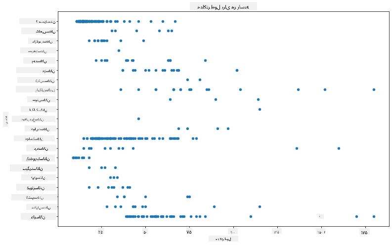
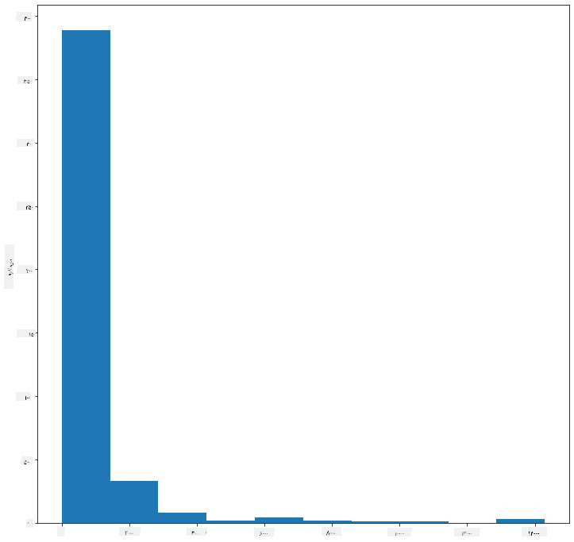
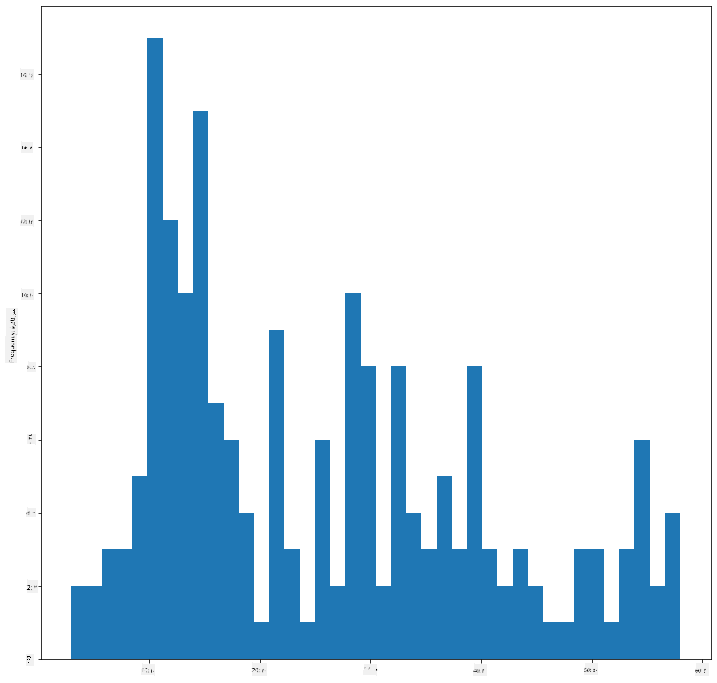
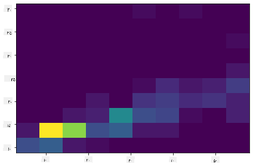
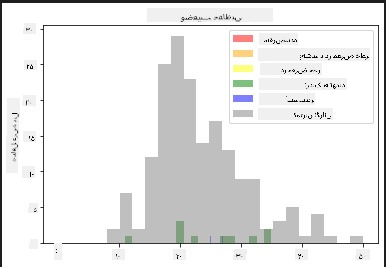

<!--
CO_OP_TRANSLATOR_METADATA:
{
  "original_hash": "02ce904bc1e2bfabb7dc05c25aae375c",
  "translation_date": "2025-09-04T14:30:25+00:00",
  "source_file": "3-Data-Visualization/10-visualization-distributions/README.md",
  "language_code": "fa"
}
-->
# نمایش توزیع‌ها

|](../../sketchnotes/10-Visualizing-Distributions.png)|
|:---:|
| نمایش توزیع‌ها - _طرح دستی توسط [@nitya](https://twitter.com/nitya)_ |

در درس قبلی، شما اطلاعات جالبی درباره یک مجموعه داده مربوط به پرندگان مینه‌سوتا یاد گرفتید. با نمایش داده‌های پرت، برخی داده‌های اشتباه را پیدا کردید و تفاوت‌های بین دسته‌های پرندگان را بر اساس طول حداکثر آن‌ها بررسی کردید.

## [آزمون قبل از درس](https://purple-hill-04aebfb03.1.azurestaticapps.net/quiz/18)
## بررسی مجموعه داده پرندگان

یکی دیگر از روش‌های بررسی داده‌ها، نگاه کردن به توزیع آن‌ها یا نحوه سازماندهی داده‌ها در طول یک محور است. شاید، برای مثال، بخواهید درباره توزیع کلی طول بال یا جرم بدن حداکثر پرندگان مینه‌سوتا در این مجموعه داده اطلاعات کسب کنید.

بیایید برخی حقایق درباره توزیع داده‌ها در این مجموعه داده را کشف کنیم. در فایل _notebook.ipynb_ که در ریشه پوشه این درس قرار دارد، Pandas، Matplotlib و داده‌های خود را وارد کنید:

```python
import pandas as pd
import matplotlib.pyplot as plt
birds = pd.read_csv('../../data/birds.csv')
birds.head()
```

|      | نام                          | نام علمی               | دسته‌بندی              | راسته        | خانواده   | جنس        | وضعیت حفاظتی         | حداقل طول | حداکثر طول | حداقل جرم بدن | حداکثر جرم بدن | حداقل طول بال | حداکثر طول بال |
| ---: | :--------------------------- | :--------------------- | :-------------------- | :----------- | :------- | :---------- | :----------------- | --------: | --------: | ----------: | ----------: | ----------: | ----------: |
|    0 | اردک سوت‌زن شکم‌سیاه         | Dendrocygna autumnalis | اردک‌ها/غازها/آبزیان   | Anseriformes | Anatidae | Dendrocygna | LC                 |        47 |        56 |         652 |        1020 |          76 |          94 |
|    1 | اردک سوت‌زن قهوه‌ای          | Dendrocygna bicolor    | اردک‌ها/غازها/آبزیان   | Anseriformes | Anatidae | Dendrocygna | LC                 |        45 |        53 |         712 |        1050 |          85 |          93 |
|    2 | غاز برفی                     | Anser caerulescens     | اردک‌ها/غازها/آبزیان   | Anseriformes | Anatidae | Anser       | LC                 |        64 |        79 |        2050 |        4050 |         135 |         165 |
|    3 | غاز روس                      | Anser rossii           | اردک‌ها/غازها/آبزیان   | Anseriformes | Anatidae | Anser       | LC                 |      57.3 |        64 |        1066 |        1567 |         113 |         116 |
|    4 | غاز سفید پیشانی بزرگ         | Anser albifrons        | اردک‌ها/غازها/آبزیان   | Anseriformes | Anatidae | Anser       | LC                 |        64 |        81 |        1930 |        3310 |         130 |         165 |

به طور کلی، می‌توانید به سرعت نحوه توزیع داده‌ها را با استفاده از نمودار پراکندگی، همانطور که در درس قبلی انجام دادیم، مشاهده کنید:

```python
birds.plot(kind='scatter',x='MaxLength',y='Order',figsize=(12,8))

plt.title('Max Length per Order')
plt.ylabel('Order')
plt.xlabel('Max Length')

plt.show()
```


این نمودار نمای کلی از توزیع طول بدن بر اساس راسته پرندگان را نشان می‌دهد، اما بهترین روش برای نمایش توزیع واقعی نیست. این کار معمولاً با ایجاد یک هیستوگرام انجام می‌شود.

## کار با هیستوگرام‌ها

Matplotlib روش‌های بسیار خوبی برای نمایش توزیع داده‌ها با استفاده از هیستوگرام‌ها ارائه می‌دهد. این نوع نمودار شبیه نمودار میله‌ای است که توزیع را از طریق افزایش و کاهش میله‌ها نشان می‌دهد. برای ساخت هیستوگرام، به داده‌های عددی نیاز دارید. برای ساخت هیستوگرام، می‌توانید نموداری با نوع 'hist' برای هیستوگرام رسم کنید. این نمودار توزیع جرم بدن حداکثر برای کل محدوده داده‌های عددی مجموعه داده را نشان می‌دهد. با تقسیم آرایه داده‌ها به بخش‌های کوچک‌تر، می‌تواند توزیع مقادیر داده‌ها را نمایش دهد:

```python
birds['MaxBodyMass'].plot(kind = 'hist', bins = 10, figsize = (12,12))
plt.show()
```


همانطور که مشاهده می‌کنید، بیشتر از 400 پرنده در این مجموعه داده در محدوده زیر 2000 برای جرم بدن حداکثر قرار دارند. با تغییر پارامتر `bins` به عددی بالاتر، مانند 30، اطلاعات بیشتری کسب کنید:

```python
birds['MaxBodyMass'].plot(kind = 'hist', bins = 30, figsize = (12,12))
plt.show()
```


این نمودار توزیع را به صورت کمی دقیق‌تر نشان می‌دهد. می‌توان نموداری کمتر متمایل به سمت چپ ایجاد کرد با اطمینان از اینکه فقط داده‌های موجود در یک محدوده خاص انتخاب شده‌اند:

داده‌های خود را فیلتر کنید تا فقط پرندگانی که جرم بدن آن‌ها زیر 60 است را دریافت کنید و 40 `bins` نمایش دهید:

```python
filteredBirds = birds[(birds['MaxBodyMass'] > 1) & (birds['MaxBodyMass'] < 60)]      
filteredBirds['MaxBodyMass'].plot(kind = 'hist',bins = 40,figsize = (12,12))
plt.show()     
```


✅ برخی فیلترها و نقاط داده دیگر را امتحان کنید. برای مشاهده توزیع کامل داده‌ها، فیلتر `['MaxBodyMass']` را حذف کنید تا توزیع‌های برچسب‌گذاری شده نمایش داده شوند.

هیستوگرام همچنین برخی بهبودهای رنگ و برچسب‌گذاری جذاب را برای امتحان ارائه می‌دهد:

یک هیستوگرام دو‌بعدی ایجاد کنید تا رابطه بین دو توزیع را مقایسه کنید. بیایید `MaxBodyMass` را با `MaxLength` مقایسه کنیم. Matplotlib یک روش داخلی برای نمایش همگرایی با استفاده از رنگ‌های روشن‌تر ارائه می‌دهد:

```python
x = filteredBirds['MaxBodyMass']
y = filteredBirds['MaxLength']

fig, ax = plt.subplots(tight_layout=True)
hist = ax.hist2d(x, y)
```
به نظر می‌رسد یک همبستگی مورد انتظار بین این دو عنصر در طول یک محور مورد انتظار وجود دارد، با یک نقطه همگرایی بسیار قوی:



هیستوگرام‌ها به طور پیش‌فرض برای داده‌های عددی خوب عمل می‌کنند. اگر نیاز داشته باشید توزیع‌ها را بر اساس داده‌های متنی مشاهده کنید چه باید کرد؟

## بررسی مجموعه داده برای توزیع‌ها با استفاده از داده‌های متنی

این مجموعه داده همچنین اطلاعات خوبی درباره دسته‌بندی پرندگان و جنس، گونه، خانواده و وضعیت حفاظتی آن‌ها ارائه می‌دهد. بیایید این اطلاعات حفاظتی را بررسی کنیم. توزیع پرندگان بر اساس وضعیت حفاظتی آن‌ها چگونه است؟

> ✅ در مجموعه داده، چندین مخفف برای توصیف وضعیت حفاظتی استفاده شده است. این مخفف‌ها از [دسته‌بندی‌های لیست قرمز IUCN](https://www.iucnredlist.org/) گرفته شده‌اند، سازمانی که وضعیت گونه‌ها را فهرست می‌کند.
> 
> - CR: در خطر انقراض بحرانی
> - EN: در خطر انقراض
> - EX: منقرض شده
> - LC: کمترین نگرانی
> - NT: نزدیک به تهدید
> - VU: آسیب‌پذیر

این مقادیر متنی هستند، بنابراین باید یک تبدیل انجام دهید تا یک هیستوگرام ایجاد کنید. با استفاده از dataframe فیلتر شده پرندگان، وضعیت حفاظتی آن‌ها را در کنار طول بال حداقل نمایش دهید. چه چیزی مشاهده می‌کنید؟

```python
x1 = filteredBirds.loc[filteredBirds.ConservationStatus=='EX', 'MinWingspan']
x2 = filteredBirds.loc[filteredBirds.ConservationStatus=='CR', 'MinWingspan']
x3 = filteredBirds.loc[filteredBirds.ConservationStatus=='EN', 'MinWingspan']
x4 = filteredBirds.loc[filteredBirds.ConservationStatus=='NT', 'MinWingspan']
x5 = filteredBirds.loc[filteredBirds.ConservationStatus=='VU', 'MinWingspan']
x6 = filteredBirds.loc[filteredBirds.ConservationStatus=='LC', 'MinWingspan']

kwargs = dict(alpha=0.5, bins=20)

plt.hist(x1, **kwargs, color='red', label='Extinct')
plt.hist(x2, **kwargs, color='orange', label='Critically Endangered')
plt.hist(x3, **kwargs, color='yellow', label='Endangered')
plt.hist(x4, **kwargs, color='green', label='Near Threatened')
plt.hist(x5, **kwargs, color='blue', label='Vulnerable')
plt.hist(x6, **kwargs, color='gray', label='Least Concern')

plt.gca().set(title='Conservation Status', ylabel='Min Wingspan')
plt.legend();
```



به نظر نمی‌رسد که ارتباط خوبی بین طول بال حداقل و وضعیت حفاظتی وجود داشته باشد. سایر عناصر مجموعه داده را با استفاده از این روش آزمایش کنید. می‌توانید فیلترهای مختلفی را نیز امتحان کنید. آیا ارتباطی پیدا می‌کنید؟

## نمودارهای چگالی

ممکن است متوجه شده باشید که هیستوگرام‌هایی که تاکنون مشاهده کرده‌ایم 'پله‌ای' هستند و به صورت یک قوس روان جریان ندارند. برای نمایش یک نمودار چگالی روان‌تر، می‌توانید نمودار چگالی را امتحان کنید.

برای کار با نمودارهای چگالی، با یک کتابخانه جدید برای رسم نمودار، [Seaborn](https://seaborn.pydata.org/generated/seaborn.kdeplot.html)، آشنا شوید.

با بارگذاری Seaborn، یک نمودار چگالی پایه را امتحان کنید:

```python
import seaborn as sns
import matplotlib.pyplot as plt
sns.kdeplot(filteredBirds['MinWingspan'])
plt.show()
```


می‌توانید ببینید که نمودار داده‌های طول بال حداقل قبلی را بازتاب می‌دهد؛ فقط کمی روان‌تر است. طبق مستندات Seaborn، "نسبت به هیستوگرام، KDE می‌تواند نموداری تولید کند که کمتر شلوغ و قابل تفسیرتر باشد، به ویژه هنگام رسم چندین توزیع. اما ممکن است باعث ایجاد اعوجاج شود اگر توزیع اصلی محدود یا روان نباشد. مانند هیستوگرام، کیفیت نمایش نیز به انتخاب پارامترهای صاف‌کننده خوب بستگی دارد." [منبع](https://seaborn.pydata.org/generated/seaborn.kdeplot.html) به عبارت دیگر، داده‌های پرت همیشه باعث می‌شوند نمودارهای شما رفتار نامناسبی داشته باشند.

اگر بخواهید آن خط پله‌ای جرم بدن حداکثر در نمودار دوم که ساختید را بازبینی کنید، می‌توانید آن را با این روش بسیار خوب روان کنید:

```python
sns.kdeplot(filteredBirds['MaxBodyMass'])
plt.show()
```


اگر بخواهید یک خط روان، اما نه خیلی روان داشته باشید، پارامتر `bw_adjust` را ویرایش کنید:

```python
sns.kdeplot(filteredBirds['MaxBodyMass'], bw_adjust=.2)
plt.show()
```


✅ درباره پارامترهای موجود برای این نوع نمودار مطالعه کنید و آزمایش کنید!

این نوع نمودار توضیحات بصری زیبایی ارائه می‌دهد. برای مثال، با چند خط کد می‌توانید چگالی جرم بدن حداکثر بر اساس راسته پرندگان را نمایش دهید:

```python
sns.kdeplot(
   data=filteredBirds, x="MaxBodyMass", hue="Order",
   fill=True, common_norm=False, palette="crest",
   alpha=.5, linewidth=0,
)
```


همچنین می‌توانید چگالی چندین متغیر را در یک نمودار نمایش دهید. طول حداکثر و حداقل یک پرنده را نسبت به وضعیت حفاظتی آن‌ها آزمایش کنید:

```python
sns.kdeplot(data=filteredBirds, x="MinLength", y="MaxLength", hue="ConservationStatus")
```


شاید ارزش تحقیق داشته باشد که آیا خوشه پرندگان 'آسیب‌پذیر' بر اساس طول آن‌ها معنی‌دار است یا خیر.

## 🚀 چالش

هیستوگرام‌ها نوعی نمودار پیچیده‌تر نسبت به نمودارهای پراکندگی، میله‌ای یا خطی هستند. در اینترنت جستجو کنید تا نمونه‌های خوبی از استفاده از هیستوگرام‌ها پیدا کنید. چگونه استفاده می‌شوند، چه چیزی را نشان می‌دهند، و در چه زمینه‌ها یا حوزه‌های تحقیقاتی معمولاً استفاده می‌شوند؟

## [آزمون بعد از درس](https://ff-quizzes.netlify.app/en/ds/)

## مرور و مطالعه شخصی

در این درس، شما از Matplotlib استفاده کردید و شروع به کار با Seaborn کردید تا نمودارهای پیچیده‌تری نمایش دهید. درباره `kdeplot` در Seaborn، یک "منحنی چگالی احتمال پیوسته در یک یا چند بعد"، تحقیق کنید. مستندات [Seaborn](https://seaborn.pydata.org/generated/seaborn.kdeplot.html) را مطالعه کنید تا نحوه کار آن را درک کنید.

## تکلیف

[مهارت‌های خود را اعمال کنید](assignment.md)

---

**سلب مسئولیت**:  
این سند با استفاده از سرویس ترجمه هوش مصنوعی [Co-op Translator](https://github.com/Azure/co-op-translator) ترجمه شده است. در حالی که ما برای دقت تلاش می‌کنیم، لطفاً توجه داشته باشید که ترجمه‌های خودکار ممکن است شامل خطاها یا نادرستی‌هایی باشند. سند اصلی به زبان اصلی آن باید به عنوان منبع معتبر در نظر گرفته شود. برای اطلاعات حساس، ترجمه حرفه‌ای انسانی توصیه می‌شود. ما هیچ مسئولیتی در قبال سوءتفاهم‌ها یا تفسیرهای نادرست ناشی از استفاده از این ترجمه نداریم.