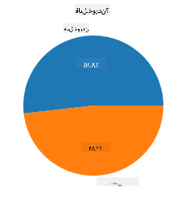
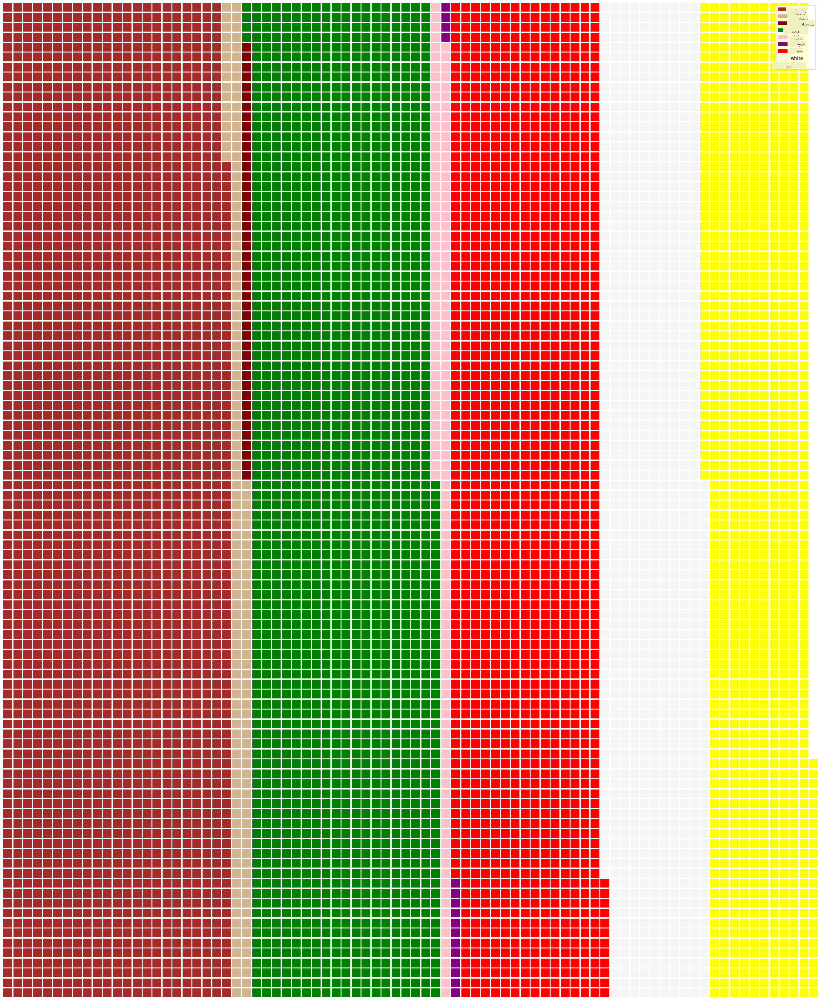

<!--
CO_OP_TRANSLATOR_METADATA:
{
  "original_hash": "cc490897ee2d276870472bcb31602d03",
  "translation_date": "2025-09-04T14:27:27+00:00",
  "source_file": "3-Data-Visualization/11-visualization-proportions/README.md",
  "language_code": "fa"
}
-->
# تجسم نسبت‌ها

|](../../sketchnotes/11-Visualizing-Proportions.png)|
|:---:|
|تجسم نسبت‌ها - _طرح دستی توسط [@nitya](https://twitter.com/nitya)_ |

در این درس، شما از یک مجموعه داده با تمرکز بر طبیعت استفاده خواهید کرد تا نسبت‌ها را تجسم کنید، مانند تعداد انواع مختلف قارچ‌ها که در یک مجموعه داده مربوط به قارچ‌ها وجود دارند. بیایید این قارچ‌های جذاب را با استفاده از مجموعه داده‌ای که از Audubon گرفته شده و جزئیات مربوط به ۲۳ گونه قارچ‌های تیغه‌دار در خانواده‌های Agaricus و Lepiota را ارائه می‌دهد، بررسی کنیم. شما با تجسم‌های خوشمزه‌ای مانند موارد زیر آزمایش خواهید کرد:

- نمودارهای دایره‌ای 🥧  
- نمودارهای دونات 🍩  
- نمودارهای وافل 🧇  

> 💡 یک پروژه بسیار جالب به نام [Charticulator](https://charticulator.com) توسط Microsoft Research یک رابط کاربری رایگان برای تجسم داده‌ها ارائه می‌دهد. در یکی از آموزش‌های آن‌ها نیز از این مجموعه داده قارچ‌ها استفاده شده است! بنابراین می‌توانید داده‌ها را بررسی کرده و همزمان کتابخانه را یاد بگیرید: [آموزش Charticulator](https://charticulator.com/tutorials/tutorial4.html).

## [آزمون پس از درس](https://ff-quizzes.netlify.app/en/ds/)

## با قارچ‌های خود آشنا شوید 🍄

قارچ‌ها بسیار جالب هستند. بیایید یک مجموعه داده وارد کنیم تا آن‌ها را مطالعه کنیم:

```python
import pandas as pd
import matplotlib.pyplot as plt
mushrooms = pd.read_csv('../../data/mushrooms.csv')
mushrooms.head()
```  
یک جدول با داده‌های عالی برای تحلیل چاپ می‌شود:

| class     | cap-shape | cap-surface | cap-color | bruises | odor    | gill-attachment | gill-spacing | gill-size | gill-color | stalk-shape | stalk-root | stalk-surface-above-ring | stalk-surface-below-ring | stalk-color-above-ring | stalk-color-below-ring | veil-type | veil-color | ring-number | ring-type | spore-print-color | population | habitat |
| --------- | --------- | ----------- | --------- | ------- | ------- | --------------- | ------------ | --------- | ---------- | ----------- | ---------- | ------------------------ | ------------------------ | ---------------------- | ---------------------- | --------- | ---------- | ----------- | --------- | ----------------- | ---------- | ------- |
| سمی       | محدب      | صاف         | قهوه‌ای   | کبودی   | تند     | آزاد            | نزدیک        | باریک     | سیاه       | بزرگ‌شونده | برابر      | صاف                     | صاف                     | سفید                   | سفید                   | جزئی      | سفید       | یک          | آویزان   | سیاه              | پراکنده    | شهری    |
| خوراکی    | محدب      | صاف         | زرد       | کبودی   | بادامی  | آزاد            | نزدیک        | پهن       | سیاه       | بزرگ‌شونده | چماقی      | صاف                     | صاف                     | سفید                   | سفید                   | جزئی      | سفید       | یک          | آویزان   | قهوه‌ای           | فراوان     | چمنزار |
| خوراکی    | زنگوله‌ای | صاف         | سفید      | کبودی   | بادیان  | آزاد            | نزدیک        | پهن       | قهوه‌ای    | بزرگ‌شونده | چماقی      | صاف                     | صاف                     | سفید                   | سفید                   | جزئی      | سفید       | یک          | آویزان   | قهوه‌ای           | فراوان     | مراتع  |
| سمی       | محدب      | فلس‌دار     | سفید      | کبودی   | تند     | آزاد            | نزدیک        | باریک     | قهوه‌ای    | بزرگ‌شونده | برابر      | صاف                     | صاف                     | سفید                   | سفید                   | جزئی      | سفید       | یک          | آویزان   | سیاه              | پراکنده    | شهری    |

بلافاصله متوجه می‌شوید که تمام داده‌ها متنی هستند. شما باید این داده‌ها را تبدیل کنید تا بتوانید از آن‌ها در یک نمودار استفاده کنید. در واقع، بیشتر داده‌ها به صورت یک شیء نمایش داده شده‌اند:

```python
print(mushrooms.select_dtypes(["object"]).columns)
```  

خروجی به صورت زیر است:

```output
Index(['class', 'cap-shape', 'cap-surface', 'cap-color', 'bruises', 'odor',
       'gill-attachment', 'gill-spacing', 'gill-size', 'gill-color',
       'stalk-shape', 'stalk-root', 'stalk-surface-above-ring',
       'stalk-surface-below-ring', 'stalk-color-above-ring',
       'stalk-color-below-ring', 'veil-type', 'veil-color', 'ring-number',
       'ring-type', 'spore-print-color', 'population', 'habitat'],
      dtype='object')
```  
این داده‌ها را بگیرید و ستون 'class' را به یک دسته‌بندی تبدیل کنید:

```python
cols = mushrooms.select_dtypes(["object"]).columns
mushrooms[cols] = mushrooms[cols].astype('category')
```  

```python
edibleclass=mushrooms.groupby(['class']).count()
edibleclass
```  

اکنون، اگر داده‌های قارچ‌ها را چاپ کنید، می‌بینید که آن‌ها بر اساس دسته‌بندی‌های خوراکی/سمی گروه‌بندی شده‌اند:

|           | cap-shape | cap-surface | cap-color | bruises | odor | gill-attachment | gill-spacing | gill-size | gill-color | stalk-shape | ... | stalk-surface-below-ring | stalk-color-above-ring | stalk-color-below-ring | veil-type | veil-color | ring-number | ring-type | spore-print-color | population | habitat |
| --------- | --------- | ----------- | --------- | ------- | ---- | --------------- | ------------ | --------- | ---------- | ----------- | --- | ------------------------ | ---------------------- | ---------------------- | --------- | ---------- | ----------- | --------- | ----------------- | ---------- | ------- |
| class     |           |             |           |         |      |                 |              |           |            |             |     |                          |                        |                        |           |            |             |           |                   |            |         |
| خوراکی    | 4208      | 4208        | 4208      | 4208    | 4208 | 4208            | 4208         | 4208      | 4208       | 4208        | ... | 4208                     | 4208                   | 4208                   | 4208      | 4208       | 4208        | 4208      | 4208              | 4208       | 4208    |
| سمی       | 3916      | 3916        | 3916      | 3916    | 3916 | 3916            | 3916         | 3916      | 3916       | 3916        | ... | 3916                     | 3916                   | 3916                   | 3916      | 3916       | 3916        | 3916      | 3916              | 3916       | 3916    |

اگر ترتیب ارائه شده در این جدول را دنبال کنید تا برچسب‌های دسته‌بندی کلاس خود را ایجاد کنید، می‌توانید یک نمودار دایره‌ای بسازید:

## دایره‌ای!

```python
labels=['Edible','Poisonous']
plt.pie(edibleclass['population'],labels=labels,autopct='%.1f %%')
plt.title('Edible?')
plt.show()
```  
وویلا، یک نمودار دایره‌ای که نسبت‌های این داده‌ها را بر اساس این دو دسته قارچ نشان می‌دهد. بسیار مهم است که ترتیب برچسب‌ها را به درستی تنظیم کنید، به خصوص در اینجا، بنابراین حتماً ترتیب ساخت آرایه برچسب را بررسی کنید!



## دونات!

یک نمودار دایره‌ای کمی جذاب‌تر، نمودار دونات است که یک نمودار دایره‌ای با یک سوراخ در وسط است. بیایید داده‌های خود را با استفاده از این روش بررسی کنیم.

به زیستگاه‌های مختلفی که قارچ‌ها در آن رشد می‌کنند نگاه کنید:

```python
habitat=mushrooms.groupby(['habitat']).count()
habitat
```  
در اینجا، داده‌های خود را بر اساس زیستگاه گروه‌بندی می‌کنید. ۷ زیستگاه ذکر شده است، بنابراین از آن‌ها به عنوان برچسب‌های نمودار دونات خود استفاده کنید:

```python
labels=['Grasses','Leaves','Meadows','Paths','Urban','Waste','Wood']

plt.pie(habitat['class'], labels=labels,
        autopct='%1.1f%%', pctdistance=0.85)
  
center_circle = plt.Circle((0, 0), 0.40, fc='white')
fig = plt.gcf()

fig.gca().add_artist(center_circle)
  
plt.title('Mushroom Habitats')
  
plt.show()
```  


این کد یک نمودار و یک دایره مرکزی رسم می‌کند، سپس آن دایره مرکزی را به نمودار اضافه می‌کند. عرض دایره مرکزی را با تغییر مقدار `0.40` به مقدار دیگری ویرایش کنید.

نمودارهای دونات را می‌توان به چندین روش تغییر داد تا برچسب‌ها را تغییر داد. به خصوص برچسب‌ها می‌توانند برای خوانایی برجسته شوند. اطلاعات بیشتر را در [مستندات](https://matplotlib.org/stable/gallery/pie_and_polar_charts/pie_and_donut_labels.html?highlight=donut) بیاموزید.

اکنون که می‌دانید چگونه داده‌های خود را گروه‌بندی کرده و سپس به صورت دایره‌ای یا دونات نمایش دهید، می‌توانید انواع دیگر نمودارها را بررسی کنید. یک نمودار وافل را امتحان کنید که فقط یک روش متفاوت برای بررسی کمیت است.

## وافل!

یک نمودار نوع 'وافل' یک روش متفاوت برای تجسم کمیت‌ها به صورت آرایه‌ای دو بعدی از مربع‌ها است. سعی کنید کمیت‌های مختلف رنگ‌های کلاه قارچ‌ها را در این مجموعه داده تجسم کنید. برای این کار، باید یک کتابخانه کمکی به نام [PyWaffle](https://pypi.org/project/pywaffle/) نصب کنید و از Matplotlib استفاده کنید:

```python
pip install pywaffle
```  

یک بخش از داده‌های خود را برای گروه‌بندی انتخاب کنید:

```python
capcolor=mushrooms.groupby(['cap-color']).count()
capcolor
```  

با ایجاد برچسب‌ها و سپس گروه‌بندی داده‌های خود، یک نمودار وافل ایجاد کنید:

```python
import pandas as pd
import matplotlib.pyplot as plt
from pywaffle import Waffle
  
data ={'color': ['brown', 'buff', 'cinnamon', 'green', 'pink', 'purple', 'red', 'white', 'yellow'],
    'amount': capcolor['class']
     }
  
df = pd.DataFrame(data)
  
fig = plt.figure(
    FigureClass = Waffle,
    rows = 100,
    values = df.amount,
    labels = list(df.color),
    figsize = (30,30),
    colors=["brown", "tan", "maroon", "green", "pink", "purple", "red", "whitesmoke", "yellow"],
)
```  

با استفاده از نمودار وافل، می‌توانید به وضوح نسبت‌های رنگ‌های کلاه قارچ‌ها در این مجموعه داده را مشاهده کنید. جالب است که قارچ‌های زیادی با کلاه سبز وجود دارند!



✅ PyWaffle از آیکون‌ها در نمودارها پشتیبانی می‌کند که از هر آیکونی که در [Font Awesome](https://fontawesome.com/) موجود است استفاده می‌کند. آزمایش‌هایی انجام دهید تا یک نمودار وافل جالب‌تر با استفاده از آیکون‌ها به جای مربع‌ها ایجاد کنید.

در این درس، شما سه روش برای تجسم نسبت‌ها یاد گرفتید. ابتدا باید داده‌های خود را به دسته‌بندی‌ها گروه‌بندی کنید و سپس تصمیم بگیرید که بهترین روش برای نمایش داده‌ها چیست - دایره‌ای، دونات، یا وافل. همه خوشمزه هستند و کاربر را با یک نمای فوری از مجموعه داده راضی می‌کنند.

## 🚀 چالش

سعی کنید این نمودارهای خوشمزه را در [Charticulator](https://charticulator.com) بازسازی کنید.  
## [آزمون پس از درس](https://purple-hill-04aebfb03.1.azurestaticapps.net/quiz/21)

## مرور و مطالعه شخصی

گاهی اوقات مشخص نیست که چه زمانی باید از نمودار دایره‌ای، دونات، یا وافل استفاده کرد. در اینجا چند مقاله برای مطالعه در این زمینه آورده شده است:

https://www.beautiful.ai/blog/battle-of-the-charts-pie-chart-vs-donut-chart

https://medium.com/@hypsypops/pie-chart-vs-donut-chart-showdown-in-the-ring-5d24fd86a9ce

https://www.mit.edu/~mbarker/formula1/f1help/11-ch-c6.htm

https://medium.datadriveninvestor.com/data-visualization-done-the-right-way-with-tableau-waffle-chart-fdf2a19be402

تحقیقات بیشتری انجام دهید تا اطلاعات بیشتری در مورد این تصمیم دشوار پیدا کنید.

## تکلیف

[آن را در اکسل امتحان کنید](assignment.md)

---

**سلب مسئولیت**:  
این سند با استفاده از سرویس ترجمه هوش مصنوعی [Co-op Translator](https://github.com/Azure/co-op-translator) ترجمه شده است. در حالی که ما برای دقت تلاش می‌کنیم، لطفاً توجه داشته باشید که ترجمه‌های خودکار ممکن است شامل خطاها یا نادرستی‌هایی باشند. سند اصلی به زبان اصلی آن باید به عنوان منبع معتبر در نظر گرفته شود. برای اطلاعات حساس، ترجمه حرفه‌ای انسانی توصیه می‌شود. ما هیچ مسئولیتی در قبال سوءتفاهم‌ها یا تفسیرهای نادرست ناشی از استفاده از این ترجمه نداریم.