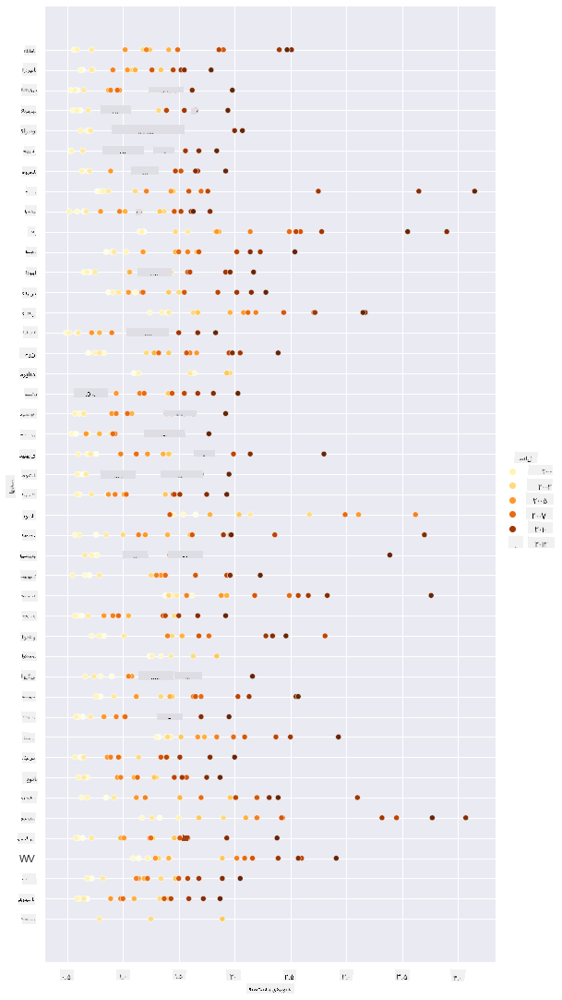
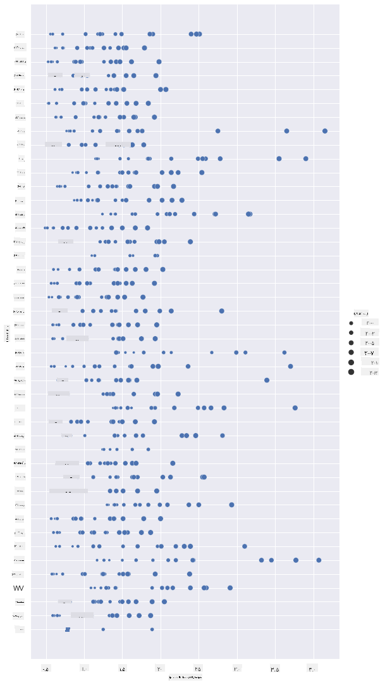
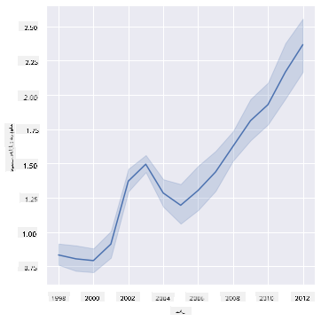
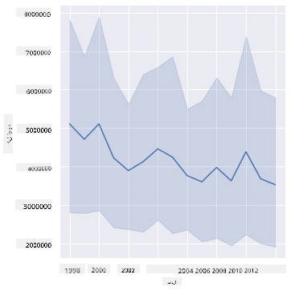

<!--
CO_OP_TRANSLATOR_METADATA:
{
  "original_hash": "0764fd4077f3f04a1d968ec371227744",
  "translation_date": "2025-09-06T11:28:02+00:00",
  "source_file": "3-Data-Visualization/12-visualization-relationships/README.md",
  "language_code": "fa"
}
-->
# تجسم روابط: همه چیز درباره عسل 🍯

| ](../../sketchnotes/12-Visualizing-Relationships.png)|
|:---:|
|تجسم روابط - _اسکتچ‌نوت توسط [@nitya](https://twitter.com/nitya)_ |

با ادامه تمرکز بر طبیعت در تحقیقاتمان، بیایید تجسم‌های جالبی را کشف کنیم که روابط بین انواع مختلف عسل را نشان می‌دهند، بر اساس یک مجموعه داده که از [وزارت کشاورزی ایالات متحده](https://www.nass.usda.gov/About_NASS/index.php) استخراج شده است.

این مجموعه داده شامل حدود ۶۰۰ مورد است که تولید عسل در بسیاری از ایالت‌های آمریکا را نمایش می‌دهد. به عنوان مثال، می‌توانید تعداد کلنی‌ها، بازده هر کلنی، تولید کل، ذخایر، قیمت هر پوند و ارزش عسل تولید شده در یک ایالت خاص را از سال ۱۹۹۸ تا ۲۰۱۲ بررسی کنید، به طوری که هر ردیف نشان‌دهنده یک سال برای هر ایالت است.

جالب خواهد بود که رابطه بین تولید سالانه یک ایالت و مثلاً قیمت عسل در آن ایالت را تجسم کنیم. یا می‌توانید رابطه بین بازده عسل هر کلنی در ایالت‌های مختلف را بررسی کنید. این بازه زمانی شامل دوره‌ای است که اختلال فروپاشی کلنی (CCD) برای اولین بار در سال ۲۰۰۶ مشاهده شد (http://npic.orst.edu/envir/ccd.html)، بنابراین این مجموعه داده برای مطالعه بسیار معنادار است. 🐝

## [آزمون پیش از درس](https://ff-quizzes.netlify.app/en/ds/quiz/22)

در این درس، می‌توانید از Seaborn که قبلاً از آن استفاده کرده‌اید، به عنوان یک کتابخانه مناسب برای تجسم روابط بین متغیرها استفاده کنید. به خصوص، استفاده از تابع `relplot` در Seaborn جالب است که امکان ایجاد نمودارهای پراکندگی و خطی را برای تجسم سریع '[روابط آماری](https://seaborn.pydata.org/tutorial/relational.html?highlight=relationships)' فراهم می‌کند و به دانشمند داده کمک می‌کند تا بهتر بفهمد متغیرها چگونه به یکدیگر مرتبط هستند.

## نمودارهای پراکندگی

از یک نمودار پراکندگی استفاده کنید تا نشان دهید قیمت عسل چگونه در طول سال‌ها، ایالت به ایالت، تغییر کرده است. Seaborn با استفاده از `relplot` داده‌های ایالت‌ها را گروه‌بندی کرده و نقاط داده را برای داده‌های دسته‌ای و عددی نمایش می‌دهد.

بیایید با وارد کردن داده‌ها و Seaborn شروع کنیم:

```python
import pandas as pd
import matplotlib.pyplot as plt
import seaborn as sns
honey = pd.read_csv('../../data/honey.csv')
honey.head()
```
متوجه می‌شوید که داده‌های عسل شامل چندین ستون جالب است، از جمله سال و قیمت هر پوند. بیایید این داده‌ها را که بر اساس ایالت‌های آمریکا گروه‌بندی شده‌اند، بررسی کنیم:

| ایالت | تعداد کلنی‌ها | بازده هر کلنی | تولید کل | ذخایر   | قیمت هر پوند | ارزش تولید | سال |
| ----- | ------------- | ------------- | -------- | ------- | ------------ | ----------- | --- |
| AL    | 16000         | 71            | 1136000  | 159000  | 0.72         | 818000      | 1998 |
| AZ    | 55000         | 60            | 3300000  | 1485000 | 0.64         | 2112000     | 1998 |
| AR    | 53000         | 65            | 3445000  | 1688000 | 0.59         | 2033000     | 1998 |
| CA    | 450000        | 83            | 37350000 | 12326000| 0.62         | 23157000    | 1998 |
| CO    | 27000         | 72            | 1944000  | 1594000 | 0.7          | 1361000     | 1998 |

یک نمودار پراکندگی ساده ایجاد کنید تا رابطه بین قیمت هر پوند عسل و ایالت مبدأ آن را نشان دهید. محور `y` را به اندازه کافی بلند کنید تا تمام ایالت‌ها نمایش داده شوند:

```python
sns.relplot(x="priceperlb", y="state", data=honey, height=15, aspect=.5);
```


حالا، همان داده‌ها را با یک طرح رنگی مرتبط با عسل نمایش دهید تا نشان دهید قیمت چگونه در طول سال‌ها تغییر کرده است. می‌توانید این کار را با افزودن پارامتر 'hue' برای نمایش تغییرات سال به سال انجام دهید:

> ✅ درباره [طرح‌های رنگی موجود در Seaborn](https://seaborn.pydata.org/tutorial/color_palettes.html) بیشتر بیاموزید - یک طرح رنگی رنگین‌کمانی زیبا را امتحان کنید!

```python
sns.relplot(x="priceperlb", y="state", hue="year", palette="YlOrBr", data=honey, height=15, aspect=.5);
```


با این تغییر طرح رنگ، می‌توانید ببینید که به وضوح یک پیشرفت قوی در طول سال‌ها از نظر قیمت هر پوند عسل وجود دارد. در واقع، اگر یک مجموعه نمونه از داده‌ها را بررسی کنید (مثلاً ایالت آریزونا)، می‌توانید الگویی از افزایش قیمت سال به سال را با چند استثنا مشاهده کنید:

| ایالت | تعداد کلنی‌ها | بازده هر کلنی | تولید کل | ذخایر  | قیمت هر پوند | ارزش تولید | سال |
| ----- | ------------- | ------------- | -------- | ------ | ------------ | ----------- | --- |
| AZ    | 55000         | 60            | 3300000  | 1485000| 0.64         | 2112000     | 1998 |
| AZ    | 52000         | 62            | 3224000  | 1548000| 0.62         | 1999000     | 1999 |
| AZ    | 40000         | 59            | 2360000  | 1322000| 0.73         | 1723000     | 2000 |
| AZ    | 43000         | 59            | 2537000  | 1142000| 0.72         | 1827000     | 2001 |
| AZ    | 38000         | 63            | 2394000  | 1197000| 1.08         | 2586000     | 2002 |
| AZ    | 35000         | 72            | 2520000  | 983000 | 1.34         | 3377000     | 2003 |
| AZ    | 32000         | 55            | 1760000  | 774000 | 1.11         | 1954000     | 2004 |
| AZ    | 36000         | 50            | 1800000  | 720000 | 1.04         | 1872000     | 2005 |
| AZ    | 30000         | 65            | 1950000  | 839000 | 0.91         | 1775000     | 2006 |
| AZ    | 30000         | 64            | 1920000  | 902000 | 1.26         | 2419000     | 2007 |
| AZ    | 25000         | 64            | 1600000  | 336000 | 1.26         | 2016000     | 2008 |
| AZ    | 20000         | 52            | 1040000  | 562000 | 1.45         | 1508000     | 2009 |
| AZ    | 24000         | 77            | 1848000  | 665000 | 1.52         | 2809000     | 2010 |
| AZ    | 23000         | 53            | 1219000  | 427000 | 1.55         | 1889000     | 2011 |
| AZ    | 22000         | 46            | 1012000  | 253000 | 1.79         | 1811000     | 2012 |

راه دیگری برای تجسم این پیشرفت استفاده از اندازه به جای رنگ است. برای کاربران کوررنگ، این ممکن است گزینه بهتری باشد. تجسم خود را ویرایش کنید تا افزایش قیمت را با افزایش اندازه نقاط نشان دهید:

```python
sns.relplot(x="priceperlb", y="state", size="year", data=honey, height=15, aspect=.5);
```
می‌توانید ببینید که اندازه نقاط به تدریج افزایش می‌یابد.



آیا این یک مورد ساده از عرضه و تقاضا است؟ آیا به دلیل عواملی مانند تغییرات اقلیمی و فروپاشی کلنی، عسل کمتری برای خرید در دسترس است و بنابراین قیمت افزایش می‌یابد؟

برای کشف همبستگی بین برخی از متغیرهای این مجموعه داده، بیایید چند نمودار خطی را بررسی کنیم.

## نمودارهای خطی

سؤال: آیا افزایش واضحی در قیمت هر پوند عسل در طول سال‌ها وجود دارد؟ می‌توانید به راحتی این موضوع را با ایجاد یک نمودار خطی ساده کشف کنید:

```python
sns.relplot(x="year", y="priceperlb", kind="line", data=honey);
```
پاسخ: بله، با چند استثنا در حدود سال ۲۰۰۳:



✅ از آنجا که Seaborn داده‌ها را در یک خط تجمیع می‌کند، "اندازه‌گیری‌های متعدد در هر مقدار x را با رسم میانگین و فاصله اطمینان ۹۵٪ در اطراف میانگین نمایش می‌دهد". [منبع](https://seaborn.pydata.org/tutorial/relational.html). این رفتار زمان‌بر را می‌توان با افزودن `ci=None` غیرفعال کرد.

سؤال: خب، آیا در سال ۲۰۰۳ می‌توانیم افزایش در عرضه عسل را نیز مشاهده کنیم؟ اگر تولید کل را سال به سال بررسی کنید چه؟

```python
sns.relplot(x="year", y="totalprod", kind="line", data=honey);
```



پاسخ: نه واقعاً. اگر به تولید کل نگاه کنید، به نظر می‌رسد که در آن سال خاص افزایش یافته است، حتی اگر به طور کلی مقدار عسل تولید شده در این سال‌ها در حال کاهش باشد.

سؤال: در این صورت، چه چیزی می‌توانسته باعث افزایش قیمت عسل در حدود سال ۲۰۰۳ شود؟

برای کشف این موضوع، می‌توانید یک شبکه فاست را بررسی کنید.

## شبکه‌های فاست

شبکه‌های فاست یک جنبه از مجموعه داده شما را می‌گیرند (در مورد ما، می‌توانید 'سال' را انتخاب کنید تا از تولید بیش از حد فاست‌ها جلوگیری شود). سپس Seaborn می‌تواند یک نمودار برای هر یک از این فاست‌ها از مختصات x و y انتخابی شما ایجاد کند تا مقایسه بصری آسان‌تر شود. آیا سال ۲۰۰۳ در این نوع مقایسه برجسته است؟

یک شبکه فاست ایجاد کنید و به استفاده از `relplot` همان‌طور که در [مستندات Seaborn](https://seaborn.pydata.org/generated/seaborn.FacetGrid.html?highlight=facetgrid#seaborn.FacetGrid) توصیه شده است، ادامه دهید.

```python
sns.relplot(
    data=honey, 
    x="yieldpercol", y="numcol",
    col="year", 
    col_wrap=3,
    kind="line"
    )
```
در این تجسم، می‌توانید بازده هر کلنی و تعداد کلنی‌ها را سال به سال، کنار هم با تنظیم wrap در ۳ برای ستون‌ها مقایسه کنید:


برای این مجموعه داده، هیچ چیز خاصی در مورد تعداد کلنی‌ها و بازده آن‌ها، سال به سال و ایالت به ایالت برجسته نیست. آیا راه دیگری برای یافتن همبستگی بین این دو متغیر وجود دارد؟

## نمودارهای دوخطی

یک نمودار چندخطی را امتحان کنید که دو نمودار خطی را روی یکدیگر قرار می‌دهد، با استفاده از 'despine' در Seaborn برای حذف ستون‌ها و خطوط بالایی و سمت راست، و استفاده از `ax.twinx` [مشتق شده از Matplotlib](https://matplotlib.org/stable/api/_as_gen/matplotlib.axes.Axes.twinx.html). Twinx به یک نمودار اجازه می‌دهد محور x را به اشتراک بگذارد و دو محور y را نمایش دهد. بنابراین، بازده هر کلنی و تعداد کلنی‌ها را روی هم نمایش دهید:

```python
fig, ax = plt.subplots(figsize=(12,6))
lineplot = sns.lineplot(x=honey['year'], y=honey['numcol'], data=honey, 
                        label = 'Number of bee colonies', legend=False)
sns.despine()
plt.ylabel('# colonies')
plt.title('Honey Production Year over Year');

ax2 = ax.twinx()
lineplot2 = sns.lineplot(x=honey['year'], y=honey['yieldpercol'], ax=ax2, color="r", 
                         label ='Yield per colony', legend=False) 
sns.despine(right=False)
plt.ylabel('colony yield')
ax.figure.legend();
```


در حالی که چیزی در حدود سال ۲۰۰۳ به چشم نمی‌آید، این نمودار به ما اجازه می‌دهد این درس را با یک نکته خوشحال‌کننده‌تر به پایان برسانیم: در حالی که تعداد کلنی‌ها به طور کلی در حال کاهش است، تعداد کلنی‌ها در حال تثبیت است حتی اگر بازده هر کلنی کاهش یابد.

زنبورها، موفق باشید! 🐝❤️

## 🚀 چالش

در این درس، کمی بیشتر درباره استفاده‌های دیگر نمودارهای پراکندگی و شبکه‌های خطی، از جمله شبکه‌های فاست، یاد گرفتید. خودتان را به چالش بکشید تا یک شبکه فاست با استفاده از یک مجموعه داده دیگر ایجاد کنید، شاید یکی از مجموعه داده‌هایی که قبل از این درس‌ها استفاده کرده‌اید. توجه کنید که ایجاد آن‌ها چقدر زمان می‌برد و چگونه باید مراقب باشید که چند شبکه باید با استفاده از این تکنیک‌ها رسم کنید.

## [آزمون پس از درس](https://ff-quizzes.netlify.app/en/ds/quiz/23)

## مرور و مطالعه شخصی

نمودارهای خطی می‌توانند ساده یا بسیار پیچیده باشند. کمی در [مستندات Seaborn](https://seaborn.pydata.org/generated/seaborn.lineplot.html) درباره روش‌های مختلفی که می‌توانید آن‌ها را بسازید مطالعه کنید. سعی کنید نمودارهای خطی که در این درس ساخته‌اید را با روش‌های دیگر ذکر شده در مستندات بهبود ببخشید.

## تکلیف

[به کندوی زنبور شیرجه بزنید](assignment.md)

---

**سلب مسئولیت**:  
این سند با استفاده از سرویس ترجمه هوش مصنوعی [Co-op Translator](https://github.com/Azure/co-op-translator) ترجمه شده است. در حالی که ما برای دقت تلاش می‌کنیم، لطفاً توجه داشته باشید که ترجمه‌های خودکار ممکن است شامل خطاها یا نادقتی‌ها باشند. سند اصلی به زبان اصلی آن باید به عنوان منبع معتبر در نظر گرفته شود. برای اطلاعات حساس، ترجمه حرفه‌ای انسانی توصیه می‌شود. ما هیچ مسئولیتی در قبال سوءتفاهم‌ها یا تفسیرهای نادرست ناشی از استفاده از این ترجمه نداریم.