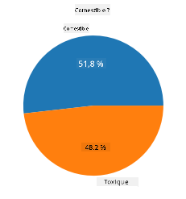
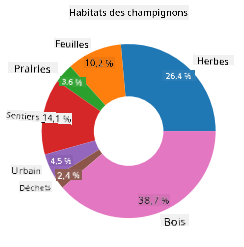
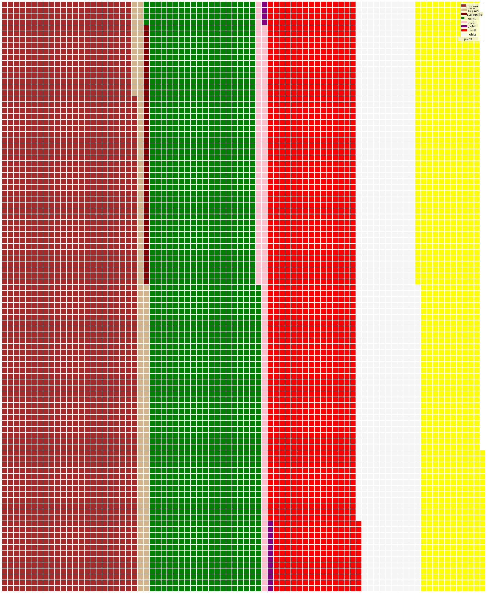

<!--
CO_OP_TRANSLATOR_METADATA:
{
  "original_hash": "cc490897ee2d276870472bcb31602d03",
  "translation_date": "2025-09-04T13:02:37+00:00",
  "source_file": "3-Data-Visualization/11-visualization-proportions/README.md",
  "language_code": "fr"
}
-->
# Visualiser les proportions

| ](../../sketchnotes/11-Visualizing-Proportions.png)|
|:---:|
|Visualiser les proportions - _Sketchnote par [@nitya](https://twitter.com/nitya)_ |

Dans cette leçon, vous utiliserez un ensemble de données axé sur la nature pour visualiser les proportions, comme le nombre de types différents de champignons présents dans un ensemble de données sur les champignons. Explorons ces fascinants champignons à l'aide d'un ensemble de données provenant d'Audubon, qui répertorie des détails sur 23 espèces de champignons à lamelles des familles Agaricus et Lepiota. Vous expérimenterez des visualisations savoureuses telles que :

- Les diagrammes circulaires 🥧  
- Les diagrammes en anneau 🍩  
- Les graphiques en gaufre 🧇  

> 💡 Un projet très intéressant appelé [Charticulator](https://charticulator.com) de Microsoft Research propose une interface gratuite de glisser-déposer pour les visualisations de données. Dans l'un de leurs tutoriels, ils utilisent également cet ensemble de données sur les champignons ! Vous pouvez donc explorer les données et apprendre à utiliser la bibliothèque en même temps : [Tutoriel Charticulator](https://charticulator.com/tutorials/tutorial4.html).

## [Quiz après la leçon](https://ff-quizzes.netlify.app/en/ds/)

## Apprenez à connaître vos champignons 🍄

Les champignons sont très intéressants. Importons un ensemble de données pour les étudier :

```python
import pandas as pd
import matplotlib.pyplot as plt
mushrooms = pd.read_csv('../../data/mushrooms.csv')
mushrooms.head()
```  
Un tableau est affiché avec des données intéressantes pour l'analyse :

| classe     | forme du chapeau | surface du chapeau | couleur du chapeau | meurtri | odeur    | attachement des lamelles | espacement des lamelles | taille des lamelles | couleur des lamelles | forme du pied | racine du pied | surface du pied au-dessus de l'anneau | surface du pied en-dessous de l'anneau | couleur du pied au-dessus de l'anneau | couleur du pied en-dessous de l'anneau | type de voile | couleur du voile | nombre d'anneaux | type d'anneau | couleur des spores | population | habitat |
| --------- | ---------------- | ------------------ | ------------------ | ------- | ------- | ------------------------ | ----------------------- | ------------------- | -------------------- | ------------- | -------------- | ------------------------------------ | ------------------------------------ | ------------------------------------ | ------------------------------------ | ------------- | ---------------- | ---------------- | ------------- | ----------------- | ---------- | ------- |
| Toxique   | Convexe          | Lisse             | Marron            | Meurtri | Piquant | Libre                   | Serré                  | Étroit              | Noir                | Élargi        | Égal           | Lisse                               | Lisse                               | Blanc                               | Blanc                               | Partiel       | Blanc            | Un               | Pendant       | Noir              | Dispersé   | Urbain  |
| Comestible| Convexe          | Lisse             | Jaune             | Meurtri | Amande  | Libre                   | Serré                  | Large               | Noir                | Élargi        | Massue         | Lisse                               | Lisse                               | Blanc                               | Blanc                               | Partiel       | Blanc            | Un               | Pendant       | Marron            | Nombreux   | Herbes  |
| Comestible| Cloché           | Lisse             | Blanc             | Meurtri | Anis    | Libre                   | Serré                  | Large               | Marron              | Élargi        | Massue         | Lisse                               | Lisse                               | Blanc                               | Blanc                               | Partiel       | Blanc            | Un               | Pendant       | Marron            | Nombreux   | Prairies|
| Toxique   | Convexe          | Écailleux         | Blanc             | Meurtri | Piquant | Libre                   | Serré                  | Étroit              | Marron              | Élargi        | Égal           | Lisse                               | Lisse                               | Blanc                               | Blanc                               | Partiel       | Blanc            | Un               | Pendant       | Noir              | Dispersé   | Urbain  |

Vous remarquez immédiatement que toutes les données sont textuelles. Vous devrez convertir ces données pour pouvoir les utiliser dans un graphique. La plupart des données, en fait, sont représentées comme un objet :

```python
print(mushrooms.select_dtypes(["object"]).columns)
```  

Le résultat est :

```output
Index(['class', 'cap-shape', 'cap-surface', 'cap-color', 'bruises', 'odor',
       'gill-attachment', 'gill-spacing', 'gill-size', 'gill-color',
       'stalk-shape', 'stalk-root', 'stalk-surface-above-ring',
       'stalk-surface-below-ring', 'stalk-color-above-ring',
       'stalk-color-below-ring', 'veil-type', 'veil-color', 'ring-number',
       'ring-type', 'spore-print-color', 'population', 'habitat'],
      dtype='object')
```  
Prenez ces données et convertissez la colonne 'classe' en catégorie :

```python
cols = mushrooms.select_dtypes(["object"]).columns
mushrooms[cols] = mushrooms[cols].astype('category')
```  

```python
edibleclass=mushrooms.groupby(['class']).count()
edibleclass
```  

Maintenant, si vous affichez les données des champignons, vous pouvez voir qu'elles ont été regroupées en catégories selon la classe toxique/comestible :

|           | forme du chapeau | surface du chapeau | couleur du chapeau | meurtri | odeur | attachement des lamelles | espacement des lamelles | taille des lamelles | couleur des lamelles | forme du pied | ... | surface du pied en-dessous de l'anneau | couleur du pied au-dessus de l'anneau | couleur du pied en-dessous de l'anneau | type de voile | couleur du voile | nombre d'anneaux | type d'anneau | couleur des spores | population | habitat |
| --------- | ---------------- | ------------------ | ------------------ | ------- | ---- | ------------------------ | ----------------------- | ------------------- | -------------------- | ------------- | --- | ------------------------------------ | ------------------------------------ | ------------------------------------ | ------------- | ---------------- | ---------------- | ------------- | ----------------- | ---------- | ------- |
| classe    |                  |                    |                    |         |      |                          |                         |                     |                      |               |     |                                    |                                    |                                    |               |                |                |               |                   |            |         |
| Comestible| 4208             | 4208               | 4208               | 4208    | 4208 | 4208                     | 4208                    | 4208                | 4208                 | 4208          | ... | 4208                               | 4208                               | 4208                               | 4208          | 4208           | 4208           | 4208          | 4208              | 4208       | 4208    |
| Toxique   | 3916             | 3916               | 3916               | 3916    | 3916 | 3916                     | 3916                    | 3916                | 3916                 | 3916          | ... | 3916                               | 3916                               | 3916                               | 3916          | 3916           | 3916           | 3916          | 3916              | 3916       | 3916    |

Si vous suivez l'ordre présenté dans ce tableau pour créer vos étiquettes de catégorie de classe, vous pouvez construire un diagramme circulaire :

## Diagramme circulaire !

```python
labels=['Edible','Poisonous']
plt.pie(edibleclass['population'],labels=labels,autopct='%.1f %%')
plt.title('Edible?')
plt.show()
```  
Et voilà, un diagramme circulaire montrant les proportions de ces données selon ces deux classes de champignons. Il est très important de respecter l'ordre des étiquettes, surtout ici, alors assurez-vous de vérifier l'ordre dans lequel le tableau des étiquettes est construit !



## Diagrammes en anneau !

Un diagramme circulaire un peu plus visuellement intéressant est un diagramme en anneau, qui est un diagramme circulaire avec un trou au milieu. Regardons nos données en utilisant cette méthode.

Examinez les différents habitats où poussent les champignons :

```python
habitat=mushrooms.groupby(['habitat']).count()
habitat
```  
Ici, vous regroupez vos données par habitat. Il y en a 7 répertoriés, alors utilisez-les comme étiquettes pour votre diagramme en anneau :

```python
labels=['Grasses','Leaves','Meadows','Paths','Urban','Waste','Wood']

plt.pie(habitat['class'], labels=labels,
        autopct='%1.1f%%', pctdistance=0.85)
  
center_circle = plt.Circle((0, 0), 0.40, fc='white')
fig = plt.gcf()

fig.gca().add_artist(center_circle)
  
plt.title('Mushroom Habitats')
  
plt.show()
```  



Ce code dessine un graphique et un cercle central, puis ajoute ce cercle central au graphique. Modifiez la largeur du cercle central en changeant `0.40` pour une autre valeur.

Les diagrammes en anneau peuvent être ajustés de plusieurs façons pour modifier les étiquettes. Les étiquettes, en particulier, peuvent être mises en évidence pour améliorer la lisibilité. En savoir plus dans la [documentation](https://matplotlib.org/stable/gallery/pie_and_polar_charts/pie_and_donut_labels.html?highlight=donut).

Maintenant que vous savez comment regrouper vos données et les afficher sous forme de diagramme circulaire ou en anneau, vous pouvez explorer d'autres types de graphiques. Essayez un graphique en gaufre, qui est simplement une autre façon d'explorer les quantités.

## Graphiques en gaufre !

Un graphique de type 'gaufre' est une manière différente de visualiser les quantités sous forme de tableau 2D de carrés. Essayez de visualiser les différentes quantités de couleurs de chapeau de champignon dans cet ensemble de données. Pour ce faire, vous devez installer une bibliothèque d'assistance appelée [PyWaffle](https://pypi.org/project/pywaffle/) et utiliser Matplotlib :

```python
pip install pywaffle
```  

Sélectionnez un segment de vos données à regrouper :

```python
capcolor=mushrooms.groupby(['cap-color']).count()
capcolor
```  

Créez un graphique en gaufre en créant des étiquettes, puis en regroupant vos données :

```python
import pandas as pd
import matplotlib.pyplot as plt
from pywaffle import Waffle
  
data ={'color': ['brown', 'buff', 'cinnamon', 'green', 'pink', 'purple', 'red', 'white', 'yellow'],
    'amount': capcolor['class']
     }
  
df = pd.DataFrame(data)
  
fig = plt.figure(
    FigureClass = Waffle,
    rows = 100,
    values = df.amount,
    labels = list(df.color),
    figsize = (30,30),
    colors=["brown", "tan", "maroon", "green", "pink", "purple", "red", "whitesmoke", "yellow"],
)
```  

Avec un graphique en gaufre, vous pouvez clairement voir les proportions des couleurs de chapeau dans cet ensemble de données sur les champignons. Fait intéressant, il y a beaucoup de champignons à chapeau vert !



✅ PyWaffle prend en charge les icônes dans les graphiques qui utilisent n'importe quelle icône disponible dans [Font Awesome](https://fontawesome.com/). Faites des expériences pour créer un graphique en gaufre encore plus intéressant en utilisant des icônes au lieu de carrés.

Dans cette leçon, vous avez appris trois façons de visualiser les proportions. Tout d'abord, vous devez regrouper vos données en catégories, puis décider de la meilleure façon de les afficher - circulaire, en anneau ou en gaufre. Tous sont délicieux et offrent à l'utilisateur un aperçu instantané d'un ensemble de données.

## 🚀 Défi

Essayez de recréer ces graphiques savoureux dans [Charticulator](https://charticulator.com).  
## [Quiz après la leçon](https://purple-hill-04aebfb03.1.azurestaticapps.net/quiz/21)

## Révision et étude personnelle

Parfois, il n'est pas évident de savoir quand utiliser un diagramme circulaire, en anneau ou en gaufre. Voici quelques articles à lire sur ce sujet :

https://www.beautiful.ai/blog/battle-of-the-charts-pie-chart-vs-donut-chart  

https://medium.com/@hypsypops/pie-chart-vs-donut-chart-showdown-in-the-ring-5d24fd86a9ce  

https://www.mit.edu/~mbarker/formula1/f1help/11-ch-c6.htm  

https://medium.datadriveninvestor.com/data-visualization-done-the-right-way-with-tableau-waffle-chart-fdf2a19be402  

Faites des recherches pour trouver plus d'informations sur cette décision délicate.

## Devoir

[Essayez-le dans Excel](assignment.md)  

---

**Avertissement** :  
Ce document a été traduit à l'aide du service de traduction automatique [Co-op Translator](https://github.com/Azure/co-op-translator). Bien que nous nous efforcions d'assurer l'exactitude, veuillez noter que les traductions automatisées peuvent contenir des erreurs ou des inexactitudes. Le document original dans sa langue d'origine doit être considéré comme la source faisant autorité. Pour des informations critiques, il est recommandé de faire appel à une traduction humaine professionnelle. Nous déclinons toute responsabilité en cas de malentendus ou d'interprétations erronées résultant de l'utilisation de cette traduction.