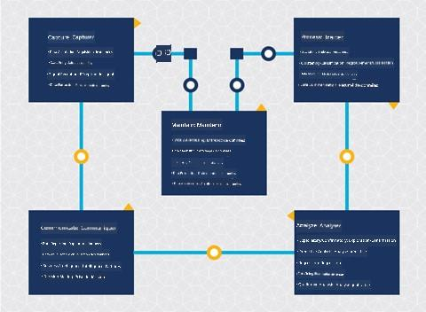
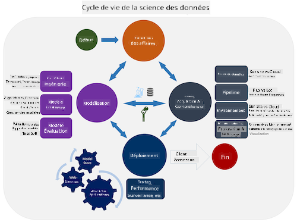

<!--
CO_OP_TRANSLATOR_METADATA:
{
  "original_hash": "79ca8a5a3135e94d2d43f56ba62d5205",
  "translation_date": "2025-09-04T13:01:03+00:00",
  "source_file": "4-Data-Science-Lifecycle/14-Introduction/README.md",
  "language_code": "fr"
}
-->
# Introduction au cycle de vie de la science des données

| ](../../sketchnotes/14-DataScience-Lifecycle.png)|
|:---:|
| Introduction au cycle de vie de la science des données - _Sketchnote par [@nitya](https://twitter.com/nitya)_ |

## [Quiz avant le cours](https://red-water-0103e7a0f.azurestaticapps.net/quiz/26)

À ce stade, vous avez probablement réalisé que la science des données est un processus. Ce processus peut être divisé en 5 étapes :

- Capture
- Traitement
- Analyse
- Communication
- Maintenance

Cette leçon se concentre sur 3 parties du cycle de vie : la capture, le traitement et la maintenance.

> Photo par [Berkeley School of Information](https://ischoolonline.berkeley.edu/data-science/what-is-data-science/)

## Capture

La première étape du cycle de vie est très importante car les étapes suivantes en dépendent. Elle combine pratiquement deux étapes en une seule : l'acquisition des données et la définition de l'objectif et des problèmes à résoudre.  
Définir les objectifs du projet nécessitera une compréhension approfondie du problème ou de la question. Tout d'abord, nous devons identifier et acquérir les personnes dont le problème doit être résolu. Il peut s'agir de parties prenantes dans une entreprise ou de sponsors du projet, qui peuvent aider à identifier qui ou quoi bénéficiera de ce projet, ainsi que ce dont ils ont besoin et pourquoi. Un objectif bien défini doit être mesurable et quantifiable pour définir un résultat acceptable.

Questions qu'un data scientist pourrait poser :
- Ce problème a-t-il déjà été abordé auparavant ? Qu'a-t-on découvert ?
- L'objectif et le but sont-ils compris par tous les participants ?
- Y a-t-il des ambiguïtés et comment les réduire ?
- Quelles sont les contraintes ?
- À quoi pourrait ressembler le résultat final ?
- Quelles ressources (temps, personnes, calculs) sont disponibles ?

Ensuite, il faut identifier, collecter, puis explorer les données nécessaires pour atteindre ces objectifs définis. À cette étape d'acquisition, les data scientists doivent également évaluer la quantité et la qualité des données. Cela nécessite une exploration des données pour confirmer que ce qui a été acquis permettra d'atteindre le résultat souhaité.

Questions qu'un data scientist pourrait poser sur les données :
- Quelles données sont déjà disponibles ?
- Qui possède ces données ?
- Quels sont les problèmes de confidentialité ?
- Ai-je suffisamment de données pour résoudre ce problème ?
- Les données sont-elles de qualité acceptable pour ce problème ?
- Si je découvre des informations supplémentaires à travers ces données, devrions-nous envisager de modifier ou de redéfinir les objectifs ?

## Traitement

L'étape de traitement du cycle de vie se concentre sur la découverte de motifs dans les données ainsi que sur la modélisation. Certaines techniques utilisées à cette étape nécessitent des méthodes statistiques pour révéler les motifs. Typiquement, ce serait une tâche fastidieuse pour un humain avec un grand ensemble de données, et on s'appuiera sur des ordinateurs pour accélérer le processus. Cette étape est également là où la science des données et l'apprentissage automatique se croisent. Comme vous l'avez appris dans la première leçon, l'apprentissage automatique est le processus de construction de modèles pour comprendre les données. Les modèles sont une représentation de la relation entre les variables dans les données qui aident à prédire les résultats.

Les techniques courantes utilisées à cette étape sont couvertes dans le programme ML pour débutants. Suivez les liens pour en savoir plus :

- [Classification](https://github.com/microsoft/ML-For-Beginners/tree/main/4-Classification) : Organiser les données en catégories pour une utilisation plus efficace.
- [Clustering](https://github.com/microsoft/ML-For-Beginners/tree/main/5-Clustering) : Regrouper les données en groupes similaires.
- [Régression](https://github.com/microsoft/ML-For-Beginners/tree/main/2-Regression) : Déterminer les relations entre les variables pour prédire ou prévoir des valeurs.

## Maintenance

Dans le diagramme du cycle de vie, vous avez peut-être remarqué que la maintenance se situe entre la capture et le traitement. La maintenance est un processus continu de gestion, de stockage et de sécurisation des données tout au long du projet et doit être prise en compte tout au long de celui-ci.

### Stockage des données

Les considérations sur la manière et l'endroit où les données sont stockées peuvent influencer le coût de leur stockage ainsi que les performances de la vitesse d'accès aux données. Ces décisions ne sont pas nécessairement prises par un data scientist seul, mais il peut se retrouver à faire des choix sur la manière de travailler avec les données en fonction de leur stockage.

Voici quelques aspects des systèmes modernes de stockage de données qui peuvent influencer ces choix :

**Sur site vs hors site vs cloud public ou privé**

Sur site fait référence à l'hébergement et à la gestion des données sur votre propre équipement, comme posséder un serveur avec des disques durs qui stockent les données, tandis que hors site repose sur un équipement que vous ne possédez pas, comme un centre de données. Le cloud public est un choix populaire pour stocker des données qui ne nécessite aucune connaissance sur la manière ou l'endroit exact où les données sont stockées, où "public" fait référence à une infrastructure sous-jacente unifiée partagée par tous les utilisateurs du cloud. Certaines organisations ont des politiques de sécurité strictes qui exigent un accès complet à l'équipement où les données sont hébergées et utiliseront un cloud privé qui fournit ses propres services cloud. Vous en apprendrez davantage sur les données dans le cloud dans les [leçons ultérieures](https://github.com/microsoft/Data-Science-For-Beginners/tree/main/5-Data-Science-In-Cloud).

**Données froides vs données chaudes**

Lors de l'entraînement de vos modèles, vous pourriez avoir besoin de plus de données d'entraînement. Si vous êtes satisfait de votre modèle, de nouvelles données arriveront pour que le modèle remplisse son objectif. Dans tous les cas, le coût de stockage et d'accès aux données augmentera à mesure que vous en accumulez davantage. Séparer les données rarement utilisées, appelées données froides, des données fréquemment consultées, appelées données chaudes, peut être une option de stockage de données moins coûteuse via des services matériels ou logiciels. Si les données froides doivent être consultées, cela peut prendre un peu plus de temps par rapport aux données chaudes.

### Gestion des données

En travaillant avec les données, vous pourriez découvrir que certaines d'entre elles doivent être nettoyées en utilisant certaines des techniques couvertes dans la leçon sur la [préparation des données](https://github.com/microsoft/Data-Science-For-Beginners/tree/main/2-Working-With-Data/08-data-preparation) pour construire des modèles précis. Lorsque de nouvelles données arrivent, elles nécessiteront les mêmes applications pour maintenir une qualité cohérente. Certains projets impliqueront l'utilisation d'un outil automatisé pour le nettoyage, l'agrégation et la compression avant que les données ne soient déplacées vers leur emplacement final. Azure Data Factory est un exemple de l'un de ces outils.

### Sécurisation des données

L'un des principaux objectifs de la sécurisation des données est de garantir que ceux qui travaillent avec elles contrôlent ce qui est collecté et dans quel contexte elles sont utilisées. Garder les données sécurisées implique de limiter l'accès uniquement à ceux qui en ont besoin, de respecter les lois et réglementations locales, ainsi que de maintenir des normes éthiques, comme couvert dans la [leçon sur l'éthique](https://github.com/microsoft/Data-Science-For-Beginners/tree/main/1-Introduction/02-ethics).

Voici quelques actions qu'une équipe pourrait entreprendre en gardant la sécurité à l'esprit :
- Confirmer que toutes les données sont cryptées
- Fournir aux clients des informations sur l'utilisation de leurs données
- Retirer l'accès aux données pour ceux qui ont quitté le projet
- Permettre uniquement à certains membres du projet de modifier les données

## 🚀 Défi

Il existe de nombreuses versions du cycle de vie de la science des données, où chaque étape peut avoir des noms différents et un nombre de phases différent, mais contiendra les mêmes processus mentionnés dans cette leçon.

Explorez le [cycle de vie du processus de science des données en équipe](https://docs.microsoft.com/en-us/azure/architecture/data-science-process/lifecycle) et le [processus standard intersectoriel pour l'exploration de données](https://www.datascience-pm.com/crisp-dm-2/). Nommez 3 similitudes et différences entre les deux.

|Processus de science des données en équipe (TDSP)|Processus standard intersectoriel pour l'exploration de données (CRISP-DM)|
|--|--|
| |  |
| Image par [Microsoft](https://docs.microsoft.comazure/architecture/data-science-process/lifecycle) | Image par [Data Science Process Alliance](https://www.datascience-pm.com/crisp-dm-2/) |

## [Quiz après le cours](https://ff-quizzes.netlify.app/en/ds/)

## Révision et étude personnelle

Appliquer le cycle de vie de la science des données implique plusieurs rôles et tâches, où certains peuvent se concentrer sur des parties spécifiques de chaque étape. Le processus de science des données en équipe fournit quelques ressources qui expliquent les types de rôles et de tâches qu'une personne peut avoir dans un projet.

* [Rôles et tâches du processus de science des données en équipe](https://docs.microsoft.com/en-us/azure/architecture/data-science-process/roles-tasks)
* [Exécuter des tâches de science des données : exploration, modélisation et déploiement](https://docs.microsoft.com/en-us/azure/architecture/data-science-process/execute-data-science-tasks)

## Devoir

[Évaluation d'un ensemble de données](assignment.md)

---

**Avertissement** :  
Ce document a été traduit à l'aide du service de traduction automatique [Co-op Translator](https://github.com/Azure/co-op-translator). Bien que nous nous efforcions d'assurer l'exactitude, veuillez noter que les traductions automatisées peuvent contenir des erreurs ou des inexactitudes. Le document original dans sa langue d'origine doit être considéré comme la source faisant autorité. Pour des informations critiques, il est recommandé de faire appel à une traduction humaine professionnelle. Nous déclinons toute responsabilité en cas de malentendus ou d'interprétations erronées résultant de l'utilisation de cette traduction.