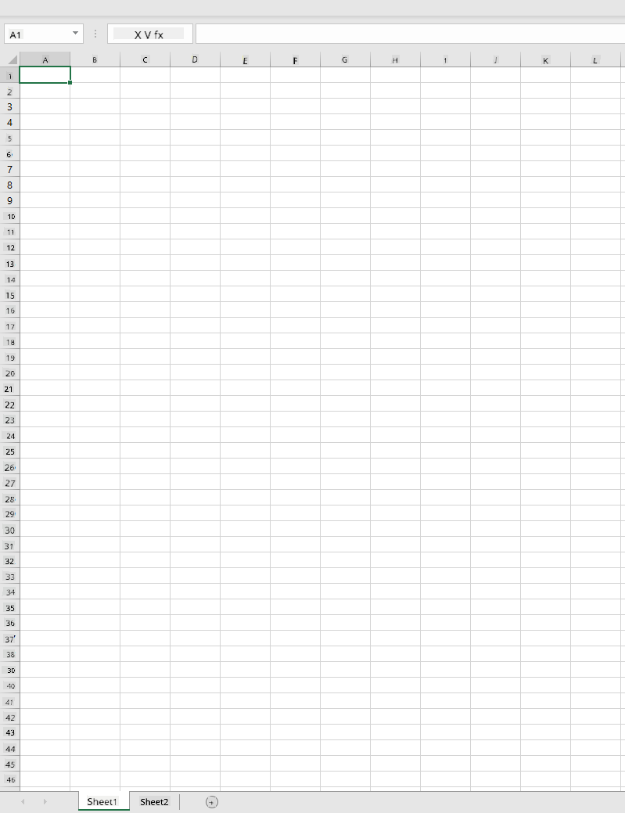
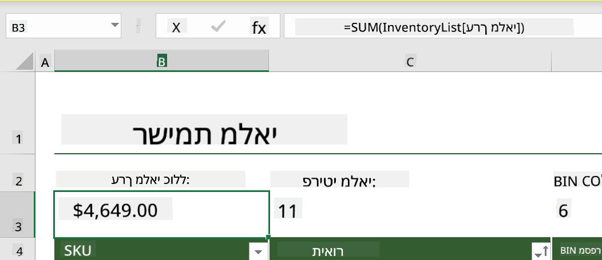
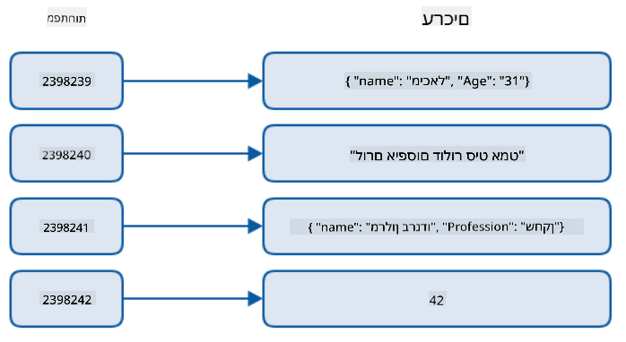
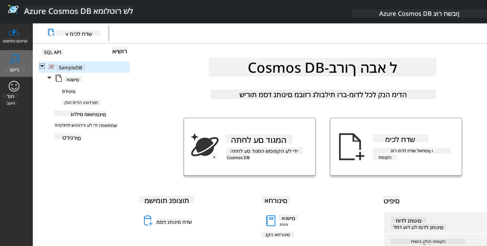
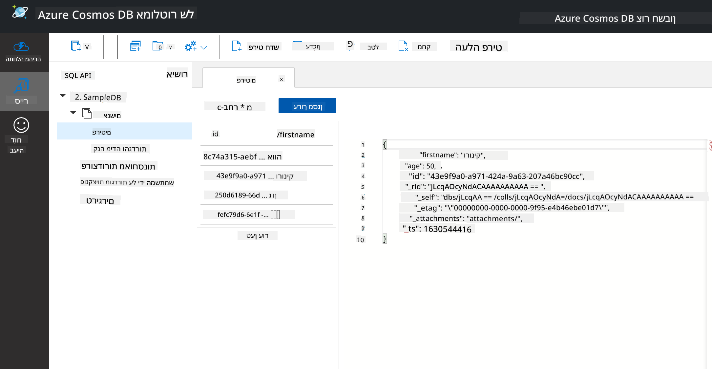
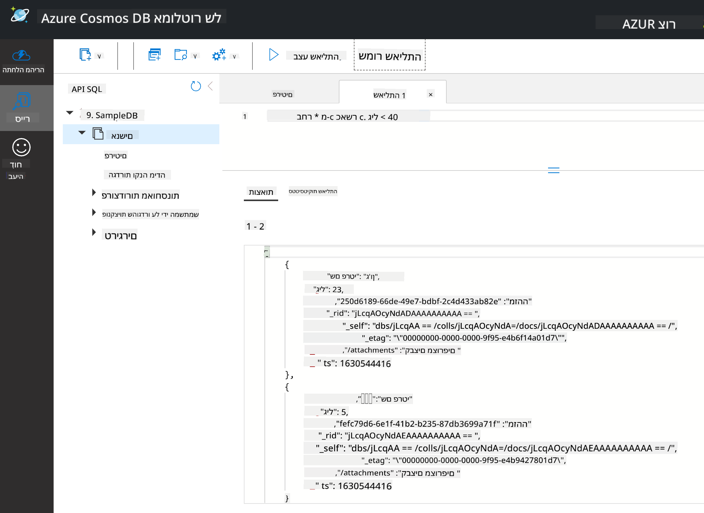

<!--
CO_OP_TRANSLATOR_METADATA:
{
  "original_hash": "54c5a1c74aecb69d2f9099300a4b7eea",
  "translation_date": "2025-09-04T20:02:55+00:00",
  "source_file": "2-Working-With-Data/06-non-relational/README.md",
  "language_code": "he"
}
-->
# עבודה עם נתונים: נתונים לא-רלציוניים

| ](../../sketchnotes/06-NoSQL.png)|
|:---:|
|עבודה עם נתוני NoSQL - _סקיצה מאת [@nitya](https://twitter.com/nitya)_ |

## [שאלון לפני השיעור](https://purple-hill-04aebfb03.1.azurestaticapps.net/quiz/10)

נתונים אינם מוגבלים לבסיסי נתונים רלציוניים. שיעור זה מתמקד בנתונים לא-רלציוניים ויכסה את היסודות של גיליונות אלקטרוניים ו-NoSQL.

## גיליונות אלקטרוניים

גיליונות אלקטרוניים הם דרך פופולרית לאחסן ולחקור נתונים מכיוון שהם דורשים פחות עבודה כדי להגדיר ולהתחיל. בשיעור זה תלמדו את הרכיבים הבסיסיים של גיליון אלקטרוני, כמו גם נוסחאות ופונקציות. הדוגמאות יוסברו באמצעות Microsoft Excel, אך רוב החלקים והנושאים יהיו בעלי שמות ושלבים דומים בהשוואה לתוכנות גיליונות אלקטרוניים אחרות.



גיליון אלקטרוני הוא קובץ ויהיה נגיש במערכת הקבצים של מחשב, מכשיר או מערכת קבצים מבוססת ענן. התוכנה עצמה עשויה להיות מבוססת דפדפן או אפליקציה שצריך להתקין על מחשב או להוריד כאפליקציה. ב-Excel קבצים אלו מוגדרים גם כ-**חוברות עבודה**, וטרמינולוגיה זו תיעשה בה שימוש בשאר השיעור.

חוברת עבודה מכילה אחד או יותר **גיליונות עבודה**, כאשר כל גיליון עבודה מסומן באמצעות לשוניות. בתוך גיליון עבודה ישנם מלבנים הנקראים **תאים**, אשר מכילים את הנתונים בפועל. תא הוא נקודת המפגש בין שורה לעמודה, כאשר העמודות מסומנות באותיות אלפביתיות והשורות מסומנות במספרים. חלק מהגיליונות האלקטרוניים יכילו כותרות בשורות הראשונות כדי לתאר את הנתונים בתא.

עם הרכיבים הבסיסיים הללו של חוברת עבודה ב-Excel, נשתמש בדוגמה מ-[תבניות Microsoft](https://templates.office.com/) המתמקדת במלאי כדי לעבור על חלקים נוספים של גיליון אלקטרוני.

### ניהול מלאי

קובץ הגיליון האלקטרוני בשם "InventoryExample" הוא גיליון אלקטרוני מעוצב של פריטים בתוך מלאי שמכיל שלושה גיליונות עבודה, כאשר הלשוניות מסומנות כ"רשימת מלאי", "רשימת איסוף מלאי" ו"חיפוש מיקום". שורה 4 בגיליון העבודה של רשימת המלאי היא הכותרת, שמתארת את הערך של כל תא בעמודת הכותרת.


ישנם מקרים שבהם תא תלוי בערכים של תאים אחרים כדי ליצור את ערכו. גיליון העבודה של רשימת המלאי עוקב אחר העלות של כל פריט במלאי שלו, אך מה אם נצטרך לדעת את הערך של כל המלאי? [**נוסחאות**](https://support.microsoft.com/en-us/office/overview-of-formulas-34519a4e-1e8d-4f4b-84d4-d642c4f63263) מבצעות פעולות על נתוני תאים ומשמשות לחישוב העלות של המלאי בדוגמה זו. גיליון אלקטרוני זה השתמש בנוסחה בעמודת ערך המלאי כדי לחשב את הערך של כל פריט על ידי הכפלת הכמות תחת כותרת QTY והעלויות תחת כותרת COST. לחיצה כפולה או סימון תא תציג את הנוסחה. תבחינו שנוסחאות מתחילות בסימן שווה, ואחריו החישוב או הפעולה.



ניתן להשתמש בנוסחה נוספת כדי להוסיף את כל הערכים של ערך המלאי יחד כדי לקבל את הערך הכולל. ניתן לחשב זאת על ידי הוספת כל תא כדי ליצור את הסכום, אך זו יכולה להיות משימה מייגעת. ל-Excel יש [**פונקציות**](https://support.microsoft.com/en-us/office/sum-function-043e1c7d-7726-4e80-8f32-07b23e057f89), או נוסחאות מוגדרות מראש לביצוע חישובים על ערכי תאים. פונקציות דורשות ארגומנטים, שהם הערכים הנדרשים לביצוע החישובים. כאשר פונקציות דורשות יותר מארגומנט אחד, יש צורך לרשום אותם בסדר מסוים אחרת הפונקציה עשויה לא לחשב את הערך הנכון. דוגמה זו משתמשת בפונקציה SUM, ומשתמשת בערכים של ערך המלאי כארגומנט כדי להוסיף וליצור את הסכום המופיע תחת שורה 3, עמודה B (המכונה גם B3).

## NoSQL

NoSQL הוא מונח כולל לדרכים השונות לאחסן נתונים לא-רלציוניים וניתן לפרש אותו כ"לא SQL", "לא רלציוני" או "לא רק SQL". מערכות בסיסי נתונים מסוג זה יכולות להיות מסווגות ל-4 סוגים.


> מקור מ-[בלוג Michał Białecki](https://www.michalbialecki.com/2018/03/18/azure-cosmos-db-key-value-database-cloud/)

[מפתח-ערך](https://docs.microsoft.com/en-us/azure/architecture/data-guide/big-data/non-relational-data#keyvalue-data-stores) בסיסי נתונים משייכים מפתחות ייחודיים, שהם מזהה ייחודי המשויך לערך. זוגות אלו נשמרים באמצעות [טבלת האש](https://www.hackerearth.com/practice/data-structures/hash-tables/basics-of-hash-tables/tutorial/) עם פונקציית האש מתאימה.


> מקור מ-[Microsoft](https://docs.microsoft.com/en-us/azure/cosmos-db/graph/graph-introduction#graph-database-by-example)

[גרף](https://docs.microsoft.com/en-us/azure/architecture/data-guide/big-data/non-relational-data#graph-data-stores) בסיסי נתונים מתארים קשרים בנתונים ומיוצגים כאוסף של צמתים וקצוות. צומת מייצג ישות, משהו שקיים בעולם האמיתי כמו סטודנט או דוח בנק. קצוות מייצגים את הקשר בין שתי ישויות. לכל צומת וקצה יש תכונות המספקות מידע נוסף על כל צומת וקצה.


[עמודתי](https://docs.microsoft.com/en-us/azure/architecture/data-guide/big-data/non-relational-data#columnar-data-stores) בסיסי נתונים מארגנים נתונים לעמודות ושורות כמו מבנה נתונים רלציוני, אך כל עמודה מחולקת לקבוצות הנקראות משפחת עמודות, שבה כל הנתונים תחת עמודה אחת קשורים וניתן לאחזר ולשנות אותם כיחידה אחת.

### בסיסי נתונים מסמכים עם Azure Cosmos DB

[מסמך](https://docs.microsoft.com/en-us/azure/architecture/data-guide/big-data/non-relational-data#document-data-stores) בסיסי נתונים מבוססים על הרעיון של בסיס נתונים מפתח-ערך ומורכבים מסדרה של שדות ואובייקטים. חלק זה יחקור בסיסי נתונים מסמכים עם אמולטור Cosmos DB.

בסיס נתונים של Cosmos DB מתאים להגדרה של "לא רק SQL", כאשר בסיס הנתונים המסמכים של Cosmos DB מסתמך על SQL כדי לשאול את הנתונים. [השיעור הקודם](../05-relational-databases/README.md) על SQL מכסה את היסודות של השפה, ונוכל ליישם כמה מהשאילתות הללו גם כאן. נשתמש באמולטור Cosmos DB, שמאפשר לנו ליצור ולחקור בסיס נתונים מסמכים באופן מקומי על מחשב. קראו עוד על האמולטור [כאן](https://docs.microsoft.com/en-us/azure/cosmos-db/local-emulator?tabs=ssl-netstd21).

מסמך הוא אוסף של שדות וערכי אובייקטים, כאשר השדות מתארים מה ערך האובייקט מייצג. להלן דוגמה למסמך.

```json
{
    "firstname": "Eva",
    "age": 44,
    "id": "8c74a315-aebf-4a16-bb38-2430a9896ce5",
    "_rid": "bHwDAPQz8s0BAAAAAAAAAA==",
    "_self": "dbs/bHwDAA==/colls/bHwDAPQz8s0=/docs/bHwDAPQz8s0BAAAAAAAAAA==/",
    "_etag": "\"00000000-0000-0000-9f95-010a691e01d7\"",
    "_attachments": "attachments/",
    "_ts": 1630544034
}
```

השדות המעניינים במסמך זה הם: `firstname`, `id`, ו-`age`. שאר השדות עם הקווים התחתונים נוצרו על ידי Cosmos DB.

#### חקר נתונים עם אמולטור Cosmos DB

ניתן להוריד ולהתקין את האמולטור [ל-Windows כאן](https://aka.ms/cosmosdb-emulator). עיינו ב-[תיעוד זה](https://docs.microsoft.com/en-us/azure/cosmos-db/local-emulator?tabs=ssl-netstd21#run-on-linux-macos) לאפשרויות כיצד להפעיל את האמולטור עבור macOS ו-Linux.

האמולטור פותח חלון דפדפן, שבו תצוגת Explorer מאפשרת לחקור מסמכים.



אם אתם עוקבים, לחצו על "Start with Sample" כדי ליצור בסיס נתונים לדוגמה בשם SampleDB. אם תרחיבו את SampleDB על ידי לחיצה על החץ תמצאו מיכל בשם `Persons`. מיכל מחזיק אוסף של פריטים, שהם המסמכים בתוך המיכל. ניתן לחקור את ארבעת המסמכים האישיים תחת `Items`.



#### שאילתת נתוני מסמכים עם אמולטור Cosmos DB

ניתן גם לשאול את הנתונים לדוגמה על ידי לחיצה על כפתור השאילתה SQL החדשה (הכפתור השני משמאל).

`SELECT * FROM c` מחזיר את כל המסמכים במיכל. נוסיף תנאי where ונמצא את כל מי שגילו פחות מ-40.

`SELECT * FROM c where c.age < 40`



השאילתה מחזירה שני מסמכים, שימו לב שערך הגיל עבור כל מסמך קטן מ-40.

#### JSON ומסמכים

אם אתם מכירים את JavaScript Object Notation (JSON) תבחינו שהמסמכים נראים דומים ל-JSON. ישנו קובץ `PersonsData.json` בתיקייה זו עם נתונים נוספים שניתן להעלות למיכל Persons באמולטור באמצעות כפתור `Upload Item`.

ברוב המקרים, APIs שמחזירים נתוני JSON יכולים להיות מועברים ישירות ולהישמר בבסיסי נתונים מסמכים. להלן מסמך נוסף, הוא מייצג ציוצים מחשבון הטוויטר של Microsoft שנשלפו באמצעות Twitter API, ואז הוכנסו ל-Cosmos DB.

```json
{
    "created_at": "2021-08-31T19:03:01.000Z",
    "id": "1432780985872142341",
    "text": "Blank slate. Like this tweet if you’ve ever painted in Microsoft Paint before. https://t.co/cFeEs8eOPK",
    "_rid": "dhAmAIUsA4oHAAAAAAAAAA==",
    "_self": "dbs/dhAmAA==/colls/dhAmAIUsA4o=/docs/dhAmAIUsA4oHAAAAAAAAAA==/",
    "_etag": "\"00000000-0000-0000-9f84-a0958ad901d7\"",
    "_attachments": "attachments/",
    "_ts": 1630537000
```

השדות המעניינים במסמך זה הם: `created_at`, `id`, ו-`text`.

## 🚀 אתגר

ישנו קובץ `TwitterData.json` שניתן להעלות לבסיס הנתונים SampleDB. מומלץ להוסיף אותו למיכל נפרד. ניתן לעשות זאת על ידי:

1. לחיצה על כפתור מיכל חדש בפינה הימנית העליונה
1. בחירת בסיס הנתונים הקיים (SampleDB) יצירת מזהה מיכל עבור המיכל
1. הגדרת מפתח המחיצה ל-`/id`
1. לחיצה על OK (ניתן להתעלם משאר המידע בתצוגה זו מכיוון שמדובר במערך נתונים קטן הפועל באופן מקומי על המחשב שלכם)
1. פתיחת המיכל החדש שלכם והעלאת קובץ נתוני הטוויטר באמצעות כפתור `Upload Item`

נסו להריץ כמה שאילתות SELECT כדי למצוא את המסמכים שיש בהם את המילה Microsoft בשדה הטקסט. רמז: נסו להשתמש ב-[מילת המפתח LIKE](https://docs.microsoft.com/en-us/azure/cosmos-db/sql/sql-query-keywords#using-like-with-the--wildcard-character)

## [שאלון לאחר השיעור](https://ff-quizzes.netlify.app/en/ds/)

## סקירה ולימוד עצמי

- ישנם כמה עיצובים ותכונות נוספות שנוספו לגיליון האלקטרוני שהשיעור הזה אינו מכסה. ל-Microsoft יש [ספריית תיעוד וסרטונים גדולה](https://support.microsoft.com/excel) על Excel אם אתם מעוניינים ללמוד עוד.

- תיעוד ארכיטקטוני זה מפרט את המאפיינים בסוגים השונים של נתונים לא-רלציוניים: [נתונים לא-רלציוניים ו-NoSQL](https://docs.microsoft.com/en-us/azure/architecture/data-guide/big-data/non-relational-data)

- Cosmos DB הוא בסיס נתונים לא-רלציוני מבוסס ענן שיכול גם לאחסן את סוגי ה-NoSQL השונים שהוזכרו בשיעור זה. למדו עוד על סוגים אלו ב-[מודול הלמידה של Microsoft על Cosmos DB](https://docs.microsoft.com/en-us/learn/paths/work-with-nosql-data-in-azure-cosmos-db/)

## משימה

[רווחי סודה](assignment.md)

---

**כתב ויתור**:  
מסמך זה תורגם באמצעות שירות תרגום מבוסס בינה מלאכותית [Co-op Translator](https://github.com/Azure/co-op-translator). למרות שאנו שואפים לדיוק, יש לקחת בחשבון שתרגומים אוטומטיים עשויים להכיל שגיאות או אי דיוקים. המסמך המקורי בשפתו המקורית צריך להיחשב כמקור סמכותי. עבור מידע קריטי, מומלץ להשתמש בתרגום מקצועי על ידי אדם. איננו נושאים באחריות לאי הבנות או לפרשנויות שגויות הנובעות משימוש בתרגום זה.