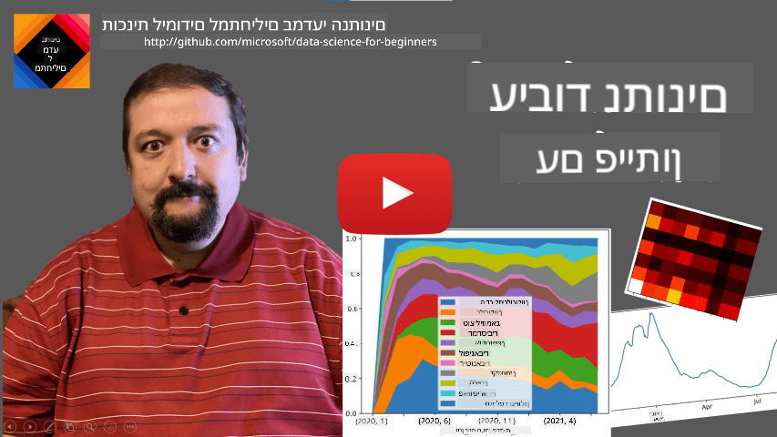
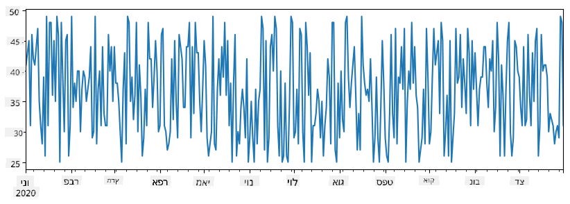
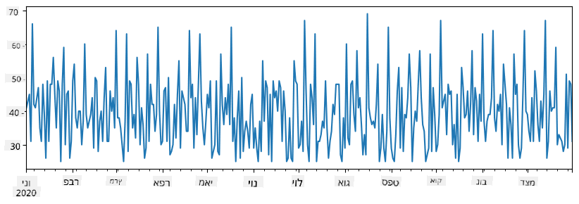
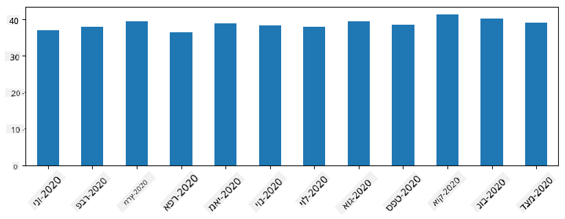
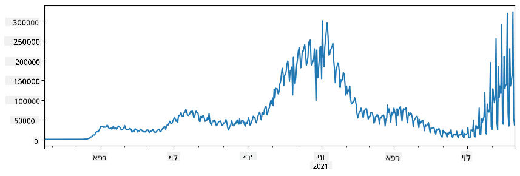
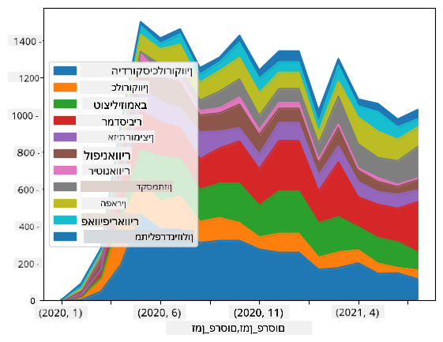

<!--
CO_OP_TRANSLATOR_METADATA:
{
  "original_hash": "7bfec050f4717dcc2dfd028aca9d21f3",
  "translation_date": "2025-09-06T15:50:14+00:00",
  "source_file": "2-Working-With-Data/07-python/README.md",
  "language_code": "he"
}
-->
# עבודה עם נתונים: Python וספריית Pandas

|  ](../../sketchnotes/07-WorkWithPython.png) |
| :-------------------------------------------------------------------------------------------------------: |
|                 עבודה עם Python - _סקיצה מאת [@nitya](https://twitter.com/nitya)_                 |

[](https://youtu.be/dZjWOGbsN4Y)

בעוד שמאגרי נתונים מציעים דרכים יעילות מאוד לאחסן נתונים ולבצע שאילתות באמצעות שפות שאילתה, הדרך הגמישה ביותר לעיבוד נתונים היא כתיבת תוכנית משלך כדי לתפעל נתונים. במקרים רבים, ביצוע שאילתה במאגר נתונים יהיה דרך יעילה יותר. עם זאת, במקרים שבהם נדרש עיבוד נתונים מורכב יותר, לא ניתן לבצע זאת בקלות באמצעות SQL.  
ניתן לתכנת עיבוד נתונים בכל שפת תכנות, אך ישנן שפות מסוימות שהן ברמה גבוהה יותר בכל הנוגע לעבודה עם נתונים. מדעני נתונים בדרך כלל מעדיפים אחת מהשפות הבאות:

* **[Python](https://www.python.org/)**, שפת תכנות כללית, שנחשבת לעיתים קרובות כאחת האפשרויות הטובות ביותר למתחילים בשל הפשטות שלה. ל-Python יש הרבה ספריות נוספות שיכולות לעזור לך לפתור בעיות מעשיות רבות, כמו חילוץ נתונים מארכיון ZIP או המרת תמונה לגווני אפור. בנוסף למדעי הנתונים, Python משמשת גם לעיתים קרובות לפיתוח אתרים.  
* **[R](https://www.r-project.org/)** היא כלי מסורתי שפותח עם עיבוד נתונים סטטיסטיים בראש. היא מכילה גם מאגר גדול של ספריות (CRAN), מה שהופך אותה לבחירה טובה לעיבוד נתונים. עם זאת, R אינה שפת תכנות כללית, והיא משמשת לעיתים רחוקות מחוץ לתחום מדעי הנתונים.  
* **[Julia](https://julialang.org/)** היא שפה נוספת שפותחה במיוחד עבור מדעי הנתונים. היא נועדה לספק ביצועים טובים יותר מ-Python, מה שהופך אותה לכלי מצוין לניסויים מדעיים.

בשיעור זה, נתמקד בשימוש ב-Python לעיבוד נתונים פשוט. נניח היכרות בסיסית עם השפה. אם ברצונך סיור מעמיק יותר ב-Python, תוכל לעיין באחד מהמשאבים הבאים:

* [למד Python בדרך מהנה עם גרפיקה של צב ופרקטלים](https://github.com/shwars/pycourse) - קורס מבוא מהיר ל-Python מבוסס GitHub  
* [עשה את הצעדים הראשונים שלך עם Python](https://docs.microsoft.com/en-us/learn/paths/python-first-steps/?WT.mc_id=academic-77958-bethanycheum) מסלול למידה ב-[Microsoft Learn](http://learn.microsoft.com/?WT.mc_id=academic-77958-bethanycheum)

נתונים יכולים להגיע בצורות רבות. בשיעור זה, נתמקד בשלוש צורות של נתונים - **נתונים טבלאיים**, **טקסט** ו**תמונות**.

נתמקד בכמה דוגמאות לעיבוד נתונים, במקום לתת לך סקירה מלאה של כל הספריות הקשורות. זה יאפשר לך להבין את הרעיון המרכזי של מה אפשרי, ולהשאיר אותך עם הבנה היכן למצוא פתרונות לבעיות שלך כשאתה זקוק להם.

> **העצה הכי שימושית**. כשאתה צריך לבצע פעולה מסוימת על נתונים שאינך יודע כיצד לבצע, נסה לחפש אותה באינטרנט. [Stackoverflow](https://stackoverflow.com/) בדרך כלל מכיל הרבה דוגמאות קוד שימושיות ב-Python עבור משימות טיפוסיות רבות.  

## [שאלון לפני השיעור](https://ff-quizzes.netlify.app/en/ds/quiz/12)

## נתונים טבלאיים ו-Dataframes

כבר פגשת נתונים טבלאיים כשדיברנו על מאגרי נתונים יחסיים. כשיש לך הרבה נתונים, והם נמצאים בטבלאות רבות ומקושרות, בהחלט יש היגיון להשתמש ב-SQL לעבודה איתם. עם זאת, ישנם מקרים רבים שבהם יש לנו טבלה של נתונים, ואנו צריכים לקבל **הבנה** או **תובנות** על הנתונים הללו, כמו התפלגות, קורלציה בין ערכים, וכו'. במדעי הנתונים, ישנם מקרים רבים שבהם אנו צריכים לבצע כמה טרנספורמציות של הנתונים המקוריים, ולאחר מכן ויזואליזציה. שני השלבים הללו יכולים להתבצע בקלות באמצעות Python.

ישנן שתי ספריות שימושיות ביותר ב-Python שיכולות לעזור לך להתמודד עם נתונים טבלאיים:
* **[Pandas](https://pandas.pydata.org/)** מאפשרת לך לתפעל **Dataframes**, שהם אנלוגיים לטבלאות יחסיות. ניתן להגדיר עמודות עם שמות, ולבצע פעולות שונות על שורות, עמודות ו-Dataframes באופן כללי.  
* **[Numpy](https://numpy.org/)** היא ספרייה לעבודה עם **tensors**, כלומר **מערכים** רב-ממדיים. מערך מכיל ערכים מסוג בסיסי זהה, והוא פשוט יותר מ-Dataframe, אך מציע יותר פעולות מתמטיות ויוצר פחות עומס.

ישנן גם כמה ספריות נוספות שכדאי להכיר:
* **[Matplotlib](https://matplotlib.org/)** היא ספרייה המשמשת לויזואליזציה של נתונים ושרטוט גרפים  
* **[SciPy](https://www.scipy.org/)** היא ספרייה עם כמה פונקציות מדעיות נוספות. כבר נתקלנו בספרייה זו כשדיברנו על הסתברות וסטטיסטיקה  

הנה קטע קוד שתשתמש בו בדרך כלל כדי לייבא את הספריות הללו בתחילת תוכנית Python שלך:
```python
import numpy as np
import pandas as pd
import matplotlib.pyplot as plt
from scipy import ... # you need to specify exact sub-packages that you need
``` 

Pandas מתמקדת בכמה מושגים בסיסיים.

### Series 

**Series** היא רצף של ערכים, בדומה לרשימה או מערך numpy. ההבדל העיקרי הוא ש-Series מכילה גם **אינדקס**, וכשאנחנו מבצעים פעולות על Series (למשל, מוסיפים אותם), האינדקס נלקח בחשבון. האינדקס יכול להיות פשוט כמו מספר שורה שלם (זהו האינדקס המשמש כברירת מחדל בעת יצירת Series מרשימה או מערך), או שהוא יכול להיות בעל מבנה מורכב, כמו מרווחי תאריכים.

> **הערה**: יש קוד מבוא ל-Pandas במחברת המצורפת [`notebook.ipynb`](notebook.ipynb). אנו מציינים כאן רק כמה דוגמאות, ואתם בהחלט מוזמנים לבדוק את המחברת המלאה.

לדוגמה: אנו רוצים לנתח מכירות של חנות הגלידה שלנו. בואו ניצור סדרת מספרי מכירות (מספר הפריטים שנמכרו בכל יום) עבור תקופת זמן מסוימת:

```python
start_date = "Jan 1, 2020"
end_date = "Mar 31, 2020"
idx = pd.date_range(start_date,end_date)
print(f"Length of index is {len(idx)}")
items_sold = pd.Series(np.random.randint(25,50,size=len(idx)),index=idx)
items_sold.plot()
```


עכשיו נניח שבכל שבוע אנו מארגנים מסיבה לחברים, ולוקחים 10 חבילות נוספות של גלידה למסיבה. נוכל ליצור סדרה נוספת, עם אינדקס לפי שבוע, כדי להדגים זאת:
```python
additional_items = pd.Series(10,index=pd.date_range(start_date,end_date,freq="W"))
```
כשאנו מוסיפים שתי סדרות יחד, אנו מקבלים את המספר הכולל:
```python
total_items = items_sold.add(additional_items,fill_value=0)
total_items.plot()
```


> **הערה** שאנו לא משתמשים בתחביר הפשוט `total_items+additional_items`. אם היינו עושים זאת, היינו מקבלים הרבה ערכי `NaN` (*Not a Number*) בסדרה המתקבלת. זאת מכיוון שיש ערכים חסרים עבור חלק מנקודות האינדקס בסדרת `additional_items`, והוספת `NaN` לכל דבר תוצאה ב-`NaN`. לכן עלינו לציין את הפרמטר `fill_value` במהלך ההוספה.

עם סדרות זמן, אנו יכולים גם **לדגום מחדש** את הסדרה עם מרווחי זמן שונים. לדוגמה, נניח שאנו רוצים לחשב את ממוצע נפח המכירות חודשי. נוכל להשתמש בקוד הבא:
```python
monthly = total_items.resample("1M").mean()
ax = monthly.plot(kind='bar')
```


### DataFrame

DataFrame הוא למעשה אוסף של סדרות עם אותו אינדקס. אנו יכולים לשלב כמה סדרות יחד ליצירת DataFrame:
```python
a = pd.Series(range(1,10))
b = pd.Series(["I","like","to","play","games","and","will","not","change"],index=range(0,9))
df = pd.DataFrame([a,b])
```
זה ייצור טבלה אופקית כמו זו:
|     | 0   | 1    | 2   | 3   | 4      | 5   | 6      | 7    | 8    |
| --- | --- | ---- | --- | --- | ------ | --- | ------ | ---- | ---- |
| 0   | 1   | 2    | 3   | 4   | 5      | 6   | 7      | 8    | 9    |
| 1   | I   | like | to  | use | Python | and | Pandas | very | much |

אנו יכולים גם להשתמש בסדרות כעמודות, ולציין שמות עמודות באמצעות מילון:
```python
df = pd.DataFrame({ 'A' : a, 'B' : b })
```
זה ייתן לנו טבלה כמו זו:

|     | A   | B      |
| --- | --- | ------ |
| 0   | 1   | I      |
| 1   | 2   | like   |
| 2   | 3   | to     |
| 3   | 4   | use    |
| 4   | 5   | Python |
| 5   | 6   | and    |
| 6   | 7   | Pandas |
| 7   | 8   | very   |
| 8   | 9   | much   |

**הערה** שאנו יכולים גם לקבל את פריסת הטבלה הזו על ידי טרנספוזיציה של הטבלה הקודמת, למשל על ידי כתיבה 
```python
df = pd.DataFrame([a,b]).T..rename(columns={ 0 : 'A', 1 : 'B' })
```
כאן `.T` מתייחס לפעולת הטרנספוזיציה של ה-DataFrame, כלומר שינוי שורות ועמודות, ופעולת `rename` מאפשרת לנו לשנות את שמות העמודות כך שיתאימו לדוגמה הקודמת.

הנה כמה מהפעולות החשובות ביותר שניתן לבצע על DataFrames:

**בחירת עמודות**. ניתן לבחור עמודות בודדות על ידי כתיבה `df['A']` - פעולה זו מחזירה סדרה. ניתן גם לבחור תת-קבוצה של עמודות ל-DataFrame אחר על ידי כתיבה `df[['B','A']]` - פעולה זו מחזירה DataFrame נוסף.

**סינון** שורות מסוימות לפי קריטריונים. לדוגמה, כדי להשאיר רק שורות עם עמודה `A` גדולה מ-5, ניתן לכתוב `df[df['A']>5]`.

> **הערה**: הדרך שבה סינון עובד היא כדלקמן. הביטוי `df['A']<5` מחזיר סדרה בוליאנית, שמציינת האם הביטוי הוא `True` או `False` עבור כל אלמנט בסדרה המקורית `df['A']`. כאשר סדרה בוליאנית משמשת כאינדקס, היא מחזירה תת-קבוצה של שורות ב-DataFrame. לכן, לא ניתן להשתמש בביטוי בוליאני שרירותי של Python, לדוגמה, כתיבה `df[df['A']>5 and df['A']<7]` תהיה שגויה. במקום זאת, יש להשתמש בפעולת `&` מיוחדת על סדרות בוליאניות, ולכתוב `df[(df['A']>5) & (df['A']<7)]` (*סוגריים חשובים כאן*).

**יצירת עמודות חדשות לחישוב**. ניתן ליצור בקלות עמודות חדשות לחישוב עבור ה-DataFrame שלנו באמצעות ביטוי אינטואיטיבי כמו זה:
```python
df['DivA'] = df['A']-df['A'].mean() 
``` 
דוגמה זו מחשבת את הסטייה של A מערך הממוצע שלה. מה שקורה בפועל כאן הוא שאנו מחשבים סדרה, ואז מקצים את הסדרה הזו לצד השמאלי, ויוצרים עמודה נוספת. לכן, לא ניתן להשתמש בפעולות שאינן תואמות לסדרות, לדוגמה, הקוד הבא שגוי:
```python
# Wrong code -> df['ADescr'] = "Low" if df['A'] < 5 else "Hi"
df['LenB'] = len(df['B']) # <- Wrong result
``` 
הדוגמה האחרונה, למרות שהיא נכונה מבחינה תחבירית, נותנת לנו תוצאה שגויה, מכיוון שהיא מקצה את אורך הסדרה `B` לכל הערכים בעמודה, ולא את אורך האלמנטים הבודדים כפי שהתכוונו.

אם אנו צריכים לחשב ביטויים מורכבים כאלה, ניתן להשתמש בפונקציית `apply`. הדוגמה האחרונה יכולה להיכתב כך:
```python
df['LenB'] = df['B'].apply(lambda x : len(x))
# or 
df['LenB'] = df['B'].apply(len)
```

לאחר הפעולות לעיל, נקבל את ה-DataFrame הבא:

|     | A   | B      | DivA | LenB |
| --- | --- | ------ | ---- | ---- |
| 0   | 1   | I      | -4.0 | 1    |
| 1   | 2   | like   | -3.0 | 4    |
| 2   | 3   | to     | -2.0 | 2    |
| 3   | 4   | use    | -1.0 | 3    |
| 4   | 5   | Python | 0.0  | 6    |
| 5   | 6   | and    | 1.0  | 3    |
| 6   | 7   | Pandas | 2.0  | 6    |
| 7   | 8   | very   | 3.0  | 4    |
| 8   | 9   | much   | 4.0  | 4    |

**בחירת שורות לפי מספרים** ניתן לבצע באמצעות מבנה `iloc`. לדוגמה, כדי לבחור את 5 השורות הראשונות מה-DataFrame:
```python
df.iloc[:5]
```

**קיבוץ** משמש לעיתים קרובות לקבלת תוצאה דומה ל-*טבלאות ציר* ב-Excel. נניח שאנו רוצים לחשב את ערך הממוצע של עמודה `A` עבור כל מספר נתון של `LenB`. אז נוכל לקבץ את ה-DataFrame שלנו לפי `LenB`, ולקרוא ל-`mean`:
```python
df.groupby(by='LenB')[['A','DivA']].mean()
```
אם אנו צריכים לחשב ממוצע ומספר האלמנטים בקבוצה, אז נוכל להשתמש בפונקציית `aggregate` מורכבת יותר:
```python
df.groupby(by='LenB') \
 .aggregate({ 'DivA' : len, 'A' : lambda x: x.mean() }) \
 .rename(columns={ 'DivA' : 'Count', 'A' : 'Mean'})
```
זה נותן לנו את הטבלה הבאה:

| LenB | Count | Mean     |
| ---- | ----- | -------- |
| 1    | 1     | 1.000000 |
| 2    | 1     | 3.000000 |
| 3    | 2     | 5.000000 |
| 4    | 3     | 6.333333 |
| 6    | 2     | 6.000000 |

### קבלת נתונים
ראינו כמה קל ליצור Series ו-DataFrames מאובייקטים של Python. עם זאת, נתונים בדרך כלל מגיעים בצורה של קובץ טקסט או טבלת Excel. למרבה המזל, Pandas מציעה דרך פשוטה לטעון נתונים מהדיסק. לדוגמה, קריאת קובץ CSV היא פשוטה כמו זו:
```python
df = pd.read_csv('file.csv')
```
נראה דוגמאות נוספות לטעינת נתונים, כולל הבאתם מאתרים חיצוניים, בחלק "אתגר".

### הדפסה וגרפיקה

מדען נתונים לעיתים קרובות צריך לחקור את הנתונים, ולכן חשוב להיות מסוגל להציג אותם בצורה חזותית. כאשר DataFrame גדול, פעמים רבות אנו רוצים רק לוודא שאנחנו עושים הכל נכון על ידי הדפסת השורות הראשונות. ניתן לעשות זאת על ידי קריאה ל-`df.head()`. אם אתם מריצים זאת מתוך Jupyter Notebook, זה ידפיס את ה-DataFrame בצורה טבלאית יפה.

כמו כן, ראינו את השימוש בפונקציה `plot` כדי להציג גרפית עמודות מסוימות. בעוד ש-`plot` מאוד שימושית למשימות רבות ותומכת בסוגי גרפים שונים באמצעות הפרמטר `kind=`, תמיד ניתן להשתמש בספריית `matplotlib` הגולמית כדי ליצור גרפים מורכבים יותר. נעסוק בהדמיית נתונים בפירוט בשיעורים נפרדים בקורס.

סקירה זו מכסה את הרעיונות החשובים ביותר של Pandas, אך הספרייה עשירה מאוד ואין גבול למה שניתן לעשות איתה! עכשיו ניישם את הידע הזה לפתרון בעיה ספציפית.

## 🚀 אתגר 1: ניתוח התפשטות COVID

הבעיה הראשונה שבה נתמקד היא מודלינג של התפשטות מגפת COVID-19. כדי לעשות זאת, נשתמש בנתונים על מספר הנדבקים במדינות שונות, המסופקים על ידי [Center for Systems Science and Engineering](https://systems.jhu.edu/) (CSSE) ב-[אוניברסיטת ג'ונס הופקינס](https://jhu.edu/). מערך הנתונים זמין ב-[מאגר GitHub זה](https://github.com/CSSEGISandData/COVID-19).

מכיוון שאנחנו רוצים להדגים כיצד להתמודד עם נתונים, אנו מזמינים אתכם לפתוח את [`notebook-covidspread.ipynb`](notebook-covidspread.ipynb) ולקרוא אותו מההתחלה ועד הסוף. תוכלו גם להריץ תאים ולעשות כמה אתגרים שהשארנו לכם בסוף.



> אם אינכם יודעים כיצד להריץ קוד ב-Jupyter Notebook, עיינו ב-[מאמר זה](https://soshnikov.com/education/how-to-execute-notebooks-from-github/).

## עבודה עם נתונים לא מובנים

בעוד שנתונים לעיתים קרובות מגיעים בצורה טבלאית, במקרים מסוימים אנו צריכים להתמודד עם נתונים פחות מובנים, למשל טקסט או תמונות. במקרה כזה, כדי ליישם טכניקות עיבוד נתונים שראינו קודם, עלינו **לחלץ** נתונים מובנים. הנה כמה דוגמאות:

* חילוץ מילות מפתח מטקסט ובדיקת תדירות הופעתן
* שימוש ברשתות נוירונים לחילוץ מידע על אובייקטים בתמונה
* קבלת מידע על רגשות של אנשים מזרם מצלמת וידאו

## 🚀 אתגר 2: ניתוח מאמרים על COVID

באתגר זה, נמשיך עם נושא מגפת COVID, ונעסוק בעיבוד מאמרים מדעיים בנושא. ישנו [מערך נתונים CORD-19](https://www.kaggle.com/allen-institute-for-ai/CORD-19-research-challenge) עם יותר מ-7000 (בזמן כתיבת שורות אלו) מאמרים על COVID, הזמינים עם מטא-נתונים ותקצירים (ולגבי כמחציתם גם טקסט מלא).

דוגמה מלאה לניתוח מערך נתונים זה באמצעות [Text Analytics for Health](https://docs.microsoft.com/azure/cognitive-services/text-analytics/how-tos/text-analytics-for-health/?WT.mc_id=academic-77958-bethanycheum) מתוארת [בפוסט בבלוג זה](https://soshnikov.com/science/analyzing-medical-papers-with-azure-and-text-analytics-for-health/). נדון בגרסה פשוטה יותר של ניתוח זה.

> **NOTE**: איננו מספקים עותק של מערך הנתונים כחלק ממאגר זה. ייתכן שתצטרכו להוריד תחילה את הקובץ [`metadata.csv`](https://www.kaggle.com/allen-institute-for-ai/CORD-19-research-challenge?select=metadata.csv) ממערך נתונים זה ב-Kaggle. ייתכן שתידרש הרשמה ל-Kaggle. תוכלו גם להוריד את מערך הנתונים ללא הרשמה [מכאן](https://ai2-semanticscholar-cord-19.s3-us-west-2.amazonaws.com/historical_releases.html), אך הוא יכלול את כל הטקסטים המלאים בנוסף לקובץ המטא-נתונים.

פתחו את [`notebook-papers.ipynb`](notebook-papers.ipynb) וקראו אותו מההתחלה ועד הסוף. תוכלו גם להריץ תאים ולעשות כמה אתגרים שהשארנו לכם בסוף.



## עיבוד נתוני תמונה

לאחרונה פותחו מודלים AI חזקים מאוד שמאפשרים לנו להבין תמונות. ישנם משימות רבות שניתן לפתור באמצעות רשתות נוירונים מוכנות מראש או שירותי ענן. כמה דוגמאות כוללות:

* **סיווג תמונות**, שיכול לעזור לכם לקטלג את התמונה לאחת מהקטגוריות המוגדרות מראש. ניתן בקלות לאמן מסווגי תמונות משלכם באמצעות שירותים כמו [Custom Vision](https://azure.microsoft.com/services/cognitive-services/custom-vision-service/?WT.mc_id=academic-77958-bethanycheum)
* **זיהוי אובייקטים** כדי לזהות אובייקטים שונים בתמונה. שירותים כמו [computer vision](https://azure.microsoft.com/services/cognitive-services/computer-vision/?WT.mc_id=academic-77958-bethanycheum) יכולים לזהות מספר אובייקטים נפוצים, וניתן לאמן מודל [Custom Vision](https://azure.microsoft.com/services/cognitive-services/custom-vision-service/?WT.mc_id=academic-77958-bethanycheum) לזהות אובייקטים ספציפיים שמעניינים אתכם.
* **זיהוי פנים**, כולל גיל, מגדר וזיהוי רגשות. ניתן לעשות זאת באמצעות [Face API](https://azure.microsoft.com/services/cognitive-services/face/?WT.mc_id=academic-77958-bethanycheum).

כל שירותי הענן הללו יכולים להיקרא באמצעות [Python SDKs](https://docs.microsoft.com/samples/azure-samples/cognitive-services-python-sdk-samples/cognitive-services-python-sdk-samples/?WT.mc_id=academic-77958-bethanycheum), ולכן ניתן לשלבם בקלות בתהליך חקר הנתונים שלכם.

הנה כמה דוגמאות לחקר נתונים ממקורות תמונה:
* בפוסט בבלוג [איך ללמוד מדעי נתונים ללא קוד](https://soshnikov.com/azure/how-to-learn-data-science-without-coding/) אנו חוקרים תמונות מאינסטגרם, בניסיון להבין מה גורם לאנשים לתת יותר לייקים לתמונה. תחילה אנו מחלצים כמה שיותר מידע מתמונות באמצעות [computer vision](https://azure.microsoft.com/services/cognitive-services/computer-vision/?WT.mc_id=academic-77958-bethanycheum), ואז משתמשים ב-[Azure Machine Learning AutoML](https://docs.microsoft.com/azure/machine-learning/concept-automated-ml/?WT.mc_id=academic-77958-bethanycheum) כדי לבנות מודל שניתן לפרש.
* ב-[סדנת מחקרי פנים](https://github.com/CloudAdvocacy/FaceStudies) אנו משתמשים ב-[Face API](https://azure.microsoft.com/services/cognitive-services/face/?WT.mc_id=academic-77958-bethanycheum) כדי לחלץ רגשות של אנשים בתמונות מאירועים, בניסיון להבין מה גורם לאנשים להיות שמחים.

## סיכום

בין אם כבר יש לכם נתונים מובנים או לא מובנים, באמצעות Python תוכלו לבצע את כל השלבים הקשורים לעיבוד והבנת נתונים. זו כנראה הדרך הגמישה ביותר לעיבוד נתונים, וזו הסיבה שרוב מדעני הנתונים משתמשים ב-Python ככלי העיקרי שלהם. ללמוד Python לעומק זו כנראה החלטה טובה אם אתם רציניים לגבי המסע שלכם במדעי הנתונים!

## [שאלון לאחר השיעור](https://ff-quizzes.netlify.app/en/ds/quiz/13)

## סקירה ולימוד עצמי

**ספרים**
* [Wes McKinney. Python for Data Analysis: Data Wrangling with Pandas, NumPy, and IPython](https://www.amazon.com/gp/product/1491957662)

**משאבים מקוונים**
* מדריך רשמי [10 דקות ל-Pandas](https://pandas.pydata.org/pandas-docs/stable/user_guide/10min.html)
* [תיעוד על הדמיית נתונים ב-Pandas](https://pandas.pydata.org/pandas-docs/stable/user_guide/visualization.html)

**לימוד Python**
* [למדו Python בצורה מהנה עם גרפיקת צב ופרקטלים](https://github.com/shwars/pycourse)
* [עשו את הצעדים הראשונים שלכם עם Python](https://docs.microsoft.com/learn/paths/python-first-steps/?WT.mc_id=academic-77958-bethanycheum) מסלול לימוד ב-[Microsoft Learn](http://learn.microsoft.com/?WT.mc_id=academic-77958-bethanycheum)

## משימה

[בצעו מחקר נתונים מפורט יותר עבור האתגרים לעיל](assignment.md)

## קרדיטים

שיעור זה נכתב באהבה על ידי [Dmitry Soshnikov](http://soshnikov.com)

---

**כתב ויתור**:  
מסמך זה תורגם באמצעות שירות תרגום מבוסס בינה מלאכותית [Co-op Translator](https://github.com/Azure/co-op-translator). למרות שאנו שואפים לדיוק, יש לקחת בחשבון שתרגומים אוטומטיים עשויים להכיל שגיאות או אי-דיוקים. המסמך המקורי בשפתו המקורית נחשב למקור הסמכותי. למידע קריטי, מומלץ להשתמש בתרגום מקצועי על ידי בני אדם. איננו נושאים באחריות לכל אי-הבנה או פרשנות שגויה הנובעת משימוש בתרגום זה.  