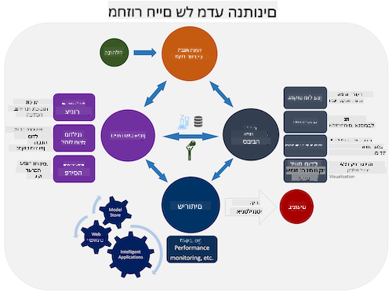

<!--
CO_OP_TRANSLATOR_METADATA:
{
  "original_hash": "07e12a25d20b8f191e3cb651c27fdb2b",
  "translation_date": "2025-09-06T21:16:49+00:00",
  "source_file": "4-Data-Science-Lifecycle/14-Introduction/README.md",
  "language_code": "he"
}
-->
# מבוא למחזור החיים של מדעי הנתונים

| ](../../sketchnotes/14-DataScience-Lifecycle.png)|
|:---:|
| מבוא למחזור החיים של מדעי הנתונים - _סקצ'נוט מאת [@nitya](https://twitter.com/nitya)_ |

## [שאלון לפני השיעור](https://ff-quizzes.netlify.app/en/ds/quiz/26)

בשלב זה, כנראה כבר הבנתם שמדעי הנתונים הם תהליך. תהליך זה ניתן לפירוק ל-5 שלבים:

- איסוף
- עיבוד
- ניתוח
- תקשורת
- תחזוקה

השיעור הזה מתמקד ב-3 חלקים מתוך מחזור החיים: איסוף, עיבוד ותחזוקה.

  
> תמונה מאת [Berkeley School of Information](https://ischoolonline.berkeley.edu/data-science/what-is-data-science/)

## איסוף

השלב הראשון במחזור החיים הוא קריטי, שכן השלבים הבאים תלויים בו. למעשה, מדובר בשני שלבים שמאוחדים לאחד: רכישת הנתונים והגדרת המטרה והבעיות שיש לטפל בהן.  
הגדרת מטרות הפרויקט תדרוש הבנה מעמיקה של הבעיה או השאלה. ראשית, יש לזהות ולרכוש את מי שזקוקים לפתרון הבעיה שלהם. אלו יכולים להיות בעלי עניין בעסק או נותני חסות לפרויקט, שיכולים לעזור לזהות מי או מה ייהנה מהפרויקט, כמו גם מה הם צריכים ולמה. מטרה מוגדרת היטב צריכה להיות מדידה וכמותית כדי להגדיר תוצאה מקובלת.

שאלות שמדען נתונים עשוי לשאול:
- האם הבעיה הזו נבחנה בעבר? מה התגלה?
- האם המטרה והיעד מובנים על ידי כל המעורבים?
- האם יש עמימות וכיצד ניתן לצמצם אותה?
- מהם המגבלות?
- איך תיראה התוצאה הסופית?
- כמה משאבים (זמן, אנשים, חישוביים) זמינים?

השלב הבא הוא זיהוי, איסוף ולבסוף חקר הנתונים הדרושים להשגת המטרות שהוגדרו. בשלב זה של רכישת הנתונים, מדעני נתונים חייבים גם להעריך את הכמות והאיכות של הנתונים. זה דורש חקר נתונים כדי לוודא שהנתונים שנאספו יתמכו בהשגת התוצאה הרצויה.

שאלות שמדען נתונים עשוי לשאול על הנתונים:
- אילו נתונים כבר זמינים לי?
- מי הבעלים של הנתונים הללו?
- מהם החששות לגבי פרטיות?
- האם יש לי מספיק נתונים כדי לפתור את הבעיה?
- האם הנתונים באיכות מספקת עבור הבעיה הזו?
- אם אני מגלה מידע נוסף דרך הנתונים הללו, האם כדאי לשקול לשנות או להגדיר מחדש את המטרות?

## עיבוד

שלב העיבוד במחזור החיים מתמקד בגילוי דפוסים בנתונים ובבניית מודלים. חלק מהטכניקות בשלב העיבוד דורשות שיטות סטטיסטיות כדי לחשוף את הדפוסים. בדרך כלל, זו תהיה משימה מייגעת עבור אדם להתמודד עם מערך נתונים גדול, ולכן מסתמכים על מחשבים כדי להאיץ את התהליך. שלב זה הוא גם המקום שבו מדעי הנתונים ולמידת מכונה מצטלבים. כפי שלמדתם בשיעור הראשון, למידת מכונה היא תהליך של בניית מודלים להבנת הנתונים. מודלים הם ייצוג של הקשר בין משתנים בנתונים שמסייעים לחזות תוצאות.

טכניקות נפוצות בשלב זה מכוסות בתוכנית הלימודים של ML למתחילים. עקבו אחר הקישורים כדי ללמוד עליהן:

- [סיווג](https://github.com/microsoft/ML-For-Beginners/tree/main/4-Classification): ארגון נתונים לקטגוריות לשימוש יעיל יותר.
- [אשכולות](https://github.com/microsoft/ML-For-Beginners/tree/main/5-Clustering): קיבוץ נתונים לקבוצות דומות.
- [רגרסיה](https://github.com/microsoft/ML-For-Beginners/tree/main/2-Regression): קביעת הקשרים בין משתנים כדי לחזות או לצפות ערכים.

## תחזוקה

בתרשים מחזור החיים, אולי שמתם לב שתחזוקה נמצאת בין איסוף לעיבוד. תחזוקה היא תהליך מתמשך של ניהול, אחסון ואבטחת הנתונים לאורך כל תהליך הפרויקט, ויש לקחת אותה בחשבון לאורך כל הפרויקט.

### אחסון נתונים
שיקולים לגבי איך והיכן הנתונים מאוחסנים יכולים להשפיע על עלות האחסון כמו גם על ביצועי הגישה לנתונים. החלטות כאלה לא סביר שיתקבלו על ידי מדען נתונים בלבד, אך ייתכן שהוא יצטרך לבחור כיצד לעבוד עם הנתונים בהתבסס על אופן האחסון שלהם.

הנה כמה היבטים של מערכות אחסון נתונים מודרניות שיכולים להשפיע על הבחירות הללו:

**במקום (On premise) מול מחוץ למקום (Off premise) מול ענן ציבורי או פרטי**

"במקום" מתייחס לאחסון וניהול הנתונים על ציוד בבעלותכם, כמו שרת עם כוננים קשיחים שמאחסנים את הנתונים, בעוד "מחוץ למקום" מסתמך על ציוד שאינו בבעלותכם, כמו מרכז נתונים. הענן הציבורי הוא בחירה פופולרית לאחסון נתונים שאינה דורשת ידע על איך או איפה בדיוק הנתונים מאוחסנים, כאשר "ציבורי" מתייחס לתשתית אחידה שמשותפת לכל מי שמשתמש בענן. חלק מהארגונים מחזיקים במדיניות אבטחה מחמירה שדורשת גישה מלאה לציוד שבו הנתונים מאוחסנים, ולכן הם מסתמכים על ענן פרטי שמספק שירותי ענן משלו. תלמדו יותר על נתונים בענן בשיעורים [מאוחרים יותר](https://github.com/microsoft/Data-Science-For-Beginners/tree/main/5-Data-Science-In-Cloud).

**נתונים "קרים" מול נתונים "חמים"**

בעת אימון המודלים שלכם, ייתכן שתזדקקו ליותר נתוני אימון. אם אתם מרוצים מהמודל שלכם, נתונים נוספים יגיעו כדי שהמודל יוכל לשרת את מטרתו. בכל מקרה, עלות אחסון וגישה לנתונים תגדל ככל שתצברו יותר מהם. הפרדת נתונים שנעשה בהם שימוש לעיתים רחוקות, המכונים נתונים "קרים", מנתונים שנעשה בהם שימוש תכוף, המכונים נתונים "חמים", יכולה להיות אפשרות אחסון נתונים זולה יותר באמצעות שירותי חומרה או תוכנה. אם יש צורך לגשת לנתונים "קרים", ייתכן שייקח מעט יותר זמן לשלוף אותם בהשוואה לנתונים "חמים".

### ניהול נתונים
במהלך העבודה עם נתונים, ייתכן שתגלו שחלק מהנתונים צריכים לעבור ניקוי באמצעות חלק מהטכניקות שנלמדו בשיעור על [הכנת נתונים](https://github.com/microsoft/Data-Science-For-Beginners/tree/main/2-Working-With-Data/08-data-preparation) כדי לבנות מודלים מדויקים. כאשר נתונים חדשים מגיעים, ייתכן שיהיה צורך ליישם את אותן טכניקות כדי לשמור על עקביות באיכות. חלק מהפרויקטים יכללו שימוש בכלי אוטומטי לניקוי, צבירה ודחיסה לפני שהנתונים מועברים למיקומם הסופי. Azure Data Factory הוא דוגמה לאחד מהכלים הללו.

### אבטחת נתונים
אחד היעדים המרכזיים באבטחת נתונים הוא להבטיח שמי שעובד עם הנתונים שולט במה שנאסף ובאיזה הקשר נעשה בו שימוש. שמירה על אבטחת נתונים כוללת הגבלת גישה רק למי שזקוק לה, עמידה בחוקים ובתקנות המקומיים, כמו גם שמירה על סטנדרטים אתיים, כפי שנלמד בשיעור על [אתיקה](https://github.com/microsoft/Data-Science-For-Beginners/tree/main/1-Introduction/02-ethics).

הנה כמה דברים שצוות עשוי לעשות מתוך מחשבה על אבטחה:
- לוודא שכל הנתונים מוצפנים
- לספק ללקוחות מידע על איך הנתונים שלהם משמשים
- להסיר גישה לנתונים ממי שעזב את הפרויקט
- לאפשר רק לחברי פרויקט מסוימים לשנות את הנתונים

## 🚀 אתגר

ישנם גרסאות רבות למחזור החיים של מדעי הנתונים, כאשר כל שלב עשוי להיקרא בשם שונה או לכלול מספר שונה של שלבים, אך יכיל את אותם תהליכים שהוזכרו בשיעור זה.

חקור את [מחזור החיים של תהליך מדעי הנתונים של הצוות](https://docs.microsoft.com/en-us/azure/architecture/data-science-process/lifecycle) ואת [תהליך התקן התעשייתי לכריית נתונים](https://www.datascience-pm.com/crisp-dm-2/). ציין 3 דמיון ו-3 הבדלים בין השניים.

|תהליך מדעי הנתונים של הצוות (TDSP)|תהליך התקן התעשייתי לכריית נתונים (CRISP-DM)|
|--|--|
| |  |
| תמונה מאת [Microsoft](https://docs.microsoft.comazure/architecture/data-science-process/lifecycle) | תמונה מאת [Data Science Process Alliance](https://www.datascience-pm.com/crisp-dm-2/) |

## [שאלון לאחר השיעור](https://ff-quizzes.netlify.app/en/ds/quiz/27)

## סקירה ולימוד עצמי

יישום מחזור החיים של מדעי הנתונים כולל תפקידים ומשימות מרובים, כאשר חלקם עשויים להתמקד בחלקים מסוימים בכל שלב. תהליך מדעי הנתונים של הצוות מספק כמה משאבים שמסבירים את סוגי התפקידים והמשימות שמישהו עשוי לבצע בפרויקט.

* [תפקידים ומשימות בתהליך מדעי הנתונים של הצוות](https://docs.microsoft.com/en-us/azure/architecture/data-science-process/roles-tasks)  
* [ביצוע משימות מדעי נתונים: חקר, בניית מודלים ופריסה](https://docs.microsoft.com/en-us/azure/architecture/data-science-process/execute-data-science-tasks)

## משימה

[הערכת מערך נתונים](assignment.md)  

---

**כתב ויתור**:  
מסמך זה תורגם באמצעות שירות תרגום מבוסס בינה מלאכותית [Co-op Translator](https://github.com/Azure/co-op-translator). למרות שאנו שואפים לדיוק, יש לקחת בחשבון שתרגומים אוטומטיים עשויים להכיל שגיאות או אי-דיוקים. המסמך המקורי בשפתו המקורית נחשב למקור הסמכותי. למידע קריטי, מומלץ להשתמש בתרגום מקצועי על ידי בני אדם. איננו נושאים באחריות לכל אי-הבנה או פרשנות שגויה הנובעת משימוש בתרגום זה.  