<!--
CO_OP_TRANSLATOR_METADATA:
{
  "original_hash": "39f3b3a9d873eaa522c2e792ce0ca503",
  "translation_date": "2025-09-04T20:00:41+00:00",
  "source_file": "5-Data-Science-In-Cloud/18-Low-Code/README.md",
  "language_code": "he"
}
-->
# מדע הנתונים בענן: הדרך של "קוד נמוך/ללא קוד"

| ](../../sketchnotes/18-DataScience-Cloud.png)|
|:---:|
| מדע הנתונים בענן: קוד נמוך - _סקיצה מאת [@nitya](https://twitter.com/nitya)_ |

תוכן עניינים:

- [מדע הנתונים בענן: הדרך של "קוד נמוך/ללא קוד"](../../../../5-Data-Science-In-Cloud/18-Low-Code)
  - [שאלון לפני ההרצאה](../../../../5-Data-Science-In-Cloud/18-Low-Code)
  - [1. מבוא](../../../../5-Data-Science-In-Cloud/18-Low-Code)
    - [1.1 מה זה Azure Machine Learning?](../../../../5-Data-Science-In-Cloud/18-Low-Code)
    - [1.2 פרויקט חיזוי כשל לבבי:](../../../../5-Data-Science-In-Cloud/18-Low-Code)
    - [1.3 מאגר הנתונים של כשל לבבי:](../../../../5-Data-Science-In-Cloud/18-Low-Code)
  - [2. אימון מודל בקוד נמוך/ללא קוד ב-Azure ML Studio](../../../../5-Data-Science-In-Cloud/18-Low-Code)
    - [2.1 יצירת סביבת עבודה ב-Azure ML](../../../../5-Data-Science-In-Cloud/18-Low-Code)
    - [2.2 משאבי מחשוב](../../../../5-Data-Science-In-Cloud/18-Low-Code)
      - [2.2.1 בחירת האפשרויות הנכונות למשאבי המחשוב שלך](../../../../5-Data-Science-In-Cloud/18-Low-Code)
      - [2.2.2 יצירת אשכול מחשוב](../../../../5-Data-Science-In-Cloud/18-Low-Code)
    - [2.3 טעינת מאגר הנתונים](../../../../5-Data-Science-In-Cloud/18-Low-Code)
    - [2.4 אימון בקוד נמוך/ללא קוד עם AutoML](../../../../5-Data-Science-In-Cloud/18-Low-Code)
  - [3. פריסת מודל בקוד נמוך/ללא קוד וצריכת נקודת קצה](../../../../5-Data-Science-In-Cloud/18-Low-Code)
    - [3.1 פריסת מודל](../../../../5-Data-Science-In-Cloud/18-Low-Code)
    - [3.2 צריכת נקודת קצה](../../../../5-Data-Science-In-Cloud/18-Low-Code)
  - [🚀 אתגר](../../../../5-Data-Science-In-Cloud/18-Low-Code)
  - [שאלון לאחר ההרצאה](../../../../5-Data-Science-In-Cloud/18-Low-Code)
  - [סקירה ולימוד עצמי](../../../../5-Data-Science-In-Cloud/18-Low-Code)
  - [משימה](../../../../5-Data-Science-In-Cloud/18-Low-Code)
  
## [שאלון לפני ההרצאה](https://ff-quizzes.netlify.app/en/ds/)

## 1. מבוא
### 1.1 מה זה Azure Machine Learning?

פלטפורמת הענן Azure כוללת יותר מ-200 מוצרים ושירותי ענן שנועדו לעזור לך להביא פתרונות חדשים לחיים. מדעני נתונים משקיעים מאמצים רבים בחקר ועיבוד מקדים של נתונים, ובניסיון של סוגים שונים של אלגוריתמים לאימון מודלים כדי לייצר מודלים מדויקים. משימות אלו גוזלות זמן רב ולעיתים קרובות מנצלות בצורה לא יעילה חומרת מחשוב יקרה.

[Azure ML](https://docs.microsoft.com/azure/machine-learning/overview-what-is-azure-machine-learning?WT.mc_id=academic-77958-bethanycheum&ocid=AID3041109) היא פלטפורמה מבוססת ענן לבנייה ותפעול של פתרונות למידת מכונה ב-Azure. היא כוללת מגוון רחב של תכונות ויכולות שמסייעות למדעני נתונים להכין נתונים, לאמן מודלים, לפרסם שירותי חיזוי ולנטר את השימוש בהם. החשוב מכל, היא עוזרת להם להגדיל את היעילות על ידי אוטומציה של משימות רבות שגוזלות זמן רב באימון מודלים; והיא מאפשרת להם להשתמש במשאבי מחשוב מבוססי ענן שמסוגלים להתמודד עם כמויות גדולות של נתונים תוך חיוב רק בעת השימוש בפועל.

Azure ML מספקת את כל הכלים שמפתחים ומדעני נתונים צריכים עבור תהליכי העבודה שלהם בלמידת מכונה. אלו כוללים:

- **Azure Machine Learning Studio**: פורטל אינטרנטי ב-Azure Machine Learning שמציע אפשרויות בקוד נמוך וללא קוד לאימון מודלים, פריסה, אוטומציה, מעקב וניהול נכסים. הסטודיו משתלב עם Azure Machine Learning SDK לחוויית עבודה חלקה.
- **Jupyter Notebooks**: מאפשרים אב טיפוס מהיר ובדיקת מודלים של למידת מכונה.
- **Azure Machine Learning Designer**: מאפשר גרירה ושחרור של מודולים לבניית ניסויים ולאחר מכן פריסת צינורות עבודה בסביבה של קוד נמוך.
- **ממשק משתמש של למידת מכונה אוטומטית (AutoML)**: מאיץ משימות חוזרות ונשנות בפיתוח מודלים של למידת מכונה, ומאפשר בניית מודלים בקנה מידה גבוה, יעילות ופרודוקטיביות, תוך שמירה על איכות המודל.
- **תיוג נתונים**: כלי למידת מכונה מסייע לתיוג אוטומטי של נתונים.
- **הרחבת למידת מכונה ל-Visual Studio Code**: מספקת סביבת פיתוח מלאה לבנייה וניהול של פרויקטים בלמידת מכונה.
- **CLI ללמידת מכונה**: מספק פקודות לניהול משאבי Azure ML משורת הפקודה.
- **שילוב עם מסגרות קוד פתוח** כמו PyTorch, TensorFlow, Scikit-learn ועוד רבים אחרים לאימון, פריסה וניהול תהליך למידת המכונה מקצה לקצה.
- **MLflow**: ספרייה בקוד פתוח לניהול מחזור החיים של ניסויי למידת מכונה. **MLFlow Tracking** הוא רכיב של MLflow שמאפשר רישום ומעקב אחר מדדי האימון שלך וארטיפקטים של מודלים, ללא תלות בסביבת הניסוי שלך.

### 1.2 פרויקט חיזוי כשל לבבי:

אין ספק שיצירה ובנייה של פרויקטים היא הדרך הטובה ביותר לבחון את הכישורים והידע שלך. בשיעור זה, נחקור שתי דרכים שונות לבניית פרויקט מדע נתונים לחיזוי התקפי כשל לבבי ב-Azure ML Studio, דרך קוד נמוך/ללא קוד ודרך Azure ML SDK כפי שמוצג בתרשים הבא:

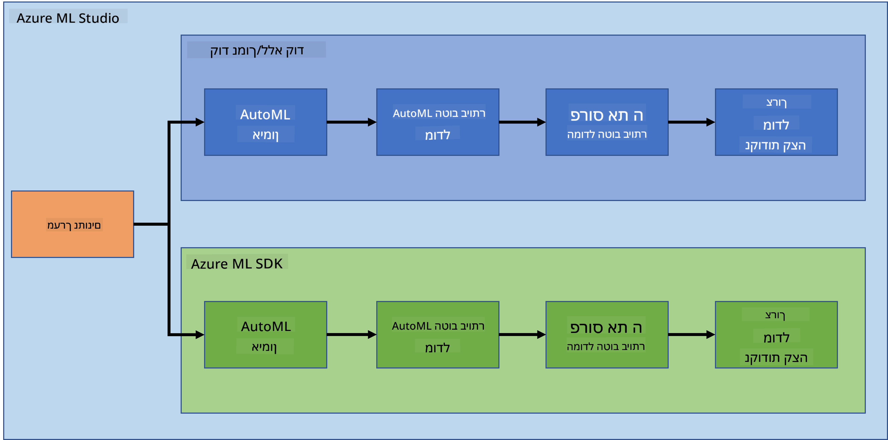

לכל דרך יש יתרונות וחסרונות משלה. הדרך של קוד נמוך/ללא קוד קלה יותר להתחלה מכיוון שהיא כוללת אינטראקציה עם ממשק משתמש גרפי (GUI), ללא צורך בידע קודם בקוד. שיטה זו מאפשרת בדיקה מהירה של היתכנות הפרויקט ויצירת POC (הוכחת היתכנות). עם זאת, ככל שהפרויקט גדל ודברים צריכים להיות מוכנים לייצור, לא ניתן ליצור משאבים דרך GUI. יש צורך באוטומציה תכנותית של הכל, החל מיצירת משאבים ועד לפריסת מודל. כאן נכנס לתמונה הידע בשימוש ב-Azure ML SDK.

|                   | קוד נמוך/ללא קוד | Azure ML SDK              |
|-------------------|------------------|---------------------------|
| מומחיות בקוד      | לא נדרשת         | נדרשת                     |
| זמן פיתוח         | מהיר וקל         | תלוי במומחיות בקוד        |
| מוכן לייצור       | לא               | כן                        |

### 1.3 מאגר הנתונים של כשל לבבי:

מחלות לב וכלי דם (CVDs) הן הגורם מספר 1 למוות ברחבי העולם, ומהוות 31% מכלל מקרי המוות בעולם. גורמי סיכון סביבתיים והתנהגותיים כמו שימוש בטבק, תזונה לא בריאה והשמנת יתר, חוסר פעילות גופנית ושימוש מזיק באלכוהול יכולים לשמש כמאפיינים למודלים הערכה. היכולת להעריך את הסבירות להתפתחות מחלת לב וכלי דם יכולה להיות שימושית מאוד במניעת התקפים אצל אנשים בסיכון גבוה.

Kaggle הפכה את [מאגר הנתונים של כשל לבבי](https://www.kaggle.com/andrewmvd/heart-failure-clinical-data) לזמין לציבור, ואנו נשתמש בו בפרויקט זה. ניתן להוריד את מאגר הנתונים עכשיו. זהו מאגר נתונים טבלאי עם 13 עמודות (12 מאפיינים ועמודת יעד אחת) ו-299 שורות.

|    | שם משתנה                 | סוג            | תיאור                                                   | דוגמה             |
|----|---------------------------|-----------------|---------------------------------------------------------|-------------------|
| 1  | age                       | מספרי          | גיל המטופל                                              | 25                |
| 2  | anaemia                   | בוליאני        | ירידה בתאי דם אדומים או בהמוגלובין                      | 0 או 1            |
| 3  | creatinine_phosphokinase  | מספרי          | רמת אנזים CPK בדם                                       | 542               |
| 4  | diabetes                  | בוליאני        | האם למטופל יש סוכרת                                     | 0 או 1            |
| 5  | ejection_fraction         | מספרי          | אחוז הדם שיוצא מהלב בכל התכווצות                       | 45                |
| 6  | high_blood_pressure       | בוליאני        | האם למטופל יש יתר לחץ דם                                | 0 או 1            |
| 7  | platelets                 | מספרי          | טסיות בדם                                               | 149000            |
| 8  | serum_creatinine          | מספרי          | רמת קריאטינין בסרום בדם                                | 0.5               |
| 9  | serum_sodium              | מספרי          | רמת נתרן בסרום בדם                                      | jun               |
| 10 | sex                       | בוליאני        | אישה או גבר                                             | 0 או 1            |
| 11 | smoking                   | בוליאני        | האם המטופל מעשן                                         | 0 או 1            |
| 12 | time                      | מספרי          | תקופת מעקב (ימים)                                       | 4                 |
|----|---------------------------|-----------------|---------------------------------------------------------|-------------------|
| 21 | DEATH_EVENT [יעד]         | בוליאני        | האם המטופל מת במהלך תקופת המעקב                         | 0 או 1            |

לאחר שיש לך את מאגר הנתונים, נוכל להתחיל את הפרויקט ב-Azure.

## 2. אימון מודל בקוד נמוך/ללא קוד ב-Azure ML Studio
### 2.1 יצירת סביבת עבודה ב-Azure ML
כדי לאמן מודל ב-Azure ML, תחילה עליך ליצור סביבת עבודה ב-Azure ML. סביבת העבודה היא המשאב העליון ב-Azure Machine Learning, המספקת מקום מרכזי לעבוד עם כל הארטיפקטים שאתה יוצר בעת השימוש ב-Azure Machine Learning. סביבת העבודה שומרת היסטוריה של כל ריצות האימון, כולל יומנים, מדדים, פלט ותמונת מצב של הסקריפטים שלך. אתה משתמש במידע זה כדי לקבוע איזו ריצת אימון מייצרת את המודל הטוב ביותר. [למידע נוסף](https://docs.microsoft.com/azure/machine-learning/concept-workspace?WT.mc_id=academic-77958-bethanycheum&ocid=AID3041109)

מומלץ להשתמש בדפדפן העדכני ביותר שתואם למערכת ההפעלה שלך. הדפדפנים הבאים נתמכים:

- Microsoft Edge (הגרסה החדשה של Microsoft Edge, גרסה עדכנית. לא Microsoft Edge legacy)
- Safari (גרסה עדכנית, רק ב-Mac)
- Chrome (גרסה עדכנית)
- Firefox (גרסה עדכנית)

כדי להשתמש ב-Azure Machine Learning, צור סביבת עבודה במנוי Azure שלך. לאחר מכן תוכל להשתמש בסביבת עבודה זו לניהול נתונים, משאבי מחשוב, קוד, מודלים וארטיפקטים אחרים הקשורים לעומסי העבודה שלך בלמידת מכונה.

> **_הערה:_** המנוי שלך ב-Azure יחויב בסכום קטן עבור אחסון נתונים כל עוד סביבת העבודה של Azure Machine Learning קיימת במנוי שלך, ולכן אנו ממליצים למחוק את סביבת העבודה של Azure Machine Learning כאשר אינך משתמש בה יותר.

1. היכנס ל-[פורטל Azure](https://ms.portal.azure.com/) באמצעות האישורים של Microsoft המשויכים למנוי Azure שלך.
2. בחר **＋Create a resource**
   
   

   חפש Machine Learning ובחר את האריח Machine Learning

   

   לחץ על כפתור יצירה

   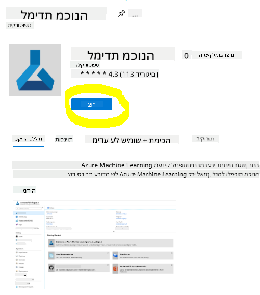

   מלא את ההגדרות כדלקמן:
   - מנוי: מנוי Azure שלך
   - קבוצת משאבים: צור או בחר קבוצת משאבים
   - שם סביבת עבודה: הזן שם ייחודי לסביבת העבודה שלך
   - אזור: בחר את האזור הגיאוגרפי הקרוב אליך ביותר
   - חשבון אחסון: שים לב לחשבון האחסון החדש שייווצר עבור סביבת העבודה שלך
   - Key vault: שים לב ל-Key vault החדש שייווצר עבור סביבת העבודה שלך
   - Application insights: שים לב למשאב Application insights החדש שייווצר עבור סביבת העבודה שלך
   - Container registry: אין (אחד ייווצר אוטומטית בפעם הראשונה שתפרוס מודל למיכל)

    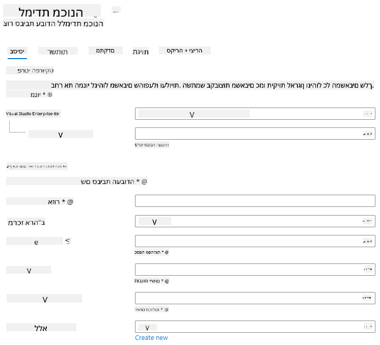

   - לחץ על create + review ולאחר מכן על כפתור create
3. המתן ליצירת סביבת העבודה שלך (זה יכול לקחת כמה דקות). לאחר מכן עבור אליה בפורטל. תוכל למצוא אותה דרך שירות Azure Machine Learning.
4. בעמוד סקירה כללית של סביבת העבודה שלך, הפעל את Azure Machine Learning studio (או פתח לשונית דפדפן חדשה ונווט ל-https://ml.azure.com), והיכנס ל-Azure Machine Learning studio באמצעות חשבון Microsoft שלך. אם תתבקש, בחר את ספריית Azure והמנוי שלך, ואת סביבת העבודה של Azure Machine Learning שלך.
   
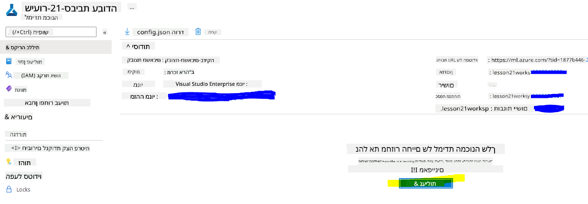

5. ב-Azure Machine Learning studio, לחץ על סמל ☰ בפינה השמאלית העליונה כדי לצפות בעמודים השונים בממשק. תוכל להשתמש בעמודים אלו לניהול המשאבים בסביבת העבודה שלך.

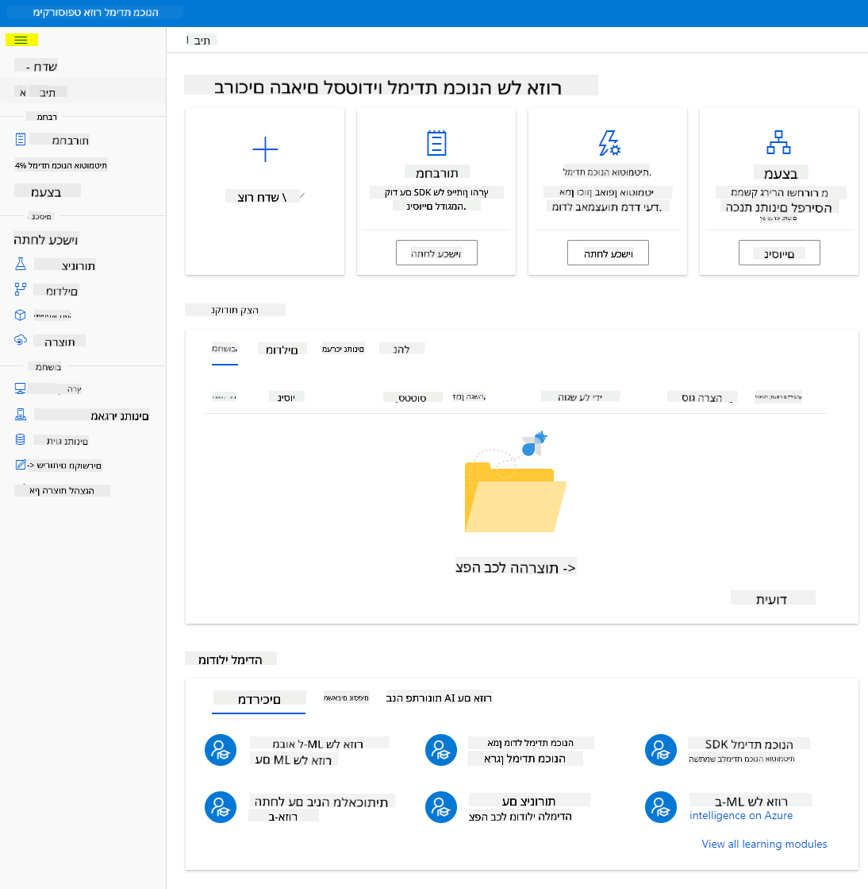

תוכל לנהל את סביבת העבודה שלך באמצעות פורטל Azure, אך עבור מדעני נתונים ומהנדסי תפעול למידת מכונה, Azure Machine Learning Studio מספק ממשק משתמש ממוקד יותר לניהול משאבי סביבת העבודה.

### 2.2 משאבי מחשוב

משאבי מחשוב הם משאבים מבוססי ענן שעליהם ניתן להפעיל תהליכי אימון מודלים וחקר נתונים. ישנם ארבעה סוגים של משאבי מחשוב שניתן ליצור:

- **Compute Instances**: תחנות עבודה לפיתוח שמדעני נתונים יכולים להשתמש בהן לעבודה עם נתונים ומודלים. זה כולל יצירת מכונה וירטואלית (VM) והפעלת מופע מחברת. לאחר מכן תוכל לאמן מודל על ידי קריאה לאשכול מחשוב מתוך המחברת.
- **Compute Clusters**: אשכולות ניתנים להרחבה של מכונות וירטואליות לעיבוד לפי דרישה של קוד ניסוי. תזדקק לכך בעת אימון מודל. אשכולות מחשוב יכולים גם להשתמש במשאבי GPU או CPU מיוחדים.
- **Inference Clusters**: יעדי פריסה לשירותי חיזוי שמשתמשים במודלים שאומנו.
- **מחשוב מצורף**: קישורים למשאבי מחשוב קיימים ב-Azure, כגון מכונות וירטואליות או אשכולות Azure Databricks.

#### 2.2.1 בחירת האפשרויות הנכונות עבור משאבי המחשוב שלך

ישנם גורמים מרכזיים שיש לקחת בחשבון בעת יצירת משאב מחשוב, והבחירות הללו יכולות להיות החלטות קריטיות.

**האם אתה צריך CPU או GPU?**

CPU (יחידת עיבוד מרכזית) הוא מעגל אלקטרוני שמבצע הוראות המהוות תוכנית מחשב. GPU (יחידת עיבוד גרפית) הוא מעגל אלקטרוני ייעודי שיכול לבצע קוד גרפי בקצב גבוה מאוד.

ההבדל העיקרי בין ארכיטקטורת CPU ל-GPU הוא ש-CPU מיועד לטפל במגוון רחב של משימות במהירות (נמדד לפי מהירות שעון CPU), אך מוגבל בכמות המשימות שיכולות לפעול במקביל. GPUs מיועדים למחשוב מקבילי ולכן הם הרבה יותר טובים במשימות של למידה עמוקה.

| CPU                                     | GPU                         |
|-----------------------------------------|-----------------------------|
| פחות יקר                                | יותר יקר                    |
| רמת מקביליות נמוכה                     | רמת מקביליות גבוהה          |
| איטי יותר באימון מודלים של למידה עמוקה | אופטימלי ללמידה עמוקה       |

**גודל אשכול**

אשכולות גדולים יותר יקרים יותר אך יובילו לתגובה טובה יותר. לכן, אם יש לך זמן אך לא מספיק כסף, כדאי להתחיל עם אשכול קטן. לעומת זאת, אם יש לך כסף אך לא הרבה זמן, כדאי להתחיל עם אשכול גדול יותר.

**גודל VM**

בהתאם למגבלות הזמן והתקציב שלך, תוכל לשנות את גודל ה-RAM, הדיסק, מספר הליבות ומהירות השעון. הגדלת כל הפרמטרים הללו תהיה יקרה יותר, אך תוביל לביצועים טובים יותר.

**מופעים ייעודיים או מופעים בעדיפות נמוכה?**

מופע בעדיפות נמוכה אומר שהוא ניתן להפרעה: למעשה, Microsoft Azure יכולה לקחת את המשאבים הללו ולהקצות אותם למשימה אחרת, ובכך להפריע לעבודה. מופע ייעודי, או בלתי ניתן להפרעה, אומר שהעבודה לעולם לא תופסק ללא רשותך.  
זו עוד שיקול של זמן מול כסף, שכן מופעים ניתנים להפרעה זולים יותר ממופעים ייעודיים.

#### 2.2.2 יצירת אשכול מחשוב

ב-[סביבת העבודה של Azure ML](https://ml.azure.com/) שיצרנו קודם, עבור למחשוב ותוכל לראות את משאבי המחשוב השונים שדיברנו עליהם (כלומר מופעי מחשוב, אשכולות מחשוב, אשכולות הסקה ומחשוב מצורף). עבור הפרויקט הזה, נצטרך אשכול מחשוב לאימון מודלים. בסטודיו, לחץ על תפריט "Compute", לאחר מכן על לשונית "Compute cluster" ולחץ על כפתור "+ New" כדי ליצור אשכול מחשוב.

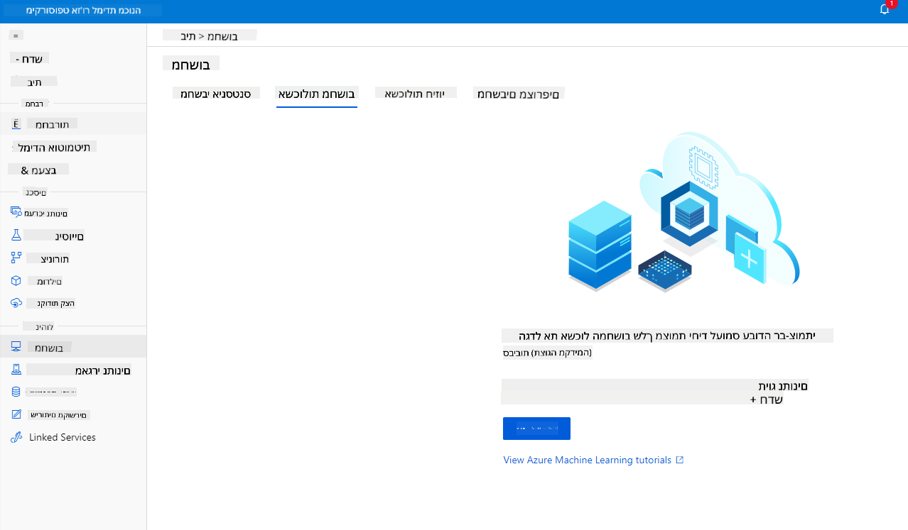

1. בחר את האפשרויות שלך: ייעודי מול עדיפות נמוכה, CPU או GPU, גודל VM ומספר ליבות (תוכל לשמור על ההגדרות ברירת המחדל עבור הפרויקט הזה).  
2. לחץ על כפתור Next.

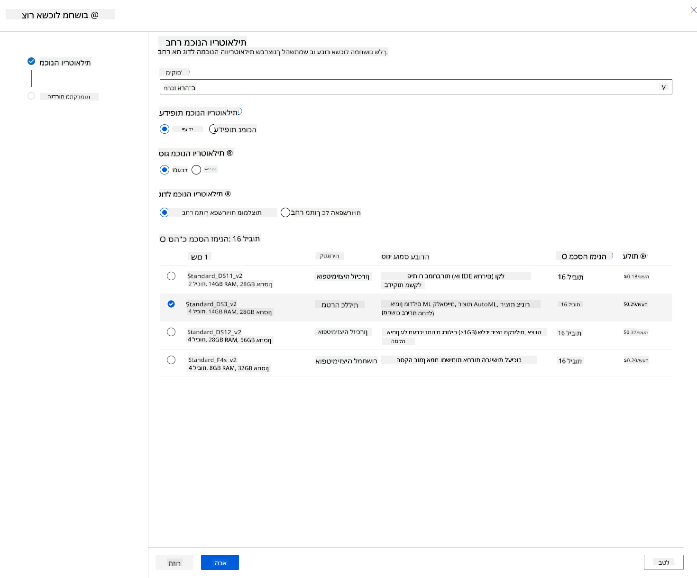

3. תן לאשכול שם מחשוב.  
4. בחר את האפשרויות שלך: מספר מינימלי/מקסימלי של צמתים, שניות במצב סרק לפני הקטנה, גישת SSH. שים לב שאם מספר הצמתים המינימלי הוא 0, תחסוך כסף כשהאשכול במצב סרק. שים לב שככל שמספר הצמתים המקסימלי גבוה יותר, כך האימון יהיה קצר יותר. המספר המקסימלי המומלץ של צמתים הוא 3.  
5. לחץ על כפתור "Create". שלב זה עשוי להימשך מספר דקות.


מעולה! עכשיו כשיש לנו אשכול מחשוב, אנחנו צריכים לטעון את הנתונים ל-Azure ML Studio.

### 2.3 טעינת מערך הנתונים

1. ב-[סביבת העבודה של Azure ML](https://ml.azure.com/) שיצרנו קודם, לחץ על "Datasets" בתפריט השמאלי ולחץ על כפתור "+ Create dataset" כדי ליצור מערך נתונים. בחר באפשרות "From local files" ובחר את מערך הנתונים של Kaggle שהורדנו קודם.

   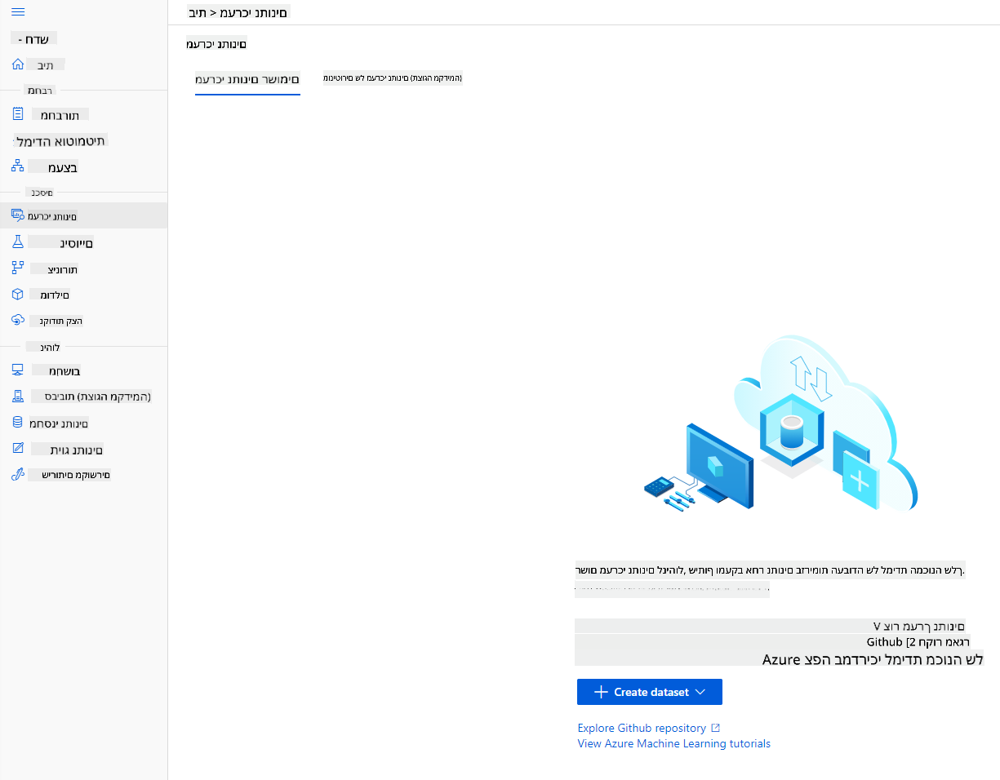

2. תן למערך הנתונים שלך שם, סוג ותיאור. לחץ על Next. העלה את הנתונים מהקבצים. לחץ על Next.

   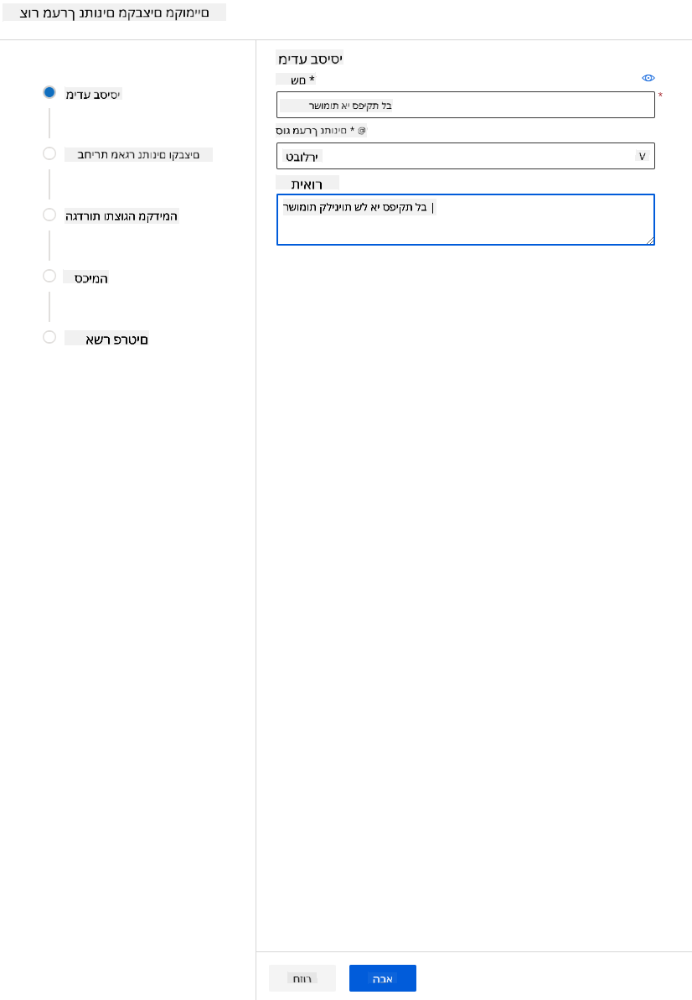

3. בסכימה, שנה את סוג הנתונים ל-Boolean עבור התכונות הבאות: anaemia, diabetes, high blood pressure, sex, smoking, ו-DEATH_EVENT. לחץ על Next ולחץ על Create.

   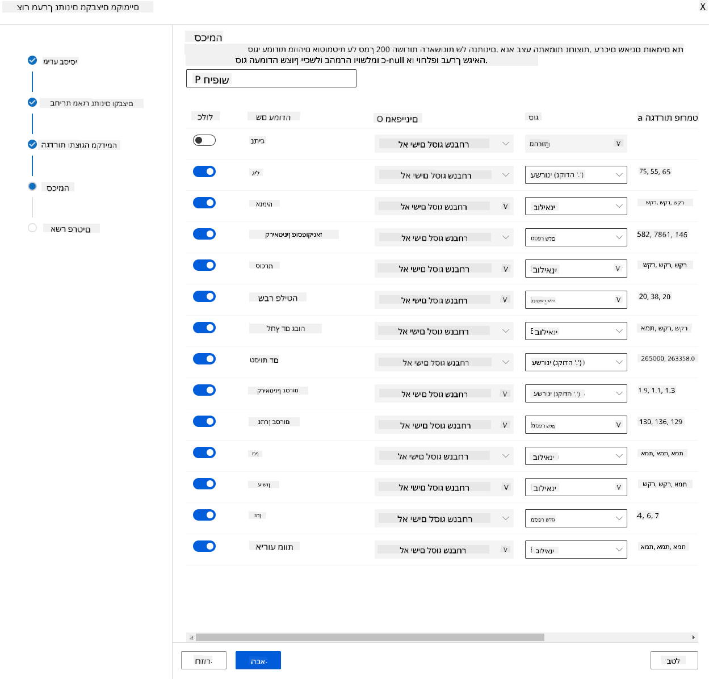

מעולה! עכשיו כשמערך הנתונים במקום ואשכול המחשוב נוצר, אנחנו יכולים להתחיל את אימון המודל!

### 2.4 אימון ללא קוד/מעט קוד עם AutoML

פיתוח מודלים מסורתי של למידת מכונה דורש משאבים רבים, ידע משמעותי בתחום וזמן כדי ליצור ולהשוות עשרות מודלים.  
למידת מכונה אוטומטית (AutoML) היא תהליך של אוטומציה של המשימות החוזרות והזמן-רבות בפיתוח מודלים של למידת מכונה. היא מאפשרת למדעני נתונים, אנליסטים ומפתחים לבנות מודלים של למידת מכונה בקנה מידה גבוה, ביעילות ובפרודוקטיביות, תוך שמירה על איכות המודל. היא מפחיתה את הזמן הדרוש לקבלת מודלים מוכנים לייצור, בקלות וביעילות רבה. [למידע נוסף](https://docs.microsoft.com/azure/machine-learning/concept-automated-ml?WT.mc_id=academic-77958-bethanycheum&ocid=AID3041109)

1. ב-[סביבת העבודה של Azure ML](https://ml.azure.com/) שיצרנו קודם, לחץ על "Automated ML" בתפריט השמאלי ובחר את מערך הנתונים שהעלית זה עתה. לחץ על Next.

   

2. הזן שם ניסוי חדש, עמודת יעד (DEATH_EVENT) ואשכול המחשוב שיצרנו. לחץ על Next.

   

3. בחר "Classification" ולחץ על Finish. שלב זה עשוי להימשך בין 30 דקות לשעה, בהתאם לגודל אשכול המחשוב שלך.

   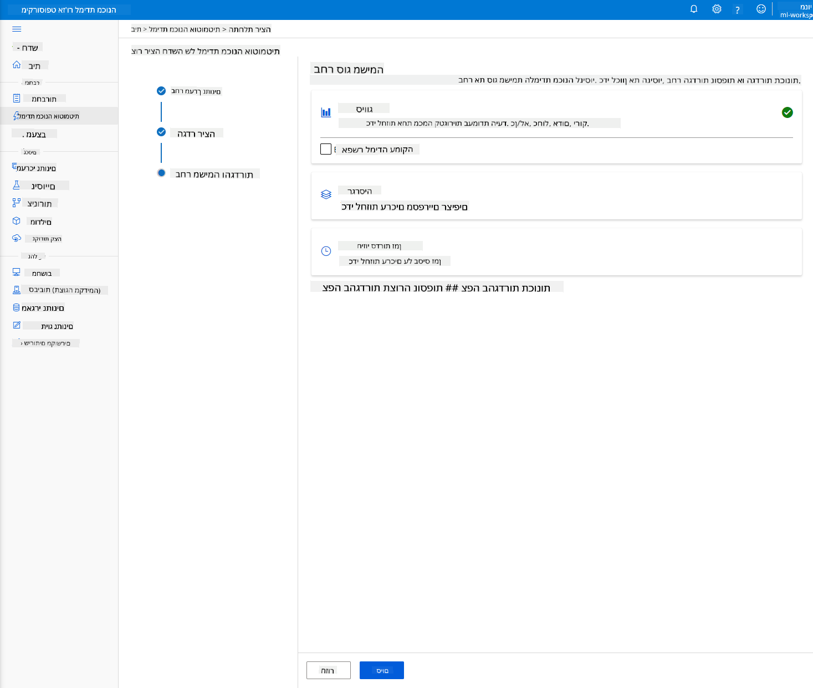

4. לאחר שההרצה הושלמה, לחץ על לשונית "Automated ML", לחץ על ההרצה שלך ולחץ על האלגוריתם בכרטיס "Best model summary".

   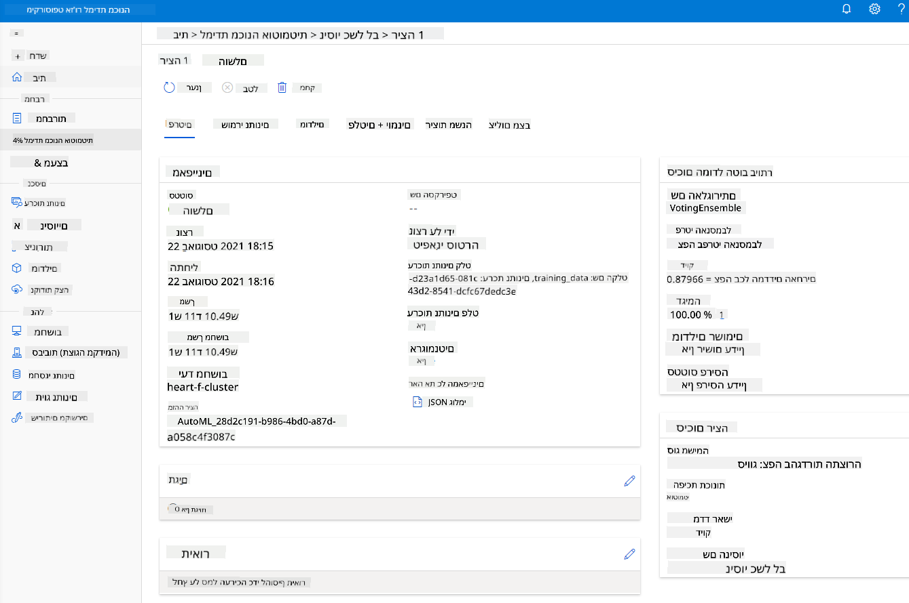

כאן תוכל לראות תיאור מפורט של המודל הטוב ביותר ש-AutoML יצר. תוכל גם לחקור מודלים אחרים שנוצרו בלשונית Models. קח כמה דקות לחקור את המודלים בלשונית Explanations (תצוגה מקדימה). לאחר שבחרת את המודל שברצונך להשתמש בו (כאן נבחר את המודל הטוב ביותר שנבחר על ידי AutoML), נראה כיצד ניתן לפרוס אותו.

## 3. פריסת מודל ללא קוד/מעט קוד וצריכת נקודת קצה
### 3.1 פריסת מודל

ממשק למידת המכונה האוטומטי מאפשר לך לפרוס את המודל הטוב ביותר כשירות אינטרנט בכמה צעדים. פריסה היא שילוב המודל כך שיוכל לבצע תחזיות על סמך נתונים חדשים ולזהות אזורים פוטנציאליים להזדמנות. עבור הפרויקט הזה, פריסה לשירות אינטרנט פירושה שיישומים רפואיים יוכלו לצרוך את המודל כדי לבצע תחזיות בזמן אמת על סיכון המטופלים שלהם ללקות בהתקף לב.

בתיאור המודל הטוב ביותר, לחץ על כפתור "Deploy".


15. תן לו שם, תיאור, סוג מחשוב (Azure Container Instance), הפעל אימות ולחץ על Deploy. שלב זה עשוי להימשך כ-20 דקות להשלמה. תהליך הפריסה כולל מספר שלבים, כולל רישום המודל, יצירת משאבים והגדרתם לשירות האינטרנט. הודעת סטטוס מופיעה תחת Deploy status. לחץ על Refresh באופן תקופתי כדי לבדוק את סטטוס הפריסה. הפריסה הושלמה ופועלת כאשר הסטטוס הוא "Healthy".


16. לאחר שהפריסה הושלמה, לחץ על לשונית Endpoint ולחץ על נקודת הקצה שפרסת זה עתה. כאן תוכל למצוא את כל הפרטים שאתה צריך לדעת על נקודת הקצה.

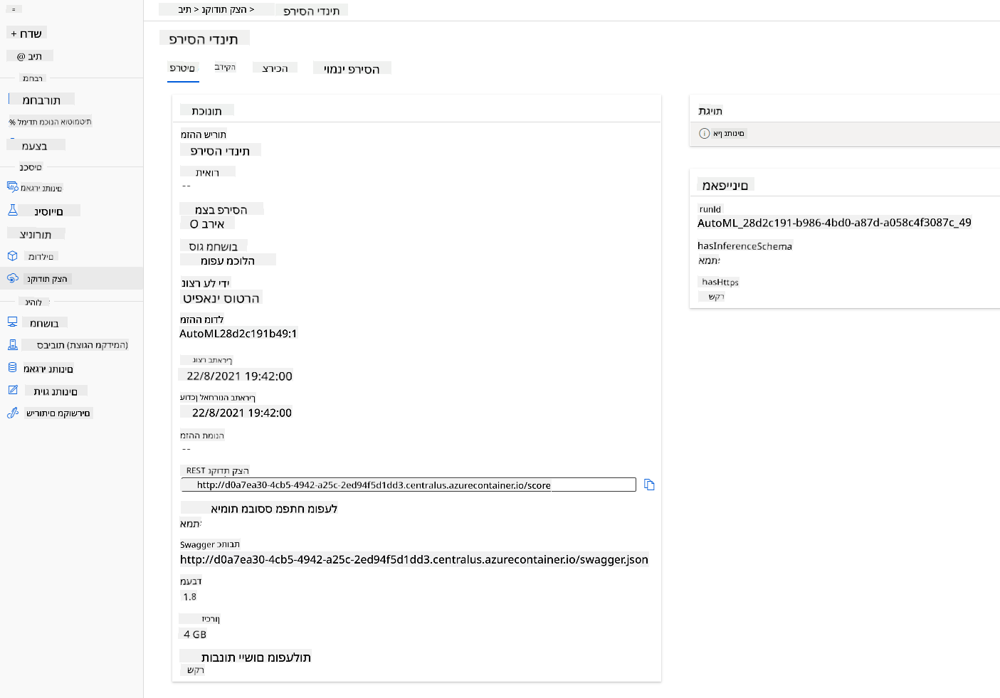

מדהים! עכשיו כשיש לנו מודל פרוס, אנחנו יכולים להתחיל את צריכת נקודת הקצה.

### 3.2 צריכת נקודת קצה

לחץ על לשונית "Consume". כאן תוכל למצוא את נקודת הקצה של REST ואת סקריפט הפייתון באפשרות הצריכה. קח זמן לקרוא את קוד הפייתון.

סקריפט זה יכול לפעול ישירות מהמחשב המקומי שלך ויצרוך את נקודת הקצה.

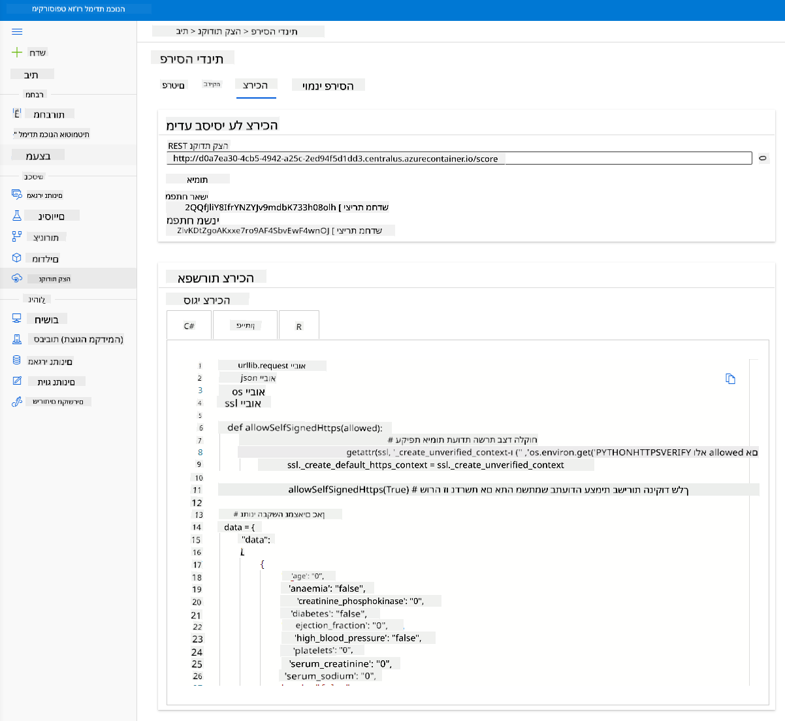

קח רגע לבדוק את שתי שורות הקוד הללו:

```python
url = 'http://98e3715f-xxxx-xxxx-xxxx-9ec22d57b796.centralus.azurecontainer.io/score'
api_key = '' # Replace this with the API key for the web service
```  
משתנה `url` הוא נקודת הקצה של REST שנמצאת בלשונית הצריכה, ומשתנה `api_key` הוא המפתח הראשי שנמצא גם הוא בלשונית הצריכה (רק במקרה שהפעלת אימות). כך הסקריפט יכול לצרוך את נקודת הקצה.

18. בהרצת הסקריפט, אתה אמור לראות את הפלט הבא:  
```python
    b'"{\\"result\\": [true]}"'
    ```  
זה אומר שהתחזית לכשל לבבי עבור הנתונים שניתנו היא נכונה. זה הגיוני כי אם תסתכל מקרוב על הנתונים שנוצרו אוטומטית בסקריפט, הכל מוגדר ל-0 ולשקר כברירת מחדל. תוכל לשנות את הנתונים עם דוגמת הקלט הבאה:

```python
data = {
    "data":
    [
        {
            'age': "0",
            'anaemia': "false",
            'creatinine_phosphokinase': "0",
            'diabetes': "false",
            'ejection_fraction': "0",
            'high_blood_pressure': "false",
            'platelets': "0",
            'serum_creatinine': "0",
            'serum_sodium': "0",
            'sex': "false",
            'smoking': "false",
            'time': "0",
        },
        {
            'age': "60",
            'anaemia': "false",
            'creatinine_phosphokinase': "500",
            'diabetes': "false",
            'ejection_fraction': "38",
            'high_blood_pressure': "false",
            'platelets': "260000",
            'serum_creatinine': "1.40",
            'serum_sodium': "137",
            'sex': "false",
            'smoking': "false",
            'time': "130",
        },
    ],
}
```  
הסקריפט אמור להחזיר:  
```python
    b'"{\\"result\\": [true, false]}"'
    ```  

מזל טוב! זה עתה צרכת את המודל שפרסת ואימנת אותו ב-Azure ML!

> **_הערה:_** לאחר שתסיים את הפרויקט, אל תשכח למחוק את כל המשאבים.

## 🚀 אתגר

בחן מקרוב את ההסברים והפרטים של המודל ש-AutoML יצר עבור המודלים המובילים. נסה להבין מדוע המודל הטוב ביותר טוב יותר מהאחרים. אילו אלגוריתמים הושוו? מה ההבדלים ביניהם? מדוע המודל הטוב ביותר מבצע טוב יותר במקרה הזה?

## [שאלון לאחר ההרצאה](https://ff-quizzes.netlify.app/en/ds/)

## סקירה ולימוד עצמי

בשיעור זה, למדת כיצד לאמן, לפרוס ולצרוך מודל לחיזוי סיכון לכשל לבבי בצורה של מעט קוד/ללא קוד בענן. אם עדיין לא עשית זאת, העמק בהסברים של המודל ש-AutoML יצר עבור המודלים המובילים ונסה להבין מדוע המודל הטוב ביותר טוב יותר מאחרים.

תוכל להעמיק עוד בלמידת מכונה אוטומטית עם מעט קוד/ללא קוד על ידי קריאת [התיעוד הזה](https://docs.microsoft.com/azure/machine-learning/tutorial-first-experiment-automated-ml?WT.mc_id=academic-77958-bethanycheum&ocid=AID3041109).

## משימה

[פרויקט מדעי נתונים עם מעט קוד/ללא קוד ב-Azure ML](assignment.md)

---

**כתב ויתור**:  
מסמך זה תורגם באמצעות שירות תרגום מבוסס בינה מלאכותית [Co-op Translator](https://github.com/Azure/co-op-translator). למרות שאנו שואפים לדיוק, יש לקחת בחשבון שתרגומים אוטומטיים עשויים להכיל שגיאות או אי דיוקים. המסמך המקורי בשפתו המקורית צריך להיחשב כמקור סמכותי. עבור מידע קריטי, מומלץ להשתמש בתרגום מקצועי על ידי אדם. איננו אחראים לאי הבנות או לפרשנויות שגויות הנובעות משימוש בתרגום זה.