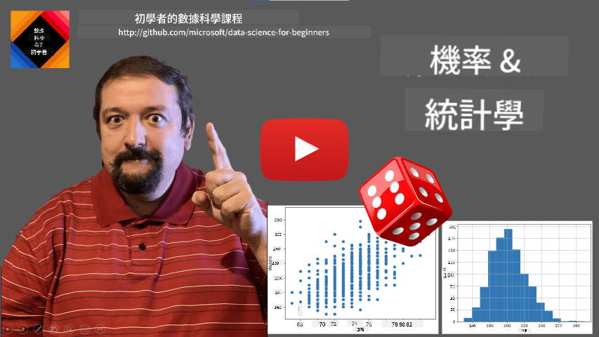
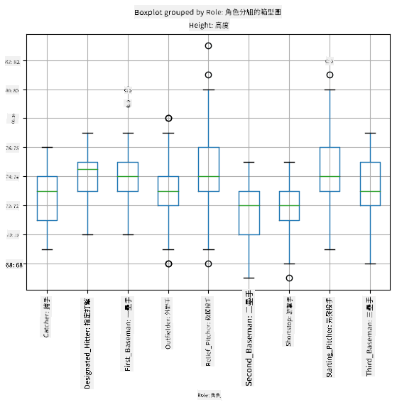
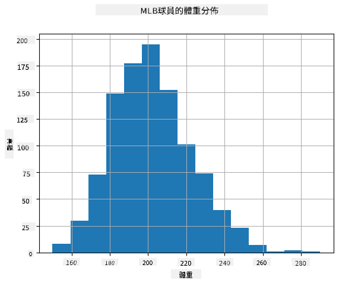
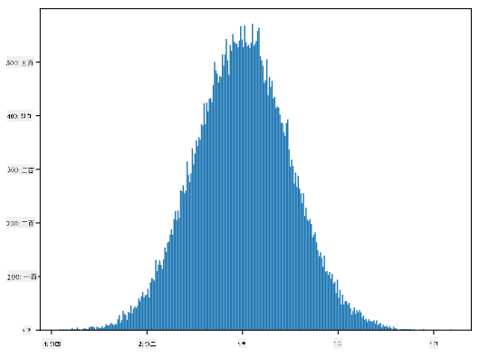
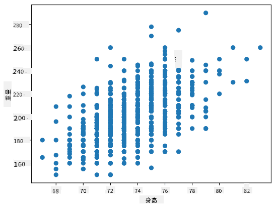

<!--
CO_OP_TRANSLATOR_METADATA:
{
  "original_hash": "ce95884566a74db72572cd51f0cb25ad",
  "translation_date": "2025-09-06T13:05:48+00:00",
  "source_file": "1-Introduction/04-stats-and-probability/README.md",
  "language_code": "hk"
}
-->
# 統計學與概率簡介

| ](../../sketchnotes/04-Statistics-Probability.png)|
|:---:|
| 統計學與概率 - _Sketchnote by [@nitya](https://twitter.com/nitya)_ |

統計學與概率論是數學中兩個密切相關的領域，對於數據科學非常重要。雖然在沒有深入數學知識的情況下也可以處理數據，但了解一些基本概念仍然是有益的。在這裡，我們將提供一個簡短的介紹，幫助你入門。

[](https://youtu.be/Z5Zy85g4Yjw)

## [課前測驗](https://ff-quizzes.netlify.app/en/ds/quiz/6)

## 概率與隨機變數

**概率** 是介於 0 和 1 之間的一個數字，用來表示某個 **事件** 發生的可能性。它被定義為正面結果（導致事件發生的結果）的數量，除以所有可能結果的總數，前提是所有結果的可能性相等。例如，當我們擲骰子時，得到偶數的概率是 3/6 = 0.5。

當我們談論事件時，我們使用 **隨機變數**。例如，表示擲骰子時得到的數字的隨機變數可以取值 1 到 6。1 到 6 的數字集合被稱為 **樣本空間**。我們可以討論隨機變數取某個值的概率，例如 P(X=3)=1/6。

上述例子中的隨機變數被稱為 **離散型**，因為它有一個可數的樣本空間，即可以枚舉的獨立值。有些情況下，樣本空間是一個實數範圍，或者是整個實數集合。這樣的變數被稱為 **連續型**。一個好的例子是公交車到達的時間。

## 概率分佈

對於離散型隨機變數，可以通過函數 P(X) 輕鬆描述每個事件的概率。對於樣本空間 *S* 中的每個值 *s*，它會給出一個介於 0 和 1 之間的數字，並且所有事件的 P(X=s) 值的總和為 1。

最著名的離散分佈是 **均勻分佈**，其中樣本空間有 N 個元素，每個元素的概率均為 1/N。

描述連續型變數的概率分佈則更困難，這些變數的值來自某個區間 [a,b] 或整個實數集合 ℝ。以公交車到達時間為例，實際上，公交車在某個精確時間 *t* 到達的概率是 0！

> 現在你知道了概率為 0 的事件是會發生的，而且非常頻繁！至少每次公交車到達時都是如此！

我們只能討論變數落在某個值區間內的概率，例如 P(t<sub>1</sub>≤X<t<sub>2</sub>)。在這種情況下，概率分佈由 **概率密度函數** p(x) 描述，其公式如下：


連續型均勻分佈是均勻分佈的連續版本，定義在有限區間內。變數 X 落入某個區間的概率與區間長度 l 成正比，且最大為 1。

另一個重要的分佈是 **正態分佈**，我們將在下面詳細討論。

## 平均值、方差與標準差

假設我們抽取了 n 個隨機變數 X 的樣本：x<sub>1</sub>, x<sub>2</sub>, ..., x<sub>n</sub>。我們可以用傳統方式定義序列的 **平均值**（或 **算術平均值**）為 (x<sub>1</sub>+x<sub>2</sub>+x<sub>n</sub>)/n。隨著樣本量的增加（即 n→∞），我們將得到分佈的平均值（也稱為 **期望值**）。我們用 **E**(x) 表示期望值。

> 可以證明，對於任何離散分佈，其值為 {x<sub>1</sub>, x<sub>2</sub>, ..., x<sub>N</sub>}，對應的概率為 p<sub>1</sub>, p<sub>2</sub>, ..., p<sub>N</sub>，期望值為 E(X)=x<sub>1</sub>p<sub>1</sub>+x<sub>2</sub>p<sub>2</sub>+...+x<sub>N</sub>p<sub>N</sub>。

為了確定數值的分散程度，我們可以計算方差 σ<sup>2</sup> = ∑(x<sub>i</sub> - μ)<sup>2</sup>/n，其中 μ 是序列的平均值。σ 被稱為 **標準差**，而 σ<sup>2</sup> 被稱為 **方差**。

## 眾數、中位數與四分位數

有時候，平均值並不能充分代表數據的「典型」值。例如，當有一些極端值完全超出範圍時，它們可能會影響平均值。另一個良好的指標是 **中位數**，即一個值，使得一半的數據點低於它，另一半高於它。

為了幫助我們理解數據的分佈，討論 **四分位數** 是有幫助的：

* 第一四分位數（Q1）：使得 25% 的數據低於該值
* 第三四分位數（Q3）：使得 75% 的數據低於該值

我們可以用一個稱為 **盒形圖** 的圖表來表示中位數與四分位數之間的關係：


在這裡，我們還計算了 **四分位距** IQR=Q3-Q1，以及所謂的 **異常值**——位於 [Q1-1.5*IQR,Q3+1.5*IQR] 範圍之外的值。

對於包含少量可能值的有限分佈，一個好的「典型」值是出現頻率最高的值，稱為 **眾數**。它通常應用於分類數據，例如顏色。考慮一種情況，我們有兩組人——一組人強烈偏愛紅色，另一組人偏愛藍色。如果我們用數字編碼顏色，最喜歡的顏色的平均值可能會落在橙色或綠色範圍，這並不能反映任何一組的實際偏好。然而，眾數可能是其中一種顏色，或者是兩種顏色（如果投票人數相等，在這種情況下我們稱樣本為 **多眾數**）。

## 真實世界數據

當我們分析真實世界的數據時，它們通常不是隨機變數，因為我們並未進行未知結果的實驗。例如，考慮一組棒球運動員及其身體數據，如身高、體重和年齡。這些數字並不完全是隨機的，但我們仍然可以應用相同的數學概念。例如，一組人的體重可以被視為從某個隨機變數中抽取的一組值。以下是來自 [美國職業棒球大聯盟](http://mlb.mlb.com/index.jsp) 的棒球運動員的體重序列，取自 [這個數據集](http://wiki.stat.ucla.edu/socr/index.php/SOCR_Data_MLB_HeightsWeights)（為方便起見，僅顯示前 20 個值）：

```
[180.0, 215.0, 210.0, 210.0, 188.0, 176.0, 209.0, 200.0, 231.0, 180.0, 188.0, 180.0, 185.0, 160.0, 180.0, 185.0, 197.0, 189.0, 185.0, 219.0]
```

> **注意**：要查看使用此數據集的示例，請參閱 [配套筆記本](notebook.ipynb)。本課程中還有許多挑戰，你可以通過向該筆記本添加一些代碼來完成它們。如果你不確定如何操作數據，請不要擔心——我們稍後會回到使用 Python 處理數據的部分。如果你不知道如何在 Jupyter Notebook 中運行代碼，請參閱 [這篇文章](https://soshnikov.com/education/how-to-execute-notebooks-from-github/)。

以下是顯示我們數據的平均值、中位數和四分位數的盒形圖：


由於我們的數據包含不同球員 **角色** 的信息，我們還可以按角色繪製盒形圖——這將幫助我們了解參數值在不同角色之間的差異。這次我們將考慮身高：



這個圖表表明，平均而言，一壘手的身高高於二壘手的身高。在本課程的後面部分，我們將學習如何更正式地檢驗這一假設，以及如何證明我們的數據在統計上具有顯著性。

> 在處理真實世界數據時，我們假設所有數據點都是從某個概率分佈中抽取的樣本。這一假設使我們能夠應用機器學習技術並構建有效的預測模型。

為了查看我們數據的分佈，我們可以繪製一個稱為 **直方圖** 的圖表。X 軸包含若干不同的體重區間（即 **箱**），而垂直軸顯示隨機變數樣本落入某個區間的次數。



從這個直方圖中可以看出，所有值都集中在某個平均體重附近，距離平均體重越遠，該值出現的次數越少。也就是說，棒球運動員的體重與平均體重差異很大的可能性非常低。體重的方差顯示了體重與平均值可能的差異程度。

> 如果我們取其他人的體重，而不是棒球聯盟的球員，分佈可能會有所不同。然而，分佈的形狀會保持一致，但平均值和方差會改變。因此，如果我們在棒球運動員上訓練模型，當應用於大學學生時可能會得出錯誤的結果，因為底層分佈不同。

## 正態分佈

我們上面看到的體重分佈非常典型，許多來自真實世界的測量值遵循相同類型的分佈，但具有不同的平均值和方差。這種分佈被稱為 **正態分佈**，在統計學中具有非常重要的作用。

使用正態分佈是生成潛在棒球運動員隨機體重的正確方法。一旦我們知道平均體重 `mean` 和標準差 `std`，我們可以用以下方式生成 1000 個體重樣本：
```python
samples = np.random.normal(mean,std,1000)
``` 

如果我們繪製生成樣本的直方圖，我們會看到與上面顯示的圖非常相似的圖像。如果我們增加樣本數量和箱的數量，我們可以生成更接近理想的正態分佈圖像：



*平均值=0，標準差=1 的正態分佈*

## 置信區間

當我們談論棒球運動員的體重時，我們假設存在某個 **隨機變數 W**，它對應於所有棒球運動員體重的理想概率分佈（即 **總體**）。我們的體重序列對應於所有棒球運動員的一個子集，我們稱之為 **樣本**。一個有趣的問題是，我們能否知道 W 的分佈參數，即總體的平均值和方差？

最簡單的答案是計算我們樣本的平均值和方差。然而，可能出現的情況是，我們的隨機樣本並不能準確代表完整的總體。因此，討論 **置信區間** 是有意義的。

> **置信區間** 是基於我們的樣本估算總體真實平均值的範圍，其準確性具有一定的概率（或 **置信水平**）。

假設我們有一個樣本 X

1</sub>, ..., X<sub>n</sub> 從我們的分佈中抽取樣本。每次從分佈中抽取樣本，我們都會得到不同的平均值 μ。因此，μ 可以被視為一個隨機變數。一個具有置信度 p 的 **置信區間** 是一對值 (L<sub>p</sub>,R<sub>p</sub>)，使得 **P**(L<sub>p</sub>≤μ≤R<sub>p</sub>) = p，即測量的平均值落在區間內的概率等於 p。

詳細討論如何計算這些置信區間超出了我們的簡短介紹範圍。更多細節可以參考 [維基百科](https://en.wikipedia.org/wiki/Confidence_interval)。簡而言之，我們定義了計算的樣本平均值相對於母體真實平均值的分佈，這被稱為 **學生分佈**。

> **有趣的事實**：學生分佈以數學家 William Sealy Gosset 命名，他以筆名 "Student" 發表了他的論文。他在健力士啤酒廠工作，根據其中一個版本，他的雇主不希望公眾知道他們使用統計測試來檢測原材料的質量。

如果我們希望以置信度 p 估計母體的平均值 μ，我們需要取學生分佈 A 的 *(1-p)/2 百分位數*，這可以從表格中獲得，或者使用統計軟件（例如 Python、R 等）的內置函數計算。然後 μ 的區間將由 X±A*D/√n 給出，其中 X 是樣本的平均值，D 是標準差。

> **注意**：我們也省略了與學生分佈相關的重要概念 [自由度](https://en.wikipedia.org/wiki/Degrees_of_freedom_(statistics)) 的討論。您可以參考更完整的統計書籍以更深入地理解這個概念。

在 [附帶的筆記本](notebook.ipynb) 中提供了一個計算體重和身高置信區間的例子。

| p | 體重平均值 |
|-----|-----------|
| 0.85 | 201.73±0.94 |
| 0.90 | 201.73±1.08 |
| 0.95 | 201.73±1.28 |

注意，置信概率越高，置信區間越寬。

## 假設檢定

在我們的棒球球員數據集中，有不同的球員角色，可以總結如下（查看 [附帶的筆記本](notebook.ipynb) 以了解如何計算此表）：

| 角色 | 身高 | 體重 | 數量 |
|------|--------|--------|-------|
| 捕手 | 72.723684 | 204.328947 | 76 |
| 指定打擊 | 74.222222 | 220.888889 | 18 |
| 一壘手 | 74.000000 | 213.109091 | 55 |
| 外野手 | 73.010309 | 199.113402 | 194 |
| 救援投手 | 74.374603 | 203.517460 | 315 |
| 二壘手 | 71.362069 | 184.344828 | 58 |
| 游擊手 | 71.903846 | 182.923077 | 52 |
| 先發投手 | 74.719457 | 205.163636 | 221 |
| 三壘手 | 73.044444 | 200.955556 | 45 |

我們可以注意到，一壘手的平均身高比二壘手高。因此，我們可能會得出結論：**一壘手比二壘手高**。

> 這個陳述被稱為 **假設**，因為我們不知道這個事實是否真的成立。

然而，是否可以得出這個結論並不總是顯而易見的。從上面的討論中我們知道，每個平均值都有一個相關的置信區間，因此這種差異可能只是統計誤差。我們需要更正式的方法來檢驗我們的假設。

讓我們分別計算一壘手和二壘手的身高置信區間：

| 置信度 | 一壘手 | 二壘手 |
|------------|---------------|----------------|
| 0.85 | 73.62..74.38 | 71.04..71.69 |
| 0.90 | 73.56..74.44 | 70.99..71.73 |
| 0.95 | 73.47..74.53 | 70.92..71.81 |

我們可以看到，在任何置信度下，區間都不重疊。這證明了我們的假設，即一壘手比二壘手高。

更正式地說，我們正在解決的問題是檢查 **兩個概率分佈是否相同**，或者至少是否具有相同的參數。根據分佈，我們需要使用不同的檢定方法。如果我們知道分佈是正態分佈，我們可以應用 **[學生 t 檢定](https://en.wikipedia.org/wiki/Student%27s_t-test)**。

在學生 t 檢定中，我們計算所謂的 **t 值**，它表示平均值之間的差異，並考慮到方差。已證明 t 值遵循 **學生分佈**，這使我們能夠獲得給定置信度 **p** 的閾值（這可以計算，或者在數值表中查找）。然後我們將 t 值與該閾值進行比較，以批准或拒絕假設。

在 Python 中，我們可以使用 **SciPy** 套件，其中包括 `ttest_ind` 函數（以及許多其他有用的統計函數！）。它為我們計算 t 值，並且還反向查找置信度 p 值，因此我們只需查看置信度即可得出結論。

例如，我們比較一壘手和二壘手的身高，得到以下結果：
```python
from scipy.stats import ttest_ind

tval, pval = ttest_ind(df.loc[df['Role']=='First_Baseman',['Height']], df.loc[df['Role']=='Designated_Hitter',['Height']],equal_var=False)
print(f"T-value = {tval[0]:.2f}\nP-value: {pval[0]}")
```
```
T-value = 7.65
P-value: 9.137321189738925e-12
```
在我們的情況下，p 值非常低，這意味著有強有力的證據支持一壘手更高。

此外，我們可能希望檢驗其他類型的假設，例如：
* 證明某個樣本遵循某種分佈。在我們的情況下，我們假設身高是正態分佈的，但這需要正式的統計驗證。
* 證明樣本的平均值與某個預定值相符
* 比較多個樣本的平均值（例如，不同年齡組的幸福水平差異）

## 大數法則與中心極限定理

正態分佈如此重要的原因之一是所謂的 **中心極限定理**。假設我們有一個由獨立的 N 個值 X<sub>1</sub>, ..., X<sub>N</sub> 組成的大樣本，這些值來自任何具有平均值 μ 和方差 σ<sup>2</sup> 的分佈。那麼，當 N 足夠大時（換句話說，當 N→∞），平均值 Σ<sub>i</sub>X<sub>i</sub> 將呈正態分佈，平均值為 μ，方差為 σ<sup>2</sup>/N。

> 另一種解釋中心極限定理的方法是說，無論分佈如何，當您計算任何隨機變數值的總和的平均值時，最終都會得到正態分佈。

從中心極限定理還可以得出，當 N→∞ 時，樣本平均值等於 μ 的概率變為 1。這被稱為 **大數法則**。

## 協方差與相關性

數據科學的一項工作是尋找數據之間的關係。當兩個序列在同一時間表現出相似的行為時，我們說它們 **相關**，即它們要麼同時上升/下降，要麼一個序列上升時另一個序列下降，反之亦然。換句話說，兩個序列之間似乎存在某種關係。

> 相關性並不一定表示兩個序列之間存在因果關係；有時兩個變量可能依賴於某個外部原因，或者它們的相關性可能純屬偶然。然而，強數學相關性是兩個變量某種程度上相互關聯的良好指標。

數學上，顯示兩個隨機變數之間關係的主要概念是 **協方差**，其計算公式為：Cov(X,Y) = **E**\[(X-**E**(X))(Y-**E**(Y))\]。我們計算兩個變數偏離其平均值的偏差，然後計算這些偏差的乘積。如果兩個變數一起偏離，乘積將始終為正值，並累加為正協方差。如果兩個變數不同步偏離（即一個低於平均值時另一個高於平均值），我們將始終得到負數，並累加為負協方差。如果偏差不相關，它們將累加為大約零。

協方差的絕對值並不能告訴我們相關性有多大，因為它取決於實際值的大小。為了標準化，我們可以將協方差除以兩個變數的標準差，得到 **相關性**。相關性始終在 [-1,1] 範圍內，其中 1 表示值之間的強正相關，-1 表示強負相關，0 表示完全無相關（變數獨立）。

**例子**：我們可以計算棒球球員的體重和身高之間的相關性：
```python
print(np.corrcoef(weights,heights))
```
結果，我們得到如下的 **相關性矩陣**：
```
array([[1.        , 0.52959196],
       [0.52959196, 1.        ]])
```

> 相關性矩陣 C 可以為任意數量的輸入序列 S<sub>1</sub>, ..., S<sub>n</sub> 計算。C<sub>ij</sub> 的值是 S<sub>i</sub> 和 S<sub>j</sub> 之間的相關性，對角元素始終為 1（這也是 S<sub>i</sub> 的自相關性）。

在我們的情況下，值 0.53 表明一個人的體重和身高之間存在一定的相關性。我們還可以繪製一個值對另一個值的散點圖，以直觀地查看關係：



> 更多相關性和協方差的例子可以在 [附帶的筆記本](notebook.ipynb) 中找到。

## 結論

在本節中，我們學習了：

* 數據的基本統計屬性，例如平均值、方差、眾數和四分位數
* 隨機變數的不同分佈，包括正態分佈
* 如何找到不同屬性之間的相關性
* 如何使用數學和統計的嚴謹工具來證明一些假設
* 如何根據數據樣本計算隨機變數的置信區間

雖然這絕不是概率和統計中所有主題的完整列表，但應該足以讓您在本課程中有一個良好的開始。

## 🚀 挑戰

使用筆記本中的示例代碼來測試其他假設：
1. 一壘手比二壘手年齡更大
2. 一壘手比三壘手更高
3. 游擊手比二壘手更高

## [課後測驗](https://ff-quizzes.netlify.app/en/ds/quiz/7)

## 回顧與自學

概率和統計是一個非常廣泛的主題，值得開設自己的課程。如果您有興趣深入理論，可以繼續閱讀以下書籍：

1. [Carlos Fernandez-Granda](https://cims.nyu.edu/~cfgranda/)（紐約大學）有很棒的講義 [Probability and Statistics for Data Science](https://cims.nyu.edu/~cfgranda/pages/stuff/probability_stats_for_DS.pdf)（在線提供）
1. [Peter 和 Andrew Bruce. Practical Statistics for Data Scientists.](https://www.oreilly.com/library/view/practical-statistics-for/9781491952955/) [[R 示例代碼](https://github.com/andrewgbruce/statistics-for-data-scientists)]。
1. [James D. Miller. Statistics for Data Science](https://www.packtpub.com/product/statistics-for-data-science/9781788290678) [[R 示例代碼](https://github.com/PacktPublishing/Statistics-for-Data-Science)]

## 作業

[小型糖尿病研究](assignment.md)

## 致謝

本課程由 [Dmitry Soshnikov](http://soshnikov.com) 用 ♥️ 編寫。

---

**免責聲明**：  
此文件已使用人工智能翻譯服務 [Co-op Translator](https://github.com/Azure/co-op-translator) 進行翻譯。我們致力於提供準確的翻譯，但請注意，自動翻譯可能包含錯誤或不準確之處。應以原始語言的文件作為權威來源。對於關鍵資訊，建議尋求專業的人類翻譯。我們對因使用此翻譯而引起的任何誤解或錯誤解讀概不負責。