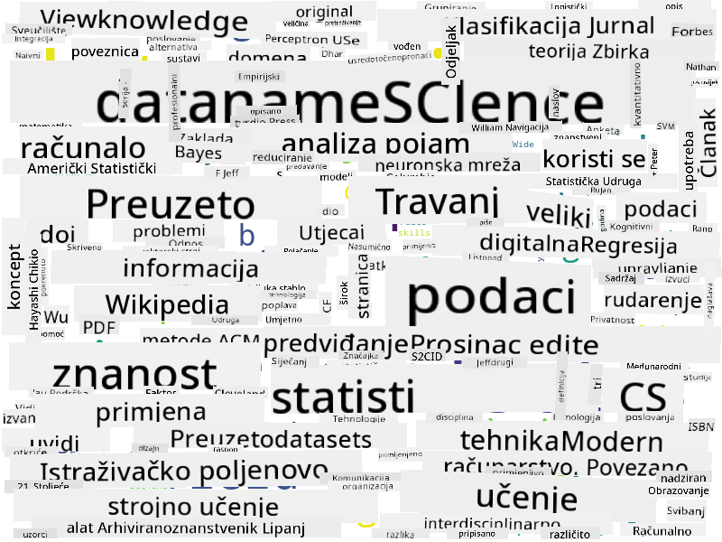

<!--
CO_OP_TRANSLATOR_METADATA:
{
  "original_hash": "8141e7195841682914be03ef930fe43d",
  "translation_date": "2025-09-03T20:31:48+00:00",
  "source_file": "1-Introduction/01-defining-data-science/README.md",
  "language_code": "hr"
}
-->
## Vrste podataka

Kao što smo već spomenuli, podaci su svugdje oko nas. Samo ih trebamo pravilno zabilježiti! Korisno je razlikovati **strukturirane** i **nestrukturirane** podatke. Strukturirani podaci obično su predstavljeni u nekom dobro organiziranom obliku, često kao tablica ili skup tablica, dok su nestrukturirani podaci samo zbirka datoteka. Ponekad možemo govoriti i o **polustrukturiranim** podacima, koji imaju neku vrstu strukture koja može značajno varirati.

| Strukturirani                                                               | Polustrukturirani                                                                             | Nestrukturirani                        |
| ---------------------------------------------------------------------------- | -------------------------------------------------------------------------------------------- | --------------------------------------- |
| Popis ljudi s njihovim telefonskim brojevima                                | Wikipedijine stranice s poveznicama                                                          | Tekst Enciklopedije Britannica         |
| Temperatura u svim prostorijama zgrade svake minute tijekom zadnjih 20 godina | Zbirka znanstvenih radova u JSON formatu s autorima, datumom objave i sažetkom               | Datoteke s korporativnim dokumentima   |
| Podaci o dobi i spolu svih osoba koje ulaze u zgradu                        | Internetske stranice                                                                          | Sirovi videozapis s nadzorne kamere    |

## Gdje pronaći podatke

Postoji mnogo mogućih izvora podataka, i nemoguće je nabrojati sve! Međutim, spomenimo neke od tipičnih mjesta gdje možete pronaći podatke:

* **Strukturirani**
  - **Internet stvari** (IoT), uključujući podatke s različitih senzora, poput senzora temperature ili tlaka, pruža mnogo korisnih podataka. Na primjer, ako je poslovna zgrada opremljena IoT senzorima, možemo automatski kontrolirati grijanje i rasvjetu kako bismo smanjili troškove.
  - **Ankete** koje tražimo od korisnika da ispune nakon kupnje ili posjeta web stranici.
  - **Analiza ponašanja** može nam, na primjer, pomoći da razumijemo koliko duboko korisnik istražuje web stranicu i koji su tipični razlozi za napuštanje stranice.
* **Nestrukturirani**
  - **Tekstovi** mogu biti bogat izvor uvida, poput ukupnog **sentiment rezultata** ili izdvajanja ključnih riječi i semantičkog značenja.
  - **Slike** ili **videozapisi**. Videozapis s nadzorne kamere može se koristiti za procjenu prometa na cesti i obavještavanje ljudi o potencijalnim gužvama.
  - **Zapisi web poslužitelja** mogu se koristiti za razumijevanje koje stranice naše web stranice se najčešće posjećuju i koliko dugo.
* **Polustrukturirani**
  - **Grafovi društvenih mreža** mogu biti izvrsni izvori podataka o osobnostima korisnika i potencijalnoj učinkovitosti u širenju informacija.
  - Kada imamo zbirku fotografija s neke zabave, možemo pokušati izvući podatke o **dinamici grupe** izradom grafa ljudi koji se fotografiraju zajedno.

Poznavanjem različitih mogućih izvora podataka možete razmišljati o različitim scenarijima u kojima se tehnike znanosti o podacima mogu primijeniti za bolje razumijevanje situacije i poboljšanje poslovnih procesa.

## Što možete učiniti s podacima

U znanosti o podacima fokusiramo se na sljedeće korake u radu s podacima:

Naravno, ovisno o stvarnim podacima, neki koraci mogu nedostajati (npr. kada već imamo podatke u bazi podataka ili kada nije potrebno treniranje modela), ili se neki koraci mogu ponavljati nekoliko puta (poput obrade podataka).

## Digitalizacija i digitalna transformacija

U posljednjem desetljeću, mnoge su tvrtke počele shvaćati važnost podataka pri donošenju poslovnih odluka. Kako bi se primijenili principi znanosti o podacima na vođenje poslovanja, prvo je potrebno prikupiti neke podatke, tj. prevesti poslovne procese u digitalni oblik. To se naziva **digitalizacija**. Primjena tehnika znanosti o podacima na te podatke za donošenje odluka može dovesti do značajnog povećanja produktivnosti (ili čak poslovnog zaokreta), što nazivamo **digitalnom transformacijom**.

Razmotrimo primjer. Pretpostavimo da imamo tečaj znanosti o podacima (poput ovog) koji se online dostavlja studentima, i želimo koristiti znanost o podacima za njegovo poboljšanje. Kako to možemo učiniti?

Možemo započeti pitanjem "Što se može digitalizirati?" Najjednostavniji način bio bi mjerenje vremena koje svakom studentu treba za dovršavanje svakog modula, te mjerenje stečenog znanja davanjem testa s višestrukim izborom na kraju svakog modula. Prosječnim vremenom dovršavanja među svim studentima možemo otkriti koji moduli uzrokuju najviše poteškoća studentima i raditi na njihovom pojednostavljivanju.
Možete tvrditi da ovaj pristup nije idealan, jer moduli mogu biti različitih duljina. Vjerojatno je pravednije podijeliti vrijeme s duljinom modula (u broju znakova) i usporediti te vrijednosti umjesto toga.
Kada počnemo analizirati rezultate testova s višestrukim izborom, možemo pokušati utvrditi koje koncepte učenici teško razumiju i koristiti te informacije za poboljšanje sadržaja. Da bismo to postigli, trebamo osmisliti testove na način da svako pitanje odgovara određenom konceptu ili dijelu znanja.

Ako želimo ići još dublje, možemo usporediti vrijeme potrebno za svaki modul s dobnim kategorijama učenika. Možda ćemo otkriti da za neke dobne kategorije treba neprimjereno dugo vremena za dovršetak modula ili da učenici odustaju prije nego što ga završe. Ovo nam može pomoći da damo preporuke za module prema dobi i smanjimo nezadovoljstvo ljudi zbog pogrešnih očekivanja.

## 🚀 Izazov

U ovom izazovu pokušat ćemo pronaći koncepte relevantne za područje Data Science analizirajući tekstove. Uzet ćemo članak s Wikipedije o Data Science, preuzeti i obraditi tekst, a zatim izraditi oblak riječi poput ovog:

Posjetite [`notebook.ipynb`](../../../../../../../../../1-Introduction/01-defining-data-science/notebook.ipynb ':ignore') kako biste pregledali kod. Također možete pokrenuti kod i vidjeti kako u stvarnom vremenu provodi sve transformacije podataka.

> Ako ne znate kako pokrenuti kod u Jupyter Notebooku, pogledajte [ovaj članak](https://soshnikov.com/education/how-to-execute-notebooks-from-github/).

## [Kviz nakon predavanja](https://ff-quizzes.netlify.app/en/ds/)

## Zadaci

* **Zadatak 1**: Izmijenite gornji kod kako biste pronašli povezane koncepte za područja **Big Data** i **Machine Learning**
* **Zadatak 2**: [Razmislite o scenarijima za Data Science](assignment.md)

## Zahvale

Ovu lekciju s ljubavlju je napisao [Dmitry Soshnikov](http://soshnikov.com)

---

**Odricanje od odgovornosti**:  
Ovaj dokument je preveden pomoću AI usluge za prevođenje [Co-op Translator](https://github.com/Azure/co-op-translator). Iako nastojimo osigurati točnost, imajte na umu da automatski prijevodi mogu sadržavati pogreške ili netočnosti. Izvorni dokument na izvornom jeziku treba smatrati autoritativnim izvorom. Za ključne informacije preporučuje se profesionalni prijevod od strane čovjeka. Ne preuzimamo odgovornost za nesporazume ili pogrešna tumačenja koja mogu proizaći iz korištenja ovog prijevoda.