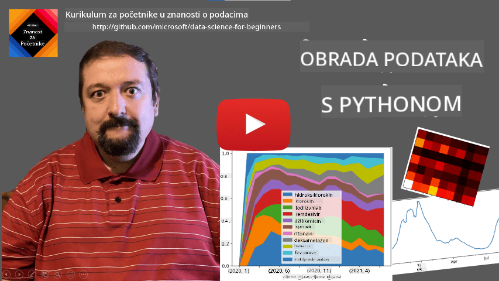
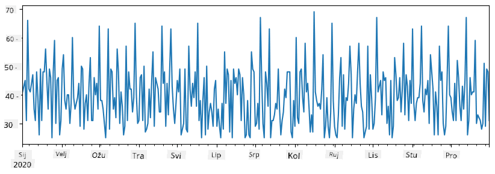
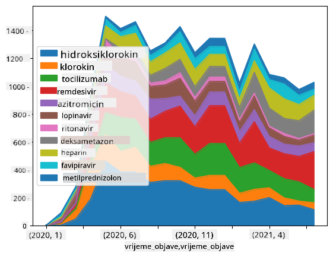

<!--
CO_OP_TRANSLATOR_METADATA:
{
  "original_hash": "7bfec050f4717dcc2dfd028aca9d21f3",
  "translation_date": "2025-09-06T16:01:59+00:00",
  "source_file": "2-Working-With-Data/07-python/README.md",
  "language_code": "hr"
}
-->
# Rad s Podacima: Python i Pandas Biblioteka

|  ](../../sketchnotes/07-WorkWithPython.png) |
| :-------------------------------------------------------------------------------------------------------: |
|                 Rad s Pythonom - _Sketchnote by [@nitya](https://twitter.com/nitya)_                      |

[](https://youtu.be/dZjWOGbsN4Y)

Iako baze podataka nude vrlo učinkovite načine za pohranu podataka i njihovo pretraživanje pomoću jezika upita, najfleksibilniji način obrade podataka je pisanje vlastitog programa za manipulaciju podacima. U mnogim slučajevima, upit u bazi podataka bio bi učinkovitiji način. Međutim, u nekim slučajevima kada je potrebna složenija obrada podataka, to se ne može lako postići pomoću SQL-a. 
Obrada podataka može se programirati u bilo kojem programskom jeziku, ali postoje određeni jezici koji su na višoj razini u radu s podacima. Data znanstvenici obično preferiraju jedan od sljedećih jezika:

* **[Python](https://www.python.org/)**, opći programski jezik, često se smatra jednim od najboljih izbora za početnike zbog svoje jednostavnosti. Python ima mnogo dodatnih biblioteka koje vam mogu pomoći u rješavanju mnogih praktičnih problema, poput izdvajanja podataka iz ZIP arhive ili pretvaranja slike u sivu skalu. Osim u data znanosti, Python se često koristi i za razvoj weba. 
* **[R](https://www.r-project.org/)** je tradicionalni alat razvijen s ciljem statističke obrade podataka. Također sadrži veliku zbirku biblioteka (CRAN), što ga čini dobrim izborom za obradu podataka. Međutim, R nije opći programski jezik i rijetko se koristi izvan područja data znanosti.
* **[Julia](https://julialang.org/)** je još jedan jezik razvijen posebno za data znanost. Namijenjen je pružanju bolje performanse od Pythona, što ga čini odličnim alatom za znanstvene eksperimente.

U ovoj lekciji fokusirat ćemo se na korištenje Pythona za jednostavnu obradu podataka. Pretpostavit ćemo osnovno poznavanje jezika. Ako želite dublje istražiti Python, možete se obratiti jednom od sljedećih izvora:

* [Naučite Python na zabavan način uz Turtle Graphics i Fraktale](https://github.com/shwars/pycourse) - GitHub tečaj za brzi uvod u Python programiranje
* [Napravite svoje prve korake s Pythonom](https://docs.microsoft.com/en-us/learn/paths/python-first-steps/?WT.mc_id=academic-77958-bethanycheum) Put učenja na [Microsoft Learn](http://learn.microsoft.com/?WT.mc_id=academic-77958-bethanycheum)

Podaci mogu dolaziti u mnogim oblicima. U ovoj lekciji razmotrit ćemo tri oblika podataka - **tablični podaci**, **tekst** i **slike**.

Fokusirat ćemo se na nekoliko primjera obrade podataka, umjesto da vam damo potpuni pregled svih povezanih biblioteka. To će vam omogućiti da steknete osnovnu ideju o tome što je moguće, i ostaviti vas s razumijevanjem gdje pronaći rješenja za svoje probleme kada vam zatrebaju.

> **Najkorisniji savjet**. Kada trebate izvršiti određenu operaciju na podacima, a ne znate kako to učiniti, pokušajte to potražiti na internetu. [Stackoverflow](https://stackoverflow.com/) obično sadrži mnogo korisnih uzoraka koda u Pythonu za mnoge tipične zadatke. 

## [Pre-lecture quiz](https://ff-quizzes.netlify.app/en/ds/quiz/12)

## Tablični Podaci i Dataframeovi

Već ste se susreli s tabličnim podacima kada smo govorili o relacijskim bazama podataka. Kada imate puno podataka, i oni su sadržani u mnogim različitim povezanim tablicama, definitivno ima smisla koristiti SQL za rad s njima. Međutim, postoje mnogi slučajevi kada imamo tablicu podataka i trebamo steći neko **razumijevanje** ili **uvid** u te podatke, poput distribucije, korelacije između vrijednosti itd. U data znanosti, postoji mnogo slučajeva kada trebamo izvršiti neke transformacije originalnih podataka, praćene vizualizacijom. Oba ta koraka mogu se lako izvršiti pomoću Pythona.

Postoje dvije najkorisnije biblioteke u Pythonu koje vam mogu pomoći u radu s tabličnim podacima:
* **[Pandas](https://pandas.pydata.org/)** omogućuje manipulaciju tzv. **Dataframeovima**, koji su analogni relacijskim tablicama. Možete imati imenovane stupce i izvršavati različite operacije na redovima, stupcima i dataframeovima općenito. 
* **[Numpy](https://numpy.org/)** je biblioteka za rad s **tensori**, tj. višedimenzionalnim **nizovima**. Niz ima vrijednosti istog osnovnog tipa i jednostavniji je od dataframea, ali nudi više matematičkih operacija i stvara manje opterećenje.

Postoji i nekoliko drugih biblioteka koje biste trebali znati:
* **[Matplotlib](https://matplotlib.org/)** je biblioteka koja se koristi za vizualizaciju podataka i crtanje grafova
* **[SciPy](https://www.scipy.org/)** je biblioteka s nekim dodatnim znanstvenim funkcijama. Već smo se susreli s ovom bibliotekom kada smo govorili o vjerojatnosti i statistici

Evo dijela koda koji biste obično koristili za uvoz tih biblioteka na početku svog Python programa:
```python
import numpy as np
import pandas as pd
import matplotlib.pyplot as plt
from scipy import ... # you need to specify exact sub-packages that you need
``` 

Pandas se temelji na nekoliko osnovnih koncepata.

### Series 

**Series** je niz vrijednosti, sličan listi ili numpy nizu. Glavna razlika je što series također ima **indeks**, i kada radimo s series (npr., zbrajamo ih), indeks se uzima u obzir. Indeks može biti jednostavan kao broj retka (to je indeks koji se koristi prema zadanim postavkama pri stvaranju series iz liste ili niza), ili može imati složenu strukturu, poput vremenskog intervala.

> **Napomena**: U pratećem notebooku [`notebook.ipynb`](notebook.ipynb) nalazi se uvodni kod za Pandas. Ovdje ćemo samo navesti neke primjere, a vi ste svakako dobrodošli provjeriti cijeli notebook.

Razmotrimo primjer: želimo analizirati prodaju našeg kioska za sladoled. Generirat ćemo niz brojeva prodaje (broj prodanih artikala svaki dan) za određeni vremenski period:

```python
start_date = "Jan 1, 2020"
end_date = "Mar 31, 2020"
idx = pd.date_range(start_date,end_date)
print(f"Length of index is {len(idx)}")
items_sold = pd.Series(np.random.randint(25,50,size=len(idx)),index=idx)
items_sold.plot()
```


Sada pretpostavimo da svaki tjedan organiziramo zabavu za prijatelje i uzimamo dodatnih 10 paketa sladoleda za zabavu. Možemo stvoriti drugi niz, indeksiran po tjednu, kako bismo to prikazali:
```python
additional_items = pd.Series(10,index=pd.date_range(start_date,end_date,freq="W"))
```
Kada zbrojimo dva niza, dobijemo ukupni broj:
```python
total_items = items_sold.add(additional_items,fill_value=0)
total_items.plot()
```


> **Napomena** da ne koristimo jednostavnu sintaksu `total_items+additional_items`. Da jesmo, dobili bismo puno `NaN` (*Not a Number*) vrijednosti u rezultirajućem nizu. To je zato što nedostaju vrijednosti za neke točke indeksa u nizu `additional_items`, a zbrajanje `NaN` s bilo čim rezultira `NaN`. Stoga trebamo specificirati parametar `fill_value` tijekom zbrajanja.

S vremenskim nizovima također možemo **ponovno uzorkovati** nizove s različitim vremenskim intervalima. Na primjer, pretpostavimo da želimo izračunati prosječni obujam prodaje mjesečno. Možemo koristiti sljedeći kod:
```python
monthly = total_items.resample("1M").mean()
ax = monthly.plot(kind='bar')
```


### DataFrame

DataFrame je u suštini zbirka series s istim indeksom. Možemo kombinirati nekoliko series zajedno u DataFrame:
```python
a = pd.Series(range(1,10))
b = pd.Series(["I","like","to","play","games","and","will","not","change"],index=range(0,9))
df = pd.DataFrame([a,b])
```
To će stvoriti horizontalnu tablicu poput ove:
|     | 0   | 1    | 2   | 3   | 4      | 5   | 6      | 7    | 8    |
| --- | --- | ---- | --- | --- | ------ | --- | ------ | ---- | ---- |
| 0   | 1   | 2    | 3   | 4   | 5      | 6   | 7      | 8    | 9    |
| 1   | I   | like | to  | use | Python | and | Pandas | very | much |

Također možemo koristiti Series kao stupce i specificirati nazive stupaca pomoću rječnika:
```python
df = pd.DataFrame({ 'A' : a, 'B' : b })
```
To će nam dati tablicu poput ove:

|     | A   | B      |
| --- | --- | ------ |
| 0   | 1   | I      |
| 1   | 2   | like   |
| 2   | 3   | to     |
| 3   | 4   | use    |
| 4   | 5   | Python |
| 5   | 6   | and    |
| 6   | 7   | Pandas |
| 7   | 8   | very   |
| 8   | 9   | much   |

**Napomena** da ovu tablicu možemo dobiti i transponiranjem prethodne tablice, npr. pisanjem 
```python
df = pd.DataFrame([a,b]).T..rename(columns={ 0 : 'A', 1 : 'B' })
```
Ovdje `.T` označava operaciju transponiranja DataFramea, tj. zamjenu redova i stupaca, a operacija `rename` omogućuje nam preimenovanje stupaca kako bi odgovarali prethodnom primjeru.

Evo nekoliko najvažnijih operacija koje možemo izvršiti na DataFrameovima:

**Odabir stupaca**. Možemo odabrati pojedinačne stupce pisanjem `df['A']` - ova operacija vraća Series. Također možemo odabrati podskup stupaca u drugi DataFrame pisanjem `df[['B','A']]` - ovo vraća drugi DataFrame.

**Filtriranje** samo određenih redova prema kriterijima. Na primjer, da ostavimo samo redove sa stupcem `A` većim od 5, možemo napisati `df[df['A']>5]`.

> **Napomena**: Način na koji filtriranje funkcionira je sljedeći. Izraz `df['A']<5` vraća boolean series, koji označava je li izraz `True` ili `False` za svaki element originalnog niza `df['A']`. Kada se boolean series koristi kao indeks, vraća podskup redova u DataFrameu. Stoga nije moguće koristiti proizvoljan Python boolean izraz, na primjer, pisanje `df[df['A']>5 and df['A']<7]` bilo bi pogrešno. Umjesto toga, trebali biste koristiti posebnu `&` operaciju na boolean series, pisanjem `df[(df['A']>5) & (df['A']<7)]` (*zagrade su ovdje važne*).

**Stvaranje novih izračunljivih stupaca**. Lako možemo stvoriti nove izračunljive stupce za naš DataFrame koristeći intuitivan izraz poput ovog:
```python
df['DivA'] = df['A']-df['A'].mean() 
``` 
Ovaj primjer izračunava odstupanje A od njegove srednje vrijednosti. Ono što se zapravo događa ovdje je da izračunavamo series, a zatim dodjeljujemo ovaj series lijevoj strani, stvarajući novi stupac. Stoga ne možemo koristiti operacije koje nisu kompatibilne sa series, na primjer, sljedeći kod je pogrešan:
```python
# Wrong code -> df['ADescr'] = "Low" if df['A'] < 5 else "Hi"
df['LenB'] = len(df['B']) # <- Wrong result
``` 
Posljednji primjer, iako sintaktički ispravan, daje nam pogrešan rezultat jer dodjeljuje duljinu series `B` svim vrijednostima u stupcu, a ne duljinu pojedinačnih elemenata kako smo namjeravali.

Ako trebamo izračunati složene izraze poput ovog, možemo koristiti funkciju `apply`. Posljednji primjer može se napisati na sljedeći način:
```python
df['LenB'] = df['B'].apply(lambda x : len(x))
# or 
df['LenB'] = df['B'].apply(len)
```

Nakon gore navedenih operacija, završit ćemo s sljedećim DataFrameom:

|     | A   | B      | DivA | LenB |
| --- | --- | ------ | ---- | ---- |
| 0   | 1   | I      | -4.0 | 1    |
| 1   | 2   | like   | -3.0 | 4    |
| 2   | 3   | to     | -2.0 | 2    |
| 3   | 4   | use    | -1.0 | 3    |
| 4   | 5   | Python | 0.0  | 6    |
| 5   | 6   | and    | 1.0  | 3    |
| 6   | 7   | Pandas | 2.0  | 6    |
| 7   | 8   | very   | 3.0  | 4    |
| 8   | 9   | much   | 4.0  | 4    |

**Odabir redova prema brojevima** može se izvršiti pomoću konstrukta `iloc`. Na primjer, za odabir prvih 5 redova iz DataFramea:
```python
df.iloc[:5]
```

**Grupiranje** se često koristi za dobivanje rezultata sličnih *pivot tablicama* u Excelu. Pretpostavimo da želimo izračunati srednju vrijednost stupca `A` za svaki dani broj `LenB`. Tada možemo grupirati naš DataFrame prema `LenB` i pozvati `mean`:
```python
df.groupby(by='LenB')[['A','DivA']].mean()
```
Ako trebamo izračunati srednju vrijednost i broj elemenata u grupi, tada možemo koristiti složeniju funkciju `aggregate`:
```python
df.groupby(by='LenB') \
 .aggregate({ 'DivA' : len, 'A' : lambda x: x.mean() }) \
 .rename(columns={ 'DivA' : 'Count', 'A' : 'Mean'})
```
To nam daje sljedeću tablicu:

| LenB | Count | Mean     |
| ---- | ----- | -------- |
| 1    | 1     | 1.000000 |
| 2    | 1     | 3.000000 |
| 3    | 2     | 5.000000 |
| 4    | 3     | 6.333333 |
| 6    | 2     | 6.000000 |

### Dobivanje Podataka
Vidjeli smo koliko je jednostavno konstruirati Series i DataFrames iz Python objekata. Međutim, podaci obično dolaze u obliku tekstualne datoteke ili Excel tablice. Srećom, Pandas nam nudi jednostavan način za učitavanje podataka s diska. Na primjer, čitanje CSV datoteke je jednostavno kao ovo:
```python
df = pd.read_csv('file.csv')
```
Vidjet ćemo više primjera učitavanja podataka, uključujući njihovo preuzimanje s vanjskih web stranica, u odjeljku "Izazov".

### Ispisivanje i Vizualizacija

Data Scientist često mora istraživati podatke, stoga je važno moći ih vizualizirati. Kada je DataFrame velik, često želimo samo provjeriti radimo li sve ispravno ispisivanjem prvih nekoliko redaka. To se može učiniti pozivanjem `df.head()`. Ako ga pokrećete iz Jupyter Notebooka, ispisat će DataFrame u lijepom tabličnom obliku.

Također smo vidjeli korištenje funkcije `plot` za vizualizaciju nekih stupaca. Iako je `plot` vrlo koristan za mnoge zadatke i podržava mnoge različite vrste grafova putem parametra `kind=`, uvijek možete koristiti osnovnu biblioteku `matplotlib` za crtanje nečeg složenijeg. Detaljno ćemo obraditi vizualizaciju podataka u zasebnim lekcijama tečaja.

Ovaj pregled pokriva najvažnije koncepte Pandasa, no biblioteka je vrlo bogata i nema ograničenja za ono što možete učiniti s njom! Sada primijenimo ovo znanje na rješavanje specifičnog problema.

## 🚀 Izazov 1: Analiza širenja COVID-a

Prvi problem na kojem ćemo se fokusirati je modeliranje širenja epidemije COVID-19. Kako bismo to učinili, koristit ćemo podatke o broju zaraženih osoba u različitim zemljama, koje pruža [Centar za sustavnu znanost i inženjering](https://systems.jhu.edu/) (CSSE) na [Sveučilištu Johns Hopkins](https://jhu.edu/). Skup podataka dostupan je u [ovom GitHub repozitoriju](https://github.com/CSSEGISandData/COVID-19).

Budući da želimo demonstrirati kako raditi s podacima, pozivamo vas da otvorite [`notebook-covidspread.ipynb`](notebook-covidspread.ipynb) i pročitate ga od početka do kraja. Također možete izvršavati ćelije i riješiti neke izazove koje smo ostavili na kraju.


> Ako ne znate kako pokrenuti kod u Jupyter Notebooku, pogledajte [ovaj članak](https://soshnikov.com/education/how-to-execute-notebooks-from-github/).

## Rad s nestrukturiranim podacima

Iako podaci vrlo često dolaze u tabličnom obliku, u nekim slučajevima moramo raditi s manje strukturiranim podacima, na primjer, tekstom ili slikama. U tom slučaju, kako bismo primijenili tehnike obrade podataka koje smo vidjeli gore, moramo nekako **izvući** strukturirane podatke. Evo nekoliko primjera:

* Izvlačenje ključnih riječi iz teksta i analiza učestalosti pojavljivanja tih ključnih riječi
* Korištenje neuronskih mreža za izvlačenje informacija o objektima na slici
* Dobivanje informacija o emocijama ljudi na video snimci

## 🚀 Izazov 2: Analiza COVID radova

U ovom izazovu nastavljamo s temom pandemije COVID-a i fokusiramo se na obradu znanstvenih radova o toj temi. Postoji [CORD-19 skup podataka](https://www.kaggle.com/allen-institute-for-ai/CORD-19-research-challenge) s više od 7000 (u vrijeme pisanja) radova o COVID-u, dostupnih s metapodacima i sažecima (a za otprilike polovicu njih dostupni su i puni tekstovi).

Potpuni primjer analize ovog skupa podataka koristeći [Text Analytics for Health](https://docs.microsoft.com/azure/cognitive-services/text-analytics/how-tos/text-analytics-for-health/?WT.mc_id=academic-77958-bethanycheum) kognitivnu uslugu opisan je [u ovom blog postu](https://soshnikov.com/science/analyzing-medical-papers-with-azure-and-text-analytics-for-health/). Raspravljat ćemo o pojednostavljenoj verziji ove analize.

> **NOTE**: Ne pružamo kopiju skupa podataka kao dio ovog repozitorija. Možda ćete prvo morati preuzeti datoteku [`metadata.csv`](https://www.kaggle.com/allen-institute-for-ai/CORD-19-research-challenge?select=metadata.csv) iz [ovog skupa podataka na Kaggleu](https://www.kaggle.com/allen-institute-for-ai/CORD-19-research-challenge). Može biti potrebna registracija na Kaggle. Skup podataka možete preuzeti i bez registracije [ovdje](https://ai2-semanticscholar-cord-19.s3-us-west-2.amazonaws.com/historical_releases.html), ali uključivat će sve pune tekstove uz datoteku metapodataka.

Otvorite [`notebook-papers.ipynb`](notebook-papers.ipynb) i pročitajte ga od početka do kraja. Također možete izvršavati ćelije i riješiti neke izazove koje smo ostavili na kraju.



## Obrada slikovnih podataka

Nedavno su razvijeni vrlo moćni AI modeli koji nam omogućuju razumijevanje slika. Postoji mnogo zadataka koji se mogu riješiti koristeći unaprijed trenirane neuronske mreže ili cloud usluge. Neki primjeri uključuju:

* **Klasifikacija slika**, koja vam može pomoći kategorizirati sliku u jednu od unaprijed definiranih klasa. Svoj vlastiti klasifikator slika možete lako trenirati koristeći usluge poput [Custom Vision](https://azure.microsoft.com/services/cognitive-services/custom-vision-service/?WT.mc_id=academic-77958-bethanycheum)
* **Detekcija objekata** za otkrivanje različitih objekata na slici. Usluge poput [computer vision](https://azure.microsoft.com/services/cognitive-services/computer-vision/?WT.mc_id=academic-77958-bethanycheum) mogu otkriti brojne uobičajene objekte, a možete trenirati [Custom Vision](https://azure.microsoft.com/services/cognitive-services/custom-vision-service/?WT.mc_id=academic-77958-bethanycheum) model za otkrivanje specifičnih objekata od interesa.
* **Detekcija lica**, uključujući dob, spol i emocije. To se može učiniti putem [Face API](https://azure.microsoft.com/services/cognitive-services/face/?WT.mc_id=academic-77958-bethanycheum).

Sve te cloud usluge mogu se pozivati koristeći [Python SDKs](https://docs.microsoft.com/samples/azure-samples/cognitive-services-python-sdk-samples/cognitive-services-python-sdk-samples/?WT.mc_id=academic-77958-bethanycheum), i stoga se lako mogu uključiti u vaš tijek istraživanja podataka.

Evo nekoliko primjera istraživanja podataka iz slikovnih izvora:
* U blog postu [Kako učiti Data Science bez kodiranja](https://soshnikov.com/azure/how-to-learn-data-science-without-coding/) istražujemo Instagram fotografije, pokušavajući razumjeti što ljude potiče da daju više lajkova na fotografiju. Prvo izvlačimo što je više moguće informacija iz slika koristeći [computer vision](https://azure.microsoft.com/services/cognitive-services/computer-vision/?WT.mc_id=academic-77958-bethanycheum), a zatim koristimo [Azure Machine Learning AutoML](https://docs.microsoft.com/azure/machine-learning/concept-automated-ml/?WT.mc_id=academic-77958-bethanycheum) za izradu interpretabilnog modela.
* U [Radionici o studijama lica](https://github.com/CloudAdvocacy/FaceStudies) koristimo [Face API](https://azure.microsoft.com/services/cognitive-services/face/?WT.mc_id=academic-77958-bethanycheum) za izvlačenje emocija ljudi na fotografijama s događaja, kako bismo pokušali razumjeti što ljude čini sretnima.

## Zaključak

Bez obzira imate li već strukturirane ili nestrukturirane podatke, koristeći Python možete obaviti sve korake vezane uz obradu i razumijevanje podataka. To je vjerojatno najfleksibilniji način obrade podataka, i upravo zato većina data scientista koristi Python kao svoj primarni alat. Učenje Pythona u dubinu vjerojatno je dobra ideja ako ste ozbiljni u svom putovanju kroz data science!

## [Kviz nakon predavanja](https://ff-quizzes.netlify.app/en/ds/quiz/13)

## Pregled i samostalno učenje

**Knjige**
* [Wes McKinney. Python for Data Analysis: Data Wrangling with Pandas, NumPy, and IPython](https://www.amazon.com/gp/product/1491957662)

**Online resursi**
* Službeni [10 minuta s Pandas](https://pandas.pydata.org/pandas-docs/stable/user_guide/10min.html) tutorial
* [Dokumentacija o Pandas vizualizaciji](https://pandas.pydata.org/pandas-docs/stable/user_guide/visualization.html)

**Učenje Pythona**
* [Naučite Python na zabavan način s Turtle Graphics i fraktalima](https://github.com/shwars/pycourse)
* [Napravite svoje prve korake s Pythonom](https://docs.microsoft.com/learn/paths/python-first-steps/?WT.mc_id=academic-77958-bethanycheum) Learning Path na [Microsoft Learn](http://learn.microsoft.com/?WT.mc_id=academic-77958-bethanycheum)

## Zadatak

[Provedite detaljniju studiju podataka za gore navedene izazove](assignment.md)

## Zasluge

Ovu lekciju napisao je s ♥️ [Dmitry Soshnikov](http://soshnikov.com)

---

**Odricanje od odgovornosti**:  
Ovaj dokument je preveden pomoću AI usluge za prevođenje [Co-op Translator](https://github.com/Azure/co-op-translator). Iako nastojimo osigurati točnost, imajte na umu da automatski prijevodi mogu sadržavati pogreške ili netočnosti. Izvorni dokument na izvornom jeziku treba smatrati mjerodavnim izvorom. Za ključne informacije preporučuje se profesionalni prijevod od strane stručnjaka. Ne preuzimamo odgovornost za bilo kakve nesporazume ili pogrešne interpretacije proizašle iz korištenja ovog prijevoda.