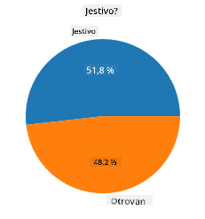
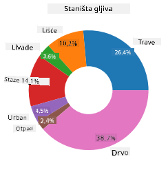
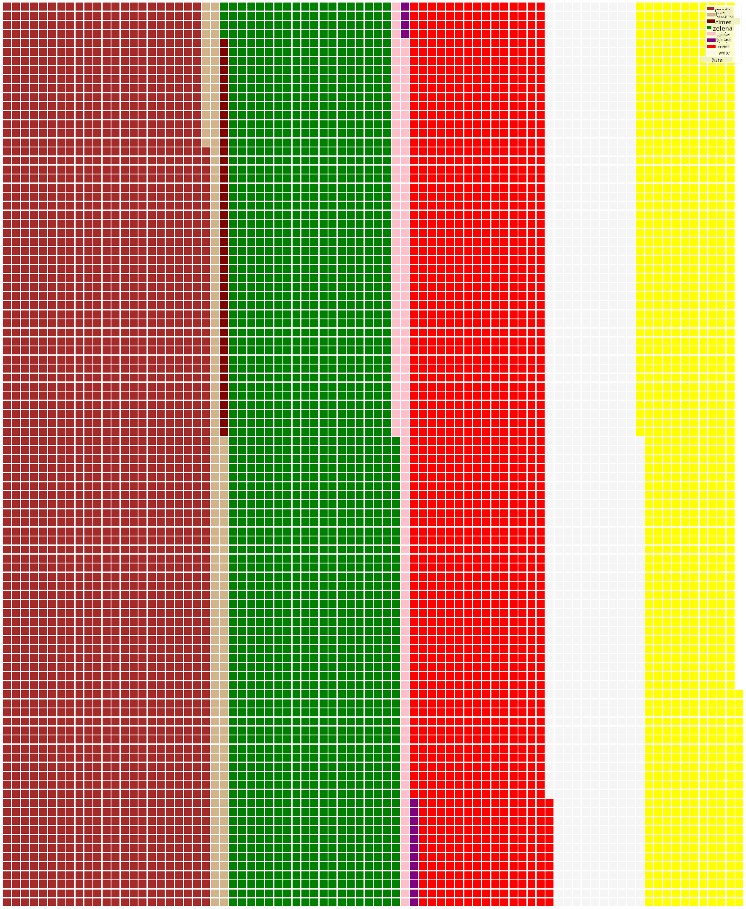

<!--
CO_OP_TRANSLATOR_METADATA:
{
  "original_hash": "af6a12015c6e250e500b570a9fa42593",
  "translation_date": "2025-08-30T18:57:57+00:00",
  "source_file": "3-Data-Visualization/11-visualization-proportions/README.md",
  "language_code": "hr"
}
-->
# Vizualizacija proporcija

| ](../../sketchnotes/11-Visualizing-Proportions.png)|
|:---:|
|Vizualizacija proporcija - _Sketchnote by [@nitya](https://twitter.com/nitya)_ |

U ovoj lekciji koristit ćete drugačiji dataset fokusiran na prirodu kako biste vizualizirali proporcije, poput broja različitih vrsta gljiva u datasetu o gljivama. Istražimo ove fascinantne gljive koristeći dataset preuzet od Audubona koji sadrži detalje o 23 vrste gljiva s listićima iz obitelji Agaricus i Lepiota. Eksperimentirat ćete s ukusnim vizualizacijama poput:

- Tortnih grafikona 🥧
- Grafičkih prikaza u obliku prstena 🍩
- Waffle grafikona 🧇

> 💡 Vrlo zanimljiv projekt pod nazivom [Charticulator](https://charticulator.com) od Microsoft Researcha nudi besplatno sučelje za vizualizaciju podataka putem povlačenja i ispuštanja. U jednom od njihovih tutorijala također koriste ovaj dataset o gljivama! Tako možete istraživati podatke i učiti o biblioteci istovremeno: [Charticulator tutorial](https://charticulator.com/tutorials/tutorial4.html).

## [Kviz prije predavanja](https://purple-hill-04aebfb03.1.azurestaticapps.net/quiz/20)

## Upoznajte svoje gljive 🍄

Gljive su vrlo zanimljive. Uvezimo dataset kako bismo ih proučili:

```python
import pandas as pd
import matplotlib.pyplot as plt
mushrooms = pd.read_csv('../../data/mushrooms.csv')
mushrooms.head()
```
Ispisuje se tablica s odličnim podacima za analizu:


| klasa     | oblik klobuka | površina klobuka | boja klobuka | modrice | miris    | pričvršćenje listića | razmak listića | veličina listića | boja listića | oblik stručka | korijen stručka | površina iznad prstena | površina ispod prstena | boja iznad prstena | boja ispod prstena | vrsta vela | boja vela | broj prstena | vrsta prstena | boja spora | populacija | stanište |
| --------- | ------------- | ---------------- | ------------ | ------- | -------- | -------------------- | --------------- | ---------------- | ------------ | ------------- | ---------------- | --------------------- | --------------------- | ----------------- | ----------------- | ---------- | --------- | ------------ | ------------ | ---------- | ---------- | ------- |
| Otrovna   | Konveksan     | Glatka           | Smeđa        | Modrice | Oštar    | Slobodan             | Blizu           | Uski             | Crna         | Širi se       | Jednaka          | Glatka                | Glatka                | Bijela            | Bijela            | Djelomičan | Bijela    | Jedan        | Viseći        | Crna       | Raspršena  | Urbano   |
| Jestiva    | Konveksan     | Glatka           | Žuta         | Modrice | Badem    | Slobodan             | Blizu           | Široki           | Crna         | Širi se       | Klub             | Glatka                | Glatka                | Bijela            | Bijela            | Djelomičan | Bijela    | Jedan        | Viseći        | Smeđa      | Brojna     | Trava    |
| Jestiva    | Zvono         | Glatka           | Bijela       | Modrice | Anis     | Slobodan             | Blizu           | Široki           | Smeđa        | Širi se       | Klub             | Glatka                | Glatka                | Bijela            | Bijela            | Djelomičan | Bijela    | Jedan        | Viseći        | Smeđa      | Brojna     | Livade   |
| Otrovna   | Konveksan     | Ljuskava         | Bijela       | Modrice | Oštar    | Slobodan             | Blizu           | Uski             | Smeđa        | Širi se       | Jednaka          | Glatka                | Glatka                | Bijela            | Bijela            | Djelomičan | Bijela    | Jedan        | Viseći        | Crna       | Raspršena  | Urbano   |

Odmah primjećujete da su svi podaci tekstualni. Morat ćete ih konvertirati kako biste ih mogli koristiti u grafikonu. Većina podataka, zapravo, predstavljena je kao objekt:

```python
print(mushrooms.select_dtypes(["object"]).columns)
```

Rezultat je:

```output
Index(['class', 'cap-shape', 'cap-surface', 'cap-color', 'bruises', 'odor',
       'gill-attachment', 'gill-spacing', 'gill-size', 'gill-color',
       'stalk-shape', 'stalk-root', 'stalk-surface-above-ring',
       'stalk-surface-below-ring', 'stalk-color-above-ring',
       'stalk-color-below-ring', 'veil-type', 'veil-color', 'ring-number',
       'ring-type', 'spore-print-color', 'population', 'habitat'],
      dtype='object')
```
Uzmite ove podatke i konvertirajte stupac 'klasa' u kategoriju:

```python
cols = mushrooms.select_dtypes(["object"]).columns
mushrooms[cols] = mushrooms[cols].astype('category')
```

```python
edibleclass=mushrooms.groupby(['class']).count()
edibleclass
```

Sada, ako ispišete podatke o gljivama, možete vidjeti da su grupirani u kategorije prema klasi jestivosti/otrovnosti:


|           | oblik klobuka | površina klobuka | boja klobuka | modrice | miris | pričvršćenje listića | razmak listića | veličina listića | boja listića | oblik stručka | ... | površina ispod prstena | boja iznad prstena | boja ispod prstena | vrsta vela | boja vela | broj prstena | vrsta prstena | boja spora | populacija | stanište |
| --------- | ------------- | ---------------- | ------------ | ------- | ----- | -------------------- | --------------- | ---------------- | ------------ | ------------- | --- | --------------------- | ----------------- | ----------------- | ---------- | --------- | ------------ | ------------ | ---------- | ---------- | ------- |
| klasa     |               |                  |              |         |       |                      |                 |                  |              |               |     |                       |                   |                   |            |           |              |              |            |            |         |
| Jestiva    | 4208          | 4208            | 4208         | 4208    | 4208  | 4208                | 4208            | 4208             | 4208         | 4208          | ... | 4208                 | 4208              | 4208              | 4208       | 4208      | 4208         | 4208         | 4208       | 4208       | 4208    |
| Otrovna   | 3916          | 3916            | 3916         | 3916    | 3916  | 3916                | 3916            | 3916             | 3916         | 3916          | ... | 3916                 | 3916              | 3916              | 3916       | 3916      | 3916         | 3916         | 3916       | 3916       | 3916    |

Ako slijedite redoslijed prikazan u ovoj tablici za kreiranje oznaka kategorija klase, možete izraditi tortni grafikon:

## Torta!

```python
labels=['Edible','Poisonous']
plt.pie(edibleclass['population'],labels=labels,autopct='%.1f %%')
plt.title('Edible?')
plt.show()
```
Voila, tortni grafikon koji prikazuje proporcije ovih podataka prema dvjema klasama gljiva. Vrlo je važno pravilno odrediti redoslijed oznaka, posebno ovdje, pa svakako provjerite redoslijed kojim je niz oznaka kreiran!



## Prstenovi!

Vizualno zanimljiviji tortni grafikon je grafikon u obliku prstena, koji je tortni grafikon s rupom u sredini. Pogledajmo naše podatke koristeći ovu metodu.

Pogledajte različita staništa u kojima gljive rastu:

```python
habitat=mushrooms.groupby(['habitat']).count()
habitat
```
Ovdje grupirate podatke prema staništu. Ima ih 7, pa ih koristite kao oznake za grafikon u obliku prstena:

```python
labels=['Grasses','Leaves','Meadows','Paths','Urban','Waste','Wood']

plt.pie(habitat['class'], labels=labels,
        autopct='%1.1f%%', pctdistance=0.85)
  
center_circle = plt.Circle((0, 0), 0.40, fc='white')
fig = plt.gcf()

fig.gca().add_artist(center_circle)
  
plt.title('Mushroom Habitats')
  
plt.show()
```



Ovaj kod crta grafikon i središnji krug, a zatim dodaje taj središnji krug u grafikon. Uredite širinu središnjeg kruga promjenom vrijednosti `0.40`.

Grafikoni u obliku prstena mogu se prilagoditi na nekoliko načina kako bi se promijenile oznake. Oznake se posebno mogu istaknuti radi bolje čitljivosti. Saznajte više u [dokumentaciji](https://matplotlib.org/stable/gallery/pie_and_polar_charts/pie_and_donut_labels.html?highlight=donut).

Sada kada znate kako grupirati podatke i prikazati ih kao tortu ili prsten, možete istražiti druge vrste grafikona. Isprobajte waffle grafikon, koji je samo drugačiji način istraživanja količine.
## Waffle!

Grafikon tipa 'waffle' je drugačiji način vizualizacije količina kao 2D niz kvadrata. Pokušajte vizualizirati različite količine boja klobuka gljiva u ovom datasetu. Za to trebate instalirati pomoćnu biblioteku pod nazivom [PyWaffle](https://pypi.org/project/pywaffle/) i koristiti Matplotlib:

```python
pip install pywaffle
```

Odaberite segment svojih podataka za grupiranje:

```python
capcolor=mushrooms.groupby(['cap-color']).count()
capcolor
```

Izradite waffle grafikon kreiranjem oznaka i zatim grupiranjem podataka:

```python
import pandas as pd
import matplotlib.pyplot as plt
from pywaffle import Waffle
  
data ={'color': ['brown', 'buff', 'cinnamon', 'green', 'pink', 'purple', 'red', 'white', 'yellow'],
    'amount': capcolor['class']
     }
  
df = pd.DataFrame(data)
  
fig = plt.figure(
    FigureClass = Waffle,
    rows = 100,
    values = df.amount,
    labels = list(df.color),
    figsize = (30,30),
    colors=["brown", "tan", "maroon", "green", "pink", "purple", "red", "whitesmoke", "yellow"],
)
```

Koristeći waffle grafikon, jasno možete vidjeti proporcije boja klobuka u ovom datasetu gljiva. Zanimljivo je da postoji mnogo gljiva sa zelenim klobukom!



✅ Pywaffle podržava ikone unutar grafikona koje koriste bilo koju ikonu dostupnu u [Font Awesome](https://fontawesome.com/). Eksperimentirajte kako biste kreirali još zanimljiviji waffle grafikon koristeći ikone umjesto kvadrata.

U ovoj lekciji naučili ste tri načina za vizualizaciju proporcija. Prvo, trebate grupirati svoje podatke u kategorije, a zatim odlučiti koji je najbolji način za prikaz podataka - torta, prsten ili waffle. Svi su ukusni i korisniku pružaju trenutni pregled dataset-a.

## 🚀 Izazov

Pokušajte ponovno kreirati ove ukusne grafikone u [Charticulator](https://charticulator.com).
## [Kviz nakon predavanja](https://purple-hill-04aebfb03.1.azurestaticapps.net/quiz/21)

## Pregled i samostalno učenje

Ponekad nije očito kada koristiti tortni, prstenasti ili waffle grafikon. Evo nekoliko članaka za čitanje na ovu temu:

https://www.beautiful.ai/blog/battle-of-the-charts-pie-chart-vs-donut-chart

https://medium.com/@hypsypops/pie-chart-vs-donut-chart-showdown-in-the-ring-5d24fd86a9ce

https://www.mit.edu/~mbarker/formula1/f1help/11-ch-c6.htm

https://medium.datadriveninvestor.com/data-visualization-done-the-right-way-with-tableau-waffle-chart-fdf2a19be402

Istražite kako biste pronašli više informacija o ovoj odluci.

## Zadatak

[Pokušajte u Excelu](assignment.md)

---

**Odricanje od odgovornosti**:  
Ovaj dokument je preveden pomoću AI usluge za prevođenje [Co-op Translator](https://github.com/Azure/co-op-translator). Iako nastojimo osigurati točnost, imajte na umu da automatski prijevodi mogu sadržavati pogreške ili netočnosti. Izvorni dokument na izvornom jeziku treba smatrati autoritativnim izvorom. Za ključne informacije preporučuje se profesionalni prijevod od strane čovjeka. Ne preuzimamo odgovornost za bilo kakva nesporazuma ili pogrešna tumačenja koja proizlaze iz korištenja ovog prijevoda.