<!--
CO_OP_TRANSLATOR_METADATA:
{
  "original_hash": "14b2a7f1c63202920bd98eeb913f5614",
  "translation_date": "2025-08-30T17:39:14+00:00",
  "source_file": "5-Data-Science-In-Cloud/18-Low-Code/README.md",
  "language_code": "hr"
}
-->
# Data Science u oblaku: "Low code/No code" pristup

| ](../../sketchnotes/18-DataScience-Cloud.png)|
|:---:|
| Data Science u oblaku: Low Code - _Sketchnote by [@nitya](https://twitter.com/nitya)_ |

Sadržaj:

- [Data Science u oblaku: "Low code/No code" pristup](../../../../5-Data-Science-In-Cloud/18-Low-Code)
  - [Kviz prije predavanja](../../../../5-Data-Science-In-Cloud/18-Low-Code)
  - [1. Uvod](../../../../5-Data-Science-In-Cloud/18-Low-Code)
    - [1.1 Što je Azure Machine Learning?](../../../../5-Data-Science-In-Cloud/18-Low-Code)
    - [1.2 Projekt predviđanja zatajenja srca:](../../../../5-Data-Science-In-Cloud/18-Low-Code)
    - [1.3 Skup podataka o zatajenju srca:](../../../../5-Data-Science-In-Cloud/18-Low-Code)
  - [2. Low code/No code treniranje modela u Azure ML Studio](../../../../5-Data-Science-In-Cloud/18-Low-Code)
    - [2.1 Kreiranje Azure ML radnog prostora](../../../../5-Data-Science-In-Cloud/18-Low-Code)
    - [2.2 Računalni resursi](../../../../5-Data-Science-In-Cloud/18-Low-Code)
      - [2.2.1 Odabir pravih opcija za računalne resurse](../../../../5-Data-Science-In-Cloud/18-Low-Code)
      - [2.2.2 Kreiranje računalnog klastera](../../../../5-Data-Science-In-Cloud/18-Low-Code)
    - [2.3 Učitavanje skupa podataka](../../../../5-Data-Science-In-Cloud/18-Low-Code)
    - [2.4 Low code/No code treniranje s AutoML](../../../../5-Data-Science-In-Cloud/18-Low-Code)
  - [3. Low code/No code implementacija modela i korištenje krajnje točke](../../../../5-Data-Science-In-Cloud/18-Low-Code)
    - [3.1 Implementacija modela](../../../../5-Data-Science-In-Cloud/18-Low-Code)
    - [3.2 Korištenje krajnje točke](../../../../5-Data-Science-In-Cloud/18-Low-Code)
  - [🚀 Izazov](../../../../5-Data-Science-In-Cloud/18-Low-Code)
  - [Kviz nakon predavanja](../../../../5-Data-Science-In-Cloud/18-Low-Code)
  - [Pregled i samostalno učenje](../../../../5-Data-Science-In-Cloud/18-Low-Code)
  - [Zadatak](../../../../5-Data-Science-In-Cloud/18-Low-Code)

## [Kviz prije predavanja](https://purple-hill-04aebfb03.1.azurestaticapps.net/quiz/34)

## 1. Uvod

### 1.1 Što je Azure Machine Learning?

Azure cloud platforma obuhvaća više od 200 proizvoda i usluga u oblaku osmišljenih kako bi vam pomogli u stvaranju novih rješenja. Data znanstvenici ulažu puno truda u istraživanje i predobradu podataka te isprobavanje različitih algoritama za treniranje modela kako bi proizveli točne modele. Ovi zadaci su vremenski zahtjevni i često neefikasno koriste skupe računalne resurse.

[Azure ML](https://docs.microsoft.com/azure/machine-learning/overview-what-is-azure-machine-learning?WT.mc_id=academic-77958-bethanycheum&ocid=AID3041109) je platforma u oblaku za izgradnju i upravljanje rješenjima strojnog učenja u Azureu. Pruža širok raspon značajki koje pomažu data znanstvenicima u pripremi podataka, treniranju modela, objavljivanju prediktivnih usluga i praćenju njihove upotrebe. Najvažnije, povećava njihovu učinkovitost automatizacijom mnogih vremenski zahtjevnih zadataka povezanih s treniranjem modela te omogućuje korištenje računalnih resursa u oblaku koji se učinkovito skaliraju za obradu velikih količina podataka, uz troškove samo kada se resursi koriste.

Azure ML nudi sve alate potrebne za radne procese strojnog učenja, uključujući:

- **Azure Machine Learning Studio**: web portal za opcije s malo ili bez koda za treniranje modela, implementaciju, automatizaciju, praćenje i upravljanje resursima. Studio se integrira s Azure Machine Learning SDK-om za besprijekorno iskustvo.
- **Jupyter Notebooks**: brzo prototipiranje i testiranje ML modela.
- **Azure Machine Learning Designer**: omogućuje povlačenje i ispuštanje modula za izgradnju eksperimenata i implementaciju cjevovoda u okruženju s malo koda.
- **Automatizirano sučelje za strojno učenje (AutoML)**: automatizira iterativne zadatke razvoja ML modela, omogućujući izgradnju modela s visokom skalabilnošću, učinkovitošću i produktivnošću, uz održavanje kvalitete modela.
- **Označavanje podataka**: alat za asistirano ML označavanje podataka.
- **Proširenje za Visual Studio Code**: pruža potpuno opremljeno razvojno okruženje za izgradnju i upravljanje ML projektima.
- **CLI za strojno učenje**: omogućuje upravljanje Azure ML resursima putem naredbenog retka.
- **Integracija s open-source okvirima** poput PyTorch, TensorFlow, Scikit-learn i mnogih drugih za treniranje, implementaciju i upravljanje procesom strojnog učenja.
- **MLflow**: otvorena biblioteka za upravljanje životnim ciklusom eksperimenata strojnog učenja. **MLFlow Tracking** je komponenta MLflow-a koja bilježi i prati metrike i artefakte vaših treninga, bez obzira na okruženje eksperimenta.

### 1.2 Projekt predviđanja zatajenja srca:

Nema sumnje da je izrada projekata najbolji način za testiranje vaših vještina i znanja. U ovoj lekciji istražit ćemo dva različita načina izrade projekta za predviđanje zatajenja srca u Azure ML Studio, koristeći Low code/No code pristup i Azure ML SDK, kako je prikazano u sljedećem dijagramu:


Svaki pristup ima svoje prednosti i nedostatke. Low code/No code pristup je lakši za početak jer uključuje rad s grafičkim korisničkim sučeljem (GUI), bez potrebe za prethodnim znanjem programiranja. Ova metoda omogućuje brzo testiranje izvedivosti projekta i izradu POC-a (Proof Of Concept). Međutim, kako projekt raste i postaje spreman za produkciju, nije praktično stvarati resurse putem GUI-ja. Potrebno je programatski automatizirati sve, od stvaranja resursa do implementacije modela. Tu postaje ključno znanje o korištenju Azure ML SDK-a.

|                   | Low code/No code | Azure ML SDK              |
|-------------------|------------------|---------------------------|
| Znanje programiranja | Nije potrebno   | Potrebno                  |
| Vrijeme razvoja   | Brzo i jednostavno | Ovisi o znanju programiranja |
| Spremnost za produkciju | Ne               | Da                        |

### 1.3 Skup podataka o zatajenju srca:

Kardiovaskularne bolesti (CVD) su vodeći uzrok smrti u svijetu, odgovorne za 31% svih smrti. Čimbenici rizika poput pušenja, nezdrave prehrane, pretilosti, tjelesne neaktivnosti i štetne upotrebe alkohola mogu se koristiti kao značajke za modele procjene. Mogućnost procjene vjerojatnosti razvoja CVD-a mogla bi biti od velike koristi za prevenciju napada kod osoba s visokim rizikom.

Kaggle je učinio dostupnim [skup podataka o zatajenju srca](https://www.kaggle.com/andrewmvd/heart-failure-clinical-data), koji ćemo koristiti za ovaj projekt. Možete ga preuzeti sada. Ovo je tablični skup podataka s 13 stupaca (12 značajki i 1 ciljana varijabla) i 299 redaka.

|    | Naziv varijable          | Tip            | Opis                                                   | Primjer           |
|----|--------------------------|----------------|-------------------------------------------------------|-------------------|
| 1  | age                      | numerički      | dob pacijenta                                         | 25                |
| 2  | anaemia                  | logički        | Smanjenje crvenih krvnih stanica ili hemoglobina      | 0 ili 1           |
| 3  | creatinine_phosphokinase | numerički      | Razina CPK enzima u krvi                              | 542               |
| 4  | diabetes                 | logički        | Ima li pacijent dijabetes                             | 0 ili 1           |
| 5  | ejection_fraction        | numerički      | Postotak krvi koji izlazi iz srca pri svakoj kontrakciji | 45                |
| 6  | high_blood_pressure      | logički        | Ima li pacijent hipertenziju                          | 0 ili 1           |
| 7  | platelets                | numerički      | Trombociti u krvi                                     | 149000            |
| 8  | serum_creatinine         | numerički      | Razina serumskog kreatinina u krvi                    | 0.5               |
| 9  | serum_sodium             | numerički      | Razina serumskog natrija u krvi                       | jun               |
| 10 | sex                      | logički        | žena ili muškarac                                     | 0 ili 1           |
| 11 | smoking                  | logički        | Puši li pacijent                                      | 0 ili 1           |
| 12 | time                     | numerički      | razdoblje praćenja (dani)                             | 4                 |
|----|--------------------------|----------------|-------------------------------------------------------|-------------------|
| 21 | DEATH_EVENT [Cilj]       | logički        | Umire li pacijent tijekom razdoblja praćenja          | 0 ili 1           |

Nakon što preuzmete skup podataka, možemo započeti projekt u Azureu.

## 2. Low code/No code treniranje modela u Azure ML Studio

### 2.1 Kreiranje Azure ML radnog prostora

Za treniranje modela u Azure ML prvo trebate kreirati Azure ML radni prostor. Radni prostor je resurs najviše razine za Azure Machine Learning, koji pruža centralizirano mjesto za rad sa svim artefaktima koje kreirate koristeći Azure Machine Learning. Radni prostor čuva povijest svih treninga, uključujući logove, metrike, izlaze i snimke vaših skripti. Ove informacije koristite za određivanje koji trening daje najbolji model. [Saznajte više](https://docs.microsoft.com/azure/machine-learning/concept-workspace?WT.mc_id=academic-77958-bethanycheum&ocid=AID3041109)

Preporučuje se korištenje najnovije verzije preglednika kompatibilnog s vašim operativnim sustavom. Podržani preglednici su:

- Microsoft Edge (Nova verzija Microsoft Edgea, ne Microsoft Edge legacy)
- Safari (najnovija verzija, samo za Mac)
- Chrome (najnovija verzija)
- Firefox (najnovija verzija)

Za korištenje Azure Machine Learninga, kreirajte radni prostor u svojoj Azure pretplati. Ovaj radni prostor možete koristiti za upravljanje podacima, računalnim resursima, kodom, modelima i drugim artefaktima povezanim s vašim radnim procesima strojnog učenja.

> **_NAPOMENA:_** Vaša Azure pretplata će biti naplaćena za pohranu podataka dokle god Azure Machine Learning radni prostor postoji u vašoj pretplati, stoga preporučujemo da izbrišete radni prostor kada ga više ne koristite.

1. Prijavite se na [Azure portal](https://ms.portal.azure.com/) koristeći Microsoft vjerodajnice povezane s vašom Azure pretplatom.
2. Odaberite **＋Create a resource**
   
   

   Potražite Machine Learning i odaberite pločicu Machine Learning

   

   Kliknite na gumb za kreiranje

   

   Ispunite postavke na sljedeći način:
   - Pretplata: Vaša Azure pretplata
   - Grupa resursa: Kreirajte ili odaberite grupu resursa
   - Naziv radnog prostora: Unesite jedinstveni naziv za svoj radni prostor
   - Regija: Odaberite geografsku regiju najbližu vama
   - Račun za pohranu: Zabilježite zadani novi račun za pohranu koji će biti kreiran za vaš radni prostor
   - Key vault: Zabilježite zadani novi key vault koji će biti kreiran za vaš radni prostor
   - Application insights: Zabilježite zadani novi resurs za application insights koji će biti kreiran za vaš radni prostor
   - Registry za kontejnere: Nijedan (jedan će biti automatski kreiran prvi put kada implementirate model u kontejner)

    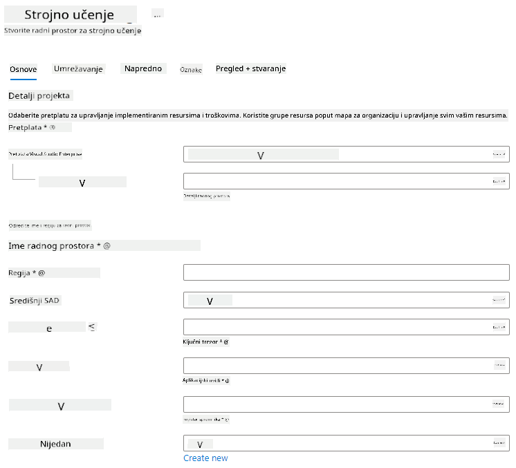

   - Kliknite na gumb za pregled i kreiranje, a zatim na gumb za kreiranje
3. Pričekajte da se vaš radni prostor kreira (ovo može potrajati nekoliko minuta). Zatim ga otvorite u portalu. Možete ga pronaći putem Azure Machine Learning usluge.
4. Na stranici Pregled za vaš radni prostor, pokrenite Azure Machine Learning studio (ili otvorite novi preglednik i idite na https://ml.azure.com), te se prijavite u Azure Machine Learning studio koristeći svoj Microsoft račun. Ako se to od vas zatraži, odaberite svoj Azure direktorij i pretplatu te svoj Azure Machine Learning radni prostor.
   


5. U Azure Machine Learning studiju, prebacite ☰ ikonu u gornjem lijevom kutu kako biste vidjeli različite stranice u sučelju. Ove stranice možete koristiti za upravljanje resursima u svom radnom prostoru.

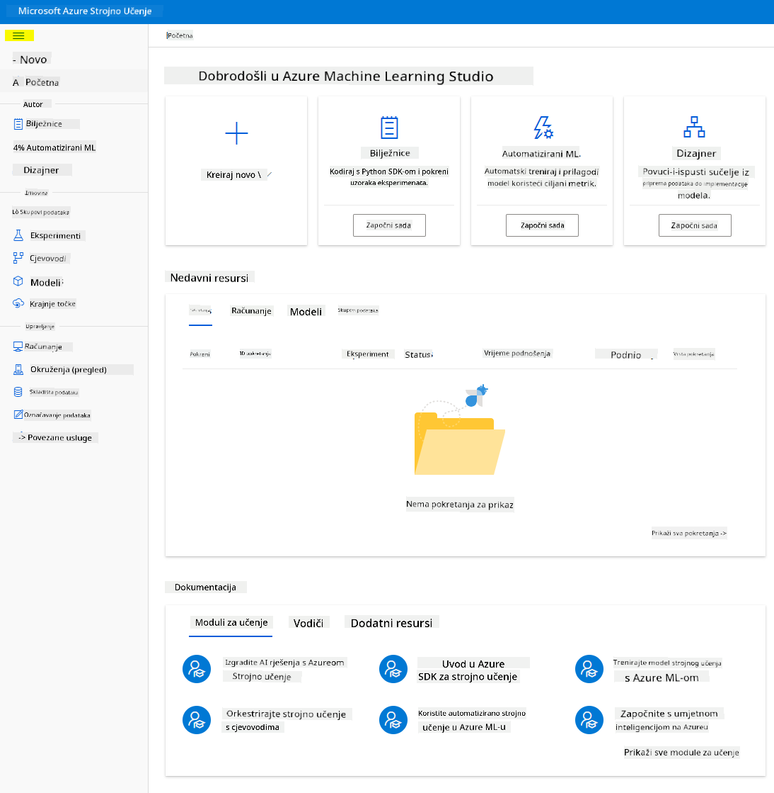

Možete upravljati svojim radnim prostorom koristeći Azure portal, ali za data znanstvenike i inženjere strojnog učenja, Azure Machine Learning Studio pruža fokusiranije korisničko sučelje za upravljanje resursima radnog prostora.

### 2.2 Računalni resursi

Računalni resursi su resursi u oblaku na kojima možete pokretati procese treniranja modela i istraživanja podataka. Postoje četiri vrste računalnih resursa koje možete kreirati:

- **Računalni instance**: Razvojne radne stanice koje data znanstvenici mogu koristiti za rad s podacima i modelima. Ovo uključuje kreiranje virtualnog stroja (VM) i pokretanje instance bilježnice. Zatim možete trenirati model pozivanjem računalnog klastera iz bilježnice.
- **Računalni klasteri**: Skalabilni klasteri VM-ova za obradu eksperimentalnog koda na zahtjev. Trebat ćete ih za treniranje modela. Računalni klasteri također mogu koristiti specijalizirane GPU ili CPU resurse.
- **Klasteri za inferenciju**: Ciljevi za implementaciju prediktivnih usluga koje koriste vaše trenirane modele.
- **Povezani resursi za računanje**: Povezuje s postojećim Azure resursima za računanje, poput virtualnih strojeva ili Azure Databricks klastera.

#### 2.2.1 Odabir pravih opcija za vaše resurse za računanje

Neki ključni faktori koje treba uzeti u obzir prilikom stvaranja resursa za računanje mogu biti kritične odluke.

**Trebate li CPU ili GPU?**

CPU (Central Processing Unit) je elektronički sklop koji izvršava upute koje čine računalni program. GPU (Graphics Processing Unit) je specijalizirani elektronički sklop koji može izvoditi grafički povezani kod vrlo velikom brzinom.

Glavna razlika između arhitekture CPU-a i GPU-a je u tome što je CPU dizajniran za brzo obavljanje širokog spektra zadataka (mjereno brzinom takta CPU-a), ali je ograničen u paralelnosti zadataka koji se mogu izvoditi. GPU-ovi su dizajnirani za paralelno računanje i stoga su mnogo bolji za zadatke dubokog učenja.

| CPU                                     | GPU                         |
|-----------------------------------------|-----------------------------|
| Manje skup                             | Skuplji                    |
| Niža razina paralelnosti               | Viša razina paralelnosti   |
| Sporiji u treniranju modela dubokog učenja | Optimalan za duboko učenje |

**Veličina klastera**

Veći klasteri su skuplji, ali će rezultirati boljom responzivnošću. Stoga, ako imate vremena, ali ne i dovoljno novca, trebali biste početi s manjim klasterom. Suprotno tome, ako imate novca, ali ne i puno vremena, trebali biste početi s većim klasterom.

**Veličina VM-a**

Ovisno o vašim vremenskim i proračunskim ograničenjima, možete varirati veličinu RAM-a, diska, broj jezgri i brzinu takta. Povećanje svih tih parametara bit će skuplje, ali će rezultirati boljim performansama.

**Namjenske ili niskoprioritetne instance?**

Niskoprioritetna instanca znači da je prekinjiva: u osnovi, Microsoft Azure može uzeti te resurse i dodijeliti ih drugom zadatku, čime prekida posao. Namjenska instanca, ili neprekinjiva, znači da posao nikada neće biti prekinut bez vašeg dopuštenja. Ovo je još jedno razmatranje vremena naspram novca, budući da su prekinjive instance jeftinije od namjenskih.

#### 2.2.2 Stvaranje klastera za računanje

U [Azure ML radnom prostoru](https://ml.azure.com/) koji smo ranije stvorili, idite na "Compute" i moći ćete vidjeti različite resurse za računanje o kojima smo upravo razgovarali (npr. instance za računanje, klasteri za računanje, klasteri za inferenciju i povezani resursi za računanje). Za ovaj projekt, trebat će nam klaster za računanje za treniranje modela. U Studiju kliknite na izbornik "Compute", zatim na karticu "Compute cluster" i kliknite na gumb "+ New" za stvaranje klastera za računanje.


1. Odaberite svoje opcije: Namjensko naspram niskog prioriteta, CPU ili GPU, veličina VM-a i broj jezgri (možete zadržati zadane postavke za ovaj projekt).
2. Kliknite na gumb "Next".

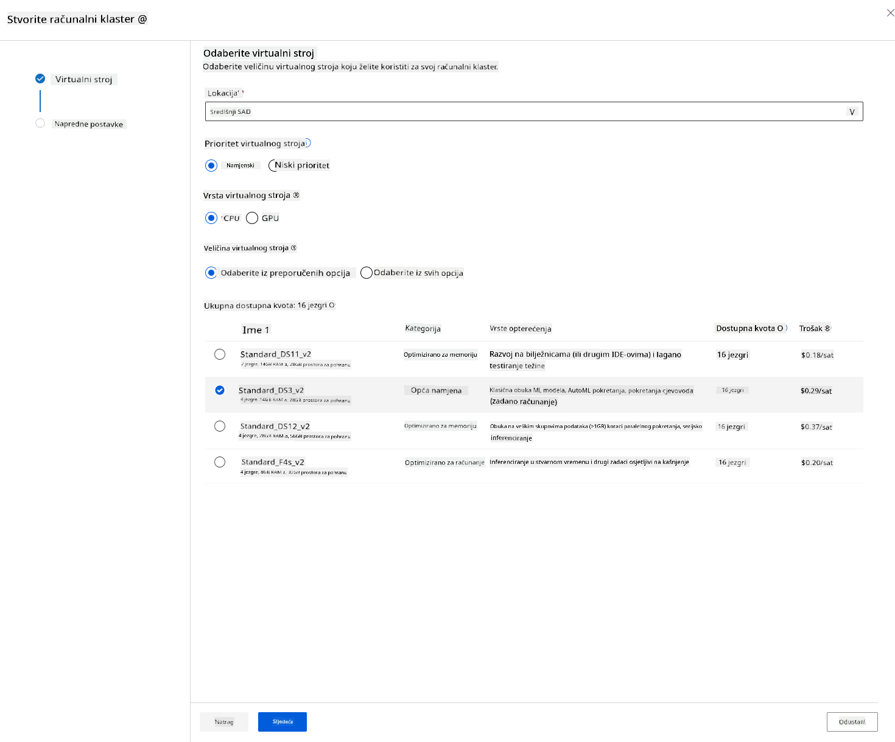

3. Dajte klasteru ime za računanje.
4. Odaberite svoje opcije: Minimalni/maksimalni broj čvorova, sekunde neaktivnosti prije smanjenja, SSH pristup. Imajte na umu da ako je minimalni broj čvorova 0, uštedjet ćete novac kada je klaster neaktivan. Imajte na umu da što je veći broj maksimalnih čvorova, to će treniranje biti kraće. Preporučeni maksimalni broj čvorova je 3.  
5. Kliknite na gumb "Create". Ovaj korak može potrajati nekoliko minuta.

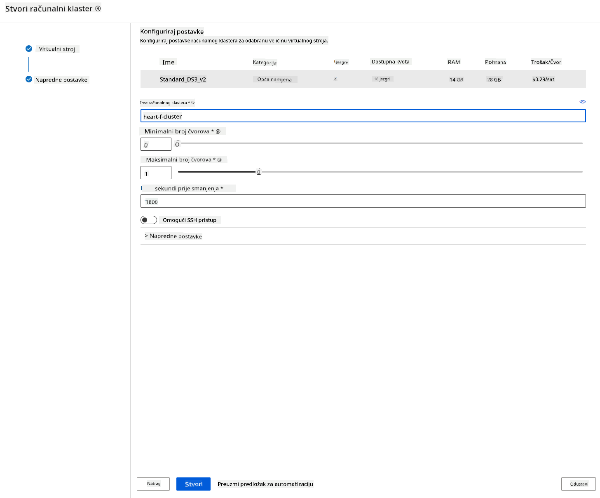

Odlično! Sada kada imamo klaster za računanje, trebamo učitati podatke u Azure ML Studio.

### 2.3 Učitavanje skupa podataka

1. U [Azure ML radnom prostoru](https://ml.azure.com/) koji smo ranije stvorili, kliknite na "Datasets" u lijevom izborniku i kliknite na gumb "+ Create dataset" za stvaranje skupa podataka. Odaberite opciju "From local files" i odaberite Kaggle skup podataka koji smo ranije preuzeli.
   
   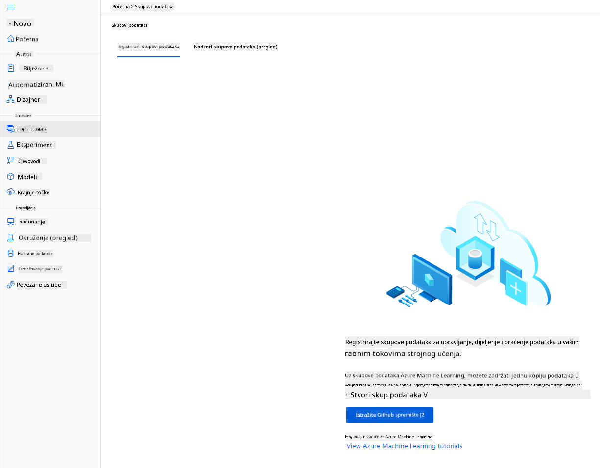

2. Dajte svom skupu podataka ime, vrstu i opis. Kliknite "Next". Učitajte podatke iz datoteka. Kliknite "Next".
   
   

3. U shemi promijenite vrstu podataka u Boolean za sljedeće značajke: anaemia, diabetes, high blood pressure, sex, smoking i DEATH_EVENT. Kliknite "Next" i zatim "Create".
   
   

Odlično! Sada kada je skup podataka na mjestu i klaster za računanje je stvoren, možemo započeti treniranje modela!

### 2.4 Treniranje s malo ili bez koda pomoću AutoML-a

Tradicionalni razvoj modela strojnog učenja zahtijeva puno resursa, značajno domenno znanje i vrijeme za proizvodnju i usporedbu desetaka modela. Automatizirano strojno učenje (AutoML) proces je automatizacije vremenski zahtjevnih, iterativnih zadataka razvoja modela strojnog učenja. Omogućuje znanstvenicima podataka, analitičarima i programerima izradu ML modela s velikom skalabilnošću, učinkovitošću i produktivnošću, uz održavanje kvalitete modela. Smanjuje vrijeme potrebno za dobivanje modela spremnih za proizvodnju, uz veliku lakoću i učinkovitost. [Saznajte više](https://docs.microsoft.com/azure/machine-learning/concept-automated-ml?WT.mc_id=academic-77958-bethanycheum&ocid=AID3041109)

1. U [Azure ML radnom prostoru](https://ml.azure.com/) koji smo ranije stvorili kliknite na "Automated ML" u lijevom izborniku i odaberite skup podataka koji ste upravo učitali. Kliknite "Next".

   

2. Unesite novo ime eksperimenta, ciljni stupac (DEATH_EVENT) i klaster za računanje koji smo stvorili. Kliknite "Next".
   
   

3. Odaberite "Classification" i kliknite "Finish". Ovaj korak može trajati između 30 minuta i 1 sat, ovisno o veličini vašeg klastera za računanje.
    
    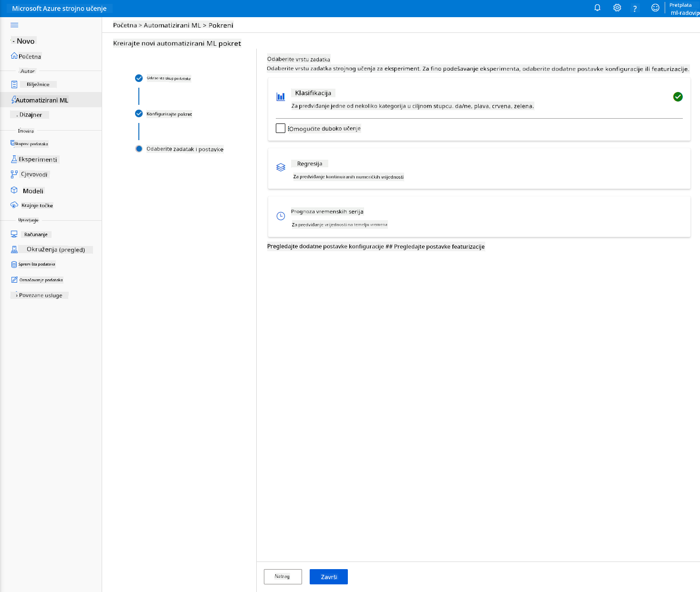

4. Kada je pokretanje završeno, kliknite na karticu "Automated ML", kliknite na svoje pokretanje i kliknite na algoritam u kartici "Best model summary".
    
    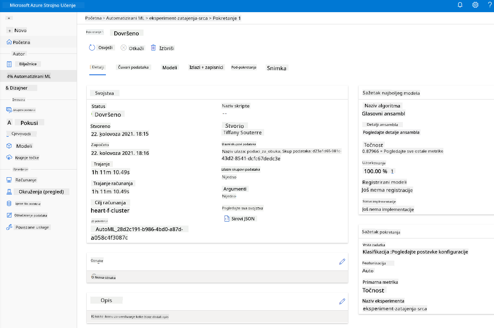

Ovdje možete vidjeti detaljan opis najboljeg modela koji je AutoML generirao. Također možete istražiti druge modele generirane u kartici "Models". Odvojite nekoliko minuta za istraživanje modela u kartici "Explanations (preview)". Kada odaberete model koji želite koristiti (ovdje ćemo odabrati najbolji model koji je odabrao AutoML), vidjet ćemo kako ga možemo implementirati.

## 3. Implementacija modela s malo ili bez koda i konzumacija krajnje točke
### 3.1 Implementacija modela

Automatizirano sučelje za strojno učenje omogućuje vam implementaciju najboljeg modela kao web usluge u nekoliko koraka. Implementacija je integracija modela kako bi mogao davati predviđanja na temelju novih podataka i identificirati potencijalna područja prilika. Za ovaj projekt, implementacija u web uslugu znači da će medicinske aplikacije moći koristiti model za davanje predviđanja uživo o riziku pacijenata od srčanog udara.

U opisu najboljeg modela kliknite na gumb "Deploy".
    
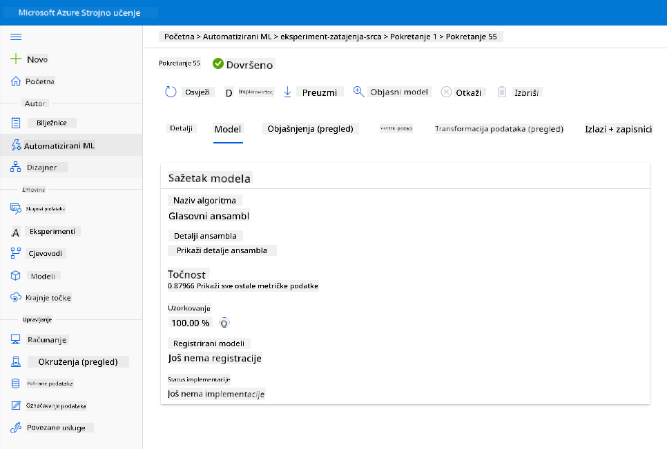

15. Dajte mu ime, opis, vrstu računanja (Azure Container Instance), omogućite autentifikaciju i kliknite na "Deploy". Ovaj korak može trajati oko 20 minuta. Proces implementacije uključuje nekoliko koraka, uključujući registraciju modela, generiranje resursa i njihovu konfiguraciju za web uslugu. Statusna poruka pojavljuje se pod "Deploy status". Povremeno odaberite "Refresh" kako biste provjerili status implementacije. Implementirano je i radi kada je status "Healthy".

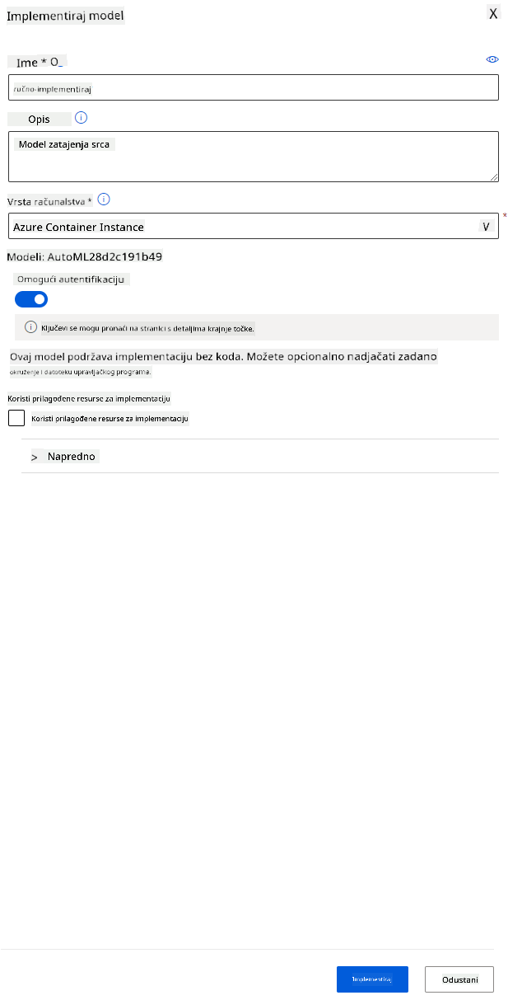

16. Kada je implementacija završena, kliknite na karticu "Endpoint" i kliknite na krajnju točku koju ste upravo implementirali. Ovdje možete pronaći sve detalje koje trebate znati o krajnjoj točki.

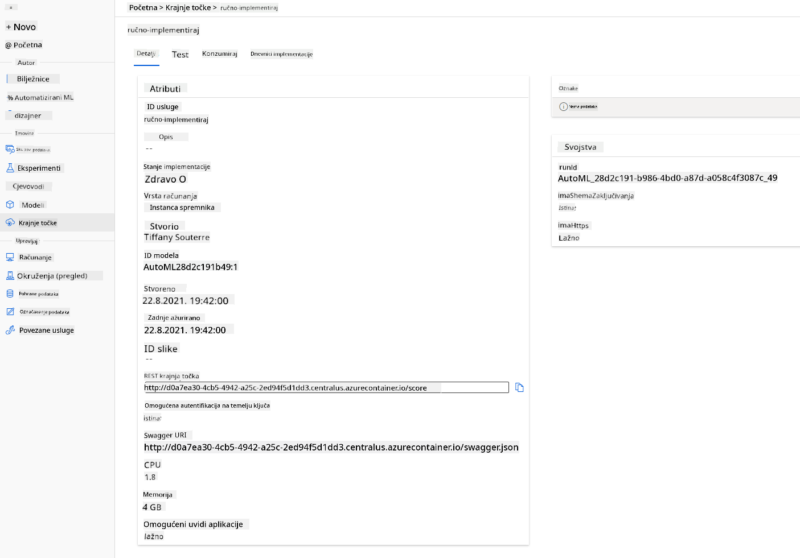

Nevjerojatno! Sada kada imamo implementiran model, možemo započeti konzumaciju krajnje točke.

### 3.2 Konzumacija krajnje točke

Kliknite na karticu "Consume". Ovdje možete pronaći REST krajnju točku i Python skriptu u opciji konzumacije. Odvojite malo vremena za čitanje Python koda.

Ova skripta može se izravno pokrenuti s vašeg lokalnog računala i konzumirat će vašu krajnju točku.

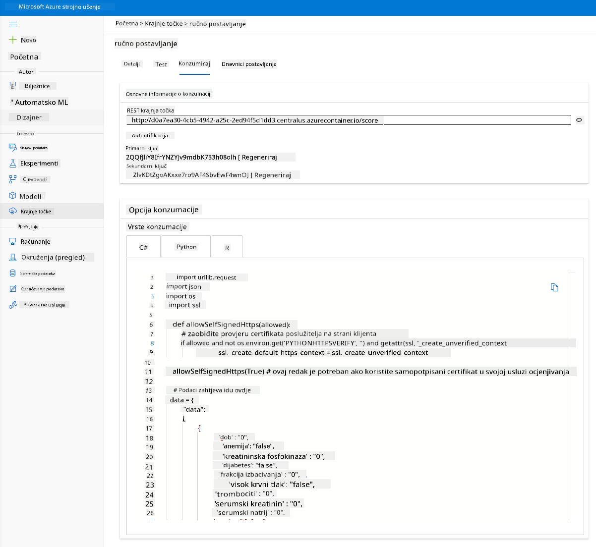

Odvojite trenutak da provjerite ove dvije linije koda:

```python
url = 'http://98e3715f-xxxx-xxxx-xxxx-9ec22d57b796.centralus.azurecontainer.io/score'
api_key = '' # Replace this with the API key for the web service
```  
Varijabla `url` je REST krajnja točka pronađena u kartici "Consume", a varijabla `api_key` je primarni ključ također pronađen u kartici "Consume" (samo u slučaju da ste omogućili autentifikaciju). Ovako skripta može konzumirati krajnju točku.

18. Pokretanjem skripte trebali biste vidjeti sljedeći izlaz:  
    ```python
    b'"{\\"result\\": [true]}"'
    ```  
To znači da je predviđanje srčanog zatajenja za dane podatke točno. Ovo ima smisla jer ako pažljivije pogledate podatke automatski generirane u skripti, sve je postavljeno na 0 i false prema zadanim postavkama. Možete promijeniti podatke s ovim uzorkom unosa:

```python
data = {
    "data":
    [
        {
            'age': "0",
            'anaemia': "false",
            'creatinine_phosphokinase': "0",
            'diabetes': "false",
            'ejection_fraction': "0",
            'high_blood_pressure': "false",
            'platelets': "0",
            'serum_creatinine': "0",
            'serum_sodium': "0",
            'sex': "false",
            'smoking': "false",
            'time': "0",
        },
        {
            'age': "60",
            'anaemia': "false",
            'creatinine_phosphokinase': "500",
            'diabetes': "false",
            'ejection_fraction': "38",
            'high_blood_pressure': "false",
            'platelets': "260000",
            'serum_creatinine': "1.40",
            'serum_sodium': "137",
            'sex': "false",
            'smoking': "false",
            'time': "130",
        },
    ],
}
```  
Skripta bi trebala vratiti:  
    ```python
    b'"{\\"result\\": [true, false]}"'
    ```  

Čestitamo! Upravo ste konzumirali model koji je implementiran i treniran na Azure ML!

> **_NAPOMENA:_** Kada završite s projektom, ne zaboravite izbrisati sve resurse.

## 🚀 Izazov

Pogledajte detaljno objašnjenja modela i detalje koje je AutoML generirao za najbolje modele. Pokušajte razumjeti zašto je najbolji model bolji od ostalih. Koji su algoritmi uspoređeni? Koje su razlike među njima? Zašto je najbolji model u ovom slučaju bolji?

## [Post-Lecture Quiz](https://purple-hill-04aebfb03.1.azurestaticapps.net/quiz/35)

## Pregled i samostalno učenje

U ovoj lekciji naučili ste kako trenirati, implementirati i konzumirati model za predviđanje rizika od srčanog zatajenja na način s malo ili bez koda u oblaku. Ako to još niste učinili, dublje istražite objašnjenja modela koja je AutoML generirao za najbolje modele i pokušajte razumjeti zašto je najbolji model bolji od ostalih.

Možete se dodatno baviti AutoML-om s malo ili bez koda čitajući ovu [dokumentaciju](https://docs.microsoft.com/azure/machine-learning/tutorial-first-experiment-automated-ml?WT.mc_id=academic-77958-bethanycheum&ocid=AID3041109).

## Zadatak

[Projekt Data Science s malo ili bez koda na Azure ML](assignment.md)

---

**Odricanje od odgovornosti**:  
Ovaj dokument je preveden pomoću AI usluge za prevođenje [Co-op Translator](https://github.com/Azure/co-op-translator). Iako nastojimo osigurati točnost, imajte na umu da automatski prijevodi mogu sadržavati pogreške ili netočnosti. Izvorni dokument na izvornom jeziku treba smatrati autoritativnim izvorom. Za ključne informacije preporučuje se profesionalni prijevod od strane ljudskog prevoditelja. Ne preuzimamo odgovornost za bilo kakve nesporazume ili pogrešne interpretacije koje proizlaze iz korištenja ovog prijevoda.