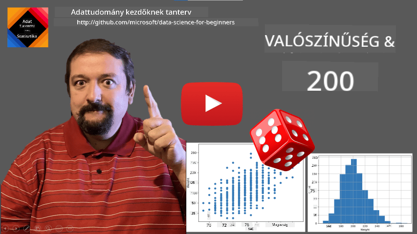
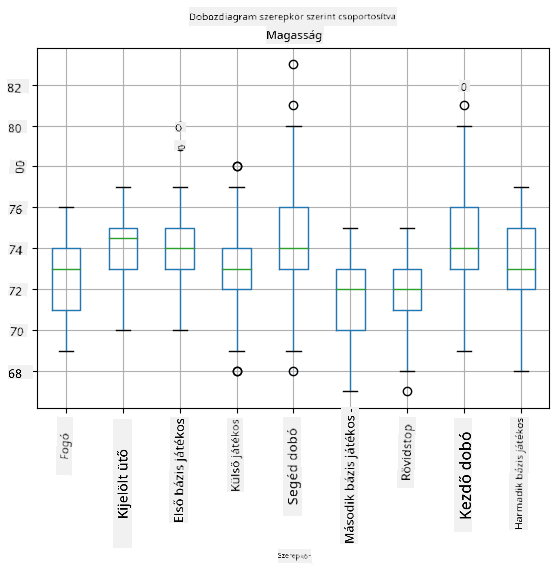
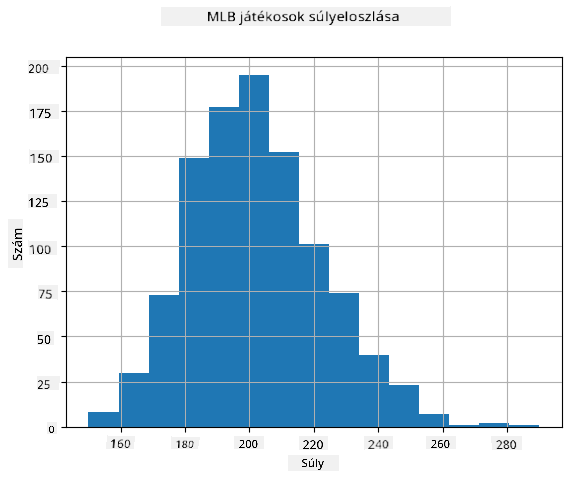
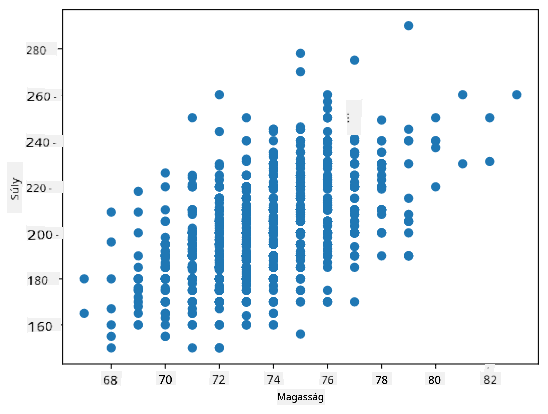

<!--
CO_OP_TRANSLATOR_METADATA:
{
  "original_hash": "ce95884566a74db72572cd51f0cb25ad",
  "translation_date": "2025-09-06T14:00:01+00:00",
  "source_file": "1-Introduction/04-stats-and-probability/README.md",
  "language_code": "hu"
}
-->
# A statisztika és a valószínűség rövid bemutatása

| ](../../sketchnotes/04-Statistics-Probability.png)|
|:---:|
| Statisztika és Valószínűség - _Sketchnote by [@nitya](https://twitter.com/nitya)_ |

A statisztika és a valószínűségelmélet a matematika két szorosan összefüggő területe, amelyek rendkívül fontosak az adatelemzés szempontjából. Bár lehetséges adatokkal dolgozni mély matematikai ismeretek nélkül, mégis hasznos, ha legalább az alapfogalmakkal tisztában vagyunk. Itt egy rövid bevezetőt nyújtunk, amely segít az indulásban.

[](https://youtu.be/Z5Zy85g4Yjw)

## [Előadás előtti kvíz](https://ff-quizzes.netlify.app/en/ds/quiz/6)

## Valószínűség és véletlen változók

A **valószínűség** egy 0 és 1 közötti szám, amely kifejezi, hogy egy **esemény** mennyire valószínű. Úgy definiáljuk, mint a pozitív kimenetelek (amelyek az eseményhez vezetnek) számának és az összes lehetséges kimenetel számának hányadosát, feltételezve, hogy minden kimenetel egyformán valószínű. Például, ha dobunk egy kockával, annak a valószínűsége, hogy páros számot kapunk, 3/6 = 0,5.

Amikor eseményekről beszélünk, **véletlen változókat** használunk. Például a véletlen változó, amely a kockadobás eredményét reprezentálja, az 1-től 6-ig terjedő értékeket veheti fel. Az 1-től 6-ig terjedő számok halmazát **minta-térnek** nevezzük. Beszélhetünk egy véletlen változó adott értéket felvevő valószínűségéről, például P(X=3)=1/6.

A fenti példában szereplő véletlen változót **diszkrétnek** nevezzük, mert a minta-tér megszámlálható, azaz különálló értékek sorolhatók fel. Vannak azonban olyan esetek, amikor a minta-tér egy valós számokból álló intervallum, vagy az egész valós számhalmaz. Az ilyen változókat **folytonosnak** nevezzük. Jó példa erre a busz érkezési ideje.

## Valószínűségi eloszlás

Diszkrét véletlen változók esetén könnyen leírható az egyes események valószínűsége egy P(X) függvénnyel. A minta-tér *S* minden egyes *s* értékéhez egy 0 és 1 közötti számot rendelünk, úgy, hogy az összes eseményre vonatkozó P(X=s) értékek összege 1 legyen.

A legismertebb diszkrét eloszlás az **egyenletes eloszlás**, amelyben a minta-tér N elemből áll, és mindegyikük valószínűsége 1/N.

Folytonos változók esetén nehezebb leírni a valószínűségi eloszlást, ha az értékek egy [a,b] intervallumból, vagy az egész valós számhalmazból ℝ származnak. Vegyük például a busz érkezési idejét. Valójában egy adott érkezési idő *t* esetén annak a valószínűsége, hogy a busz pontosan akkor érkezik, 0!

> Most már tudod, hogy 0 valószínűségű események is előfordulnak, és nagyon gyakran! Legalábbis minden alkalommal, amikor a busz megérkezik!

Csak arról beszélhetünk, hogy egy változó egy adott értéktartományba esik, például P(t<sub>1</sub>≤X<t<sub>2</sub>). Ebben az esetben a valószínűségi eloszlást egy **sűrűségfüggvény** p(x) írja le, amelyre igaz, hogy


Az egyenletes eloszlás folytonos megfelelőjét **folytonos egyenletes eloszlásnak** nevezzük, amely egy véges intervallumon van definiálva. Annak a valószínűsége, hogy az X érték egy l hosszúságú intervallumba esik, arányos l-lel, és legfeljebb 1 lehet.

Egy másik fontos eloszlás a **normális eloszlás**, amelyről részletesebben az alábbiakban lesz szó.

## Átlag, szórás és variancia

Tegyük fel, hogy egy véletlen változó X n mintáját vesszük: x<sub>1</sub>, x<sub>2</sub>, ..., x<sub>n</sub>. Az **átlagot** (vagy **számtani közepet**) a hagyományos módon definiálhatjuk: (x<sub>1</sub>+x<sub>2</sub>+...+x<sub>n</sub>)/n. Ha növeljük a minta méretét (azaz n→∞), megkapjuk az eloszlás átlagát (más néven **várható értékét**). A várható értéket **E**(x)-szel jelöljük.

> Kimutatható, hogy bármely diszkrét eloszlás esetén, amelynek értékei {x<sub>1</sub>, x<sub>2</sub>, ..., x<sub>N</sub>} és megfelelő valószínűségei p<sub>1</sub>, p<sub>2</sub>, ..., p<sub>N</sub>, a várható érték E(X)=x<sub>1</sub>p<sub>1</sub>+x<sub>2</sub>p<sub>2</sub>+...+x<sub>N</sub>p<sub>N</sub>.

Annak meghatározására, hogy az értékek mennyire szóródnak, kiszámíthatjuk a varianciát: σ<sup>2</sup> = ∑(x<sub>i</sub> - μ)<sup>2</sup>/n, ahol μ a minta átlaga. A σ értéket **szórásnak**, a σ<sup>2</sup>-et pedig **varianciának** nevezzük.

## Módusz, medián és kvartilisek

Előfordulhat, hogy az átlag nem megfelelően reprezentálja az "átlagos" értéket. Például, ha néhány szélsőséges érték teljesen kilóg a tartományból, ezek befolyásolhatják az átlagot. Egy másik jó mutató a **medián**, amely olyan érték, amelynél az adatok fele kisebb, a másik fele pedig nagyobb.

Az adatok eloszlásának megértéséhez hasznos a **kvartilisekről** beszélni:

* Az első kvartilis, vagy Q1, olyan érték, amelynél az adatok 25%-a alatta van
* A harmadik kvartilis, vagy Q3, olyan érték, amelynél az adatok 75%-a alatta van

Grafikusan a medián és a kvartilisek kapcsolatát egy **dobozdiagramon** (box plot) ábrázolhatjuk:


Itt kiszámítjuk az **interkvartilis tartományt** (IQR=Q3-Q1), valamint az úgynevezett **kiugró értékeket** - azokat az értékeket, amelyek a [Q1-1,5*IQR, Q3+1,5*IQR] határokon kívül esnek.

Ha az eloszlás véges, és csak néhány lehetséges értéket tartalmaz, egy jó "tipikus" érték az, amely a leggyakrabban fordul elő, ezt nevezzük **módusznak**. Ez gyakran alkalmazható kategóriákra, például színekre. Vegyünk egy helyzetet, amikor két embercsoport van: az egyik erősen a pirosat, a másik a kéket részesíti előnyben. Ha a színeket számokkal kódoljuk, a kedvenc szín átlagértéke valahol a narancs-zöld spektrumban lenne, ami egyik csoport preferenciáját sem tükrözi. A módusz azonban vagy az egyik szín, vagy mindkét szín lehet, ha az emberek száma egyenlő (ebben az esetben az eloszlást **multimodálisnak** nevezzük).

## Valós adatok

Amikor valós életből származó adatokat elemzünk, azok gyakran nem véletlen változók abban az értelemben, hogy nem ismeretlen eredményű kísérleteket végzünk. Például vegyünk egy baseballcsapatot, és az ő testadataikat, mint például magasság, súly és életkor. Ezek a számok nem teljesen véletlenek, de mégis alkalmazhatjuk rájuk ugyanazokat a matematikai fogalmakat. Például az emberek súlyának sorozata tekinthető egy véletlen változóból származó értékek sorozatának. Az alábbiakban a [Major League Baseball](http://mlb.mlb.com/index.jsp) játékosainak súlyadatai láthatók, amelyeket [ebből az adatbázisból](http://wiki.stat.ucla.edu/socr/index.php/SOCR_Data_MLB_HeightsWeights) vettünk (a könnyebb érthetőség kedvéért csak az első 20 értéket mutatjuk):

```
[180.0, 215.0, 210.0, 210.0, 188.0, 176.0, 209.0, 200.0, 231.0, 180.0, 188.0, 180.0, 185.0, 160.0, 180.0, 185.0, 197.0, 189.0, 185.0, 219.0]
```

> **Megjegyzés**: Ha szeretnéd látni, hogyan dolgozhatsz ezzel az adathalmazzal, nézd meg a [kapcsolódó notebookot](notebook.ipynb). Az óra során számos kihívás is található, amelyeket úgy oldhatsz meg, hogy kódot adsz hozzá a notebookhoz. Ha nem vagy biztos abban, hogyan kell adatokat kezelni, ne aggódj - később visszatérünk az adatok Pythonban történő feldolgozására. Ha nem tudod, hogyan futtass kódot Jupyter Notebookban, nézd meg [ezt a cikket](https://soshnikov.com/education/how-to-execute-notebooks-from-github/).

Itt látható egy dobozdiagram, amely az adatok átlagát, mediánját és kvartilisét mutatja:


Mivel adataink különböző játékos **szerepekről** tartalmaznak információt, készíthetünk szerepenkénti dobozdiagramot is - ez lehetővé teszi számunkra, hogy megértsük, hogyan különböznek az értékek a szerepek között. Ezúttal a magasságot vizsgáljuk:



Ez a diagram azt sugallja, hogy átlagosan az első bázisjátékosok magasabbak, mint a második bázisjátékosok. Később az órán megtanuljuk, hogyan tesztelhetjük ezt a hipotézist formálisabban, és hogyan bizonyíthatjuk, hogy adataink statisztikailag szignifikánsak ennek kimutatására.

> Amikor valós adatokkal dolgozunk, feltételezzük, hogy minden adatpont egy valószínűségi eloszlásból származó minta. Ez a feltételezés lehetővé teszi számunkra, hogy gépi tanulási technikákat alkalmazzunk és működő prediktív modelleket építsünk.

Adataink eloszlásának megértéséhez készíthetünk egy **hisztogramot**. Az X-tengely különböző súlytartományokat (úgynevezett **bin-eket**) tartalmaz, míg a függőleges tengely azt mutatja, hogy véletlen változónk mintája hányszor esett egy adott tartományba.



Ebből a hisztogramból látható, hogy az összes érték egy bizonyos átlagos súly körül koncentrálódik, és minél távolabb megyünk ettől a súlytól, annál kevesebb ilyen érték fordul elő. Azaz nagyon valószínűtlen, hogy egy baseballjátékos súlya jelentősen eltér az átlagos súlytól. A súlyok szórása azt mutatja, hogy a súlyok mennyire térhetnek el az átlagtól.

> Ha más emberek, például egyetemi hallgatók súlyát vizsgáljuk, az eloszlás valószínűleg eltérő lesz. Azonban az eloszlás alakja ugyanaz marad, csak az átlag és a szórás változik. Tehát ha modellünket baseballjátékosokon képezzük, valószínűleg rossz eredményeket ad, ha egyetemi hallgatókra alkalmazzuk, mert az alapul szolgáló eloszlás eltérő.

## Normális eloszlás

A fent látott súlyeloszlás nagyon tipikus, és sok valós mérést ugyanilyen típusú eloszlás követ, de eltérő átlaggal és szórással. Ezt az eloszlást **normális eloszlásnak** nevezzük, és nagyon fontos szerepet játszik a statisztikában.

A normális eloszlás helyes módja a potenciális baseballjátékosok véletlenszerű súlyainak generálására. Ha ismerjük az átlagos súlyt (`mean`) és a szórást (`std`), 1000 súlymintát generálhatunk a következő módon:
```python
samples = np.random.normal(mean,std,1000)
``` 

Ha a generált minták hisztogramját ábrázoljuk, nagyon hasonló képet kapunk, mint amit fentebb láttunk. Ha növeljük a minták és a bin-ek számát, egy ideális normális eloszláshoz közelebb álló képet kapunk:


*Normális eloszlás átlag=0 és szórás=1*

## Konfidencia intervallumok

Amikor a baseballjátékosok súlyáról beszélünk, feltételezzük, hogy létezik egy **W véletlen változó**, amely az összes baseballjátékos súlyának ideális valószínűségi eloszlásának felel meg (az úgynevezett **populáció**). A súlyaink sorozata az összes baseballjátékos egy részhalmazának felel meg, amelyet **mintának** nevezünk. Egy érdekes kérdés, hogy megismerhetjük-e a W eloszlásának paramétereit, azaz a populáció átlagát és szórását.

A legegyszerűbb válasz az lenne, hogy kiszámítjuk a minta átlagát és szórását. Azonban előfordulhat, hogy véletlen mintánk nem pontosan reprezentálja a teljes populációt. Ezért van értelme **konfidencia intervallumról** beszélni.

> **Konfidencia intervallum** a populáció valódi átlagának becslése a mintánk alapján, amely bizonyos valószínűséggel (vagy **bizalmi szinttel**) pontos.

1</sub>, ..., X<sub>n</sub> értékeket veszünk a disztribúciónkból. Minden alkalommal, amikor mintát veszünk a disztribúciónkból, eltérő átlagértéket kapunk, μ-t. Ezért μ tekinthető véletlen változónak. Egy **konfidencia intervallum** konfidencia p értékkel egy értékpár (L<sub>p</sub>,R<sub>p</sub>), amelyre **P**(L<sub>p</sub>≤μ≤R<sub>p</sub>) = p, azaz a mért átlagérték intervallumba esésének valószínűsége p.

Rövid bevezetőnkön túlmutat, hogy részletesen tárgyaljuk, hogyan számítják ki ezeket a konfidencia intervallumokat. További részletek találhatók [a Wikipédián](https://en.wikipedia.org/wiki/Confidence_interval). Röviden, meghatározzuk a számított mintaátlag eloszlását a populáció valódi átlagához viszonyítva, amit **student eloszlásnak** nevezünk.

> **Érdekes tény**: A student eloszlás William Sealy Gosset matematikusról kapta a nevét, aki "Student" álnéven publikálta tanulmányát. Gosset a Guinness sörgyárban dolgozott, és az egyik verzió szerint munkáltatója nem akarta, hogy a nagyközönség tudomást szerezzen arról, hogy statisztikai teszteket használnak a nyersanyagok minőségének meghatározására.

Ha a populációnk átlagát, μ-t szeretnénk p konfidenciával becsülni, akkor a Student eloszlás *(1-p)/2-edik percentilisét* kell vennünk, amelyet táblázatokból vagy statisztikai szoftverek (pl. Python, R stb.) beépített függvényeivel számíthatunk ki. Ezután az μ intervalluma X±A*D/√n lesz, ahol X a minta kapott átlaga, D pedig a szórás.

> **Megjegyzés**: Nem tárgyaljuk az [szabadságfokok](https://en.wikipedia.org/wiki/Degrees_of_freedom_(statistics)) fontos fogalmát, amely a Student eloszlással kapcsolatban lényeges. További statisztikai könyvekben mélyebben megérthető ez a fogalom.

A súlyok és magasságok konfidencia intervallumának kiszámítására példa található az [kísérő jegyzetfüzetekben](notebook.ipynb).

| p | Súly átlaga |
|-----|-----------|
| 0.85 | 201.73±0.94 |
| 0.90 | 201.73±1.08 |
| 0.95 | 201.73±1.28 |

Figyeljük meg, hogy minél nagyobb a konfidencia valószínűsége, annál szélesebb a konfidencia intervallum.

## Hipotézis tesztelés

A baseball játékosok adatállományában különböző játékos szerepek vannak, amelyeket az alábbiakban összefoglalhatunk (nézd meg az [kísérő jegyzetfüzetet](notebook.ipynb), hogy látható legyen, hogyan számítható ki ez a táblázat):

| Szerep | Magasság | Súly | Darabszám |
|------|--------|--------|-------|
| Catcher | 72.723684 | 204.328947 | 76 |
| Designated_Hitter | 74.222222 | 220.888889 | 18 |
| First_Baseman | 74.000000 | 213.109091 | 55 |
| Outfielder | 73.010309 | 199.113402 | 194 |
| Relief_Pitcher | 74.374603 | 203.517460 | 315 |
| Second_Baseman | 71.362069 | 184.344828 | 58 |
| Shortstop | 71.903846 | 182.923077 | 52 |
| Starting_Pitcher | 74.719457 | 205.163636 | 221 |
| Third_Baseman | 73.044444 | 200.955556 | 45 |

Láthatjuk, hogy az első bázisjátékosok átlagos magassága nagyobb, mint a második bázisjátékosoké. Ezért kísértésbe eshetünk, hogy azt állítsuk, hogy **az első bázisjátékosok magasabbak, mint a második bázisjátékosok**.

> Ezt az állítást **hipotézisnek** nevezzük, mert nem tudjuk, hogy a tény valóban igaz-e vagy sem.

Azonban nem mindig egyértelmű, hogy levonhatjuk-e ezt a következtetést. Az előzőekben tárgyaltakból tudjuk, hogy minden átlagnak van egy hozzá tartozó konfidencia intervalluma, és így ez a különbség lehet pusztán statisztikai hiba. Szükségünk van egy formálisabb módszerre a hipotézis teszteléséhez.

Számítsuk ki külön-külön az első és második bázisjátékosok magasságának konfidencia intervallumait:

| Konfidencia | Első bázisjátékosok | Második bázisjátékosok |
|------------|---------------|----------------|
| 0.85 | 73.62..74.38 | 71.04..71.69 |
| 0.90 | 73.56..74.44 | 70.99..71.73 |
| 0.95 | 73.47..74.53 | 70.92..71.81 |

Láthatjuk, hogy semmilyen konfidencia esetén nem fedik át egymást az intervallumok. Ez bizonyítja a hipotézisünket, hogy az első bázisjátékosok magasabbak, mint a második bázisjátékosok.

Formálisabban, az általunk megoldandó probléma az, hogy lássuk, vajon **két valószínűségi eloszlás azonos-e**, vagy legalábbis ugyanazokkal a paraméterekkel rendelkezik-e. Az eloszlástól függően különböző teszteket kell alkalmaznunk. Ha tudjuk, hogy az eloszlásaink normálisak, alkalmazhatjuk a **[Student t-tesztet](https://en.wikipedia.org/wiki/Student%27s_t-test)**.

A Student t-tesztben kiszámítjuk az úgynevezett **t-értéket**, amely jelzi az átlagok közötti különbséget, figyelembe véve a szórást. Kimutatták, hogy a t-érték követi a **student eloszlást**, amely lehetővé teszi számunkra, hogy megkapjuk a küszöbértéket egy adott konfidencia szinthez **p** (ez kiszámítható vagy numerikus táblázatokból kikereshető). Ezután összehasonlítjuk a t-értéket ezzel a küszöbértékkel, hogy elfogadjuk vagy elutasítsuk a hipotézist.

Pythonban használhatjuk a **SciPy** csomagot, amely tartalmazza a `ttest_ind` függvényt (sok más hasznos statisztikai függvény mellett!). Ez kiszámítja nekünk a t-értéket, és fordított keresést végez a konfidencia p-értékére, így csak a konfidenciát kell megnéznünk, hogy következtetést vonjunk le.

Például az első és második bázisjátékosok magasságának összehasonlítása a következő eredményeket adja:
```python
from scipy.stats import ttest_ind

tval, pval = ttest_ind(df.loc[df['Role']=='First_Baseman',['Height']], df.loc[df['Role']=='Designated_Hitter',['Height']],equal_var=False)
print(f"T-value = {tval[0]:.2f}\nP-value: {pval[0]}")
```
```
T-value = 7.65
P-value: 9.137321189738925e-12
```
Esetünkben a p-érték nagyon alacsony, ami azt jelenti, hogy erős bizonyíték van arra, hogy az első bázisjátékosok magasabbak.

Vannak más típusú hipotézisek is, amelyeket tesztelni szeretnénk, például:
* Annak bizonyítása, hogy egy adott minta követ egy eloszlást. Esetünkben feltételeztük, hogy a magasságok normálisan oszlanak el, de ezt formális statisztikai ellenőrzésnek kell alávetni.
* Annak bizonyítása, hogy egy minta átlagértéke megfelel egy előre meghatározott értéknek
* Több minta átlagának összehasonlítása (pl. mi a különbség a boldogság szintek között különböző korcsoportokban)

## Nagyszámok törvénye és központi határeloszlás-tétel

Az egyik ok, amiért a normál eloszlás olyan fontos, az úgynevezett **központi határeloszlás-tétel**. Tegyük fel, hogy van egy nagy mintánk független N értékekkel X<sub>1</sub>, ..., X<sub>N</sub>, amelyek bármilyen eloszlásból származnak, átlag μ-val és szórás σ<sup>2</sup>-vel. Ekkor, ha N elég nagy (más szóval, amikor N→∞), az átlag Σ<sub>i</sub>X<sub>i</sub> normálisan oszlik el, átlag μ-val és szórás σ<sup>2</sup>/N-nel.

> A központi határeloszlás-tételt másképp is értelmezhetjük: függetlenül az eloszlástól, amikor bármely véletlen változó értékeinek összegének átlagát számítjuk, normál eloszlást kapunk.

A központi határeloszlás-tételből az is következik, hogy amikor N→∞, a mintaátlag μ-hoz való egyenlőségének valószínűsége 1 lesz. Ezt **nagyszámok törvényének** nevezik.

## Kovariancia és korreláció

Az egyik dolog, amit az adatelemzés tesz, az adatok közötti kapcsolatok keresése. Azt mondjuk, hogy két sorozat **korrelál**, amikor hasonló viselkedést mutatnak ugyanabban az időben, azaz egyszerre emelkednek/csökkennek, vagy az egyik sorozat emelkedik, amikor a másik csökken, és fordítva. Más szóval, úgy tűnik, hogy van valamilyen kapcsolat a két sorozat között.

> A korreláció nem feltétlenül jelzi a két sorozat közötti ok-okozati kapcsolatot; néha mindkét változó függhet valamilyen külső okból, vagy pusztán véletlen lehet, hogy a két sorozat korrelál. Azonban az erős matematikai korreláció jó jelzés arra, hogy a két változó valahogyan összekapcsolódik.

Matematikailag a fő fogalom, amely megmutatja a két véletlen változó közötti kapcsolatot, a **kovariancia**, amelyet így számítunk ki: Cov(X,Y) = **E**\[(X-**E**(X))(Y-**E**(Y))\]. Számítjuk mindkét változó eltérését az átlagértéküktől, majd ezeknek az eltéréseknek a szorzatát. Ha mindkét változó együtt tér el, a szorzat mindig pozitív érték lesz, amely pozitív kovarianciát eredményez. Ha mindkét változó nem szinkronban tér el (azaz az egyik az átlag alá esik, amikor a másik az átlag fölé emelkedik), mindig negatív számokat kapunk, amelyek negatív kovarianciát eredményeznek. Ha az eltérések nem függenek egymástól, akkor nagyjából nullát kapunk.

A kovariancia abszolút értéke nem mond sokat arról, hogy mekkora a korreláció, mert az az aktuális értékek nagyságától függ. Normalizálásához oszthatjuk a kovarianciát mindkét változó szórásával, hogy **korrelációt** kapjunk. Az a jó, hogy a korreláció mindig [-1,1] tartományban van, ahol 1 erős pozitív korrelációt jelez az értékek között, -1 erős negatív korrelációt, és 0 azt jelzi, hogy nincs korreláció (a változók függetlenek).

**Példa**: Számíthatunk korrelációt a baseball játékosok súlya és magassága között az említett adatállományból:
```python
print(np.corrcoef(weights,heights))
```
Ennek eredményeként kapunk egy **korrelációs mátrixot**, például ilyet:
```
array([[1.        , 0.52959196],
       [0.52959196, 1.        ]])
```

> A korrelációs mátrix C bármely számú bemeneti sorozatra S<sub>1</sub>, ..., S<sub>n</sub> kiszámítható. A C<sub>ij</sub> értéke az S<sub>i</sub> és S<sub>j</sub> közötti korreláció, és a diagonális elemek mindig 1-ek (ami az S<sub>i</sub> önkorrelációja).

Esetünkben a 0.53 érték azt jelzi, hogy van némi korreláció egy személy súlya és magassága között. Készíthetünk egy szórási diagramot az egyik értékről a másik ellen, hogy vizuálisan lássuk a kapcsolatot:



> További példák a korrelációra és kovarianciára az [kísérő jegyzetfüzetben](notebook.ipynb) találhatók.

## Következtetés

Ebben a szakaszban megtanultuk:

* az adatok alapvető statisztikai tulajdonságait, mint például az átlag, szórás, módusz és kvartilisek
* különböző véletlen változók eloszlásait, beleértve a normál eloszlást
* hogyan találjuk meg a korrelációt különböző tulajdonságok között
* hogyan használjuk a matematika és statisztika megalapozott eszközeit hipotézisek bizonyítására
* hogyan számítsunk konfidencia intervallumokat véletlen változókhoz adott adatminták alapján

Bár ez nem kimerítő lista a valószínűség és statisztika témakörében létező témákról, elegendőnek kell lennie ahhoz, hogy jó kezdést nyújtson ehhez a kurzushoz.

## 🚀 Kihívás

Használd a jegyzetfüzetben található mintakódot más hipotézisek tesztelésére:
1. Az első bázisjátékosok idősebbek, mint a második bázisjátékosok
2. Az első bázisjátékosok magasabbak, mint a harmadik bázisjátékosok
3. A shortstopok magasabbak, mint a második bázisjátékosok

## [Utó-előadás kvíz](https://ff-quizzes.netlify.app/en/ds/quiz/7)

## Áttekintés és önálló tanulás

A valószínűség és statisztika olyan széles téma, hogy megérdemelne egy saját kurzust. Ha mélyebben szeretnél elmerülni az elméletben, érdemes lehet folytatni az olvasást az alábbi könyvek közül néhányban:

1. [Carlos Fernandez-Granda](https://cims.nyu.edu/~cfgranda/) a New York-i Egyetemről nagyszerű előadásjegyzeteket készített [Probability and Statistics for Data Science](https://cims.nyu.edu/~cfgranda/pages/stuff/probability_stats_for_DS.pdf) (elérhető online)
1. [Peter és Andrew Bruce. Practical Statistics for Data Scientists.](https://www.oreilly.com/library/view/practical-statistics-for/9781491952955/) [[mintakód R-ben](https://github.com/andrewgbruce/statistics-for-data-scientists)]. 
1. [James D. Miller. Statistics for Data Science](https://www.packtpub.com/product/statistics-for-data-science/9781788290678) [[mintakód R-ben](https://github.com/PacktPublishing/Statistics-for-Data-Science)]

## Feladat

[Kis diabétesz tanulmány](assignment.md)

## Köszönetnyilvánítás

Ezt a leckét ♥️-vel készítette [Dmitry Soshnikov](http://soshnikov.com).

---

**Felelősség kizárása**:  
Ez a dokumentum az AI fordítási szolgáltatás [Co-op Translator](https://github.com/Azure/co-op-translator) segítségével lett lefordítva. Bár törekszünk a pontosságra, kérjük, vegye figyelembe, hogy az automatikus fordítások hibákat vagy pontatlanságokat tartalmazhatnak. Az eredeti dokumentum az eredeti nyelvén tekintendő hiteles forrásnak. Fontos információk esetén javasolt professzionális emberi fordítást igénybe venni. Nem vállalunk felelősséget semmilyen félreértésért vagy téves értelmezésért, amely a fordítás használatából eredhet.