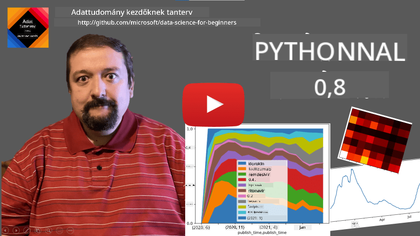
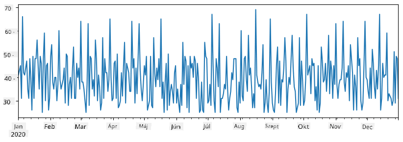
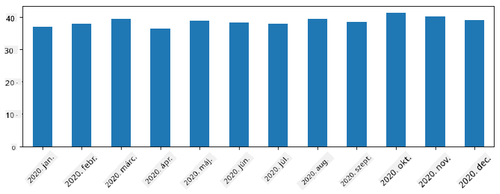
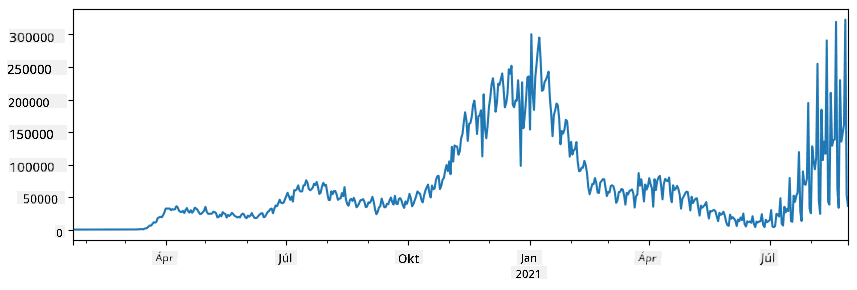
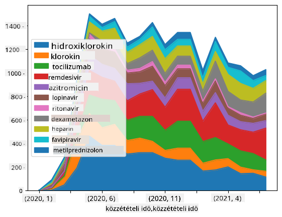

<!--
CO_OP_TRANSLATOR_METADATA:
{
  "original_hash": "7bfec050f4717dcc2dfd028aca9d21f3",
  "translation_date": "2025-09-06T15:55:52+00:00",
  "source_file": "2-Working-With-Data/07-python/README.md",
  "language_code": "hu"
}
-->
# Adatok kezelése: Python és a Pandas könyvtár

|  ](../../sketchnotes/07-WorkWithPython.png) |
| :-------------------------------------------------------------------------------------------------------: |
|                 Python használata - _Sketchnote by [@nitya](https://twitter.com/nitya)_                 |

[](https://youtu.be/dZjWOGbsN4Y)

Bár az adatbázisok hatékony módot kínálnak az adatok tárolására és lekérdezésére lekérdezési nyelvek segítségével, az adatok feldolgozásának legflexibilisebb módja az, ha saját programot írunk az adatok manipulálására. Sok esetben egy adatbázis-lekérdezés hatékonyabb megoldás lehet. Azonban, ha összetettebb adatfeldolgozásra van szükség, azt nem lehet könnyen SQL segítségével megvalósítani.  
Az adatfeldolgozást bármely programozási nyelven meg lehet valósítani, de vannak olyan nyelvek, amelyek magasabb szintűek az adatokkal való munka szempontjából. Az adatelemzők általában az alábbi nyelvek egyikét részesítik előnyben:

* **[Python](https://www.python.org/)**, egy általános célú programozási nyelv, amelyet gyakran a legjobb választásnak tartanak kezdők számára egyszerűsége miatt. A Python számos kiegészítő könyvtárral rendelkezik, amelyek segítenek gyakorlati problémák megoldásában, például adatok kicsomagolása ZIP archívumból vagy képek szürkeárnyalatossá alakítása. Az adatelemzés mellett a Python gyakran használatos webfejlesztésre is.  
* **[R](https://www.r-project.org/)** egy hagyományos eszköztár, amelyet statisztikai adatfeldolgozásra fejlesztettek ki. Széles könyvtárgyűjteménnyel (CRAN) rendelkezik, ami jó választássá teszi az adatok feldolgozására. Azonban az R nem általános célú programozási nyelv, és ritkán használják az adatelemzésen kívül.  
* **[Julia](https://julialang.org/)** egy másik nyelv, amelyet kifejezetten adatelemzésre fejlesztettek ki. Jobb teljesítményt kínál, mint a Python, így kiváló eszköz tudományos kísérletezéshez.

Ebben a leckében a Python használatára összpontosítunk egyszerű adatfeldolgozási feladatokhoz. Feltételezzük, hogy alapvető ismeretekkel rendelkezik a nyelvről. Ha mélyebb betekintést szeretne kapni a Pythonba, az alábbi forrásokat ajánljuk:

* [Tanulj Python-t szórakoztató módon Turtle Graphics és Fraktálok segítségével](https://github.com/shwars/pycourse) - GitHub-alapú gyors bevezető kurzus a Python programozásba  
* [Tedd meg az első lépéseket a Python-nal](https://docs.microsoft.com/en-us/learn/paths/python-first-steps/?WT.mc_id=academic-77958-bethanycheum) Tanulási útvonal a [Microsoft Learn](http://learn.microsoft.com/?WT.mc_id=academic-77958-bethanycheum) oldalon  

Az adatok sokféle formában érkezhetnek. Ebben a leckében három adatformát vizsgálunk meg: **táblázatos adatok**, **szöveg** és **képek**.

Néhány adatfeldolgozási példára fogunk összpontosítani, ahelyett, hogy teljes áttekintést nyújtanánk az összes kapcsolódó könyvtárról. Ez lehetővé teszi, hogy megértsük a lehetőségeket, és tudjuk, hol találhatunk megoldásokat a problémáinkra, amikor szükség van rájuk.

> **Legfontosabb tanács**. Ha olyan műveletet kell végrehajtania az adatokon, amelyet nem tud, hogyan kell megtenni, próbáljon meg rákeresni az interneten. [Stackoverflow](https://stackoverflow.com/) általában sok hasznos Python kódmintát tartalmaz tipikus feladatokhoz.  

## [Előadás előtti kvíz](https://ff-quizzes.netlify.app/en/ds/quiz/12)

## Táblázatos adatok és Dataframe-ek

Már találkozott táblázatos adatokkal, amikor a relációs adatbázisokról beszéltünk. Ha sok adat van, és az sok különböző, összekapcsolt táblában található, akkor határozottan érdemes SQL-t használni az adatok kezelésére. Azonban sok esetben van egy adatunk táblázat formájában, és szeretnénk **megérteni** vagy **következtetéseket levonni** az adatokból, például az eloszlásról, az értékek közötti korrelációról stb. Az adatelemzés során gyakran szükség van az eredeti adatok átalakítására, majd vizualizálására. Mindkét lépés könnyen elvégezhető Python segítségével.

Két legfontosabb Python könyvtár segíthet a táblázatos adatok kezelésében:
* **[Pandas](https://pandas.pydata.org/)** lehetővé teszi az úgynevezett **Dataframe-ek** manipulálását, amelyek analógok a relációs táblákkal. Lehetnek elnevezett oszlopok, és különböző műveleteket végezhetünk sorokon, oszlopokon és általában a Dataframe-eken.  
* **[Numpy](https://numpy.org/)** egy könyvtár **tenszorokkal**, azaz többdimenziós **tömbökkel** való munkához. A tömb azonos típusú értékeket tartalmaz, és egyszerűbb, mint a Dataframe, de több matematikai műveletet kínál, és kevesebb erőforrást igényel.

Van néhány további könyvtár, amelyet érdemes ismerni:
* **[Matplotlib](https://matplotlib.org/)** egy könyvtár, amelyet adatvizualizációra és grafikonok rajzolására használnak  
* **[SciPy](https://www.scipy.org/)** egy könyvtár további tudományos funkciókkal. Már találkoztunk ezzel a könyvtárral, amikor a valószínűségről és statisztikáról beszéltünk  

Íme egy kódrészlet, amelyet általában a Python program elején használunk ezeknek a könyvtáraknak az importálására:  
```python
import numpy as np
import pandas as pd
import matplotlib.pyplot as plt
from scipy import ... # you need to specify exact sub-packages that you need
```  

A Pandas néhány alapvető fogalom köré épül.

### Sorozatok (Series)

A **Series** egy értékek sorozata, hasonlóan a listához vagy numpy tömbhöz. A fő különbség az, hogy a sorozatnak van egy **indexe**, és amikor műveleteket végzünk rajta (pl. összeadjuk őket), az indexet figyelembe vesszük. Az index lehet egyszerű, mint például az egész számú sorszám (ez az alapértelmezett index, amikor listából vagy tömbből hozunk létre sorozatot), vagy lehet összetett, például dátumintervallum.

> **Megjegyzés**: Van néhány bevezető Pandas kód az ehhez tartozó notebookban [`notebook.ipynb`](notebook.ipynb). Itt csak néhány példát vázolunk fel, de mindenképpen érdemes megnézni a teljes notebookot.

Vegyünk egy példát: elemezni szeretnénk fagylaltárusító helyünk eladásait. Generáljunk egy sorozatot az eladási számokkal (naponta eladott tételek száma) egy időszakra:

```python
start_date = "Jan 1, 2020"
end_date = "Mar 31, 2020"
idx = pd.date_range(start_date,end_date)
print(f"Length of index is {len(idx)}")
items_sold = pd.Series(np.random.randint(25,50,size=len(idx)),index=idx)
items_sold.plot()
```  


Tegyük fel, hogy minden héten szervezünk egy baráti összejövetelt, és további 10 csomag fagylaltot viszünk a bulira. Létrehozhatunk egy másik sorozatot, amelyet hetek szerint indexelünk, hogy ezt bemutassuk:  
```python
additional_items = pd.Series(10,index=pd.date_range(start_date,end_date,freq="W"))
```  
Amikor összeadjuk a két sorozatot, megkapjuk a teljes számot:  
```python
total_items = items_sold.add(additional_items,fill_value=0)
total_items.plot()
```  


> **Megjegyzés**: Nem használjuk az egyszerű `total_items+additional_items` szintaxist. Ha ezt tennénk, sok `NaN` (*Not a Number*) értéket kapnánk az eredményül kapott sorozatban. Ennek oka, hogy az `additional_items` sorozatban hiányzó értékek vannak néhány indexpontnál, és ha `NaN`-t adunk hozzá bármihez, az eredmény `NaN` lesz. Ezért meg kell adnunk a `fill_value` paramétert az összeadás során.

Az idősorokkal különböző időintervallumokkal is **újramintázhatjuk** a sorozatot. Például, ha havi átlagos eladási mennyiséget szeretnénk kiszámítani, használhatjuk a következő kódot:  
```python
monthly = total_items.resample("1M").mean()
ax = monthly.plot(kind='bar')
```  


### DataFrame

A DataFrame lényegében azonos indexű sorozatok gyűjteménye. Több sorozatot kombinálhatunk egy DataFrame-be:  
```python
a = pd.Series(range(1,10))
b = pd.Series(["I","like","to","play","games","and","will","not","change"],index=range(0,9))
df = pd.DataFrame([a,b])
```  
Ez egy vízszintes táblázatot hoz létre, mint például:  
|     | 0   | 1    | 2   | 3   | 4      | 5   | 6      | 7    | 8    |
| --- | --- | ---- | --- | --- | ------ | --- | ------ | ---- | ---- |
| 0   | 1   | 2    | 3   | 4   | 5      | 6   | 7      | 8    | 9    |
| 1   | I   | like | to  | use | Python | and | Pandas | very | much |

Sorozatokat oszlopként is használhatunk, és megadhatjuk az oszlopneveket szótár segítségével:  
```python
df = pd.DataFrame({ 'A' : a, 'B' : b })
```  
Ez egy ilyen táblázatot eredményez:

|     | A   | B      |
| --- | --- | ------ |
| 0   | 1   | I      |
| 1   | 2   | like   |
| 2   | 3   | to     |
| 3   | 4   | use    |
| 4   | 5   | Python |
| 5   | 6   | and    |
| 6   | 7   | Pandas |
| 7   | 8   | very   |
| 8   | 9   | much   |

**Megjegyzés**: Ezt a táblázat-elrendezést úgy is elérhetjük, hogy az előző táblázatot transzponáljuk, például az alábbi kóddal:  
```python
df = pd.DataFrame([a,b]).T..rename(columns={ 0 : 'A', 1 : 'B' })
```  
Itt a `.T` a DataFrame transzponálásának műveletét jelenti, azaz a sorok és oszlopok cseréjét, és a `rename` művelet lehetővé teszi az oszlopok átnevezését, hogy megfeleljenek az előző példának.

Íme néhány legfontosabb művelet, amelyet DataFrame-eken végezhetünk:

**Oszlopok kiválasztása**. Egyedi oszlopokat választhatunk ki az `df['A']` írásával - ez a művelet egy sorozatot ad vissza. Az oszlopok egy részhalmazát egy másik DataFrame-be is kiválaszthatjuk az `df[['B','A']]` írásával - ez egy másik DataFrame-et ad vissza.

**Szűrés** bizonyos sorokra kritérium alapján. Például, ha csak azokat a sorokat szeretnénk megtartani, ahol az `A` oszlop értéke nagyobb, mint 5, akkor írhatjuk: `df[df['A']>5]`.

> **Megjegyzés**: A szűrés működése a következő. Az `df['A']<5` kifejezés egy logikai sorozatot ad vissza, amely jelzi, hogy a kifejezés `True` vagy `False` az eredeti sorozat `df['A']` minden elemére. Amikor a logikai sorozatot indexként használjuk, az a DataFrame sorainak részhalmazát adja vissza. Ezért nem lehet tetszőleges Python logikai kifejezést használni, például az `df[df['A']>5 and df['A']<7]` írása helytelen lenne. Ehelyett speciális `&` műveletet kell használni a logikai sorozatokon, például az `df[(df['A']>5) & (df['A']<7)]` írásával (*a zárójelek itt fontosak*).

**Új számítható oszlopok létrehozása**. Könnyen létrehozhatunk új számítható oszlopokat a DataFrame-hez intuitív kifejezések használatával, például:  
```python
df['DivA'] = df['A']-df['A'].mean() 
```  
Ez a példa kiszámítja az `A` eltérését az átlagértékétől. Ami valójában történik, az az, hogy kiszámítunk egy sorozatot, majd ezt a sorozatot hozzárendeljük a bal oldali oszlophoz, létrehozva egy új oszlopot. Ezért nem használhatunk olyan műveleteket, amelyek nem kompatibilisek a sorozatokkal, például az alábbi kód helytelen:  
```python
# Wrong code -> df['ADescr'] = "Low" if df['A'] < 5 else "Hi"
df['LenB'] = len(df['B']) # <- Wrong result
```  
Az utóbbi példa, bár szintaktikailag helyes, rossz eredményt ad, mert a `B` sorozat hosszát rendeli hozzá az oszlop összes értékéhez, nem pedig az egyes elemek hosszát, ahogy azt szerettük volna.

Ha összetett kifejezéseket kell kiszámítanunk, használhatjuk az `apply` függvényt. Az utolsó példa így írható:  
```python
df['LenB'] = df['B'].apply(lambda x : len(x))
# or 
df['LenB'] = df['B'].apply(len)
```  

A fenti műveletek után a következő DataFrame-et kapjuk:

|     | A   | B      | DivA | LenB |
| --- | --- | ------ | ---- | ---- |
| 0   | 1   | I      | -4.0 | 1    |
| 1   | 2   | like   | -3.0 | 4    |
| 2   | 3   | to     | -2.0 | 2    |
| 3   | 4   | use    | -1.0 | 3    |
| 4   | 5   | Python | 0.0  | 6    |
| 5   | 6   | and    | 1.0  | 3    |
| 6   | 7   | Pandas | 2.0  | 6    |
| 7   | 8   | very   | 3.0  | 4    |
| 8   | 9   | much   | 4.0  | 4    |

**Sorok kiválasztása számok alapján** az `iloc` konstrukcióval végezhető el. Például az első 5 sor kiválasztásához a DataFrame-ből:  
```python
df.iloc[:5]
```  

**Csoportosítás** gyakran használatos olyan eredmények elérésére, amelyek hasonlóak az Excel *pivot tábláihoz*. Tegyük fel, hogy az `A` oszlop átlagértékét szeretnénk kiszámítani az egyes `LenB` értékekhez. Ekkor csoportosíthatjuk a DataFrame-et `LenB` szerint, és meghívhatjuk a `mean` függvényt:  
```python
df.groupby(by='LenB')[['A','DivA']].mean()
```  
Ha az átlagot és az elemek számát is ki szeretnénk számítani a csoportban, akkor használhatjuk az összetettebb `aggregate` függvényt:  
```python
df.groupby(by='LenB') \
 .aggregate({ 'DivA' : len, 'A' : lambda x: x.mean() }) \
 .rename(columns={ 'DivA' : 'Count', 'A' : 'Mean'})
```  
Ez a következő táblázatot adja:

| LenB | Count | Mean     |
| ---- | ----- | -------- |
| 1    | 1     | 1.000000 |
| 2    | 1     | 3.000000 |
| 3    | 2     | 5.000000 |
| 4    | 3     | 6.333333 |
| 6    | 2     | 6.000000 |

### Adatok beszerzése
Láttuk, milyen egyszerű Series és DataFrame-eket létrehozni Python objektumokból. Azonban az adatok általában szövegfájl vagy Excel-tábla formájában érkeznek. Szerencsére a Pandas egyszerű módot kínál az adatok betöltésére a lemezről. Például, egy CSV fájl beolvasása ilyen egyszerű:
```python
df = pd.read_csv('file.csv')
```
További példákat fogunk látni az adatok betöltésére, beleértve az adatok külső weboldalakról való lekérését is, a "Kihívás" szekcióban.

### Nyomtatás és Ábrázolás

Egy adatkutatónak gyakran kell felfedeznie az adatokat, ezért fontos, hogy képes legyen vizualizálni azokat. Ha a DataFrame nagy, sokszor csak meg akarunk győződni arról, hogy mindent helyesen csinálunk, például az első néhány sor kinyomtatásával. Ezt a `df.head()` hívásával tehetjük meg. Ha Jupyter Notebookban futtatjuk, a DataFrame-et szép táblázatos formában fogja megjeleníteni.

Láttuk már a `plot` függvény használatát néhány oszlop vizualizálására. Bár a `plot` nagyon hasznos sok feladathoz, és számos különböző grafikon típust támogat a `kind=` paraméter segítségével, mindig használhatjuk a nyers `matplotlib` könyvtárat valami összetettebb ábrázolására. Az adatvizualizációt részletesen fogjuk tárgyalni külön tanfolyami leckékben.

Ez az áttekintés lefedi a Pandas legfontosabb fogalmait, azonban a könyvtár nagyon gazdag, és nincs határa annak, hogy mit lehet vele elérni! Most alkalmazzuk ezt a tudást egy konkrét probléma megoldására.

## 🚀 Kihívás 1: A COVID terjedésének elemzése

Az első probléma, amire összpontosítunk, a COVID-19 járvány terjedésének modellezése. Ehhez az egyes országokban fertőzött személyek számáról szóló adatokat fogjuk használni, amelyeket a [Center for Systems Science and Engineering](https://systems.jhu.edu/) (CSSE) biztosít a [Johns Hopkins University](https://jhu.edu/) keretében. Az adatállomány elérhető [ebben a GitHub repóban](https://github.com/CSSEGISandData/COVID-19).

Mivel meg szeretnénk mutatni, hogyan kell az adatokkal dolgozni, arra kérünk, hogy nyisd meg a [`notebook-covidspread.ipynb`](notebook-covidspread.ipynb) fájlt, és olvasd el elejétől a végéig. A cellákat is végrehajthatod, és néhány kihívást is megoldhatsz, amelyeket a végén hagytunk neked.



> Ha nem tudod, hogyan kell kódot futtatni Jupyter Notebookban, nézd meg [ezt a cikket](https://soshnikov.com/education/how-to-execute-notebooks-from-github/).

## Strukturálatlan adatok kezelése

Bár az adatok gyakran táblázatos formában érkeznek, néhány esetben kevésbé strukturált adatokkal kell dolgoznunk, például szövegekkel vagy képekkel. Ilyenkor, hogy alkalmazni tudjuk az előbb látott adatfeldolgozási technikákat, valahogy **ki kell nyernünk** a strukturált adatokat. Íme néhány példa:

* Kulcsszavak kinyerése szövegből, és annak vizsgálata, hogy ezek milyen gyakran fordulnak elő
* Neurális hálók használata információ kinyerésére a képen lévő objektumokról
* Információ szerzése emberek érzelmeiről videokamera felvételek alapján

## 🚀 Kihívás 2: A COVID témájú tudományos cikkek elemzése

Ebben a kihívásban folytatjuk a COVID járvány témáját, és a témával kapcsolatos tudományos cikkek feldolgozására összpontosítunk. Létezik egy [CORD-19 Dataset](https://www.kaggle.com/allen-institute-for-ai/CORD-19-research-challenge), amely több mint 7000 (az írás idején) COVID-ról szóló cikket tartalmaz, metaadatokkal és absztraktokkal (és körülbelül felükhöz teljes szöveg is elérhető).

A dataset elemzésének teljes példája a [Text Analytics for Health](https://docs.microsoft.com/azure/cognitive-services/text-analytics/how-tos/text-analytics-for-health/?WT.mc_id=academic-77958-bethanycheum) kognitív szolgáltatás használatával [ebben a blogbejegyzésben](https://soshnikov.com/science/analyzing-medical-papers-with-azure-and-text-analytics-for-health/) található. Egy egyszerűsített verzióját fogjuk megvitatni ennek az elemzésnek.

> **NOTE**: Nem biztosítunk másolatot az adatállományról ebben a repóban. Először le kell töltened a [`metadata.csv`](https://www.kaggle.com/allen-institute-for-ai/CORD-19-research-challenge?select=metadata.csv) fájlt [ebből a Kaggle datasetből](https://www.kaggle.com/allen-institute-for-ai/CORD-19-research-challenge). Regisztráció szükséges lehet a Kaggle-nél. Regisztráció nélkül is letöltheted az adatállományt [innen](https://ai2-semanticscholar-cord-19.s3-us-west-2.amazonaws.com/historical_releases.html), de ez tartalmazni fogja az összes teljes szöveget a metaadat fájl mellett.

Nyisd meg a [`notebook-papers.ipynb`](notebook-papers.ipynb) fájlt, és olvasd el elejétől a végéig. A cellákat is végrehajthatod, és néhány kihívást is megoldhatsz, amelyeket a végén hagytunk neked.



## Képadatok feldolgozása

Az utóbbi időben nagyon erős AI modellek születtek, amelyek lehetővé teszik a képek megértését. Számos feladat megoldható előre betanított neurális hálókkal vagy felhőszolgáltatásokkal. Néhány példa:

* **Képklasszifikáció**, amely segíthet a képet egy előre definiált osztályba sorolni. Saját képklasszifikátorokat könnyen betaníthatsz olyan szolgáltatásokkal, mint a [Custom Vision](https://azure.microsoft.com/services/cognitive-services/custom-vision-service/?WT.mc_id=academic-77958-bethanycheum).
* **Objektumfelismerés**, amely lehetővé teszi különböző objektumok felismerését a képen. Olyan szolgáltatások, mint a [computer vision](https://azure.microsoft.com/services/cognitive-services/computer-vision/?WT.mc_id=academic-77958-bethanycheum) számos általános objektumot felismerhetnek, és a [Custom Vision](https://azure.microsoft.com/services/cognitive-services/custom-vision-service/?WT.mc_id=academic-77958-bethanycheum) modellel specifikus érdeklődési objektumokat is felismerhetsz.
* **Arcészlelés**, beleértve az életkor, nem és érzelem felismerését. Ez megvalósítható a [Face API](https://azure.microsoft.com/services/cognitive-services/face/?WT.mc_id=academic-77958-bethanycheum) segítségével.

Mindezek a felhőszolgáltatások hívhatók [Python SDK-k](https://docs.microsoft.com/samples/azure-samples/cognitive-services-python-sdk-samples/cognitive-services-python-sdk-samples/?WT.mc_id=academic-77958-bethanycheum) segítségével, és így könnyen beépíthetők az adatfeltárási munkafolyamatba.

Íme néhány példa a képadatok forrásainak feltárására:
* A blogbejegyzésben [Hogyan tanulj adatkutatást kódolás nélkül](https://soshnikov.com/azure/how-to-learn-data-science-without-coding/) Instagram fotókat vizsgálunk, hogy megértsük, miért kapnak egyes képek több lájkot. Először a lehető legtöbb információt kinyerjük a képekből a [computer vision](https://azure.microsoft.com/services/cognitive-services/computer-vision/?WT.mc_id=academic-77958-bethanycheum) segítségével, majd az [Azure Machine Learning AutoML](https://docs.microsoft.com/azure/machine-learning/concept-automated-ml/?WT.mc_id=academic-77958-bethanycheum) segítségével értelmezhető modellt építünk.
* A [Facial Studies Workshop](https://github.com/CloudAdvocacy/FaceStudies) keretében a [Face API](https://azure.microsoft.com/services/cognitive-services/face/?WT.mc_id=academic-77958-bethanycheum) segítségével érzelmeket nyerünk ki emberek fotóiból eseményekről, hogy megértsük, mi teszi boldoggá az embereket.

## Összegzés

Akár strukturált, akár strukturálatlan adatokkal rendelkezel, Python segítségével elvégezheted az adatfeldolgozással és megértéssel kapcsolatos összes lépést. Ez valószínűleg a legflexibilisebb módja az adatfeldolgozásnak, és ezért az adatkutatók többsége a Pythont használja elsődleges eszközként. A Python mélyebb elsajátítása valószínűleg jó ötlet, ha komolyan veszed az adatkutatási utadat!

## [Utó-előadás kvíz](https://ff-quizzes.netlify.app/en/ds/quiz/13)

## Áttekintés és önálló tanulás

**Könyvek**
* [Wes McKinney. Python for Data Analysis: Data Wrangling with Pandas, NumPy, and IPython](https://www.amazon.com/gp/product/1491957662)

**Online források**
* Hivatalos [10 perc Pandas](https://pandas.pydata.org/pandas-docs/stable/user_guide/10min.html) tutorial
* [Dokumentáció a Pandas vizualizációról](https://pandas.pydata.org/pandas-docs/stable/user_guide/visualization.html)

**Python tanulása**
* [Tanulj Pythont szórakoztató módon Turtle Graphics és Fraktálok segítségével](https://github.com/shwars/pycourse)
* [Tedd meg az első lépéseket a Pythonnal](https://docs.microsoft.com/learn/paths/python-first-steps/?WT.mc_id=academic-77958-bethanycheum) tanulási útvonal a [Microsoft Learn](http://learn.microsoft.com/?WT.mc_id=academic-77958-bethanycheum) oldalon

## Feladat

[Részletesebb adatvizsgálat elvégzése a fenti kihívásokhoz](assignment.md)

## Köszönetnyilvánítás

Ezt a leckét ♥️-vel írta [Dmitry Soshnikov](http://soshnikov.com).

---

**Felelősségkizárás**:  
Ez a dokumentum az [Co-op Translator](https://github.com/Azure/co-op-translator) AI fordítási szolgáltatás segítségével készült. Bár törekszünk a pontosságra, kérjük, vegye figyelembe, hogy az automatikus fordítások hibákat vagy pontatlanságokat tartalmazhatnak. Az eredeti dokumentum az eredeti nyelvén tekintendő hiteles forrásnak. Kritikus információk esetén javasolt a professzionális, emberi fordítás igénybevétele. Nem vállalunk felelősséget a fordítás használatából eredő félreértésekért vagy téves értelmezésekért.