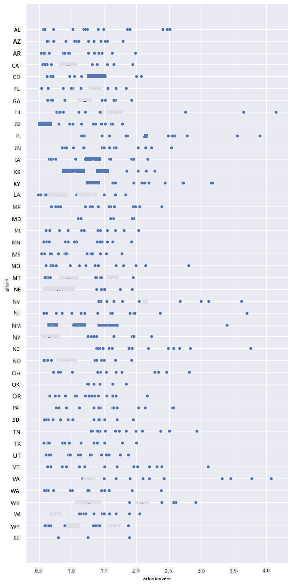
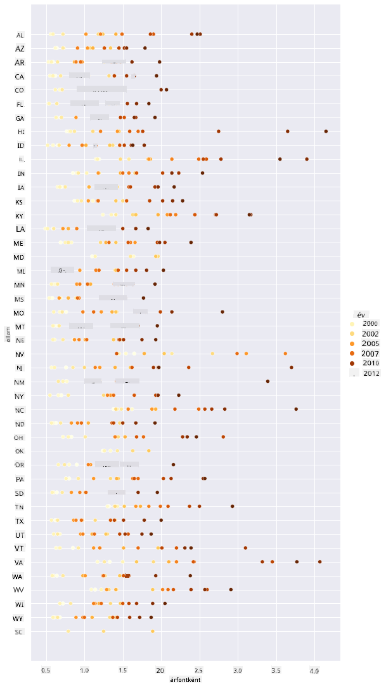
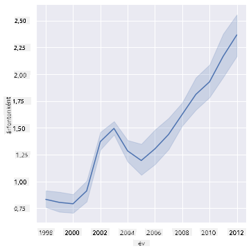
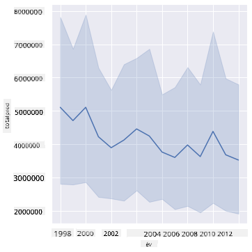
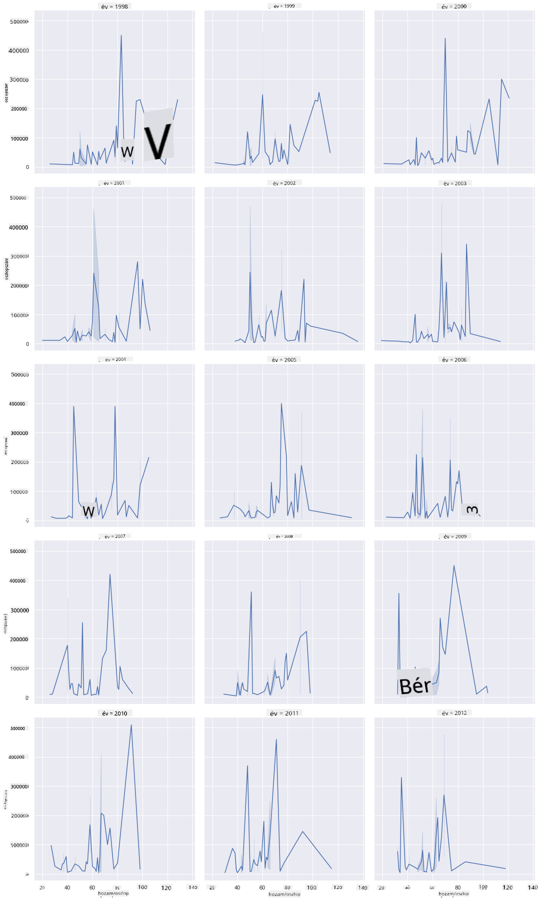
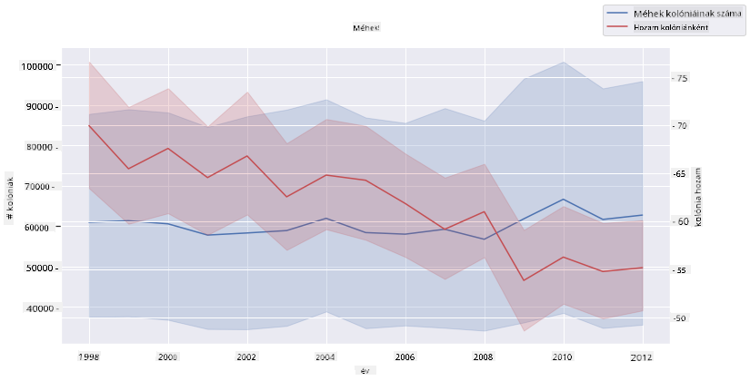

<!--
CO_OP_TRANSLATOR_METADATA:
{
  "original_hash": "0764fd4077f3f04a1d968ec371227744",
  "translation_date": "2025-09-06T11:45:02+00:00",
  "source_file": "3-Data-Visualization/12-visualization-relationships/README.md",
  "language_code": "hu"
}
-->
# Kapcsolatok vizualizálása: Minden a mézről 🍯

| ](../../sketchnotes/12-Visualizing-Relationships.png)|
|:---:|
|Kapcsolatok vizualizálása - _Sketchnote by [@nitya](https://twitter.com/nitya)_ |

Folytatva kutatásunk természetközpontú fókuszát, fedezzünk fel érdekes vizualizációkat, amelyek bemutatják a különböző mézfajták közötti kapcsolatokat egy, az [Amerikai Mezőgazdasági Minisztérium](https://www.nass.usda.gov/About_NASS/index.php) által összeállított adatbázis alapján.

Ez az adatbázis körülbelül 600 tételt tartalmaz, és az Egyesült Államok különböző államaiban történő méztermelést mutatja be. Például megvizsgálhatjuk az államok méhcsaládjainak számát, a családonkénti hozamot, a teljes termelést, a készleteket, az árakat fontonként, valamint a termelt méz értékét 1998 és 2012 között, évente egy sorral minden államra vonatkozóan.

Érdekes lehet vizualizálni egy adott állam éves termelése és például az adott állam mézének ára közötti kapcsolatot. Alternatívaként megvizsgálhatjuk az államok családonkénti mézhozamának kapcsolatát. Ez az időszak magában foglalja a pusztító 'CCD' vagy 'Colony Collapse Disorder' (méhcsalád összeomlási rendellenesség) első megjelenését 2006-ban (http://npic.orst.edu/envir/ccd.html), így ez egy különösen érdekes adatbázis a tanulmányozáshoz. 🐝

## [Előadás előtti kvíz](https://ff-quizzes.netlify.app/en/ds/quiz/22)

Ebben a leckében használhatod a Seaborn könyvtárat, amelyet korábban már használtál, hogy vizualizáld a változók közötti kapcsolatokat. Különösen érdekes a Seaborn `relplot` függvénye, amely lehetővé teszi szórásdiagramok és vonaldiagramok gyors létrehozását a '[statisztikai kapcsolatok](https://seaborn.pydata.org/tutorial/relational.html?highlight=relationships)' vizualizálására, amelyek segítenek az adatelemzőnek jobban megérteni, hogyan viszonyulnak egymáshoz a változók.

## Szórásdiagramok

Használj szórásdiagramot annak bemutatására, hogyan változott a méz ára évről évre, államonként. A Seaborn `relplot` függvényével kényelmesen csoportosíthatod az államok adatait, és megjelenítheted az adatpontokat mind kategóriák, mind numerikus adatok esetében.

Kezdjük az adatok és a Seaborn importálásával:

```python
import pandas as pd
import matplotlib.pyplot as plt
import seaborn as sns
honey = pd.read_csv('../../data/honey.csv')
honey.head()
```
Láthatod, hogy a mézadatok számos érdekes oszlopot tartalmaznak, például az évet és az árakat fontonként. Fedezzük fel ezeket az adatokat, csoportosítva az Egyesült Államok államai szerint:

| állam | numcol | yieldpercol | totalprod | stocks   | priceperlb | prodvalue | év   |
| ----- | ------ | ----------- | --------- | -------- | ---------- | --------- | ---- |
| AL    | 16000  | 71          | 1136000   | 159000   | 0.72       | 818000    | 1998 |
| AZ    | 55000  | 60          | 3300000   | 1485000  | 0.64       | 2112000   | 1998 |
| AR    | 53000  | 65          | 3445000   | 1688000  | 0.59       | 2033000   | 1998 |
| CA    | 450000 | 83          | 37350000  | 12326000 | 0.62       | 23157000  | 1998 |
| CO    | 27000  | 72          | 1944000   | 1594000  | 0.7        | 1361000   | 1998 |

Készíts egy alap szórásdiagramot, amely bemutatja a méz fontonkénti ára és az Egyesült Államok államai közötti kapcsolatot. Állítsd be az `y` tengelyt elég magasra, hogy minden állam látható legyen:

```python
sns.relplot(x="priceperlb", y="state", data=honey, height=15, aspect=.5);
```


Most mutasd meg ugyanazt az adatot méz színvilággal, hogy bemutasd, hogyan változik az ár az évek során. Ezt úgy teheted meg, hogy hozzáadsz egy 'hue' paramétert, amely az évről évre történő változást mutatja:

> ✅ Tudj meg többet a [Seaborn színpalettáiról](https://seaborn.pydata.org/tutorial/color_palettes.html) - próbálj ki egy gyönyörű szivárvány színvilágot!

```python
sns.relplot(x="priceperlb", y="state", hue="year", palette="YlOrBr", data=honey, height=15, aspect=.5);
```


Ezzel a színvilág változtatással egyértelműen látható az évek során a méz fontonkénti árának erős növekedése. Valóban, ha az adatok egy mintáját megvizsgálod (például Arizona államot), láthatod az árak évről évre történő növekedésének mintázatát, néhány kivétellel:

| állam | numcol | yieldpercol | totalprod | stocks  | priceperlb | prodvalue | év   |
| ----- | ------ | ----------- | --------- | ------- | ---------- | --------- | ---- |
| AZ    | 55000  | 60          | 3300000   | 1485000 | 0.64       | 2112000   | 1998 |
| AZ    | 52000  | 62          | 3224000   | 1548000 | 0.62       | 1999000   | 1999 |
| AZ    | 40000  | 59          | 2360000   | 1322000 | 0.73       | 1723000   | 2000 |
| AZ    | 43000  | 59          | 2537000   | 1142000 | 0.72       | 1827000   | 2001 |
| AZ    | 38000  | 63          | 2394000   | 1197000 | 1.08       | 2586000   | 2002 |
| AZ    | 35000  | 72          | 2520000   | 983000  | 1.34       | 3377000   | 2003 |
| AZ    | 32000  | 55          | 1760000   | 774000  | 1.11       | 1954000   | 2004 |
| AZ    | 36000  | 50          | 1800000   | 720000  | 1.04       | 1872000   | 2005 |
| AZ    | 30000  | 65          | 1950000   | 839000  | 0.91       | 1775000   | 2006 |
| AZ    | 30000  | 64          | 1920000   | 902000  | 1.26       | 2419000   | 2007 |
| AZ    | 25000  | 64          | 1600000   | 336000  | 1.26       | 2016000   | 2008 |
| AZ    | 20000  | 52          | 1040000   | 562000  | 1.45       | 1508000   | 2009 |
| AZ    | 24000  | 77          | 1848000   | 665000  | 1.52       | 2809000   | 2010 |
| AZ    | 23000  | 53          | 1219000   | 427000  | 1.55       | 1889000   | 2011 |
| AZ    | 22000  | 46          | 1012000   | 253000  | 1.79       | 1811000   | 2012 |

Egy másik módja ennek a növekedésnek a vizualizálására a méret használata a szín helyett. Színvak felhasználók számára ez jobb opció lehet. Módosítsd a vizualizációt úgy, hogy az ár növekedését a pontok körméretének növekedésével mutasd:

```python
sns.relplot(x="priceperlb", y="state", size="year", data=honey, height=15, aspect=.5);
```
Láthatod, hogy a pontok mérete fokozatosan növekszik.


Ez egyszerűen a kereslet és kínálat esete? Az olyan tényezők, mint az éghajlatváltozás és a méhcsalád összeomlása miatt kevesebb méz áll rendelkezésre évről évre, és ezért nő az ára?

Ahhoz, hogy felfedezzük az adatokban lévő változók közötti korrelációt, nézzünk meg néhány vonaldiagramot.

## Vonaldiagramok

Kérdés: Van-e egyértelmű növekedés a méz fontonkénti árának évről évre? Ezt legegyszerűbben egyetlen vonaldiagrammal fedezheted fel:

```python
sns.relplot(x="year", y="priceperlb", kind="line", data=honey);
```
Válasz: Igen, néhány kivétellel 2003 körül:



✅ Mivel a Seaborn egyetlen vonal köré aggregálja az adatokat, "az x értékeknél lévő többszörös méréseket az átlag és az átlag körüli 95%-os konfidencia intervallum megjelenítésével ábrázolja". [Forrás](https://seaborn.pydata.org/tutorial/relational.html). Ez az időigényes viselkedés kikapcsolható a `ci=None` hozzáadásával.

Kérdés: Nos, 2003-ban láthatunk-e egy ugrást a mézkínálatban? Mi történik, ha megnézzük a teljes termelést évről évre?

```python
sns.relplot(x="year", y="totalprod", kind="line", data=honey);
```



Válasz: Nem igazán. Ha megnézzük a teljes termelést, úgy tűnik, hogy az adott évben valójában növekedett, bár általánosságban a méztermelés csökkenő tendenciát mutat ezekben az években.

Kérdés: Ebben az esetben mi okozhatta a méz árának ugrását 2003 körül?

Ennek felfedezéséhez használhatunk egy facet gridet.

## Facet grid-ek

A facet grid-ek az adatbázis egy aspektusát veszik alapul (esetünkben választhatjuk az 'évet', hogy elkerüljük a túl sok grid létrehozását). A Seaborn ezután egy-egy diagramot készít az általad választott x és y koordináták alapján, megkönnyítve az összehasonlítást. Kitűnik-e 2003 ebben a típusú összehasonlításban?

Készíts egy facet gridet a Seaborn dokumentációja által ajánlott `relplot` használatával ([Forrás](https://seaborn.pydata.org/generated/seaborn.FacetGrid.html?highlight=facetgrid#seaborn.FacetGrid)).

```python
sns.relplot(
    data=honey, 
    x="yieldpercol", y="numcol",
    col="year", 
    col_wrap=3,
    kind="line"
    )
```
Ebben a vizualizációban összehasonlíthatod a családonkénti hozamot és a méhcsaládok számát évről évre, egymás mellett, 3 oszlopos elrendezéssel:



Ebben az adatbázisban semmi különös nem tűnik ki a méhcsaládok számával és hozamával kapcsolatban évről évre és államonként. Van-e más módja annak, hogy korrelációt találjunk e két változó között?

## Kettős vonaldiagramok

Próbálj ki egy többsoros diagramot, amely két vonaldiagramot helyez egymásra, a Seaborn 'despine' funkciójával eltávolítva a felső és jobb oldali kereteket, valamint az `ax.twinx` használatával [Matplotlibből származó funkció](https://matplotlib.org/stable/api/_as_gen/matplotlib.axes.Axes.twinx.html). A Twinx lehetővé teszi, hogy egy diagram megossza az x tengelyt, és két y tengelyt jelenítsen meg. Tehát ábrázold a családonkénti hozamot és a méhcsaládok számát egymásra helyezve:

```python
fig, ax = plt.subplots(figsize=(12,6))
lineplot = sns.lineplot(x=honey['year'], y=honey['numcol'], data=honey, 
                        label = 'Number of bee colonies', legend=False)
sns.despine()
plt.ylabel('# colonies')
plt.title('Honey Production Year over Year');

ax2 = ax.twinx()
lineplot2 = sns.lineplot(x=honey['year'], y=honey['yieldpercol'], ax=ax2, color="r", 
                         label ='Yield per colony', legend=False) 
sns.despine(right=False)
plt.ylabel('colony yield')
ax.figure.legend();
```


Bár semmi különös nem tűnik ki 2003 körül, ez lehetőséget ad arra, hogy egy kicsit pozitívabb hangvétellel zárjuk a leckét: bár a méhcsaládok száma általánosságban csökken, a méhcsaládok száma stabilizálódik, még ha a családonkénti hozam csökken is.

Hajrá, méhek, hajrá!

🐝❤️
## 🚀 Kihívás

Ebben a leckében többet tanultál a szórásdiagramok és vonalhálók, köztük a facet grid-ek használatáról. Kihívásként készíts egy facet gridet egy másik adatbázis alapján, talán olyat, amelyet korábban használtál ezekben a leckékben. Jegyezd meg, mennyi időbe telik elkészíteni, és légy óvatos, hogy hány gridet kell rajzolnod ezekkel a technikákkal.

## [Előadás utáni kvíz](https://ff-quizzes.netlify.app/en/ds/quiz/23)

## Áttekintés és önálló tanulás

A vonaldiagramok lehetnek egyszerűek vagy meglehetősen összetettek. Olvass egy kicsit a [Seaborn dokumentációjában](https://seaborn.pydata.org/generated/seaborn.lineplot.html) a különböző módokról, ahogyan ezeket felépítheted. Próbáld meg továbbfejleszteni az ebben a leckében készített vonaldiagramokat a dokumentációban felsorolt egyéb módszerekkel.
## Feladat

[Merülj el a méhkasban](assignment.md)

---

**Felelősségkizárás**:  
Ez a dokumentum az [Co-op Translator](https://github.com/Azure/co-op-translator) AI fordítási szolgáltatás segítségével készült. Bár törekszünk a pontosságra, kérjük, vegye figyelembe, hogy az automatikus fordítások hibákat vagy pontatlanságokat tartalmazhatnak. Az eredeti dokumentum az eredeti nyelvén tekintendő hiteles forrásnak. Kritikus információk esetén javasolt a professzionális, emberi fordítás igénybevétele. Nem vállalunk felelősséget a fordítás használatából eredő félreértésekért vagy téves értelmezésekért.