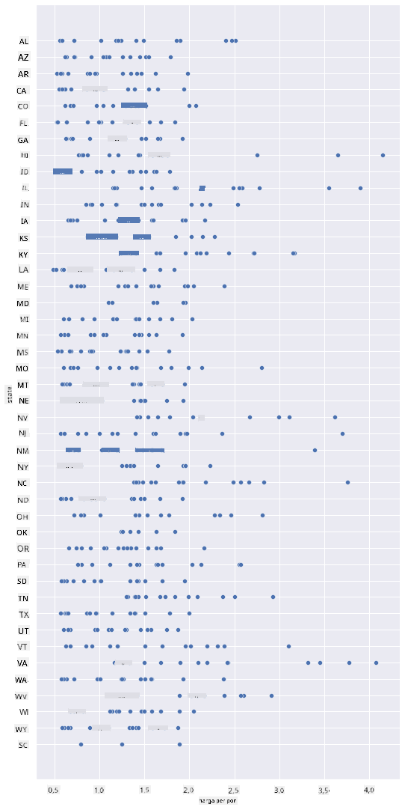
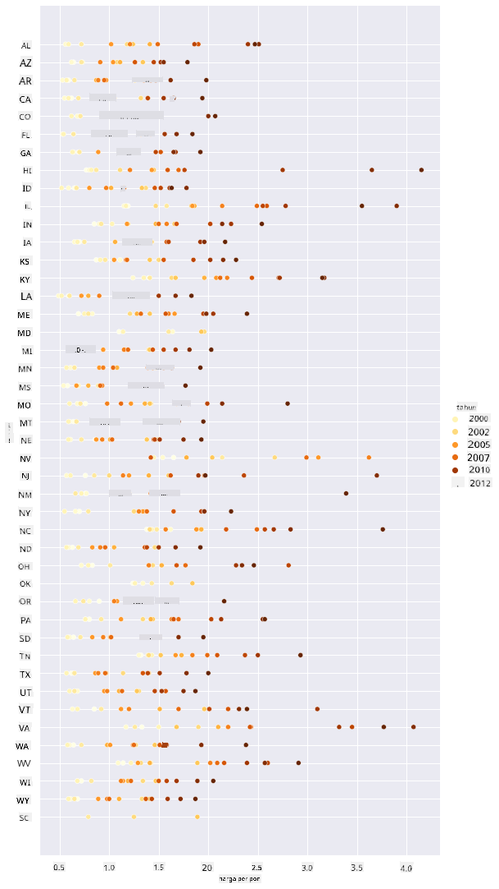
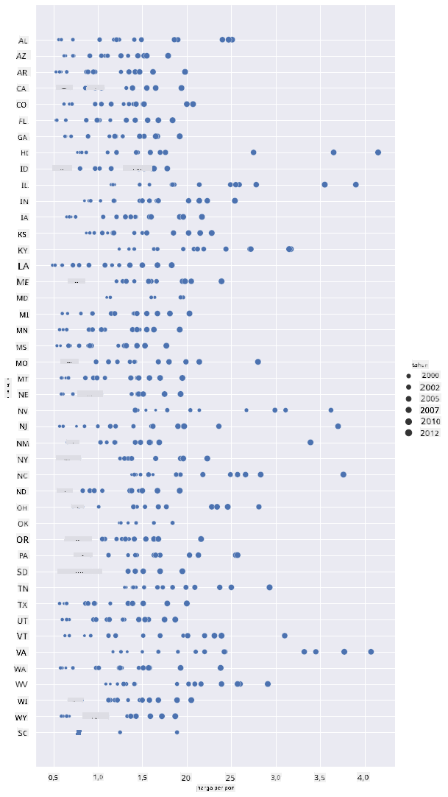
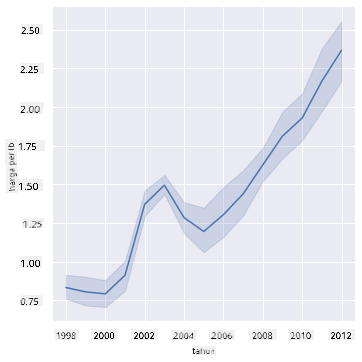
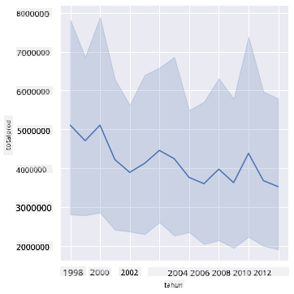
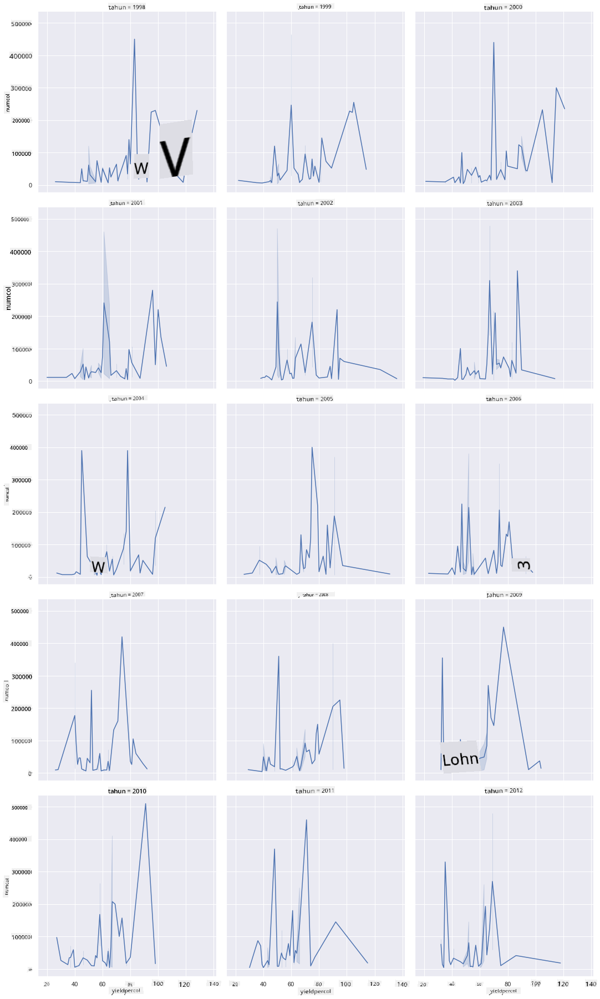
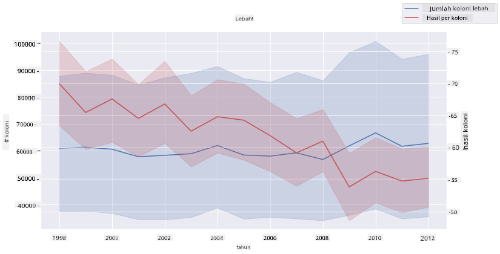

<!--
CO_OP_TRANSLATOR_METADATA:
{
  "original_hash": "b29e427401499e81f4af55a8c4afea76",
  "translation_date": "2025-09-04T20:38:24+00:00",
  "source_file": "3-Data-Visualization/12-visualization-relationships/README.md",
  "language_code": "id"
}
-->
# Memvisualisasikan Hubungan: Semua Tentang Madu 🍯

| ](../../sketchnotes/12-Visualizing-Relationships.png)|
|:---:|
|Memvisualisasikan Hubungan - _Sketchnote oleh [@nitya](https://twitter.com/nitya)_ |

Melanjutkan fokus penelitian kita pada alam, mari kita temukan visualisasi menarik untuk menunjukkan hubungan antara berbagai jenis madu, berdasarkan dataset yang diambil dari [Departemen Pertanian Amerika Serikat](https://www.nass.usda.gov/About_NASS/index.php).

Dataset ini, yang terdiri dari sekitar 600 item, menampilkan produksi madu di banyak negara bagian AS. Sebagai contoh, Anda dapat melihat jumlah koloni, hasil per koloni, total produksi, stok, harga per pon, dan nilai madu yang dihasilkan di negara bagian tertentu dari tahun 1998-2012, dengan satu baris per tahun untuk setiap negara bagian.

Akan menarik untuk memvisualisasikan hubungan antara produksi tahunan suatu negara bagian dan, misalnya, harga madu di negara bagian tersebut. Atau, Anda dapat memvisualisasikan hubungan antara hasil madu per koloni di berbagai negara bagian. Rentang tahun ini mencakup periode 'CCD' atau 'Colony Collapse Disorder' yang pertama kali terlihat pada tahun 2006 (http://npic.orst.edu/envir/ccd.html), sehingga dataset ini menjadi bahan studi yang menarik. 🐝

## [Kuis Pra-Pelajaran](https://purple-hill-04aebfb03.1.azurestaticapps.net/quiz/22)

Dalam pelajaran ini, Anda dapat menggunakan Seaborn, yang telah Anda gunakan sebelumnya, sebagai pustaka yang baik untuk memvisualisasikan hubungan antar variabel. Yang sangat menarik adalah penggunaan fungsi `relplot` dari Seaborn yang memungkinkan scatter plot dan line plot untuk dengan cepat memvisualisasikan '[hubungan statistik](https://seaborn.pydata.org/tutorial/relational.html?highlight=relationships)', yang memungkinkan data scientist untuk lebih memahami bagaimana variabel saling berhubungan.

## Scatterplot

Gunakan scatterplot untuk menunjukkan bagaimana harga madu berkembang dari tahun ke tahun di setiap negara bagian. Seaborn, dengan menggunakan `relplot`, secara praktis mengelompokkan data negara bagian dan menampilkan titik data untuk data kategoris dan numerik.

Mari kita mulai dengan mengimpor data dan Seaborn:

```python
import pandas as pd
import matplotlib.pyplot as plt
import seaborn as sns
honey = pd.read_csv('../../data/honey.csv')
honey.head()
```
Anda akan melihat bahwa data madu memiliki beberapa kolom menarik, termasuk tahun dan harga per pon. Mari kita eksplorasi data ini, dikelompokkan berdasarkan negara bagian AS:

| state | numcol | yieldpercol | totalprod | stocks   | priceperlb | prodvalue | year |
| ----- | ------ | ----------- | --------- | -------- | ---------- | --------- | ---- |
| AL    | 16000  | 71          | 1136000   | 159000   | 0.72       | 818000    | 1998 |
| AZ    | 55000  | 60          | 3300000   | 1485000  | 0.64       | 2112000   | 1998 |
| AR    | 53000  | 65          | 3445000   | 1688000  | 0.59       | 2033000   | 1998 |
| CA    | 450000 | 83          | 37350000  | 12326000 | 0.62       | 23157000  | 1998 |
| CO    | 27000  | 72          | 1944000   | 1594000  | 0.7        | 1361000   | 1998 |

Buat scatterplot dasar untuk menunjukkan hubungan antara harga per pon madu dan asal negara bagian AS. Buat sumbu `y` cukup tinggi untuk menampilkan semua negara bagian:

```python
sns.relplot(x="priceperlb", y="state", data=honey, height=15, aspect=.5);
```


Sekarang, tampilkan data yang sama dengan skema warna madu untuk menunjukkan bagaimana harga berkembang dari tahun ke tahun. Anda dapat melakukannya dengan menambahkan parameter 'hue' untuk menunjukkan perubahan dari tahun ke tahun:

> ✅ Pelajari lebih lanjut tentang [palet warna yang dapat Anda gunakan di Seaborn](https://seaborn.pydata.org/tutorial/color_palettes.html) - coba skema warna pelangi yang indah!

```python
sns.relplot(x="priceperlb", y="state", hue="year", palette="YlOrBr", data=honey, height=15, aspect=.5);
```


Dengan perubahan skema warna ini, Anda dapat melihat bahwa ada perkembangan yang jelas dari tahun ke tahun dalam hal harga madu per pon. Memang, jika Anda melihat satu set sampel dalam data untuk memverifikasi (pilih satu negara bagian, misalnya Arizona), Anda dapat melihat pola kenaikan harga dari tahun ke tahun, dengan beberapa pengecualian:

| state | numcol | yieldpercol | totalprod | stocks  | priceperlb | prodvalue | year |
| ----- | ------ | ----------- | --------- | ------- | ---------- | --------- | ---- |
| AZ    | 55000  | 60          | 3300000   | 1485000 | 0.64       | 2112000   | 1998 |
| AZ    | 52000  | 62          | 3224000   | 1548000 | 0.62       | 1999000   | 1999 |
| AZ    | 40000  | 59          | 2360000   | 1322000 | 0.73       | 1723000   | 2000 |
| AZ    | 43000  | 59          | 2537000   | 1142000 | 0.72       | 1827000   | 2001 |
| AZ    | 38000  | 63          | 2394000   | 1197000 | 1.08       | 2586000   | 2002 |
| AZ    | 35000  | 72          | 2520000   | 983000  | 1.34       | 3377000   | 2003 |
| AZ    | 32000  | 55          | 1760000   | 774000  | 1.11       | 1954000   | 2004 |
| AZ    | 36000  | 50          | 1800000   | 720000  | 1.04       | 1872000   | 2005 |
| AZ    | 30000  | 65          | 1950000   | 839000  | 0.91       | 1775000   | 2006 |
| AZ    | 30000  | 64          | 1920000   | 902000  | 1.26       | 2419000   | 2007 |
| AZ    | 25000  | 64          | 1600000   | 336000  | 1.26       | 2016000   | 2008 |
| AZ    | 20000  | 52          | 1040000   | 562000  | 1.45       | 1508000   | 2009 |
| AZ    | 24000  | 77          | 1848000   | 665000  | 1.52       | 2809000   | 2010 |
| AZ    | 23000  | 53          | 1219000   | 427000  | 1.55       | 1889000   | 2011 |
| AZ    | 22000  | 46          | 1012000   | 253000  | 1.79       | 1811000   | 2012 |

Cara lain untuk memvisualisasikan perkembangan ini adalah dengan menggunakan ukuran, bukan warna. Untuk pengguna yang buta warna, ini mungkin menjadi opsi yang lebih baik. Edit visualisasi Anda untuk menunjukkan kenaikan harga dengan peningkatan ukuran lingkaran:

```python
sns.relplot(x="priceperlb", y="state", size="year", data=honey, height=15, aspect=.5);
```
Anda dapat melihat ukuran titik yang secara bertahap meningkat.



Apakah ini hanya kasus sederhana dari hukum penawaran dan permintaan? Karena faktor seperti perubahan iklim dan keruntuhan koloni, apakah madu yang tersedia untuk dibeli semakin sedikit dari tahun ke tahun, sehingga harga meningkat?

Untuk menemukan korelasi antara beberapa variabel dalam dataset ini, mari kita eksplorasi beberapa grafik garis.

## Grafik Garis

Pertanyaan: Apakah ada kenaikan harga madu per pon yang jelas dari tahun ke tahun? Anda dapat dengan mudah menemukannya dengan membuat grafik garis tunggal:

```python
sns.relplot(x="year", y="priceperlb", kind="line", data=honey);
```
Jawaban: Ya, dengan beberapa pengecualian di sekitar tahun 2003:



✅ Karena Seaborn mengagregasi data di sekitar satu garis, ia menampilkan "pengukuran ganda pada setiap nilai x dengan memplot rata-rata dan interval kepercayaan 95% di sekitar rata-rata". [Sumber](https://seaborn.pydata.org/tutorial/relational.html). Perilaku yang memakan waktu ini dapat dinonaktifkan dengan menambahkan `ci=None`.

Pertanyaan: Nah, pada tahun 2003 apakah kita juga melihat lonjakan pasokan madu? Bagaimana jika Anda melihat total produksi dari tahun ke tahun?

```python
sns.relplot(x="year", y="totalprod", kind="line", data=honey);
```



Jawaban: Tidak juga. Jika Anda melihat total produksi, sebenarnya tampaknya meningkat pada tahun tersebut, meskipun secara umum jumlah madu yang diproduksi menurun selama tahun-tahun ini.

Pertanyaan: Dalam hal ini, apa yang bisa menyebabkan lonjakan harga madu di sekitar tahun 2003?

Untuk menemukan ini, Anda dapat mengeksplorasi facet grid.

## Facet Grid

Facet grid mengambil satu aspek dari dataset Anda (dalam kasus ini, Anda dapat memilih 'tahun' untuk menghindari terlalu banyak facet yang dihasilkan). Seaborn kemudian dapat membuat plot untuk masing-masing aspek tersebut dari koordinat x dan y yang Anda pilih untuk perbandingan visual yang lebih mudah. Apakah tahun 2003 menonjol dalam jenis perbandingan ini?

Buat facet grid dengan terus menggunakan `relplot` seperti yang direkomendasikan oleh [dokumentasi Seaborn](https://seaborn.pydata.org/generated/seaborn.FacetGrid.html?highlight=facetgrid#seaborn.FacetGrid).

```python
sns.relplot(
    data=honey, 
    x="yieldpercol", y="numcol",
    col="year", 
    col_wrap=3,
    kind="line"
```
Dalam visualisasi ini, Anda dapat membandingkan hasil per koloni dan jumlah koloni dari tahun ke tahun, berdampingan dengan pengaturan wrap pada 3 untuk kolom:



Untuk dataset ini, tidak ada yang secara khusus menonjol terkait jumlah koloni dan hasilnya, dari tahun ke tahun dan negara bagian ke negara bagian. Apakah ada cara lain untuk menemukan korelasi antara kedua variabel ini?

## Grafik Garis Ganda

Cobalah grafik multiline dengan menumpangkan dua grafik garis satu di atas yang lain, menggunakan 'despine' dari Seaborn untuk menghapus spines atas dan kanan, dan menggunakan `ax.twinx` [berasal dari Matplotlib](https://matplotlib.org/stable/api/_as_gen/matplotlib.axes.Axes.twinx.html). Twinx memungkinkan grafik untuk berbagi sumbu x dan menampilkan dua sumbu y. Jadi, tampilkan hasil per koloni dan jumlah koloni, ditumpangkan:

```python
fig, ax = plt.subplots(figsize=(12,6))
lineplot = sns.lineplot(x=honey['year'], y=honey['numcol'], data=honey, 
                        label = 'Number of bee colonies', legend=False)
sns.despine()
plt.ylabel('# colonies')
plt.title('Honey Production Year over Year');

ax2 = ax.twinx()
lineplot2 = sns.lineplot(x=honey['year'], y=honey['yieldpercol'], ax=ax2, color="r", 
                         label ='Yield per colony', legend=False) 
sns.despine(right=False)
plt.ylabel('colony yield')
ax.figure.legend();
```


Meskipun tidak ada yang mencolok di sekitar tahun 2003, ini memungkinkan kita untuk mengakhiri pelajaran ini dengan catatan yang sedikit lebih positif: meskipun jumlah koloni secara keseluruhan menurun, jumlah koloni mulai stabil meskipun hasil per koloni menurun.

Semangat, lebah! 🐝❤️

## 🚀 Tantangan

Dalam pelajaran ini, Anda belajar lebih banyak tentang penggunaan scatterplot dan line grid, termasuk facet grid. Tantang diri Anda untuk membuat facet grid menggunakan dataset yang berbeda, mungkin yang telah Anda gunakan sebelumnya dalam pelajaran ini. Perhatikan berapa lama waktu yang dibutuhkan untuk membuatnya dan bagaimana Anda perlu berhati-hati tentang jumlah grid yang perlu Anda gambar menggunakan teknik ini.

## [Kuis Pasca-Pelajaran](https://ff-quizzes.netlify.app/en/ds/)

## Tinjauan & Studi Mandiri

Grafik garis bisa sederhana atau cukup kompleks. Lakukan sedikit pembacaan di [dokumentasi Seaborn](https://seaborn.pydata.org/generated/seaborn.lineplot.html) tentang berbagai cara Anda dapat membangunnya. Cobalah untuk meningkatkan grafik garis yang Anda buat dalam pelajaran ini dengan metode lain yang tercantum dalam dokumentasi.

## Tugas

[Masuk ke sarang lebah](assignment.md)

---

**Penafian**:  
Dokumen ini telah diterjemahkan menggunakan layanan terjemahan AI [Co-op Translator](https://github.com/Azure/co-op-translator). Meskipun kami berupaya untuk memberikan hasil yang akurat, harap diperhatikan bahwa terjemahan otomatis mungkin mengandung kesalahan atau ketidakakuratan. Dokumen asli dalam bahasa aslinya harus dianggap sebagai sumber yang berwenang. Untuk informasi yang bersifat kritis, disarankan menggunakan jasa terjemahan manusia profesional. Kami tidak bertanggung jawab atas kesalahpahaman atau penafsiran yang keliru yang timbul dari penggunaan terjemahan ini.