<!--
CO_OP_TRANSLATOR_METADATA:
{
  "original_hash": "39f3b3a9d873eaa522c2e792ce0ca503",
  "translation_date": "2025-09-04T20:30:13+00:00",
  "source_file": "5-Data-Science-In-Cloud/18-Low-Code/README.md",
  "language_code": "id"
}
-->
# Data Science di Cloud: Cara "Low code/No code"

| ](../../sketchnotes/18-DataScience-Cloud.png)|
|:---:|
| Data Science di Cloud: Low Code - _Sketchnote oleh [@nitya](https://twitter.com/nitya)_ |

Daftar isi:

- [Data Science di Cloud: Cara "Low code/No code"](../../../../5-Data-Science-In-Cloud/18-Low-Code)
  - [Kuis Pra-Pelajaran](../../../../5-Data-Science-In-Cloud/18-Low-Code)
  - [1. Pendahuluan](../../../../5-Data-Science-In-Cloud/18-Low-Code)
    - [1.1 Apa itu Azure Machine Learning?](../../../../5-Data-Science-In-Cloud/18-Low-Code)
    - [1.2 Proyek Prediksi Gagal Jantung:](../../../../5-Data-Science-In-Cloud/18-Low-Code)
    - [1.3 Dataset Gagal Jantung:](../../../../5-Data-Science-In-Cloud/18-Low-Code)
  - [2. Pelatihan model dengan Low code/No code di Azure ML Studio](../../../../5-Data-Science-In-Cloud/18-Low-Code)
    - [2.1 Membuat workspace Azure ML](../../../../5-Data-Science-In-Cloud/18-Low-Code)
    - [2.2 Sumber Daya Komputasi](../../../../5-Data-Science-In-Cloud/18-Low-Code)
      - [2.2.1 Memilih opsi yang tepat untuk sumber daya komputasi](../../../../5-Data-Science-In-Cloud/18-Low-Code)
      - [2.2.2 Membuat cluster komputasi](../../../../5-Data-Science-In-Cloud/18-Low-Code)
    - [2.3 Memuat Dataset](../../../../5-Data-Science-In-Cloud/18-Low-Code)
    - [2.4 Pelatihan Low code/No code dengan AutoML](../../../../5-Data-Science-In-Cloud/18-Low-Code)
  - [3. Deployment model dengan Low code/No code dan konsumsi endpoint](../../../../5-Data-Science-In-Cloud/18-Low-Code)
    - [3.1 Deployment model](../../../../5-Data-Science-In-Cloud/18-Low-Code)
    - [3.2 Konsumsi endpoint](../../../../5-Data-Science-In-Cloud/18-Low-Code)
  - [🚀 Tantangan](../../../../5-Data-Science-In-Cloud/18-Low-Code)
  - [Kuis Pasca-Pelajaran](../../../../5-Data-Science-In-Cloud/18-Low-Code)
  - [Ulasan & Studi Mandiri](../../../../5-Data-Science-In-Cloud/18-Low-Code)
  - [Tugas](../../../../5-Data-Science-In-Cloud/18-Low-Code)
  
## [Kuis Pra-Pelajaran](https://ff-quizzes.netlify.app/en/ds/)

## 1. Pendahuluan
### 1.1 Apa itu Azure Machine Learning?

Platform cloud Azure terdiri dari lebih dari 200 produk dan layanan cloud yang dirancang untuk membantu Anda menciptakan solusi baru. Data scientist menghabiskan banyak waktu untuk mengeksplorasi dan memproses data, serta mencoba berbagai jenis algoritma pelatihan model untuk menghasilkan model yang akurat. Tugas-tugas ini memakan waktu dan sering kali tidak efisien dalam penggunaan perangkat keras komputasi yang mahal.

[Azure ML](https://docs.microsoft.com/azure/machine-learning/overview-what-is-azure-machine-learning?WT.mc_id=academic-77958-bethanycheum&ocid=AID3041109) adalah platform berbasis cloud untuk membangun dan mengoperasikan solusi machine learning di Azure. Platform ini mencakup berbagai fitur dan kemampuan yang membantu data scientist mempersiapkan data, melatih model, mempublikasikan layanan prediktif, dan memantau penggunaannya. Yang paling penting, Azure ML meningkatkan efisiensi dengan mengotomatisasi banyak tugas yang memakan waktu dalam pelatihan model, serta memungkinkan penggunaan sumber daya komputasi berbasis cloud yang dapat diskalakan untuk menangani volume data besar dengan biaya hanya saat digunakan.

Azure ML menyediakan semua alat yang dibutuhkan pengembang dan data scientist untuk alur kerja machine learning mereka, termasuk:

- **Azure Machine Learning Studio**: portal web di Azure Machine Learning untuk opsi low-code dan no-code dalam pelatihan model, deployment, otomatisasi, pelacakan, dan manajemen aset. Studio ini terintegrasi dengan Azure Machine Learning SDK untuk pengalaman yang mulus.
- **Jupyter Notebooks**: prototipe cepat dan pengujian model ML.
- **Azure Machine Learning Designer**: memungkinkan drag-and-drop modul untuk membangun eksperimen dan kemudian mendistribusikan pipeline dalam lingkungan low-code.
- **UI Automated machine learning (AutoML)**: mengotomatisasi tugas iteratif dalam pengembangan model machine learning, memungkinkan pembuatan model ML dengan skala tinggi, efisiensi, dan produktivitas, sambil mempertahankan kualitas model.
- **Pelabelan Data**: alat ML yang dibantu untuk secara otomatis melabeli data.
- **Ekstensi machine learning untuk Visual Studio Code**: menyediakan lingkungan pengembangan lengkap untuk membangun dan mengelola proyek ML.
- **CLI machine learning**: menyediakan perintah untuk mengelola sumber daya Azure ML dari command line.
- **Integrasi dengan framework open-source** seperti PyTorch, TensorFlow, Scikit-learn, dan banyak lagi untuk pelatihan, deployment, dan pengelolaan proses machine learning end-to-end.
- **MLflow**: pustaka open-source untuk mengelola siklus hidup eksperimen machine learning Anda. **MLFlow Tracking** adalah komponen MLflow yang mencatat dan melacak metrik pelatihan dan artefak model Anda, terlepas dari lingkungan eksperimen Anda.

### 1.2 Proyek Prediksi Gagal Jantung:

Tidak diragukan lagi bahwa membuat dan membangun proyek adalah cara terbaik untuk menguji keterampilan dan pengetahuan Anda. Dalam pelajaran ini, kita akan mengeksplorasi dua cara berbeda untuk membangun proyek data science untuk prediksi serangan gagal jantung di Azure ML Studio, melalui Low code/No code dan melalui Azure ML SDK seperti yang ditunjukkan dalam skema berikut:

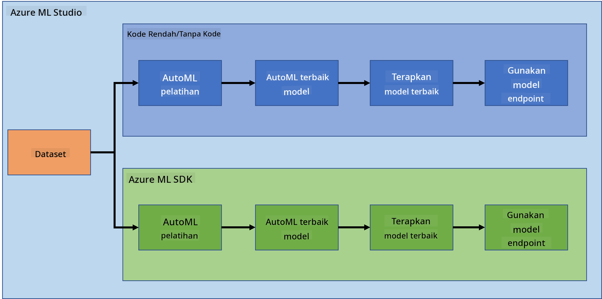

Setiap cara memiliki kelebihan dan kekurangannya masing-masing. Cara Low code/No code lebih mudah untuk memulai karena melibatkan interaksi dengan GUI (Graphical User Interface), tanpa memerlukan pengetahuan kode sebelumnya. Metode ini memungkinkan pengujian cepat kelayakan proyek dan pembuatan POC (Proof Of Concept). Namun, saat proyek berkembang dan perlu siap untuk produksi, tidak memungkinkan untuk membuat sumber daya melalui GUI. Kita perlu mengotomatisasi semuanya secara programatik, mulai dari pembuatan sumber daya hingga deployment model. Di sinilah pentingnya mengetahui cara menggunakan Azure ML SDK.

|                   | Low code/No code | Azure ML SDK              |
|-------------------|------------------|---------------------------|
| Keahlian kode     | Tidak diperlukan | Diperlukan                |
| Waktu pengembangan| Cepat dan mudah  | Bergantung pada keahlian  |
| Siap produksi     | Tidak            | Ya                        |

### 1.3 Dataset Gagal Jantung: 

Penyakit kardiovaskular (CVD) adalah penyebab utama kematian secara global, menyumbang 31% dari semua kematian di seluruh dunia. Faktor risiko lingkungan dan perilaku seperti penggunaan tembakau, pola makan tidak sehat dan obesitas, kurangnya aktivitas fisik, serta penggunaan alkohol yang berlebihan dapat digunakan sebagai fitur untuk model estimasi. Kemampuan untuk memperkirakan kemungkinan perkembangan CVD dapat sangat berguna untuk mencegah serangan pada orang dengan risiko tinggi.

Kaggle telah menyediakan [Dataset Gagal Jantung](https://www.kaggle.com/andrewmvd/heart-failure-clinical-data) secara publik, yang akan kita gunakan untuk proyek ini. Anda dapat mengunduh dataset sekarang. Dataset ini berbentuk tabular dengan 13 kolom (12 fitur dan 1 variabel target) dan 299 baris. 

|    | Nama Variabel             | Tipe            | Deskripsi                                               | Contoh            |
|----|---------------------------|-----------------|---------------------------------------------------------|-------------------|
| 1  | age                       | numerik         | usia pasien                                             | 25                |
| 2  | anaemia                   | boolean         | Penurunan sel darah merah atau hemoglobin               | 0 atau 1          |
| 3  | creatinine_phosphokinase  | numerik         | Tingkat enzim CPK dalam darah                           | 542               |
| 4  | diabetes                  | boolean         | Apakah pasien memiliki diabetes                         | 0 atau 1          |
| 5  | ejection_fraction         | numerik         | Persentase darah yang keluar dari jantung setiap kontraksi | 45             |
| 6  | high_blood_pressure       | boolean         | Apakah pasien memiliki hipertensi                       | 0 atau 1          |
| 7  | platelets                 | numerik         | Jumlah trombosit dalam darah                            | 149000            |
| 8  | serum_creatinine          | numerik         | Tingkat serum kreatinin dalam darah                     | 0.5               |
| 9  | serum_sodium              | numerik         | Tingkat serum natrium dalam darah                       | jun               |
| 10 | sex                       | boolean         | wanita atau pria                                        | 0 atau 1          |
| 11 | smoking                   | boolean         | Apakah pasien merokok                                   | 0 atau 1          |
| 12 | time                      | numerik         | periode tindak lanjut (hari)                            | 4                 |
|----|---------------------------|-----------------|---------------------------------------------------------|-------------------|
| 21 | DEATH_EVENT [Target]      | boolean         | apakah pasien meninggal selama periode tindak lanjut    | 0 atau 1          |

Setelah Anda memiliki dataset, kita dapat memulai proyek di Azure.

## 2. Pelatihan model dengan Low code/No code di Azure ML Studio
### 2.1 Membuat workspace Azure ML
Untuk melatih model di Azure ML, Anda perlu membuat workspace Azure ML terlebih dahulu. Workspace adalah sumber daya tingkat atas untuk Azure Machine Learning, menyediakan tempat terpusat untuk bekerja dengan semua artefak yang Anda buat saat menggunakan Azure Machine Learning. Workspace menyimpan riwayat semua pelatihan, termasuk log, metrik, output, dan snapshot skrip Anda. Anda menggunakan informasi ini untuk menentukan pelatihan mana yang menghasilkan model terbaik. [Pelajari lebih lanjut](https://docs.microsoft.com/azure/machine-learning/concept-workspace?WT.mc_id=academic-77958-bethanycheum&ocid=AID3041109)

Disarankan untuk menggunakan browser yang paling mutakhir dan kompatibel dengan sistem operasi Anda. Browser yang didukung meliputi:

- Microsoft Edge (Microsoft Edge baru, versi terbaru. Bukan Microsoft Edge legacy)
- Safari (versi terbaru, hanya Mac)
- Chrome (versi terbaru)
- Firefox (versi terbaru)

Untuk menggunakan Azure Machine Learning, buat workspace di langganan Azure Anda. Anda kemudian dapat menggunakan workspace ini untuk mengelola data, sumber daya komputasi, kode, model, dan artefak lain yang terkait dengan beban kerja machine learning Anda.

> **_CATATAN:_** Langganan Azure Anda akan dikenakan biaya kecil untuk penyimpanan data selama workspace Azure Machine Learning ada di langganan Anda, jadi kami menyarankan Anda untuk menghapus workspace Azure Machine Learning saat Anda tidak lagi menggunakannya.

1. Masuk ke [portal Azure](https://ms.portal.azure.com/) menggunakan kredensial Microsoft yang terkait dengan langganan Azure Anda.
2. Pilih **＋Buat sumber daya**
   
   

   Cari Machine Learning dan pilih ubin Machine Learning

   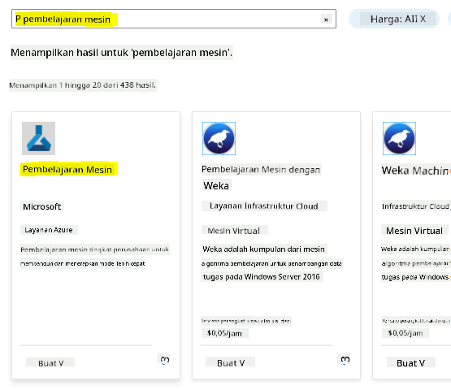

   Klik tombol buat

   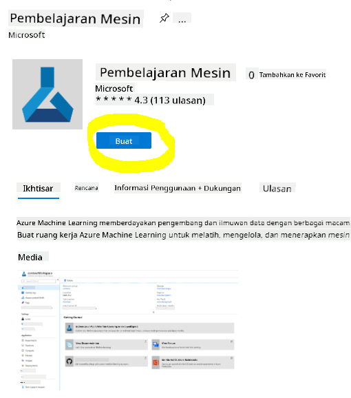

   Isi pengaturan sebagai berikut:
   - Langganan: Langganan Azure Anda
   - Grup sumber daya: Buat atau pilih grup sumber daya
   - Nama workspace: Masukkan nama unik untuk workspace Anda
   - Wilayah: Pilih wilayah geografis terdekat dengan Anda
   - Akun penyimpanan: Catat akun penyimpanan baru default yang akan dibuat untuk workspace Anda
   - Key vault: Catat key vault baru default yang akan dibuat untuk workspace Anda
   - Application insights: Catat sumber daya application insights baru default yang akan dibuat untuk workspace Anda
   - Container registry: Tidak ada (satu akan dibuat secara otomatis saat pertama kali Anda mendistribusikan model ke container)

    

   - Klik buat + tinjau dan kemudian tombol buat
3. Tunggu hingga workspace Anda dibuat (ini bisa memakan waktu beberapa menit). Kemudian buka di portal. Anda dapat menemukannya melalui layanan Azure Machine Learning.
4. Di halaman Overview untuk workspace Anda, luncurkan Azure Machine Learning studio (atau buka tab browser baru dan navigasikan ke https://ml.azure.com), dan masuk ke Azure Machine Learning studio menggunakan akun Microsoft Anda. Jika diminta, pilih direktori dan langganan Azure Anda, serta workspace Azure Machine Learning Anda.
   
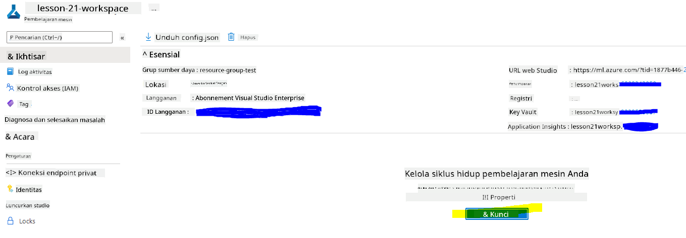

5. Di Azure Machine Learning studio, alihkan ikon ☰ di kiri atas untuk melihat berbagai halaman dalam antarmuka. Anda dapat menggunakan halaman ini untuk mengelola sumber daya di workspace Anda.


Anda dapat mengelola workspace Anda menggunakan portal Azure, tetapi untuk data scientist dan insinyur operasi Machine Learning, Azure Machine Learning Studio menyediakan antarmuka pengguna yang lebih terfokus untuk mengelola sumber daya workspace.

### 2.2 Sumber Daya Komputasi

Sumber Daya Komputasi adalah sumber daya berbasis cloud yang dapat Anda gunakan untuk menjalankan proses pelatihan model dan eksplorasi data. Ada empat jenis sumber daya komputasi yang dapat Anda buat:

- **Compute Instances**: Workstation pengembangan yang dapat digunakan data scientist untuk bekerja dengan data dan model. Ini melibatkan pembuatan Virtual Machine (VM) dan meluncurkan instance notebook. Anda kemudian dapat melatih model dengan memanggil cluster komputasi dari notebook.
- **Compute Clusters**: Cluster VM yang dapat diskalakan untuk pemrosesan eksperimen kode sesuai permintaan. Anda akan membutuhkannya saat melatih model. Compute cluster juga dapat menggunakan sumber daya GPU atau CPU khusus.
- **Inference Clusters**: Target deployment untuk layanan prediktif yang menggunakan model yang telah Anda latih.
- **Attached Compute**: Menghubungkan ke sumber daya komputasi Azure yang sudah ada, seperti Virtual Machines atau cluster Azure Databricks.

#### 2.2.1 Memilih opsi yang tepat untuk sumber daya komputasi Anda

Beberapa faktor penting perlu dipertimbangkan saat membuat sumber daya komputasi, dan pilihan tersebut bisa menjadi keputusan yang krusial.

**Apakah Anda membutuhkan CPU atau GPU?**

CPU (Central Processing Unit) adalah sirkuit elektronik yang menjalankan instruksi dari program komputer. GPU (Graphics Processing Unit) adalah sirkuit elektronik khusus yang dapat menjalankan kode terkait grafis dengan kecepatan sangat tinggi.

Perbedaan utama antara arsitektur CPU dan GPU adalah bahwa CPU dirancang untuk menangani berbagai tugas dengan cepat (diukur dengan kecepatan clock CPU), tetapi memiliki keterbatasan dalam jumlah tugas yang dapat berjalan secara bersamaan. GPU dirancang untuk komputasi paralel dan jauh lebih baik untuk tugas pembelajaran mendalam.

| CPU                                     | GPU                         |
|-----------------------------------------|-----------------------------|
| Lebih murah                             | Lebih mahal                 |
| Tingkat konkuren lebih rendah           | Tingkat konkuren lebih tinggi |
| Lebih lambat dalam melatih model pembelajaran mendalam | Optimal untuk pembelajaran mendalam |

**Ukuran Cluster**

Cluster yang lebih besar lebih mahal tetapi akan memberikan responsivitas yang lebih baik. Oleh karena itu, jika Anda memiliki waktu tetapi anggaran terbatas, Anda sebaiknya memulai dengan cluster kecil. Sebaliknya, jika Anda memiliki anggaran tetapi waktu terbatas, Anda sebaiknya memulai dengan cluster yang lebih besar.

**Ukuran VM**

Bergantung pada waktu dan batasan anggaran Anda, Anda dapat mengubah ukuran RAM, disk, jumlah core, dan kecepatan clock. Meningkatkan semua parameter tersebut akan lebih mahal, tetapi akan menghasilkan kinerja yang lebih baik.

**Instance Dedicated atau Low-Priority?**

Instance low-priority berarti dapat terganggu: pada dasarnya, Microsoft Azure dapat mengambil sumber daya tersebut dan mengalihkannya ke tugas lain, sehingga pekerjaan Anda terganggu. Instance dedicated, atau tidak terganggu, berarti pekerjaan Anda tidak akan pernah dihentikan tanpa izin Anda. Ini adalah pertimbangan lain antara waktu dan uang, karena instance yang dapat terganggu lebih murah daripada yang dedicated.

#### 2.2.2 Membuat compute cluster

Di [Azure ML workspace](https://ml.azure.com/) yang telah kita buat sebelumnya, buka menu compute, dan Anda akan melihat berbagai sumber daya komputasi yang baru saja kita bahas (misalnya compute instances, compute clusters, inference clusters, dan attached compute). Untuk proyek ini, kita akan membutuhkan compute cluster untuk melatih model. Di Studio, klik menu "Compute", lalu tab "Compute cluster" dan klik tombol "+ New" untuk membuat compute cluster.


1. Pilih opsi Anda: Dedicated vs Low priority, CPU atau GPU, ukuran VM, dan jumlah core (Anda dapat menggunakan pengaturan default untuk proyek ini).
2. Klik tombol Next.

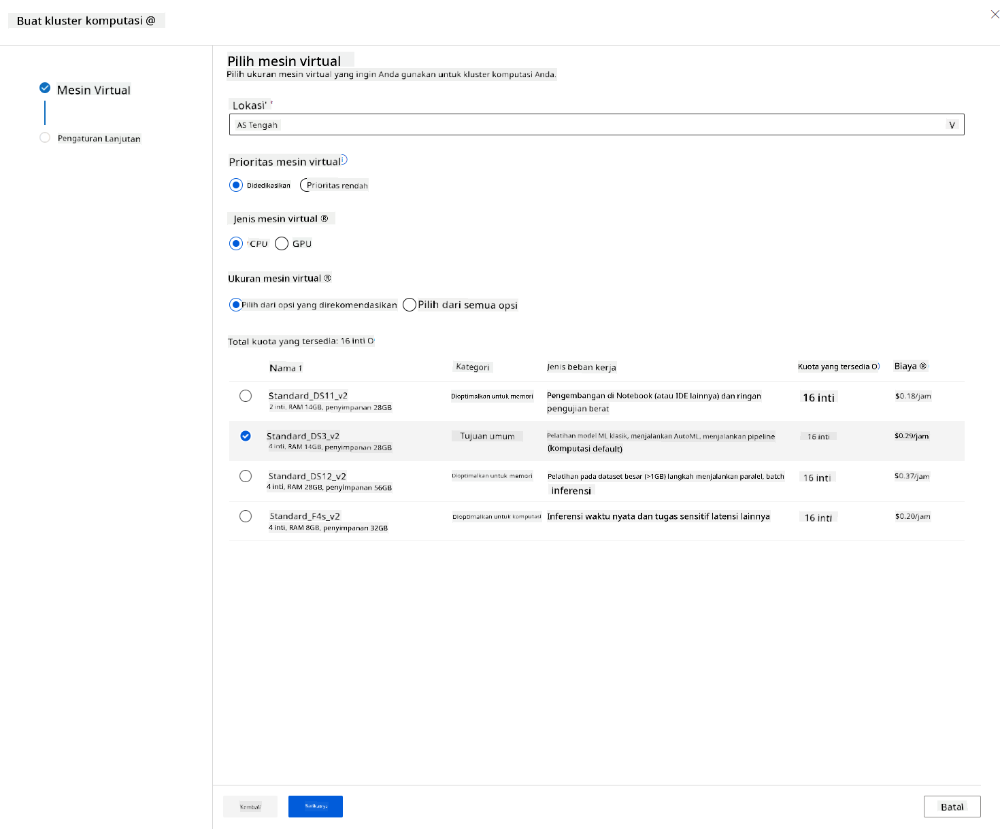

3. Berikan nama untuk cluster Anda.
4. Pilih opsi Anda: Jumlah minimum/maksimum node, waktu idle sebelum scale down, akses SSH. Perhatikan bahwa jika jumlah minimum node adalah 0, Anda akan menghemat uang saat cluster tidak aktif. Perhatikan bahwa semakin tinggi jumlah maksimum node, semakin cepat pelatihan akan selesai. Jumlah maksimum node yang direkomendasikan adalah 3.  
5. Klik tombol "Create". Langkah ini mungkin memerlukan beberapa menit.

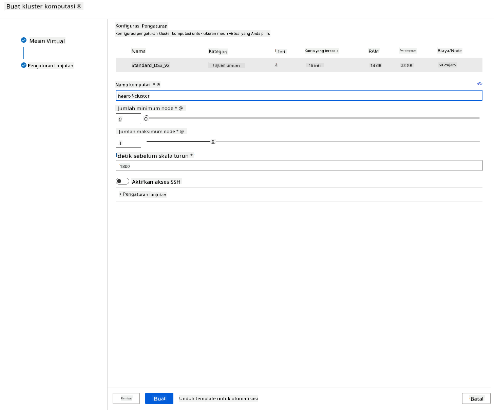

Luar biasa! Sekarang kita memiliki compute cluster, kita perlu memuat data ke Azure ML Studio.

### 2.3 Memuat Dataset

1. Di [Azure ML workspace](https://ml.azure.com/) yang telah kita buat sebelumnya, klik "Datasets" di menu sebelah kiri dan klik tombol "+ Create dataset" untuk membuat dataset. Pilih opsi "From local files" dan pilih dataset Kaggle yang telah kita unduh sebelumnya.
   
   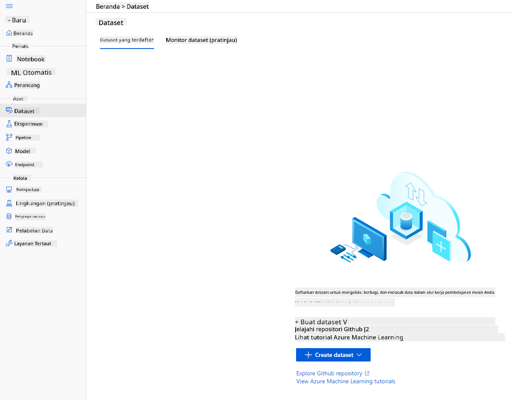

2. Berikan nama, tipe, dan deskripsi untuk dataset Anda. Klik Next. Unggah data dari file. Klik Next.
   
   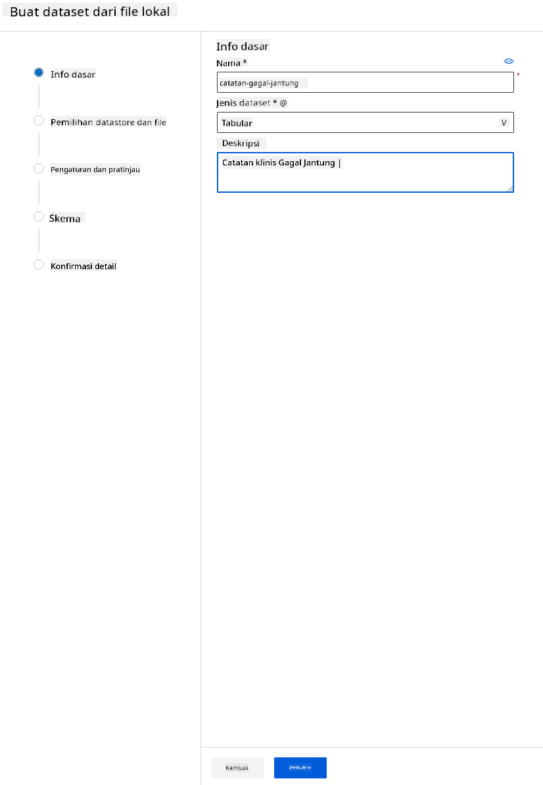

3. Di Schema, ubah tipe data menjadi Boolean untuk fitur berikut: anaemia, diabetes, high blood pressure, sex, smoking, dan DEATH_EVENT. Klik Next dan klik Create.
   
   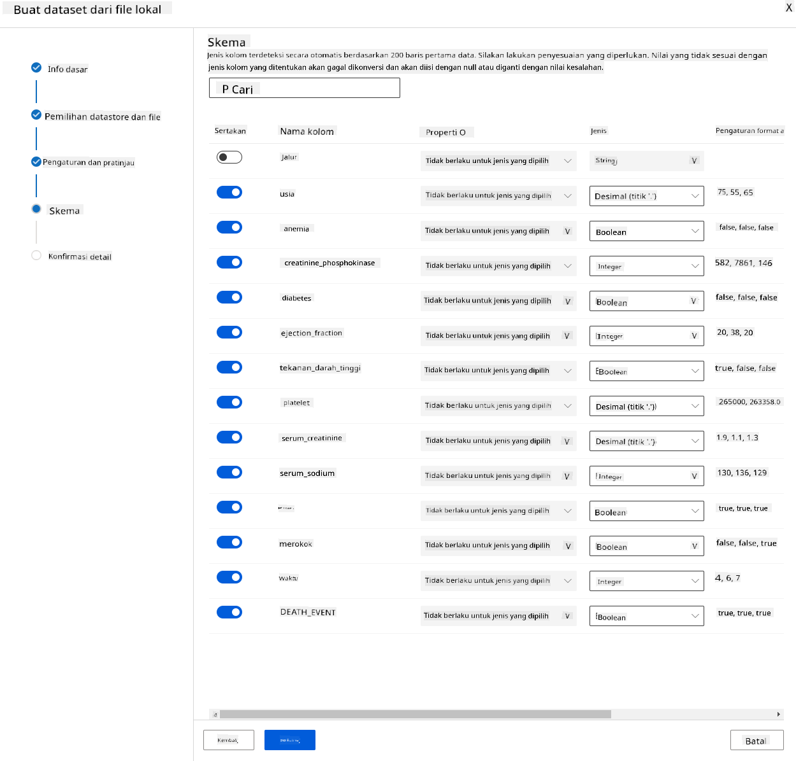

Hebat! Sekarang dataset sudah siap dan compute cluster telah dibuat, kita dapat memulai pelatihan model!

### 2.4 Pelatihan Low code/No code dengan AutoML

Pengembangan model pembelajaran mesin tradisional membutuhkan banyak sumber daya, memerlukan pengetahuan domain yang signifikan, dan waktu untuk menghasilkan serta membandingkan puluhan model. 
Automated machine learning (AutoML) adalah proses otomatisasi tugas-tugas berulang yang memakan waktu dalam pengembangan model pembelajaran mesin. Ini memungkinkan data scientist, analis, dan pengembang untuk membangun model ML dengan skala besar, efisiensi, dan produktivitas, sambil tetap menjaga kualitas model. AutoML mengurangi waktu yang diperlukan untuk mendapatkan model ML yang siap produksi dengan mudah dan efisien. [Pelajari lebih lanjut](https://docs.microsoft.com/azure/machine-learning/concept-automated-ml?WT.mc_id=academic-77958-bethanycheum&ocid=AID3041109)

1. Di [Azure ML workspace](https://ml.azure.com/) yang telah kita buat sebelumnya, klik "Automated ML" di menu sebelah kiri dan pilih dataset yang baru saja Anda unggah. Klik Next.

   

2. Masukkan nama eksperimen baru, kolom target (DEATH_EVENT), dan compute cluster yang telah kita buat. Klik Next.
   
   

3. Pilih "Classification" dan klik Finish. Langkah ini mungkin memerlukan waktu antara 30 menit hingga 1 jam, tergantung pada ukuran compute cluster Anda.
    
    

4. Setelah proses selesai, klik tab "Automated ML", klik pada run Anda, dan klik algoritma di kartu "Best model summary".
    
    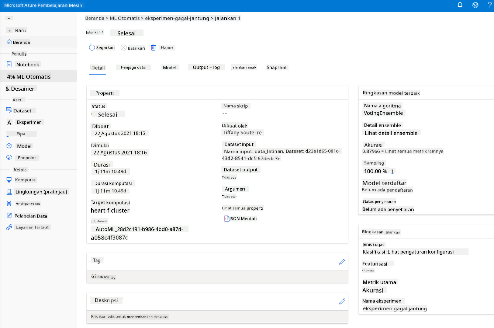

Di sini Anda dapat melihat deskripsi rinci tentang model terbaik yang dihasilkan oleh AutoML. Anda juga dapat menjelajahi model lain yang dihasilkan di tab Models. Luangkan beberapa menit untuk menjelajahi model di tombol Explanations (preview). Setelah Anda memilih model yang ingin digunakan (di sini kita akan memilih model terbaik yang dipilih oleh AutoML), kita akan melihat bagaimana cara mendistribusikannya.

## 3. Distribusi model Low code/No code dan konsumsi endpoint
### 3.1 Distribusi model

Antarmuka automated machine learning memungkinkan Anda untuk mendistribusikan model terbaik sebagai layanan web dalam beberapa langkah. Distribusi adalah integrasi model sehingga dapat membuat prediksi berdasarkan data baru dan mengidentifikasi area peluang potensial. Untuk proyek ini, distribusi ke layanan web berarti aplikasi medis akan dapat menggunakan model untuk membuat prediksi langsung tentang risiko pasien terkena serangan jantung.

Di deskripsi model terbaik, klik tombol "Deploy".
    
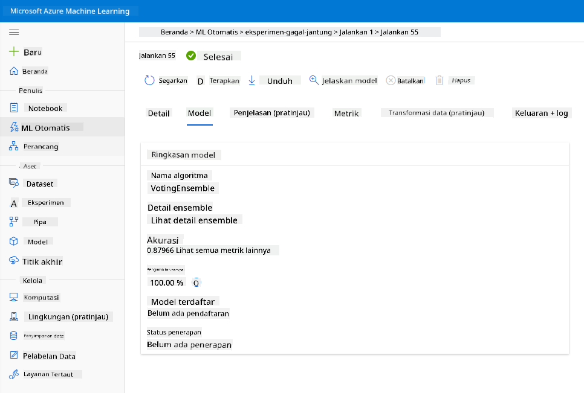

15. Berikan nama, deskripsi, tipe compute (Azure Container Instance), aktifkan autentikasi, dan klik Deploy. Langkah ini mungkin memerlukan waktu sekitar 20 menit untuk selesai. Proses distribusi mencakup beberapa langkah termasuk mendaftarkan model, menghasilkan sumber daya, dan mengonfigurasinya untuk layanan web. Pesan status muncul di bawah Deploy status. Pilih Refresh secara berkala untuk memeriksa status distribusi. Model akan terdistribusi dan berjalan saat statusnya "Healthy".

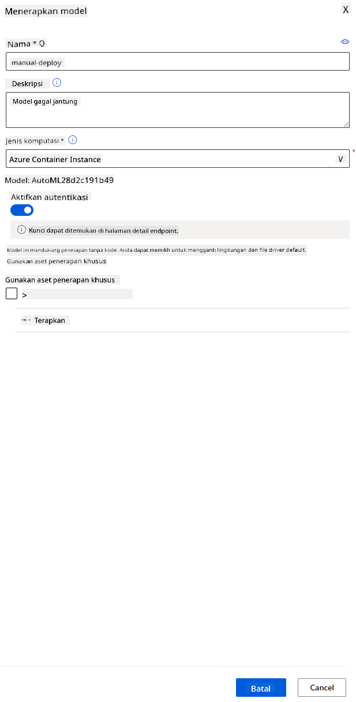

16. Setelah terdistribusi, klik tab Endpoint dan klik endpoint yang baru saja Anda distribusikan. Di sini Anda dapat menemukan semua detail yang perlu Anda ketahui tentang endpoint tersebut.

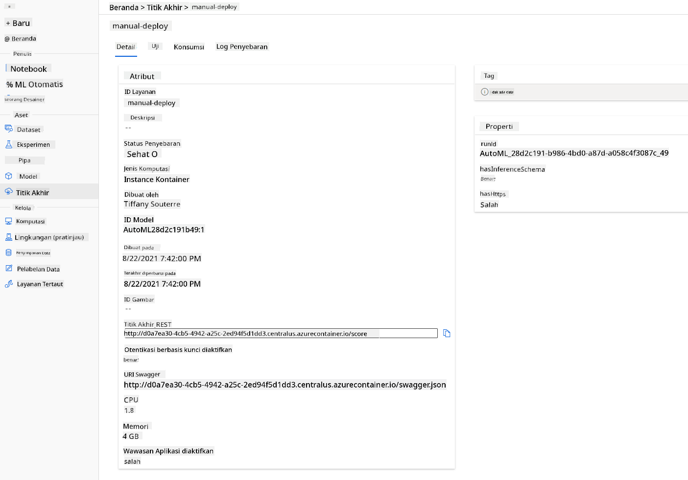

Luar biasa! Sekarang kita memiliki model yang terdistribusi, kita dapat mulai mengonsumsi endpoint.

### 3.2 Konsumsi endpoint

Klik tab "Consume". Di sini Anda dapat menemukan REST endpoint dan skrip Python di opsi konsumsi. Luangkan waktu untuk membaca kode Python tersebut.

Skrip ini dapat dijalankan langsung dari mesin lokal Anda dan akan mengonsumsi endpoint Anda.

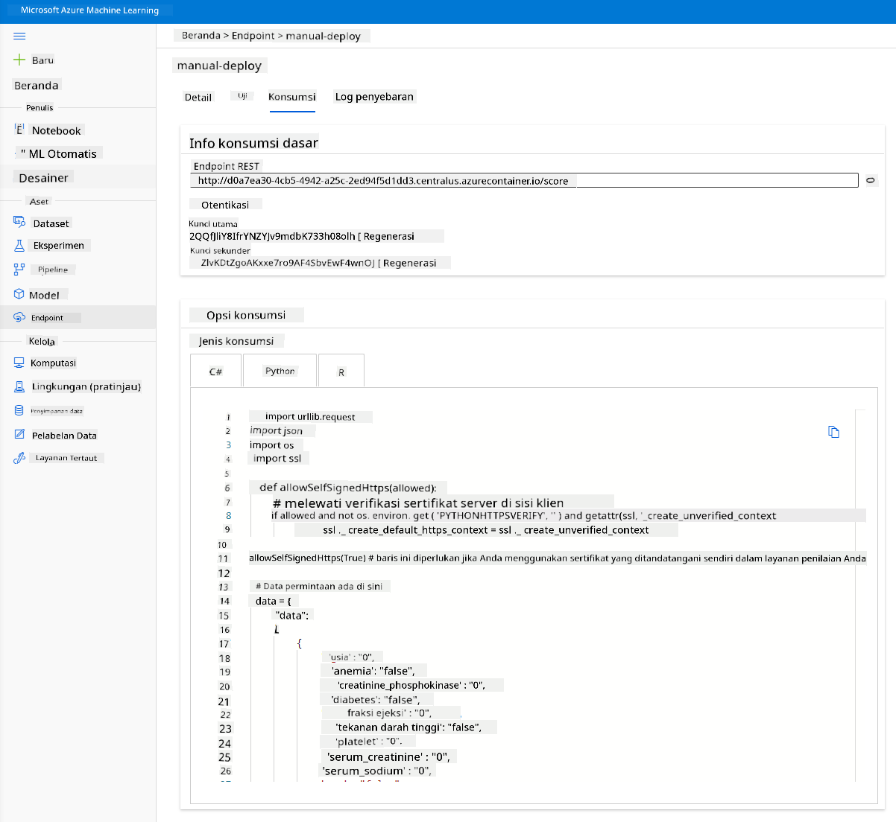

Luangkan waktu untuk memeriksa dua baris kode ini:

```python
url = 'http://98e3715f-xxxx-xxxx-xxxx-9ec22d57b796.centralus.azurecontainer.io/score'
api_key = '' # Replace this with the API key for the web service
```
Variabel `url` adalah REST endpoint yang ditemukan di tab konsumsi, dan variabel `api_key` adalah kunci utama yang juga ditemukan di tab konsumsi (hanya jika Anda mengaktifkan autentikasi). Inilah cara skrip dapat mengonsumsi endpoint.

18. Saat menjalankan skrip, Anda akan melihat output berikut:
    ```python
    b'"{\\"result\\": [true]}"'
    ```
Ini berarti prediksi gagal jantung untuk data yang diberikan adalah benar. Ini masuk akal karena jika Anda melihat lebih dekat pada data yang secara otomatis dihasilkan dalam skrip, semuanya bernilai 0 dan false secara default. Anda dapat mengubah data dengan sampel input berikut:

```python
data = {
    "data":
    [
        {
            'age': "0",
            'anaemia': "false",
            'creatinine_phosphokinase': "0",
            'diabetes': "false",
            'ejection_fraction': "0",
            'high_blood_pressure': "false",
            'platelets': "0",
            'serum_creatinine': "0",
            'serum_sodium': "0",
            'sex': "false",
            'smoking': "false",
            'time': "0",
        },
        {
            'age': "60",
            'anaemia': "false",
            'creatinine_phosphokinase': "500",
            'diabetes': "false",
            'ejection_fraction': "38",
            'high_blood_pressure': "false",
            'platelets': "260000",
            'serum_creatinine': "1.40",
            'serum_sodium': "137",
            'sex': "false",
            'smoking': "false",
            'time': "130",
        },
    ],
}
```
Skrip akan mengembalikan:
    ```python
    b'"{\\"result\\": [true, false]}"'
    ```

Selamat! Anda baru saja mengonsumsi model yang terdistribusi dan melatihnya di Azure ML!

> **_NOTE:_** Setelah selesai dengan proyek, jangan lupa untuk menghapus semua sumber daya.
## 🚀 Tantangan

Perhatikan dengan seksama penjelasan model dan detail yang dihasilkan AutoML untuk model-model terbaik. Cobalah untuk memahami mengapa model terbaik lebih baik daripada yang lainnya. Algoritma apa yang dibandingkan? Apa perbedaan di antara mereka? Mengapa model terbaik berkinerja lebih baik dalam kasus ini?

## [Kuis setelah pelajaran](https://ff-quizzes.netlify.app/en/ds/)

## Tinjauan & Studi Mandiri

Dalam pelajaran ini, Anda belajar cara melatih, mendistribusikan, dan mengonsumsi model untuk memprediksi risiko gagal jantung dengan cara Low code/No code di cloud. Jika Anda belum melakukannya, pelajari lebih dalam penjelasan model yang dihasilkan AutoML untuk model-model terbaik dan cobalah untuk memahami mengapa model terbaik lebih baik daripada yang lainnya.

Anda dapat mempelajari lebih lanjut tentang AutoML Low code/No code dengan membaca [dokumentasi ini](https://docs.microsoft.com/azure/machine-learning/tutorial-first-experiment-automated-ml?WT.mc_id=academic-77958-bethanycheum&ocid=AID3041109).

## Tugas

[Proyek Data Science Low code/No code di Azure ML](assignment.md)

---

**Penafian**:  
Dokumen ini telah diterjemahkan menggunakan layanan penerjemahan AI [Co-op Translator](https://github.com/Azure/co-op-translator). Meskipun kami berupaya untuk memberikan hasil yang akurat, harap diperhatikan bahwa terjemahan otomatis mungkin mengandung kesalahan atau ketidakakuratan. Dokumen asli dalam bahasa aslinya harus dianggap sebagai sumber yang berwenang. Untuk informasi yang bersifat kritis, disarankan menggunakan jasa penerjemahan manusia profesional. Kami tidak bertanggung jawab atas kesalahpahaman atau penafsiran yang keliru yang timbul dari penggunaan terjemahan ini.