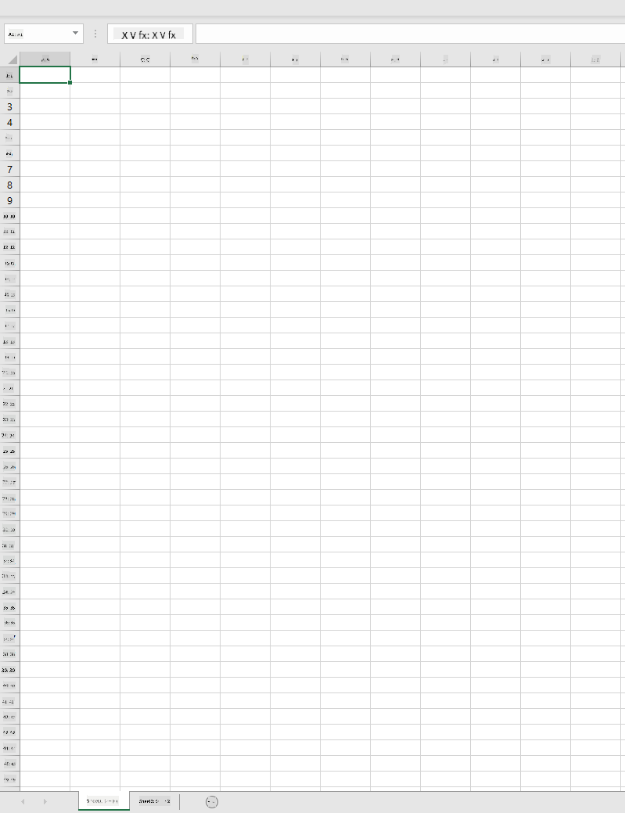
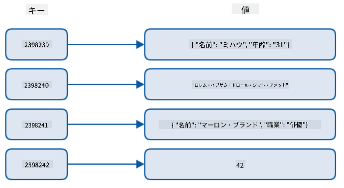
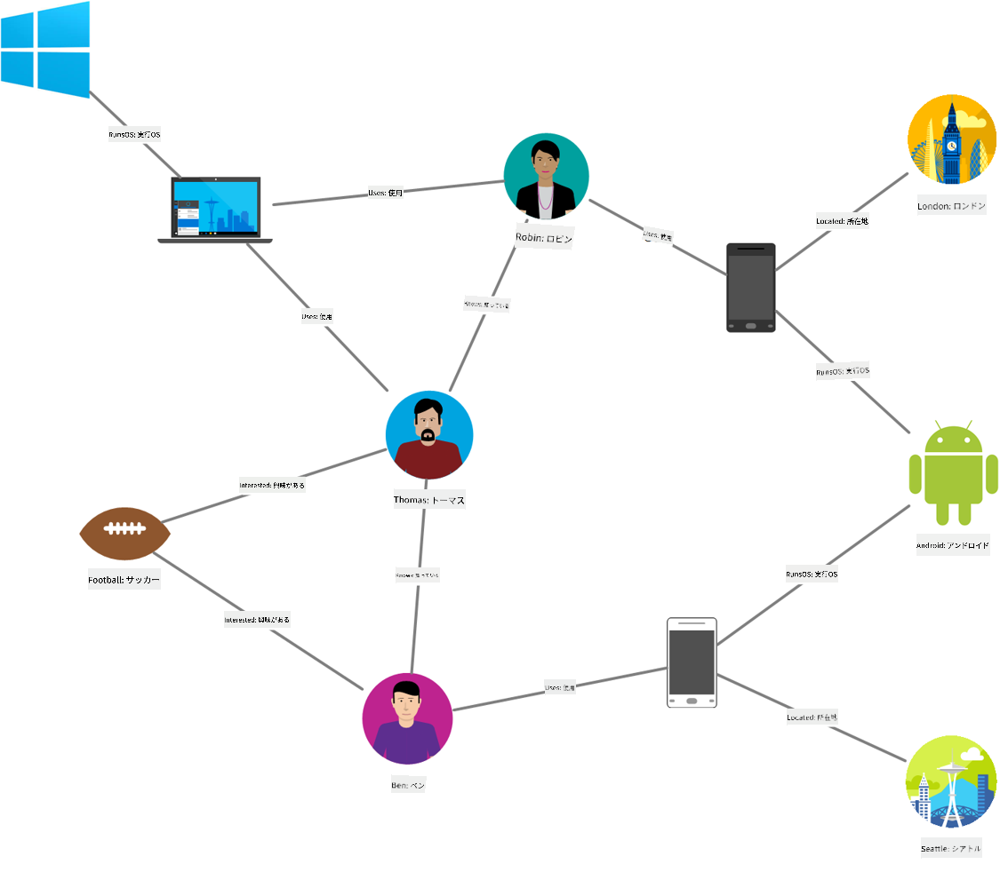
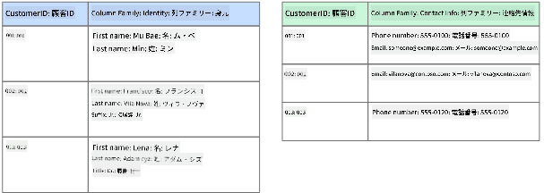
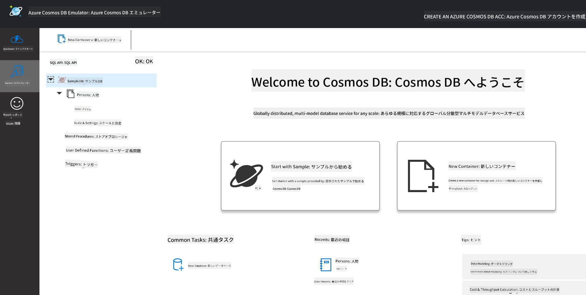
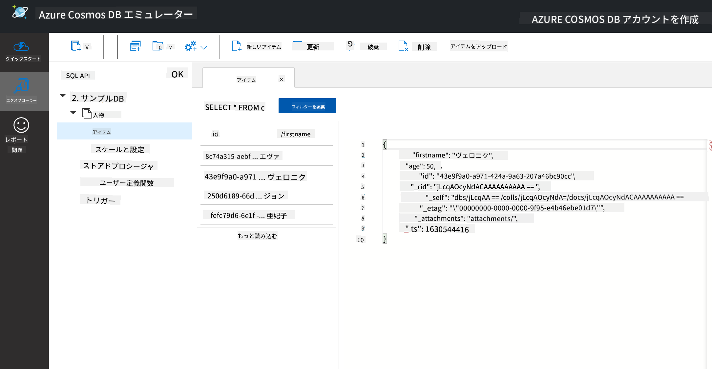
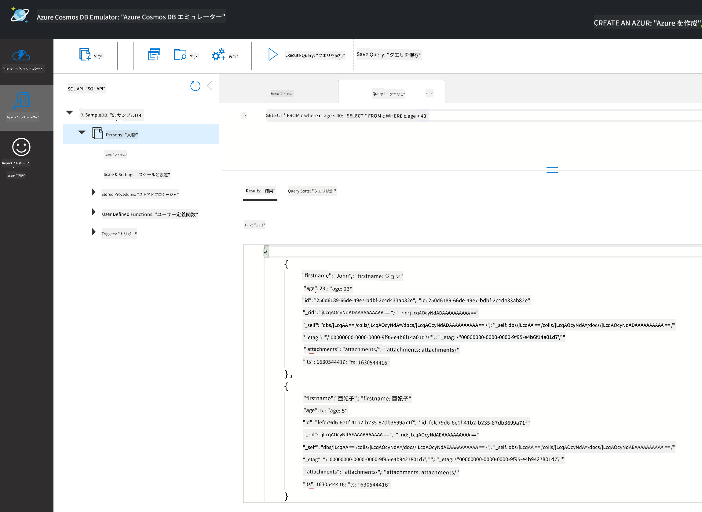

<!--
CO_OP_TRANSLATOR_METADATA:
{
  "original_hash": "54c5a1c74aecb69d2f9099300a4b7eea",
  "translation_date": "2025-09-04T13:11:14+00:00",
  "source_file": "2-Working-With-Data/06-non-relational/README.md",
  "language_code": "ja"
}
-->
# データの操作: 非リレーショナルデータ

| ](../../sketchnotes/06-NoSQL.png)|
|:---:|
|NoSQLデータの操作 - _スケッチノート by [@nitya](https://twitter.com/nitya)_ |

## [講義前クイズ](https://purple-hill-04aebfb03.1.azurestaticapps.net/quiz/10)

データはリレーショナルデータベースに限定されません。このレッスンでは、非リレーショナルデータに焦点を当て、スプレッドシートとNoSQLの基本について学びます。

## スプレッドシート

スプレッドシートは、セットアップや開始に手間がかからないため、データを保存・探索するための一般的な方法です。このレッスンでは、スプレッドシートの基本的な構成要素、数式や関数について学びます。例はMicrosoft Excelを使用して説明しますが、他のスプレッドシートソフトウェアでも似たような名称や手順が多くあります。



スプレッドシートはファイルであり、コンピュータ、デバイス、またはクラウドベースのファイルシステムでアクセス可能です。ソフトウェア自体はブラウザベースの場合もあれば、コンピュータにインストールするアプリケーションやアプリとしてダウンロードする必要がある場合もあります。Excelでは、これらのファイルは**ワークブック**と定義されており、このレッスンではこの用語を使用します。

ワークブックには1つ以上の**ワークシート**が含まれ、それぞれのワークシートはタブでラベル付けされています。ワークシート内には**セル**と呼ばれる長方形があり、実際のデータが含まれます。セルは行と列の交差点であり、列はアルファベットで、行は数字でラベル付けされています。一部のスプレッドシートでは、最初の数行にヘッダーが含まれ、セル内のデータを説明します。

Excelワークブックのこれらの基本要素を使用して、[Microsoft Templates](https://templates.office.com/)の在庫管理に焦点を当てた例を使い、スプレッドシートの追加部分を見ていきます。

### 在庫管理

"InventoryExample"という名前のスプレッドシートファイルは、在庫内のアイテムをフォーマットしたスプレッドシートで、3つのワークシートが含まれています。タブには「Inventory List」「Inventory Pick List」「Bin Lookup」とラベル付けされています。Inventory Listワークシートの4行目はヘッダーで、ヘッダー列内の各セルの値を説明しています。


セルが他のセルの値に依存して値を生成する場合があります。在庫リストスプレッドシートでは、在庫内の各アイテムのコストを追跡していますが、在庫全体の価値を知りたい場合はどうすればよいでしょうか。[**数式**](https://support.microsoft.com/en-us/office/overview-of-formulas-34519a4e-1e8d-4f4b-84d4-d642c4f63263)はセルデータに対して操作を行い、この例では在庫の価値を計算するために使用されます。このスプレッドシートでは、Inventory Value列に数式を使用して、QTYヘッダーの下の数量とCOSTヘッダーの下のコストを掛け合わせて各アイテムの価値を計算しています。セルをダブルクリックまたはハイライトすると数式が表示されます。数式は等号（=）で始まり、その後に計算や操作が続きます。


在庫価値のすべての値を合計して総価値を求める別の数式を使用することもできます。各セルを加算して合計を生成することもできますが、それは手間のかかる作業です。Excelには[**関数**](https://support.microsoft.com/en-us/office/sum-function-043e1c7d-7726-4e80-8f32-07b23e057f89)と呼ばれる、セル値に対して計算を行うための事前定義された数式があります。関数には引数が必要で、これらは計算に使用される必要な値です。関数が複数の引数を必要とする場合、特定の順序でリストする必要があります。そうしないと、関数が正しい値を計算できない可能性があります。この例ではSUM関数を使用し、Inventory Valueの値を引数として使用して合計を生成し、B3（3行目、列B）にリストされています。

## NoSQL

NoSQLは、非リレーショナルデータを保存するさまざまな方法を指す包括的な用語であり、「非SQL」「非リレーショナル」「SQLだけではない」と解釈されることがあります。この種のデータベースシステムは、4つのタイプに分類されます。


> 出典: [Michał Białecki Blog](https://www.michalbialecki.com/2018/03/18/azure-cosmos-db-key-value-database-cloud/)

[キー値](https://docs.microsoft.com/en-us/azure/architecture/data-guide/big-data/non-relational-data#keyvalue-data-stores)データベースは、ユニークなキー（値に関連付けられた一意の識別子）と値をペアにします。これらのペアは、適切なハッシュ関数を使用した[ハッシュテーブル](https://www.hackerearth.com/practice/data-structures/hash-tables/basics-of-hash-tables/tutorial/)を使用して保存されます。


> 出典: [Microsoft](https://docs.microsoft.com/en-us/azure/cosmos-db/graph/graph-introduction#graph-database-by-example)

[グラフ](https://docs.microsoft.com/en-us/azure/architecture/data-guide/big-data/non-relational-data#graph-data-stores)データベースはデータ内の関係を記述し、ノードとエッジのコレクションとして表されます。ノードは、学生や銀行明細書など、現実世界に存在するエンティティを表します。エッジは、2つのエンティティ間の関係を表します。各ノードとエッジには、それぞれの追加情報を提供するプロパティがあります。



[カラムナー](https://docs.microsoft.com/en-us/azure/architecture/data-guide/big-data/non-relational-data#columnar-data-stores)データストアは、リレーショナルデータ構造のようにデータを列と行に整理しますが、各列はカラムファミリーと呼ばれるグループに分けられます。1つのカラム内のすべてのデータは関連しており、1つの単位で取得および変更できます。

### Azure Cosmos DBを使用したドキュメントデータストア

[ドキュメント](https://docs.microsoft.com/en-us/azure/architecture/data-guide/big-data/non-relational-data#document-data-stores)データストアは、キー値データストアの概念を基に構築され、フィールドとオブジェクトの一連で構成されています。このセクションでは、Cosmos DBエミュレーターを使用してドキュメントデータベースを探ります。

Cosmos DBデータベースは「SQLだけではない」という定義に当てはまり、Cosmos DBのドキュメントデータベースはSQLを使用してデータをクエリします。[前回のレッスン](../05-relational-databases/README.md)ではSQLの基本を学びましたが、ここでも同じクエリをいくつか適用できます。Cosmos DBエミュレーターを使用して、ローカルコンピュータ上でドキュメントデータベースを作成し、探索します。エミュレーターについての詳細は[こちら](https://docs.microsoft.com/en-us/azure/cosmos-db/local-emulator?tabs=ssl-netstd21)をご覧ください。

ドキュメントはフィールドとオブジェクト値のコレクションであり、フィールドはオブジェクト値が何を表しているかを説明します。以下はドキュメントの例です。

```json
{
    "firstname": "Eva",
    "age": 44,
    "id": "8c74a315-aebf-4a16-bb38-2430a9896ce5",
    "_rid": "bHwDAPQz8s0BAAAAAAAAAA==",
    "_self": "dbs/bHwDAA==/colls/bHwDAPQz8s0=/docs/bHwDAPQz8s0BAAAAAAAAAA==/",
    "_etag": "\"00000000-0000-0000-9f95-010a691e01d7\"",
    "_attachments": "attachments/",
    "_ts": 1630544034
}
```

このドキュメントで注目すべきフィールドは、`firstname`、`id`、`age`です。アンダースコア付きの他のフィールドはCosmos DBによって生成されました。

#### Cosmos DBエミュレーターを使用したデータの探索

エミュレーターは[Windows用はこちら](https://aka.ms/cosmosdb-emulator)からダウンロードしてインストールできます。macOSおよびLinuxでエミュレーターを実行する方法については、この[ドキュメント](https://docs.microsoft.com/en-us/azure/cosmos-db/local-emulator?tabs=ssl-netstd21#run-on-linux-macos)を参照してください。

エミュレーターを起動するとブラウザウィンドウが開き、Explorerビューでドキュメントを探索できます。



もし一緒に進めている場合は、「Start with Sample」をクリックしてSampleDBというサンプルデータベースを生成してください。SampleDBを展開すると、`Persons`というコンテナが見つかります。コンテナはアイテムのコレクションを保持しており、これがコンテナ内のドキュメントです。`Items`の下にある4つの個別のドキュメントを探索できます。



#### Cosmos DBエミュレーターを使用したドキュメントデータのクエリ

新しいSQLクエリボタン（左から2番目のボタン）をクリックすると、サンプルデータをクエリすることもできます。

`SELECT * FROM c`はコンテナ内のすべてのドキュメントを返します。where句を追加して、40歳未満の人を見つけてみましょう。

`SELECT * FROM c where c.age < 40`



このクエリは2つのドキュメントを返します。それぞれのドキュメントのage値が40未満であることに注目してください。

#### JSONとドキュメント

JavaScript Object Notation (JSON)に詳しい場合、ドキュメントがJSONに似ていることに気付くでしょう。このディレクトリには`PersonsData.json`というファイルがあり、エミュレーターのPersonsコンテナに`Upload Item`ボタンを使ってアップロードできます。

ほとんどの場合、JSONデータを返すAPIは、ドキュメントデータベースに直接転送して保存することができます。以下は別のドキュメントで、MicrosoftのTwitterアカウントから取得したツイートを表しています。このデータはTwitter APIを使用して取得され、その後Cosmos DBに挿入されました。

```json
{
    "created_at": "2021-08-31T19:03:01.000Z",
    "id": "1432780985872142341",
    "text": "Blank slate. Like this tweet if you’ve ever painted in Microsoft Paint before. https://t.co/cFeEs8eOPK",
    "_rid": "dhAmAIUsA4oHAAAAAAAAAA==",
    "_self": "dbs/dhAmAA==/colls/dhAmAIUsA4o=/docs/dhAmAIUsA4oHAAAAAAAAAA==/",
    "_etag": "\"00000000-0000-0000-9f84-a0958ad901d7\"",
    "_attachments": "attachments/",
    "_ts": 1630537000
```

このドキュメントで注目すべきフィールドは、`created_at`、`id`、`text`です。

## 🚀 チャレンジ

`TwitterData.json`というファイルをSampleDBデータベースにアップロードできます。これを別のコンテナに追加することをお勧めします。以下の手順で行えます：

1. 右上の新しいコンテナボタンをクリック
1. 既存のデータベース（SampleDB）を選択し、コンテナIDを作成
1. パーティションキーを`/id`に設定
1. OKをクリック（このビューの他の情報は無視して構いません。これはローカルマシンで実行される小さなデータセットです）
1. 新しいコンテナを開き、`Upload Item`ボタンでTwitter Dataファイルをアップロード

いくつかのSELECTクエリを実行して、textフィールドにMicrosoftが含まれるドキュメントを見つけてみてください。ヒント：[LIKEキーワード](https://docs.microsoft.com/en-us/azure/cosmos-db/sql/sql-query-keywords#using-like-with-the--wildcard-character)を使用してみてください。

## [講義後クイズ](https://ff-quizzes.netlify.app/en/ds/)

## 復習と自己学習

- このレッスンではカバーしていない、スプレッドシートに追加されたフォーマットや機能がいくつかあります。Excelについてもっと学びたい場合は、Microsoftの[豊富なドキュメントとビデオライブラリ](https://support.microsoft.com/excel)をご覧ください。

- 非リレーショナルデータのさまざまなタイプの特性については、このアーキテクチャドキュメントをご覧ください：[非リレーショナルデータとNoSQL](https://docs.microsoft.com/en-us/azure/architecture/data-guide/big-data/non-relational-data)

- Cosmos DBは、ここで説明したさまざまなNoSQLタイプを保存できるクラウドベースの非リレーショナルデータベースです。この[Cosmos DB Microsoft Learn Module](https://docs.microsoft.com/en-us/learn/paths/work-with-nosql-data-in-azure-cosmos-db/)でこれらのタイプについてさらに学ぶことができます。

## 課題

[Soda Profits](assignment.md)

---

**免責事項**:  
この文書は、AI翻訳サービス [Co-op Translator](https://github.com/Azure/co-op-translator) を使用して翻訳されています。正確性を追求しておりますが、自動翻訳には誤りや不正確な表現が含まれる可能性があります。元の言語で記載された原文が正式な情報源と見なされるべきです。重要な情報については、専門の人間による翻訳を推奨します。この翻訳の利用に起因する誤解や誤認について、当社は一切の責任を負いません。