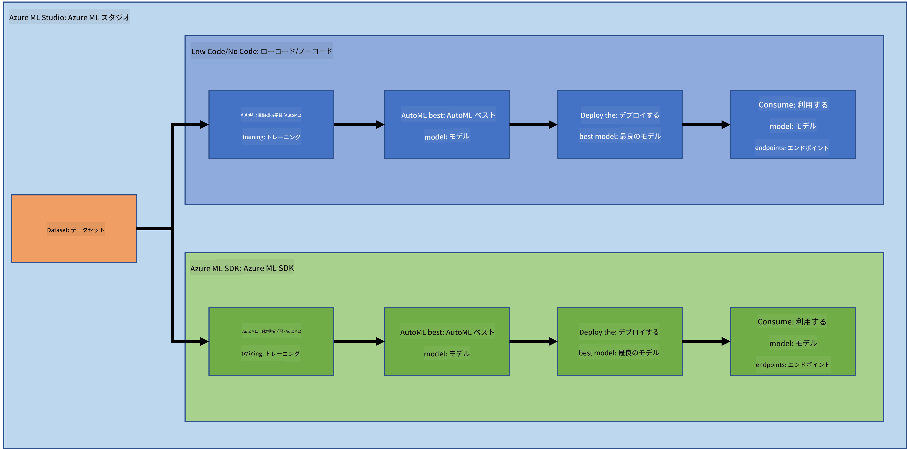
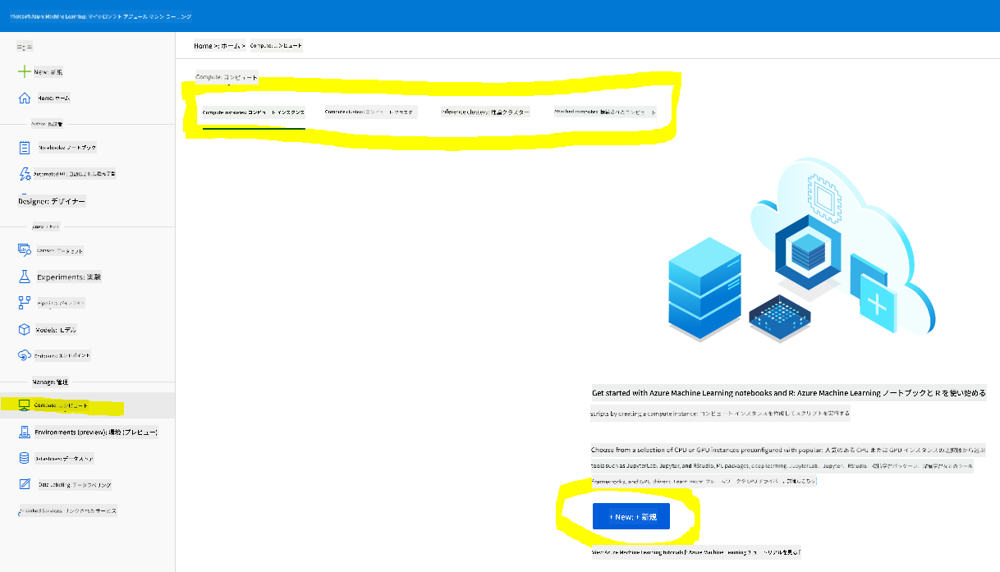
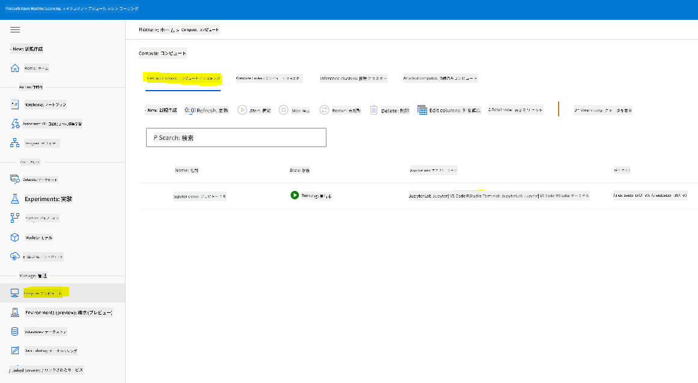

<!--
CO_OP_TRANSLATOR_METADATA:
{
  "original_hash": "5da2d6b3736f6d668b89de9bf3bdd31b",
  "translation_date": "2025-09-04T13:10:25+00:00",
  "source_file": "5-Data-Science-In-Cloud/19-Azure/README.md",
  "language_code": "ja"
}
-->
# クラウドでのデータサイエンス: "Azure ML SDK" の方法

| ](../../sketchnotes/19-DataScience-Cloud.png)|
|:---:|
| クラウドでのデータサイエンス: Azure ML SDK - _スケッチノート by [@nitya](https://twitter.com/nitya)_ |

目次:

- [クラウドでのデータサイエンス: "Azure ML SDK" の方法](../../../../5-Data-Science-In-Cloud/19-Azure)
  - [講義前のクイズ](../../../../5-Data-Science-In-Cloud/19-Azure)
  - [1. はじめに](../../../../5-Data-Science-In-Cloud/19-Azure)
    - [1.1 Azure ML SDKとは？](../../../../5-Data-Science-In-Cloud/19-Azure)
    - [1.2 心不全予測プロジェクトとデータセットの紹介](../../../../5-Data-Science-In-Cloud/19-Azure)
  - [2. Azure ML SDKを使ったモデルのトレーニング](../../../../5-Data-Science-In-Cloud/19-Azure)
    - [2.1 Azure MLワークスペースの作成](../../../../5-Data-Science-In-Cloud/19-Azure)
    - [2.2 コンピュートインスタンスの作成](../../../../5-Data-Science-In-Cloud/19-Azure)
    - [2.3 データセットの読み込み](../../../../5-Data-Science-In-Cloud/19-Azure)
    - [2.4 ノートブックの作成](../../../../5-Data-Science-In-Cloud/19-Azure)
    - [2.5 モデルのトレーニング](../../../../5-Data-Science-In-Cloud/19-Azure)
      - [2.5.1 ワークスペース、実験、コンピュートクラスター、データセットのセットアップ](../../../../5-Data-Science-In-Cloud/19-Azure)
      - [2.5.2 AutoMLの設定とトレーニング](../../../../5-Data-Science-In-Cloud/19-Azure)
  - [3. Azure ML SDKを使ったモデルのデプロイとエンドポイントの利用](../../../../5-Data-Science-In-Cloud/19-Azure)
    - [3.1 最適なモデルの保存](../../../../5-Data-Science-In-Cloud/19-Azure)
    - [3.2 モデルのデプロイ](../../../../5-Data-Science-In-Cloud/19-Azure)
    - [3.3 エンドポイントの利用](../../../../5-Data-Science-In-Cloud/19-Azure)
  - [🚀 チャレンジ](../../../../5-Data-Science-In-Cloud/19-Azure)
  - [講義後のクイズ](../../../../5-Data-Science-In-Cloud/19-Azure)
  - [復習と自己学習](../../../../5-Data-Science-In-Cloud/19-Azure)
  - [課題](../../../../5-Data-Science-In-Cloud/19-Azure)

## [講義前のクイズ](https://purple-hill-04aebfb03.1.azurestaticapps.net/quiz/36)

## 1. はじめに

### 1.1 Azure ML SDKとは？

データサイエンティストやAI開発者は、Azure Machine Learning SDKを使用してAzure Machine Learningサービスで機械学習ワークフローを構築し、実行します。このSDKは、Jupyter Notebooks、Visual Studio Code、またはお気に入りのPython IDEなど、任意のPython環境でサービスと対話することができます。

SDKの主な機能は以下の通りです：

- 機械学習実験で使用するデータセットのライフサイクルを探索、準備、管理する。
- 機械学習実験の監視、ログ記録、整理のためのクラウドリソースを管理する。
- ローカルまたはGPUを使用したクラウドリソースでモデルをトレーニングする。
- 自動機械学習を使用して、設定パラメータとトレーニングデータを受け取り、アルゴリズムとハイパーパラメータ設定を自動的に繰り返して、予測を実行するための最適なモデルを見つける。
- トレーニング済みモデルをRESTfulサービスに変換し、任意のアプリケーションで利用可能にするWebサービスをデプロイする。

[Azure Machine Learning SDKについてさらに学ぶ](https://docs.microsoft.com/python/api/overview/azure/ml?WT.mc_id=academic-77958-bethanycheum&ocid=AID3041109)

[前回のレッスン](../18-Low-Code/README.md)では、ローコード/ノーコード方式でモデルをトレーニング、デプロイ、利用する方法を学びました。心不全データセットを使用して心不全予測モデルを生成しました。このレッスンでは、Azure Machine Learning SDKを使用して同じことを行います。



### 1.2 心不全予測プロジェクトとデータセットの紹介

心不全予測プロジェクトとデータセットの紹介については[こちら](../18-Low-Code/README.md)をご覧ください。

## 2. Azure ML SDKを使ったモデルのトレーニング

### 2.1 Azure MLワークスペースの作成

簡単にするために、Jupyter Notebookで作業します。これには、すでにワークスペースとコンピュートインスタンスがあることが前提です。すでにワークスペースがある場合は、直接セクション2.3ノートブック作成に進むことができます。

まだワークスペースを作成していない場合は、[前回のレッスン](../18-Low-Code/README.md)の**2.1 Azure MLワークスペースの作成**セクションの指示に従ってワークスペースを作成してください。

### 2.2 コンピュートインスタンスの作成

以前に作成した[Azure MLワークスペース](https://ml.azure.com/)に移動し、コンピュートメニューを開くと、利用可能なさまざまなコンピュートリソースが表示されます。



Jupyter Notebookをプロビジョニングするためのコンピュートインスタンスを作成しましょう。
1. [+ New]ボタンをクリックします。
2. コンピュートインスタンスに名前を付けます。
3. CPUまたはGPU、VMサイズ、コア数を選択します。
4. [Create]ボタンをクリックします。

おめでとうございます！コンピュートインスタンスが作成されました。このコンピュートインスタンスを使用して、[ノートブック作成セクション](../../../../5-Data-Science-In-Cloud/19-Azure)でノートブックを作成します。

### 2.3 データセットの読み込み

まだデータセットをアップロードしていない場合は、[前回のレッスン](../18-Low-Code/README.md)の**2.3 データセットの読み込み**セクションを参照してください。

### 2.4 ノートブックの作成

> **_注意:_** 次のステップでは、新しいノートブックをゼロから作成するか、[作成済みのノートブック](notebook.ipynb)をAzure ML Studioにアップロードすることができます。アップロードするには、単に「Notebook」メニューをクリックしてノートブックをアップロードしてください。

ノートブックはデータサイエンスプロセスにおいて非常に重要です。探索的データ分析（EDA）を実施したり、コンピュータクラスターを呼び出してモデルをトレーニングしたり、推論クラスターを呼び出してエンドポイントをデプロイしたりすることができます。

ノートブックを作成するには、Jupyter Notebookインスタンスを提供するコンピュートノードが必要です。[Azure MLワークスペース](https://ml.azure.com/)に戻り、コンピュートインスタンスをクリックします。作成した[コンピュートインスタンス](../../../../5-Data-Science-In-Cloud/19-Azure)がリストに表示されるはずです。

1. [Applications]セクションでJupyterオプションをクリックします。
2. 「Yes, I understand」ボックスにチェックを入れ、[Continue]ボタンをクリックします。

3. 新しいブラウザタブが開き、以下のようにJupyter Notebookインスタンスが表示されます。[New]ボタンをクリックしてノートブックを作成します。


これでノートブックが作成されました。Azure ML SDKを使用してモデルのトレーニングを開始できます。

### 2.5 モデルのトレーニング

まず、疑問がある場合は、[Azure ML SDKドキュメント](https://docs.microsoft.com/python/api/overview/azure/ml?WT.mc_id=academic-77958-bethanycheum&ocid=AID3041109)を参照してください。このレッスンで使用するモジュールについて必要な情報がすべて記載されています。

#### 2.5.1 ワークスペース、実験、コンピュートクラスター、データセットのセットアップ

以下のコードを使用して、構成ファイルから`workspace`を読み込みます：

```python
from azureml.core import Workspace
ws = Workspace.from_config()
```

これにより、ワークスペースを表す`Workspace`型のオブジェクトが返されます。その後、以下のコードを使用して`experiment`を作成します：

```python
from azureml.core import Experiment
experiment_name = 'aml-experiment'
experiment = Experiment(ws, experiment_name)
```
ワークスペースから実験を取得または作成するには、実験名を使用して実験をリクエストします。実験名は3〜36文字で、文字または数字で始まり、文字、数字、アンダースコア、ダッシュのみを含む必要があります。ワークスペースに実験が見つからない場合、新しい実験が作成されます。

次に、以下のコードを使用してトレーニング用のコンピュートクラスターを作成します。このステップは数分かかる場合があります。

```python
from azureml.core.compute import AmlCompute

aml_name = "heart-f-cluster"
try:
    aml_compute = AmlCompute(ws, aml_name)
    print('Found existing AML compute context.')
except:
    print('Creating new AML compute context.')
    aml_config = AmlCompute.provisioning_configuration(vm_size = "Standard_D2_v2", min_nodes=1, max_nodes=3)
    aml_compute = AmlCompute.create(ws, name = aml_name, provisioning_configuration = aml_config)
    aml_compute.wait_for_completion(show_output = True)

cts = ws.compute_targets
compute_target = cts[aml_name]
```

以下の方法でワークスペースからデータセットを取得できます：

```python
dataset = ws.datasets['heart-failure-records']
df = dataset.to_pandas_dataframe()
df.describe()
```

#### 2.5.2 AutoMLの設定とトレーニング

AutoMLの設定を行うには、[AutoMLConfigクラス](https://docs.microsoft.com/python/api/azureml-train-automl-client/azureml.train.automl.automlconfig(class)?WT.mc_id=academic-77958-bethanycheum&ocid=AID3041109)を使用します。

ドキュメントに記載されているように、多くのパラメータを調整することができます。このプロジェクトでは以下のパラメータを使用します：

- `experiment_timeout_minutes`: 実験が自動的に停止され、結果が自動的に利用可能になるまでの最大時間（分）。
- `max_concurrent_iterations`: 実験で許可される最大同時トレーニング反復数。
- `primary_metric`: 実験のステータスを決定するために使用される主要な指標。
- `compute_target`: 自動機械学習実験を実行するAzure Machine Learningコンピュートターゲット。
- `task`: 実行するタスクの種類。'classification'、'regression'、または'forecasting'の値を取ります。
- `training_data`: 実験内で使用されるトレーニングデータ。トレーニング特徴とラベル列（オプションでサンプル重み列）を含む必要があります。
- `label_column_name`: ラベル列の名前。
- `path`: Azure Machine Learningプロジェクトフォルダーへのフルパス。
- `enable_early_stopping`: スコアが短期間で改善しない場合に早期終了を有効にするかどうか。
- `featurization`: 特徴量化ステップを自動的に行うか、カスタマイズされた特徴量化を使用するかの指標。
- `debug_log`: デバッグ情報を書き込むログファイル。

```python
from azureml.train.automl import AutoMLConfig

project_folder = './aml-project'

automl_settings = {
    "experiment_timeout_minutes": 20,
    "max_concurrent_iterations": 3,
    "primary_metric" : 'AUC_weighted'
}

automl_config = AutoMLConfig(compute_target=compute_target,
                             task = "classification",
                             training_data=dataset,
                             label_column_name="DEATH_EVENT",
                             path = project_folder,  
                             enable_early_stopping= True,
                             featurization= 'auto',
                             debug_log = "automl_errors.log",
                             **automl_settings
                            )
```

設定が完了したら、以下のコードを使用してモデルをトレーニングできます。このステップはクラスターサイズによっては1時間ほどかかる場合があります。

```python
remote_run = experiment.submit(automl_config)
```

RunDetailsウィジェットを実行して、異なる実験を表示できます。
```python
from azureml.widgets import RunDetails
RunDetails(remote_run).show()
```

## 3. Azure ML SDKを使ったモデルのデプロイとエンドポイントの利用

### 3.1 最適なモデルの保存

`remote_run`は[AutoMLRun](https://docs.microsoft.com/python/api/azureml-train-automl-client/azureml.train.automl.run.automlrun?WT.mc_id=academic-77958-bethanycheum&ocid=AID3041109)型のオブジェクトです。このオブジェクトには`get_output()`メソッドが含まれており、最適な実行と対応するフィット済みモデルを返します。

```python
best_run, fitted_model = remote_run.get_output()
```

最適なモデルで使用されたパラメータを表示するには、単に`fitted_model`を印刷し、[get_properties()](https://docs.microsoft.com/python/api/azureml-core/azureml.core.run(class)?view=azure-ml-py#azureml_core_Run_get_properties?WT.mc_id=academic-77958-bethanycheum&ocid=AID3041109)メソッドを使用して最適なモデルのプロパティを確認します。

```python
best_run.get_properties()
```

次に、[register_model](https://docs.microsoft.com/python/api/azureml-train-automl-client/azureml.train.automl.run.automlrun?view=azure-ml-py#register-model-model-name-none--description-none--tags-none--iteration-none--metric-none-?WT.mc_id=academic-77958-bethanycheum&ocid=AID3041109)メソッドを使用してモデルを登録します。
```python
model_name = best_run.properties['model_name']
script_file_name = 'inference/score.py'
best_run.download_file('outputs/scoring_file_v_1_0_0.py', 'inference/score.py')
description = "aml heart failure project sdk"
model = best_run.register_model(model_name = model_name,
                                model_path = './outputs/',
                                description = description,
                                tags = None)
```

### 3.2 モデルのデプロイ

最適なモデルが保存されたら、[InferenceConfig](https://docs.microsoft.com/python/api/azureml-core/azureml.core.model.inferenceconfig?view=azure-ml-py?ocid=AID3041109)クラスを使用してデプロイできます。InferenceConfigはデプロイに使用されるカスタム環境の設定を表します。[AciWebservice](https://docs.microsoft.com/python/api/azureml-core/azureml.core.webservice.aciwebservice?view=azure-ml-py)クラスは、Azure Container Instances上でWebサービスエンドポイントとしてデプロイされた機械学習モデルを表します。デプロイされたサービスは、モデル、スクリプト、および関連ファイルから作成されます。結果として得られるWebサービスは、ロードバランスされたHTTPエンドポイントであり、REST APIを備えています。このAPIにデータを送信し、モデルによる予測を受け取ることができます。

モデルは[deploy](https://docs.microsoft.com/python/api/azureml-core/azureml.core.model(class)?view=azure-ml-py#deploy-workspace--name--models--inference-config-none--deployment-config-none--deployment-target-none--overwrite-false--show-output-false-?WT.mc_id=academic-77958-bethanycheum&ocid=AID3041109)メソッドを使用してデプロイされます。

```python
from azureml.core.model import InferenceConfig, Model
from azureml.core.webservice import AciWebservice

inference_config = InferenceConfig(entry_script=script_file_name, environment=best_run.get_environment())

aciconfig = AciWebservice.deploy_configuration(cpu_cores = 1,
                                               memory_gb = 1,
                                               tags = {'type': "automl-heart-failure-prediction"},
                                               description = 'Sample service for AutoML Heart Failure Prediction')

aci_service_name = 'automl-hf-sdk'
aci_service = Model.deploy(ws, aci_service_name, [model], inference_config, aciconfig)
aci_service.wait_for_deployment(True)
print(aci_service.state)
```

このステップは数分かかる場合があります。

### 3.3 エンドポイントの利用

エンドポイントを利用するには、サンプル入力を作成します：

```python
data = {
    "data":
    [
        {
            'age': "60",
            'anaemia': "false",
            'creatinine_phosphokinase': "500",
            'diabetes': "false",
            'ejection_fraction': "38",
            'high_blood_pressure': "false",
            'platelets': "260000",
            'serum_creatinine': "1.40",
            'serum_sodium': "137",
            'sex': "false",
            'smoking': "false",
            'time': "130",
        },
    ],
}

test_sample = str.encode(json.dumps(data))
```

その後、この入力をモデルに送信して予測を取得できます：
```python
response = aci_service.run(input_data=test_sample)
response
```  
これにより、`'{"result": [false]}'` が出力されます。これは、エンドポイントに送信した患者データが予測結果 `false` を生成したことを意味します。つまり、この人が心臓発作を起こす可能性は低いということです。

おめでとうございます！Azure ML SDKを使用して、Azure ML上でトレーニングおよびデプロイされたモデルを利用することができました！

> **_NOTE:_** プロジェクトが完了したら、すべてのリソースを忘れずに削除してください。

## 🚀 チャレンジ

SDKを通じてできることはたくさんありますが、残念ながらこのレッスンではすべてを紹介することはできません。しかし、良いニュースがあります。SDKのドキュメントを効率よく調べる方法を学べば、自分で多くのことを進めることができます。Azure ML SDKのドキュメントを確認し、パイプラインを作成できる`Pipeline`クラスを探してみてください。パイプラインは、ワークフローとして実行できる一連のステップの集合です。

**ヒント:** [SDKドキュメント](https://docs.microsoft.com/python/api/overview/azure/ml/?view=azure-ml-py?WT.mc_id=academic-77958-bethanycheum&ocid=AID3041109)にアクセスし、検索バーに「Pipeline」などのキーワードを入力してください。検索結果に`azureml.pipeline.core.Pipeline`クラスが表示されるはずです。

## [講義後のクイズ](https://ff-quizzes.netlify.app/en/ds/)

## 復習と自己学習

このレッスンでは、Azure ML SDKを使用してクラウド上で心不全リスクを予測するモデルをトレーニング、デプロイ、利用する方法を学びました。Azure ML SDKに関するさらなる情報は、この[ドキュメント](https://docs.microsoft.com/python/api/overview/azure/ml/?view=azure-ml-py?WT.mc_id=academic-77958-bethanycheum&ocid=AID3041109)を確認してください。Azure ML SDKを使用して、自分自身のモデルを作成してみてください。

## 課題

[Azure ML SDKを使用したデータサイエンスプロジェクト](assignment.md)

---

**免責事項**:  
この文書は、AI翻訳サービス [Co-op Translator](https://github.com/Azure/co-op-translator) を使用して翻訳されています。正確性を追求しておりますが、自動翻訳には誤りや不正確な部分が含まれる可能性があります。元の言語で記載された原文が正式な情報源と見なされるべきです。重要な情報については、専門の人間による翻訳を推奨します。この翻訳の利用に起因する誤解や誤認について、当社は一切の責任を負いません。