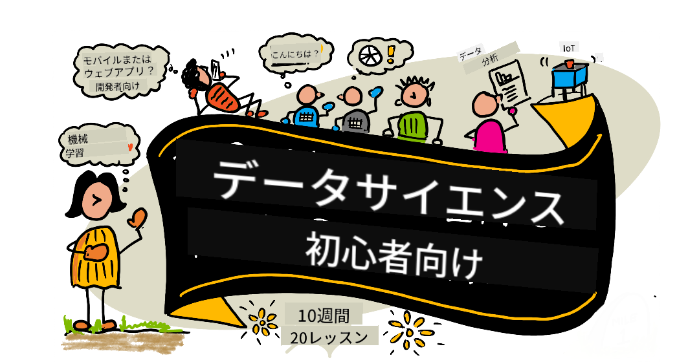

<!--
CO_OP_TRANSLATOR_METADATA:
{
  "original_hash": "9dc77d6fd78ee43189ae20d3d2206c00",
  "translation_date": "2025-10-11T14:26:36+00:00",
  "source_file": "README.md",
  "language_code": "ja"
}
-->
# 初心者のためのデータサイエンス - カリキュラム

MicrosoftのAzure Cloud Advocatesは、データサイエンスに関する10週間、20レッスンのカリキュラムを提供します。各レッスンには、事前・事後のクイズ、レッスンを完了するための手順書、解答例、課題が含まれています。プロジェクトベースの学習方法により、実際に作業しながら学ぶことで、新しいスキルを確実に身につけることができます。

**著者の皆様に感謝します:** [Jasmine Greenaway](https://www.twitter.com/paladique), [Dmitry Soshnikov](http://soshnikov.com), [Nitya Narasimhan](https://twitter.com/nitya), [Jalen McGee](https://twitter.com/JalenMcG), [Jen Looper](https://twitter.com/jenlooper), [Maud Levy](https://twitter.com/maudstweets), [Tiffany Souterre](https://twitter.com/TiffanySouterre), [Christopher Harrison](https://www.twitter.com/geektrainer).

**🙏 特別な感謝 🙏 をMicrosoft Student Ambassadorの著者、レビューアー、コンテンツ提供者の皆様に:** 特にAaryan Arora, [Aditya Garg](https://github.com/AdityaGarg00), [Alondra Sanchez](https://www.linkedin.com/in/alondra-sanchez-molina/), [Ankita Singh](https://www.linkedin.com/in/ankitasingh007), [Anupam Mishra](https://www.linkedin.com/in/anupam--mishra/), [Arpita Das](https://www.linkedin.com/in/arpitadas01/), ChhailBihari Dubey, [Dibri Nsofor](https://www.linkedin.com/in/dibrinsofor), [Dishita Bhasin](https://www.linkedin.com/in/dishita-bhasin-7065281bb), [Majd Safi](https://www.linkedin.com/in/majd-s/), [Max Blum](https://www.linkedin.com/in/max-blum-6036a1186/), [Miguel Correa](https://www.linkedin.com/in/miguelmque/), [Mohamma Iftekher (Iftu) Ebne Jalal](https://twitter.com/iftu119), [Nawrin Tabassum](https://www.linkedin.com/in/nawrin-tabassum), [Raymond Wangsa Putra](https://www.linkedin.com/in/raymond-wp/), [Rohit Yadav](https://www.linkedin.com/in/rty2423), Samridhi Sharma, [Sanya Sinha](https://www.linkedin.com/mwlite/in/sanya-sinha-13aab1200),
[Sheena Narula](https://www.linkedin.com/in/sheena-narua-n/), [Tauqeer Ahmad](https://www.linkedin.com/in/tauqeerahmad5201/), Yogendrasingh Pawar , [Vidushi Gupta](https://www.linkedin.com/in/vidushi-gupta07/), [Jasleen Sondhi](https://www.linkedin.com/in/jasleen-sondhi/)

||
|:---:|
| 初心者のためのデータサイエンス - _[@nitya](https://twitter.com/nitya)によるスケッチノート_ |

### 🌐 多言語対応

#### GitHub Actionによるサポート (自動更新 & 常に最新)

<!-- CO-OP TRANSLATOR LANGUAGES TABLE START -->
[アラビア語](../ar/README.md) | [ベンガル語](../bn/README.md) | [ブルガリア語](../bg/README.md) | [ビルマ語 (ミャンマー)](../my/README.md) | [中国語 (簡体字)](../zh/README.md) | [中国語 (繁体字, 香港)](../hk/README.md) | [中国語 (繁体字, マカオ)](../mo/README.md) | [中国語 (繁体字, 台湾)](../tw/README.md) | [クロアチア語](../hr/README.md) | [チェコ語](../cs/README.md) | [デンマーク語](../da/README.md) | [オランダ語](../nl/README.md) | [エストニア語](../et/README.md) | [フィンランド語](../fi/README.md) | [フランス語](../fr/README.md) | [ドイツ語](../de/README.md) | [ギリシャ語](../el/README.md) | [ヘブライ語](../he/README.md) | [ヒンディー語](../hi/README.md) | [ハンガリー語](../hu/README.md) | [インドネシア語](../id/README.md) | [イタリア語](../it/README.md) | [日本語](./README.md) | [韓国語](../ko/README.md) | [リトアニア語](../lt/README.md) | [マレー語](../ms/README.md) | [マラーティー語](../mr/README.md) | [ネパール語](../ne/README.md) | [ノルウェー語](../no/README.md) | [ペルシャ語 (ファルシー)](../fa/README.md) | [ポーランド語](../pl/README.md) | [ポルトガル語 (ブラジル)](../br/README.md) | [ポルトガル語 (ポルトガル)](../pt/README.md) | [パンジャブ語 (グルムキー)](../pa/README.md) | [ルーマニア語](../ro/README.md) | [ロシア語](../ru/README.md) | [セルビア語 (キリル文字)](../sr/README.md) | [スロバキア語](../sk/README.md) | [スロベニア語](../sl/README.md) | [スペイン語](../es/README.md) | [スワヒリ語](../sw/README.md) | [スウェーデン語](../sv/README.md) | [タガログ語 (フィリピン)](../tl/README.md) | [タミル語](../ta/README.md) | [タイ語](../th/README.md) | [トルコ語](../tr/README.md) | [ウクライナ語](../uk/README.md) | [ウルドゥー語](../ur/README.md) | [ベトナム語](../vi/README.md)
<!-- CO-OP TRANSLATOR LANGUAGES TABLE END -->

**追加の翻訳を希望する場合は、[こちら](https://github.com/Azure/co-op-translator/blob/main/getting_started/supported-languages.md)に対応言語が記載されています**

#### コミュニティに参加しよう

現在、AIを使った学習シリーズをDiscordで開催中です。詳細を確認し、2025年9月18日から30日までの[Learn with AI Series](https://aka.ms/learnwithai/discord)に参加してください。GitHub Copilotをデータサイエンスで活用するためのヒントやコツを学べます。

# 学生の方へ

以下のリソースから始めましょう:

- [Student Hubページ](https://docs.microsoft.com/en-gb/learn/student-hub?WT.mc_id=academic-77958-bethanycheum) このページでは、初心者向けリソース、学生向けパック、さらには無料の認定証バウチャーを取得する方法が見つかります。このページはブックマークして、定期的にチェックしてください。コンテンツは少なくとも月に一度更新されます。
- [Microsoft Learn Student Ambassadors](https://studentambassadors.microsoft.com?WT.mc_id=academic-77958-bethanycheum) グローバルな学生アンバサダーコミュニティに参加しましょう。これがMicrosoftへの道になるかもしれません。

# 始め方

## 📚 ドキュメント

- **[インストールガイド](INSTALLATION.md)** - 初心者向けのステップバイステップのセットアップ手順
- **[使用ガイド](USAGE.md)** - 使用例と一般的なワークフロー
- **[トラブルシューティング](TROUBLESHOOTING.md)** - よくある問題の解決策
- **[コントリビューションガイド](CONTRIBUTING.md)** - このプロジェクトへの貢献方法
- **[教師向け](for-teachers.md)** - 教育指導と教室リソース

## 👨‍🎓 学生向け
> **完全な初心者**: データサイエンスが初めての方は、[初心者向けの例](examples/README.md)から始めてください！これらのシンプルでコメントが充実した例は、カリキュラムに進む前に基本を理解するのに役立ちます。
> **[学生](https://aka.ms/student-page)**: このカリキュラムを自分で使用するには、リポジトリ全体をフォークし、事前講義クイズから始めて、演習を自分で完了してください。その後、講義を読み、残りの活動を完了します。解答コードをコピーするのではなく、レッスンを理解してプロジェクトを作成するようにしてください。ただし、解答コードは各プロジェクト指向のレッスンの/solutionsフォルダーにあります。また、友達と勉強グループを作り、一緒にコンテンツを進めるのも良いアイデアです。さらに学習するには、[Microsoft Learn](https://docs.microsoft.com/en-us/users/jenlooper-2911/collections/qprpajyoy3x0g7?WT.mc_id=academic-77958-bethanycheum)をお勧めします。

**クイックスタート:**
1. [インストールガイド](INSTALLATION.md)を確認して環境をセットアップ
2. [使用ガイド](USAGE.md)をレビューしてカリキュラムの使い方を学ぶ
3. レッスン1から順番に進める
4. サポートのために[Discordコミュニティ](https://aka.ms/ds4beginners/discord)に参加

## 👩‍🏫 教師向け

> **教師の方へ**: このカリキュラムの使用方法について[いくつかの提案](for-teachers.md)を含めています。ぜひ[ディスカッションフォーラム](https://github.com/microsoft/Data-Science-For-Beginners/discussions)でフィードバックをお寄せください！

## チーム紹介

**Gif作成者** [Mohit Jaisal](https://www.linkedin.com/in/mohitjaisal)

> 🎥 上の画像をクリックして、このプロジェクトと作成者についての動画をご覧ください！

## 教育方法
私たちはこのカリキュラムを構築する際に、プロジェクトベースであることと頻繁なクイズを含むことを重視した2つの教育的な原則を選びました。このシリーズの終わりまでに、学生はデータサイエンスの基本原則を学びます。これには倫理的な概念、データ準備、データの扱い方の多様性、データの可視化、データ分析、データサイエンスの実世界での活用例などが含まれます。

さらに、授業前の低リスクなクイズは、学生がトピックを学ぶ意欲を高め、授業後のクイズは記憶の定着を促します。このカリキュラムは柔軟で楽しい内容になるよう設計されており、全体を通して学ぶことも部分的に学ぶことも可能です。プロジェクトは小規模なものから始まり、10週間のサイクルの終わりには徐々に複雑になっていきます。

> [行動規範](CODE_OF_CONDUCT.md)、[貢献ガイドライン](CONTRIBUTING.md)、[翻訳ガイドライン](TRANSLATIONS.md)をご覧ください。建設的なフィードバックを歓迎します！

## 各レッスンには以下が含まれます：

- オプションのスケッチノート
- オプションの補足動画
- レッスン前のウォームアップクイズ
- 書かれたレッスン内容
- プロジェクトベースのレッスンでは、プロジェクトを構築するためのステップバイステップガイド
- 知識チェック
- チャレンジ
- 補足読書
- 課題
- [レッスン後のクイズ](https://ff-quizzes.netlify.app/en/)

> **クイズについての注意**: すべてのクイズはQuiz-Appフォルダーに含まれており、合計40個のクイズがあり、それぞれ3問ずつです。レッスン内からリンクされていますが、クイズアプリはローカルで実行することもAzureにデプロイすることも可能です。`quiz-app`フォルダー内の指示に従ってください。クイズは徐々にローカライズされています。

## 🎓 初心者向けの例

**データサイエンスが初めてですか？** 特別に作成した[例のディレクトリ](examples/README.md)には、簡単でコメントが充実したコードが含まれており、初心者が始めるのに役立ちます：

- 🌟 **Hello World** - 初めてのデータサイエンスプログラム
- 📂 **データの読み込み** - データセットの読み取りと探索を学ぶ
- 📊 **簡単な分析** - 統計を計算し、パターンを見つける
- 📈 **基本的な可視化** - チャートやグラフを作成する
- 🔬 **実世界のプロジェクト** - 開始から終了までの完全なワークフロー

各例には、各ステップを説明する詳細なコメントが含まれており、初心者に最適です！

👉 **[例から始める](examples/README.md)** 👈

## レッスン

||
|:---:|
| データサイエンス初心者向け: ロードマップ - _[@nitya](https://twitter.com/nitya)によるスケッチノート_ |

| レッスン番号 | トピック | レッスングループ | 学習目標 | リンクされたレッスン | 著者 |
| :-----------: | :----------------------------------------: | :--------------------------------------------------: | :-----------------------------------------------------------------------------------------------------------------------------------------------------------------------: | :---------------------------------------------------------------------: | :----: |
| 01 | データサイエンスの定義 | [イントロダクション](1-Introduction/README.md) | データサイエンスの基本概念と、それが人工知能、機械学習、大量データとどのように関連しているかを学ぶ。 | [レッスン](1-Introduction/01-defining-data-science/README.md) [動画](https://youtu.be/beZ7Mb_oz9I) | [Dmitry](http://soshnikov.com) |
| 02 | データサイエンス倫理 | [イントロダクション](1-Introduction/README.md) | データ倫理の概念、課題、フレームワーク。 | [レッスン](1-Introduction/02-ethics/README.md) | [Nitya](https://twitter.com/nitya) |
| 03 | データの定義 | [イントロダクション](1-Introduction/README.md) | データの分類方法とその一般的なソース。 | [レッスン](1-Introduction/03-defining-data/README.md) | [Jasmine](https://www.twitter.com/paladique) |
| 04 | 統計と確率のイントロダクション | [イントロダクション](1-Introduction/README.md) | データを理解するための確率と統計の数学的手法。 | [レッスン](1-Introduction/04-stats-and-probability/README.md) [動画](https://youtu.be/Z5Zy85g4Yjw) | [Dmitry](http://soshnikov.com) |
| 05 | リレーショナルデータの扱い | [データの扱い](2-Working-With-Data/README.md) | リレーショナルデータのイントロダクションと、SQL（「シークエル」と発音される）を使用したリレーショナルデータの探索と分析の基本。 | [レッスン](2-Working-With-Data/05-relational-databases/README.md) | [Christopher](https://www.twitter.com/geektrainer) | | |
| 06 | NoSQLデータの扱い | [データの扱い](2-Working-With-Data/README.md) | 非リレーショナルデータのイントロダクション、そのさまざまな種類、およびドキュメントデータベースの探索と分析の基本。 | [レッスン](2-Working-With-Data/06-non-relational/README.md) | [Jasmine](https://twitter.com/paladique)|
| 07 | Pythonの扱い | [データの扱い](2-Working-With-Data/README.md) | Pandasなどのライブラリを使用したデータ探索のためのPythonの基本。Pythonプログラミングの基礎的な理解が推奨されます。 | [レッスン](2-Working-With-Data/07-python/README.md) [動画](https://youtu.be/dZjWOGbsN4Y) | [Dmitry](http://soshnikov.com) |
| 08 | データ準備 | [データの扱い](2-Working-With-Data/README.md) | 欠損、不正確、不完全なデータの課題に対処するためのデータクリーニングと変換の技術に関するトピック。 | [レッスン](2-Working-With-Data/08-data-preparation/README.md) | [Jasmine](https://www.twitter.com/paladique) |
| 09 | 数量の可視化 | [データ可視化](3-Data-Visualization/README.md) | Matplotlibを使用して鳥のデータを可視化する方法を学ぶ 🦆 | [レッスン](3-Data-Visualization/09-visualization-quantities/README.md) | [Jen](https://twitter.com/jenlooper) |
| 10 | データ分布の可視化 | [データ可視化](3-Data-Visualization/README.md) | 区間内の観察と傾向を可視化する。 | [レッスン](3-Data-Visualization/10-visualization-distributions/README.md) | [Jen](https://twitter.com/jenlooper) |
| 11 | 比率の可視化 | [データ可視化](3-Data-Visualization/README.md) | 離散的およびグループ化された割合を可視化する。 | [レッスン](3-Data-Visualization/11-visualization-proportions/README.md) | [Jen](https://twitter.com/jenlooper) |
| 12 | 関係性の可視化 | [データ可視化](3-Data-Visualization/README.md) | データセットとその変数間の接続と相関を可視化する。 | [レッスン](3-Data-Visualization/12-visualization-relationships/README.md) | [Jen](https://twitter.com/jenlooper) |
| 13 | 意味のある可視化 | [データ可視化](3-Data-Visualization/README.md) | 問題解決と洞察を効果的にするために、可視化を価値あるものにする技術とガイダンス。 | [レッスン](3-Data-Visualization/13-meaningful-visualizations/README.md) | [Jen](https://twitter.com/jenlooper) |
| 14 | データサイエンスライフサイクルのイントロダクション | [ライフサイクル](4-Data-Science-Lifecycle/README.md) | データサイエンスライフサイクルのイントロダクションとその最初のステップであるデータの取得と抽出。 | [レッスン](4-Data-Science-Lifecycle/14-Introduction/README.md) | [Jasmine](https://twitter.com/paladique) |
| 15 | 分析 | [ライフサイクル](4-Data-Science-Lifecycle/README.md) | データサイエンスライフサイクルのこのフェーズでは、データを分析する技術に焦点を当てる。 | [レッスン](4-Data-Science-Lifecycle/15-analyzing/README.md) | [Jasmine](https://twitter.com/paladique) | | |
| 16 | コミュニケーション | [ライフサイクル](4-Data-Science-Lifecycle/README.md) | データサイエンスライフサイクルのこのフェーズでは、意思決定者が理解しやすい形でデータから得られた洞察を提示することに焦点を当てる。 | [レッスン](4-Data-Science-Lifecycle/16-communication/README.md) | [Jalen](https://twitter.com/JalenMcG) | | |
| 17 | クラウドでのデータサイエンス | [クラウドデータ](5-Data-Science-In-Cloud/README.md) | クラウドでのデータサイエンスとその利点を紹介する一連のレッスン。 | [レッスン](5-Data-Science-In-Cloud/17-Introduction/README.md) | [Tiffany](https://twitter.com/TiffanySouterre) と [Maud](https://twitter.com/maudstweets) |
| 18 | クラウドでのデータサイエンス | [クラウドデータ](5-Data-Science-In-Cloud/README.md) | ローコードツールを使用したモデルのトレーニング。 |[レッスン](5-Data-Science-In-Cloud/18-Low-Code/README.md) | [Tiffany](https://twitter.com/TiffanySouterre) と [Maud](https://twitter.com/maudstweets) |
| 19 | クラウドでのデータサイエンス | [クラウドデータ](5-Data-Science-In-Cloud/README.md) | Azure Machine Learning Studioを使用したモデルのデプロイ。 | [レッスン](5-Data-Science-In-Cloud/19-Azure/README.md)| [Tiffany](https://twitter.com/TiffanySouterre) と [Maud](https://twitter.com/maudstweets) |
| 20 | 実世界でのデータサイエンス | [実世界で](6-Data-Science-In-Wild/README.md) | 実世界でのデータサイエンス駆動型プロジェクト。 | [レッスン](6-Data-Science-In-Wild/20-Real-World-Examples/README.md) | [Nitya](https://twitter.com/nitya) |

## GitHub Codespaces

Codespaceでこのサンプルを開く手順：
1. Codeドロップダウンメニューをクリックし、「Open with Codespaces」オプションを選択します。
2. ペインの下部にある「+ New codespace」を選択します。
詳細については、[GitHubのドキュメント](https://docs.github.com/en/codespaces/developing-in-codespaces/creating-a-codespace-for-a-repository#creating-a-codespace)をご覧ください。

## VSCode Remote - Containers
VSCodeのRemote - Containers拡張機能を使用して、ローカルマシンでこのリポジトリをコンテナ内で開く手順：

1. 開発コンテナを初めて使用する場合は、[開始ドキュメント](https://code.visualstudio.com/docs/devcontainers/containers#_getting-started)でシステムが前提条件を満たしていることを確認してください（例：Dockerがインストールされていること）。

このリポジトリを使用するには、以下のいずれかの方法を選択してください：

**注意**: 内部的には、Remote-Containers: **Clone Repository in Container Volume...** コマンドを使用して、ソースコードをローカルファイルシステムではなくDockerボリュームにクローンします。[ボリューム](https://docs.docker.com/storage/volumes/)はコンテナデータを永続化するための推奨メカニズムです。

または、ローカルにクローンまたはダウンロードしたリポジトリを開く：

- このリポジトリをローカルファイルシステムにクローンします。
- F1キーを押して、**Remote-Containers: Open Folder in Container...** コマンドを選択します。
- このフォルダーのクローンコピーを選択し、コンテナが起動するのを待って試してみてください。

## オフラインアクセス

[Docsify](https://docsify.js.org/#/)を使用して、このドキュメントをオフラインで実行できます。このリポジトリをフォークし、ローカルマシンに[Docsifyをインストール](https://docsify.js.org/#/quickstart)した後、このリポジトリのルートフォルダーで`docsify serve`と入力してください。ウェブサイトはローカルホストのポート3000で提供されます：`localhost:3000`。

> 注意：ノートブックはDocsifyではレンダリングされないため、ノートブックを実行する必要がある場合は、Pythonカーネルを実行しているVS Codeで別途行ってください。

## その他のカリキュラム

私たちのチームは他のカリキュラムも制作しています！以下をご覧ください：

- [初心者向けEdge AI](https://aka.ms/edgeai-for-beginners)
- [初心者向けAIエージェント](https://aka.ms/ai-agents-beginners)
- [初心者向け生成AI](https://aka.ms/genai-beginners)
- [初心者向け生成AI .NET](https://github.com/microsoft/Generative-AI-for-beginners-dotnet)
- [JavaScriptでの生成AI](https://github.com/microsoft/generative-ai-with-javascript)
- [Javaでの生成AI](https://aka.ms/genaijava)
- [初心者向けAI](https://aka.ms/ai-beginners)
- [初心者向けデータサイエンス](https://aka.ms/datascience-beginners)
- [初心者向けBash](https://github.com/microsoft/bash-for-beginners)
- [初心者向け機械学習](https://aka.ms/ml-beginners)
- [初心者向けサイバーセキュリティ](https://github.com/microsoft/Security-101) 
- [初心者向けWeb開発](https://aka.ms/webdev-beginners)  
- [初心者向けIoT](https://aka.ms/iot-beginners)  
- [初心者向け機械学習](https://aka.ms/ml-beginners)  
- [初心者向けXR開発](https://aka.ms/xr-dev-for-beginners)  
- [GitHub Copilotを活用したAIペアプログラミングの習得](https://aka.ms/GitHubCopilotAI)  
- [初心者向けXR開発](https://github.com/microsoft/xr-development-for-beginners)  
- [C#/.NET開発者向けGitHub Copilotの習得](https://github.com/microsoft/mastering-github-copilot-for-dotnet-csharp-developers)  
- [自分で選ぶCopilotの冒険](https://github.com/microsoft/CopilotAdventures)  

## ヘルプを得る

**問題が発生しましたか？** よくある問題の解決策については、[トラブルシューティングガイド](TROUBLESHOOTING.md)をご確認ください。

行き詰まったり、AIアプリの構築に関して質問がある場合は、以下に参加してください：

製品に関するフィードバックや構築中のエラーについては、以下をご利用ください：

---

**免責事項**:  
この文書は、AI翻訳サービス[Co-op Translator](https://github.com/Azure/co-op-translator)を使用して翻訳されています。正確性を追求しておりますが、自動翻訳には誤りや不正確な部分が含まれる可能性があります。元の言語で記載された文書を正式な情報源としてお考えください。重要な情報については、専門の人間による翻訳を推奨します。この翻訳の使用に起因する誤解や誤解釈について、当方は一切の責任を負いません。