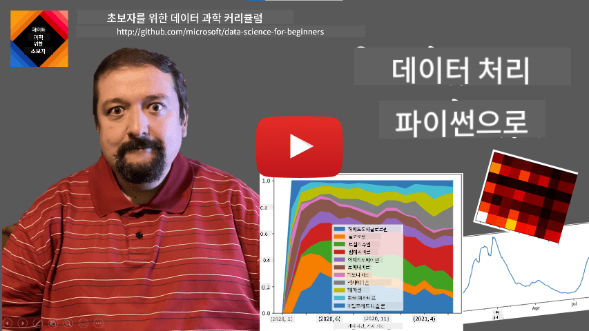
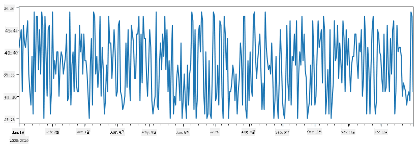
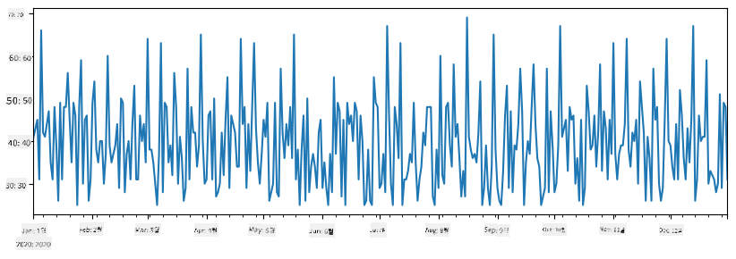
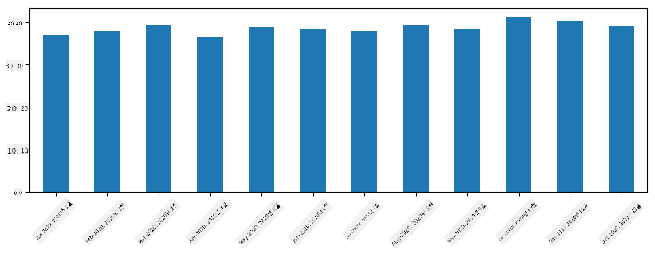
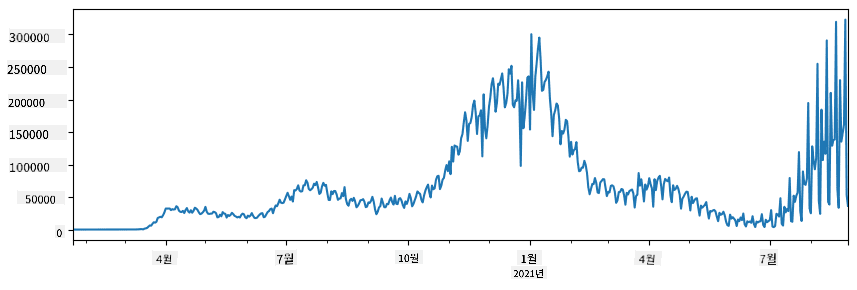
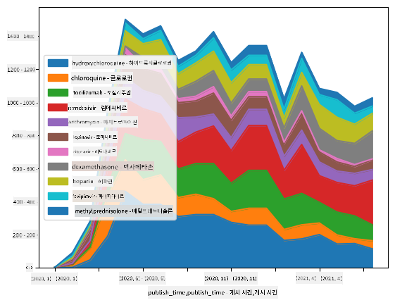

<!--
CO_OP_TRANSLATOR_METADATA:
{
  "original_hash": "7bfec050f4717dcc2dfd028aca9d21f3",
  "translation_date": "2025-09-06T15:31:08+00:00",
  "source_file": "2-Working-With-Data/07-python/README.md",
  "language_code": "ko"
}
-->
# 데이터 작업: Python과 Pandas 라이브러리

|  ](../../sketchnotes/07-WorkWithPython.png) |
| :-------------------------------------------------------------------------------------------------------: |
|                 Python 작업하기 - _Sketchnote by [@nitya](https://twitter.com/nitya)_                     |

[](https://youtu.be/dZjWOGbsN4Y)

데이터베이스는 데이터를 저장하고 쿼리 언어를 사용하여 데이터를 조회하는 데 매우 효율적인 방법을 제공하지만, 데이터 처리를 가장 유연하게 수행하는 방법은 직접 프로그램을 작성하여 데이터를 조작하는 것입니다. 많은 경우 데이터베이스 쿼리가 더 효과적인 방법일 수 있습니다. 하지만 더 복잡한 데이터 처리가 필요한 경우 SQL로 쉽게 처리할 수 없는 경우도 있습니다.  
데이터 처리는 어떤 프로그래밍 언어로도 작성할 수 있지만, 데이터 작업에 있어 더 높은 수준의 언어들이 있습니다. 데이터 과학자들은 일반적으로 다음 언어들 중 하나를 선호합니다:

* **[Python](https://www.python.org/)**: 범용 프로그래밍 언어로, 그 간단함 때문에 초보자에게 가장 적합한 옵션 중 하나로 간주됩니다. Python은 ZIP 아카이브에서 데이터를 추출하거나 이미지를 그레이스케일로 변환하는 등 많은 실용적인 문제를 해결할 수 있는 추가 라이브러리를 많이 제공합니다. 데이터 과학 외에도 Python은 웹 개발에도 자주 사용됩니다.
* **[R](https://www.r-project.org/)**: 통계 데이터 처리를 염두에 두고 개발된 전통적인 도구입니다. R은 대규모 라이브러리 저장소(CRAN)를 포함하고 있어 데이터 처리에 적합한 선택입니다. 하지만 R은 범용 프로그래밍 언어가 아니며 데이터 과학 도메인 외에서는 거의 사용되지 않습니다.
* **[Julia](https://julialang.org/)**: 데이터 과학을 위해 특별히 개발된 또 다른 언어입니다. Python보다 더 나은 성능을 제공하도록 설계되어 과학적 실험에 적합한 도구입니다.

이번 강의에서는 Python을 사용한 간단한 데이터 처리에 초점을 맞출 것입니다. Python 언어에 대한 기본적인 친숙함을 가정합니다. Python에 대한 더 깊은 학습을 원한다면 다음 리소스를 참조할 수 있습니다:

* [Learn Python in a Fun Way with Turtle Graphics and Fractals](https://github.com/shwars/pycourse) - Python 프로그래밍에 대한 GitHub 기반의 빠른 입문 과정
* [Take your First Steps with Python](https://docs.microsoft.com/en-us/learn/paths/python-first-steps/?WT.mc_id=academic-77958-bethanycheum) - [Microsoft Learn](http://learn.microsoft.com/?WT.mc_id=academic-77958-bethanycheum)에서 제공하는 학습 경로

데이터는 다양한 형태로 제공될 수 있습니다. 이번 강의에서는 **표 형식 데이터**, **텍스트**, **이미지**의 세 가지 형태의 데이터를 고려할 것입니다.

우리는 관련 라이브러리 전체를 다루는 대신 몇 가지 데이터 처리 예제에 집중할 것입니다. 이를 통해 가능한 작업의 주요 아이디어를 얻고, 필요할 때 문제 해결 방법을 찾을 수 있는 이해를 제공할 것입니다.

> **가장 유용한 조언**: 데이터를 처리하는 특정 작업을 수행해야 하지만 방법을 모를 경우 인터넷에서 검색해 보세요. [Stackoverflow](https://stackoverflow.com/)에는 많은 일반적인 작업에 대한 유용한 Python 코드 샘플이 포함되어 있습니다.

## [강의 전 퀴즈](https://ff-quizzes.netlify.app/en/ds/quiz/12)

## 표 형식 데이터와 데이터프레임

관계형 데이터베이스를 논의할 때 이미 표 형식 데이터를 접한 적이 있습니다. 많은 데이터가 있고 여러 개의 연결된 테이블에 포함되어 있다면 SQL을 사용하는 것이 확실히 합리적입니다. 하지만 데이터 과학에서는 데이터의 분포, 값 간의 상관관계 등 데이터를 이해하거나 통찰력을 얻어야 하는 경우가 많습니다. 또한 원본 데이터를 변환한 후 시각화를 수행해야 하는 경우도 많습니다. 이러한 단계는 Python을 사용하여 쉽게 수행할 수 있습니다.

Python에서 표 형식 데이터를 처리하는 데 유용한 두 가지 주요 라이브러리가 있습니다:
* **[Pandas](https://pandas.pydata.org/)**: **데이터프레임**을 조작할 수 있게 해주는 라이브러리로, 관계형 테이블과 유사합니다. 이름이 지정된 열을 가질 수 있으며, 행, 열 및 데이터프레임 전체에 대해 다양한 작업을 수행할 수 있습니다.
* **[Numpy](https://numpy.org/)**: **텐서**, 즉 다차원 **배열**을 처리하는 라이브러리입니다. 배열은 동일한 기본 유형의 값을 가지며 데이터프레임보다 간단하지만 더 많은 수학적 작업을 제공하며 오버헤드가 적습니다.

또한 알아두면 좋은 몇 가지 다른 라이브러리가 있습니다:
* **[Matplotlib](https://matplotlib.org/)**: 데이터 시각화 및 그래프 그리기에 사용되는 라이브러리
* **[SciPy](https://www.scipy.org/)**: 추가적인 과학적 기능을 제공하는 라이브러리. 확률 및 통계에 대해 논의할 때 이미 이 라이브러리를 접한 적이 있습니다.

다음은 Python 프로그램의 시작 부분에서 이러한 라이브러리를 가져오는 데 일반적으로 사용하는 코드입니다:
```python
import numpy as np
import pandas as pd
import matplotlib.pyplot as plt
from scipy import ... # you need to specify exact sub-packages that you need
``` 

Pandas는 몇 가지 기본 개념을 중심으로 구성됩니다.

### 시리즈 (Series)

**시리즈**는 리스트나 numpy 배열과 유사한 값의 시퀀스입니다. 주요 차이점은 시리즈에는 **인덱스**가 있다는 점이며, 시리즈를 조작할 때(예: 더하기) 인덱스가 고려됩니다. 인덱스는 리스트나 배열에서 기본적으로 사용되는 정수 행 번호처럼 간단할 수도 있고, 날짜 간격과 같은 복잡한 구조를 가질 수도 있습니다.

> **참고**: 동반된 노트북 [`notebook.ipynb`](notebook.ipynb)에 Pandas의 소개 코드가 포함되어 있습니다. 여기에서는 몇 가지 예제를 간략히 설명하며, 전체 노트북을 확인해보는 것을 권장합니다.

예를 들어, 아이스크림 가게의 판매 데이터를 분석하고 싶다고 가정해 봅시다. 특정 기간 동안 판매량(매일 판매된 아이템 수)의 시리즈를 생성해 보겠습니다:

```python
start_date = "Jan 1, 2020"
end_date = "Mar 31, 2020"
idx = pd.date_range(start_date,end_date)
print(f"Length of index is {len(idx)}")
items_sold = pd.Series(np.random.randint(25,50,size=len(idx)),index=idx)
items_sold.plot()
```


이제 매주 친구들과 파티를 열고 추가로 아이스크림 10팩을 가져간다고 가정해 봅시다. 이를 나타내는 또 다른 시리즈를 생성할 수 있습니다:
```python
additional_items = pd.Series(10,index=pd.date_range(start_date,end_date,freq="W"))
```
두 시리즈를 더하면 총 판매량을 얻을 수 있습니다:
```python
total_items = items_sold.add(additional_items,fill_value=0)
total_items.plot()
```


> **참고**: 단순한 문법 `total_items+additional_items`을 사용하지 않았습니다. 그렇게 하면 결과 시리즈에 많은 `NaN`(*Not a Number*) 값이 생깁니다. 이는 `additional_items` 시리즈의 일부 인덱스 포인트에 값이 없기 때문이며, `NaN`을 다른 값에 더하면 결과는 `NaN`이 됩니다. 따라서 덧셈 중에 `fill_value` 매개변수를 지정해야 합니다.

시계열 데이터를 사용하면 다른 시간 간격으로 시리즈를 **재샘플링**할 수도 있습니다. 예를 들어, 월별 평균 판매량을 계산하고 싶다면 다음 코드를 사용할 수 있습니다:
```python
monthly = total_items.resample("1M").mean()
ax = monthly.plot(kind='bar')
```


### 데이터프레임 (DataFrame)

데이터프레임은 기본적으로 동일한 인덱스를 가진 여러 시리즈의 모음입니다. 여러 시리즈를 결합하여 데이터프레임을 만들 수 있습니다:
```python
a = pd.Series(range(1,10))
b = pd.Series(["I","like","to","play","games","and","will","not","change"],index=range(0,9))
df = pd.DataFrame([a,b])
```
이렇게 하면 다음과 같은 가로형 테이블이 생성됩니다:
|     | 0   | 1    | 2   | 3   | 4      | 5   | 6      | 7    | 8    |
| --- | --- | ---- | --- | --- | ------ | --- | ------ | ---- | ---- |
| 0   | 1   | 2    | 3   | 4   | 5      | 6   | 7      | 8    | 9    |
| 1   | I   | like | to  | use | Python | and | Pandas | very | much |

시리즈를 열로 사용하고 딕셔너리를 사용하여 열 이름을 지정할 수도 있습니다:
```python
df = pd.DataFrame({ 'A' : a, 'B' : b })
```
이렇게 하면 다음과 같은 테이블이 생성됩니다:

|     | A   | B      |
| --- | --- | ------ |
| 0   | 1   | I      |
| 1   | 2   | like   |
| 2   | 3   | to     |
| 3   | 4   | use    |
| 4   | 5   | Python |
| 5   | 6   | and    |
| 6   | 7   | Pandas |
| 7   | 8   | very   |
| 8   | 9   | much   |

**참고**: 이전 테이블을 전치하여 동일한 테이블 레이아웃을 얻을 수도 있습니다. 예를 들어, 다음과 같이 작성하면 됩니다:
```python
df = pd.DataFrame([a,b]).T..rename(columns={ 0 : 'A', 1 : 'B' })
```
여기서 `.T`는 데이터프레임을 전치하는 작업을 의미하며, `rename` 작업을 통해 이전 예제와 일치하도록 열 이름을 변경할 수 있습니다.

데이터프레임에서 수행할 수 있는 몇 가지 중요한 작업은 다음과 같습니다:

**열 선택**. `df['A']`를 작성하여 개별 열을 선택할 수 있습니다. 이 작업은 시리즈를 반환합니다. `df[['B','A']]`를 작성하여 열의 하위 집합을 다른 데이터프레임으로 선택할 수도 있습니다. 이 작업은 또 다른 데이터프레임을 반환합니다.

**특정 행 필터링**. 예를 들어, 열 `A`가 5보다 큰 행만 남기려면 `df[df['A']>5]`를 작성할 수 있습니다.

> **참고**: 필터링이 작동하는 방식은 다음과 같습니다. 표현식 `df['A']<5`는 부울 시리즈를 반환하며, 이는 원래 시리즈 `df['A']`의 각 요소에 대해 표현식이 `True`인지 `False`인지 나타냅니다. 부울 시리즈가 인덱스로 사용되면 데이터프레임의 행 하위 집합을 반환합니다. 따라서 임의의 Python 부울 표현식을 사용할 수 없습니다. 예를 들어, `df[df['A']>5 and df['A']<7]`를 작성하는 것은 잘못된 방식입니다. 대신 부울 시리즈에 대한 특별한 `&` 연산을 사용하여 `df[(df['A']>5) & (df['A']<7)]`를 작성해야 합니다(*괄호가 중요합니다*).

**새로운 계산 가능한 열 생성**. 직관적인 표현식을 사용하여 데이터프레임에 새로운 계산 가능한 열을 쉽게 생성할 수 있습니다:
```python
df['DivA'] = df['A']-df['A'].mean() 
``` 
이 예제는 A의 평균값에서의 편차를 계산합니다. 여기서 실제로 발생하는 것은 시리즈를 계산한 다음 왼쪽에 할당하여 새 열을 생성하는 것입니다. 따라서 시리즈와 호환되지 않는 작업은 사용할 수 없습니다. 예를 들어, 아래 코드는 잘못된 방식입니다:
```python
# Wrong code -> df['ADescr'] = "Low" if df['A'] < 5 else "Hi"
df['LenB'] = len(df['B']) # <- Wrong result
``` 
후자의 예제는 문법적으로는 올바르지만 잘못된 결과를 제공합니다. 이는 시리즈 `B`의 길이를 열의 모든 값에 할당하기 때문이며, 우리가 의도한 개별 요소의 길이가 아닙니다.

이와 같은 복잡한 표현식을 계산해야 하는 경우 `apply` 함수를 사용할 수 있습니다. 마지막 예제는 다음과 같이 작성할 수 있습니다:
```python
df['LenB'] = df['B'].apply(lambda x : len(x))
# or 
df['LenB'] = df['B'].apply(len)
```

위 작업을 수행한 후 다음 데이터프레임을 얻게 됩니다:

|     | A   | B      | DivA | LenB |
| --- | --- | ------ | ---- | ---- |
| 0   | 1   | I      | -4.0 | 1    |
| 1   | 2   | like   | -3.0 | 4    |
| 2   | 3   | to     | -2.0 | 2    |
| 3   | 4   | use    | -1.0 | 3    |
| 4   | 5   | Python | 0.0  | 6    |
| 5   | 6   | and    | 1.0  | 3    |
| 6   | 7   | Pandas | 2.0  | 6    |
| 7   | 8   | very   | 3.0  | 4    |
| 8   | 9   | much   | 4.0  | 4    |

**숫자를 기준으로 행 선택**은 `iloc` 구문을 사용하여 수행할 수 있습니다. 예를 들어, 데이터프레임에서 처음 5개의 행을 선택하려면:
```python
df.iloc[:5]
```

**그룹화**는 종종 Excel의 *피벗 테이블*과 유사한 결과를 얻는 데 사용됩니다. 예를 들어, `LenB`의 각 숫자에 대해 열 `A`의 평균값을 계산하고 싶다면 데이터프레임을 `LenB`로 그룹화한 다음 `mean`을 호출할 수 있습니다:
```python
df.groupby(by='LenB')[['A','DivA']].mean()
```
그룹의 평균값과 요소 수를 계산해야 하는 경우 더 복잡한 `aggregate` 함수를 사용할 수 있습니다:
```python
df.groupby(by='LenB') \
 .aggregate({ 'DivA' : len, 'A' : lambda x: x.mean() }) \
 .rename(columns={ 'DivA' : 'Count', 'A' : 'Mean'})
```
이렇게 하면 다음과 같은 테이블이 생성됩니다:

| LenB | Count | Mean     |
| ---- | ----- | -------- |
| 1    | 1     | 1.000000 |
| 2    | 1     | 3.000000 |
| 3    | 2     | 5.000000 |
| 4    | 3     | 6.333333 |
| 6    | 2     | 6.000000 |

### 데이터 가져오기
우리는 Python 객체로부터 Series와 DataFrame을 생성하는 것이 얼마나 쉬운지 살펴보았습니다. 하지만 데이터는 보통 텍스트 파일이나 Excel 테이블 형태로 제공됩니다. 다행히도 Pandas는 디스크에서 데이터를 로드하는 간단한 방법을 제공합니다. 예를 들어, CSV 파일을 읽는 것은 다음과 같이 간단합니다:
```python
df = pd.read_csv('file.csv')
```
"Challenge" 섹션에서 외부 웹사이트에서 데이터를 가져오는 것을 포함한 더 많은 데이터 로드 예제를 살펴볼 것입니다.

### 출력 및 시각화

데이터 과학자는 데이터를 탐색해야 하는 경우가 많으므로 데이터를 시각화할 수 있는 것이 중요합니다. DataFrame이 클 경우, 우리가 모든 것을 올바르게 수행하고 있는지 확인하기 위해 처음 몇 줄만 출력하고 싶을 때가 많습니다. 이는 `df.head()`를 호출하여 수행할 수 있습니다. Jupyter Notebook에서 실행하면 DataFrame이 보기 좋은 표 형태로 출력됩니다.

우리는 또한 몇몇 열을 시각화하기 위해 `plot` 함수의 사용법을 살펴보았습니다. `plot`은 많은 작업에 매우 유용하며 `kind=` 매개변수를 통해 다양한 그래프 유형을 지원하지만, 더 복잡한 것을 그리기 위해 항상 기본 `matplotlib` 라이브러리를 사용할 수 있습니다. 데이터 시각화는 별도의 강의에서 자세히 다룰 것입니다.

이 개요는 Pandas의 가장 중요한 개념을 다루지만, 이 라이브러리는 매우 풍부하며 할 수 있는 일에는 한계가 없습니다! 이제 이 지식을 특정 문제를 해결하는 데 적용해 봅시다.

## 🚀 Challenge 1: COVID 확산 분석

우리가 집중할 첫 번째 문제는 COVID-19의 전염병 확산 모델링입니다. 이를 위해 [Johns Hopkins University](https://jhu.edu/)의 [Center for Systems Science and Engineering](https://systems.jhu.edu/) (CSSE)에서 제공하는 다양한 국가의 감염자 수 데이터를 사용할 것입니다. 데이터셋은 [이 GitHub 저장소](https://github.com/CSSEGISandData/COVID-19)에서 이용할 수 있습니다.

데이터를 다루는 방법을 보여주기 위해 [`notebook-covidspread.ipynb`](notebook-covidspread.ipynb)를 열어 처음부터 끝까지 읽어보시길 권장합니다. 셀을 실행하고, 마지막에 남겨둔 몇 가지 도전을 수행할 수도 있습니다.



> Jupyter Notebook에서 코드를 실행하는 방법을 모른다면 [이 기사](https://soshnikov.com/education/how-to-execute-notebooks-from-github/)를 참고하세요.

## 비정형 데이터 작업

데이터는 매우 자주 표 형식으로 제공되지만, 경우에 따라 텍스트나 이미지와 같은 덜 구조화된 데이터를 다뤄야 할 때도 있습니다. 이 경우, 위에서 본 데이터 처리 기술을 적용하려면 구조화된 데이터를 **추출**해야 합니다. 몇 가지 예는 다음과 같습니다:

* 텍스트에서 키워드를 추출하고 해당 키워드가 얼마나 자주 나타나는지 확인
* 신경망을 사용하여 사진 속 객체에 대한 정보 추출
* 비디오 카메라 피드에서 사람들의 감정 정보 얻기

## 🚀 Challenge 2: COVID 논문 분석

이 도전에서는 COVID 팬데믹 주제를 계속 다루며, 관련 과학 논문을 처리하는 데 초점을 맞춥니다. [CORD-19 Dataset](https://www.kaggle.com/allen-institute-for-ai/CORD-19-research-challenge)에는 COVID에 관한 7000개 이상의 논문(작성 당시 기준)이 메타데이터와 초록과 함께 제공됩니다(약 절반은 전체 텍스트도 제공됨).

이 데이터셋을 [Text Analytics for Health](https://docs.microsoft.com/azure/cognitive-services/text-analytics/how-tos/text-analytics-for-health/?WT.mc_id=academic-77958-bethanycheum) 인지 서비스를 사용하여 분석하는 전체 예제는 [이 블로그 글](https://soshnikov.com/science/analyzing-medical-papers-with-azure-and-text-analytics-for-health/)에 설명되어 있습니다. 우리는 이 분석의 간소화된 버전을 논의할 것입니다.

> **NOTE**: 이 저장소의 일부로 데이터셋 복사본을 제공하지 않습니다. 먼저 [이 데이터셋의 Kaggle](https://www.kaggle.com/allen-institute-for-ai/CORD-19-research-challenge?select=metadata.csv)에서 [`metadata.csv`](https://www.kaggle.com/allen-institute-for-ai/CORD-19-research-challenge?select=metadata.csv) 파일을 다운로드해야 할 수도 있습니다. Kaggle 등록이 필요할 수 있습니다. 등록 없이 [여기](https://ai2-semanticscholar-cord-19.s3-us-west-2.amazonaws.com/historical_releases.html)에서 데이터셋을 다운로드할 수도 있지만, 메타데이터 파일 외에도 모든 전체 텍스트가 포함됩니다.

[`notebook-papers.ipynb`](notebook-papers.ipynb)를 열어 처음부터 끝까지 읽어보세요. 셀을 실행하고, 마지막에 남겨둔 몇 가지 도전을 수행할 수도 있습니다.



## 이미지 데이터 처리

최근에는 이미지를 이해할 수 있는 매우 강력한 AI 모델이 개발되었습니다. 사전 학습된 신경망이나 클라우드 서비스를 사용하여 해결할 수 있는 많은 작업이 있습니다. 몇 가지 예는 다음과 같습니다:

* **이미지 분류**: 이미지를 미리 정의된 클래스 중 하나로 분류하는 데 도움을 줄 수 있습니다. [Custom Vision](https://azure.microsoft.com/services/cognitive-services/custom-vision-service/?WT.mc_id=academic-77958-bethanycheum)과 같은 서비스를 사용하여 쉽게 자신만의 이미지 분류기를 훈련할 수 있습니다.
* **객체 감지**: 이미지에서 다양한 객체를 감지합니다. [computer vision](https://azure.microsoft.com/services/cognitive-services/computer-vision/?WT.mc_id=academic-77958-bethanycheum)과 같은 서비스는 여러 일반적인 객체를 감지할 수 있으며, [Custom Vision](https://azure.microsoft.com/services/cognitive-services/custom-vision-service/?WT.mc_id=academic-77958-bethanycheum) 모델을 훈련하여 특정 관심 객체를 감지할 수 있습니다.
* **얼굴 감지**: 나이, 성별 및 감정 감지를 포함합니다. 이는 [Face API](https://azure.microsoft.com/services/cognitive-services/face/?WT.mc_id=academic-77958-bethanycheum)를 통해 수행할 수 있습니다.

이 모든 클라우드 서비스는 [Python SDKs](https://docs.microsoft.com/samples/azure-samples/cognitive-services-python-sdk-samples/cognitive-services-python-sdk-samples/?WT.mc_id=academic-77958-bethanycheum)를 사용하여 호출할 수 있으며, 따라서 데이터 탐색 워크플로에 쉽게 통합할 수 있습니다.

다음은 이미지 데이터 소스를 탐색하는 몇 가지 예입니다:
* 블로그 글 [코딩 없이 데이터 과학 배우기](https://soshnikov.com/azure/how-to-learn-data-science-without-coding/)에서는 Instagram 사진을 탐색하며 사람들이 사진에 더 많은 좋아요를 주는 이유를 이해하려고 합니다. 먼저 [computer vision](https://azure.microsoft.com/services/cognitive-services/computer-vision/?WT.mc_id=academic-77958-bethanycheum)을 사용하여 사진에서 가능한 한 많은 정보를 추출한 다음 [Azure Machine Learning AutoML](https://docs.microsoft.com/azure/machine-learning/concept-automated-ml/?WT.mc_id=academic-77958-bethanycheum)을 사용하여 해석 가능한 모델을 구축합니다.
* [Facial Studies Workshop](https://github.com/CloudAdvocacy/FaceStudies)에서는 [Face API](https://azure.microsoft.com/services/cognitive-services/face/?WT.mc_id=academic-77958-bethanycheum)를 사용하여 이벤트 사진 속 사람들의 감정을 추출하여 사람들을 행복하게 만드는 요인을 이해하려고 합니다.

## 결론

구조화된 데이터든 비정형 데이터든, Python을 사용하면 데이터 처리 및 이해와 관련된 모든 단계를 수행할 수 있습니다. 이는 아마도 데이터 처리의 가장 유연한 방법이며, 대부분의 데이터 과학자가 Python을 주요 도구로 사용하는 이유입니다. 데이터 과학 여정에 진지하다면 Python을 깊이 배우는 것이 아마도 좋은 선택일 것입니다!

## [강의 후 퀴즈](https://ff-quizzes.netlify.app/en/ds/quiz/13)

## 복습 및 자기 학습

**책**
* [Wes McKinney. Python for Data Analysis: Data Wrangling with Pandas, NumPy, and IPython](https://www.amazon.com/gp/product/1491957662)

**온라인 자료**
* 공식 [10 minutes to Pandas](https://pandas.pydata.org/pandas-docs/stable/user_guide/10min.html) 튜토리얼
* [Pandas 시각화에 대한 문서](https://pandas.pydata.org/pandas-docs/stable/user_guide/visualization.html)

**Python 배우기**
* [Turtle Graphics와 프랙탈로 Python을 재미있게 배우기](https://github.com/shwars/pycourse)
* [Python 첫걸음 떼기](https://docs.microsoft.com/learn/paths/python-first-steps/?WT.mc_id=academic-77958-bethanycheum) Microsoft Learn의 학습 경로

## 과제

[위 도전 과제에 대한 더 자세한 데이터 연구 수행](assignment.md)

## 크레딧

이 강의는 [Dmitry Soshnikov](http://soshnikov.com)가 ♥️를 담아 작성했습니다.

---

**면책 조항**:  
이 문서는 AI 번역 서비스 [Co-op Translator](https://github.com/Azure/co-op-translator)를 사용하여 번역되었습니다. 정확성을 위해 최선을 다하고 있지만, 자동 번역에는 오류나 부정확성이 포함될 수 있습니다. 원본 문서의 원어 버전을 권위 있는 출처로 간주해야 합니다. 중요한 정보의 경우, 전문적인 인간 번역을 권장합니다. 이 번역 사용으로 인해 발생하는 오해나 잘못된 해석에 대해 책임을 지지 않습니다.