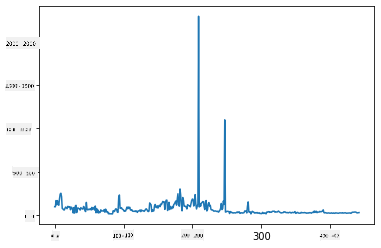
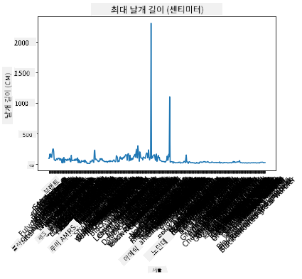
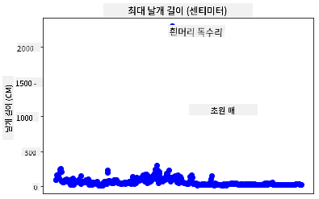
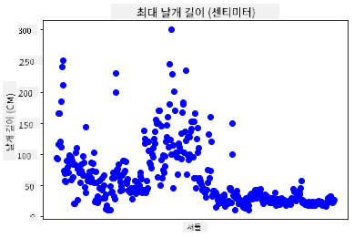
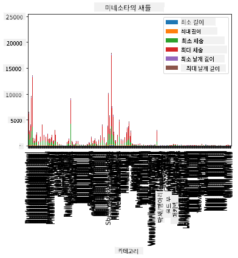
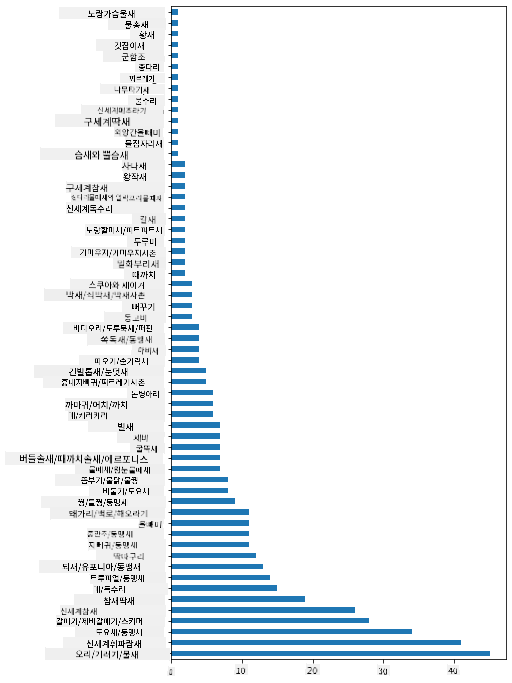
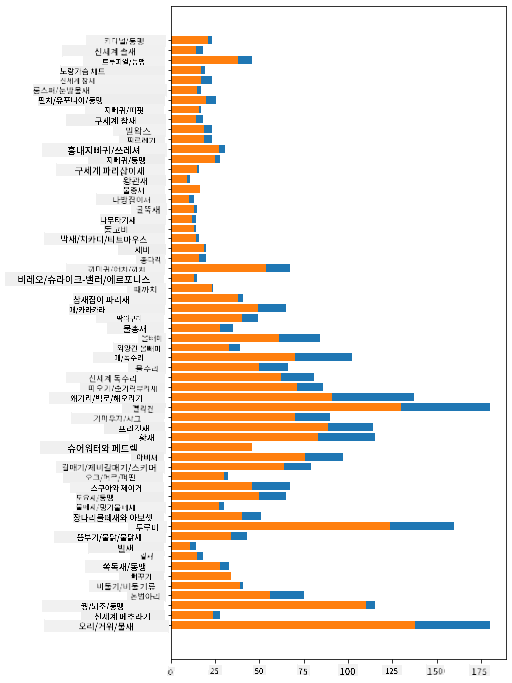

<!--
CO_OP_TRANSLATOR_METADATA:
{
  "original_hash": "69b32b6789a91f796ebc7a02f5575e03",
  "translation_date": "2025-09-04T13:31:49+00:00",
  "source_file": "3-Data-Visualization/09-visualization-quantities/README.md",
  "language_code": "ko"
}
-->
# 양의 시각화

| ](../../sketchnotes/09-Visualizing-Quantities.png)|
|:---:|
| 양의 시각화 - _Sketchnote by [@nitya](https://twitter.com/nitya)_ |

이 강의에서는 다양한 Python 라이브러리를 사용하여 양의 개념을 중심으로 흥미로운 시각화를 만드는 방법을 배웁니다. 미네소타의 새들에 대한 정리된 데이터셋을 사용하여 지역 야생 동물에 대한 많은 흥미로운 사실을 배울 수 있습니다.  
## [강의 전 퀴즈](https://purple-hill-04aebfb03.1.azurestaticapps.net/quiz/16)

## Matplotlib로 날개 길이 관찰하기

다양한 종류의 간단하고 정교한 플롯과 차트를 만드는 데 탁월한 라이브러리는 [Matplotlib](https://matplotlib.org/stable/index.html)입니다. 일반적으로 이러한 라이브러리를 사용하여 데이터를 시각화하는 과정은 데이터프레임에서 목표로 하는 부분을 식별하고, 필요한 데이터 변환을 수행하며, x축과 y축 값을 할당하고, 표시할 플롯 유형을 결정한 다음 플롯을 표시하는 것을 포함합니다. Matplotlib은 다양한 시각화를 제공하지만, 이번 강의에서는 양을 시각화하는 데 가장 적합한 선형 차트, 산점도, 막대 차트에 집중해 보겠습니다.

> ✅ 데이터의 구조와 전달하려는 이야기에 가장 적합한 차트를 사용하세요.  
> - 시간에 따른 추세 분석: 선형 차트  
> - 값 비교: 막대, 세로 막대, 원형 차트, 산점도  
> - 부분과 전체의 관계 표시: 원형 차트  
> - 데이터 분포 표시: 산점도, 막대 차트  
> - 추세 표시: 선형 차트, 세로 막대 차트  
> - 값 간의 관계 표시: 선형 차트, 산점도, 버블 차트  

데이터셋을 가지고 특정 항목이 얼마나 포함되어 있는지 알아내야 할 경우, 가장 먼저 해야 할 작업은 해당 값들을 검사하는 것입니다.

✅ Matplotlib에 대한 훌륭한 '치트 시트'는 [여기](https://matplotlib.org/cheatsheets/cheatsheets.pdf)에서 확인할 수 있습니다.

## 새의 날개 길이 값을 기반으로 선형 차트 만들기

이 강의 폴더의 루트에 있는 `notebook.ipynb` 파일을 열고 셀을 추가하세요.

> 참고: 데이터는 이 저장소의 루트에 있는 `/data` 폴더에 저장되어 있습니다.

```python
import pandas as pd
import matplotlib.pyplot as plt
birds = pd.read_csv('../../data/birds.csv')
birds.head()
```  
이 데이터는 텍스트와 숫자가 혼합되어 있습니다:

|      | Name                         | ScientificName         | Category              | Order        | Family   | Genus       | ConservationStatus | MinLength | MaxLength | MinBodyMass | MaxBodyMass | MinWingspan | MaxWingspan |
| ---: | :--------------------------- | :--------------------- | :-------------------- | :----------- | :------- | :---------- | :----------------- | --------: | --------: | ----------: | ----------: | ----------: | ----------: |
|    0 | Black-bellied whistling-duck | Dendrocygna autumnalis | Ducks/Geese/Waterfowl | Anseriformes | Anatidae | Dendrocygna | LC                 |        47 |        56 |         652 |        1020 |          76 |          94 |
|    1 | Fulvous whistling-duck       | Dendrocygna bicolor    | Ducks/Geese/Waterfowl | Anseriformes | Anatidae | Dendrocygna | LC                 |        45 |        53 |         712 |        1050 |          85 |          93 |
|    2 | Snow goose                   | Anser caerulescens     | Ducks/Geese/Waterfowl | Anseriformes | Anatidae | Anser       | LC                 |        64 |        79 |        2050 |        4050 |         135 |         165 |
|    3 | Ross's goose                 | Anser rossii           | Ducks/Geese/Waterfowl | Anseriformes | Anatidae | Anser       | LC                 |      57.3 |        64 |        1066 |        1567 |         113 |         116 |
|    4 | Greater white-fronted goose  | Anser albifrons        | Ducks/Geese/Waterfowl | Anseriformes | Anatidae | Anser       | LC                 |        64 |        81 |        1930 |        3310 |         130 |         165 |

이 흥미로운 새들의 최대 날개 길이를 시각화하는 기본 선형 차트를 만들어 봅시다.

```python
wingspan = birds['MaxWingspan'] 
wingspan.plot()
```  


즉시 무엇을 알 수 있나요? 적어도 하나의 이상치가 있는 것 같습니다 - 꽤나 큰 날개 길이네요! 2300 센티미터의 날개 길이는 23미터에 해당합니다 - 미네소타에 프테로닥틸이 돌아다니고 있는 걸까요? 조사해 봅시다.

엑셀에서 빠르게 정렬하여 이러한 이상치를 찾을 수도 있지만, 플롯 내에서 작업을 계속 진행해 보세요.

x축에 새의 종류를 표시하는 레이블을 추가하세요:

```
plt.title('Max Wingspan in Centimeters')
plt.ylabel('Wingspan (CM)')
plt.xlabel('Birds')
plt.xticks(rotation=45)
x = birds['Name'] 
y = birds['MaxWingspan']

plt.plot(x, y)

plt.show()
```  


레이블을 45도 회전으로 설정했음에도 불구하고 읽기에는 너무 많습니다. 다른 전략을 시도해 봅시다: 이상치만 레이블로 표시하고 차트 내에 레이블을 설정합니다. 산점도를 사용하여 레이블링 공간을 더 확보할 수 있습니다:

```python
plt.title('Max Wingspan in Centimeters')
plt.ylabel('Wingspan (CM)')
plt.tick_params(axis='both',which='both',labelbottom=False,bottom=False)

for i in range(len(birds)):
    x = birds['Name'][i]
    y = birds['MaxWingspan'][i]
    plt.plot(x, y, 'bo')
    if birds['MaxWingspan'][i] > 500:
        plt.text(x, y * (1 - 0.05), birds['Name'][i], fontsize=12)
    
plt.show()
```  
여기서 무슨 일이 일어나고 있나요? `tick_params`를 사용하여 하단 레이블을 숨기고 새 데이터셋을 반복하는 루프를 생성했습니다. `bo`를 사용하여 작은 파란색 점으로 차트를 플롯하고, 최대 날개 길이가 500을 초과하는 새를 확인하여 해당 점 옆에 레이블을 표시했습니다. 레이블을 y축에서 약간 오프셋(`y * (1 - 0.05)`)하고 새 이름을 레이블로 사용했습니다.

무엇을 발견했나요?

  
## 데이터 필터링하기

대머리 독수리와 초원 매는 아마도 매우 큰 새일 가능성이 있지만, 최대 날개 길이에 추가된 `0`이 잘못 표시된 것 같습니다. 25미터 날개 길이를 가진 대머리 독수리를 만날 가능성은 낮지만, 만약 그렇다면 꼭 알려주세요! 이 두 이상치를 제외한 새로운 데이터프레임을 만들어 봅시다:

```python
plt.title('Max Wingspan in Centimeters')
plt.ylabel('Wingspan (CM)')
plt.xlabel('Birds')
plt.tick_params(axis='both',which='both',labelbottom=False,bottom=False)
for i in range(len(birds)):
    x = birds['Name'][i]
    y = birds['MaxWingspan'][i]
    if birds['Name'][i] not in ['Bald eagle', 'Prairie falcon']:
        plt.plot(x, y, 'bo')
plt.show()
```  

이상치를 필터링함으로써 데이터가 더 일관되고 이해하기 쉬워졌습니다.



이제 날개 길이 측면에서 더 깨끗한 데이터셋을 얻었으니, 이 새들에 대해 더 알아봅시다.

선형 차트와 산점도는 데이터 값과 분포에 대한 정보를 표시할 수 있지만, 이 데이터셋에 내재된 값을 고려해 봐야 합니다. 다음과 같은 양에 대한 질문을 시각화하여 답을 찾을 수 있습니다:

> 새의 카테고리는 몇 가지이며, 각각의 수는 얼마인가요?  
> 멸종, 위험, 희귀, 일반적인 새는 몇 마리인가요?  
> 린네의 용어로 다양한 속(genus)과 목(order)은 몇 가지인가요?  
## 막대 차트 탐색하기

막대 차트는 데이터를 그룹화하여 보여줄 때 실용적입니다. 이 데이터셋에 존재하는 새의 카테고리를 탐색하여 가장 일반적인 카테고리를 확인해 봅시다.

노트북 파일에서 기본 막대 차트를 만들어 보세요.

✅ 이전 섹션에서 확인한 두 이상치 새를 필터링하거나, 날개 길이의 오타를 수정하거나, 날개 길이 값에 의존하지 않는 이 연습에서는 그대로 두어도 괜찮습니다.

막대 차트를 만들고 싶다면, 집중할 데이터를 선택할 수 있습니다. 막대 차트는 원시 데이터에서 생성할 수 있습니다:

```python
birds.plot(x='Category',
        kind='bar',
        stacked=True,
        title='Birds of Minnesota')

```  


하지만 이 막대 차트는 너무 많은 비그룹화된 데이터로 인해 읽기 어렵습니다. 플롯하려는 데이터만 선택해야 하므로 새의 카테고리를 기준으로 길이를 살펴봅시다.

데이터를 새의 카테고리만 포함하도록 필터링하세요.

✅ Pandas를 사용하여 데이터를 관리하고, Matplotlib을 사용하여 차트를 생성합니다.

카테고리가 많으므로 이 차트를 세로로 표시하고 모든 데이터를 고려하여 높이를 조정할 수 있습니다:

```python
category_count = birds.value_counts(birds['Category'].values, sort=True)
plt.rcParams['figure.figsize'] = [6, 12]
category_count.plot.barh()
```  


이 막대 차트는 각 카테고리에 속한 새의 수를 잘 보여줍니다. 한눈에 미네소타 지역에서 가장 많은 새가 Ducks/Geese/Waterfowl 카테고리에 속한다는 것을 알 수 있습니다. 미네소타는 '10,000개의 호수의 땅'이므로 놀랍지 않습니다!

✅ 이 데이터셋에서 다른 카운트를 시도해 보세요. 놀라운 점이 있나요?

## 데이터 비교하기

새의 카테고리를 기준으로 MaxLength를 비교하는 새로운 축을 만들어 다양한 그룹화된 데이터를 비교해 보세요:

```python
maxlength = birds['MaxLength']
plt.barh(y=birds['Category'], width=maxlength)
plt.rcParams['figure.figsize'] = [6, 12]
plt.show()
```  


여기서 놀라운 점은 없습니다: 벌새는 펠리컨이나 기러기에 비해 MaxLength가 가장 적습니다. 데이터가 논리적으로 맞아떨어질 때 좋습니다!

막대 차트를 더 흥미롭게 시각화하려면 데이터를 중첩하여 표시할 수 있습니다. 특정 새 카테고리에서 최소 길이와 최대 길이를 중첩하여 표시해 봅시다:

```python
minLength = birds['MinLength']
maxLength = birds['MaxLength']
category = birds['Category']

plt.barh(category, maxLength)
plt.barh(category, minLength)

plt.show()
```  
이 플롯에서는 각 새 카테고리의 최소 길이와 최대 길이 범위를 볼 수 있습니다. 이 데이터를 기준으로 새가 클수록 길이 범위가 더 크다는 것을 안전하게 말할 수 있습니다. 흥미롭네요!



## 🚀 도전 과제

이 새 데이터셋은 특정 생태계 내 다양한 새 유형에 대한 풍부한 정보를 제공합니다. 인터넷을 검색하여 다른 새 관련 데이터셋을 찾아보세요. 이러한 새들에 대한 차트와 그래프를 만들어 이전에 몰랐던 사실을 발견해 보세요.

## [강의 후 퀴즈](https://ff-quizzes.netlify.app/en/ds/)

## 복습 및 자기 학습

이 첫 번째 강의에서는 Matplotlib을 사용하여 양을 시각화하는 방법에 대한 정보를 제공했습니다. 데이터셋을 시각화하는 다른 방법에 대해 조사해 보세요. [Plotly](https://github.com/plotly/plotly.py)는 이 강의에서 다루지 않으니, 제공할 수 있는 기능을 살펴보세요.  
## 과제

[Lines, Scatters, and Bars](assignment.md)  

---

**면책 조항**:  
이 문서는 AI 번역 서비스 [Co-op Translator](https://github.com/Azure/co-op-translator)를 사용하여 번역되었습니다. 정확성을 위해 최선을 다하고 있으나, 자동 번역에는 오류나 부정확성이 포함될 수 있습니다. 원본 문서의 원어 버전을 권위 있는 출처로 간주해야 합니다. 중요한 정보의 경우, 전문적인 인간 번역을 권장합니다. 이 번역 사용으로 인해 발생하는 오해나 잘못된 해석에 대해 책임을 지지 않습니다.