<!--
CO_OP_TRANSLATOR_METADATA:
{
  "original_hash": "39f3b3a9d873eaa522c2e792ce0ca503",
  "translation_date": "2025-09-04T13:24:33+00:00",
  "source_file": "5-Data-Science-In-Cloud/18-Low-Code/README.md",
  "language_code": "ko"
}
-->
# 클라우드에서의 데이터 과학: "로우 코드/노 코드" 방식

| ](../../sketchnotes/18-DataScience-Cloud.png)|
|:---:|
| 클라우드에서의 데이터 과학: 로우 코드 - _스케치노트 by [@nitya](https://twitter.com/nitya)_ |

목차:

- [클라우드에서의 데이터 과학: "로우 코드/노 코드" 방식](../../../../5-Data-Science-In-Cloud/18-Low-Code)
  - [강의 전 퀴즈](../../../../5-Data-Science-In-Cloud/18-Low-Code)
  - [1. 소개](../../../../5-Data-Science-In-Cloud/18-Low-Code)
    - [1.1 Azure Machine Learning이란?](../../../../5-Data-Science-In-Cloud/18-Low-Code)
    - [1.2 심부전 예측 프로젝트:](../../../../5-Data-Science-In-Cloud/18-Low-Code)
    - [1.3 심부전 데이터셋:](../../../../5-Data-Science-In-Cloud/18-Low-Code)
  - [2. Azure ML Studio에서 로우 코드/노 코드 방식으로 모델 학습](../../../../5-Data-Science-In-Cloud/18-Low-Code)
    - [2.1 Azure ML 작업 공간 생성](../../../../5-Data-Science-In-Cloud/18-Low-Code)
    - [2.2 컴퓨팅 리소스](../../../../5-Data-Science-In-Cloud/18-Low-Code)
      - [2.2.1 컴퓨팅 리소스에 적합한 옵션 선택](../../../../5-Data-Science-In-Cloud/18-Low-Code)
      - [2.2.2 컴퓨팅 클러스터 생성](../../../../5-Data-Science-In-Cloud/18-Low-Code)
    - [2.3 데이터셋 로드](../../../../5-Data-Science-In-Cloud/18-Low-Code)
    - [2.4 AutoML을 활용한 로우 코드/노 코드 학습](../../../../5-Data-Science-In-Cloud/18-Low-Code)
  - [3. 로우 코드/노 코드 방식으로 모델 배포 및 엔드포인트 활용](../../../../5-Data-Science-In-Cloud/18-Low-Code)
    - [3.1 모델 배포](../../../../5-Data-Science-In-Cloud/18-Low-Code)
    - [3.2 엔드포인트 활용](../../../../5-Data-Science-In-Cloud/18-Low-Code)
  - [🚀 도전 과제](../../../../5-Data-Science-In-Cloud/18-Low-Code)
  - [강의 후 퀴즈](../../../../5-Data-Science-In-Cloud/18-Low-Code)
  - [복습 및 자기 학습](../../../../5-Data-Science-In-Cloud/18-Low-Code)
  - [과제](../../../../5-Data-Science-In-Cloud/18-Low-Code)

## [강의 전 퀴즈](https://ff-quizzes.netlify.app/en/ds/)

## 1. 소개
### 1.1 Azure Machine Learning이란?

Azure 클라우드 플랫폼은 200개 이상의 제품과 클라우드 서비스를 제공하여 새로운 솔루션을 구현할 수 있도록 설계되었습니다. 데이터 과학자들은 데이터를 탐색하고 전처리하며, 다양한 모델 학습 알고리즘을 시도하여 정확한 모델을 생성하는 데 많은 노력을 기울입니다. 이러한 작업은 시간이 많이 소요되며, 종종 고가의 컴퓨팅 하드웨어를 비효율적으로 사용하는 경우가 많습니다.

[Azure ML](https://docs.microsoft.com/azure/machine-learning/overview-what-is-azure-machine-learning?WT.mc_id=academic-77958-bethanycheum&ocid=AID3041109)은 Azure에서 머신러닝 솔루션을 구축하고 운영하기 위한 클라우드 기반 플랫폼입니다. 이 플랫폼은 데이터 준비, 모델 학습, 예측 서비스 게시, 사용 모니터링 등 데이터 과학자들을 위한 다양한 기능과 도구를 제공합니다. 특히, 모델 학습과 관련된 시간 소모적인 작업을 자동화하여 효율성을 높이고, 대량의 데이터를 처리할 수 있는 클라우드 기반 컴퓨팅 리소스를 효과적으로 확장하여 실제 사용 시에만 비용이 발생하도록 합니다.

Azure ML은 머신러닝 워크플로우를 위한 모든 도구를 제공합니다. 여기에는 다음이 포함됩니다:

- **Azure Machine Learning Studio**: 모델 학습, 배포, 자동화, 추적 및 자산 관리를 위한 로우 코드/노 코드 옵션을 제공하는 웹 포털입니다. Azure Machine Learning SDK와 통합되어 원활한 경험을 제공합니다.
- **Jupyter 노트북**: ML 모델을 빠르게 프로토타입하고 테스트할 수 있습니다.
- **Azure Machine Learning Designer**: 모듈을 드래그 앤 드롭하여 실험을 구축하고 로우 코드 환경에서 파이프라인을 배포할 수 있습니다.
- **자동화된 머신러닝 UI (AutoML)**: 반복적인 머신러닝 모델 개발 작업을 자동화하여 높은 확장성, 효율성, 생산성을 유지하면서도 모델 품질을 보장합니다.
- **데이터 라벨링**: 데이터를 자동으로 라벨링할 수 있는 보조 ML 도구입니다.
- **Visual Studio Code용 머신러닝 확장**: ML 프로젝트를 구축하고 관리하기 위한 완전한 개발 환경을 제공합니다.
- **머신러닝 CLI**: 명령줄에서 Azure ML 리소스를 관리할 수 있는 명령어를 제공합니다.
- **PyTorch, TensorFlow, Scikit-learn** 등과 같은 오픈소스 프레임워크와의 통합: 모델 학습, 배포, 엔드투엔드 머신러닝 프로세스를 관리할 수 있습니다.
- **MLflow**: 머신러닝 실험의 라이프사이클을 관리하기 위한 오픈소스 라이브러리입니다. **MLFlow Tracking**은 실험 환경에 관계없이 학습 실행 메트릭과 모델 아티팩트를 기록하고 추적하는 구성 요소입니다.

### 1.2 심부전 예측 프로젝트:

프로젝트를 만들고 구축하는 것은 자신의 기술과 지식을 시험해볼 수 있는 최고의 방법입니다. 이번 강의에서는 Azure ML Studio에서 심부전 예측 프로젝트를 구축하는 두 가지 방법을 탐구할 것입니다. 하나는 로우 코드/노 코드 방식이고, 다른 하나는 Azure ML SDK를 사용하는 방식입니다. 아래의 다이어그램은 이를 보여줍니다:

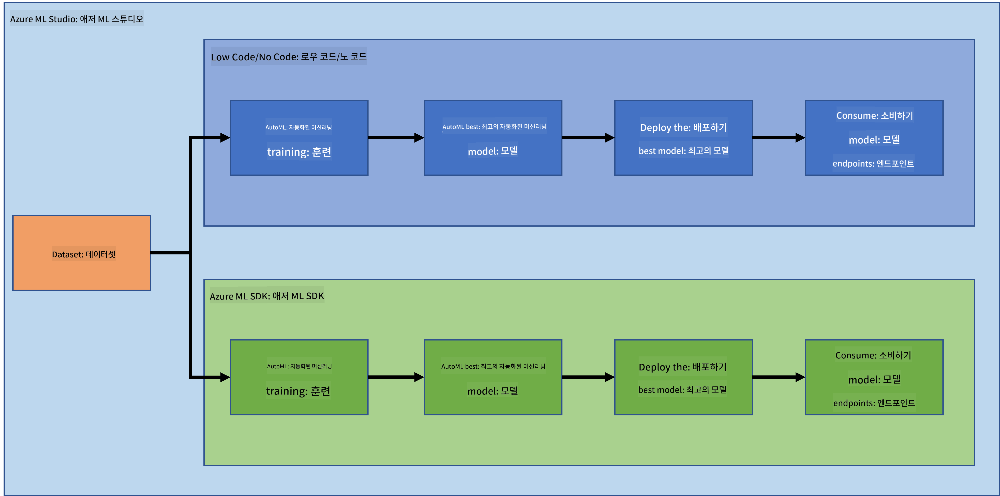

각 방법은 장단점이 있습니다. 로우 코드/노 코드 방식은 GUI(그래픽 사용자 인터페이스)를 사용하므로 코드에 대한 사전 지식이 필요하지 않아 시작하기 쉽습니다. 이 방법은 프로젝트의 실행 가능성을 빠르게 테스트하고 POC(개념 증명)를 생성하는 데 적합합니다. 그러나 프로젝트가 성장하고 프로덕션 준비가 필요해지면 GUI를 통해 리소스를 생성하는 것은 비효율적입니다. 이때는 리소스 생성부터 모델 배포까지 모든 것을 프로그래밍적으로 자동화할 수 있는 Azure ML SDK 사용이 필수적입니다.

|                   | 로우 코드/노 코드 | Azure ML SDK              |
|-------------------|------------------|---------------------------|
| 코드 전문성       | 필요 없음         | 필요                      |
| 개발 시간         | 빠르고 쉬움       | 코드 전문성에 따라 다름    |
| 프로덕션 준비     | 아니오            | 예                        |

### 1.3 심부전 데이터셋:

심혈관 질환(CVD)은 전 세계 사망 원인 1위로, 전 세계 사망의 31%를 차지합니다. 담배 사용, 건강하지 못한 식단과 비만, 신체 활동 부족, 과도한 음주와 같은 환경적 및 행동적 위험 요인은 예측 모델의 특징으로 사용할 수 있습니다. CVD 발생 가능성을 예측할 수 있다면 고위험군에서 발작을 예방하는 데 큰 도움이 될 것입니다.

Kaggle은 [심부전 데이터셋](https://www.kaggle.com/andrewmvd/heart-failure-clinical-data)을 공개적으로 제공하고 있으며, 이번 프로젝트에서 이를 사용할 것입니다. 지금 데이터셋을 다운로드할 수 있습니다. 이 데이터셋은 13개의 열(12개의 특징과 1개의 타겟 변수)과 299개의 행으로 구성된 표 형식 데이터입니다.

|    | 변수 이름                 | 유형            | 설명                                                     | 예시              |
|----|---------------------------|-----------------|---------------------------------------------------------|-------------------|
| 1  | age                       | 숫자형          | 환자의 나이                                              | 25                |
| 2  | anaemia                   | 불리언          | 적혈구 또는 헤모글로빈 감소                              | 0 또는 1          |
| 3  | creatinine_phosphokinase  | 숫자형          | 혈액 내 CPK 효소 수준                                    | 542               |
| 4  | diabetes                  | 불리언          | 환자가 당뇨병이 있는지 여부                              | 0 또는 1          |
| 5  | ejection_fraction         | 숫자형          | 심장이 수축할 때 배출되는 혈액의 비율                    | 45                |
| 6  | high_blood_pressure       | 불리언          | 환자가 고혈압이 있는지 여부                              | 0 또는 1          |
| 7  | platelets                 | 숫자형          | 혈액 내 혈소판 수                                        | 149000            |
| 8  | serum_creatinine          | 숫자형          | 혈액 내 혈청 크레아티닌 수준                             | 0.5               |
| 9  | serum_sodium              | 숫자형          | 혈액 내 혈청 나트륨 수준                                 | jun               |
| 10 | sex                       | 불리언          | 여성 또는 남성                                           | 0 또는 1          |
| 11 | smoking                   | 불리언          | 환자가 흡연자인지 여부                                   | 0 또는 1          |
| 12 | time                      | 숫자형          | 추적 기간(일)                                            | 4                 |
|----|---------------------------|-----------------|---------------------------------------------------------|-------------------|
| 21 | DEATH_EVENT [타겟]        | 불리언          | 추적 기간 동안 환자가 사망했는지 여부                   | 0 또는 1          |

데이터셋을 준비한 후, Azure에서 프로젝트를 시작할 수 있습니다.

## 2. Azure ML Studio에서 로우 코드/노 코드 방식으로 모델 학습
### 2.1 Azure ML 작업 공간 생성
Azure ML에서 모델을 학습시키려면 먼저 Azure ML 작업 공간을 생성해야 합니다. 작업 공간은 Azure Machine Learning의 최상위 리소스로, Azure Machine Learning을 사용할 때 생성하는 모든 아티팩트를 중앙에서 관리할 수 있는 장소를 제공합니다. 작업 공간은 로그, 메트릭, 출력 및 스크립트 스냅샷을 포함한 모든 학습 실행 기록을 보관합니다. 이를 통해 어떤 학습 실행이 최상의 모델을 생성했는지 확인할 수 있습니다. [자세히 알아보기](https://docs.microsoft.com/azure/machine-learning/concept-workspace?WT.mc_id=academic-77958-bethanycheum&ocid=AID3041109)

최신 운영 체제와 호환되는 최신 브라우저를 사용하는 것이 권장됩니다. 지원되는 브라우저는 다음과 같습니다:

- Microsoft Edge (새로운 Microsoft Edge, 최신 버전. Microsoft Edge 레거시는 제외)
- Safari (최신 버전, Mac 전용)
- Chrome (최신 버전)
- Firefox (최신 버전)

Azure Machine Learning을 사용하려면 Azure 구독에서 작업 공간을 생성하세요. 그런 다음 이 작업 공간을 사용하여 데이터, 컴퓨팅 리소스, 코드, 모델 및 머신러닝 워크로드와 관련된 기타 아티팩트를 관리할 수 있습니다.

> **_참고:_** Azure Machine Learning 작업 공간이 구독에 존재하는 한 데이터 저장소에 대해 소액의 비용이 청구됩니다. 더 이상 사용하지 않을 경우 Azure Machine Learning 작업 공간을 삭제하는 것을 권장합니다.

1. Microsoft 계정으로 [Azure 포털](https://ms.portal.azure.com/)에 로그인합니다.
2. **＋리소스 생성**을 선택합니다.
   
   

   Machine Learning을 검색하고 Machine Learning 타일을 선택합니다.

   

   생성 버튼을 클릭합니다.

   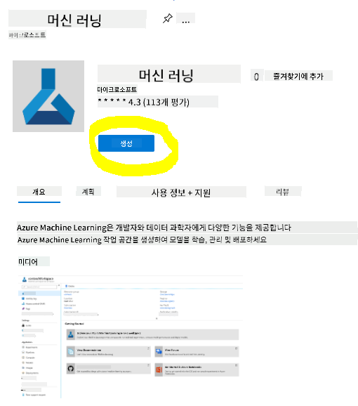

   다음과 같이 설정을 입력합니다:
   - 구독: 본인의 Azure 구독
   - 리소스 그룹: 리소스 그룹 생성 또는 선택
   - 작업 공간 이름: 작업 공간의 고유 이름 입력
   - 지역: 가장 가까운 지리적 지역 선택
   - 저장소 계정: 작업 공간에 대해 생성될 기본 새 저장소 계정 확인
   - 키 자격 증명 모음: 작업 공간에 대해 생성될 기본 새 키 자격 증명 모음 확인
   - 애플리케이션 인사이트: 작업 공간에 대해 생성될 기본 새 애플리케이션 인사이트 리소스 확인
   - 컨테이너 레지스트리: 없음 (모델을 컨테이너에 처음 배포할 때 자동으로 생성됨)

    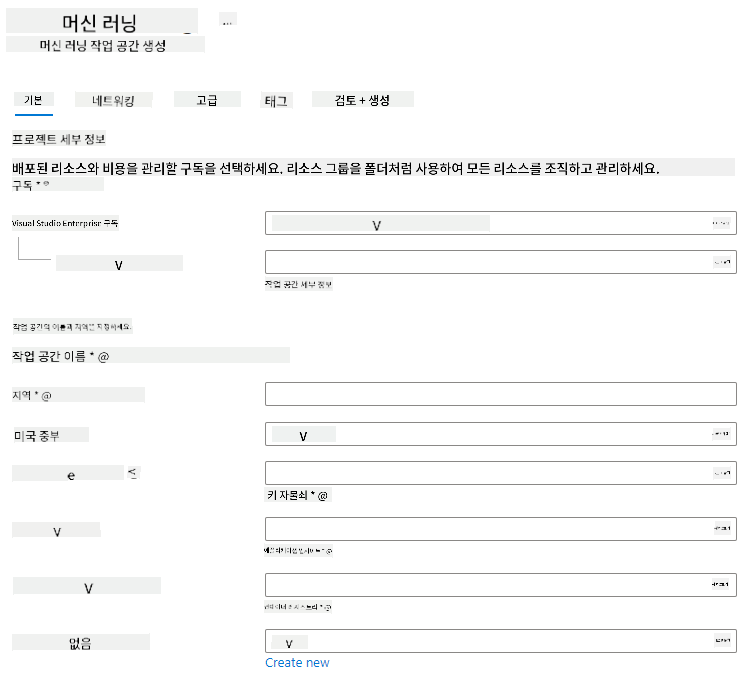

   - 검토 + 생성 버튼을 클릭한 후 생성 버튼을 클릭합니다.
3. 작업 공간이 생성될 때까지 기다립니다(몇 분 정도 소요될 수 있음). 그런 다음 포털에서 작업 공간으로 이동합니다. Machine Learning Azure 서비스를 통해 찾을 수 있습니다.
4. 작업 공간의 개요 페이지에서 Azure Machine Learning Studio를 실행하거나 새 브라우저 탭을 열고 https://ml.azure.com으로 이동하여 Microsoft 계정으로 Azure Machine Learning Studio에 로그인합니다. 요청 시 Azure 디렉터리 및 구독, Azure Machine Learning 작업 공간을 선택합니다.
   
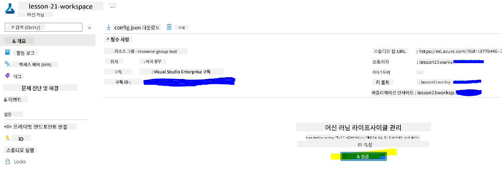

5. Azure Machine Learning Studio에서 왼쪽 상단의 ☰ 아이콘을 전환하여 인터페이스의 다양한 페이지를 확인합니다. 이 페이지를 사용하여 작업 공간의 리소스를 관리할 수 있습니다.


Azure 포털을 사용하여 작업 공간을 관리할 수 있지만, 데이터 과학자와 머신러닝 운영 엔지니어에게는 Azure Machine Learning Studio가 작업 공간 리소스를 관리하기 위한 더 집중된 사용자 인터페이스를 제공합니다.

### 2.2 컴퓨팅 리소스

컴퓨팅 리소스는 모델 학습 및 데이터 탐색 프로세스를 실행할 수 있는 클라우드 기반 리소스입니다. 생성할 수 있는 컴퓨팅 리소스는 네 가지 유형이 있습니다:

- **컴퓨팅 인스턴스**: 데이터 과학자가 데이터와 모델을 작업할 수 있는 개발 워크스테이션입니다. 여기에는 가상 머신(VM)을 생성하고 노트북 인스턴스를 실행하는 작업이 포함됩니다. 그런 다음 노트북에서 컴퓨팅 클러스터를 호출하여 모델을 학습시킬 수 있습니다.
- **컴퓨팅 클러스터**: 실험 코드를 온디맨드로 처리하기 위한 확장 가능한 VM 클러스터입니다. 모델을 학습시킬 때 필요합니다. 컴퓨팅 클러스터는 또한 GPU 또는 CPU와 같은 특수 리소스를 사용할 수 있습니다.
- **추론 클러스터**: 학습된 모델을 사용하는 예측 서비스를 배포하기 위한 대상입니다.
- **Attached Compute**: 기존 Azure 컴퓨팅 리소스(예: 가상 머신 또는 Azure Databricks 클러스터)에 연결합니다.

#### 2.2.1 컴퓨팅 리소스를 위한 적절한 옵션 선택하기

컴퓨팅 리소스를 생성할 때 고려해야 할 몇 가지 주요 요소가 있으며, 이러한 선택은 중요한 결정이 될 수 있습니다.

**CPU가 필요합니까, 아니면 GPU가 필요합니까?**

CPU(중앙 처리 장치)는 컴퓨터 프로그램을 구성하는 명령을 실행하는 전자 회로입니다. GPU(그래픽 처리 장치)는 그래픽 관련 코드를 매우 빠르게 실행할 수 있는 특수 전자 회로입니다.

CPU와 GPU 아키텍처의 주요 차이점은 CPU가 다양한 작업을 빠르게 처리하도록 설계되었지만(측정 기준: CPU 클럭 속도), 동시에 실행할 수 있는 작업의 수가 제한적이라는 점입니다. 반면 GPU는 병렬 컴퓨팅에 최적화되어 있어 딥러닝 작업에 훨씬 더 적합합니다.

| CPU                                     | GPU                         |
|-----------------------------------------|-----------------------------|
| 비용이 저렴함                           | 비용이 비쌈                 |
| 낮은 수준의 동시성                      | 높은 수준의 동시성          |
| 딥러닝 모델 훈련 속도가 느림            | 딥러닝에 최적화됨           |

**클러스터 크기**

클러스터가 클수록 비용이 더 많이 들지만 응답성이 향상됩니다. 따라서 시간이 충분하지만 예산이 부족하다면 작은 클러스터로 시작해야 합니다. 반대로 예산은 충분하지만 시간이 부족하다면 큰 클러스터로 시작해야 합니다.

**VM 크기**

시간과 예산 제약에 따라 RAM 크기, 디스크 크기, 코어 수 및 클럭 속도를 조정할 수 있습니다. 이러한 모든 매개변수를 증가시키면 비용이 더 많이 들지만 성능이 향상됩니다.

**전용 인스턴스 또는 저우선순위 인스턴스?**

저우선순위 인스턴스는 중단 가능하다는 것을 의미합니다. 즉, Microsoft Azure가 해당 리소스를 다른 작업에 할당하여 작업을 중단할 수 있습니다. 전용 인스턴스(중단 불가)는 작업이 사용자의 허가 없이 종료되지 않음을 의미합니다. 이는 시간과 비용의 또 다른 고려 사항으로, 저우선순위 인스턴스는 전용 인스턴스보다 저렴합니다.

#### 2.2.2 컴퓨팅 클러스터 생성하기

이전에 생성한 [Azure ML 워크스페이스](https://ml.azure.com/)에서 컴퓨팅으로 이동하면 방금 논의한 다양한 컴퓨팅 리소스(예: 컴퓨팅 인스턴스, 컴퓨팅 클러스터, 추론 클러스터 및 연결된 컴퓨팅)를 확인할 수 있습니다. 이 프로젝트에서는 모델 훈련을 위해 컴퓨팅 클러스터가 필요합니다. Studio에서 "Compute" 메뉴를 클릭한 다음 "Compute cluster" 탭을 클릭하고 "+ New" 버튼을 클릭하여 컴퓨팅 클러스터를 생성합니다.

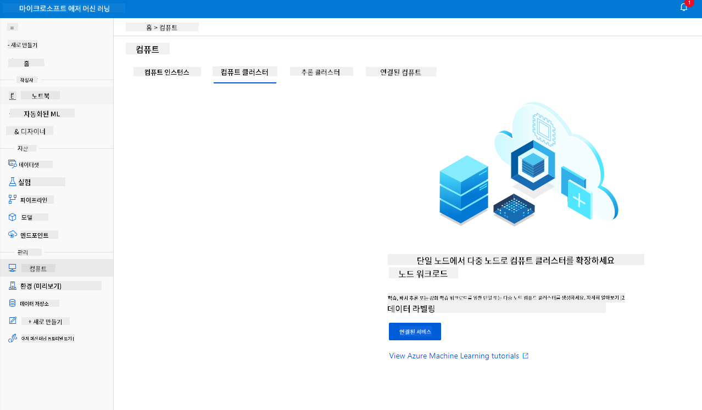

1. 옵션 선택: 전용 vs 저우선순위, CPU 또는 GPU, VM 크기 및 코어 수(이 프로젝트에서는 기본 설정을 유지할 수 있습니다).
2. "Next" 버튼을 클릭합니다.

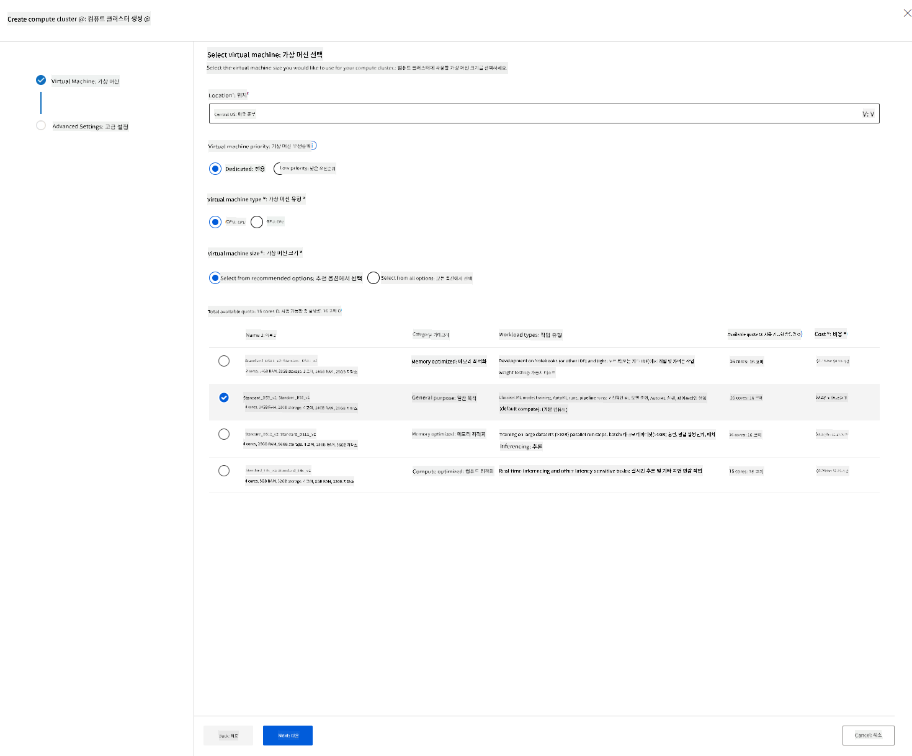

3. 클러스터에 컴퓨팅 이름을 지정합니다.
4. 옵션 선택: 최소/최대 노드 수, 축소 전 유휴 시간, SSH 액세스. 최소 노드 수가 0이면 클러스터가 유휴 상태일 때 비용을 절약할 수 있습니다. 최대 노드 수가 많을수록 훈련 시간이 짧아집니다. 최대 노드 수는 3을 권장합니다.
5. "Create" 버튼을 클릭합니다. 이 단계는 몇 분 정도 소요될 수 있습니다.

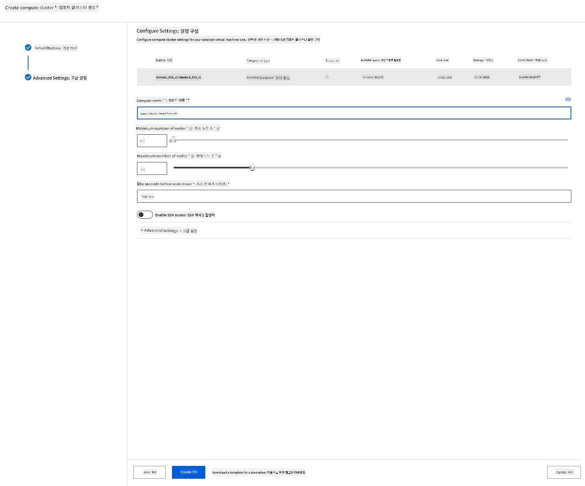

좋습니다! 이제 컴퓨팅 클러스터가 생성되었으니 데이터를 Azure ML Studio에 로드해야 합니다.

### 2.3 데이터셋 로드하기

1. 이전에 생성한 [Azure ML 워크스페이스](https://ml.azure.com/)에서 왼쪽 메뉴에서 "Datasets"를 클릭하고 "+ Create dataset" 버튼을 클릭하여 데이터셋을 생성합니다. "From local files" 옵션을 선택하고 이전에 다운로드한 Kaggle 데이터셋을 선택합니다.

   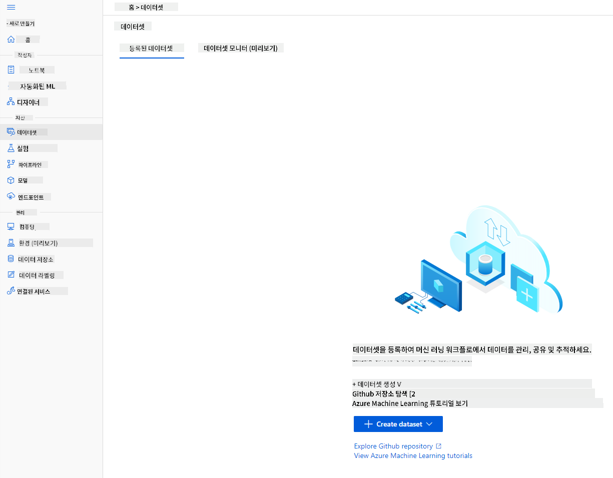

2. 데이터셋 이름, 유형 및 설명을 입력합니다. "Next"를 클릭합니다. 파일에서 데이터를 업로드합니다. "Next"를 클릭합니다.

   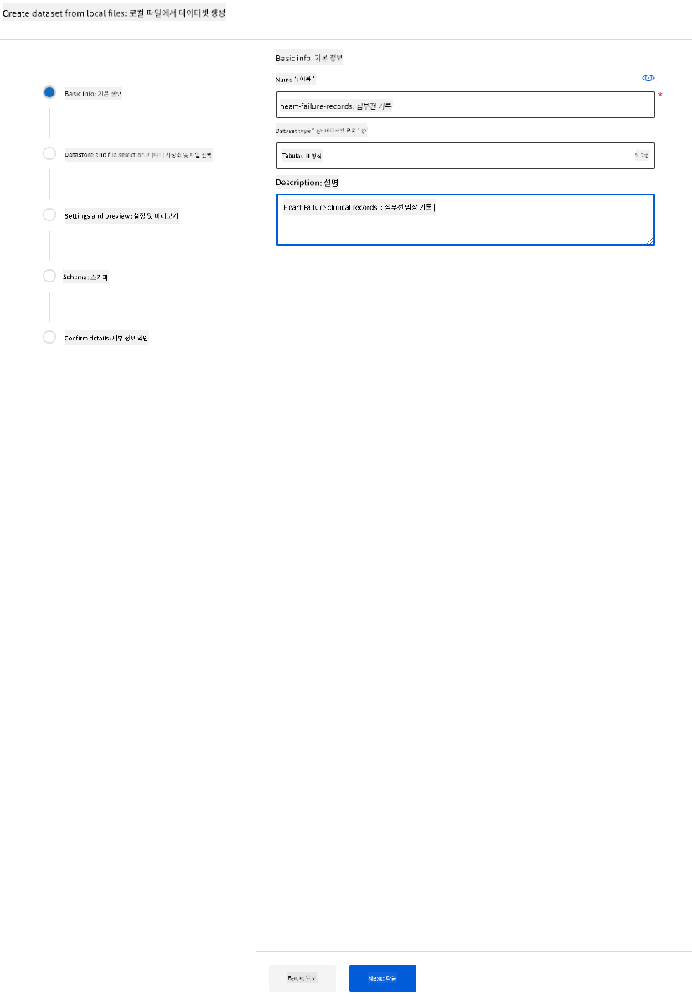

3. 스키마에서 다음 특징에 대해 데이터 유형을 Boolean으로 변경합니다: anaemia, diabetes, high blood pressure, sex, smoking, DEATH_EVENT. "Next"를 클릭하고 "Create"를 클릭합니다.

   

좋습니다! 이제 데이터셋이 준비되었고 컴퓨팅 클러스터가 생성되었으니 모델 훈련을 시작할 수 있습니다!

### 2.4 AutoML을 활용한 저코드/무코드 훈련

전통적인 머신러닝 모델 개발은 많은 자원이 필요하며, 도메인 지식과 시간이 많이 소요됩니다. AutoML(자동화된 머신러닝)은 머신러닝 모델 개발의 시간 소모적이고 반복적인 작업을 자동화하는 과정입니다. 이를 통해 데이터 과학자, 분석가 및 개발자가 높은 효율성과 생산성으로 ML 모델을 구축할 수 있으며, 모델 품질을 유지할 수 있습니다. AutoML은 생산 준비가 된 ML 모델을 더 빠르게 얻을 수 있도록 하며, 매우 간편하고 효율적입니다. [자세히 알아보기](https://docs.microsoft.com/azure/machine-learning/concept-automated-ml?WT.mc_id=academic-77958-bethanycheum&ocid=AID3041109)

1. 이전에 생성한 [Azure ML 워크스페이스](https://ml.azure.com/)에서 왼쪽 메뉴에서 "Automated ML"을 클릭하고 방금 업로드한 데이터셋을 선택합니다. "Next"를 클릭합니다.

   

2. 새로운 실험 이름, 대상 열(DEATH_EVENT) 및 생성한 컴퓨팅 클러스터를 입력합니다. "Next"를 클릭합니다.

   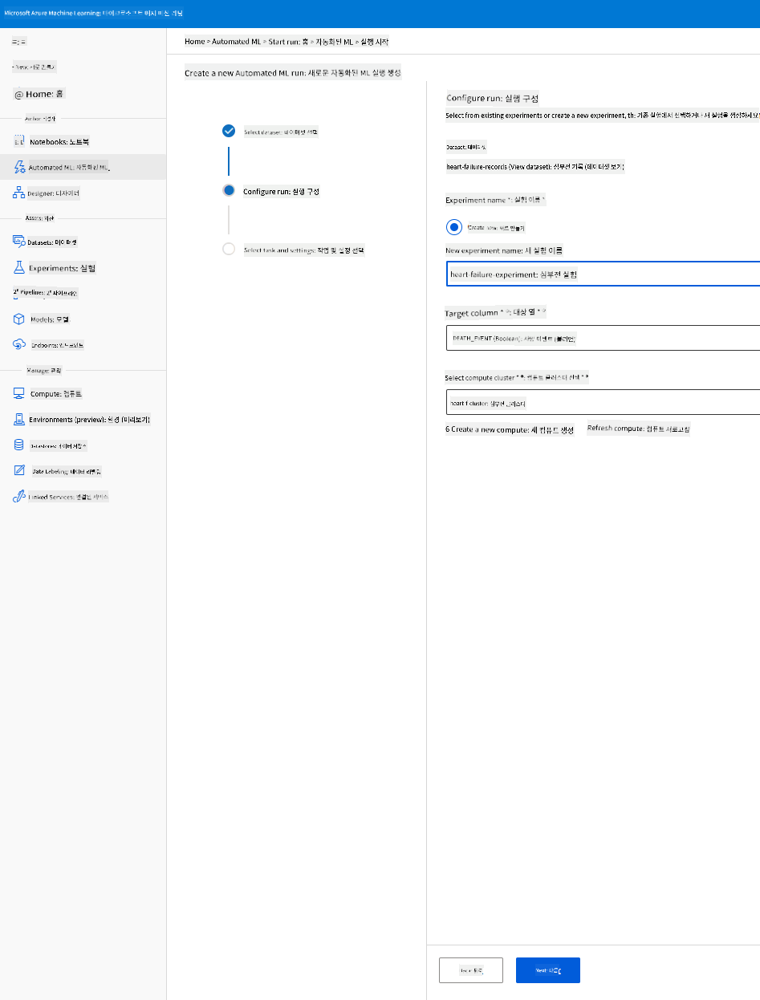

3. "Classification"을 선택하고 "Finish"를 클릭합니다. 이 단계는 컴퓨팅 클러스터 크기에 따라 30분에서 1시간 정도 소요될 수 있습니다.

   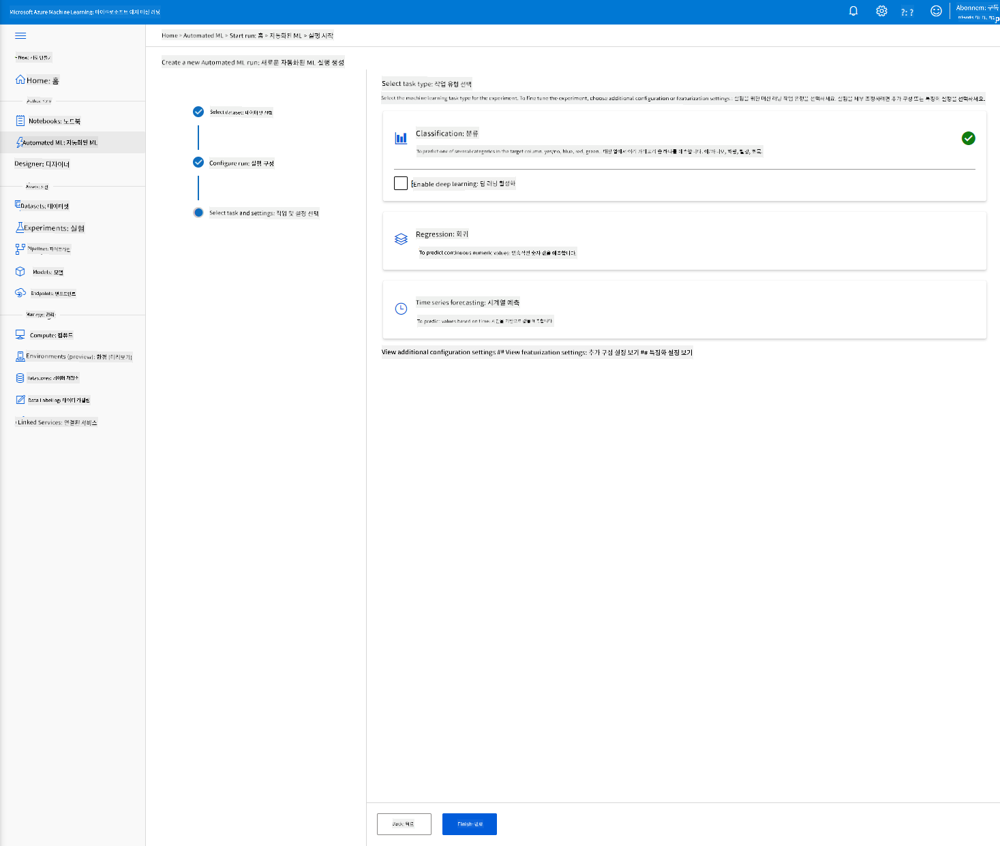

4. 실행이 완료되면 "Automated ML" 탭을 클릭하고 실행을 선택한 다음 "Best model summary" 카드에서 알고리즘을 클릭합니다.

   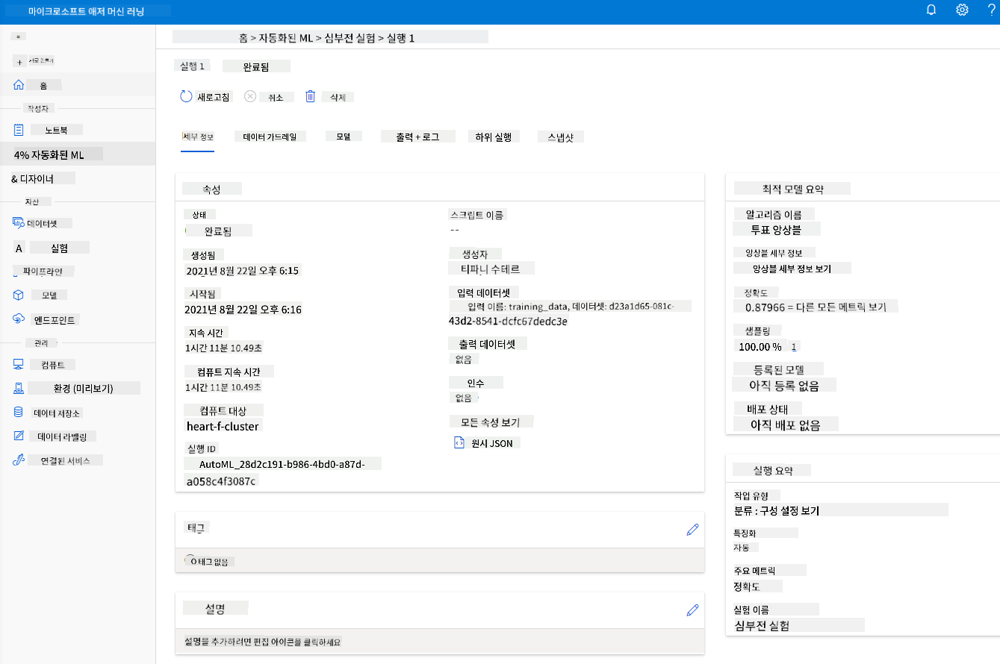

여기에서 AutoML이 생성한 최적의 모델에 대한 자세한 설명을 확인할 수 있습니다. 또한 "Models" 탭에서 다른 모델을 탐색할 수 있습니다. "Explanations (preview)" 버튼에서 모델을 몇 분 동안 탐색해 보세요. AutoML이 선택한 최적의 모델을 사용하기로 결정한 후, 이를 배포하는 방법을 살펴보겠습니다.

## 3. 저코드/무코드 모델 배포 및 엔드포인트 소비
### 3.1 모델 배포

자동화된 머신러닝 인터페이스를 통해 몇 단계만 거치면 최적의 모델을 웹 서비스로 배포할 수 있습니다. 배포는 모델을 통합하여 새로운 데이터를 기반으로 예측을 수행하고 잠재적인 기회를 식별할 수 있도록 하는 과정입니다. 이 프로젝트에서는 웹 서비스로의 배포를 통해 의료 애플리케이션이 모델을 활용하여 환자의 심장마비 위험을 실시간으로 예측할 수 있도록 합니다.

최적의 모델 설명에서 "Deploy" 버튼을 클릭합니다.

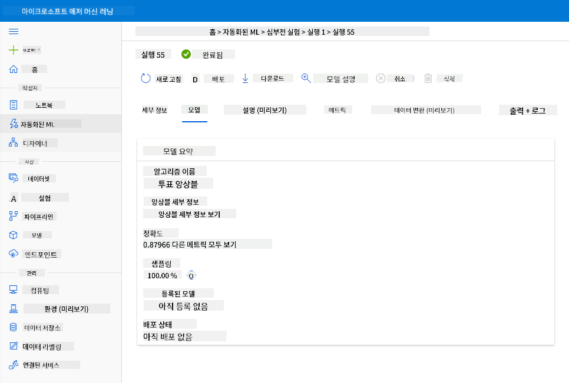

15. 이름, 설명, 컴퓨팅 유형(Azure Container Instance), 인증 활성화를 입력하고 "Deploy"를 클릭합니다. 이 단계는 약 20분 정도 소요될 수 있습니다. 배포 과정에는 모델 등록, 리소스 생성 및 웹 서비스 구성을 포함한 여러 단계가 포함됩니다. 배포 상태 아래에 상태 메시지가 표시됩니다. 상태를 확인하려면 주기적으로 "Refresh"를 선택하세요. 상태가 "Healthy"일 때 배포가 완료되고 실행 중입니다.

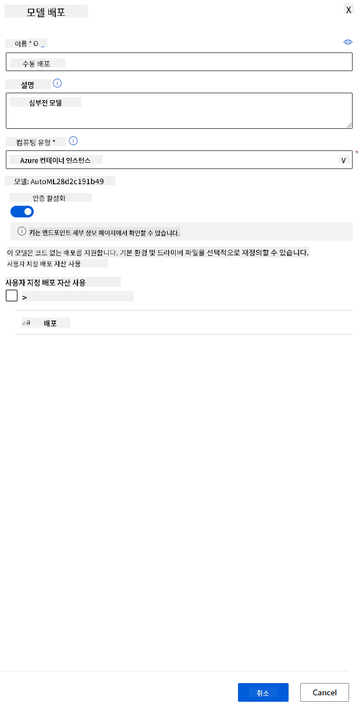

16. 배포가 완료되면 "Endpoint" 탭을 클릭하고 방금 배포한 엔드포인트를 클릭합니다. 여기에서 엔드포인트에 대한 모든 세부 정보를 확인할 수 있습니다.

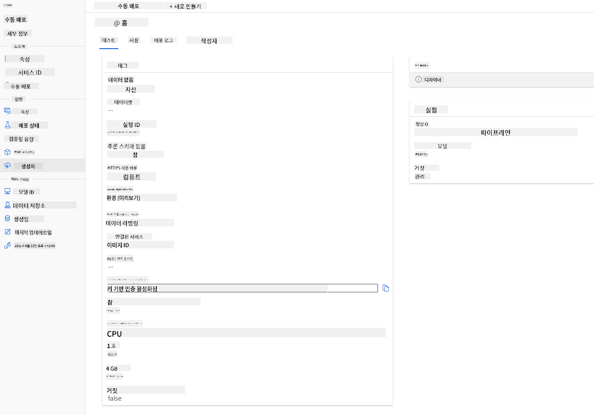

멋집니다! 이제 모델이 배포되었으니 엔드포인트 소비를 시작할 수 있습니다.

### 3.2 엔드포인트 소비

"Consume" 탭을 클릭합니다. 여기에서 REST 엔드포인트와 소비 옵션에 대한 Python 스크립트를 확인할 수 있습니다. Python 코드를 읽어보세요.

이 스크립트는 로컬 머신에서 직접 실행할 수 있으며 엔드포인트를 소비합니다.

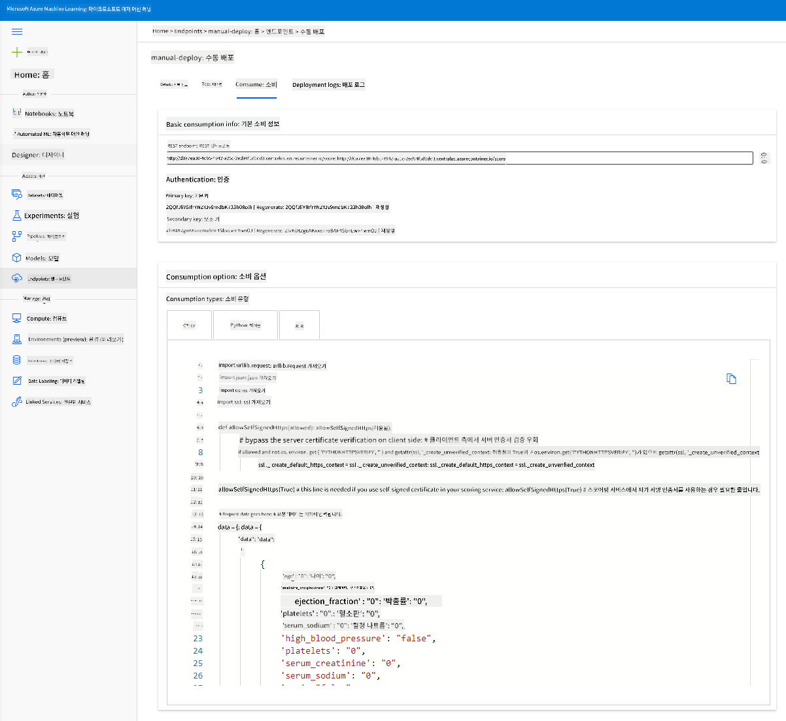

이 두 줄의 코드를 확인해 보세요:

```python
url = 'http://98e3715f-xxxx-xxxx-xxxx-9ec22d57b796.centralus.azurecontainer.io/score'
api_key = '' # Replace this with the API key for the web service
```  
`url` 변수는 소비 탭에서 찾을 수 있는 REST 엔드포인트이며, `api_key` 변수는 소비 탭에서 찾을 수 있는 기본 키입니다(인증을 활성화한 경우에만). 이 스크립트는 엔드포인트를 소비하는 방식입니다.

18. 스크립트를 실행하면 다음과 같은 출력이 표시됩니다:
```python
    b'"{\\"result\\": [true]}"'
    ```  
이는 제공된 데이터에 대한 심부전 예측이 참임을 의미합니다. 스크립트에 자동으로 생성된 데이터를 자세히 살펴보면 모든 값이 기본적으로 0이고 거짓임을 알 수 있습니다. 다음 입력 샘플로 데이터를 변경할 수 있습니다:

```python
data = {
    "data":
    [
        {
            'age': "0",
            'anaemia': "false",
            'creatinine_phosphokinase': "0",
            'diabetes': "false",
            'ejection_fraction': "0",
            'high_blood_pressure': "false",
            'platelets': "0",
            'serum_creatinine': "0",
            'serum_sodium': "0",
            'sex': "false",
            'smoking': "false",
            'time': "0",
        },
        {
            'age': "60",
            'anaemia': "false",
            'creatinine_phosphokinase': "500",
            'diabetes': "false",
            'ejection_fraction': "38",
            'high_blood_pressure': "false",
            'platelets': "260000",
            'serum_creatinine': "1.40",
            'serum_sodium': "137",
            'sex': "false",
            'smoking': "false",
            'time': "130",
        },
    ],
}
```  
스크립트는 다음을 반환해야 합니다:
```python
    b'"{\\"result\\": [true, false]}"'
    ```  

축하합니다! 배포된 모델을 소비하고 Azure ML에서 훈련을 완료했습니다!

> **_NOTE:_** 프로젝트가 완료되면 모든 리소스를 삭제하는 것을 잊지 마세요.

## 🚀 도전 과제

AutoML이 생성한 최상위 모델에 대한 설명과 세부 정보를 자세히 살펴보세요. 최적의 모델이 다른 모델보다 왜 더 나은지 이해하려고 노력하세요. 어떤 알고리즘이 비교되었나요? 그들 간의 차이점은 무엇인가요? 이 경우 최적의 모델이 더 잘 작동하는 이유는 무엇인가요?

## [강의 후 퀴즈](https://ff-quizzes.netlify.app/en/ds/)

## 복습 및 자기 학습

이 강의에서는 클라우드에서 저코드/무코드 방식으로 심부전 위험을 예측하는 모델을 훈련, 배포 및 소비하는 방법을 배웠습니다. 아직 하지 않았다면 AutoML이 생성한 최상위 모델에 대한 설명을 더 깊이 탐구하고 최적의 모델이 다른 모델보다 왜 더 나은지 이해하려고 노력하세요.

저코드/무코드 AutoML에 대해 더 자세히 알아보려면 이 [문서](https://docs.microsoft.com/azure/machine-learning/tutorial-first-experiment-automated-ml?WT.mc_id=academic-77958-bethanycheum&ocid=AID3041109)를 읽어보세요.

## 과제

[Azure ML에서 저코드/무코드 데이터 과학 프로젝트](assignment.md)

---

**면책 조항**:  
이 문서는 AI 번역 서비스 [Co-op Translator](https://github.com/Azure/co-op-translator)를 사용하여 번역되었습니다. 정확성을 위해 최선을 다하고 있으나, 자동 번역에는 오류나 부정확성이 포함될 수 있습니다. 원본 문서를 해당 언어로 작성된 상태에서 권위 있는 자료로 간주해야 합니다. 중요한 정보의 경우, 전문적인 인간 번역을 권장합니다. 이 번역 사용으로 인해 발생하는 오해나 잘못된 해석에 대해 당사는 책임을 지지 않습니다.  