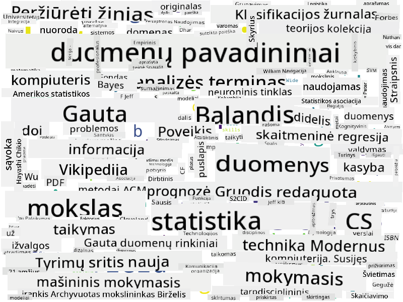

<!--
CO_OP_TRANSLATOR_METADATA:
{
  "original_hash": "2583a9894af7123b2fcae3376b14c035",
  "translation_date": "2025-08-31T05:57:08+00:00",
  "source_file": "1-Introduction/01-defining-data-science/README.md",
  "language_code": "lt"
}
-->
## Duomenų tipai

Kaip jau minėjome, duomenys yra visur. Tereikia juos tinkamai užfiksuoti! Naudinga atskirti **struktūrizuotus** ir **nestruktūrizuotus** duomenis. Pirmieji paprastai pateikiami gerai struktūrizuota forma, dažnai kaip lentelė ar lentelių rinkinys, o antrieji yra tiesiog failų rinkinys. Kartais taip pat galime kalbėti apie **pusiau struktūrizuotus** duomenis, kurie turi tam tikrą struktūrą, tačiau ji gali labai skirtis.

| Struktūrizuoti                                                              | Pusiau struktūrizuoti                                                                          | Nestruktūrizuoti                       |
| ---------------------------------------------------------------------------- | ---------------------------------------------------------------------------------------------- | --------------------------------------- |
| Žmonių sąrašas su jų telefono numeriais                                      | Vikipedijos puslapiai su nuorodomis                                                           | Enciklopedijos „Britannica“ tekstas    |
| Pastato kambarių temperatūra kas minutę per pastaruosius 20 metų            | Mokslinių straipsnių rinkinys JSON formatu su autoriais, publikavimo data ir santrauka         | Failų saugykla su įmonės dokumentais   |
| Duomenys apie amžių ir lytį visų žmonių, įeinančių į pastatą                 | Interneto puslapiai                                                                            | Neapdorotas vaizdo įrašas iš stebėjimo kameros |

## Iš kur gauti duomenų

Yra daugybė galimų duomenų šaltinių, ir visų jų išvardyti neįmanoma! Tačiau paminėkime keletą tipinių vietų, kur galite rasti duomenų:

* **Struktūrizuoti**
  - **Daiktų internetas** (IoT), įskaitant duomenis iš įvairių jutiklių, tokių kaip temperatūros ar slėgio jutikliai, suteikia daug naudingos informacijos. Pavyzdžiui, jei biuro pastatas aprūpintas IoT jutikliais, galime automatiškai valdyti šildymą ir apšvietimą, kad sumažintume išlaidas.
  - **Apklausos**, kurias prašome vartotojų užpildyti po pirkimo ar apsilankymo svetainėje.
  - **Elgsenos analizė** gali padėti suprasti, kaip giliai vartotojas naršo svetainėje ir kokia yra tipinė priežastis, kodėl jis ją palieka.
* **Nestruktūrizuoti**
  - **Tekstai** gali būti turtingas įžvalgų šaltinis, pavyzdžiui, bendras **nuotaikos įvertinimas** arba raktinių žodžių ir semantinės prasmės išgavimas.
  - **Vaizdai** ar **vaizdo įrašai**. Vaizdo įrašas iš stebėjimo kameros gali būti naudojamas eismo intensyvumui kelyje įvertinti ir informuoti žmones apie galimus kamščius.
  - Interneto serverio **žurnalai** gali padėti suprasti, kurie mūsų svetainės puslapiai lankomi dažniausiai ir kiek laiko juose praleidžiama.
* **Pusiau struktūrizuoti**
  - **Socialinių tinklų** grafai gali būti puikūs duomenų šaltiniai apie vartotojų asmenybes ir potencialų efektyvumą skleidžiant informaciją.
  - Kai turime daugybę nuotraukų iš vakarėlio, galime bandyti išgauti **grupės dinamikos** duomenis, sudarydami žmonių, kurie fotografavosi kartu, grafą.

Žinodami įvairius galimus duomenų šaltinius, galite pagalvoti apie skirtingus scenarijus, kur duomenų mokslo metodai gali būti pritaikyti situacijai geriau suprasti ir verslo procesams tobulinti.

## Ką galima daryti su duomenimis

Duomenų moksle mes koncentruojamės į šiuos duomenų kelionės etapus:

Žinoma, priklausomai nuo konkrečių duomenų, kai kurie etapai gali būti praleisti (pvz., kai jau turime duomenis duomenų bazėje arba kai nereikia modelio mokymo), o kai kurie etapai gali būti kartojami kelis kartus (pvz., duomenų apdorojimas).

## Skaitmenizacija ir skaitmeninė transformacija

Per pastarąjį dešimtmetį daugelis įmonių pradėjo suprasti duomenų svarbą priimant verslo sprendimus. Norint pritaikyti duomenų mokslo principus verslo valdymui, pirmiausia reikia surinkti tam tikrus duomenis, t. y. verslo procesus paversti skaitmenine forma. Tai vadinama **skaitmenizacija**. Duomenų mokslo metodų taikymas šiems duomenims sprendimams priimti gali reikšmingai padidinti produktyvumą (ar net pakeisti verslo kryptį), ir tai vadinama **skaitmenine transformacija**.

Pavyzdžiui, tarkime, turime duomenų mokslo kursą (kaip šis), kurį pristatome internetu studentams, ir norime jį patobulinti naudodami duomenų mokslą. Kaip tai galime padaryti?

Galime pradėti klausdami: „Ką galima skaitmenizuoti?“ Paprasčiausias būdas būtų matuoti, kiek laiko kiekvienas studentas užtrunka baigdamas kiekvieną modulį, ir įvertinti įgytas žinias, pateikiant daugybinio pasirinkimo testą kiekvieno modulio pabaigoje. Apskaičiuodami vidutinį užbaigimo laiką visiems studentams, galime nustatyti, kurie moduliai studentams kelia daugiausia sunkumų, ir dirbti juos supaprastinant.
Galite teigti, kad toks požiūris nėra idealus, nes moduliai gali būti skirtingo ilgio. Tikriausiai būtų teisingiau laiką padalyti iš modulio ilgio (simbolių skaičiumi) ir palyginti šias reikšmes vietoj to.
Kai pradedame analizuoti daugybinio pasirinkimo testų rezultatus, galime pabandyti nustatyti, su kokiomis sąvokomis studentams sunkiausia susidoroti, ir naudoti šią informaciją turiniui tobulinti. Tam reikia sukurti testus taip, kad kiekvienas klausimas būtų susietas su tam tikra sąvoka ar žinių dalimi.

Jei norime eiti dar sudėtingesniu keliu, galime sudaryti grafiką, kuriame būtų pavaizduotas laikas, praleistas kiekviename modulyje, palyginti su studentų amžiaus kategorija. Galime pastebėti, kad kai kurioms amžiaus grupėms užtrunka neproporcingai ilgai užbaigti modulį arba kad studentai meta mokymąsi jo nebaigę. Tai gali padėti pateikti amžiaus rekomendacijas moduliui ir sumažinti žmonių nusivylimą dėl neteisingų lūkesčių.

## 🚀 Iššūkis

Šiame iššūkyje bandysime rasti sąvokas, susijusias su duomenų mokslo sritimi, analizuodami tekstus. Paimsime Vikipedijos straipsnį apie duomenų mokslą, atsisiųsime ir apdorosime tekstą, o tada sukursime žodžių debesį, panašų į šį:

Apsilankykite [`notebook.ipynb`](../../../../../../../../../1-Introduction/01-defining-data-science/notebook.ipynb ':ignore'), kad peržiūrėtumėte kodą. Taip pat galite paleisti kodą ir pamatyti, kaip jis realiuoju laiku atlieka visus duomenų transformavimus.

> Jei nežinote, kaip paleisti kodą Jupyter užrašinėje, peržiūrėkite [šį straipsnį](https://soshnikov.com/education/how-to-execute-notebooks-from-github/).

## [Po paskaitos testas](https://purple-hill-04aebfb03.1.azurestaticapps.net/quiz/1)

## Užduotys

* **Užduotis 1**: Pakeiskite aukščiau pateiktą kodą, kad rastumėte susijusias sąvokas **Didžiųjų duomenų** ir **Mašininio mokymosi** srityse.
* **Užduotis 2**: [Pagalvokite apie duomenų mokslo scenarijus](assignment.md)

## Kreditas

Šią pamoką su ♥️ parengė [Dmitry Soshnikov](http://soshnikov.com)

---

**Atsakomybės apribojimas**:  
Šis dokumentas buvo išverstas naudojant dirbtinio intelekto vertimo paslaugą [Co-op Translator](https://github.com/Azure/co-op-translator). Nors siekiame tikslumo, atkreipiame dėmesį, kad automatiniai vertimai gali turėti klaidų ar netikslumų. Originalus dokumentas jo gimtąja kalba turėtų būti laikomas autoritetingu šaltiniu. Kritinei informacijai rekomenduojama naudoti profesionalų žmogaus vertimą. Mes neprisiimame atsakomybės už nesusipratimus ar klaidingus aiškinimus, kylančius dėl šio vertimo naudojimo.