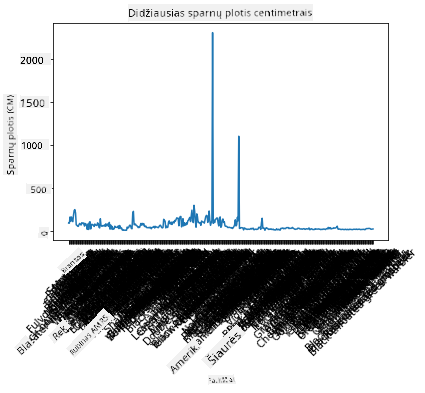
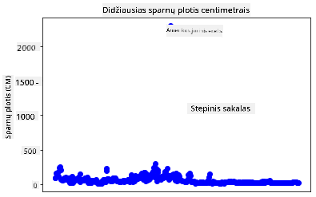
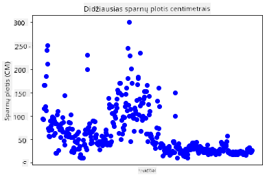
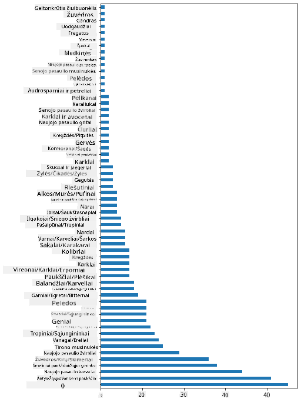
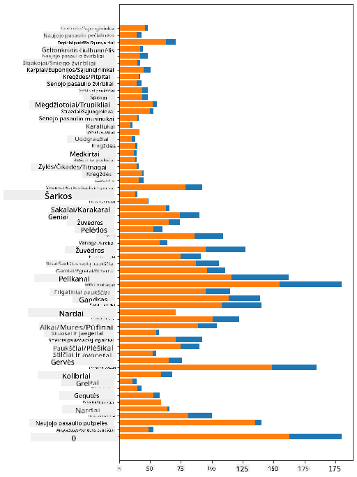

<!--
CO_OP_TRANSLATOR_METADATA:
{
  "original_hash": "43c402d9d90ae6da55d004519ada5033",
  "translation_date": "2025-08-31T05:51:49+00:00",
  "source_file": "3-Data-Visualization/09-visualization-quantities/README.md",
  "language_code": "lt"
}
-->
# Vizualizuojame kiekius

| ](../../sketchnotes/09-Visualizing-Quantities.png)|
|:---:|
| Vizualizuojame kiekius - _Sketchnote by [@nitya](https://twitter.com/nitya)_ |

Šioje pamokoje sužinosite, kaip naudoti vieną iš daugelio Python bibliotekų, kad sukurtumėte įdomias vizualizacijas, susijusias su kiekių koncepcija. Naudodami išvalytą duomenų rinkinį apie Minesotos paukščius, galite sužinoti daug įdomių faktų apie vietinę laukinę gamtą.  
## [Prieš paskaitos testas](https://purple-hill-04aebfb03.1.azurestaticapps.net/quiz/16)

## Stebėkite sparnų ilgį su Matplotlib

Puiki biblioteka, skirta kurti tiek paprastus, tiek sudėtingus įvairių tipų grafikus ir diagramas, yra [Matplotlib](https://matplotlib.org/stable/index.html). Bendrai kalbant, duomenų vaizdavimo procesas naudojant šias bibliotekas apima duomenų rėmelio dalių identifikavimą, kurias norite analizuoti, reikalingų transformacijų atlikimą, x ir y ašių reikšmių priskyrimą, grafiko tipo pasirinkimą ir jo rodymą. Matplotlib siūlo daugybę vizualizacijų, tačiau šioje pamokoje sutelksime dėmesį į tas, kurios labiausiai tinka kiekių vizualizavimui: linijinius grafikus, sklaidos diagramas ir stulpelines diagramas.

> ✅ Pasirinkite geriausią grafiką, atitinkantį jūsų duomenų struktūrą ir pasakojimą, kurį norite perteikti.  
> - Norint analizuoti tendencijas laikui bėgant: linijinis grafikas  
> - Norint palyginti reikšmes: stulpeliai, kolonos, pyragas, sklaidos diagrama  
> - Norint parodyti, kaip dalys susijusios su visuma: pyragas  
> - Norint parodyti duomenų pasiskirstymą: sklaidos diagrama, stulpeliai  
> - Norint parodyti tendencijas: linijinis grafikas, kolonos  
> - Norint parodyti ryšius tarp reikšmių: linijinis grafikas, sklaidos diagrama, burbulų diagrama  

Jei turite duomenų rinkinį ir norite sužinoti, kiek tam tikro elemento yra įtraukta, viena iš pirmųjų užduočių bus patikrinti jo reikšmes.  

✅ Puikūs „cheat sheet“ dokumentai Matplotlib yra prieinami [čia](https://matplotlib.org/cheatsheets/cheatsheets.pdf).

## Sukurkite linijinį grafiką apie paukščių sparnų ilgius

Atidarykite `notebook.ipynb` failą, esantį šios pamokos aplanko šaknyje, ir pridėkite langelį.

> Pastaba: duomenys saugomi šio repo šaknyje `/data` aplanke.

```python
import pandas as pd
import matplotlib.pyplot as plt
birds = pd.read_csv('../../data/birds.csv')
birds.head()
```  
Šie duomenys yra tekstų ir skaičių mišinys:

|      | Pavadinimas                  | MokslinisPavadinimas   | Kategorija            | Būrys        | Šeima    | Gentis      | ApsaugosStatusas | MinIlgis | MaxIlgis | MinKūnoMasė | MaxKūnoMasė | MinSparnųIlgis | MaxSparnųIlgis |
| ---: | :--------------------------- | :--------------------- | :-------------------- | :----------- | :------- | :---------- | :----------------- | --------: | --------: | ----------: | ----------: | ----------: | ----------: |
|    0 | Juodapilvis švilpikas        | Dendrocygna autumnalis | Antys/Giesmininkai/Vandenspaukščiai | Anseriformes | Anatidae | Dendrocygna | LC                 |        47 |        56 |         652 |        1020 |          76 |          94 |
|    1 | Rausvas švilpikas            | Dendrocygna bicolor    | Antys/Giesmininkai/Vandenspaukščiai | Anseriformes | Anatidae | Dendrocygna | LC                 |        45 |        53 |         712 |        1050 |          85 |          93 |
|    2 | Sniego žąsis                 | Anser caerulescens     | Antys/Giesmininkai/Vandenspaukščiai | Anseriformes | Anatidae | Anser       | LC                 |        64 |        79 |        2050 |        4050 |         135 |         165 |
|    3 | Roso žąsis                   | Anser rossii           | Antys/Giesmininkai/Vandenspaukščiai | Anseriformes | Anatidae | Anser       | LC                 |      57.3 |        64 |        1066 |        1567 |         113 |         116 |
|    4 | Didžioji baltakaktė žąsis    | Anser albifrons        | Antys/Giesmininkai/Vandenspaukščiai | Anseriformes | Anatidae | Anser       | LC                 |        64 |        81 |        1930 |        3310 |         130 |         165 |

Pradėkime vaizduoti kai kuriuos skaitinius duomenis naudodami paprastą linijinį grafiką. Tarkime, norite pamatyti šių įdomių paukščių maksimalų sparnų ilgį.

```python
wingspan = birds['MaxWingspan'] 
wingspan.plot()
```  


Ką pastebite iš karto? Atrodo, kad yra bent vienas išskirtinis atvejis – tai gana įspūdingas sparnų ilgis! 2300 centimetrų sparnų ilgis prilygsta 23 metrams – ar Minesotoje skraido pterodaktiliai? Išsiaiškinkime.

Nors galėtumėte greitai surūšiuoti Excel programoje, kad rastumėte tuos išskirtinius atvejus, kurie greičiausiai yra klaidos, tęskite vizualizacijos procesą dirbdami tiesiai iš grafiko.

Pridėkite x ašies etiketes, kad parodytumėte, kokie paukščiai yra nagrinėjami:

```
plt.title('Max Wingspan in Centimeters')
plt.ylabel('Wingspan (CM)')
plt.xlabel('Birds')
plt.xticks(rotation=45)
x = birds['Name'] 
y = birds['MaxWingspan']

plt.plot(x, y)

plt.show()
```  


Net ir pasukus etiketes 45 laipsniais, jų per daug, kad būtų galima perskaityti. Išbandykime kitą strategiją: pažymėkime tik tuos išskirtinius atvejus ir nustatykime etiketes grafike. Galite naudoti sklaidos diagramą, kad būtų daugiau vietos etiketėms:

```python
plt.title('Max Wingspan in Centimeters')
plt.ylabel('Wingspan (CM)')
plt.tick_params(axis='both',which='both',labelbottom=False,bottom=False)

for i in range(len(birds)):
    x = birds['Name'][i]
    y = birds['MaxWingspan'][i]
    plt.plot(x, y, 'bo')
    if birds['MaxWingspan'][i] > 500:
        plt.text(x, y * (1 - 0.05), birds['Name'][i], fontsize=12)
    
plt.show()
```  
Kas čia vyksta? Naudojote `tick_params`, kad paslėptumėte apatines etiketes, ir tada sukūrėte ciklą per savo paukščių duomenų rinkinį. Vaizduodami grafiką su mažais apvaliais mėlynais taškais, naudodami `bo`, patikrinote, ar yra paukščių, kurių maksimalus sparnų ilgis viršija 500, ir jei taip, šalia taško parodėte jų etiketę. Etiketes šiek tiek paslinkote y ašyje (`y * (1 - 0.05)`) ir kaip etiketę naudojote paukščio pavadinimą.

Ką atradote?

  
## Filtruokite savo duomenis

Tiek Plikasis erelis, tiek Prerijų sakalas, nors greičiausiai labai dideli paukščiai, atrodo neteisingai pažymėti, su papildomu `0` pridėtu prie jų maksimalaus sparnų ilgio. Mažai tikėtina, kad sutiksite Plikąjį erelį su 25 metrų sparnų ilgiu, bet jei taip, praneškite mums! Sukurkime naują duomenų rėmelį be šių dviejų išskirtinių atvejų:

```python
plt.title('Max Wingspan in Centimeters')
plt.ylabel('Wingspan (CM)')
plt.xlabel('Birds')
plt.tick_params(axis='both',which='both',labelbottom=False,bottom=False)
for i in range(len(birds)):
    x = birds['Name'][i]
    y = birds['MaxWingspan'][i]
    if birds['Name'][i] not in ['Bald eagle', 'Prairie falcon']:
        plt.plot(x, y, 'bo')
plt.show()
```  

Filtruodami išskirtinius atvejus, jūsų duomenys tampa nuoseklesni ir suprantamesni.



Dabar, kai turime švaresnį duomenų rinkinį bent jau sparnų ilgio atžvilgiu, sužinokime daugiau apie šiuos paukščius.

Nors linijiniai ir sklaidos grafikai gali parodyti informaciją apie duomenų reikšmes ir jų pasiskirstymą, norime pagalvoti apie reikšmes, esančias šiame duomenų rinkinyje. Galėtumėte sukurti vizualizacijas, kad atsakytumėte į šiuos klausimus apie kiekius:

> Kiek paukščių kategorijų yra ir kokie jų skaičiai?  
> Kiek paukščių yra išnykę, nykstantys, reti ar paplitę?  
> Kiek yra įvairių genčių ir būrių pagal Linėjaus terminologiją?  
## Tyrinėkite stulpelines diagramas

Stulpelinės diagramos yra praktiškos, kai reikia parodyti duomenų grupes. Išnagrinėkime paukščių kategorijas, esančias šiame duomenų rinkinyje, kad pamatytume, kuri yra dažniausia pagal skaičių.

Notebook faile sukurkite paprastą stulpelinę diagramą.

✅ Pastaba, galite arba filtruoti du išskirtinius paukščius, kuriuos identifikavome ankstesniame skyriuje, redaguoti jų sparnų ilgio klaidą arba palikti juos šiems pratimams, kurie nepriklauso nuo sparnų ilgio reikšmių.

Jei norite sukurti stulpelinę diagramą, galite pasirinkti duomenis, į kuriuos norite sutelkti dėmesį. Stulpelinės diagramos gali būti sukurtos iš neapdorotų duomenų:

```python
birds.plot(x='Category',
        kind='bar',
        stacked=True,
        title='Birds of Minnesota')

```  


Tačiau ši stulpelinė diagrama yra neįskaitoma, nes yra per daug nesugrupuotų duomenų. Jums reikia pasirinkti tik tuos duomenis, kuriuos norite vaizduoti, todėl pažvelkime į paukščių ilgį pagal jų kategoriją.

Filtruokite savo duomenis, kad įtrauktumėte tik paukščių kategoriją.

✅ Atkreipkite dėmesį, kad naudojate Pandas duomenų valdymui, o Matplotlib – diagramų kūrimui.

Kadangi yra daug kategorijų, galite parodyti šią diagramą vertikaliai ir pakoreguoti jos aukštį, kad atitiktų visus duomenis:

```python
category_count = birds.value_counts(birds['Category'].values, sort=True)
plt.rcParams['figure.figsize'] = [6, 12]
category_count.plot.barh()
```  


Ši stulpelinė diagrama aiškiai parodo paukščių skaičių kiekvienoje kategorijoje. Akimirksniu matote, kad didžiausias paukščių skaičius šiame regione yra Antys/Giesmininkai/Vandenspaukščiai kategorijoje. Minesota yra „10 000 ežerų kraštas“, todėl tai nestebina!

✅ Išbandykite kitus skaičiavimus šiame duomenų rinkinyje. Ar kas nors jus nustebina?

## Duomenų palyginimas

Galite išbandyti skirtingus grupuotų duomenų palyginimus, sukurdami naujas ašis. Išbandykite paukščio MaxIlgio palyginimą pagal jo kategoriją:

```python
maxlength = birds['MaxLength']
plt.barh(y=birds['Category'], width=maxlength)
plt.rcParams['figure.figsize'] = [6, 12]
plt.show()
```  


Čia niekas nestebina: kolibriai turi mažiausią MaxIlgį, palyginti su pelikanais ar žąsimis. Gerai, kai duomenys logiškai atitinka!

Galite sukurti įdomesnes stulpelinių diagramų vizualizacijas, uždėdami duomenis vieną ant kito. Uždėkime Minimalų ir Maksimalų Ilgį ant tam tikros paukščių kategorijos:

```python
minLength = birds['MinLength']
maxLength = birds['MaxLength']
category = birds['Category']

plt.barh(category, maxLength)
plt.barh(category, minLength)

plt.show()
```  
Šiame grafike galite matyti kiekvienos paukščių kategorijos Minimalų ir Maksimalų Ilgio diapazoną. Galite drąsiai teigti, kad, remiantis šiais duomenimis, kuo didesnis paukštis, tuo platesnis jo ilgio diapazonas. Įdomu!



## 🚀 Iššūkis

Šis paukščių duomenų rinkinys siūlo daugybę informacijos apie įvairius paukščių tipus tam tikroje ekosistemoje. Paieškokite internete ir pažiūrėkite, ar galite rasti kitų paukščių duomenų rinkinių. Praktikuokite diagramų ir grafikų kūrimą apie šiuos paukščius, kad atrastumėte faktus, kurių nežinojote.  
## [Po paskaitos testas](https://purple-hill-04aebfb03.1.azurestaticapps.net/quiz/17)

## Apžvalga ir savarankiškas mokymasis

Pirma pamoka suteikė jums informacijos apie tai, kaip naudoti Matplotlib kiekių vizualizavimui. Atlikite tyrimus apie kitus būdus dirbti su duomenų rinkiniais vizualizacijai. [Plotly](https://github.com/plotly/plotly.py) yra viena iš jų, kurios neaptarsime šiose pamokose, todėl pažiūrėkite, ką ji gali pasiūlyti.  
## Užduotis

[Linijos, Sklaidos ir Stulpeliai](assignment.md)

---

**Atsakomybės apribojimas**:  
Šis dokumentas buvo išverstas naudojant dirbtinio intelekto vertimo paslaugą [Co-op Translator](https://github.com/Azure/co-op-translator). Nors siekiame tikslumo, atkreipiame dėmesį, kad automatiniai vertimai gali turėti klaidų ar netikslumų. Originalus dokumentas jo gimtąja kalba turėtų būti laikomas autoritetingu šaltiniu. Kritinei informacijai rekomenduojama naudotis profesionalių vertėjų paslaugomis. Mes neprisiimame atsakomybės už nesusipratimus ar klaidingus aiškinimus, kylančius dėl šio vertimo naudojimo.